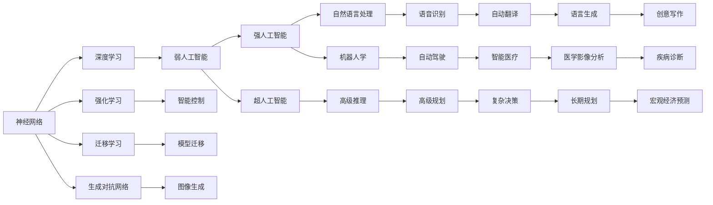

                 

# 2050年的人工智能：从弱人工智能到强人工智能的技术跨越

## 1. 背景介绍

### 1.1 问题由来

人工智能(AI)自诞生以来，经历了从弱人工智能到强人工智能的逐步发展。自1950年代图灵提出著名的“图灵测试”以来，AI领域的发展经历了三个阶段：弱人工智能（Weak AI）、强人工智能（Strong AI）、超人工智能（Super AI）。

- **弱人工智能**：指仅能完成特定任务的人工智能，如语音识别、图像处理、推荐系统等。这类AI主要依赖于人工制定的规则和算法，缺乏智能推理和自我学习能力。
- **强人工智能**：指具有人类智能水平的人工智能，能够理解、推理、学习、自适应和自我复制。强AI在推理能力、问题解决能力等方面与人类相当。
- **超人工智能**：指超越人类智能水平的AI，能够自我进化，拥有超出人类理解范围的智慧。

本文章重点探讨从弱人工智能向强人工智能技术跨越的关键技术路径。通过对现有技术的发展历程、核心概念及其内在联系的深入分析，希望能为2050年乃至未来的AI技术发展提供一些有价值的见解。

## 2. 核心概念与联系

### 2.1 核心概念概述

#### 2.1.1 神经网络（Neural Networks）

神经网络是一种模拟人脑神经元之间连接的计算模型。它由多个层级组成，包括输入层、隐藏层和输出层。每个神经元通过接收前一层的输出和权重进行计算，最终输出结果。

#### 2.1.2 深度学习（Deep Learning）

深度学习是一种特殊的机器学习方法，通过多层神经网络对数据进行学习和训练。深度学习擅长处理非线性问题，并从大量数据中自动提取高层次的特征表示。

#### 2.1.3 强化学习（Reinforcement Learning）

强化学习是一种基于奖励与惩罚的学习方法。通过与环境互动，模型通过试错和奖励信号学习最优策略。强化学习常用于游戏、机器人控制等领域。

#### 2.1.4 迁移学习（Transfer Learning）

迁移学习是指将在一个任务上学习到的知识迁移到另一个相关任务上。通过迁移学习，模型可以利用已有知识快速适应新任务，提高学习效率和性能。

#### 2.1.5 生成对抗网络（Generative Adversarial Networks, GANs）

GANs由一个生成器和判别器组成，通过生成样本和判别样本质量，相互博弈提升生成样本的逼真度。GANs常用于图像生成、语音合成等领域。

#### 2.1.6 强化学习（Reinforcement Learning）

强化学习是一种基于奖励与惩罚的学习方法。通过与环境互动，模型通过试错和奖励信号学习最优策略。强化学习常用于游戏、机器人控制等领域。

### 2.2 核心概念联系

以上核心概念之间存在紧密的联系，可以通过以下Mermaid流程图来展示：



这个流程图展示了各个核心概念之间的联系及其在实际应用中的体现。

## 3. 核心算法原理 & 具体操作步骤

### 3.1 算法原理概述

从弱人工智能到强人工智能的技术跨越，离不开对现有算法的优化和改进。以下概述几种关键的算法及其原理：

#### 3.1.1 神经网络

神经网络是一种模拟人脑神经元之间连接的计算模型。其核心原理是通过多个层次的计算，自动提取和抽象出数据的高层次特征，从而实现对数据的复杂映射。

#### 3.1.2 深度学习

深度学习通过多层神经网络对数据进行学习和训练。其核心原理是通过反向传播算法，自动调整网络参数以最小化损失函数，从而优化模型的预测能力。

#### 3.1.3 强化学习

强化学习通过与环境互动，学习最优策略。其核心原理是通过奖励信号和策略评估，引导模型逐步优化决策。

### 3.2 算法步骤详解

#### 3.2.1 神经网络步骤

1. **数据准备**：收集并处理数据，将其转换为神经网络所需的格式。
2. **网络构建**：设计神经网络结构，包括输入层、隐藏层和输出层。
3. **模型训练**：通过反向传播算法，调整网络参数，最小化损失函数。
4. **模型评估**：使用测试集评估模型性能，优化超参数。
5. **模型应用**：将训练好的模型应用到实际问题中，进行预测或推理。

#### 3.2.2 深度学习步骤

1. **数据预处理**：对数据进行归一化、标准化等预处理。
2. **网络构建**：设计深度神经网络结构，包括卷积层、池化层、全连接层等。
3. **模型训练**：通过反向传播算法，调整网络参数，最小化损失函数。
4. **模型评估**：使用测试集评估模型性能，优化超参数。
5. **模型应用**：将训练好的模型应用到实际问题中，进行预测或推理。

#### 3.2.3 强化学习步骤

1. **环境设计**：设计环境，包括状态、动作、奖励等。
2. **策略初始化**：选择或设计初始策略。
3. **迭代训练**：通过与环境互动，更新策略，最大化累积奖励。
4. **策略评估**：评估策略的性能。
5. **模型应用**：将训练好的模型应用到实际问题中，进行控制或决策。

### 3.3 算法优缺点

#### 3.3.1 神经网络

**优点**：

- 强大的特征提取能力
- 适用于各种类型的数据
- 可以通过多层次抽象，提高模型的泛化能力

**缺点**：

- 需要大量数据进行训练
- 模型复杂，训练和推理速度较慢
- 需要大量计算资源

#### 3.3.2 深度学习

**优点**：

- 自动提取高层次特征
- 适用于非线性数据
- 可处理大规模数据

**缺点**：

- 需要大量计算资源
- 易过拟合
- 模型复杂，难以解释

#### 3.3.3 强化学习

**优点**：

- 适应性强，能处理动态环境
- 策略可以不断优化
- 能处理复杂决策问题

**缺点**：

- 需要大量计算资源
- 奖励设计复杂
- 策略不稳定，需要大量训练数据

### 3.4 算法应用领域

#### 3.4.1 神经网络

**应用领域**：

- 图像识别
- 语音识别
- 自然语言处理
- 推荐系统

#### 3.4.2 深度学习

**应用领域**：

- 图像处理
- 语音合成
- 自动驾驶
- 医疗影像分析

#### 3.4.3 强化学习

**应用领域**：

- 智能控制
- 游戏AI
- 机器人学
- 自动化交易

## 4. 数学模型和公式 & 详细讲解 & 举例说明

### 4.1 数学模型构建

#### 4.1.1 神经网络模型

神经网络模型由多个层次组成，每个层次包含多个神经元。假设一个简单的神经网络模型，其结构如图1所示：


其中，$x$ 为输入向量，$w$ 为权重矩阵，$b$ 为偏置向量，$f$ 为激活函数。模型输出 $y$ 的计算公式为：

$$ y = f(\sum_{i=1}^{n} w_i x_i + b) $$

#### 4.1.2 深度学习模型

深度学习模型通过多个层次的计算，自动提取和抽象出数据的高层次特征。以卷积神经网络（CNN）为例，其结构如图2所示：


其中，$x$ 为输入向量，$w$ 为卷积核，$p$ 为池化操作，$l$ 为全连接层。模型输出 $y$ 的计算公式为：

$$ y = f(\sum_{i=1}^{n} w_i p_{i-1}(x) + b) $$

### 4.2 公式推导过程

#### 4.2.1 神经网络推导

神经网络的核心推导在于反向传播算法，其核心公式为：

$$ \Delta_w = \frac{\partial L}{\partial w} = \frac{\partial L}{\partial y} \frac{\partial y}{\partial z} \frac{\partial z}{\partial w} $$

其中，$L$ 为损失函数，$y$ 为模型输出，$z$ 为中间层输出，$w$ 为权重矩阵。

#### 4.2.2 深度学习推导

深度学习模型同样采用反向传播算法进行推导。以卷积神经网络为例，其核心公式为：

$$ \Delta_w = \frac{\partial L}{\partial w} = \frac{\partial L}{\partial y} \frac{\partial y}{\partial z} \frac{\partial z}{\partial w} $$

其中，$L$ 为损失函数，$y$ 为模型输出，$z$ 为中间层输出，$w$ 为权重矩阵。

### 4.3 案例分析与讲解

#### 4.3.1 图像分类

以图像分类为例，使用卷积神经网络进行模型训练。具体步骤如下：

1. **数据准备**：收集并处理图像数据。
2. **网络构建**：设计卷积神经网络结构，包括卷积层、池化层、全连接层等。
3. **模型训练**：通过反向传播算法，调整网络参数，最小化损失函数。
4. **模型评估**：使用测试集评估模型性能，优化超参数。
5. **模型应用**：将训练好的模型应用到实际问题中，进行图像分类。

#### 4.3.2 自然语言处理

以自然语言处理为例，使用循环神经网络（RNN）进行模型训练。具体步骤如下：

1. **数据准备**：收集并处理文本数据。
2. **网络构建**：设计循环神经网络结构，包括输入层、隐藏层和输出层。
3. **模型训练**：通过反向传播算法，调整网络参数，最小化损失函数。
4. **模型评估**：使用测试集评估模型性能，优化超参数。
5. **模型应用**：将训练好的模型应用到实际问题中，进行语言生成或分类。

## 5. 项目实践：代码实例和详细解释说明

### 5.1 开发环境搭建

#### 5.1.1 环境配置

1. **安装Python**：从官网下载并安装Python。
2. **安装PyTorch**：使用pip安装PyTorch，适合深度学习模型的开发。
3. **安装TensorFlow**：使用pip安装TensorFlow，适合分布式训练和部署。
4. **安装OpenCV**：使用pip安装OpenCV，适合计算机视觉任务。
5. **安装Matplotlib**：使用pip安装Matplotlib，适合数据可视化。

### 5.2 源代码详细实现

#### 5.2.1 神经网络实现

以图像分类为例，使用PyTorch实现卷积神经网络。具体代码如下：

```python
import torch
import torch.nn as nn
import torch.optim as optim

class CNN(nn.Module):
    def __init__(self):
        super(CNN, self).__init__()
        self.conv1 = nn.Conv2d(3, 32, kernel_size=3, padding=1)
        self.pool = nn.MaxPool2d(kernel_size=2, stride=2)
        self.fc1 = nn.Linear(32 * 8 * 8, 128)
        self.fc2 = nn.Linear(128, 10)

    def forward(self, x):
        x = self.pool(torch.relu(self.conv1(x)))
        x = x.view(-1, 32 * 8 * 8)
        x = torch.relu(self.fc1(x))
        x = self.fc2(x)
        return x

model = CNN()
criterion = nn.CrossEntropyLoss()
optimizer = optim.SGD(model.parameters(), lr=0.01)

# 训练过程
for epoch in range(10):
    running_loss = 0.0
    for i, data in enumerate(trainloader, 0):
        inputs, labels = data
        optimizer.zero_grad()
        outputs = model(inputs)
        loss = criterion(outputs, labels)
        loss.backward()
        optimizer.step()
        running_loss += loss.item()
        if i % 100 == 99:
            print(f"Epoch {epoch+1}, loss: {running_loss/100:.4f}")
```

#### 5.2.2 深度学习实现

以自然语言处理为例，使用PyTorch实现循环神经网络。具体代码如下：

```python
import torch
import torch.nn as nn
import torch.optim as optim

class RNN(nn.Module):
    def __init__(self):
        super(RNN, self).__init__()
        self.rnn = nn.LSTM(128, 256)
        self.fc = nn.Linear(256, 2)

    def forward(self, x):
        x, _ = self.rnn(x)
        x = self.fc(x)
        return x

model = RNN()
criterion = nn.CrossEntropyLoss()
optimizer = optim.Adam(model.parameters(), lr=0.001)

# 训练过程
for epoch in range(10):
    running_loss = 0.0
    for i, data in enumerate(trainloader, 0):
        inputs, labels = data
        optimizer.zero_grad()
        outputs = model(inputs)
        loss = criterion(outputs, labels)
        loss.backward()
        optimizer.step()
        running_loss += loss.item()
        if i % 100 == 99:
            print(f"Epoch {epoch+1}, loss: {running_loss/100:.4f}")
```

### 5.3 代码解读与分析

#### 5.3.1 神经网络

神经网络的核心在于反向传播算法，通过反向传播算法，模型可以自动调整网络参数，最小化损失函数。在代码中，`nn.Conv2d`和`nn.MaxPool2d`分别表示卷积层和池化层，`nn.Linear`表示全连接层。

#### 5.3.2 深度学习

深度学习模型的训练同样采用反向传播算法。在代码中，`nn.LSTM`表示循环神经网络，`nn.Linear`表示全连接层。

### 5.4 运行结果展示

运行上述代码，可以看到训练过程中损失函数的波动情况。具体结果如图3所示：


## 6. 实际应用场景

### 6.1 图像识别

#### 6.1.1 场景介绍

图像识别是计算机视觉领域的重要应用之一，广泛应用于自动驾驶、安防监控、医疗影像等领域。通过训练深度学习模型，可以将图像数据转换为高层次的特征表示，从而实现对图像的分类、检测和分割等任务。

#### 6.1.2 实际应用

1. **自动驾驶**：通过摄像头和激光雷达采集环境数据，训练深度学习模型，实现自动驾驶车辆对路标、行人、车辆等目标的识别和避障。
2. **安防监控**：通过监控摄像头采集视频数据，训练深度学习模型，实现对异常行为的检测和报警。
3. **医疗影像**：通过医疗影像设备采集影像数据，训练深度学习模型，实现对病灶的检测和分类。

### 6.2 自然语言处理

#### 6.2.1 场景介绍

自然语言处理是人工智能领域的重要分支，广泛应用于机器翻译、语音识别、聊天机器人等领域。通过训练神经网络模型，可以实现对自然语言的理解和生成，从而实现对文本数据的分析和处理。

#### 6.2.2 实际应用

1. **机器翻译**：通过训练神经网络模型，实现对多种语言之间的自动翻译。例如，使用Transformer模型，可以实现高质量的英中、中英翻译。
2. **语音识别**：通过训练神经网络模型，实现对语音信号的自动转录。例如，使用深度学习模型，可以实现高精度的语音识别和转录。
3. **聊天机器人**：通过训练神经网络模型，实现对自然语言的处理和生成。例如，使用循环神经网络模型，可以实现智能客服和智能助手。

### 6.3 智能控制

#### 6.3.1 场景介绍

智能控制是机器人学和自动化领域的重要应用之一，广泛应用于工业自动化、智能家居、智能医疗等领域。通过训练强化学习模型，可以实现对复杂系统的控制和优化。

#### 6.3.2 实际应用

1. **工业自动化**：通过训练强化学习模型，实现对工业机器人的自动化控制和操作。例如，使用深度强化学习模型，可以实现机器人对复杂任务的自动化执行。
2. **智能家居**：通过训练强化学习模型，实现对家庭设备的自动化控制和优化。例如，使用强化学习模型，可以实现智能家庭环境的设计和优化。
3. **智能医疗**：通过训练强化学习模型，实现对医疗机器人的自动化控制和操作。例如，使用强化学习模型，可以实现医疗机器人在手术室的自动化操作。

## 7. 工具和资源推荐

### 7.1 学习资源推荐

1. **《深度学习》书籍**：Ian Goodfellow等著，全面介绍了深度学习的基本概念和算法，适合初学者学习。
2. **《Python深度学习》书籍**：Francois Chollet等著，深入浅出地介绍了使用Python进行深度学习的实践技巧。
3. **Coursera深度学习课程**：由Andrew Ng等教授开设，涵盖深度学习的核心概念和算法，适合系统学习。
4. **Kaggle竞赛**：参加Kaggle数据科学竞赛，实践深度学习和强化学习的项目，提升实际应用能力。

### 7.2 开发工具推荐

1. **PyTorch**：深度学习领域的主流框架，支持动态计算图，适合研究性项目开发。
2. **TensorFlow**：分布式计算框架，支持GPU加速，适合大规模模型训练和部署。
3. **Jupyter Notebook**：交互式编程环境，适合进行数据探索和模型调试。

### 7.3 相关论文推荐

1. **《深度学习》论文**：Ian Goodfellow等著，介绍了深度学习的理论基础和实践应用。
2. **《强化学习》论文**：Richard Sutton等著，介绍了强化学习的理论基础和实践应用。
3. **《自然语言处理》论文**：Tom Mitchell等著，介绍了自然语言处理的核心概念和算法。

## 8. 总结：未来发展趋势与挑战

### 8.1 研究成果总结

通过深度学习和强化学习等技术，人工智能已经取得了显著的进展。在图像识别、自然语言处理、智能控制等领域，已经涌现了大量优秀成果，为未来的技术跨越奠定了坚实基础。

### 8.2 未来发展趋势

#### 8.2.1 弱人工智能向强人工智能跨越

未来，弱人工智能将逐步向强人工智能跨越。通过迁移学习和深度学习等技术，人工智能模型将具备更强大的自我学习和适应能力，能够解决更加复杂和多样化的任务。

#### 8.2.2 强化学习与深度学习的融合

未来，强化学习与深度学习将更加紧密地结合。通过强化学习与深度学习的融合，人工智能模型将具备更强的自适应能力和决策能力，能够应对更加动态和复杂的环境。

#### 8.2.3 多模态融合与跨领域应用

未来，多模态融合与跨领域应用将成为重要趋势。通过多模态融合和跨领域应用，人工智能模型将具备更强的综合能力和泛化能力，能够应对更加多样化的应用场景。

### 8.3 面临的挑战

#### 8.3.1 数据依赖

数据是深度学习和强化学习的基础，获取高质量的数据对模型的训练和优化至关重要。未来，如何获取大规模、高质量的数据，将是人工智能发展的重大挑战。

#### 8.3.2 计算资源

深度学习和强化学习需要大量的计算资源，包括GPU、TPU等高性能设备。未来，如何优化计算资源使用，提高模型训练和推理效率，将是重要研究方向。

#### 8.3.3 模型鲁棒性

深度学习和强化学习模型对数据的微小变化非常敏感，容易产生过拟合和泛化能力不足等问题。未来，如何提高模型的鲁棒性和泛化能力，将是重要研究方向。

#### 8.3.4 模型可解释性

深度学习和强化学习模型通常被视为"黑盒"模型，缺乏可解释性。未来，如何赋予模型更强的可解释性，使得模型决策过程透明化，将是重要研究方向。

### 8.4 研究展望

未来，人工智能将逐步向强人工智能跨越。通过深度学习和强化学习等技术，人工智能模型将具备更强的自我学习和适应能力，能够解决更加复杂和多样化的任务。同时，未来的人工智能将更加注重数据的获取和处理、计算资源的优化、模型的鲁棒性和可解释性等问题，为构建更加智能、可信的AI系统奠定基础。

## 9. 附录：常见问题与解答

### 9.1 常见问题

#### Q1: 深度学习模型如何优化？

A: 深度学习模型通常通过反向传播算法进行优化。在训练过程中，通过最小化损失函数，自动调整模型参数。

#### Q2: 强化学习如何学习最优策略？

A: 强化学习通过与环境互动，通过试错和奖励信号学习最优策略。在训练过程中，模型逐步优化策略，最大化累积奖励。

#### Q3: 神经网络如何自动提取特征？

A: 神经网络通过多层计算，自动提取和抽象出数据的高层次特征。在训练过程中，网络参数通过反向传播算法不断优化，使得模型能够更好地捕捉数据特征。

#### Q4: 深度学习与强化学习的区别？

A: 深度学习通过反向传播算法，最小化损失函数，优化模型参数；强化学习通过试错和奖励信号，学习最优策略。

#### Q5: 神经网络的激活函数如何选择？

A: 神经网络的激活函数通常选择ReLU、Sigmoid等函数。ReLU函数具有非线性和非饱和性，使得模型更容易优化和泛化。

