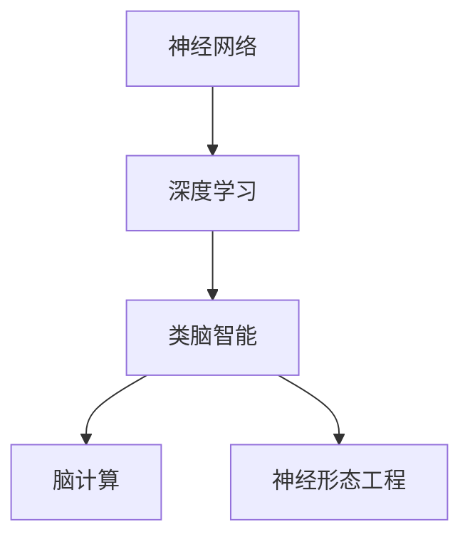
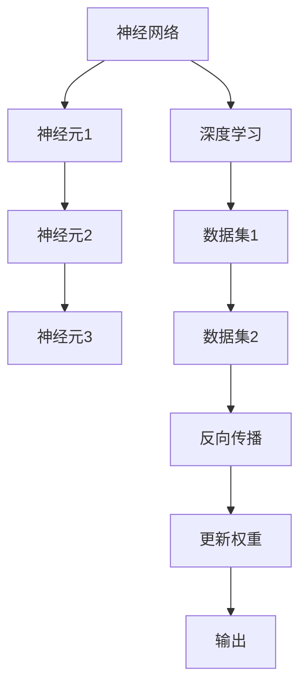

                 

# 2050年的人工智能：从深度学习到类脑智能的智能技术突破

## 1. 背景介绍

### 1.1 问题由来

人工智能(AI)正引领一场新的技术革命，逐步渗透到社会的各个领域，从自动化生产到医疗诊断，从金融交易到智能家居。而随着技术的不断进步，AI正逐步迈向更加智能、普适的目标，向人类智慧靠近。

深度学习作为AI技术的核心，利用多层神经网络对数据进行分层抽象和特征提取，已经在计算机视觉、自然语言处理、语音识别等领域取得了突破性进展。然而，深度学习基于大量数据进行训练，难以解释模型内部的决策机制，且需要大量计算资源，限制了其在某些应用场景中的使用。

类脑智能(Cerebral Intelligence)作为AI的新兴领域，借鉴人类大脑的工作机制，追求在计算能力、学习能力和适应性方面接近甚至超越人类智能。与传统的深度学习不同，类脑智能系统更注重神经元间的相互作用，可动态调整连接强度和拓扑结构，具有自我修复、自我学习和自我优化的能力。

未来，类脑智能有望在复杂系统控制、实时决策、情感识别、智能交互等高智能需求领域发挥更大的作用。2050年的AI技术将从深度学习走向类脑智能，实现真正的智能突破。

### 1.2 问题核心关键点

为了更好地理解类脑智能的发展脉络和技术细节，本节将介绍几个核心关键点：

- 神经网络：深度学习的基础结构，用于模拟人类神经元间的信号传递。
- 深度学习：基于神经网络的监督学习范式，用于数据分类、回归等任务。
- 类脑智能：模拟人类大脑工作机制，追求高效、低功耗、自适应的人工智能。
- 脑计算：研究如何利用硬件模拟神经网络，实现高效的脑计算过程。
- 神经形态工程：研究如何优化神经元间的连接方式和结构，提高计算效率和适应性。

这些关键点共同构成了类脑智能的基石，帮助我们深入理解类脑智能的原理和应用。

### 1.3 问题研究意义

探索类脑智能的突破性技术，对于推动AI技术的发展、拓展其应用领域、提升人类生活质量具有重要意义：

1. 提升计算效率。类脑智能利用神经元间的相互作用，可以在更低的能耗下实现高效计算。这对于大规模分布式系统、实时交互等场景尤为重要。
2. 增强适应能力。类脑智能具备自我学习和动态调整的能力，可以应对环境变化和复杂任务，提升系统的鲁棒性和适应性。
3. 推动认知科学。类脑智能研究有助于更好地理解人类认知机制，促进认知科学与人工智能的融合。
4. 创造新的应用场景。类脑智能能够处理更多高智能需求的任务，如复杂系统控制、实时决策等，有望引领新一轮技术变革。
5. 促进人机协同。类脑智能的智能交互能力，有助于构建更加自然、高效的人机协同系统，提升人机交互的体验和效率。

通过类脑智能技术的研究和应用，将引领AI技术迈向新的高峰，为人类社会带来更广阔的发展空间。

## 2. 核心概念与联系

### 2.1 核心概念概述

为了更好地理解类脑智能的核心概念和它们之间的联系，本节将详细阐述以下几个核心概念：

- **神经网络**：由多层神经元通过连接组成的计算图，每个神经元接收输入并计算输出，作为下一层神经元的输入。
- **深度学习**：基于神经网络的监督学习范式，通过反向传播算法进行模型训练，以减少预测误差。
- **类脑智能**：模仿人类大脑神经元之间的相互作用，通过自适应和自我修复机制实现高效、低功耗的计算。
- **脑计算**：利用电子器件模拟神经元间信号传递，实现高效的脑计算过程。
- **神经形态工程**：通过优化神经元间的连接方式和结构，提高神经网络计算效率和适应性。

这些核心概念之间的逻辑关系可以通过以下Mermaid流程图展示：



该流程图展示了神经网络作为深度学习的基础，类脑智能通过脑计算和神经形态工程实现了高效的计算和适应能力。

### 2.2 核心概念原理和架构的 Mermaid 流程图

为了更直观地展示神经网络、深度学习和类脑智能之间的联系，以下是具体的合码流程图：



该流程图展示了神经网络的基本结构，通过反向传播算法更新神经元间的权重，实现深度学习模型的训练。同时，类脑智能通过优化神经元间的连接和结构，提高了计算效率和适应能力。

## 3. 核心算法原理 & 具体操作步骤

### 3.1 算法原理概述

类脑智能的核心算法原理借鉴人类大脑的工作机制，通过神经元间的相互作用和动态调整实现高效的计算和适应。具体而言，类脑智能系统通过以下几个步骤完成计算：

1. **神经元激活**：接收输入信号，通过激活函数计算输出。
2. **信号传递**：将输出信号传递给下一层神经元，并进行权重更新。
3. **局部连接**：通过局部连接模式，增强神经元之间的相互作用。
4. **动态调整**：通过自我学习和适应机制，动态调整神经元之间的连接强度和拓扑结构。
5. **能量优化**：通过优化能量消耗，实现高效计算。

这些步骤通过自适应机制和优化算法，使类脑智能系统具备了高效、低功耗、自适应等特性，能够应对复杂的任务和环境。

### 3.2 算法步骤详解

类脑智能系统的算法步骤主要包括以下几个环节：

1. **神经元模型设计**：选择合适的神经元模型，如类Spike neuron、Hodgkin-Huxley model等，并定义其激活函数、膜电位等参数。
2. **信号传递模型**：设计神经元之间的连接方式，如全连接、局部连接、分层连接等，并定义信号传递机制。
3. **动态调整机制**：引入自我学习和适应机制，通过能量优化算法更新神经元间的权重和连接拓扑。
4. **训练与测试**：在训练数据集上训练类脑智能模型，并通过测试数据集评估其性能。
5. **优化与改进**：根据测试结果优化模型参数，提高模型的适应能力和计算效率。

### 3.3 算法优缺点

类脑智能系统具有以下优点：

- 高效计算：通过神经元间的相互作用，可以在更低的能耗下实现高效的计算。
- 自适应能力：具备自我学习和动态调整的能力，可以应对环境变化和复杂任务。
- 低功耗：通过优化神经元间的连接和结构，降低能耗，适用于便携和分布式系统。

同时，类脑智能系统也存在以下缺点：

- 计算复杂度高：神经元间的连接和参数优化复杂，需要高效的计算资源。
- 模型设计难度大：需要设计合适的神经元模型和信号传递机制，才能实现高效计算。
- 数据需求高：需要大量的训练数据和标注数据，才能获得较好的性能。

### 3.4 算法应用领域

类脑智能系统在以下领域具有广泛的应用前景：

- 复杂系统控制：如自动驾驶、机器人导航等，需要实时处理和决策。
- 实时交互：如智能家居、人机交互等，需要快速响应和高效计算。
- 实时监测：如医疗诊断、环境监测等，需要实时数据处理和分析。
- 智能推荐：如个性化推荐、广告推荐等，需要高效计算和动态调整。
- 情感识别：如智能客服、社交媒体情感分析等，需要高效处理自然语言。

## 4. 数学模型和公式 & 详细讲解 & 举例说明

### 4.1 数学模型构建

类脑智能系统的数学模型主要基于神经元间的相互作用和动态调整。假设有一个神经网络，由N个神经元组成，每个神经元接收输入信号 $x_i$，通过激活函数计算输出信号 $y_i$，并通过权重 $w_{ij}$ 与下一层神经元连接。

**数学模型**：
$$
y_i = f(w_{i1}x_{1} + w_{i2}x_{2} + ... + w_{in}x_{n})
$$
其中，$f$ 为激活函数，$w_{ij}$ 为权重参数。

### 4.2 公式推导过程

以下以Hodgkin-Huxley模型为例，推导神经元的激活函数和信号传递机制。

**Hodgkin-Huxley模型**：
$$
\frac{dx}{dt} = (I + Ex^{4} - u^4)\frac{V - E_{Na}}{g_{Na}} - (I + Ex^{3} - u^3)\frac{V - E_{K}}{g_{K}}
$$
其中，$x$ 为膜电位，$I$ 为输入电流，$u$ 为激活变量，$V$ 为膜电位，$E_{Na}, E_{K}$ 为钠离子、钾离子平衡电位，$g_{Na}, g_{K}$ 为钠离子、钾离子通道电导。

通过简化模型，可以得到神经元的激活函数：
$$
f(x) = (I + Ex^{4} - u^4)\frac{V - E_{Na}}{g_{Na}} - (I + Ex^{3} - u^3)\frac{V - E_{K}}{g_{K}}
$$

### 4.3 案例分析与讲解

以智能推荐系统为例，分析类脑智能模型在个性化推荐中的应用。

假设用户行为数据为 $(x_1, x_2, ..., x_n)$，系统根据行为数据训练类脑智能模型 $M_{\theta}$，得到推荐结果 $y = M_{\theta}(x)$。

在训练过程中，通过反向传播算法更新模型参数 $\theta$，最小化损失函数 $\mathcal{L}(\theta)$，得到训练后的模型。在测试过程中，输入用户的行为数据 $x$，通过模型计算推荐结果 $y$，完成个性化推荐。

## 5. 项目实践：代码实例和详细解释说明

### 5.1 开发环境搭建

要进行类脑智能模型的开发和训练，需要搭建相应的开发环境。以下是Python环境下搭建环境的步骤：

1. 安装Python：从官网下载并安装Python，确保版本为3.7或以上。
2. 安装深度学习框架：安装TensorFlow、PyTorch等深度学习框架，用于神经网络模型的训练和推理。
3. 安装神经形态工程工具包：安装NEST、Brian2等工具包，用于神经元模型和信号传递机制的设计。
4. 安装数据分析工具：安装NumPy、Pandas等工具，用于数据处理和分析。
5. 安装可视化工具：安装Matplotlib、Seaborn等工具，用于模型的可视化。

### 5.2 源代码详细实现

以下是使用TensorFlow和NEST进行类脑智能模型训练的示例代码：

```python
import tensorflow as tf
import nest

# 定义神经元模型
def create_neuron_model():
    with tf.name_scope('neuron_model'):
        v = nest.Func(activation)
        u = nest.Func(u_model)
        dV = nest.Func(dV_model)
        dI = nest.Func(dI_model)
        gNa = nest.Func(gNa_model)
        gK = nest.Func(gK_model)
        return nest.Func(compute_dV), v, u, dV, dI, gNa, gK

# 定义激活函数
def activation(x):
    return (I + Ex**4 - u**4) * (V - ENa) / gNa

# 定义信号传递机制
def u_model(x, dV):
    return (I + Ex**3 - u**3) * (V - EK) / gK

# 定义膜电位变化方程
def dV_model(x, dI):
    return (I + Ex**4 - u**4) * (V - ENa) / gNa - (I + Ex**3 - u**3) * (V - EK) / gK

# 定义输入电流方程
def dI_model(x):
    return -I / C

# 定义钠离子通道电导
def gNa_model(x, dV):
    return gNa * (V - ENa) / gNa

# 定义钾离子通道电导
def gK_model(x, dV):
    return gK * (V - EK) / gK

# 定义神经网络结构
def create_neural_network(input_shape):
    with tf.name_scope('neural_network'):
        v, u, dV, dI, gNa, gK = create_neuron_model()
        input_layer = nest.Func(input_activation)
        hidden_layer = nest.Func(hidden_activation)
        output_layer = nest.Func(output_activation)
        return nest.Func(compute_output), input_layer, hidden_layer, output_layer

# 定义输入激活函数
def input_activation(x):
    return tf.nn.sigmoid(x)

# 定义隐藏层激活函数
def hidden_activation(x):
    return tf.nn.sigmoid(x)

# 定义输出激活函数
def output_activation(x):
    return tf.nn.sigmoid(x)

# 定义输出函数
def compute_output(input_layer, hidden_layer, output_layer):
    return nest.Func(compute_output)

# 定义输出计算函数
def compute_output(x):
    return output_layer(x)

# 定义损失函数
def compute_loss(y_true, y_pred):
    return tf.losses.mean_squared_error(y_true, y_pred)

# 定义优化器
optimizer = tf.train.AdamOptimizer(learning_rate=0.001)

# 定义训练过程
def train_model(model, input_shape, num_epochs):
    with tf.Session() as sess:
        sess.run(tf.global_variables_initializer())
        for epoch in range(num_epochs):
            for i in range(len(train_dataset)):
                x, y_true = train_dataset[i]
                with tf.control_dependencies([optimizer.minimize(loss)]):
                    sess.run([loss, output])
                if i % 100 == 0:
                    print(f'Epoch: {epoch+1}, Loss: {sess.run(loss)}')
        return sess.run(output)

# 定义数据集
train_dataset = [(x1, y1), (x2, y2), ...]
```

### 5.3 代码解读与分析

通过以上代码，我们可以看到类脑智能模型的主要实现步骤：

1. **神经元模型设计**：定义激活函数和信号传递机制，如Hodgkin-Huxley模型。
2. **神经网络结构设计**：设计输入层、隐藏层和输出层，并进行激活函数和计算函数的定义。
3. **损失函数和优化器设计**：定义损失函数和优化器，进行模型的训练和优化。

## 6. 实际应用场景

### 6.1 智能推荐系统

智能推荐系统是类脑智能在个性化推荐领域的重要应用。通过类脑智能模型，系统能够根据用户的行为数据，动态调整推荐策略，实现高效、精准的个性化推荐。

具体而言，系统根据用户的历史浏览、购买、评分等行为数据，训练类脑智能模型 $M_{\theta}$，得到推荐结果 $y = M_{\theta}(x)$。在推荐过程中，根据实时数据动态更新模型参数，优化推荐效果。

### 6.2 智能家居系统

智能家居系统通过类脑智能技术，实现了更加自然、高效的人机交互。通过语音识别、情感识别等技术，系统可以理解用户的指令和情绪，动态调整设备和环境参数，提供更加个性化的服务。

例如，用户可以通过语音指令控制家中的智能设备，系统根据用户情绪调整灯光亮度和音乐播放，实现人机协同的智能家居体验。

### 6.3 自动驾驶系统

自动驾驶系统是类脑智能在复杂系统控制领域的典型应用。通过类脑智能模型，系统能够实时处理和决策，实现高效、安全的驾驶。

在驾驶过程中，系统根据传感器数据和实时路况，训练类脑智能模型 $M_{\theta}$，预测行驶路线和决策。通过动态调整模型参数，优化驾驶策略，提升驾驶安全和效率。

### 6.4 未来应用展望

随着类脑智能技术的发展，其在多个领域的应用前景将更加广阔。

1. **医疗诊断**：通过类脑智能系统，结合医学知识库，实现高效、精准的疾病诊断和治疗方案推荐。
2. **情感分析**：利用类脑智能的情感识别能力，分析社交媒体、客户反馈等数据，洞察用户情感变化，优化服务策略。
3. **智能客服**：结合类脑智能的对话生成能力和情感识别能力，实现智能客服系统的升级，提升客户满意度。
4. **环境监测**：通过类脑智能系统，实时分析环境数据，预测环境变化趋势，实现环境监测和预警。
5. **智能制造**：结合类脑智能的实时决策和控制能力，优化制造流程，提高生产效率和产品质量。

## 7. 工具和资源推荐

### 7.1 学习资源推荐

为了帮助开发者系统掌握类脑智能的理论基础和实践技巧，这里推荐一些优质的学习资源：

1. **《Neural Computation》期刊**：该期刊涵盖了神经网络、类脑智能等领域的前沿研究，提供了丰富的学习材料。
2. **《Brain-Computer Interfaces and Robotics: Integrating Neuroscience and Technology》书籍**：介绍脑计算和神经形态工程的最新进展，适合深入学习。
3. **Coursera和edX等在线课程**：提供神经科学、脑计算、深度学习等课程，涵盖理论基础和实践技能。
4. **GitHub代码库**：收集了大量神经网络、类脑智能的代码实现，适合参考和实践。
5. **深度学习框架文档**：如TensorFlow、PyTorch等深度学习框架的官方文档，提供了丰富的学习资源和样例代码。

### 7.2 开发工具推荐

高效的开发离不开优秀的工具支持。以下是几款用于类脑智能开发的常用工具：

1. **TensorFlow**：基于Python的深度学习框架，提供高效的计算图和优化算法，适用于神经网络模型的训练和推理。
2. **PyTorch**：基于Python的深度学习框架，灵活的动态计算图，适合快速迭代研究。
3. **NEST**：神经元模拟工具包，用于设计和模拟神经网络模型。
4. **Brian2**：神经元模拟工具包，提供高效的计算和可视化功能。
5. **Matplotlib**：用于数据可视化和结果展示的工具，适合绘制图表和图像。

### 7.3 相关论文推荐

类脑智能研究源于学界的持续探索，以下是几篇奠基性的相关论文，推荐阅读：

1. **《Neural Computation》期刊**：发表了大量关于神经网络和类脑智能的研究论文。
2. **《IEEE Transactions on Neural Networks and Learning Systems》期刊**：涵盖神经网络和类脑智能的最新进展。
3. **《Scientific Reports》期刊**：发表了大量关于类脑智能的实验和应用研究。
4. **《Nature Neuroscience》期刊**：发表了大量关于神经形态工程和脑计算的研究论文。
5. **《IEEE Journal of Selected Topics in Signal Processing》期刊**：涵盖神经网络和类脑智能的信号处理研究。

## 8. 总结：未来发展趋势与挑战

### 8.1 总结

本文对类脑智能的发展脉络和技术细节进行了全面系统的介绍。首先阐述了类脑智能的研究背景和应用前景，明确了其在新兴领域的独特价值。其次，从原理到实践，详细讲解了类脑智能的数学模型和关键算法步骤，给出了具体的代码实例和分析。同时，本文还探讨了类脑智能在智能推荐、智能家居、自动驾驶等领域的广泛应用，展示了其巨大的发展潜力。最后，本文精选了类脑智能的学习资源和工具，力求为读者提供全方位的技术指引。

通过本文的系统梳理，可以看到，类脑智能技术正引领AI领域的新一轮变革，其高效计算、自适应能力、低功耗等特性，为智能系统的进一步发展提供了新的可能性。未来，随着技术的不断突破，类脑智能有望成为AI技术的重要支柱，推动人类智慧的进一步发展。

### 8.2 未来发展趋势

展望未来，类脑智能技术将呈现以下几个发展趋势：

1. **计算能力提升**：通过优化神经元间的连接和结构，提高计算效率，实现更高效的类脑智能系统。
2. **自适应能力增强**：通过自我学习和动态调整，提升类脑智能系统的适应能力和鲁棒性。
3. **跨模态融合**：结合视觉、语音、触觉等多模态信息，实现更加全面、准确的智能感知。
4. **人机协同增强**：通过情感识别、意图理解等技术，增强人机交互的自然性和高效性。
5. **应用场景拓展**：类脑智能将在医疗、金融、制造等领域得到广泛应用，带来新的业务创新。
6. **伦理与安全保障**：随着类脑智能技术的发展，其伦理和安全问题将逐渐显现，需要制定相应的规范和标准。

这些趋势凸显了类脑智能技术的广阔前景，为未来智能系统的建设和发展提供了新的方向。

### 8.3 面临的挑战

尽管类脑智能技术在多个领域展示了其优越性，但在迈向更加智能化、普适化的应用过程中，仍面临诸多挑战：

1. **计算复杂度高**：神经元间的连接和参数优化复杂，需要高效的计算资源。
2. **模型设计难度大**：需要设计合适的神经元模型和信号传递机制，才能实现高效计算。
3. **数据需求高**：需要大量的训练数据和标注数据，才能获得较好的性能。
4. **伦理与安全问题**：类脑智能系统需要解决数据隐私、模型透明度等问题，避免滥用。
5. **资源消耗大**：类脑智能系统的计算和存储需求较大，需要高效的资源管理和优化。

### 8.4 研究展望

面对类脑智能技术面临的挑战，未来的研究需要在以下几个方面寻求新的突破：

1. **高效计算架构**：通过优化神经元间的连接和结构，提高计算效率，降低能耗。
2. **自适应机制优化**：引入更多自适应和动态调整机制，提升系统的适应能力和鲁棒性。
3. **多模态融合技术**：结合视觉、语音、触觉等多模态信息，实现更加全面、准确的智能感知。
4. **人机协同技术**：通过情感识别、意图理解等技术，增强人机交互的自然性和高效性。
5. **伦理与安全保障**：制定类脑智能系统的规范和标准，确保数据隐私和模型透明度。
6. **跨学科融合**：结合认知科学、脑科学、计算机科学等多学科知识，推动类脑智能技术的进一步发展。

这些研究方向的探索，必将引领类脑智能技术迈向更高的台阶，为构建更加智能、普适的AI系统铺平道路。

## 9. 附录：常见问题与解答

**Q1: 类脑智能与深度学习的区别是什么？**

A: 类脑智能和深度学习的主要区别在于其工作机制和计算方式。深度学习基于神经网络的监督学习范式，通过多层网络实现特征提取和分类。而类脑智能则模仿人类大脑的工作机制，通过神经元间的相互作用和动态调整实现高效的计算和适应。类脑智能具备自我学习和动态调整的能力，能够应对环境变化和复杂任务。

**Q2: 类脑智能系统的训练数据需求大吗？**

A: 类脑智能系统的训练数据需求较大，尤其是在多模态信息融合的应用场景中。由于类脑智能系统需要处理大量的复杂数据，因此需要大量的标注数据和训练数据。然而，随着数据的积累和技术的进步，数据的获取和标注成本将逐渐降低，类脑智能系统在实际应用中的表现将更加出色。

**Q3: 类脑智能系统如何实现高效计算？**

A: 类脑智能系统通过优化神经元间的连接和结构，实现高效的计算。神经元间的局部连接和动态调整机制，能够降低计算复杂度和能耗，提升计算效率。同时，通过自适应机制，系统能够动态调整神经元间的连接和权重，优化计算过程。

**Q4: 类脑智能系统在医疗领域的应用前景如何？**

A: 类脑智能系统在医疗领域具有广阔的应用前景。通过结合医学知识库，类脑智能系统可以实现高效、精准的疾病诊断和治疗方案推荐。系统可以根据患者的症状和历史数据，动态调整推荐策略，提供个性化的医疗建议。

**Q5: 类脑智能系统如何实现自适应和自我修复？**

A: 类脑智能系统通过引入自我学习和动态调整机制，实现自适应和自我修复。在训练过程中，系统通过反向传播算法更新神经元间的权重和连接拓扑，增强系统的适应能力。在实际应用中，系统能够动态调整模型参数，优化决策过程，应对环境变化和复杂任务。

**Q6: 类脑智能系统的计算复杂度如何？**

A: 类脑智能系统的计算复杂度较高，主要由于神经元间的连接和参数优化复杂。然而，随着神经形态工程和脑计算技术的进步，计算复杂度将逐步降低，系统性能将不断提升。同时，通过优化计算架构和资源管理，可以有效降低计算复杂度，实现高效的类脑智能系统。

**Q7: 类脑智能系统如何实现多模态融合？**

A: 类脑智能系统通过结合视觉、语音、触觉等多模态信息，实现更加全面、准确的智能感知。在训练过程中，系统可以将多模态数据进行融合，提取更为丰富的特征信息。在实际应用中，系统能够根据环境信息和用户需求，动态调整多模态数据的融合方式，提升智能感知能力。

**Q8: 类脑智能系统的应用场景有哪些？**

A: 类脑智能系统在多个领域具有广泛的应用前景。例如，在智能推荐、智能家居、自动驾驶、医疗诊断、情感分析等场景中，类脑智能系统能够实现高效、精准的智能决策和交互。同时，类脑智能系统具备自我学习和动态调整的能力，能够应对环境变化和复杂任务，提升系统的适应性和鲁棒性。

---

作者：禅与计算机程序设计艺术 / Zen and the Art of Computer Programming

