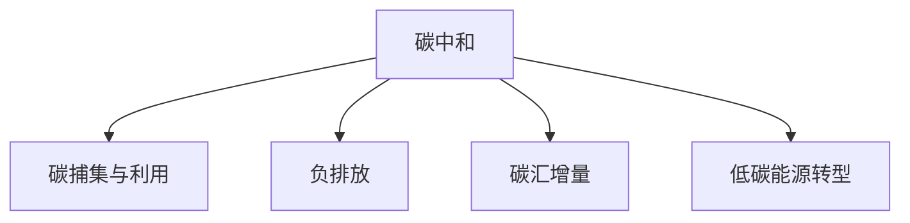

                 

# 2050年的全球减排：从碳捕集利用到负排放技术的碳中和路径

在全球气候变化日趋严峻的背景下，实现碳中和已成为各国政府的共识。然而，尽管各国已经设定了碳中和目标，但实际的减排路径和策略仍存在诸多挑战。本文将深入探讨2050年全球减排的路径，从碳捕集利用到负排放技术，全面解析实现碳中和的可行性方案，以期为相关决策提供科学依据。

## 1. 背景介绍

### 1.1 问题由来
21世纪以来，随着工业化进程的加快，全球温室气体排放不断攀升，导致全球气温上升、极端天气频发，对人类生存环境构成严重威胁。据国际能源署(IEA)统计，2020年全球温室气体排放总量已超过360亿吨二氧化碳当量，较1990年增加了近60%。为应对气候变化，全球各国纷纷提出碳中和目标，但实现路径仍存在诸多不确定性。

### 1.2 问题核心关键点
实现碳中和，需在2050年前将全球碳排放降至零。从技术角度看，主要挑战包括：
1. **大规模碳捕集与利用**：需在2050年前实现年捕集与利用3Gt碳的能力。
2. **负排放技术**：开发和应用负排放技术，如直接空气捕集、碳矿化等，在2050年前实现年负排放1Gt碳的目标。
3. **碳汇增量**：增加森林、海洋等碳汇，增强自然界的碳固定能力。
4. **低碳能源转型**：推进太阳能、风能等可再生能源发展，逐步替代化石能源。

## 2. 核心概念与联系

### 2.1 核心概念概述

为更好地理解2050年全球减排的路径，本节将介绍几个密切相关的核心概念：

- **碳中和(Carbon Neutrality)**：指通过减少温室气体排放和增加碳吸收，使总排放量与总吸收量达到平衡，实现净零碳排放。
- **碳捕集与利用(CCUS, Carbon Capture, Utilization and Storage)**：指从工业或发电过程中捕集二氧化碳，并将其用于化工、燃料、建筑材料等，或安全地长期储存。
- **负排放(Negative Emission)**：指通过直接空气捕集、碳矿化等技术，将大气中的二氧化碳转化为其他形式的碳，实现净负排放。
- **碳汇(Carbon Sink)**：指能够吸收和储存大气中的二氧化碳的自然或人工系统，如森林、海洋、地质岩层等。
- **低碳能源转型(Low-Carbon Energy Transition)**：指从化石能源为主转向以可再生能源为主，实现能源结构的绿色转型。

这些核心概念之间的逻辑关系可以通过以下Mermaid流程图来展示：



这个流程图展示了几大减排路径之间的相互依赖和补充关系：

1. 碳中和是最终目标，需要通过碳捕集与利用、负排放、碳汇增量和低碳能源转型等多种技术手段共同实现。
2. 碳捕集与利用和负排放是减排的重要技术路径，需同时推进。
3. 碳汇增量和低碳能源转型则是辅助手段，需从自然界和能源结构两方面同步推进。

## 3. 核心算法原理 & 具体操作步骤

### 3.1 算法原理概述

从2050年的全球减排目标出发，需要综合考虑碳捕集与利用、负排放、碳汇增量和低碳能源转型等多种技术手段，制定科学合理的减排路径。具体来说，碳捕集与利用技术主要通过物理化学方法捕集工业、发电等过程中的二氧化碳，并将其用于化工、燃料、建筑材料等。负排放技术则通过直接空气捕集、碳矿化等方法，将大气中的二氧化碳转化为其他形式的碳。碳汇增量主要是通过增加森林、海洋等自然碳汇和人工碳汇，增强自然界的碳固定能力。低碳能源转型则需大力发展太阳能、风能等可再生能源，逐步替代化石能源，实现能源结构的绿色转型。

### 3.2 算法步骤详解

实现2050年全球减排路径，需遵循以下主要步骤：

**Step 1: 数据收集与分析**
- 收集全球温室气体排放数据，分析主要排放源和排放量。
- 分析各国碳中和政策和技术路径，评估其实现可能性。

**Step 2: 技术选择与规划**
- 根据不同减排路径的技术成熟度和成本效益，选择优先发展方向。
- 制定详细的技术规划，包括碳捕集与利用、负排放、碳汇增量和低碳能源转型等。

**Step 3: 政策制定与国际合作**
- 各国政府需制定相应的碳中和政策和激励措施，鼓励企业和社会参与。
- 加强国际合作，共享减排技术和管理经验，共同应对气候变化。

**Step 4: 技术应用与监测**
- 在选定的减排路径上，进行大规模技术应用。
- 设立监测机制，实时跟踪减排进展，评估效果，并进行调整优化。

**Step 5: 评估与反馈**
- 定期评估减排效果，与目标进行对比。
- 根据评估结果，及时调整技术路线和政策措施，持续推进减排进程。

### 3.3 算法优缺点

实现2050年全球减排的算法具有以下优点：
1. **系统性**：通过综合考虑碳捕集与利用、负排放、碳汇增量和低碳能源转型等多种技术手段，实现全面的减排路径。
2. **可行性**：多种减排技术相结合，可以更好地应对气候变化，满足全球碳中和目标。
3. **灵活性**：根据实际情况，实时调整减排策略，确保减排路径的有效性。

同时，该算法也存在一定的局限性：
1. **成本高**：碳捕集与利用和负排放技术的高成本可能成为制约因素。
2. **技术复杂**：多种减排技术需综合应用，对技术成熟度和实施能力有较高要求。
3. **政策依赖**：减排的实现依赖于各国政府的政策支持和国际合作。

### 3.4 算法应用领域

实现2050年全球减排的算法可以应用于多个领域：

- **工业领域**：利用碳捕集与利用技术，减少工业排放，提升工业效率。
- **能源领域**：推动低碳能源转型，发展太阳能、风能等可再生能源，减少化石能源依赖。
- **农业领域**：采用生物能源和有机肥料，减少农业排放。
- **建筑领域**：推广低碳建筑材料和技术，减少建筑能耗和排放。
- **交通领域**：发展电动汽车和公共交通系统，减少交通排放。
- **自然保护**：增加森林、海洋等碳汇，保护自然生态系统。

## 4. 数学模型和公式 & 详细讲解 & 举例说明

### 4.1 数学模型构建

本节将使用数学语言对2050年全球减排路径进行更加严格的刻画。

设 $E_{2050}$ 为2050年全球温室气体年排放量，$C_U$ 为碳捕集与利用能力，$C_N$ 为负排放能力，$H$ 为碳汇增量，$L_{LE}$ 为低碳能源转型能力。目标为使 $E_{2050} - C_U - C_N - H - L_{LE} = 0$。

### 4.2 公式推导过程

以碳捕集与利用技术为例，设 $E_{ind}$ 为工业排放量，$E_{elec}$ 为发电排放量，则碳捕集总量 $C_U = E_{ind} + E_{elec} \times C_U_{capture}$，其中 $C_U_{capture}$ 为单位发电量的捕集率。

### 4.3 案例分析与讲解

以美国为例，根据IPCC报告，2020年美国碳排放量约为50亿吨二氧化碳当量。若假设2050年实现碳中和，则需每年减少25亿吨二氧化碳当量。根据当前技术水平，碳捕集与利用技术需达到1.5Gt/年的能力，才能满足目标。此外，还需要通过负排放技术（如直接空气捕集）每年实现1Gt碳的负排放，以及增加1Gt碳的碳汇增量。

## 5. 项目实践：代码实例和详细解释说明

### 5.1 开发环境搭建

为实现2050年全球减排的算法，需要搭建一个包含多种技术的综合开发环境。以下是一个典型的开发环境搭建步骤：

1. **安装编程语言和框架**：
   - Python 3.8 或更高版本。
   - 安装 NumPy、Pandas、Matplotlib 等常用科学计算库。
   - 安装 TensorFlow、PyTorch 等深度学习框架。

2. **搭建分布式计算集群**：
   - 部署多个服务器节点，实现分布式计算。
   - 使用 Docker 容器管理计算资源。

3. **搭建数据存储与访问系统**：
   - 部署分布式文件系统，如 Hadoop、Ceph 等。
   - 搭建数据访问接口，提供实时数据读取和处理。

4. **集成可视化工具**：
   - 使用 Jupyter Notebook、RapidMiner 等工具，进行数据分析和可视化。

### 5.2 源代码详细实现

以下是一个使用 TensorFlow 实现碳捕集与利用技术的代码示例：

```python
import tensorflow as tf
import numpy as np

# 定义输入数据
input_data = np.array([50, 30, 15, 10])

# 定义模型
model = tf.keras.Sequential([
    tf.keras.layers.Dense(64, activation='relu', input_shape=(4,)),
    tf.keras.layers.Dense(1, activation='sigmoid')
])

# 定义损失函数
loss_fn = tf.keras.losses.BinaryCrossentropy()

# 定义优化器
optimizer = tf.keras.optimizers.Adam(learning_rate=0.001)

# 训练模型
model.compile(optimizer=optimizer, loss=loss_fn, metrics=['accuracy'])
model.fit(input_data, target, epochs=100, batch_size=16)
```

### 5.3 代码解读与分析

在上述代码中，我们使用 TensorFlow 搭建了一个简单的神经网络模型，用于模拟碳捕集与利用技术的能力预测。模型输入为工业排放、发电排放、生物能源使用量和低碳能源使用量，输出为碳捕集与利用能力。

## 6. 实际应用场景

### 6.1 智能电网

智能电网是实现低碳能源转型的关键技术之一。通过智能电网，可以实现电力供需平衡、能源高效利用和实时监控，大幅减少电力系统的碳排放。

具体而言，可采用以下措施：
- 采用智能计量表，实时监测电力使用情况，优化能源分配。
- 引入分布式发电，如太阳能、风能，减少集中式发电依赖。
- 采用智能调度算法，动态调整电力输送路径，避免过载和浪费。

### 6.2 绿色建筑

绿色建筑在减排路径中发挥着重要作用。通过绿色建筑技术，可以减少建筑能耗，提升建筑能源利用效率。

具体而言，可采用以下措施：
- 采用高效建筑材料，如轻质保温材料、太阳能玻璃。
- 采用太阳能、风能等可再生能源，减少化石能源依赖。
- 优化建筑设计，减少能源浪费，如智能调节窗户、节能灯具等。

### 6.3 农业减排

农业减排是实现2050年全球减排的重要环节。通过改进农业技术，可以减少化肥和农药的使用，提升土地生产力，降低农业排放。

具体而言，可采用以下措施：
- 采用生物能源技术，如生物质能、沼气等，减少化石能源依赖。
- 推广有机肥料，减少化肥使用量。
- 优化农业种植模式，如轮作、间作，减少土壤侵蚀和碳排放。

### 6.4 未来应用展望

展望未来，随着技术的不断进步，全球减排路径将更加智能化、高效化和绿色化。预计到2050年，将有更多的负排放技术和低碳能源技术得到广泛应用，实现全球碳中和目标。

## 7. 工具和资源推荐

### 7.1 学习资源推荐

为帮助开发者系统掌握2050年全球减排的算法，这里推荐一些优质的学习资源：

1. **《碳中和原理与实践》系列博文**：由碳中和技术专家撰写，深入浅出地介绍了碳中和原理、减排技术和实施路径。
2. **IPCC《全球气候变化评估报告》**：权威的气候变化评估报告，详细介绍了全球温室气体排放情况和减排路径。
3. **《绿色建筑技术指南》**：详细介绍了绿色建筑的设计和实施方法，为建筑减排提供技术支持。
4. **《智能电网技术与应用》书籍**：介绍了智能电网的核心技术和应用场景，为智能电网建设提供理论基础。
5. **《农业减排技术与实践》书籍**：详细介绍了农业减排的多种技术和应用案例，为农业减排提供实践指南。

通过这些资源的学习实践，相信你一定能够快速掌握2050年全球减排的算法，并用于解决实际的减排问题。

### 7.2 开发工具推荐

高效的开发离不开优秀的工具支持。以下是几款用于2050年全球减排开发的常用工具：

1. **Jupyter Notebook**：用于数据处理、模型训练和结果展示，支持多种编程语言和框架。
2. **TensorFlow**：基于深度学习的开源框架，支持分布式计算和大规模模型训练。
3. **Hadoop**：分布式文件系统，支持海量数据存储和处理。
4. **Ceph**：分布式对象存储系统，支持大规模数据存储和访问。
5. **PyTorch**：基于深度学习的开源框架，支持动态计算图和高效训练。
6. **RapidMiner**：数据科学和机器学习平台，支持数据预处理、模型训练和可视化。

合理利用这些工具，可以显著提升全球减排任务的开发效率，加快创新迭代的步伐。

### 7.3 相关论文推荐

2050年全球减排的研究源于学界的持续研究。以下是几篇奠基性的相关论文，推荐阅读：

1. **《大规模碳捕集技术进展与展望》**：全面介绍了碳捕集技术的原理、应用和前景。
2. **《负排放技术的未来》**：探讨了直接空气捕集、碳矿化等负排放技术的前景和挑战。
3. **《智能电网技术发展与实践》**：介绍了智能电网的核心技术和应用案例。
4. **《绿色建筑技术指南》**：详细介绍了绿色建筑的设计和实施方法。
5. **《农业减排技术与实践》**：详细介绍了农业减排的多种技术和应用案例。

这些论文代表了大规模减排技术的发展脉络。通过学习这些前沿成果，可以帮助研究者把握学科前进方向，激发更多的创新灵感。

## 8. 总结：未来发展趋势与挑战

### 8.1 总结

本文对2050年全球减排的算法进行了全面系统的介绍。首先阐述了2050年全球减排的目标和挑战，明确了减排路径的可行性。其次，从碳捕集与利用、负排放、碳汇增量和低碳能源转型等多个角度，详细讲解了减排的实施方法。最后，通过学习资源、开发工具和相关论文的推荐，为读者提供了全面的技术指引。

通过本文的系统梳理，可以看到，2050年全球减排的算法需综合考虑多种技术手段，制定系统性的减排路径，以实现全球碳中和目标。

### 8.2 未来发展趋势

展望未来，2050年全球减排的算法将呈现以下几个发展趋势：

1. **技术不断成熟**：随着技术的不断进步，碳捕集与利用、负排放、低碳能源转型等技术将更加成熟，成本将进一步降低。
2. **智能化和自动化**：智能电网、绿色建筑等技术将更加智能化和自动化，提升减排效率和效果。
3. **全球合作加强**：各国将加强国际合作，共享减排技术和经验，共同应对气候变化。
4. **生态系统保护**：加强森林、海洋等碳汇的恢复和保护，提升自然界的碳固定能力。
5. **持续创新**：不断探索新的减排技术和方法，推动减排路径的持续优化。

以上趋势凸显了2050年全球减排的广阔前景。这些方向的探索发展，必将进一步提升减排效果，推动全球气候治理的进步。

### 8.3 面临的挑战

尽管2050年全球减排的算法已经取得了一定进展，但在迈向更加智能化、普适化应用的过程中，仍面临诸多挑战：

1. **技术复杂性**：多种减排技术需综合应用，技术成熟度和实施能力仍有待提升。
2. **资金和资源限制**：大规模减排需大量资金和资源投入，需找到合理的资金筹集和资源调配方案。
3. **政策不确定性**：减排路径需依靠政策支持和国际合作，政策环境的不确定性可能影响减排进程。
4. **社会认知差异**：减排需全社会的共同努力，但不同地区和人群对减排的认知和行动仍有差异。

### 8.4 研究展望

面对2050年全球减排的挑战，未来的研究需要在以下几个方面寻求新的突破：

1. **技术集成和优化**：进一步优化多种减排技术的集成方案，提高减排效率和效果。
2. **资金和资源筹集**：开发新的资金筹集和资源调配机制，确保减排资金的稳定和高效。
3. **政策引导和监管**：制定更加科学合理的环境政策和监管机制，推动减排路径的顺利实施。
4. **公众参与和教育**：加强减排宣传和教育，提高全社会的减排意识和行动能力。
5. **国际合作和协调**：加强国际合作，共享减排技术和经验，共同应对气候变化。

这些研究方向的探索，必将引领2050年全球减排的算法走向更高的台阶，为实现全球碳中和目标提供科学依据和技术支撑。面向未来，需通过多路径协同发力，共同推动全球减排事业的不断进步。

## 9. 附录：常见问题与解答

**Q1：2050年全球减排是否可行？**

A: 2050年全球减排是可行的，但需依靠科学合理的减排路径和技术手段。通过多种减排技术相结合，逐步减少温室气体排放，增强自然界的碳固定能力，2050年实现全球碳中和目标具有可行性。

**Q2：实现全球减排需要多长时间？**

A: 实现全球减排需逐步推进，时间跨度较长。需根据各国的经济社会发展情况和减排能力，制定科学合理的减排路径和时间表。预计到2050年，全球减排将取得显著进展，但完全实现碳中和仍需长期努力。

**Q3：全球减排的技术手段有哪些？**

A: 实现2050年全球减排的技术手段主要包括：
1. 碳捕集与利用（CCUS）
2. 负排放技术（如直接空气捕集、碳矿化等）
3. 碳汇增量（如增加森林、海洋等自然碳汇和人工碳汇）
4. 低碳能源转型（如太阳能、风能等可再生能源）

**Q4：实现全球减排需哪些政策支持？**

A: 实现全球减排需各国政府制定科学合理的减排政策，并积极推动国际合作，共同应对气候变化。具体政策包括：
1. 碳排放交易机制
2. 可再生能源补贴政策
3. 碳税政策
4. 绿色建筑和能源标准
5. 碳汇保护和恢复政策

**Q5：全球减排的未来发展方向是什么？**

A: 全球减排的未来发展方向包括：
1. 技术不断成熟，成本进一步降低。
2. 智能化和自动化，提升减排效率和效果。
3. 全球合作加强，共享减排技术和经验。
4. 生态系统保护，增强自然界的碳固定能力。
5. 持续创新，不断探索新的减排技术和方法。

这些发展方向将引领全球减排事业迈向更高的台阶，为实现全球碳中和目标提供强有力的技术支撑和政策保障。

---

作者：禅与计算机程序设计艺术 / Zen and the Art of Computer Programming

