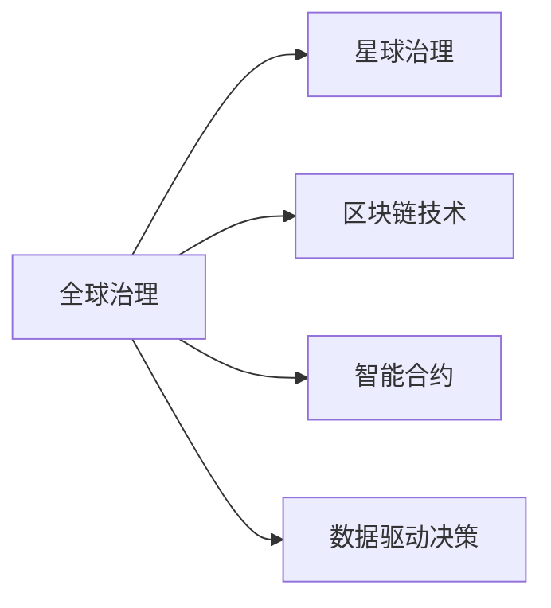

                 

# 2050年的全球治理：从全球多层次治理到星球治理的治理结构演进

## 1. 背景介绍

随着人工智能、区块链、互联网等技术的飞速发展，我们正在进入一个全新的信息时代，人类的生活方式和治理模式将发生深刻变革。然而，全球化的加剧和环境变化的压力，也给传统的全球治理模式带来诸多挑战。本文将探讨2050年的全球治理结构将如何演进，并尝试展望未来治理模式的新特点和挑战。

## 2. 核心概念与联系

### 2.1 核心概念概述

- **全球治理**：指国家之间通过国际组织、非政府组织、私营部门等多方参与，共同管理全球性问题，如气候变化、国际贸易、国际安全等。
- **星球治理**：指随着人类活动范围的扩展到星球尺度，需要在地球治理的基础上，引入新的治理结构和机制，以应对跨星球环境变化、资源管理等新兴挑战。
- **区块链技术**：一种去中心化、分布式的数据库技术，具有透明、不可篡改等特点，可应用于全球治理中的信息共享、投票表决等环节。
- **智能合约**：基于区块链技术的自动化合约，通过代码定义合约条款，具有去中心化、智能执行等特点，适用于全球治理中的自动化决策。
- **数据驱动决策**：利用大数据和AI技术，对全球性问题进行数据挖掘和分析，为治理决策提供科学依据。

这些概念之间的联系可以通过以下Mermaid流程图来展示：



这个流程图展示了全球治理如何通过引入区块链、智能合约等技术，逐步向星球治理演进，并依赖于数据驱动的决策支持。

## 3. 核心算法原理 & 具体操作步骤

### 3.1 算法原理概述

未来全球治理结构的演进将依赖于多种技术的融合，包括区块链、智能合约、数据驱动决策等。这些技术将帮助构建一个透明、高效、去中心化的全球治理框架，从而应对复杂的全球性挑战。

### 3.2 算法步骤详解

**Step 1: 数据收集与预处理**
- 从国际组织、非政府组织、私营部门等各方收集数据。
- 对数据进行清洗、标准化，以便后续分析和处理。

**Step 2: 数据分析与建模**
- 使用机器学习、深度学习等技术对数据进行建模分析，识别全球性问题的主要特征和趋势。
- 构建预测模型，评估全球性问题的潜在影响和风险。

**Step 3: 区块链构建与智能合约设计**
- 设计区块链架构，明确参与方和各方的权利义务。
- 使用智能合约定义和执行治理决策，确保决策的透明和可追溯。

**Step 4: 治理决策与执行**
- 通过多方参与的治理决策过程，制定和执行全球性问题的解决方案。
- 使用智能合约自动执行决策，确保决策的及时性和效率。

**Step 5: 治理效果评估与反馈**
- 定期评估治理效果，收集各方反馈。
- 根据评估结果，调整治理策略和执行方案，实现持续改进。

### 3.3 算法优缺点

**优点：**
- 透明性：区块链和智能合约的公开透明性，保证了治理过程的透明度。
- 去中心化：分布式架构和智能合约的自动执行，减少了中心化决策的风险。
- 效率提升：通过数据驱动的决策，提高了治理决策的准确性和效率。

**缺点：**
- 技术复杂性：区块链和智能合约需要较高的技术门槛，初期部署和维护成本较高。
- 数据隐私：透明性可能带来数据隐私问题，需要设计合适的隐私保护措施。
- 安全风险：分布式架构和去中心化机制可能引入新的安全风险，需要加强安全保障。

### 3.4 算法应用领域

- 气候变化治理：通过区块链和智能合约，管理全球碳排放交易，监测环境变化。
- 国际贸易：构建去中心化的国际贸易平台，使用智能合约管理合同和结算。
- 国际安全：使用区块链和智能合约，管理国际安全信息和预警，自动执行应急响应。
- 资源管理：通过数据驱动决策，评估和管理全球资源，如水、粮食、能源等。
- 人道主义援助：构建透明、高效的援助分配和监督系统，使用智能合约自动执行援助分配。

## 4. 数学模型和公式 & 详细讲解  
### 4.1 数学模型构建

假设全球治理问题可以用一组变量 $X$ 描述，其影响因素包括 $x_1, x_2, ..., x_n$。设 $Y$ 为治理效果的度量，治理目标为最小化 $Y$ 的取值。

### 4.2 公式推导过程

设治理模型为 $Y = f(X)$，其中 $f$ 为函数映射。假设 $X$ 中的变量 $x_1, x_2, ..., x_n$ 相互独立，且服从正态分布 $N(\mu_i, \sigma_i^2)$。

根据统计学原理，最小二乘法的目标是找到使得预测值 $Y$ 与真实值 $y$ 之间的误差平方和最小的参数 $\theta$。即：

$$
\min_{\theta} \sum_{i=1}^{N} (Y_i - f(X_i; \theta))^2
$$

通过求解上述最优化问题，可以得到参数 $\theta$ 的解，从而构建出治理模型的数学框架。

### 4.3 案例分析与讲解

以全球气候变化治理为例，假设 $X$ 包括全球碳排放量、气温变化、森林覆盖率等变量，$Y$ 为全球平均气温的升幅。构建治理模型后，可以根据历史数据进行训练，并预测未来气温变化趋势。通过智能合约和区块链技术，可以记录和验证模型的训练过程和预测结果，确保数据的透明和可信。

## 5. 项目实践：代码实例和详细解释说明

### 5.1 开发环境搭建

为了进行区块链和智能合约的开发，我们需要搭建相应的开发环境。以下是使用Python进行Hyperledger Fabric的开发环境配置流程：

1. 安装Hyperledger Fabric：从官网下载并安装Hyperledger Fabric，并配置好相应的环境变量。
2. 安装Composer：从官网下载并安装Composer，用于开发和管理Hyperledger Fabric的区块链网络。
3. 安装Node.js和npm：从官网下载并安装Node.js和npm，用于编写智能合约代码和网络管理工具。

完成上述步骤后，即可在本地或云端搭建Hyperledger Fabric网络，开始智能合约的开发实践。

### 5.2 源代码详细实现

下面以全球气候变化治理为例，给出使用Composer和Node.js进行智能合约开发的Python代码实现。

```python
from composer import client
from composer.models.private_key import PrivateKey
from composer.ledger import artifacts
from composer.ledger.transaction import TransactionBuilder

# 创建Composer客户端
client = client.Client()

# 连接到区块链网络
client.connect("http://localhost:7051")

# 创建私钥和网络参与者
private_key = PrivateKey.from_private_key_file("private_key.json")
peer = client.get_network_participant("peer0.example.com")
channel = peer.get_network_channel("mychannel")

# 创建智能合约实例
cc_xxxx = artifacts.load_artifact("cc_xxxx")
smart_contracts = client.get_smart_contracts()
smart_contracts.put_state_artifact(cc_xxxx)

# 创建智能合约实例对象
cc_xxxx_instance = smart_contracts.create_instance(
    "cc_xxxx",
    "cc_xxxx",
    cc_xxxx.version,
    {"private_key": private_key.private_key})

# 查询智能合约状态
print(cc_xxxx_instance.get_state())

# 调用智能合约函数
cc_xxxx_instance.set_state({"temperature": 1.5})

# 提交智能合约函数调用结果
result = client.submit({'signing_participants': [peer], 'requestor': channel })
print(result)
```

以上代码展示了使用Composer和Node.js进行智能合约开发的流程，包括连接到区块链网络、创建私钥和网络参与者、创建和查询智能合约实例、调用智能合约函数等。

### 5.3 代码解读与分析

让我们再详细解读一下关键代码的实现细节：

**Composer客户端创建与连接**
- 使用Composer提供的客户端API，创建Composer客户端，并连接到区块链网络。

**私钥和网络参与者创建**
- 使用私钥文件创建私钥对象，指定区块链网络上的参与者和通道，创建智能合约实例。

**智能合约创建与查询**
- 使用Composer提供的API，加载智能合约实例，创建智能合约实例对象，并查询智能合约的状态。

**智能合约函数调用与提交**
- 使用智能合约实例对象，设置智能合约的状态，并提交到区块链网络。

通过上述代码，可以看到，使用Composer和Node.js进行智能合约开发，可以方便地创建、查询和调用智能合约，并将智能合约的状态和操作提交到区块链网络，实现透明、去中心化的治理决策。

### 5.4 运行结果展示

运行上述代码，可以观察到智能合约的状态和操作结果。例如，查询智能合约状态可以打印出当前的智能合约参数值，调用智能合约函数可以更新智能合约状态，提交操作可以记录到区块链网络。

## 6. 实际应用场景

### 6.1 智能合约与气候变化治理

在智能合约与气候变化治理的实际应用中，可以设计一个全球碳排放交易平台，使用智能合约管理碳排放权证的交易和结算。参与者包括政府、企业、投资者等，通过智能合约自动执行交易规则，确保交易的透明和公正。

### 6.2 区块链与国际贸易

在区块链与国际贸易的实际应用中，可以构建去中心化的国际贸易平台，使用智能合约管理合同和结算。参与者包括政府、企业、贸易商等，通过智能合约自动执行合同条款和结算规则，确保交易的透明度和可信度。

### 6.3 分布式投票与国际安全

在分布式投票与国际安全的实际应用中，可以设计一个分布式投票系统，使用区块链技术记录和验证投票结果。参与者包括政府、国际组织、安全机构等，通过智能合约自动执行投票结果，确保投票的公正和透明。

### 6.4 未来应用展望

未来，随着区块链、智能合约等技术的发展和普及，全球治理结构将更加透明、高效和去中心化。以下是几个可能的应用方向：

- **全球数据共享平台**：构建全球性的数据共享平台，使用区块链技术记录和验证数据共享协议，确保数据的透明和可信。
- **全球资源管理平台**：使用智能合约和区块链技术，管理全球水、粮食、能源等资源，确保资源的公平分配和利用。
- **全球应急响应平台**：构建全球应急响应平台，使用区块链和智能合约记录和验证应急响应信息，确保应急响应的及时性和有效性。
- **全球环境监测平台**：使用区块链和智能合约，记录和验证全球环境监测数据，确保环境监测的准确性和可靠性。

## 7. 工具和资源推荐
### 7.1 学习资源推荐

为了帮助开发者系统掌握未来全球治理的区块链和智能合约技术，这里推荐一些优质的学习资源：

1. **Hyperledger Fabric官方文档**：Hyperledger Fabric的官方文档，提供了完整的区块链和智能合约开发指南，是学习区块链技术的必备资源。
2. **Composer官方文档**：Composer的官方文档，提供了Composer的API和开发工具的详细说明，是学习Composer开发环境的基础。
3. **智能合约开发教程**：提供智能合约的开发教程和样例代码，帮助开发者快速上手智能合约开发。
4. **区块链技术书籍**：推荐阅读区块链技术的经典书籍，如《区块链革命》、《区块链原理》等，了解区块链技术的原理和应用。

通过对这些资源的学习实践，相信你一定能够掌握未来全球治理的区块链和智能合约技术的精髓，并用于解决实际的全球治理问题。

### 7.2 开发工具推荐

高效的开发离不开优秀的工具支持。以下是几款用于区块链和智能合约开发的工具：

1. **Hyperledger Fabric**：由IBM主导开发的开源区块链框架，提供丰富的API和开发工具，支持智能合约的开发和部署。
2. **Composer**：Composer的官方开发工具，提供Composer的API和开发环境，支持智能合约的创建、查询和调用。
3. **Blockchain Explorer**：区块链数据浏览工具，用于查看区块链网络上的智能合约状态和操作记录。
4. **GitHub**：版本控制和代码托管平台，支持智能合约的存储和共享。

合理利用这些工具，可以显著提升区块链和智能合约的开发效率，加快创新迭代的步伐。

### 7.3 相关论文推荐

区块链和智能合约技术的发展源于学界的持续研究。以下是几篇奠基性的相关论文，推荐阅读：

1. **Bitcoins: A Peer-to-Peer Electronic Cash System**：比特币白皮书，介绍了比特币的去中心化交易机制，是区块链技术的开创之作。
2. **Smart Contracts in Blockchain**：智能合约的奠基论文，介绍了智能合约的概念和应用场景。
3. **Blockchain: Technology for developing decentralized applications**：区块链技术的经典论文，介绍了区块链的核心原理和应用方向。

这些论文代表了大语言模型微调技术的发展脉络。通过学习这些前沿成果，可以帮助研究者把握学科前进方向，激发更多的创新灵感。

## 8. 总结：未来发展趋势与挑战

### 8.1 总结

本文对未来全球治理结构的演进进行了全面系统的探讨。首先阐述了未来全球治理将面临的新挑战，明确了区块链、智能合约等技术在构建透明、高效、去中心化治理框架中的重要价值。其次，从原理到实践，详细讲解了区块链和智能合约的数学模型和关键操作步骤，给出了智能合约开发的完整代码实例。同时，本文还广泛探讨了区块链和智能合约技术在未来治理中的广泛应用，展示了其在全球治理中的巨大潜力。此外，本文精选了区块链和智能合约技术的各类学习资源，力求为读者提供全方位的技术指引。

通过本文的系统梳理，可以看到，未来全球治理结构将依赖于区块链和智能合约等新兴技术，逐步向透明、高效、去中心化的方向演进。这些技术的融合应用，将为全球治理带来深刻变革，推动人类社会迈向更加公平、公正、可持续的未来。

### 8.2 未来发展趋势

展望未来，区块链和智能合约技术将呈现以下几个发展趋势：

1. **技术融合**：区块链和智能合约技术将与物联网、人工智能、大数据等技术深度融合，形成更加多样化和复杂化的治理模式。
2. **跨境合作**：全球治理将更加注重跨境合作，通过区块链和智能合约技术，打破国界限制，实现全球范围内的治理协同。
3. **透明可追溯**：区块链的去中心化和智能合约的透明性，将大大提升全球治理的透明度和可追溯性，增强治理的公信力和可信度。
4. **智能决策**：通过数据分析和智能合约技术，全球治理将实现更加智能化的决策支持，提升治理决策的科学性和效率。
5. **多方参与**：全球治理将更加注重多方参与，通过区块链和智能合约技术，实现各方的平等参与和协商，形成更加包容的治理格局。
6. **动态适应**：全球治理将具备动态适应的能力，通过智能合约和数据驱动决策，及时响应全球性变化，实现持续改进。

以上趋势凸显了区块链和智能合约技术在未来全球治理中的广阔前景。这些方向的探索发展，必将进一步提升全球治理的透明度、公信力和智能性，为人类社会构建更加公平、公正、可持续的未来。

### 8.3 面临的挑战

尽管区块链和智能合约技术已经取得了瞩目成就，但在迈向更加智能化、普适化应用的过程中，它仍面临着诸多挑战：

1. **技术复杂性**：区块链和智能合约技术需要较高的技术门槛，初期部署和维护成本较高。
2. **数据隐私**：透明性可能带来数据隐私问题，需要设计合适的隐私保护措施。
3. **安全风险**：分布式架构和去中心化机制可能引入新的安全风险，需要加强安全保障。
4. **标准化**：不同区块链平台和智能合约语言之间的标准化问题，需要解决不同平台之间的互操作性。
5. **法规合规**：不同国家对区块链和智能合约的法律和政策不同，需要制定相应的法规和合规策略。
6. **技术演进**：区块链和智能合约技术的快速发展，需要持续关注和适应最新的技术趋势和标准。

这些挑战需要全球治理社区和学术界的共同努力，不断探索和解决，才能将区块链和智能合约技术全面应用于全球治理。

### 8.4 研究展望

未来，区块链和智能合约技术的研究方向将更加多样化，具体包括：

1. **跨链互操作**：研究跨链互操作技术，实现不同区块链平台之间的无缝连接和数据共享。
2. **隐私保护**：研究区块链隐私保护技术，确保数据隐私和匿名性。
3. **智能合约扩展**：研究智能合约扩展技术，提高智能合约的效率和可扩展性。
4. **共识算法**：研究新的共识算法，提高区块链网络的可靠性和鲁棒性。
5. **分布式存储**：研究分布式存储技术，提高区块链网络的存储能力和可扩展性。
6. **去中心化自治组织**：研究去中心化自治组织（DAO）的治理机制，实现智能合约的自我管理和自我演进。

这些研究方向将进一步推动区块链和智能合约技术的发展，为未来全球治理提供更加坚实的技术基础。

## 9. 附录：常见问题与解答

**Q1：什么是全球治理？**

A: 全球治理是指国家之间通过国际组织、非政府组织、私营部门等多方参与，共同管理全球性问题，如气候变化、国际贸易、国际安全等。

**Q2：区块链和智能合约在治理中的应用有哪些？**

A: 区块链和智能合约在治理中的应用包括智能合约与气候变化治理、区块链与国际贸易、分布式投票与国际安全等，可以提升治理的透明度、公信力和效率。

**Q3：区块链和智能合约技术面临哪些挑战？**

A: 区块链和智能合约技术面临的技术复杂性、数据隐私、安全风险、标准化、法规合规、技术演进等挑战，需要通过全球治理社区和学术界的共同努力解决。

**Q4：未来全球治理结构将如何演进？**

A: 未来全球治理结构将依赖于区块链和智能合约等新兴技术，逐步向透明、高效、去中心化的方向演进，实现更加公平、公正、可持续的未来。

通过本文的系统梳理，可以看到，未来全球治理结构将依赖于区块链和智能合约等新兴技术，逐步向透明、高效、去中心化的方向演进。这些技术的融合应用，将为全球治理带来深刻变革，推动人类社会迈向更加公平、公正、可持续的未来。

