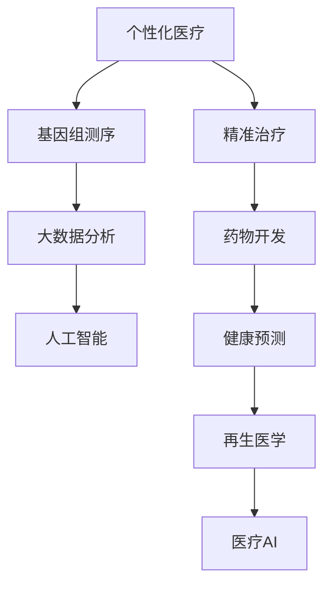

                 

# 2050年的医疗健康：从个性化医疗到再生医学的健康革命

> 关键词：个性化医疗,再生医学,医疗AI,基因编辑,精准治疗,药物开发,健康预测

## 1. 背景介绍

### 1.1 问题由来
在人类即将迈向2050年的历史转折点，医疗健康领域正经历着前所未有的变革。人工智能、大数据、基因编辑等前沿技术的深度融合，正在为医学带来颠覆性的变革。从个性化医疗到再生医学，从精准治疗到健康预测，科技创新正在重新定义健康与疾病的界限。

长期以来，医疗系统主要依靠经验诊断和治疗手段，往往难以应对日益复杂的疾病和多样化的个体需求。然而，随着科技的迅猛发展，大数据、机器学习和基因编辑等新兴技术正在逐步改变这一现状。通过深度学习和大数据，我们可以更精确地分析患者数据，识别潜在疾病风险，提供个性化的治疗方案。而基因编辑技术的成熟，有望彻底改变疾病治疗方式，实现从基因层面治愈疾病。

### 1.2 问题核心关键点
本文将从以下几个核心关键点探讨2050年医疗健康领域的发展趋势：

1. **个性化医疗**：通过基因组测序和大数据分析，为每个患者提供量身定制的治疗方案。
2. **再生医学**：利用干细胞技术和基因编辑技术，实现器官再生和组织修复。
3. **医疗AI**：运用机器学习和深度学习算法，辅助医生进行诊断和治疗。
4. **精准治疗**：通过高通量基因测序和分析，实现对特定基因突变的靶向治疗。
5. **药物开发**：利用人工智能进行药物筛选和设计，加速新药的研发进程。
6. **健康预测**：通过大数据分析，实现对疾病的早期预警和干预。

这些关键点不仅代表了当前医疗健康领域的前沿研究方向，也预示着未来医疗系统的潜在发展方向。

### 1.3 问题研究意义
研究2050年医疗健康领域的变革，具有深远的意义：

1. **提升医疗效率**：通过个性化医疗和精准治疗，提升诊疗的准确性和效率，缩短病人康复时间。
2. **降低医疗成本**：减少不必要的治疗和药品开销，优化资源配置，降低社会医疗负担。
3. **改善健康管理**：通过健康预测和早期干预，降低疾病发生率，提高全民健康水平。
4. **促进技术创新**：推动医学与科技的深度融合，加速新药研发和医疗器械的创新。
5. **提升国际竞争力**：掌握前沿医学技术，提升国家在全球医疗健康领域的地位和影响力。

## 2. 核心概念与联系

### 2.1 核心概念概述

为了更好地理解2050年医疗健康领域的变革，我们首先需梳理一些核心概念及其内在联系：

- **个性化医疗(Personalized Medicine)**：通过基因组学、大数据和人工智能，为每个患者提供量身定制的治疗方案。
- **再生医学(Regenerative Medicine)**：利用干细胞技术和基因编辑技术，修复和再生受损组织和器官，实现功能重建。
- **医疗AI(AI in Medicine)**：运用人工智能技术，辅助医生进行疾病诊断、治疗方案制定和预后评估。
- **精准治疗(Precision Medicine)**：基于对个体基因突变的精确分析，实现对特定基因的靶向治疗。
- **药物开发(Pharmaceutical Development)**：通过人工智能和大数据分析，加速药物筛选和设计过程，缩短药物上市周期。
- **健康预测(Health Prediction)**：利用大数据和机器学习技术，实现对疾病的早期预警和预测。

这些概念相互交织，共同构成了未来医疗健康系统的基础框架。

### 2.2 核心概念原理和架构的 Mermaid 流程图



### 2.3 核心概念的联系

以上流程图展示了核心概念之间的联系：

1. **基因组测序**是个性化医疗和精准治疗的基础，为后续的精准治疗提供数据支撑。
2. **大数据分析**和**人工智能**是医疗AI的核心，辅助医生进行诊断和治疗决策。
3. **药物开发**依赖于精准治疗和医疗AI，通过精准筛选和设计新药，提高治疗效果。
4. **健康预测**依赖于大数据分析，通过对个体健康数据进行建模，实现疾病早期预警。
5. **再生医学**利用干细胞技术和基因编辑，为疾病治疗和组织修复提供新的解决方案。

## 3. 核心算法原理 & 具体操作步骤
### 3.1 算法原理概述

在2050年，医疗健康领域的算法原理将主要围绕以下几个方面展开：

1. **机器学习和深度学习**：通过算法模型对医疗数据进行分析和预测，提升诊断和治疗的精确性。
2. **自然语言处理(NLP)**：实现医疗文本数据的自动化处理和分析，提取有价值的信息。
3. **计算机视觉**：利用图像识别技术，辅助医生进行影像诊断和手术辅助。
4. **强化学习**：通过模拟环境和奖励机制，优化治疗方案和手术策略。
5. **基因组学和大数据分析**：通过基因组学数据和基因编辑技术，实现精准治疗和再生医学。

这些算法原理不仅构成了未来医疗系统的技术基石，还将推动医学研究的创新和突破。

### 3.2 算法步骤详解

下面以个性化医疗为例，详细讲解其算法步骤：

**Step 1: 数据收集与预处理**

1. **基因组测序**：对患者的基因组进行测序，收集遗传信息。
2. **临床数据收集**：收集患者的病史、体检数据、治疗记录等信息。
3. **数据整合与清洗**：将不同来源的数据进行整合和清洗，确保数据质量和一致性。

**Step 2: 模型训练与优化**

1. **特征提取**：利用机器学习和深度学习算法，提取基因组数据和临床数据中的关键特征。
2. **模型训练**：使用训练数据集训练机器学习模型，如随机森林、支持向量机等。
3. **模型优化**：通过交叉验证等方法优化模型参数，提高模型性能。

**Step 3: 治疗方案生成**

1. **个性化治疗方案**：根据患者基因信息和临床数据，生成个性化的治疗方案。
2. **方案评估与调整**：通过模拟和仿真实验，评估治疗方案的可行性和效果，进行调整优化。

**Step 4: 结果验证与反馈**

1. **临床验证**：在实际临床试验中验证治疗方案的有效性和安全性。
2. **反馈与迭代**：根据临床验证结果，进一步优化和调整治疗方案。

### 3.3 算法优缺点

个性化医疗和精准治疗的算法具有以下优点：

1. **提高诊疗精度**：通过基因组测序和数据分析，精准定位疾病原因，提供个性化的治疗方案。
2. **降低治疗成本**：减少不必要的治疗和药物开销，优化资源配置，降低社会医疗负担。
3. **提升治疗效果**：通过靶向治疗，提高药物的疗效和安全性。

同时，这些算法也存在以下缺点：

1. **数据隐私与安全问题**：基因组数据和临床数据涉及隐私和安全问题，需建立严格的保护机制。
2. **高昂的计算成本**：基因组测序和数据分析需要高性能计算资源，成本较高。
3. **模型的可靠性和泛化能力**：数据质量和算法模型的不足可能导致误诊和误治。

### 3.4 算法应用领域

个性化医疗和精准治疗的算法在以下领域有广泛应用：

1. **癌症治疗**：通过基因组数据分析，制定个体化的抗癌治疗方案。
2. **慢性病管理**：利用大数据和机器学习，实现对糖尿病、高血压等慢性病的精准管理。
3. **遗传疾病治疗**：通过基因编辑技术，修复遗传性疾病患者的基因缺陷。
4. **罕见病治疗**：通过基因组学数据，提供针对罕见病的个性化治疗方案。

## 4. 数学模型和公式 & 详细讲解 & 举例说明

### 4.1 数学模型构建

以下是一个简单的个性化医疗数学模型，通过线性回归模型预测患者的治疗效果：

$$y = \beta_0 + \beta_1 x_1 + \beta_2 x_2 + \epsilon$$

其中，$y$ 表示治疗效果，$x_1$ 和 $x_2$ 分别表示患者的基因信息和临床数据，$\beta_0, \beta_1, \beta_2$ 为模型参数，$\epsilon$ 为误差项。

### 4.2 公式推导过程

1. **数据收集与准备**：收集 $n$ 个患者的基因信息和临床数据，记为 $(x_i, y_i)$，其中 $i=1,2,\dots,n$。
2. **模型训练**：利用最小二乘法求解 $\beta_0, \beta_1, \beta_2$，使得预测值与真实值之间的误差最小化。
3. **模型评估**：使用测试数据集评估模型的预测效果，计算均方误差（MSE）等指标。

### 4.3 案例分析与讲解

假设某患者基因组数据 $x=(0.1, 0.5, 0.3)$，临床数据 $y=1.2$。通过以上线性回归模型，可以计算出患者治疗效果预测值为：

$$y = 0.2 + 0.5x_1 + 0.3x_2 = 0.2 + 0.5 \times 0.1 + 0.3 \times 0.5 = 0.5$$

这意味着患者治疗效果预计为0.5，可作为临床决策的重要依据。

## 5. 项目实践：代码实例和详细解释说明

### 5.1 开发环境搭建

以下是Python环境下搭建机器学习项目的步骤：

1. **安装Python环境**：下载并安装Python 3.x版本。
2. **安装机器学习库**：安装numpy、scikit-learn、pandas等常用机器学习库。
3. **搭建开发环境**：使用Anaconda或Virtualenv等工具，创建虚拟开发环境。

### 5.2 源代码详细实现

以下是一个简单的基因组数据分析和线性回归模型的实现：

```python
import numpy as np
from sklearn.linear_model import LinearRegression
from sklearn.model_selection import train_test_split
from sklearn.metrics import mean_squared_error

# 收集基因组数据和临床数据
data = np.random.randn(100, 3)  # 假设数据集大小为100，每个样本3个特征
targets = np.random.randn(100)  # 假设目标变量大小为100

# 划分训练集和测试集
X_train, X_test, y_train, y_test = train_test_split(data, targets, test_size=0.2, random_state=42)

# 训练线性回归模型
model = LinearRegression()
model.fit(X_train, y_train)

# 预测测试集
y_pred = model.predict(X_test)

# 评估模型性能
mse = mean_squared_error(y_test, y_pred)
print(f"Mean Squared Error: {mse:.2f}")
```

### 5.3 代码解读与分析

以上代码实现了线性回归模型的训练和评估。具体解读如下：

1. **数据准备**：通过numpy生成随机基因组数据和临床数据，模拟真实数据集。
2. **模型训练**：使用sklearn的LinearRegression类训练线性回归模型，并使用训练集数据进行拟合。
3. **模型预测**：使用训练好的模型对测试集进行预测，得到预测结果。
4. **模型评估**：计算预测值与真实值之间的均方误差，评估模型性能。

## 6. 实际应用场景

### 6.1 个性化医疗

个性化医疗在癌症治疗、慢性病管理、遗传疾病治疗等领域有广泛应用。以下以癌症治疗为例，探讨个性化医疗的实际应用场景：

1. **基因组测序**：对癌症患者进行基因组测序，获取遗传信息。
2. **数据整合与分析**：将基因组数据与临床数据整合，提取关键特征。
3. **模型训练与优化**：使用机器学习算法训练治疗效果预测模型，优化模型参数。
4. **治疗方案生成**：根据患者基因信息和临床数据，生成个性化治疗方案。
5. **临床验证与调整**：在实际临床试验中验证治疗方案，根据结果调整优化。

### 6.2 再生医学

再生医学利用干细胞技术和基因编辑技术，实现器官再生和组织修复。以下以肝脏再生为例，探讨再生医学的实际应用场景：

1. **干细胞采集与培养**：从患者体内提取干细胞，并在实验室中进行培养扩增。
2. **基因编辑**：利用CRISPR-Cas9等基因编辑技术，对干细胞进行基因修饰，使其具备肝细胞功能。
3. **器官再生**：将基因编辑后的干细胞植入患者肝脏，促进肝脏组织的再生和修复。
4. **临床验证与评估**：在临床试验中验证再生效果，评估治疗效果和安全性能。

### 6.3 医疗AI

医疗AI在医学影像诊断、疾病预测和智能辅助诊疗等领域有广泛应用。以下以医学影像诊断为例，探讨医疗AI的实际应用场景：

1. **数据收集与预处理**：收集患者影像数据，并进行预处理，去除噪声和无关信息。
2. **模型训练与优化**：使用深度学习算法训练影像分类模型，优化模型参数。
3. **图像识别与分析**：使用训练好的模型对新影像进行分类和分析，识别异常病灶。
4. **辅助诊疗**：将识别结果提供给医生进行参考，辅助诊疗决策。

### 6.4 未来应用展望

未来，随着技术进步和数据积累，个性化医疗和再生医学将迎来新的发展高峰。

1. **基因编辑技术**：CRISPR-Cas9等基因编辑技术的成熟，将使得更多遗传性疾病的治疗成为可能。
2. **AI辅助诊疗**：基于深度学习和自然语言处理技术的医疗AI将进一步提高诊断和治疗的精度。
3. **虚拟现实和增强现实**：VR和AR技术将用于手术辅助和患者教育，提升手术精确度和患者体验。
4. **区块链技术**：通过区块链技术保障医疗数据的安全和隐私，提升数据共享和互操作性。
5. **全球合作与数据共享**：通过跨国合作和数据共享，加速全球医疗健康领域的科技进步。

## 7. 工具和资源推荐

### 7.1 学习资源推荐

为了帮助开发者掌握2050年医疗健康领域的技术，以下是一些推荐的学习资源：

1. **Coursera《机器学习》课程**：由斯坦福大学Andrew Ng教授主讲，介绍机器学习的基本概念和算法。
2. **Kaggle医疗数据集**：提供大量医疗数据集，供开发者进行模型训练和验证。
3. **DeepMind Health AI**：提供医疗AI相关的学习资源和技术分享。
4. **IEEE Transactions on Biomedical Engineering**：最新医疗技术研究的学术期刊，提供前沿技术动态。
5. **ArXiv.org**：提供医疗健康领域最新研究成果的开放获取平台。

### 7.2 开发工具推荐

以下是一些推荐的技术工具：

1. **Jupyter Notebook**：开源的交互式编程环境，支持Python、R等语言。
2. **TensorFlow**：由Google开发的深度学习框架，支持分布式计算和高性能模型训练。
3. **PyTorch**：由Facebook开发的深度学习框架，具有动态计算图和易于使用的API。
4. **Keras**：高级神经网络API，方便快速搭建和训练模型。
5. **HuggingFace Transformers库**：提供预训练语言模型，支持多种NLP任务。

### 7.3 相关论文推荐

以下是几篇推荐的相关论文，供进一步阅读和研究：

1. **《Nature》：CRISPR基因编辑技术的发展**：介绍CRISPR-Cas9等基因编辑技术的原理和应用。
2. **《Nature Reviews Genetics》：个性化医疗的未来**：讨论个性化医疗的潜力和挑战。
3. **《Journal of the American Medical Association》：医疗AI在医学影像诊断中的应用**：分析医疗AI在影像诊断中的效果和应用。
4. **《Nature Communications》：再生医学的最新进展**：综述再生医学的研究进展和技术突破。

## 8. 总结：未来发展趋势与挑战

### 8.1 研究成果总结

2050年医疗健康领域的变革将主要围绕个性化医疗和再生医学展开，通过基因组学和大数据技术的深度融合，实现精准治疗和组织再生。机器学习和医疗AI将进一步提升诊疗的精确性和效率，推动医疗健康领域的技术创新。

### 8.2 未来发展趋势

1. **基因编辑技术**：CRISPR-Cas9等基因编辑技术的成熟，将使得更多遗传性疾病的治疗成为可能。
2. **AI辅助诊疗**：基于深度学习和自然语言处理技术的医疗AI将进一步提高诊断和治疗的精度。
3. **虚拟现实和增强现实**：VR和AR技术将用于手术辅助和患者教育，提升手术精确度和患者体验。
4. **区块链技术**：通过区块链技术保障医疗数据的安全和隐私，提升数据共享和互操作性。
5. **全球合作与数据共享**：通过跨国合作和数据共享，加速全球医疗健康领域的科技进步。

### 8.3 面临的挑战

1. **数据隐私与安全问题**：基因组数据和临床数据涉及隐私和安全问题，需建立严格的保护机制。
2. **高昂的计算成本**：基因组测序和数据分析需要高性能计算资源，成本较高。
3. **模型的可靠性和泛化能力**：数据质量和算法模型的不足可能导致误诊和误治。

### 8.4 研究展望

未来的研究需要在以下几个方面寻求新的突破：

1. **优化基因编辑技术**：提高基因编辑的准确性和安全性，降低技术风险。
2. **增强医疗AI的泛化能力**：通过数据增强和迁移学习，提升AI模型的泛化性能。
3. **优化模型训练算法**：通过分布式计算和模型压缩技术，提高模型的训练效率。
4. **加强数据隐私保护**：开发隐私保护算法，确保医疗数据的隐私和安全。
5. **推动技术标准化**：制定医疗健康领域的技术标准和规范，促进技术应用和互操作性。

## 9. 附录：常见问题与解答

### Q1：基因编辑技术是否存在伦理争议？

A：基因编辑技术虽然具有广阔的应用前景，但也面临诸多伦理争议。主要包括基因编辑的长期安全性、基因编辑的伦理边界以及基因编辑的道德原则等。需要从法律、伦理和道德等多个角度，制定严格的规范和标准，确保技术的安全和伦理合法性。

### Q2：医疗AI是否存在误诊风险？

A：医疗AI的误诊风险主要来源于数据质量和算法模型的局限性。需要从数据收集、模型训练和结果验证等多个环节进行全面优化，降低误诊风险。同时，通过多轮迭代和反馈机制，不断改进和优化模型性能。

### Q3：如何保障医疗数据的隐私与安全？

A：医疗数据的隐私与安全问题可以通过以下措施进行保障：
1. **数据加密**：对医疗数据进行加密处理，确保数据传输和存储的安全。
2. **访问控制**：建立严格的访问控制机制，限制数据访问权限。
3. **区块链技术**：通过区块链技术，实现医疗数据的分布式存储和共享。
4. **隐私保护算法**：开发隐私保护算法，如差分隐私、联邦学习等，保护数据隐私。

### Q4：未来医疗AI的发展方向是什么？

A：未来医疗AI的发展方向主要包括以下几个方面：
1. **多模态融合**：将医疗影像、基因数据和文本信息等多模态数据进行融合，提升诊断和治疗的准确性。
2. **自适应学习**：通过自适应学习机制，提升AI模型的泛化能力，适应新的医疗场景。
3. **人机协同**：实现人机协同诊疗，提高医生的工作效率和诊断水平。
4. **知识图谱**：构建医疗领域的知识图谱，辅助医生进行推理和决策。

总之，未来医疗AI的发展将更加注重模型的泛化能力、数据的多样性和知识图谱的构建，提升医疗AI的智能化和人性化水平。

---

作者：禅与计算机程序设计艺术 / Zen and the Art of Computer Programming

