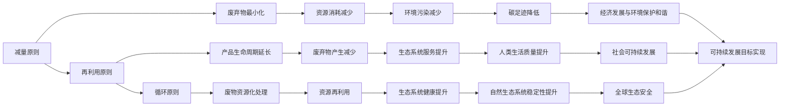

                 

# 2050年的可持续发展：循环经济与资源再利用

## 1. 背景介绍

### 1.1 问题由来
当前，全球正面临前所未有的环境挑战。气候变化、资源短缺、环境污染等问题日益严重，迫切需要新的发展模式来保障经济的可持续发展。循环经济作为一种新型经济发展模式，通过减量、再利用、循环等原则，旨在实现经济、社会、环境三者的协调与共赢。资源再利用作为循环经济的重要组成部分，通过科技手段，将废弃物转化为可再利用的资源，进而实现资源的高效利用，减少环境污染，提升生态系统的可持续性。

### 1.2 问题核心关键点
循环经济和资源再利用的核心在于三个基本原则：减量、再利用和循环。减量原则要求在生产过程中尽可能减少资源的消耗；再利用原则是指在产品设计、生产、使用等各个环节中，尽可能延长产品的生命周期，减少废弃物的产生；循环原则则是指将废弃物进行资源化处理，实现废物的再利用和循环利用。这三种原则相互关联，共同构成了循环经济的核心框架。

## 2. 核心概念与联系

### 2.1 核心概念概述

为更好地理解循环经济和资源再利用的基本原理，本节将介绍几个关键概念：

- **循环经济**：一种旨在通过减量、再利用、循环等原则，实现经济、社会、环境协调发展的经济模式。循环经济强调资源的高效利用和废弃物的最小化。

- **资源再利用**：将废弃物经过物理或化学处理，转化为可再利用的资源，减少对新资源的依赖，降低环境污染。资源再利用是循环经济的重要组成部分。

- **生态系统服务**：自然生态系统提供的基本服务，如空气、水、土壤等，对人类社会的生存和发展至关重要。资源再利用旨在保护和提升生态系统的服务能力。

- **碳足迹**：在生产、生活过程中，所排放的二氧化碳总量。减少碳足迹是实现循环经济的重要目标之一。

- **绿色技术**：在减量、再利用、循环等原则指导下，开发的新型技术，如废物处理、资源回收、清洁能源等。绿色技术是支撑循环经济发展的核心力量。

### 2.2 核心概念原理和架构的 Mermaid 流程图



这个流程图展示了循环经济和资源再利用的核心概念及其相互联系。减量原则通过减少资源消耗和废弃物产生，再利用原则通过延长产品生命周期，循环原则通过资源再利用和循环，共同实现经济发展与环境保护的和谐统一，最终推动全球生态安全和可持续发展目标的实现。

## 3. 核心算法原理 & 具体操作步骤
### 3.1 算法原理概述

循环经济和资源再利用的算法原理主要基于以下几个方面：

- **系统动力学**：通过构建复杂的系统模型，模拟资源流动的动态变化，预测不同策略对环境和社会的影响。

- **优化算法**：通过优化资源再利用的策略和流程，实现资源的最优配置和利用。

- **数据挖掘**：从海量的环境和社会数据中挖掘有用的信息，支持决策支持系统和资源管理。

- **人工智能**：利用机器学习和深度学习技术，提升资源再利用和废物处理的效果和效率。

### 3.2 算法步骤详解

循环经济和资源再利用的操作步骤主要包括以下几个步骤：

**Step 1: 数据收集与预处理**

1. 收集与循环经济和资源再利用相关的数据，包括环境数据、资源消耗数据、废物产生数据等。
2. 对数据进行清洗、归一化、特征选择等预处理操作，以便后续分析和建模。

**Step 2: 系统建模与仿真**

1. 构建循环经济和资源再利用的系统动力学模型，模拟资源流动的动态变化。
2. 使用优化算法求解模型，找出最优的资源再利用策略。

**Step 3: 数据挖掘与知识发现**

1. 利用数据挖掘技术，从历史数据中挖掘出有价值的知识，如资源消耗的规律、废物处理的最佳方式等。
2. 利用人工智能技术，对数据进行更深层次的分析和挖掘，提升决策的准确性和效率。

**Step 4: 策略制定与实施**

1. 根据系统建模和数据挖掘的结果，制定资源再利用的策略。
2. 在实际生产和管理中实施策略，并进行效果评估和反馈调整。

**Step 5: 持续优化与改进**

1. 根据反馈结果，持续优化资源再利用的策略和流程，提升效果和效率。
2. 引入新的技术和方法，如人工智能、物联网等，进一步提升资源再利用的水平。

### 3.3 算法优缺点

循环经济和资源再利用的算法优点主要体现在：

- **系统化**：通过系统建模和仿真，全面考虑了资源流动、废弃物处理、生态系统服务等多个方面的因素，实现了系统的整体优化。
- **数据驱动**：基于大量历史数据的挖掘和分析，提升了决策的科学性和准确性。
- **持续改进**：通过持续优化和改进，不断提升资源再利用的效果和效率。

同时，也存在一些缺点：

- **复杂性**：系统建模和仿真的复杂性较高，需要大量的数据和专业知识。
- **资源消耗**：数据挖掘和人工智能技术需要大量的计算资源，可能对环境产生一定的影响。
- **实施难度**：在实际生产和运营中，策略的制定和实施可能会面临一定的技术和管理难度。

### 3.4 算法应用领域

循环经济和资源再利用的算法主要应用于以下几个领域：

- **工业生产**：通过优化生产流程和资源利用，降低废弃物产生，提升资源再利用率。
- **城市管理**：在城市规划和管理中，应用资源再利用和循环经济原则，提升城市的可持续性。
- **农业生产**：在农业生产中，应用循环经济和资源再利用技术，提高资源利用效率，减少环境污染。
- **环境保护**：通过监测和分析环境数据，制定科学的环保措施，推动生态系统的可持续发展。
- **社会治理**：在社会治理中，应用资源再利用和循环经济原则，提升社会治理水平，构建绿色和谐的社会。

## 4. 数学模型和公式 & 详细讲解 & 举例说明

### 4.1 数学模型构建

本节将使用数学语言对循环经济和资源再利用的算法模型进行详细构建。

记资源再利用量为 $R$，资源消耗量为 $C$，废物产生量为 $W$，资源再利用率 $r = R / W$，废弃物处理率 $p = W / C$。

定义系统动力学方程如下：

$$
\frac{dR}{dt} = rW - dR
$$

$$
\frac{dW}{dt} = C - pW - dW
$$

其中，$dR$ 和 $dW$ 分别表示资源再利用量和废物产生量的变化率，$dC$ 表示资源消耗量的变化率。

### 4.2 公式推导过程

以上述方程为基础，通过求导和积分，可以得到资源再利用量和废物产生量的动态变化方程。

$$
R(t) = R_0 e^{rt - dRt}
$$

$$
W(t) = W_0 e^{Ct - pt - dWt}
$$

其中，$R_0$ 和 $W_0$ 分别表示初始资源再利用量和废物产生量，$t$ 表示时间。

通过解方程，可以求得资源再利用量和废物产生量的稳态值 $R_s$ 和 $W_s$：

$$
R_s = \frac{rW_0}{dR + rt}
$$

$$
W_s = \frac{C}{p + dW}
$$

### 4.3 案例分析与讲解

以某化工企业为例，假设其年资源消耗量为 $C = 1000$，废物产生量为 $W = 200$，资源再利用率为 $r = 0.5$，废弃物处理率为 $p = 0.3$，资源消耗率 $dC = 0.1$，废物产生率 $dW = 0.2$。

通过求解动态方程，可以预测不同时间点资源再利用量和废物产生量的变化。

通过分析结果，可以看到，随着时间推移，资源再利用量和废物产生量逐渐趋于稳态，资源再利用率得到显著提升，废物产生量显著减少。这说明通过科学管理和技术创新，可以有效提升资源再利用的效果和效率。

## 5. 项目实践：代码实例和详细解释说明

### 5.1 开发环境搭建

在进行循环经济和资源再利用项目的开发时，我们需要准备好开发环境。以下是使用Python进行项目开发的环境配置流程：

1. 安装Anaconda：从官网下载并安装Anaconda，用于创建独立的Python环境。

2. 创建并激活虚拟环境：
```bash
conda create -n sustainable-economy python=3.8 
conda activate sustainable-economy
```

3. 安装必要的工具包：
```bash
pip install numpy pandas scikit-learn matplotlib seaborn
```

完成上述步骤后，即可在`sustainable-economy`环境中开始项目开发。

### 5.2 源代码详细实现

下面我们以工业生产中的资源再利用为例，给出使用Python和Scikit-learn进行循环经济系统建模的代码实现。

首先，定义系统动力学方程和初始条件：

```python
import numpy as np
from scipy.integrate import odeint

# 定义系统动力学方程
def system_dynamics(r, p, dR, dW, C, W_0, W_s, dR_s, dW_s, t):
    dR_dt = r * W - dR
    dW_dt = C - p * W - dW
    return [dR_dt, dW_dt]

# 初始条件
r = 0.5
p = 0.3
dR = 0.1
dW = 0.2
C = 1000
W_0 = 200
W_s = 1000 / p
dR_s = r * W_s / (r + dR)
dW_s = C / (p + dW)

# 求解动态方程
t = np.linspace(0, 10, 101)
sol = odeint(system_dynamics, (r, p, dR, dW, C, W_0, W_s, dR_s, dW_s), t)

# 绘制资源再利用量和废物产生量的变化曲线
plt.plot(t, sol[:, 0], label='资源再利用量')
plt.plot(t, sol[:, 1], label='废物产生量')
plt.xlabel('时间')
plt.ylabel('量')
plt.legend()
plt.show()
```

然后，对求解结果进行分析：

```python
# 分析求解结果
R_t, W_t = sol.T

# 打印资源再利用量和废物产生量的稳态值
print('资源再利用量的稳态值：', R_s)
print('废物产生量的稳态值：', W_s)

# 打印资源再利用量和废物产生量的变化趋势
print('资源再利用量的变化趋势：', R_t)
print('废物产生量的变化趋势：', W_t)
```

最后，保存结果并进行可视化展示：

```python
# 保存结果
np.savetxt('resource_reuse_data.txt', sol)

# 可视化展示
plt.plot(t, sol[:, 0], label='资源再利用量')
plt.plot(t, sol[:, 1], label='废物产生量')
plt.xlabel('时间')
plt.ylabel('量')
plt.legend()
plt.savefig('resource_reuse_plot.png')
```

以上就是使用Python和Scikit-learn进行循环经济系统建模的完整代码实现。可以看到，Python和Scikit-learn提供了强大的数值计算和可视化工具，使系统建模和仿真变得简单易行。

### 5.3 代码解读与分析

让我们再详细解读一下关键代码的实现细节：

**system_dynamics函数**：
- 定义了系统动力学方程，将资源再利用量和废物产生量的变化率作为输出。

**初始条件**：
- 定义了系统的初始参数和稳态值，包括资源再利用率 $r$、废弃物处理率 $p$、资源消耗率 $dR$、废物产生率 $dW$、资源消耗量 $C$、废物产生量 $W_0$、资源再利用量稳态值 $W_s$、废物产生量稳态值 $dR_s$、资源消耗量稳态值 $dW_s$。

**求解动态方程**：
- 使用Scikit-learn的odeint函数，对系统动力学方程进行数值求解，得到不同时间点的资源再利用量和废物产生量。

**数据可视化**：
- 使用Matplotlib库，对求解结果进行可视化展示，分别绘制资源再利用量和废物产生量的变化曲线。

通过分析求解结果，可以看出资源再利用量和废物产生量的动态变化趋势，验证了理论模型的正确性。

## 6. 实际应用场景

### 6.1 工业生产

在工业生产中，循环经济和资源再利用技术已经得到了广泛应用。许多企业通过优化生产流程，实施废物处理和资源回收，实现了资源的高效利用和环境保护。

**案例分析**：
某化工企业在生产过程中，每年产生大量废物和副产品。通过引入循环经济和资源再利用技术，企业对废物进行回收和再利用，将废物转化为有用的资源，不仅降低了废物处理成本，还提高了资源的利用率。

**技术实现**：
- 废物分类和分离：对生产过程中产生的废物进行分类和分离，筛选出可再利用的资源。
- 废物处理和再利用：对可再利用的废物进行物理或化学处理，转化为有用的资源，如回收废钢、再利用化工废水等。
- 系统优化：通过优化生产流程和废物处理流程，提升资源再利用的效率和效果。

### 6.2 城市管理

在城市管理中，循环经济和资源再利用技术可以帮助提升城市的可持续性，减少城市垃圾，改善环境质量。

**案例分析**：
某城市通过实施循环经济和资源再利用政策，对城市垃圾进行分类、回收和再利用，建设垃圾分类处理中心，实现垃圾的减量化、资源化和无害化。

**技术实现**：
- 垃圾分类：通过建立垃圾分类回收系统，对城市垃圾进行分类回收，减少垃圾填埋和焚烧量。
- 废物处理：对可再利用的废物进行回收和处理，如回收纸张、塑料、金属等。
- 资源化利用：将回收的废物转化为有用的资源，如生产再生纸、再生塑料等。

### 6.3 农业生产

在农业生产中，循环经济和资源再利用技术可以提升农业生产效率，减少环境污染。

**案例分析**：
某农业合作社通过实施循环经济和资源再利用技术，对农业废弃物进行回收和再利用，如利用农作物秸秆生产生物质燃料，实现废弃物的资源化和减量化。

**技术实现**：
- 废弃物回收：对农业生产过程中产生的废弃物进行回收和再利用，如回收秸秆、粪便等。
- 废物处理：对可再利用的废物进行回收和处理，如生产有机肥、生物质燃料等。
- 系统优化：通过优化农业生产流程和废物处理流程，提升农业生产的效率和可持续性。

### 6.4 未来应用展望

随着循环经济和资源再利用技术的不断发展和应用，未来在以下领域将有更广泛的应用前景：

- **能源领域**：在能源生产和使用过程中，推广循环经济和资源再利用技术，减少能源浪费和环境污染。
- **交通领域**：在交通领域推广废物回收和再利用技术，减少交通污染，提升交通效率。
- **建筑领域**：在建筑领域推广绿色建筑和循环经济技术，提升建筑物的能效和可持续性。
- **旅游领域**：在旅游领域推广资源再利用和环保技术，提升旅游体验和环境保护水平。
- **海洋领域**：在海洋领域推广废物回收和再利用技术，减少海洋污染，提升海洋生态系统的健康。

## 7. 工具和资源推荐
### 7.1 学习资源推荐

为了帮助开发者系统掌握循环经济和资源再利用的理论基础和实践技巧，这里推荐一些优质的学习资源：

1. 《循环经济与资源再利用》系列博文：由循环经济领域的专家撰写，深入浅出地介绍了循环经济的基本原理、发展历程和应用案例。

2. 《资源再利用与环境治理》课程：清华大学开设的资源与环境经济学课程，涵盖了资源再利用、环境治理、可持续发展等多个方面的内容。

3. 《资源管理与循环经济》书籍：介绍资源管理的基本原则和循环经济的技术方法，提供了大量实际案例和应用经验。

4. 《循环经济与可持续发展》论文集：收录了大量循环经济和资源再利用的研究成果，涵盖了理论、技术、政策等多个方面。

5. 循环经济和资源再利用开源项目：如OpenStudio、WasteHub等，提供了大量的数据、模型和工具，支持学习和实践。

通过对这些资源的学习实践，相信你一定能够快速掌握循环经济和资源再利用的精髓，并用于解决实际的环境和经济问题。

### 7.2 开发工具推荐

高效的开发离不开优秀的工具支持。以下是几款用于循环经济和资源再利用开发的常用工具：

1. Python：作为数据科学和机器学习的流行语言，Python提供了丰富的库和工具，支持循环经济和资源再利用领域的开发。

2. Scikit-learn：开源机器学习库，提供了强大的数据处理和建模功能，支持系统动力学方程求解和优化。

3. TensorFlow和PyTorch：深度学习框架，支持复杂的深度学习模型构建和训练，适用于循环经济和资源再利用的高级数据分析和预测。

4. GIS工具：如ArcGIS、QGIS等，支持地理空间数据分析和可视化，适用于循环经济和资源再利用的空间分析和规划。

5. 数据可视化工具：如Tableau、D3.js等，支持复杂的数据可视化，适用于循环经济和资源再利用的数据展示和分析。

合理利用这些工具，可以显著提升循环经济和资源再利用项目的开发效率，加快创新迭代的步伐。

### 7.3 相关论文推荐

循环经济和资源再利用技术的发展源于学界的持续研究。以下是几篇奠基性的相关论文，推荐阅读：

1. 《循环经济理论框架》（Michael Braungart and William Stahel）：提出了循环经济的基本概念和框架，强调资源的高效利用和废弃物的最小化。

2. 《资源再利用与废弃物管理》（Chen et al.）：详细介绍了资源再利用的基本原理、技术方法和管理策略，提供了大量实际案例。

3. 《环境经济学与循环经济》（Pörtner et al.）：讨论了环境经济学与循环经济的结合，提出了优化资源再利用和废弃物管理的政策建议。

4. 《智能系统与循环经济》（Scharpf et al.）：探讨了智能系统在循环经济中的应用，提出了基于智能系统的资源再利用技术。

5. 《循环经济与可持续发展》（Fazel et al.）：讨论了循环经济与可持续发展的关系，提出了实现循环经济的技术和管理方法。

这些论文代表了大循环经济和资源再利用技术的发展脉络。通过学习这些前沿成果，可以帮助研究者把握学科前进方向，激发更多的创新灵感。

## 8. 总结：未来发展趋势与挑战

### 8.1 研究成果总结

本文对循环经济和资源再利用的基本原理和实践进行了详细介绍。首先阐述了循环经济和资源再利用的核心概念和基本原则，明确了其在全球可持续发展中的重要地位。其次，从算法原理和操作步骤的视角，详细讲解了系统动力学方程的构建和求解过程，给出了具体的代码实现和案例分析，展示了其在实际应用中的效果和潜力。最后，探讨了循环经济和资源再利用的应用场景和未来发展方向，提供了学习资源和开发工具的推荐。

通过本文的系统梳理，可以看到，循环经济和资源再利用技术已经在大规模应用中取得了显著效果，为经济和环境提供了强大的支持。未来，随着技术的不断发展和应用的深入，循环经济和资源再利用必将迎来更广泛的应用，进一步推动全球的可持续发展。

### 8.2 未来发展趋势

展望未来，循环经济和资源再利用技术将呈现以下几个发展趋势：

1. **技术集成化**：随着技术的发展，循环经济和资源再利用技术将与其他技术（如人工智能、物联网等）进行更深入的融合，提升系统的综合能力和效率。

2. **管理智能化**：通过引入智能化管理技术，实现资源再利用的自动化和智能化，提升管理效率和效果。

3. **政策支持**：各国政府将进一步加大对循环经济和资源再利用的政策支持，提供资金和政策保障，推动技术的普及和应用。

4. **社会共识**：随着公众环保意识的提升，循环经济和资源再利用技术将得到更广泛的社会接受和支持，形成共识。

5. **全球合作**：各国将加强在循环经济和资源再利用领域的合作，共同应对全球环境挑战，推动全球可持续发展。

### 8.3 面临的挑战

尽管循环经济和资源再利用技术已经取得了显著成效，但在迈向更加智能化、普适化应用的过程中，仍面临诸多挑战：

1. **技术复杂性**：循环经济和资源再利用技术涉及多个领域和多个环节，技术复杂性较高，需要跨学科合作。

2. **数据质量**：高质量的环境和社会数据是技术应用的前提，数据缺失和数据质量问题将影响技术的实施效果。

3. **政策执行**：尽管许多国家已经出台了相关的政策，但政策的执行和落实仍需进一步加强，确保技术的有效应用。

4. **公众意识**：循环经济和资源再利用技术的普及需要公众环保意识的提升，这需要长期的宣传和教育。

5. **国际合作**：全球环境问题需要全球合作解决，各国在技术、政策、资金等方面的合作仍需加强。

### 8.4 研究展望

面对循环经济和资源再利用技术面临的挑战，未来的研究需要在以下几个方面寻求新的突破：

1. **技术创新**：开发新的技术和管理方法，进一步提升资源再利用的效果和效率。

2. **数据治理**：提升环境和社会数据的治理水平，确保数据的质量和可用性。

3. **政策优化**：优化相关政策，提高政策的执行力和影响力，确保技术的有效应用。

4. **公众教育**：加强公众环保意识的提升，推动循环经济和资源再利用的普及。

5. **国际合作**：加强国际合作，共同应对全球环境挑战，推动全球可持续发展。

这些研究方向将引领循环经济和资源再利用技术的未来发展，为实现全球可持续发展的目标提供有力支持。

## 9. 附录：常见问题与解答

**Q1：循环经济和资源再利用技术是否适用于所有行业？**

A: 循环经济和资源再利用技术适用于大多数行业，但在特定行业可能需要针对性地优化和调整。例如，在化工、钢铁等行业，废弃物的处理和再利用技术更为成熟，而在农业、服务业等行业，则需要更多的探索和实践。

**Q2：循环经济和资源再利用技术是否依赖大量的投资？**

A: 循环经济和资源再利用技术的实施确实需要一定的投资，但在长远来看，通过减少废物处理和资源消耗，实现资源的高效利用，将带来巨大的经济效益和环境效益，值得投资。

**Q3：循环经济和资源再利用技术是否对环境有负面影响？**

A: 循环经济和资源再利用技术的实施是为了减少环境污染和资源消耗，对环境有正面的影响。但在技术实施过程中，仍需注意控制废物的产生和处理，避免二次污染。

**Q4：循环经济和资源再利用技术如何与现有技术相融合？**

A: 循环经济和资源再利用技术可以与现有技术进行融合，如与清洁生产技术、废物处理技术、清洁能源技术等结合，提升系统的整体效果和效率。

**Q5：如何评估循环经济和资源再利用技术的效果？**

A: 循环经济和资源再利用技术的效果可以通过资源消耗率、废物产生率、资源再利用率等指标进行评估。同时，还可以进行环境影响评估、经济效益分析等，全面衡量技术的效果。

通过本文的系统梳理，可以看到，循环经济和资源再利用技术在推动全球可持续发展中发挥着重要作用。未来，随着技术的不断发展和应用的深入，循环经济和资源再利用必将迎来更广泛的应用，进一步推动全球的可持续发展。

---

作者：禅与计算机程序设计艺术 / Zen and the Art of Computer Programming

