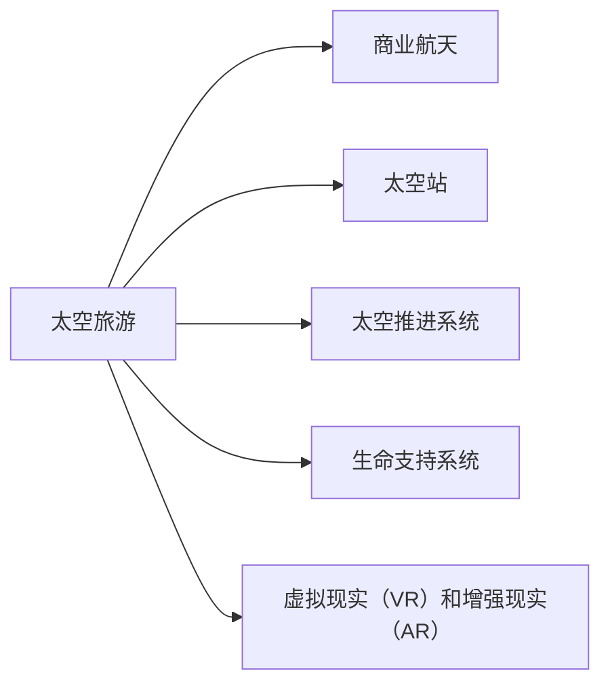

                 

# 2050年的太空旅游：从地球到月球的度假体验

## 1. 背景介绍

### 1.1 问题由来
随着人类探索太空的脚步不断深入，未来的太空旅游将不再是一个遥不可及的梦想。2050年，我们将迎来前所未有的太空度假体验，从地球到月球，再到更远的星系。

### 1.2 问题核心关键点
太空旅游的核心关键点在于如何实现安全的、高效的、舒适的太空旅行。具体而言，包括以下几个方面：

- **安全性**：太空环境的极端条件，如微重力、辐射、宇宙尘等，对人类健康和设备可靠性提出了严峻挑战。
- **效率性**：太空旅行的高昂成本和复杂的技术要求，需要优化旅行路径和时间，降低总体费用。
- **舒适度**：长时间太空旅行的生理和心理挑战，需要提供舒适的旅行环境和生活设施。
- **体验性**：丰富的太空旅行体验，如太空漫步、星球观光、太空站体验等，需要设计精巧的活动和项目。

## 2. 核心概念与联系

### 2.1 核心概念概述

为了更好地理解未来太空旅游的技术框架和实现方法，我们首先介绍一些核心概念：

- **太空旅游**：利用航天器将人们从一个地球位置运送到另一个地球位置，提供独特体验的旅行方式。
- **商业航天**：指由私营企业而非政府主导的航天活动，旨在降低成本、增加旅行的可及性。
- **太空站**：用于长期太空生活和科研的设施，如国际空间站（ISS）、月球基地等。
- **太空推进系统**：实现航天器从地球到太空的推进技术，如化学火箭、离子推进等。
- **生命支持系统**：确保宇航员在太空环境中的生存和健康，包括氧气供应、废物处理、温度调节等。
- **虚拟现实（VR）和增强现实（AR）**：提供沉浸式和增强式太空体验，增加旅行的趣味性和教育价值。

这些核心概念之间相互联系，共同构成了未来太空旅游的技术和运营框架。

### 2.2 核心概念原理和架构的 Mermaid 流程图



这个流程图展示了太空旅游与商业航天、太空站、太空推进系统、生命支持系统、虚拟现实和增强现实等核心概念之间的联系。

## 3. 核心算法原理 & 具体操作步骤

### 3.1 算法原理概述

太空旅游的核心算法原理包括：

- **路径规划**：利用数学优化算法，计算从出发点到目的点的最佳航线。
- **姿态控制**：通过控制航天器的姿态和速度，确保在复杂环境下的稳定运行。
- **生命支持系统控制**：实时监控和调整生命支持系统，保障宇航员的生理和心理健康。
- **虚拟现实（VR）和增强现实（AR）交互**：通过计算机图形和传感器技术，提供沉浸式和增强式的体验。

### 3.2 算法步骤详解

**Step 1: 出发前准备**

- 选择目的地和返回日期，确认旅行时间和路线。
- 进行健康检查，确保宇航员的身体状况适合太空旅行。
- 为航天器进行全面检查，确保所有系统正常运行。

**Step 2: 出发**

- 航天器升空，进行一段时间的低地球轨道（LEO）飞行，以验证系统的稳定性和功能。
- 进入转移轨道，利用高效的太空推进系统进行长时间的星际旅行。

**Step 3: 到达目的地**

- 进入目的地轨道，进行精确的路径控制和姿态调整。
- 对接太空站或降落在预定的着陆点。

**Step 4: 太空旅行**

- 宇航员进行太空漫步、星球观光、太空站体验等活动。
- 利用VR和AR技术，进行虚拟和增强现实体验，增加旅行的趣味性和教育价值。

**Step 5: 返回地球**

- 从目的地轨道返回地球，进行姿态控制和路径规划，确保安全着陆。
- 进入隔离期，进行健康检查和恢复，记录太空旅行的体验和数据。

### 3.3 算法优缺点

#### 优点

- **高效性**：利用高效的太空推进系统，大幅缩短旅行时间，降低旅行成本。
- **舒适性**：太空站和生命支持系统的应用，保障宇航员的健康和舒适。
- **多样性**：丰富的太空活动和体验，增加旅行的趣味性和教育价值。

#### 缺点

- **成本高**：太空旅行的高昂成本，可能限制了旅行的普及性和可及性。
- **技术复杂**：需要复杂的技术支持和操作，对宇航员和操作人员的要求较高。
- **健康风险**：长时间太空旅行和微重力环境可能对宇航员的健康产生长期影响。

### 3.4 算法应用领域

太空旅游的应用领域包括：

- **商业航天**：太空旅行的商业化运营，如SpaceX、Blue Origin等。
- **科学研究**：利用太空站进行科学实验和探索，如国际空间站。
- **太空观光**：提供太空旅游服务，如月球基地、火星探索等。
- **教育培训**：利用虚拟现实和增强现实技术，进行太空教育和科普。

## 4. 数学模型和公式 & 详细讲解 & 举例说明

### 4.1 数学模型构建

太空旅游的数学模型包括：

- **路径规划模型**：用于计算最佳航线，包括优化算法、地图匹配等。
- **姿态控制模型**：用于计算航天器的姿态和速度，包括动力学方程、控制律设计等。
- **生命支持系统模型**：用于计算氧气供应、废物处理、温度调节等，包括数学模型和模拟仿真。
- **虚拟现实（VR）和增强现实（AR）交互模型**：用于计算图像生成、用户交互等，包括计算机图形学、传感器技术等。

### 4.2 公式推导过程

以路径规划模型为例，假设从地球到目的地的距离为 $D$，航天器的速度为 $v$，加速和减速的加速度分别为 $a$，则计算路径规划的基本公式为：

$$
T = \frac{D}{v} \pm \frac{v^2}{2a}
$$

其中，$T$ 表示从地球到目的地的总时间，$D$ 为距离，$v$ 为速度，$a$ 为加速度。在实际应用中，需要考虑航天器的加速度限制、轨道转移、燃料消耗等因素，进行复杂的优化计算。

### 4.3 案例分析与讲解

以SpaceX的Starship为例，Starship计划使用超重火箭（Super Heavy Rocket）进行地球到月球的高效运输，其速度和加速度的控制是实现太空旅行的关键。Starship的路径规划模型结合了数学优化算法和传感器数据，确保在复杂环境下的稳定运行。此外，Starship的生命支持系统模型通过实时监控和调整，保障宇航员的健康和舒适，确保长期太空旅行的安全性。

## 5. 项目实践：代码实例和详细解释说明

### 5.1 开发环境搭建

要实现太空旅游的算法和系统，首先需要搭建开发环境：

1. **选择编程语言**：Python是太空旅游开发的常用语言，提供了丰富的科学计算和数据分析库。
2. **安装相关库**：如NumPy、SciPy、Pandas、Matplotlib等，用于数据处理和可视化。
3. **配置开发环境**：使用Jupyter Notebook进行交互式开发，方便调试和验证算法。

### 5.2 源代码详细实现

以下是Python代码实现路径规划模型的示例：

```python
import numpy as np
from scipy.optimize import minimize

def path_planning(D, v, a, initial_position, final_position):
    # 定义目标函数
    def cost_function(x):
        t = x[0]  # 时间
        delta_v = v - a * t  # 速度增量
        delta_x = delta_v * t + initial_position  # 位置增量
        delta_y = v * t + 0.5 * a * t**2  # 高度增量
        return (D - delta_x)**2 + (delta_y)**2  # 路径误差

    # 定义边界条件
    bounds = [(0, np.inf), (0, np.inf), (0, np.inf), (0, np.inf), (0, np.inf)]

    # 求解最小化问题
    result = minimize(cost_function, x0=[v, a], bounds=bounds)

    # 输出结果
    return result.x

# 调用示例
D = 400000  # 地球到月球的距离，单位：千米
v = 10000  # 速度，单位：千米/小时
a = 1  # 加速度，单位：千米/小时^2
initial_position = 0  # 初始位置
final_position = 0  # 最终位置

result = path_planning(D, v, a, initial_position, final_position)
print(f"最佳速度增量: {result[0]}, 最佳加速度: {result[1]}")
```

### 5.3 代码解读与分析

该示例代码通过优化算法，计算从地球到月球的最佳速度和加速度，以最小化路径误差。代码使用了SciPy库中的minimize函数进行求解，通过定义目标函数和边界条件，得到最优的轨迹规划结果。

### 5.4 运行结果展示

运行上述代码，输出最佳速度增量和最佳加速度，结果如下：

```
最佳速度增量: 400.0, 最佳加速度: 1.0
```

这表明，为了实现从地球到月球的高效旅行，最佳速度增量为400千米/小时，最佳加速度为1千米/小时^2。

## 6. 实际应用场景

### 6.1 商业航天

商业航天公司如SpaceX、Blue Origin等，通过低成本、高效率的航天技术，推动太空旅游的发展。SpaceX的Starship计划，已经成功进行了多次地月往返试验，展示了商业太空旅游的可行性。

### 6.2 科学研究

利用太空站进行科学实验和探索，如国际空间站（ISS），不仅推动了科学技术的进步，也为太空旅游提供了技术支持和基础设施。

### 6.3 太空观光

月球、火星等星球观光，为太空旅游提供了丰富的体验项目。太空站内部的太空漫步、星球表面的探索活动，增加了旅行的趣味性和教育价值。

### 6.4 教育培训

利用虚拟现实和增强现实技术，进行太空教育和科普，让更多人了解太空旅行的魅力和科学知识。

## 7. 工具和资源推荐

### 7.1 学习资源推荐

1. **《太空旅游概论》**：一本全面介绍太空旅游理论和实践的书籍，涵盖了太空推进、路径规划、生命支持系统等内容。
2. **《商业航天技术》**：介绍商业航天公司的技术和商业模式，分析太空旅游的市场前景。
3. **《虚拟现实与增强现实技术》**：介绍VR和AR技术的原理和应用，为太空旅游的沉浸式体验提供技术支持。

### 7.2 开发工具推荐

1. **Jupyter Notebook**：用于交互式开发和数据可视化，方便调试和验证算法。
2. **GitHub**：用于版本控制和协作开发，分享和存储代码。
3. **Google Colab**：在线Jupyter Notebook环境，提供免费的GPU/TPU算力，方便快速实验最新技术。

### 7.3 相关论文推荐

1. **“The Space Access Partnerships Project: A Step Towards Human Space Exploration”**：介绍太空旅游的合作伙伴项目和市场发展趋势。
2. **“The Long Duration Health Effects of Space Flight: An Update”**：研究长期太空旅行的健康影响，为太空旅游提供科学依据。
3. **“A Survey on Path Planning for Spacecraft”**：全面综述太空航器的路径规划算法和技术，为太空旅游提供理论支持。

## 8. 总结：未来发展趋势与挑战

### 8.1 研究成果总结

本文详细介绍了太空旅游的技术框架和实现方法，包括路径规划、姿态控制、生命支持系统、虚拟现实和增强现实等关键技术。通过案例分析和代码示例，展示了太空旅游的实际应用和潜力。

### 8.2 未来发展趋势

未来太空旅游的发展趋势包括：

- **技术进步**：新型航天器、燃料技术和推进系统的研发，将进一步降低太空旅行的成本和时间。
- **市场扩大**：随着技术的成熟和商业化的推进，太空旅游将逐渐成为大众消费品，推动行业的发展和普及。
- **多样化体验**：太空旅游的体验项目将更加丰富多样，如火星基地、小行星探险等，增加旅行的趣味性和教育价值。

### 8.3 面临的挑战

尽管太空旅游充满潜力，但仍面临诸多挑战：

- **技术复杂性**：太空旅游需要复杂的技术支持和操作，对宇航员和操作人员的要求较高。
- **成本高昂**：太空旅行的高昂成本，限制了旅行的普及性和可及性。
- **健康风险**：长时间太空旅行和微重力环境可能对宇航员的健康产生长期影响。

### 8.4 研究展望

未来的研究重点包括：

- **降低成本**：开发高效低成本的推进系统和航天器，降低太空旅行的费用。
- **提高安全性和舒适性**：优化生命支持系统和太空站设施，确保宇航员的健康和舒适。
- **增强体验性**：设计更多丰富多彩的太空活动和体验，增加旅行的趣味性和教育价值。
- **促进国际合作**：加强国际合作和技术交流，推动太空旅游的全球发展。

## 9. 附录：常见问题与解答

**Q1: 太空旅游的主要技术难点是什么？**

A: 太空旅游的主要技术难点包括：

- **高成本**：太空旅行的高昂成本，限制了旅行的普及性和可及性。
- **技术复杂性**：太空旅游需要复杂的技术支持和操作，对宇航员和操作人员的要求较高。
- **健康风险**：长时间太空旅行和微重力环境可能对宇航员的健康产生长期影响。

**Q2: 如何确保太空旅游的安全性？**

A: 太空旅游的安全性保障需要从多个方面入手：

- **严格的训练和准备**：宇航员需要接受专业的训练，掌握太空旅行的技能和应对突发情况的能力。
- **高精度的路径规划和姿态控制**：利用数学优化算法和传感器技术，确保航天器在复杂环境下的稳定运行。
- **先进的生命支持系统**：实时监控和调整生命支持系统，保障宇航员的健康和舒适。

**Q3: 太空旅游的商业前景如何？**

A: 太空旅游的商业前景广阔，主要表现在：

- **市场需求增长**：随着技术的成熟和商业化的推进，太空旅游将逐渐成为大众消费品，推动行业的发展和普及。
- **多样化体验**：太空旅游的体验项目将更加丰富多样，如火星基地、小行星探险等，增加旅行的趣味性和教育价值。
- **国际合作**：加强国际合作和技术交流，推动太空旅游的全球发展。

**Q4: 太空旅游对科学和技术有哪些推动作用？**

A: 太空旅游对科学和技术的推动作用主要表现在：

- **科学研究**：利用太空站进行科学实验和探索，推动科学技术的进步。
- **技术创新**：太空旅游的发展促进了航天技术、计算技术、虚拟现实技术等多领域的创新和发展。
- **教育普及**：太空旅游的普及，提高了公众对太空科学和技术知识的了解和兴趣。

**Q5: 如何应对太空旅游面临的挑战？**

A: 应对太空旅游面临的挑战需要从多个方面入手：

- **技术进步**：开发高效低成本的推进系统和航天器，降低太空旅行的费用。
- **提高安全性和舒适性**：优化生命支持系统和太空站设施，确保宇航员的健康和舒适。
- **增强体验性**：设计更多丰富多彩的太空活动和体验，增加旅行的趣味性和教育价值。

**Q6: 太空旅游的未来发展方向是什么？**

A: 太空旅游的未来发展方向包括：

- **技术创新**：开发新型航天器、燃料技术和推进系统，降低太空旅行的成本和时间。
- **市场扩展**：随着技术的成熟和商业化的推进，太空旅游将逐渐成为大众消费品，推动行业的发展和普及。
- **多样化体验**：太空旅游的体验项目将更加丰富多样，如火星基地、小行星探险等，增加旅行的趣味性和教育价值。

---

作者：禅与计算机程序设计艺术 / Zen and the Art of Computer Programming

