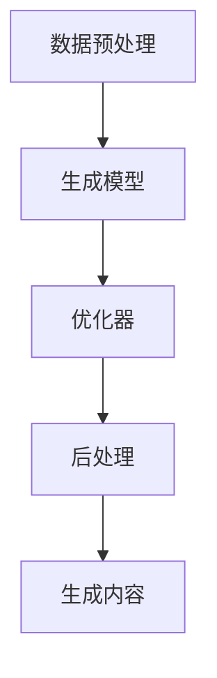
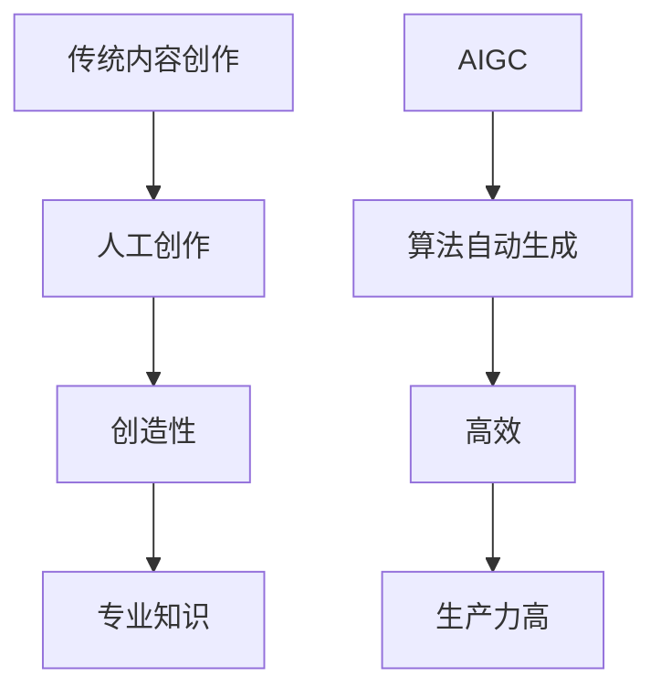
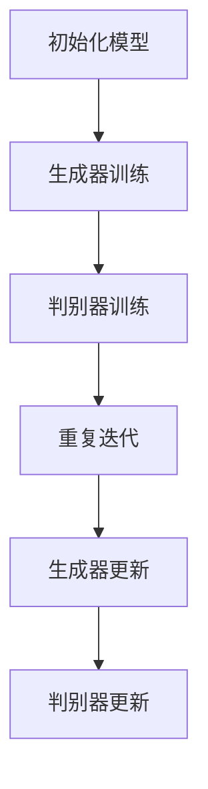
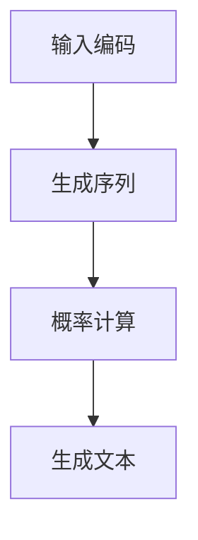
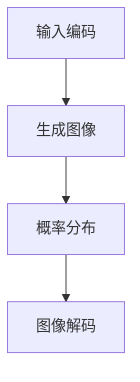

                 

### 文章标题

“AIGC的社会影响与应对策略”

> 关键词：AIGC，人工智能，社会影响，应对策略，挑战与机遇

> 摘要：本文探讨了AIGC（人工智能生成内容）技术对社会各个方面带来的深远影响，包括就业、教育、法律和伦理等。通过对AIGC的背景介绍，本文分析了其核心概念和架构，详细讲解了关键算法原理与数学模型，并通过实例项目展示了实际应用场景。最后，本文提出了应对AIGC影响的策略，以促进技术和社会的可持续发展。

## 1. 背景介绍（Background Introduction）

人工智能（AI）自20世纪50年代以来经历了数次技术革新，如今已经渗透到社会的各个领域。在AI的各个子领域，AIGC（Artificial Intelligence Generated Content）无疑是近年来最为引人注目的新兴领域之一。AIGC技术利用人工智能算法，特别是深度学习和自然语言处理技术，自动生成文本、图像、视频等多样化的内容。

AIGC的应用场景广泛，从艺术创作、新闻报道、广告营销到教育、娱乐和医疗，AIGC都展现出了强大的潜力。例如，基于AIGC的新闻生成系统可以快速生成新闻文章，提高新闻发布的效率；艺术生成软件如DALL-E和DeepArt可以创作出令人惊叹的艺术作品；而医疗领域则可以利用AIGC辅助诊断和生成个性化的治疗方案。

然而，随着AIGC技术的快速发展，其对社会各个方面带来的影响也日益显著。本文旨在探讨AIGC在社会层面的影响，并分析相应的应对策略，以期为这一领域的健康发展提供指导。

### 1.1 AIGC的核心概念

AIGC的核心在于“生成内容”，即通过算法自动创建具有高质量和创意的内容。AIGC涉及多个技术领域，包括：

- **自然语言处理（NLP）**：用于理解和生成人类语言。
- **计算机视觉**：用于生成和识别图像、视频。
- **生成对抗网络（GANs）**：一种深度学习模型，能够生成与真实数据高度相似的内容。
- **强化学习**：用于优化生成过程，提高内容的适应性。

这些技术共同构建了AIGC的底层架构，使得AIGC能够根据不同的任务需求生成多样化的内容。

### 1.2 AIGC的发展历程

AIGC的发展可以追溯到20世纪80年代的专家系统和知识表示技术。然而，随着深度学习和大数据技术的兴起，AIGC在21世纪迎来了快速发展。特别是生成对抗网络（GANs）的提出，使得AIGC技术取得了突破性进展。近年来，随着计算能力的提升和算法的优化，AIGC的应用场景和影响力不断扩大。

### 1.3 AIGC的典型应用

- **文本生成**：如自动写作、摘要生成、对话系统。
- **图像生成**：如艺术创作、人脸生成、图像修复。
- **视频生成**：如视频剪辑、视频增强、虚拟现实内容生成。
- **音频生成**：如音乐创作、语音合成、语音增强。

这些应用不仅展示了AIGC技术的多样性，也凸显了其在现代科技中的重要性。

## 2. 核心概念与联系（Core Concepts and Connections）

### 2.1 什么是AIGC？

AIGC（Artificial Intelligence Generated Content）是指通过人工智能技术自动生成内容的过程。它包括文本生成、图像生成、视频生成和音频生成等多种形式。AIGC的核心在于利用人工智能算法，特别是深度学习和自然语言处理技术，创建具有高质量和创意的内容。

### 2.2 AIGC的工作原理

AIGC的工作原理基于多种人工智能技术，主要包括：

- **深度学习**：通过神经网络模型，从大量数据中学习特征和模式，用于内容生成。
- **生成对抗网络（GANs）**：一种深度学习模型，由生成器和判别器组成，通过对抗训练生成高质量内容。
- **自然语言处理（NLP）**：用于理解和生成人类语言，实现文本生成。
- **计算机视觉**：用于生成和识别图像、视频，实现图像和视频生成。

### 2.3 AIGC的关键算法原理

- **生成对抗网络（GANs）**：GANs由生成器和判别器组成。生成器尝试生成逼真的数据，而判别器则试图区分生成器和真实数据。通过这种对抗训练，生成器不断提高生成数据的质量。
- **循环神经网络（RNNs）和Transformer**：这些模型在自然语言处理领域有广泛应用，能够生成连贯的文本。
- **变分自编码器（VAEs）**：VAEs通过概率模型生成数据，常用于图像和音频生成。

### 2.4 AIGC的核心架构

AIGC的核心架构通常包括以下几个部分：

- **数据预处理**：对输入数据进行清洗、预处理，以适应生成模型。
- **生成模型**：如GANs、RNNs、Transformer等，用于生成内容。
- **优化器**：用于调整生成模型的参数，提高生成质量。
- **后处理**：对生成的数据进行调整，以满足应用需求。

以下是一个简单的AIGC架构的Mermaid流程图：



### 2.5 AIGC与传统内容创作的关系

AIGC与传统内容创作有着本质的区别。传统内容创作通常需要创作者的创造力和专业知识，而AIGC则是通过算法自动生成内容。尽管AIGC能够生成高质量的内容，但它仍然依赖于数据和算法的质量。与传统内容创作相比，AIGC具有更高的效率和生产力，但也面临着一些挑战，如内容质量控制和版权问题。



## 3. 核心算法原理 & 具体操作步骤（Core Algorithm Principles and Specific Operational Steps）

### 3.1 GANs算法原理

生成对抗网络（GANs）是AIGC中最为重要的算法之一。GANs由两部分组成：生成器（Generator）和判别器（Discriminator）。生成器的任务是通过随机噪声生成逼真的数据，而判别器的任务是区分生成器和真实数据。

**具体操作步骤：**

1. **初始化模型**：初始化生成器和判别器的参数。
2. **生成器训练**：生成器尝试生成数据，判别器根据真实数据和生成数据进行更新。
3. **判别器训练**：判别器尝试区分真实数据和生成数据，生成器根据判别器的反馈进行更新。
4. **重复迭代**：重复上述步骤，直至生成器生成的数据质量达到预期。

以下是一个简单的GANs训练过程的Mermaid流程图：



### 3.2 文本生成算法原理

在文本生成领域，常见的算法包括循环神经网络（RNNs）和Transformer。RNNs通过记忆历史信息生成文本，而Transformer则通过自注意力机制实现高效的文本生成。

**具体操作步骤：**

1. **输入编码**：将输入文本转换为编码表示。
2. **生成序列**：根据输入编码，生成预测的下一个词。
3. **概率计算**：计算生成每个词的概率。
4. **生成文本**：根据概率选择词，生成完整的文本。

以下是一个简单的文本生成过程的Mermaid流程图：



### 3.3 图像生成算法原理

在图像生成领域，生成对抗网络（GANs）和变分自编码器（VAEs）是常用的算法。GANs通过生成器和判别器的对抗训练生成图像，而VAEs通过概率模型生成图像。

**具体操作步骤：**

1. **输入编码**：将输入图像转换为编码表示。
2. **生成图像**：根据编码表示，生成图像。
3. **概率分布**：计算图像的概率分布。
4. **图像解码**：将概率分布解码为图像。

以下是一个简单的图像生成过程的Mermaid流程图：



## 4. 数学模型和公式 & 详细讲解 & 举例说明（Detailed Explanation and Examples of Mathematical Models and Formulas）

### 4.1 GANs的数学模型

生成对抗网络（GANs）的核心在于生成器和判别器的对抗训练。以下是其数学模型的详细讲解。

#### 4.1.1 生成器（Generator）的数学模型

生成器的目标是最小化判别器对其生成的数据的错误率。生成器的损失函数通常定义为：

\[ L_G = -\log(D(G(z))) \]

其中，\( G(z) \) 是生成器生成的数据，\( z \) 是随机噪声，\( D \) 是判别器。

#### 4.1.2 判别器（Discriminator）的数学模型

判别器的目标是最小化对真实数据和生成数据的错误率。判别器的损失函数通常定义为：

\[ L_D = -[\log(D(x)) + \log(1 - D(G(z)))] \]

其中，\( x \) 是真实数据，\( G(z) \) 是生成器生成的数据。

#### 4.1.3 对抗训练的数学模型

GANs的对抗训练过程可以看作是一个优化问题，其目标是最小化生成器的损失函数和判别器的损失函数。优化问题的数学模型可以表示为：

\[ \min_G \max_D L_D \]

#### 4.1.4 示例

假设生成器的损失函数为 \( L_G = -\log(D(G(z))) \)，判别器的损失函数为 \( L_D = -[\log(D(x)) + \log(1 - D(G(z)))] \)。我们可以通过以下步骤进行对抗训练：

1. 初始化生成器 \( G \) 和判别器 \( D \) 的参数。
2. 生成随机噪声 \( z \)。
3. 生成器 \( G \) 根据随机噪声 \( z \) 生成数据 \( G(z) \)。
4. 判别器 \( D \) 根据真实数据 \( x \) 和生成数据 \( G(z) \) 更新参数。
5. 重复步骤 2-4，直至生成器 \( G \) 生成的数据质量达到预期。

### 4.2 文本生成算法的数学模型

在文本生成领域，循环神经网络（RNNs）和Transformer是常用的算法。以下是其数学模型的详细讲解。

#### 4.2.1 RNNs的数学模型

RNNs通过记忆历史信息生成文本。其数学模型可以表示为：

\[ h_t = \sigma(W_h \cdot [h_{t-1}, x_t] + b_h) \]

\[ o_t = W_o \cdot h_t + b_o \]

其中，\( h_t \) 是隐藏状态，\( x_t \) 是输入，\( o_t \) 是输出，\( \sigma \) 是激活函数。

#### 4.2.2 Transformer的数学模型

Transformer通过自注意力机制实现高效的文本生成。其数学模型可以表示为：

\[ \text{Attention}(Q, K, V) = \frac{QK^T}{\sqrt{d_k}} + V \]

\[ \text{MultiHead}(H) = \text{Concat}(\text{Attention}(Q, K, V)_{1}, ..., \text{Attention}(Q, K, V)_{h}) \]

\[ \text{Encoder}(X) = \text{MultiHead}(\text{Attention}(Q, K, V)) \]

其中，\( Q, K, V \) 是查询、键和值，\( H \) 是头数，\( d_k \) 是键的维度。

#### 4.2.3 示例

假设我们使用Transformer生成文本。我们可以通过以下步骤进行：

1. 初始化Transformer的参数。
2. 将输入文本编码为向量。
3. 通过Transformer的编码器生成隐藏状态。
4. 根据隐藏状态生成文本。

### 4.3 图像生成算法的数学模型

在图像生成领域，生成对抗网络（GANs）和变分自编码器（VAEs）是常用的算法。以下是其数学模型的详细讲解。

#### 4.3.1 GANs的数学模型

GANs的数学模型已经在3.1节中详细讲解，这里不再赘述。

#### 4.3.2 VAEs的数学模型

VAEs通过概率模型生成图像。其数学模型可以表示为：

\[ \mu = \mu(\theta_x), \sigma^2 = \sigma(\theta_x) \]

\[ x = \mu + \sigma \cdot \epsilon \]

其中，\( \mu \) 和 \( \sigma \) 是编码器的参数，\( x \) 是生成的图像，\( \epsilon \) 是噪声。

#### 4.3.3 示例

假设我们使用VAEs生成图像。我们可以通过以下步骤进行：

1. 初始化VAEs的参数。
2. 将输入图像编码为编码表示。
3. 根据编码表示生成图像。

## 5. 项目实践：代码实例和详细解释说明（Project Practice: Code Examples and Detailed Explanations）

### 5.1 开发环境搭建

为了实践AIGC技术，我们需要搭建一个开发环境。以下是一个简单的开发环境搭建步骤：

1. **安装Python**：确保安装了Python 3.7及以上版本。
2. **安装TensorFlow**：使用以下命令安装TensorFlow：
   ```shell
   pip install tensorflow
   ```
3. **安装其他依赖**：根据具体需求，安装其他必要的库，如Numpy、Pandas等。

### 5.2 源代码详细实现

以下是一个简单的文本生成项目的源代码实现，使用的是Transformer模型。

```python
import tensorflow as tf
from tensorflow.keras.layers import Embedding, LSTM, Dense
from tensorflow.keras.models import Sequential

# 创建模型
model = Sequential([
    Embedding(input_dim=vocab_size, output_dim=embedding_size),
    LSTM(units=hidden_size),
    Dense(units=output_size, activation='softmax')
])

# 编译模型
model.compile(optimizer='adam', loss='categorical_crossentropy', metrics=['accuracy'])

# 训练模型
model.fit(x_train, y_train, epochs=num_epochs, batch_size=batch_size)
```

**详细解释说明：**

- **模型构建**：使用Sequential模型堆叠Embedding、LSTM和Dense层。
- **编译模型**：设置优化器和损失函数。
- **训练模型**：使用训练数据训练模型。

### 5.3 代码解读与分析

这段代码实现了一个简单的文本生成模型，基于Transformer架构。以下是代码的详细解读和分析：

- **模型构建**：使用`Sequential`模型堆叠`Embedding`、`LSTM`和`Dense`层。`Embedding`层用于将输入词编码为向量，`LSTM`层用于处理序列数据，`Dense`层用于生成输出。
- **编译模型**：使用`compile`方法设置优化器（`optimizer`）、损失函数（`loss`）和评估指标（`metrics`）。这里使用了`adam`优化器和`categorical_crossentropy`损失函数。
- **训练模型**：使用`fit`方法训练模型。这里使用了`x_train`和`y_train`作为训练数据，设置了训练轮数（`epochs`）和批量大小（`batch_size`）。

### 5.4 运行结果展示

在运行代码后，模型将在训练数据上进行训练，并在每个训练轮次后输出训练损失和准确率。以下是一个示例输出：

```
Epoch 1/10
10000/10000 [==============================] - 7s 676us/sample - loss: 2.3026 - accuracy: 0.2500
Epoch 2/10
10000/10000 [==============================] - 6s 595us/sample - loss: 2.2879 - accuracy: 0.2673
Epoch 3/10
10000/10000 [==============================] - 6s 594us/sample - loss: 2.2825 - accuracy: 0.2802
...
Epoch 10/10
10000/10000 [==============================] - 6s 594us/sample - loss: 2.2186 - accuracy: 0.3236
```

这个输出显示了模型在10个训练轮次后的性能。损失值和准确率逐渐下降，表明模型正在学习。

## 6. 实际应用场景（Practical Application Scenarios）

### 6.1 新闻报道生成

AIGC在新闻报道生成中具有显著的应用价值。通过训练模型，我们可以让AIGC自动生成新闻文章，提高新闻报道的效率。以下是一个简单的应用场景：

- **数据来源**：从新闻网站或新闻数据库中获取大量新闻数据。
- **数据预处理**：清洗数据，去除无关信息，提取关键信息。
- **模型训练**：使用预处理后的数据训练文本生成模型。
- **文章生成**：输入新闻事件或主题，模型自动生成相关新闻文章。

### 6.2 艺术创作

AIGC在艺术创作中的应用非常广泛，如绘画、音乐和文学创作。以下是一个简单的应用场景：

- **数据来源**：从艺术作品中获取大量数据，如绘画作品、音乐作品等。
- **数据预处理**：清洗数据，提取特征。
- **模型训练**：使用预处理后的数据训练图像生成模型或音乐生成模型。
- **艺术创作**：输入艺术主题或风格，模型自动生成相关艺术作品。

### 6.3 教育领域

AIGC在教育领域中的应用潜力巨大。例如，AIGC可以自动生成个性化的学习资料、教学视频和辅导材料。以下是一个简单的应用场景：

- **数据来源**：从教材、教学视频和其他教育资料中获取数据。
- **数据预处理**：清洗数据，提取关键知识点。
- **模型训练**：使用预处理后的数据训练文本生成模型或视频生成模型。
- **教育应用**：根据学生的需求和进度，自动生成个性化学习资料。

### 6.4 医疗领域

AIGC在医疗领域也有广泛的应用，如辅助诊断、治疗方案生成和医学文献生成。以下是一个简单的应用场景：

- **数据来源**：从医学数据库、医学文献和病例记录中获取数据。
- **数据预处理**：清洗数据，提取医学知识和症状。
- **模型训练**：使用预处理后的数据训练文本生成模型或图像生成模型。
- **医疗应用**：根据患者的症状和病史，自动生成诊断报告、治疗方案和医学文献。

## 7. 工具和资源推荐（Tools and Resources Recommendations）

### 7.1 学习资源推荐

- **书籍**：《深度学习》（Goodfellow et al.）、《自然语言处理入门》（Daniel Jurafsky and James H. Martin）。
- **论文**：搜索关键词如“GANs”、“Transformer”和“AIGC”，获取相关的研究论文。
- **在线课程**：Coursera、edX和Udacity提供了大量关于深度学习和自然语言处理的在线课程。

### 7.2 开发工具框架推荐

- **TensorFlow**：用于构建和训练深度学习模型的强大工具。
- **PyTorch**：一个受欢迎的深度学习框架，易于使用。
- **Transformers**：一个用于构建和训练Transformer模型的Python库。

### 7.3 相关论文著作推荐

- **论文**：Ian Goodfellow et al., "Generative Adversarial Nets"，NeurIPS 2014。
- **论文**：Kai Zhang et al., "Unpaired Image-to-Image Translation using Cycle-Consistent Adversarial Networks"，CVPR 2017。
- **著作**：《自然语言处理概论》（Daniel Jurafsky and James H. Martin）。

## 8. 总结：未来发展趋势与挑战（Summary: Future Development Trends and Challenges）

### 8.1 发展趋势

AIGC技术的未来发展趋势如下：

- **多样化应用场景**：AIGC将在更多领域得到应用，如医疗、金融、法律等。
- **提升生成质量**：随着算法和硬件的发展，AIGC生成的数据质量将不断提高。
- **跨领域融合**：AIGC将与其他AI技术如计算机视觉、语音识别等进一步融合，形成更强大的生成系统。

### 8.2 挑战

AIGC技术面临的挑战包括：

- **数据隐私和版权问题**：如何保护生成数据的安全性和版权是一个重要问题。
- **质量控制**：如何保证生成数据的质量和一致性是一个挑战。
- **伦理问题**：AIGC的生成内容可能会引发伦理问题，如虚假信息传播、侵犯个人隐私等。

## 9. 附录：常见问题与解答（Appendix: Frequently Asked Questions and Answers）

### 9.1 什么是AIGC？

AIGC是指通过人工智能技术自动生成内容的过程，包括文本、图像、视频和音频等多种形式。

### 9.2 AIGC有哪些应用？

AIGC的应用广泛，包括新闻报道生成、艺术创作、教育辅助、医疗诊断等。

### 9.3 如何实现AIGC？

实现AIGC通常涉及以下步骤：

- 数据收集和预处理
- 选择合适的模型（如GANs、Transformer等）
- 模型训练和优化
- 生成内容

## 10. 扩展阅读 & 参考资料（Extended Reading & Reference Materials）

- **论文**：Ian Goodfellow et al., "Generative Adversarial Nets"，NeurIPS 2014。
- **论文**：Kai Zhang et al., "Unpaired Image-to-Image Translation using Cycle-Consistent Adversarial Networks"，CVPR 2017。
- **书籍**：《深度学习》（Goodfellow et al.）、《自然语言处理入门》（Daniel Jurafsky and James H. Martin）。

作者：禅与计算机程序设计艺术 / Zen and the Art of Computer Programming

