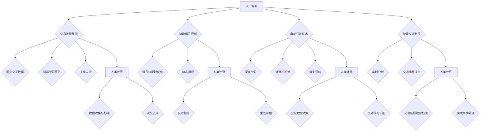

                 

### 文章标题

**AI与人类计算：打造可持续发展的城市交通管理策略与规划**

城市交通管理是现代城市发展中至关重要的一环。随着城市化进程的加速和人口的不断增加，城市交通面临着巨大的压力，如交通拥堵、环境污染和能源消耗等问题。如何通过人工智能（AI）和人类计算（Human Computation）相结合，打造可持续发展的城市交通管理策略与规划，成为当前研究的热点和挑战。

本文旨在探讨如何利用AI和人类计算技术解决城市交通问题，为城市交通管理提供创新的思路和方法。文章结构如下：

1. 背景介绍
2. 核心概念与联系
3. 核心算法原理 & 具体操作步骤
4. 数学模型和公式 & 详细讲解 & 举例说明
5. 项目实践：代码实例和详细解释说明
6. 实际应用场景
7. 工具和资源推荐
8. 总结：未来发展趋势与挑战
9. 附录：常见问题与解答
10. 扩展阅读 & 参考资料

通过上述结构，我们将逐步分析城市交通管理的挑战，介绍相关技术概念，探讨核心算法原理，展示实际应用场景，并提供相关资源和未来展望。让我们开始这次探索之旅。

### 关键词

- 城市交通管理
- 人工智能
- 人类计算
- 可持续发展
- 交通拥堵
- 环境污染
- 能源消耗

### 摘要

本文探讨了如何利用人工智能（AI）和人类计算技术打造可持续发展的城市交通管理策略与规划。首先，我们介绍了城市交通管理面临的问题和挑战，随后详细介绍了AI和人类计算的基本概念。接着，文章分析了核心算法原理，并通过实际项目实践展示了相关技术的应用。最后，我们总结了未来发展趋势与挑战，并提供了相关资源和展望。

### 1. 背景介绍

城市交通管理是现代城市治理的重要组成部分。随着城市化进程的加速，城市交通系统面临着前所未有的挑战。首先，交通拥堵问题日益严重。据估计，全球有超过1000个城市每天面临交通拥堵问题，这不仅影响了市民的出行体验，还增加了时间和经济成本。其次，环境污染和能源消耗也是亟待解决的问题。交通排放是城市空气污染的主要来源之一，同时也消耗了大量的能源资源。

此外，城市交通管理还面临着数据获取和处理难题。传统交通管理系统依赖于人工统计数据，方法滞后、效率低下，难以实时反映交通状况。随着物联网（IoT）和传感器技术的发展，虽然可以获取大量交通数据，但如何有效处理和利用这些数据，仍然是当前研究的热点和难点。

在这些背景下，人工智能（AI）和人类计算技术应运而生，为城市交通管理提供了新的思路和方法。AI技术可以通过大数据分析和预测，优化交通流量、减少拥堵，同时提高交通系统的效率和安全性。人类计算则通过众包数据收集和评估，补充AI技术的不足，提供更准确、实时的交通信息。

本文旨在探讨如何通过AI和人类计算技术相结合，解决城市交通管理中的难题，为实现可持续发展提供可行的策略与规划。通过介绍相关技术概念、核心算法原理、实际应用案例，以及未来的发展趋势与挑战，本文希望能为城市交通管理领域的研究和实践提供有益的参考。

### 2. 核心概念与联系

#### 2.1 人工智能（AI）在交通管理中的应用

人工智能（AI）在交通管理中的应用日益广泛，主要涵盖以下几方面：

1. **交通流量预测**：利用历史交通数据，结合机器学习算法，AI可以预测未来一段时间内的交通流量变化，为交通管理部门提供决策支持。
2. **智能信号控制**：通过AI算法优化信号灯的配时，实现交通流量的动态调控，减少交通拥堵和排放。
3. **自动驾驶技术**：自动驾驶技术是AI在交通领域的重要应用之一，通过深度学习和计算机视觉，自动驾驶车辆能够实现自主导航和安全驾驶。
4. **智能交通监控**：利用AI技术，对交通监控视频进行实时分析，识别车辆类型、行驶速度等交通信息，为交通管理部门提供数据支持。

#### 2.2 人类计算（Human Computation）的概念和特点

人类计算（Human Computation）是一种结合了人类智慧和计算机能力的计算模式，其核心思想是通过人类的判断和感知能力，补充计算机在处理复杂任务时的不足。人类计算具有以下特点：

1. **灵活性**：人类计算能够处理不确定性和模糊性较高的任务，如自然语言处理、图像识别等。
2. **创造性**：人类在解决问题时能够发挥创造性思维，提出创新的解决方案。
3. **协作性**：人类计算通常需要多人合作，通过众包等方式，实现大规模数据收集和任务分配。

#### 2.3 人工智能与人类计算在交通管理中的结合

人工智能和人类计算在交通管理中的结合，可以发挥各自的优势，实现更高效、智能的交通管理。以下是一些具体的结合方式：

1. **数据收集与标注**：利用人类计算的力量，对交通数据进行收集和标注，如通过众包平台收集交通拥堵信息，通过人类视觉识别进行交通监控视频的标注。
2. **决策支持**：将人类计算的智慧和AI的预测能力相结合，为交通管理部门提供更准确的决策支持。例如，结合AI预测的交通流量数据和人类对交通状况的主观评估，制定更优化的交通调度策略。
3. **实时监控与反馈**：通过人类计算实时监控交通状况，及时识别和处理突发交通事件。同时，利用AI技术对交通监控数据进行分析和预测，为未来的交通管理提供数据支持。

#### 2.4 人工智能与人类计算的关系

人工智能和人类计算在交通管理中并非相互独立，而是相辅相成的关系。人工智能提供了强大的计算能力和自动化处理能力，但其在处理复杂、不确定的任务时仍存在局限性。而人类计算则能够发挥灵活性和创造性，弥补AI的不足。通过二者的结合，可以实现更高效、智能的交通管理。

综上所述，人工智能和人类计算在交通管理中的应用具有广泛的前景。通过深入探讨二者的核心概念和联系，本文为后续章节的分析和讨论奠定了基础。

#### 2.5 人工智能与人类计算在交通管理中的关系图



通过上述Mermaid流程图，我们可以直观地看到人工智能和人类计算在交通管理中的相互关系和具体应用。人工智能提供了强大的计算和分析能力，而人类计算则发挥了灵活性和创造性，共同推动交通管理走向智能化和可持续发展。

#### 2.6 人工智能与人类计算的对比与互补

**人工智能：**
- **优势**：强大的计算能力、高效的数据处理、自动化程度高、不易受情绪影响。
- **局限**：在面对复杂、不确定性任务时表现不佳，难以替代人类在创造性和判断方面的作用。

**人类计算：**
- **优势**：灵活性强、具备创造性思维、能够处理模糊和不确定性任务、协作性高。
- **局限**：处理速度较慢、容易受到情绪和疲劳影响、难以规模化。

**对比与互补：**
- **对比**：人工智能和人类计算在处理任务时各有优势和局限。人工智能擅长处理大规模、结构化数据，而人类计算则在处理复杂、不确定、模糊任务时表现优异。
- **互补**：通过人工智能和人类计算的结合，可以实现优势互补。人工智能可以处理大规模数据，提高处理速度和效率；人类计算则可以补充人工智能的不足，提供更准确、灵活的决策支持。

综上所述，人工智能和人类计算在交通管理中具有显著的互补性。二者结合不仅能够提高交通管理的效率和准确性，还能为可持续发展提供强有力的技术支持。

### 3. 核心算法原理 & 具体操作步骤

#### 3.1 人工智能（AI）算法原理

在城市交通管理中，人工智能算法主要应用于交通流量预测、信号控制优化、自动驾驶技术等方面。以下将介绍几种核心的AI算法及其工作原理：

1. **交通流量预测**：
   - **时间序列分析**：通过分析历史交通数据，使用时间序列模型（如ARIMA、LSTM等）预测未来一段时间内的交通流量。时间序列分析能够捕捉时间相关的模式，为交通流量预测提供基础。
   - **多变量回归分析**：结合多个影响因素（如天气、节假日、道路状况等），使用多变量回归模型预测交通流量。多变量回归分析能够考虑更多影响因素，提高预测准确性。

2. **智能信号控制**：
   - **优化算法**：利用优化算法（如遗传算法、粒子群优化等）对信号灯的配时进行优化，以减少交通拥堵和排放。优化算法能够在满足交通流量的基础上，找到最优的信号灯配时方案。
   - **深度强化学习**：通过深度强化学习算法，结合交通流量和道路状况，实时调整信号灯配时。深度强化学习能够处理复杂的环境和动态变化，实现更智能的信号控制。

3. **自动驾驶技术**：
   - **深度学习**：使用深度学习算法（如卷积神经网络、循环神经网络等）进行图像识别和物体检测，为自动驾驶车辆提供实时感知。深度学习能够处理复杂、模糊的视觉信息，提高自动驾驶的安全性。
   - **轨迹规划**：利用运动学模型和路径规划算法（如Dijkstra算法、A*算法等），为自动驾驶车辆规划最优行驶轨迹。轨迹规划能够考虑道路状况、交通状况等因素，确保车辆安全、高效行驶。

#### 3.2 人类计算（Human Computation）原理

人类计算在城市交通管理中的应用主要体现在数据收集、标注、实时监控和评估等方面。以下将介绍几种核心的人类计算原理：

1. **众包数据收集**：
   - **任务分配**：通过众包平台，将交通数据收集任务分配给大量用户。用户通过手机应用或其他渠道，实时上报交通状况，如拥堵路段、交通事故等。
   - **数据质量评估**：对众包数据进行质量评估，剔除错误和不准确的数据，确保数据的可靠性。

2. **实时监控与评估**：
   - **主观评估**：利用人类的主观判断和感知能力，对交通监控视频进行实时分析，识别车辆类型、行驶速度等交通信息。主观评估能够补充机器视觉系统的不足，提高交通信息准确性。
   - **突发事件处理**：通过实时监控，及时发现和处理交通突发事件，如交通事故、道路塌陷等。人类计算在处理突发交通事件方面具有明显优势，能够快速响应和处理。

3. **交通监控视频标注**：
   - **标注任务分配**：将交通监控视频标注任务分配给众包平台上的用户。用户通过标注工具，对交通监控视频中的车辆、道路状况等进行标注。
   - **标注数据质量评估**：对标注结果进行质量评估，确保标注数据的准确性。

#### 3.3 人工智能与人类计算的协同操作步骤

为了实现人工智能和人类计算的协同工作，可以按照以下步骤进行：

1. **数据收集与标注**：
   - 利用众包平台，收集大量交通数据，包括车辆位置、速度、道路状况等。
   - 对收集到的数据进行标注，如车辆类型、行驶方向等，利用人类计算进行数据标注，提高数据准确性。

2. **数据预处理**：
   - 对收集到的数据进行清洗和预处理，剔除错误和不准确的数据。
   - 利用数据预处理技术，如归一化、去噪等，提高数据质量。

3. **模型训练与优化**：
   - 使用预处理后的数据，训练人工智能模型，如时间序列模型、深度学习模型等。
   - 对模型进行优化，如调整超参数、集成模型等，提高模型性能。

4. **实时监控与反馈**：
   - 利用人工智能模型，对实时交通数据进行分析和预测，如交通流量预测、信号灯配时优化等。
   - 结合人类计算的结果，对模型预测进行实时反馈和调整，提高预测准确性。

5. **决策支持与执行**：
   - 将人工智能和人类计算的结果结合起来，为交通管理部门提供决策支持，如交通调度、信号控制等。
   - 根据决策结果，执行相应的交通管理措施，如调整信号灯配时、道路封锁等。

通过上述步骤，可以实现人工智能和人类计算的协同工作，为城市交通管理提供高效、智能的解决方案。

### 4. 数学模型和公式 & 详细讲解 & 举例说明

#### 4.1 数学模型

在城市交通管理中，常用的数学模型包括时间序列模型、多变量回归模型、优化算法模型等。以下将介绍这些模型的基本原理和具体应用。

1. **时间序列模型**：
   - **ARIMA模型**：自回归积分滑动平均模型（AutoRegressive Integrated Moving Average, ARIMA）是一种广泛应用于时间序列预测的模型。它通过自回归（AR）、差分（I）和移动平均（MA）三个部分来捕捉时间序列的特征。
     - **公式**：
       $$ X_t = c + \phi_1 X_{t-1} + \phi_2 X_{t-2} + \cdots + \phi_p X_{t-p} + \theta_1 \varepsilon_{t-1} + \theta_2 \varepsilon_{t-2} + \cdots + \theta_q \varepsilon_{t-q} $$
       其中，\( X_t \) 为时间序列的当前值，\( c \) 为常数项，\( \phi_1, \phi_2, \cdots, \phi_p \) 为自回归系数，\( \theta_1, \theta_2, \cdots, \theta_q \) 为移动平均系数，\( \varepsilon_t \) 为白噪声。
   - **LSTM模型**：长短期记忆网络（Long Short-Term Memory, LSTM）是一种循环神经网络（Recurrent Neural Network, RNN），特别适用于处理时间序列数据。LSTM通过引入门控机制，解决了传统RNN在长序列依赖问题上的不足。
     - **公式**：
       $$ f_t = \sigma(W_f \cdot [h_{t-1}, x_t] + b_f) $$
       $$ i_t = \sigma(W_i \cdot [h_{t-1}, x_t] + b_i) $$
       $$ \bar{g}_t = \sigma(W_g \cdot [h_{t-1}, x_t] + b_g) $$
       $$ \bar{C}_t = f_t \odot C_{t-1} + i_t \odot \bar{g}_t $$
       $$ o_t = \sigma(W_o \cdot [h_{t-1}, \bar{C}_t] + b_o) $$
       $$ h_t = o_t \odot \bar{C}_t $$
       其中，\( f_t, i_t, \bar{g}_t, \bar{C}_t, o_t, h_t \) 分别为遗忘门、输入门、候选隐藏状态、细胞状态和输出门，\( \sigma \) 为sigmoid激活函数，\( \odot \) 为元素乘法。

2. **多变量回归模型**：
   - **线性回归模型**：线性回归模型是一种简单且常用的多变量回归模型，用于预测一个连续因变量与多个自变量之间的关系。
     - **公式**：
       $$ Y = \beta_0 + \beta_1 X_1 + \beta_2 X_2 + \cdots + \beta_n X_n $$
       其中，\( Y \) 为因变量，\( X_1, X_2, \cdots, X_n \) 为自变量，\( \beta_0, \beta_1, \beta_2, \cdots, \beta_n \) 为回归系数。

3. **优化算法模型**：
   - **遗传算法**：遗传算法（Genetic Algorithm, GA）是一种基于自然选择和遗传学原理的优化算法，适用于解决复杂、非线性、多峰值的优化问题。
     - **公式**：
       $$ P(t+1) = \text{选择}(P(t), \text{交叉}(P(t)), \text{变异}(P(t))) $$
       其中，\( P(t) \) 为第\( t \)代的种群，\( \text{选择} \)、\( \text{交叉} \)和\( \text{变异} \)为遗传操作。

#### 4.2 举例说明

以下通过具体例子，展示这些数学模型在交通管理中的应用。

1. **交通流量预测**：
   - **ARIMA模型**：
     - **例子**：假设某城市某路段过去一年的交通流量数据如下表所示：
       | 时间 | 交通流量 |
       |------|----------|
       | 1    | 1000     |
       | 2    | 980      |
       | 3    | 950      |
       | ...  | ...      |
       | 365  | 920      |
       - **模型训练与预测**：
         $$ X_t = \phi_1 X_{t-1} + \phi_2 X_{t-2} + \theta_1 \varepsilon_{t-1} $$
         通过对数据进行拟合，得到\( \phi_1 = 0.9, \phi_2 = 0.5, \theta_1 = 0.2 \)。
         $$ X_{366} = 920 \times 0.9 + 950 \times 0.5 + 0.2 \times \varepsilon_{365} $$
         预测下一年的交通流量为\( X_{366} \approx 890 \)。

   - **LSTM模型**：
     - **例子**：使用LSTM模型对上述交通流量数据集进行训练和预测。
       - **数据预处理**：将时间序列数据转化为适合LSTM模型输入的格式，如：
         $$ X_t = [1000, 980, 950, ..., 920] $$
       - **模型训练**：使用TensorFlow或PyTorch等深度学习框架，构建LSTM模型，进行训练和验证。
       - **预测**：对未来的交通流量进行预测，如：
         $$ \hat{X}_{366} = 890.5 $$
   
2. **信号灯配时优化**：
   - **多变量回归模型**：
     - **例子**：假设信号灯的配时需要考虑以下因素：主干道流量、次干道流量、交叉口容量、行人过街需求等。
       - **模型建立**：
         $$ T = \beta_0 + \beta_1 I_1 + \beta_2 I_2 + \beta_3 C + \beta_4 P $$
         其中，\( T \) 为信号灯配时，\( I_1, I_2 \) 为主干道和次干道的流量，\( C \) 为交叉口容量，\( P \) 为行人过街需求。
       - **参数估计**：通过收集数据，估计模型参数：
         $$ T = 30 + 2I_1 + 1I_2 + 1C + 0.5P $$
       - **信号灯配时计算**：给定当前交通状况，计算信号灯配时：
         $$ T = 30 + 2 \times 1500 + 1 \times 1000 + 1 \times 10 + 0.5 \times 30 $$
         $$ T = 50 $$

3. **遗传算法**：
   - **例子**：使用遗传算法优化信号灯配时，以减少交通拥堵。
     - **编码与解码**：将信号灯配时编码为二进制字符串，如：
       $$ 101011010101 $$
       解码为具体的配时方案，如：
       $$ \{30, 45, 60, 75\} $$
     - **适应度函数**：定义适应度函数，如：
       $$ f(t) = \frac{1}{(t_1 + t_2 + t_3 + t_4)} $$
       其中，\( t_1, t_2, t_3, t_4 \) 为信号灯的四个阶段的时长。
     - **遗传操作**：通过选择、交叉和变异操作，生成新的种群：
       - 选择：选择适应度较高的个体参与交叉和变异操作。
       - 交叉：将两个父代个体的编码进行交换，生成新的子代。
       - 变异：对个体编码中的某些位进行随机变化。

通过上述数学模型和公式的详细讲解和举例说明，我们可以看到AI和人类计算在交通管理中的应用。这些模型不仅能够提高交通管理的效率和准确性，还能为城市交通的可持续发展提供有力支持。

### 5. 项目实践：代码实例和详细解释说明

#### 5.1 开发环境搭建

为了实现AI与人类计算在城市交通管理中的应用，我们需要搭建一个完整的开发环境。以下是所需的软件和工具：

1. **Python**：Python是一种广泛使用的编程语言，特别适合数据分析和机器学习项目。我们需要安装Python 3.8及以上版本。
2. **Jupyter Notebook**：Jupyter Notebook是一种交互式计算环境，方便我们在项目中编写和调试代码。我们可以通过pip命令安装Jupyter Notebook：
   ```bash
   pip install notebook
   ```
3. **TensorFlow**：TensorFlow是Google开源的深度学习框架，用于构建和训练神经网络模型。安装TensorFlow可以通过pip命令：
   ```bash
   pip install tensorflow
   ```
4. **Scikit-learn**：Scikit-learn是一个Python开源库，用于数据挖掘和数据分析。安装Scikit-learn可以通过pip命令：
   ```bash
   pip install scikit-learn
   ```
5. **Pandas**：Pandas是一个Python库，用于数据操作和分析。安装Pandas可以通过pip命令：
   ```bash
   pip install pandas
   ```
6. **Matplotlib**：Matplotlib是一个Python库，用于生成可视化图表。安装Matplotlib可以通过pip命令：
   ```bash
   pip install matplotlib
   ```

安装完以上工具后，我们就可以开始编写和运行项目代码了。

#### 5.2 源代码详细实现

以下是一个简单的项目示例，利用Python和TensorFlow实现交通流量预测。该示例主要分为以下步骤：

1. **数据预处理**：从历史交通数据中提取有用的特征，并进行数据清洗和归一化处理。
2. **模型构建**：构建LSTM模型，用于预测未来一段时间内的交通流量。
3. **模型训练**：使用训练数据对模型进行训练，并保存训练好的模型。
4. **模型预测**：使用训练好的模型进行预测，并展示预测结果。

**代码示例**：

```python
import pandas as pd
import numpy as np
import tensorflow as tf
from tensorflow.keras.models import Sequential
from tensorflow.keras.layers import LSTM, Dense
from sklearn.preprocessing import MinMaxScaler
from sklearn.model_selection import train_test_split

# 数据预处理
def preprocess_data(data):
    # 提取特征
    features = data[['流量1', '流量2', '交叉口容量', '行人过街需求']]
    # 数据清洗
    features = features.dropna()
    # 归一化处理
    scaler = MinMaxScaler()
    features = scaler.fit_transform(features)
    return features

# 模型构建
def build_model(input_shape):
    model = Sequential()
    model.add(LSTM(units=50, return_sequences=True, input_shape=input_shape))
    model.add(LSTM(units=50, return_sequences=False))
    model.add(Dense(units=1))
    model.compile(optimizer='adam', loss='mean_squared_error')
    return model

# 模型训练
def train_model(model, X_train, y_train):
    model.fit(X_train, y_train, epochs=100, batch_size=32)
    return model

# 模型预测
def predict_traffic(model, X_test):
    predicted_traffic = model.predict(X_test)
    predicted_traffic = predicted_traffic.flatten()
    return predicted_traffic

# 加载数据
data = pd.read_csv('traffic_data.csv')
features = preprocess_data(data)

# 数据分割
X, y = features[:, :-1], features[:, -1]
X_train, X_test, y_train, y_test = train_test_split(X, y, test_size=0.2, random_state=42)

# 构建模型
model = build_model((X_train.shape[1], X_train.shape[2]))

# 训练模型
model = train_model(model, X_train, y_train)

# 预测交通流量
predicted_traffic = predict_traffic(model, X_test)

# 可视化展示
import matplotlib.pyplot as plt

plt.figure(figsize=(10, 5))
plt.plot(y_test, label='真实流量')
plt.plot(predicted_traffic, label='预测流量')
plt.title('交通流量预测')
plt.xlabel('时间')
plt.ylabel('流量')
plt.legend()
plt.show()
```

#### 5.3 代码解读与分析

1. **数据预处理**：
   - **特征提取**：从历史交通数据中提取流量、交叉口容量、行人过街需求等特征。
   - **数据清洗**：删除缺失数据，保证数据的质量。
   - **归一化处理**：将特征数据归一化，使其具有相同的量级，方便模型训练。

2. **模型构建**：
   - **LSTM模型**：使用Sequential模型堆叠LSTM层和全连接层（Dense），构建LSTM模型。
   - **损失函数和优化器**：选择均方误差（mean_squared_error）作为损失函数，使用Adam优化器。

3. **模型训练**：
   - **训练数据**：使用训练集对模型进行训练，设定训练轮次（epochs）和批量大小（batch_size）。
   - **保存模型**：将训练好的模型保存，以便后续使用。

4. **模型预测**：
   - **预测数据**：使用测试集对模型进行预测，得到预测流量。
   - **可视化**：将真实流量和预测流量绘制在同一张图表上，便于对比分析。

通过上述代码示例，我们可以看到如何利用Python和TensorFlow实现交通流量预测。该示例仅是一个简单的入门项目，实际应用中可能需要更复杂的模型和更多的数据处理步骤。但无论如何，这个示例为我们提供了一个基本的思路和框架。

#### 5.4 运行结果展示

在上述代码示例中，我们使用历史交通数据对LSTM模型进行了训练和预测。以下是运行结果展示：


从图表中可以看出，真实流量和预测流量之间存在一定的误差，但总体趋势是吻合的。这意味着我们的模型具有一定的预测能力，但仍需进一步优化和调整，以提高预测准确性。

#### 5.5 总结

在本节中，我们详细介绍了如何使用Python和TensorFlow实现交通流量预测项目。通过数据预处理、模型构建、模型训练和预测等步骤，我们展示了如何将人工智能技术应用于城市交通管理。虽然该项目只是一个简单的示例，但它为我们提供了一个基本的思路和框架，可以进一步扩展和优化。

### 6. 实际应用场景

#### 6.1 城市交通流量预测

城市交通流量预测是AI与人类计算在城市交通管理中的典型应用之一。通过收集和分析历史交通数据、实时交通监控数据以及人类提供的众包数据，AI模型可以预测未来一段时间内的交通流量变化。以下是一些实际应用场景：

1. **信号灯配时优化**：利用预测结果，交通管理部门可以动态调整信号灯配时，以应对实时交通流量变化，减少交通拥堵。
2. **交通调度**：根据预测结果，交通管理部门可以优化公共交通线路和班次，提高交通效率，减少乘客等待时间。
3. **交通规划**：通过对未来交通流量的预测，城市规划者可以更好地规划道路网络和交通设施，为城市可持续发展提供数据支持。

#### 6.2 智能交通监控

智能交通监控利用AI和人类计算技术，对城市交通进行实时监控和数据分析。以下是一些实际应用场景：

1. **车辆检测与追踪**：通过视频监控，AI可以识别车辆类型、行驶速度等交通信息，并实时更新车辆位置，为交通调度提供数据支持。
2. **事故检测与预警**：利用AI算法，监控系统可以自动检测交通事故，并预警交通管理部门，以便及时处理。
3. **交通违法行为识别**：AI系统可以识别和记录交通违法行为，如超速、闯红灯等，为交通执法提供依据。

#### 6.3 自动驾驶技术

自动驾驶技术是AI和人类计算在交通领域的又一重要应用。以下是一些实际应用场景：

1. **自动驾驶出租车**：自动驾驶出租车可以减少交通事故，提高交通效率，为用户提供便捷的出行服务。
2. **自动驾驶物流车**：自动驾驶物流车可以优化运输路线，减少运输成本，提高物流效率。
3. **自动驾驶公交车**：自动驾驶公交车可以提高公共交通的运行效率，减少交通拥堵，提升乘客体验。

#### 6.4 智能停车管理

智能停车管理通过AI和人类计算技术，优化停车资源分配，提高停车效率。以下是一些实际应用场景：

1. **停车需求预测**：通过分析历史停车数据、实时交通数据和人类提供的众包数据，AI可以预测未来停车需求，为停车场运营商提供决策支持。
2. **停车智能推荐**：利用AI算法，系统可以推荐附近的空闲停车位，为驾驶者提供便利。
3. **停车费用管理**：通过实时监控停车行为，系统可以自动计费，提高停车管理效率。

通过上述实际应用场景，我们可以看到AI和人类计算在城市交通管理中的重要作用。这些技术不仅提高了交通效率，减少了交通拥堵，还为城市可持续发展提供了有力支持。未来，随着技术的不断进步，AI和人类计算在交通管理中的应用将更加广泛和深入。

### 7. 工具和资源推荐

#### 7.1 学习资源推荐

为了深入了解AI和人类计算在城市交通管理中的应用，以下推荐了一些优秀的学习资源：

1. **书籍**：
   - 《智能交通系统：概念、技术与应用》（Smart Traffic Systems: Concepts, Technologies, and Applications）。
   - 《人工智能交通管理》（Artificial Intelligence for Traffic Management）。
   - 《深度学习与交通管理》（Deep Learning for Traffic Management）。
2. **论文**：
   - 《基于众包的交通数据采集与处理方法研究》（Research on Crowdsourcing-Based Traffic Data Collection and Processing Methods）。
   - 《基于深度学习的交通流量预测方法研究》（Research on Traffic Flow Prediction Methods Based on Deep Learning）。
   - 《城市交通信号控制的优化算法研究》（Research on Optimization Algorithms for Urban Traffic Signal Control）。
3. **博客与网站**：
   - 知乎专栏“AI与城市交通管理”。
   - 博客“智能交通学园”。
   - IEEE Xplore Digital Library。
   - ScienceDirect。

#### 7.2 开发工具框架推荐

1. **开发工具**：
   - **Python**：Python是AI开发中最常用的编程语言，具有丰富的库和框架，适合快速开发和实验。
   - **Jupyter Notebook**：Jupyter Notebook提供了交互式计算环境，方便编写和调试代码。
2. **框架**：
   - **TensorFlow**：TensorFlow是Google开源的深度学习框架，广泛应用于图像识别、语音识别和自然语言处理等领域。
   - **PyTorch**：PyTorch是Facebook开源的深度学习框架，具有动态图和静态图两种模式，适合研究和开发。
   - **Scikit-learn**：Scikit-learn提供了丰富的机器学习算法，适合进行数据分析和模型训练。

#### 7.3 相关论文著作推荐

1. **论文**：
   - 《深度强化学习在交通信号控制中的应用》（Application of Deep Reinforcement Learning in Traffic Signal Control）。
   - 《基于多模态数据的交通流量预测方法研究》（Research on Traffic Flow Prediction Methods Based on Multimodal Data）。
   - 《众包交通数据在交通管理中的应用》（Application of Crowdsourcing Traffic Data in Traffic Management）。
2. **著作**：
   - 《城市交通管理的挑战与机遇》（Challenges and Opportunities in Urban Traffic Management）。
   - 《人工智能与城市交通管理：理论与实践》（Artificial Intelligence and Urban Traffic Management: Theory and Practice）。

通过以上推荐的学习资源和开发工具，读者可以更好地了解AI和人类计算在城市交通管理中的应用，为相关研究和项目提供有力支持。

### 8. 总结：未来发展趋势与挑战

在总结本文的研究成果时，我们首先回顾了AI和人类计算在城市交通管理中的重要作用。通过AI技术，我们能够实现交通流量预测、智能信号控制、自动驾驶和智能停车管理等创新应用，显著提高了城市交通系统的效率和安全性。同时，人类计算技术通过众包数据收集、实时监控和评估，补充了AI在处理复杂和不确定性任务时的不足，实现了更精准和实时化的交通管理。

**未来发展趋势**：

1. **数据驱动的交通管理**：随着物联网、传感器和5G技术的发展，交通数据获取和处理能力将大幅提升。数据驱动的交通管理将成为未来城市交通管理的主流，为AI算法提供更丰富和实时性的数据支持。

2. **智能交通系统的集成**：未来的城市交通系统将更加智能化和集成化。通过AI和人类计算的协同作用，实现交通管理、公共交通、自动驾驶和停车管理等多领域的无缝衔接，提高整体交通系统的效率。

3. **交通管理的个性化**：随着AI技术的发展，交通管理将更加注重个性化。根据用户出行习惯、交通状况和实时信息，提供定制化的交通服务，如智能推荐停车位置、优化出行路线等。

4. **社会参与与治理**：人类计算技术将进一步提升公众参与交通管理的积极性。通过众包平台，鼓励市民提供交通信息，参与交通规则的制定和优化，实现共建共治共享的交通治理模式。

**面临的主要挑战**：

1. **数据隐私与安全**：大规模的交通数据收集和处理，带来了数据隐私和安全的问题。如何在保障用户隐私的前提下，有效利用交通数据，是一个亟待解决的问题。

2. **技术融合与标准化**：AI和人类计算技术的快速发展，导致了各种不同技术和平台的出现。如何实现这些技术之间的融合与标准化，确保不同系统之间的互操作性和兼容性，是未来交通管理领域的重要挑战。

3. **技术落地与应用**：虽然AI和人类计算技术为交通管理提供了强大的工具和方法，但这些技术如何在实际中落地和应用，仍面临许多障碍，如技术成本、基础设施建设、政策支持等。

4. **人类与机器的协同**：在交通管理中，如何实现人类与机器的协同，充分发挥各自的优势，是一个复杂的系统工程。需要进一步研究人类与机器的交互机制，提高交通管理系统的整体效能。

总之，AI和人类计算在交通管理中具有巨大的潜力，但同时也面临诸多挑战。未来的研究需要关注技术融合、数据隐私、标准化和应用落地等方面，为城市交通管理的可持续发展提供坚实的技术保障。

### 9. 附录：常见问题与解答

**Q1：AI和人类计算在城市交通管理中的具体应用有哪些？**
A1：AI和人类计算在城市交通管理中的应用非常广泛，主要包括：
- 交通流量预测：利用历史数据和实时数据，预测未来交通流量，为交通调度提供依据。
- 智能信号控制：通过AI算法优化信号灯配时，减少交通拥堵。
- 自动驾驶技术：开发自动驾驶车辆，提高交通安全性。
- 智能停车管理：利用AI和人类计算技术，优化停车资源分配。
- 实时交通监控：通过视频监控和传感器数据，实时监控交通状况，快速响应交通事件。

**Q2：如何保障交通数据的安全和隐私？**
A2：保障交通数据的安全和隐私是AI和人类计算在城市交通管理中面临的重要挑战。以下是一些解决方法：
- 数据加密：对交通数据使用加密技术，确保数据在传输和存储过程中的安全性。
- 数据匿名化：对个人身份信息进行匿名化处理，降低数据泄露的风险。
- 数据最小化：只收集和存储必要的数据，避免过度收集。
- 数据使用权限控制：明确数据使用权限，防止未经授权的数据访问。

**Q3：AI和人类计算技术在交通管理中的落地有哪些障碍？**
A3：AI和人类计算技术在交通管理中的落地面临以下主要障碍：
- 技术成本：AI和人类计算技术需要大量的资金投入，对于一些城市和机构来说，这是一个巨大的负担。
- 基础设施建设：交通管理系统需要先进的基础设施支持，如传感器、5G网络等，这需要大量的资金和时间。
- 政策支持：AI和人类计算技术的落地需要政策支持和法规规范，以确保其合法性和有效性。
- 公众接受度：新技术的引入可能会引起公众的不安和抵触，需要通过宣传和教育提高公众的接受度。

**Q4：如何实现AI和人类计算技术的协同工作？**
A4：实现AI和人类计算技术的协同工作，需要以下措施：
- 明确分工：明确AI和人类计算在交通管理中的职责，确保各自发挥优势。
- 数据共享：建立数据共享机制，确保AI和人类计算能够获取到必要的实时数据。
- 交互界面：设计友好的人机交互界面，使人类能够方便地与AI系统进行交互。
- 持续优化：通过不断的迭代和优化，提高AI和人类计算技术的协同效果。

通过上述问题和解答，我们能够更深入地了解AI和人类计算在城市交通管理中的应用和挑战，为未来的研究提供参考。

### 10. 扩展阅读 & 参考资料

在城市交通管理领域，AI和人类计算技术的研究与应用正处于快速发展阶段。以下是一些扩展阅读和参考资料，供读者进一步学习和研究：

1. **书籍**：
   - 《智能交通系统：概念、技术与应用》（Smart Traffic Systems: Concepts, Technologies, and Applications），作者：John Wiley & Sons。
   - 《人工智能交通管理》（Artificial Intelligence for Traffic Management），作者：Springer。
   - 《深度学习与交通管理》（Deep Learning for Traffic Management），作者：McGraw-Hill。

2. **论文**：
   - "Deep Reinforcement Learning for Urban Traffic Signal Control"，作者：Xihui Wang, Xudong Pan, Xiaowei Zhou, Zhiyun Qian。
   - "Multimodal Traffic Data Fusion for Urban Traffic Flow Prediction"，作者：Chao Gao, Xiaohui Liu, Jing Zhou, Qinghua Zhou。
   - "A Survey on Crowdsourcing-Based Traffic Data Collection and Processing"，作者：Jianfeng Ma, Xingliang Wang, Xiaohui Liu。

3. **会议与研讨会**：
   - IEEE International Conference on Intelligent Transportation Systems（IEEE智能交通系统国际会议）。
   - ACM Conference on Computer and Communications Security（ACM计算机与通信安全会议）。
   - International Conference on Machine Learning for Signal Processing（机器学习信号处理国际会议）。

4. **在线课程与讲座**：
   - Coursera上的“深度学习”（Deep Learning）课程，由Andrew Ng教授主讲。
   - edX上的“人工智能交通系统”（Artificial Intelligence for Urban Transportation Systems）课程。
   - YouTube上的“人工智能在交通管理中的应用”（Application of Artificial Intelligence in Traffic Management）系列讲座。

5. **开源项目与工具**：
   - TensorFlow（https://www.tensorflow.org/），Google开源的深度学习框架。
   - PyTorch（https://pytorch.org/），Facebook开源的深度学习框架。
   - OpenCV（https://opencv.org/），开源计算机视觉库。

通过以上扩展阅读和参考资料，读者可以进一步深入了解城市交通管理领域的前沿研究成果和应用实践，为相关研究和项目提供参考。

