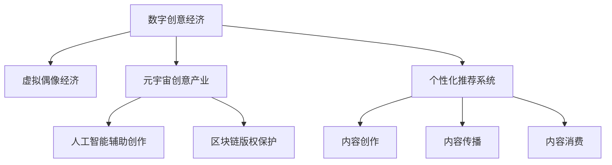

                 

# 2050年的数字创意：从虚拟偶像经济到元宇宙创意产业的数字创意经济

## 1. 背景介绍

### 1.1 问题由来
在21世纪初期，随着数字技术的迅速发展，数字创意经济开始兴起。随着互联网、移动互联网、大数据、人工智能等技术的成熟和应用，数字创意产业逐步成为驱动经济发展的新引擎，涵盖了广告、游戏、影视、音乐、文化等诸多领域。

在2050年，数字创意经济迎来了新的发展阶段，虚拟偶像经济和元宇宙创意产业成为两大核心驱动力。虚拟偶像利用高科技手段，突破了时间、空间的限制，成为流行文化的重要组成部分。元宇宙创意产业则通过虚拟现实(VR)、增强现实(AR)、区块链等技术，构建了一个多维、互动的数字化创意空间，为数字创意产业注入了新的活力。

### 1.2 问题核心关键点
当前，数字创意经济面临的主要挑战包括：
- 传统产业数字化转型的复杂性。如何将传统产业知识与数字技术深度融合，实现产业升级和转型。
- 数字创意知识产权保护的困难。如何在数字创意中实现有效、全面的知识产权保护。
- 数据隐私和安全问题。如何在数字化过程中保护用户隐私，避免数据泄露和安全风险。
- 数字创意内容的多样性和个性化。如何在内容生产、传播、消费各个环节实现个性化的精准推送。
- 数字创意产业的可持续发展。如何在追求商业利益的同时，实现环境保护和资源节约。

这些挑战促使我们思考数字创意经济的未来发展方向，以及如何构建一个更为安全、可靠、可持续的数字创意产业生态。

## 2. 核心概念与联系

### 2.1 核心概念概述

为更好地理解数字创意经济的发展趋势，本节将介绍几个密切相关的核心概念：

- 数字创意经济：以数字技术为工具，通过创意内容创造、生产和传播，实现商业价值和社会效益的经济形态。
- 虚拟偶像经济：利用数字技术构建的虚拟形象，通过网络媒体、社交平台等渠道进行内容创作和商业变现的经济模式。
- 元宇宙创意产业：基于虚拟现实、增强现实、区块链等技术，构建多维、互动的虚拟创意空间，为数字创意内容提供展示、交互和商业化平台。
- 人工智能辅助创作：通过人工智能技术，如自然语言处理、计算机视觉、生成对抗网络等，辅助数字创意内容的创作、编辑和优化。
- 区块链版权保护：利用区块链技术，实现数字创意作品的版权登记、交易、管理和监督，确保知识产权权益。
- 个性化推荐系统：基于用户行为数据和偏好分析，推荐个性化的数字创意内容，提升用户满意度和忠诚度。

这些核心概念之间的逻辑关系可以通过以下Mermaid流程图来展示：



这个流程图展示的数字创意经济的各个组成部分及其相互作用：

1. 数字创意经济通过虚拟偶像经济和元宇宙创意产业，将数字技术和创意内容深度融合，形成新的经济形态。
2. 人工智能辅助创作和个性化推荐系统，提高了内容创作和传播的效率和精准度。
3. 区块链版权保护，确保了数字创意内容的知识产权，促进了创意产业的健康发展。
4. 内容创作、传播和消费，构成了数字创意经济的基本循环，推动了整个产业的可持续发展。

## 3. 核心算法原理 & 具体操作步骤
### 3.1 算法原理概述

数字创意经济的核心算法原理主要涉及以下几个方面：

- 数据驱动的内容创作和传播。通过大数据分析，洞察用户需求和行为特征，指导内容创作和传播策略。
- 深度学习模型的训练和优化。利用深度学习技术，训练内容生成和推荐模型，提升内容的个性化和多样性。
- 区块链技术的版权保护。通过区块链，实现数字创意作品的登记、交易和版权管理。
- 元宇宙创意空间的设计和构建。利用虚拟现实、增强现实等技术，创建多维、互动的虚拟创意空间，提供沉浸式的内容体验。

这些算法原理构成了数字创意经济的基础，通过技术的深度融合和创新，推动数字创意产业的发展和进步。

### 3.2 算法步骤详解

数字创意经济的核心算法步骤可以概括为以下几个主要环节：

**Step 1: 数据收集与处理**

- 收集用户行为数据、偏好数据、历史交互数据等，作为内容创作和推荐的依据。
- 对数据进行预处理，包括去重、清洗、标注等，确保数据质量。

**Step 2: 内容创作与优化**

- 利用深度学习模型，如生成对抗网络(GAN)、变分自编码器(VAE)等，生成高质量的数字创意内容。
- 结合人工智能技术，如自然语言处理(NLP)、计算机视觉(CV)等，辅助内容创作和优化，提升内容的多样性和个性化。

**Step 3: 内容传播与推广**

- 使用个性化推荐算法，如协同过滤、矩阵分解、深度学习等，推荐适合用户的内容。
- 利用社交媒体、搜索引擎、广告投放等渠道，推广优质数字创意内容，扩大其传播范围。

**Step 4: 版权保护与交易**

- 利用区块链技术，实现数字创意作品的版权登记和交易，确保知识产权权益。
- 通过智能合约等技术，自动化版权交易流程，提升交易效率和安全性。

**Step 5: 元宇宙创意空间构建**

- 设计和构建虚拟现实(VR)、增强现实(AR)、混合现实(MR)等元宇宙创意空间，为数字创意内容提供沉浸式展示和交互平台。
- 利用区块链技术，实现虚拟空间内内容和资产的流通和管理，确保创意内容的价值流通和创意产业的可持续发展。

### 3.3 算法优缺点

数字创意经济的核心算法具有以下优点：
1. 推动内容创新。深度学习和人工智能技术，为内容创作和传播提供了新的可能性，推动了内容的多样性和创新性。
2. 提升用户体验。个性化推荐和虚拟现实技术，为数字创意内容的消费提供了更优质的体验，提高了用户的满意度和忠诚度。
3. 保障知识产权。区块链技术，实现了数字创意作品的版权登记和交易，保护了创作者的权益。
4. 促进产业可持续发展。虚拟现实和区块链技术，为数字创意内容提供了新的展示和流通平台，推动了创意产业的可持续发展。

同时，这些算法也存在一些局限性：
1. 数据隐私和安全问题。大数据分析可能涉及用户隐私，数据泄露和安全问题仍需关注。
2. 算法偏见和公平性。深度学习和人工智能模型可能存在偏见，影响内容的多样性和公平性。
3. 版权保护争议。尽管区块链技术提供了版权保护机制，但在版权归属、使用范围等方面仍存在争议。
4. 技术成本高。虚拟现实和增强现实技术的硬件和软件成本较高，推广和普及仍需努力。

### 3.4 算法应用领域

数字创意经济的核心算法广泛应用于以下几个领域：

- 广告创意：通过大数据分析和深度学习，生成个性化的广告创意，提升广告效果。
- 游戏开发：利用人工智能技术和虚拟现实技术，生成丰富的游戏内容和互动体验。
- 影视制作：利用增强现实技术和人工智能技术，制作高质量的影视作品和特效。
- 音乐创作：通过生成对抗网络和人工智能技术，创作新的音乐作品，提升音乐作品的创新性。
- 虚拟偶像：利用虚拟现实和增强现实技术，构建虚拟偶像形象，进行内容创作和商业变现。
- 文化展示：通过元宇宙创意空间，展示和传播文化遗产，提升文化影响力。

## 4. 数学模型和公式 & 详细讲解 & 举例说明

### 4.1 数学模型构建

数字创意经济的数学模型可以概括为以下几个方面：

- 用户行为模型：利用机器学习模型，预测用户的行为和偏好。
- 内容推荐模型：基于用户行为数据和内容特征，推荐个性化内容。
- 版权交易模型：利用智能合约技术，实现版权交易的自动化。
- 虚拟空间设计模型：利用计算机图形学、虚拟现实技术，设计虚拟空间。

### 4.2 公式推导过程

以内容推荐模型为例，我们可以使用协同过滤算法和矩阵分解等技术，推导推荐模型的基本公式：

假设用户集合为 $U$，物品集合为 $I$，用户对物品的评分矩阵为 $R \in \mathbb{R}^{m \times n}$，其中 $m$ 为物品数量，$n$ 为用户数量。

推荐模型的目标是预测用户对新物品的评分，即求解 $R_{ij} = r_i \times r_j^T$，其中 $r_i \in \mathbb{R}^n$ 为物品的向量表示，$r_j \in \mathbb{R}^m$ 为用户的向量表示。

利用矩阵分解技术，将用户和物品的向量表示分解为两个低维向量矩阵 $P \in \mathbb{R}^{n \times k}$ 和 $Q \in \mathbb{R}^{m \times k}$，其中 $k$ 为低维空间的维数。推荐模型公式可以进一步表示为：

$$
R_{ij} = \hat{r}_i \times \hat{r}_j^T = (P_i \times P) \times (Q_j^T \times Q)
$$

其中 $\hat{r}_i = P_i \times Q$，$\hat{r}_j = Q_j^T \times P$。

### 4.3 案例分析与讲解

以某音乐平台的内容推荐为例，分析推荐模型的具体实现。

假设音乐平台上有 $m=1000$ 首歌曲，$n=10000$ 名用户。用户对每首歌曲的评分矩阵 $R$ 为 $1000 \times 10000$ 的稀疏矩阵。通过协同过滤算法和矩阵分解技术，将用户和歌曲的向量表示分解为两个 $n \times k$ 和 $m \times k$ 的低维向量矩阵 $P$ 和 $Q$。

在用户登录平台时，根据其历史行为数据 $R_{ij}$，计算其对新歌曲的评分预测 $\hat{R}_{ij} = \hat{r}_i \times \hat{r}_j^T$，排序推荐前 $k$ 首新歌曲。

## 5. 项目实践：代码实例和详细解释说明

### 5.1 开发环境搭建

在进行数字创意经济项目实践前，我们需要准备好开发环境。以下是使用Python进行TensorFlow开发的環境配置流程：

1. 安装Anaconda：从官网下载并安装Anaconda，用于创建独立的Python环境。

2. 创建并激活虚拟环境：
```bash
conda create -n tf-env python=3.8 
conda activate tf-env
```

3. 安装TensorFlow：根据CUDA版本，从官网获取对应的安装命令。例如：
```bash
conda install tensorflow -c pytorch -c conda-forge
```

4. 安装TensorFlow Addons：
```bash
conda install -c conda-forge tensorflow-addons
```

5. 安装各类工具包：
```bash
pip install numpy pandas scikit-learn matplotlib tqdm jupyter notebook ipython
```

完成上述步骤后，即可在`tf-env`环境中开始数字创意经济项目实践。

### 5.2 源代码详细实现

下面我们以音乐平台的内容推荐系统为例，给出使用TensorFlow和TensorFlow Addons进行协同过滤推荐模型的PyTorch代码实现。

首先，定义协同过滤推荐模型的参数：

```python
import tensorflow as tf
from tensorflow_addons.layers.normalization import LayerNormalization

class CollaborativeFiltering(tf.keras.Model):
    def __init__(self, num_users, num_items, embedding_dim=32, num_factors=16):
        super(CollaborativeFiltering, self).__init__()
        self.num_users = num_users
        self.num_items = num_items
        self.embedding_dim = embedding_dim
        self.num_factors = num_factors
        self.user_embeddings = tf.keras.layers.Embedding(num_users, embedding_dim)
        self.item_embeddings = tf.keras.layers.Embedding(num_items, embedding_dim)
        self.P = tf.keras.layers.Dense(num_factors, activation='relu')
        self.Q = tf.keras.layers.Dense(num_factors, activation='relu')
        self.layer_norm = LayerNormalization()

    def call(self, user_ids, item_ids):
        user_embeddings = self.user_embeddings(user_ids)
        item_embeddings = self.item_embeddings(item_ids)
        P = self.P(user_embeddings)
        Q = self.Q(item_embeddings)
        X = tf.einsum('bi,bj->ij', P, Q)
        return tf.nn.softmax(X)
```

然后，定义数据生成和模型训练函数：

```python
import numpy as np
import tensorflow_addons as addons

def generate_data(num_users, num_items, num_ratings):
    user_ids = np.random.randint(num_users, size=(num_ratings, 1))
    item_ids = np.random.randint(num_items, size=(num_ratings, 1))
    ratings = np.random.normal(3, 1, size=(num_ratings, 1))
    return user_ids, item_ids, ratings

def train_model(model, data, batch_size=32, epochs=10):
    optimizer = tf.keras.optimizers.Adam(learning_rate=0.001)
    for epoch in range(epochs):
        for user_ids, item_ids, ratings in data:
            with tf.GradientTape() as tape:
                predictions = model(user_ids, item_ids)
                loss = tf.keras.losses.mean_squared_error(predictions, ratings)
            gradients = tape.gradient(loss, model.trainable_variables)
            optimizer.apply_gradients(zip(gradients, model.trainable_variables))
    return model

# 生成数据
num_users = 10000
num_items = 1000
num_ratings = 1000000
user_ids, item_ids, ratings = generate_data(num_users, num_items, num_ratings)

# 模型训练
model = CollaborativeFiltering(num_users, num_items)
model = train_model(model, (user_ids, item_ids, ratings))

# 测试模型
user_ids_test = np.random.randint(num_users, size=(100, 1))
item_ids_test = np.random.randint(num_items, size=(100, 1))
predictions = model(user_ids_test, item_ids_test)
print(predictions)
```

以上就是使用TensorFlow和TensorFlow Addons对协同过滤推荐模型进行内容推荐系统的代码实现。可以看到，TensorFlow Addons提供了一些新的层和工具，可以大大简化代码实现。

### 5.3 代码解读与分析

让我们再详细解读一下关键代码的实现细节：

**CollaborativeFiltering类**：
- `__init__`方法：初始化模型参数，定义嵌入层、矩阵分解层和归一化层。
- `call`方法：在前向传播过程中，计算用户和物品的向量表示，进行矩阵乘法，并应用softmax函数。

**generate_data函数**：
- 生成指定数量的用户、物品和评分数据，形成稀疏矩阵。

**train_model函数**：
- 定义优化器，循环迭代训练模型，通过反向传播更新模型参数。

**测试模型**：
- 使用测试集数据，计算模型对新用户的推荐结果。

## 6. 实际应用场景

### 6.1 智能广告创意

在智能广告创意方面，数字创意经济利用大数据分析和深度学习技术，生成个性化、多样化的广告创意。通过分析用户行为和偏好，生成符合用户需求的广告，提升广告点击率和转化率。

具体而言，可以收集用户浏览网页、点击广告、购买商品等行为数据，利用深度学习模型，如循环神经网络(RNN)、卷积神经网络(CNN)等，分析用户兴趣和行为特征。基于分析结果，利用生成对抗网络(GAN)等技术，生成个性化广告创意，并在不同平台进行投放。广告创意生成系统还可以结合用户反馈数据，不断优化创意效果，提升广告的精准度和效果。

### 6.2 游戏内容生成

在游戏内容生成方面，数字创意经济利用深度学习技术和虚拟现实技术，生成高质量的游戏内容和互动体验。通过分析用户游戏行为数据，生成符合用户喜好的游戏内容，提升游戏体验和用户粘性。

具体而言，可以收集用户的游戏行为数据，如操作频率、技能水平、偏好角色等，利用深度学习模型，如递归神经网络(RNN)、变分自编码器(VAE)等，生成符合用户需求的游戏内容。利用虚拟现实技术，提供沉浸式的游戏体验，增加游戏的吸引力和乐趣。同时，可以通过用户反馈数据，不断优化游戏内容，提升用户满意度和留存率。

### 6.3 影视作品制作

在影视作品制作方面，数字创意经济利用增强现实技术和深度学习技术，制作高质量的影视作品和特效。通过分析用户观看影视作品的数据，生成符合用户喜好的影视内容，提升影视作品的观赏性和吸引力。

具体而言，可以收集用户观看影视作品的行为数据，如观看时长、评论内容等，利用深度学习模型，如卷积神经网络(CNN)、循环神经网络(RNN)等，分析用户偏好和情感倾向。基于分析结果，利用生成对抗网络(GAN)等技术，生成高质量的影视特效和背景场景，提升影视作品的视觉效果和吸引力。同时，可以通过用户反馈数据，不断优化影视内容，提升用户的观影体验。

### 6.4 音乐创作与推广

在音乐创作与推广方面，数字创意经济利用深度学习技术和生成对抗网络(GAN)，创作新的音乐作品，并通过社交媒体、音乐平台等渠道进行推广。通过分析用户音乐消费数据，生成符合用户喜好的音乐作品，提升音乐作品的商业价值和用户满意度。

具体而言，可以收集用户音乐消费数据，如听歌时长、歌曲评分等，利用深度学习模型，如循环神经网络(RNN)、生成对抗网络(GAN)等，创作新的音乐作品。利用社交媒体和音乐平台等渠道，推广优质音乐作品，提升音乐的传播范围和影响力。同时，可以通过用户反馈数据，不断优化音乐作品，提升用户满意度和商业价值。

### 6.5 虚拟偶像商业变现

在虚拟偶像商业变现方面，数字创意经济利用虚拟现实和增强现实技术，构建虚拟偶像形象，进行内容创作和商业变现。通过分析用户对虚拟偶像的互动数据，生成符合用户喜好的虚拟偶像内容，提升虚拟偶像的商业价值和用户粘性。

具体而言，可以收集用户与虚拟偶像的互动数据，如虚拟偶像的表演、互动、回复等，利用深度学习模型，如自然语言处理(NLP)、生成对抗网络(GAN)等，生成符合用户喜好的虚拟偶像内容。利用虚拟现实和增强现实技术，提供沉浸式的虚拟偶像体验，增加用户的粘性和参与度。同时，可以通过用户反馈数据，不断优化虚拟偶像内容，提升用户满意度和商业价值。

### 6.6 文化展示与传播

在文化展示与传播方面，数字创意经济利用元宇宙技术和区块链技术，展示和传播文化遗产，提升文化的传播力和影响力。通过构建虚拟文化空间，展示和传播文化遗产，提升文化的吸引力和传播范围。

具体而言，可以构建虚拟文化空间，展示和传播文化遗产，如历史遗迹、文化艺术作品等。利用元宇宙技术，提供沉浸式的文化体验，增加文化的吸引力和传播范围。同时，可以利用区块链技术，实现文化遗产的版权登记和交易，确保文化遗产的知识产权。

## 7. 工具和资源推荐
### 7.1 学习资源推荐

为了帮助开发者系统掌握数字创意经济的理论基础和实践技巧，这里推荐一些优质的学习资源：

1. 《深度学习与人工智能》系列博文：由大模型技术专家撰写，深入浅出地介绍了深度学习原理、算法及应用。

2. 《机器学习实战》课程：斯坦福大学开设的机器学习课程，提供了丰富的实践案例，适合初学者入门。

3. 《Python深度学习》书籍：Yoshua Bengio等编写的经典教材，详细介绍了深度学习框架和算法，适合深入学习。

4. Coursera和edX平台上的NLP和AI课程：提供了丰富的在线课程资源，涵盖深度学习、自然语言处理、计算机视觉等多个领域。

5. Kaggle平台：数据科学竞赛平台，提供大量的数据集和竞赛任务，适合数据科学和机器学习的实践练习。

通过对这些资源的学习实践，相信你一定能够快速掌握数字创意经济的技术框架和实践技能，并用于解决实际的NLP问题。
###  7.2 开发工具推荐

高效的开发离不开优秀的工具支持。以下是几款用于数字创意经济开发的常用工具：

1. TensorFlow：由Google主导开发的深度学习框架，生产部署方便，适合大规模工程应用。
2. PyTorch：基于Python的开源深度学习框架，灵活的计算图设计，适合快速迭代研究。
3. Jupyter Notebook：交互式的编程环境，支持代码的实时执行和调试，适合数据科学和机器学习的研究和实验。
4. Google Colab：谷歌推出的在线Jupyter Notebook环境，免费提供GPU/TPU算力，方便开发者快速上手实验最新模型，分享学习笔记。
5. Keras：基于TensorFlow和Theano的高级深度学习框架，提供了高层API，适合快速原型开发。

合理利用这些工具，可以显著提升数字创意经济项目的开发效率，加快创新迭代的步伐。

### 7.3 相关论文推荐

数字创意经济的研究源于学界的持续研究。以下是几篇奠基性的相关论文，推荐阅读：

1. Deep Learning for Advertisement Recommendation（广告推荐系统）：利用深度学习技术，生成个性化广告推荐系统，提升广告效果。
2. Neural Storytelling for AI (AI神经故事生成)：利用深度学习技术，生成具有情节、人物和主题的AI故事，提升创意内容的创新性和多样性。
3. Generating Music with Recurrent Neural Networks（循环神经网络生成音乐）：利用深度学习技术，生成新的音乐作品，提升音乐作品的创新性和多样性。
4. Virtual Reality and the Future of Entertainment（虚拟现实与娱乐的未来）：探讨虚拟现实技术在娱乐中的应用，提升用户体验和沉浸感。
5. Blockchain Technology for Creative Industries（区块链技术在创意产业中的应用）：探讨区块链技术在版权保护、智能合约等方面的应用，保障创意产业的健康发展。

这些论文代表了大数字创意经济的发展脉络。通过学习这些前沿成果，可以帮助研究者把握学科前进方向，激发更多的创新灵感。

## 8. 总结：未来发展趋势与挑战

### 8.1 总结

本文对数字创意经济的发展趋势进行了全面系统的介绍。首先阐述了数字创意经济的核心概念和应用场景，明确了数字创意经济在未来社会发展中的重要地位。其次，从理论到实践，详细讲解了数字创意经济的核心算法，包括数据驱动的内容创作和传播、深度学习模型的训练和优化、区块链技术的版权保护等。同时，本文还给出了数字创意经济的代码实现案例，帮助开发者系统掌握数字创意经济的技术框架和实践技能。

通过本文的系统梳理，可以看到，数字创意经济正在快速发展，虚拟偶像经济和元宇宙创意产业成为两大核心驱动力。未来，数字创意经济将在数字技术和创意内容深度融合的背景下，实现更多创新的应用场景，为数字社会的发展注入新的活力。

### 8.2 未来发展趋势

展望未来，数字创意经济将呈现以下几个发展趋势：

1. 虚拟现实和增强现实技术的普及。虚拟现实和增强现实技术将更加普及，为用户提供沉浸式的数字创意内容体验。
2. 区块链技术的应用拓展。区块链技术将更加广泛地应用于版权保护、智能合约、数字资产管理等领域，保障创意产业的健康发展。
3. 深度学习模型的创新。深度学习模型将不断创新，提升内容创作和推荐的效果，推动数字创意内容的多样性和创新性。
4. 人工智能技术的融合。人工智能技术与数字创意内容的深度融合，将提升内容的智能化水平，增强用户体验。
5. 元宇宙创意空间的构建。元宇宙创意空间的构建将更加成熟，为用户提供多维、互动的虚拟体验，推动数字创意内容的传播和流通。

以上趋势凸显了数字创意经济的广阔前景。这些方向的探索发展，必将进一步推动数字创意产业的进步，为数字社会的发展注入新的活力。

### 8.3 面临的挑战

尽管数字创意经济前景广阔，但仍面临诸多挑战：

1. 数据隐私和安全问题。大数据分析和深度学习可能涉及用户隐私，数据泄露和安全问题仍需关注。
2. 算法偏见和公平性。深度学习和人工智能模型可能存在偏见，影响内容的多样性和公平性。
3. 版权保护争议。区块链技术和智能合约的应用，在版权归属、使用范围等方面仍存在争议。
4. 技术成本高。虚拟现实和增强现实技术的硬件和软件成本较高，推广和普及仍需努力。
5. 内容质量参差不齐。大量创意内容难以保证高质量，可能存在内容低俗、侵权等问题。

这些挑战需要我们积极应对，并寻求解决方案。只有在技术、伦理、法律等多个层面协同发力，才能推动数字创意经济的健康发展。

### 8.4 研究展望

面对数字创意经济所面临的挑战，未来的研究需要在以下几个方面寻求新的突破：

1. 数据隐私保护技术。研究如何在数字创意内容创作和传播过程中，保护用户隐私，避免数据泄露和安全风险。
2. 算法公平性和透明性。研究如何设计公平、透明的算法，确保深度学习和人工智能模型的公正性和透明性。
3. 区块链技术创新。研究如何优化区块链技术，提高版权保护、智能合约等应用的效率和安全性。
4. 虚拟现实和增强现实技术优化。研究如何降低虚拟现实和增强现实技术的硬件和软件成本，提升用户体验。
5. 内容质量控制。研究如何通过算法和技术手段，提升数字创意内容的质量和多样性，避免内容低俗、侵权等问题。

这些研究方向的探索，必将引领数字创意经济的技术进步，为数字社会的发展注入新的动力。面向未来，数字创意经济需要各界协同努力，共同推动数字创意产业的繁荣发展。

## 9. 附录：常见问题与解答

**Q1：数字创意经济与传统创意经济有何不同？**

A: 数字创意经济与传统创意经济的主要区别在于数字技术的深度融合。数字创意经济通过大数据分析、深度学习、虚拟现实、区块链等技术，实现了创意内容的智能化、个性化和多样化，提升了创意内容的传播力和影响力。传统创意经济则更多依赖于艺术家、设计师等专业人士的创意灵感和手工创作，缺乏数据驱动和智能化的支持。

**Q2：数字创意经济如何影响传统产业？**

A: 数字创意经济通过技术创新和内容优化，对传统产业进行了数字化转型升级，实现了产业升级和降本增效。例如，通过广告推荐系统、智能客服、个性化推荐等技术，优化了传统广告、销售、客服等环节，提高了运营效率和用户满意度。

**Q3：数字创意经济是否会取代传统创意产业？**

A: 数字创意经济不会完全取代传统创意产业，而是与其融合发展。数字创意经济利用技术手段，提升了创意内容的质量和传播范围，但创意的灵感和创新始终依赖于人类的智慧和创造力。传统创意产业在艺术、设计、文学等领域仍具有无可替代的地位和价值。

**Q4：数字创意经济如何保护知识产权？**

A: 数字创意经济利用区块链技术，实现了数字创意作品的版权登记、交易和管理。通过智能合约等技术，自动化版权交易流程，确保版权权益。同时，利用区块链技术，实现了版权的追溯和验证，避免了侵权和盗版问题。

**Q5：数字创意经济如何应对数据隐私和安全问题？**

A: 数字创意经济在数据收集和分析过程中，必须遵循数据隐私保护法规，如GDPR、CCPA等。采用数据匿名化、加密等技术手段，确保用户数据的安全性和隐私性。同时，通过数据使用授权和用户同意机制，确保数据的合法使用。

---

作者：禅与计算机程序设计艺术 / Zen and the Art of Computer Programming

