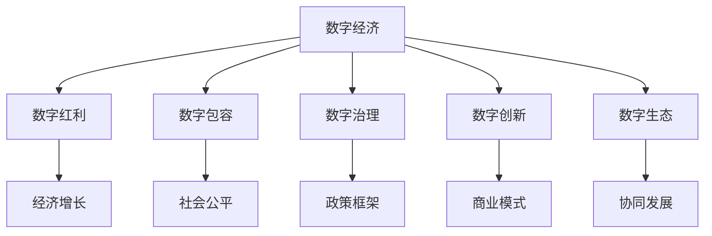

                 

## 1. 背景介绍

### 1.1 问题由来
数字经济是21世纪最具变革力的经济形态之一。自20世纪90年代以来，随着互联网技术的普及和应用，数字经济已经从萌芽阶段逐步成长为全球经济的重要组成部分。2050年，数字经济将迎来前所未有的发展机遇，成为驱动全球经济增长的重要引擎。

数字经济的核心驱动力是信息技术的广泛应用，包括大数据、云计算、人工智能、物联网等前沿技术。这些技术的融合和创新，使得数据和算法在经济活动中的作用日益凸显，推动了产业数字化、智能化的全面转型。

### 1.2 问题核心关键点
当前，全球正处于数字经济从量变到质变的重要转折点。未来三十年，数字经济的演进将从简单的数字化管理，迈向更加智能、高效的数字经济形态。在这个过程中，数字红利和数字包容将成为驱动经济增长的两大新动能，实现从数字红利到数字包容的转型。

数字红利（Digital Dividend）指的是信息技术的普及和应用，使生产力水平得以大幅提升，形成巨大的经济收益。数字包容（Digital Inclusion）则是指让更多人平等享受数字技术的便利和机会，促进经济社会公平和包容性增长。

实现数字红利和数字包容，需要从政策、技术、社会三个层面共同努力，构建数字经济生态系统。本文档将从这三个维度出发，系统探讨2050年数字经济的发展趋势，为未来经济发展提供新的视角和方向。

## 2. 核心概念与联系

### 2.1 核心概念概述

为更好地理解2050年数字经济的发展，本节将介绍几个关键概念：

- 数字经济（Digital Economy）：以信息技术为核心驱动力的经济形态，包括电子商务、金融科技、数字制造、智能服务等各类新兴产业。
- 数字红利（Digital Dividend）：信息技术普及和应用所带来的生产力提升和经济增长。
- 数字包容（Digital Inclusion）：让更多人平等享受数字技术带来的便利和机会，缩小数字鸿沟。
- 数字治理（Digital Governance）：构建有效的数字政策框架和监管体系，保障数字经济的健康发展。
- 数字创新（Digital Innovation）：推动技术创新和商业模式变革，形成新的经济增长点。
- 数字生态（Digital Ecosystem）：包括企业、政府、消费者等各类主体，形成相互依存、协同发展的数字经济体系。

这些核心概念之间的逻辑关系可以通过以下Mermaid流程图来展示：



这个流程图展示了数字经济发展的核心要素及其相互关系：

1. 数字经济以信息技术为核心，通过数字红利和数字包容，驱动经济增长和社会公平。
2. 数字治理为数字经济提供政策保障，促进创新与生态协同。
3. 数字创新形成新的经济增长点，推动产业升级。
4. 数字生态集聚了各类主体，形成相互依存的系统。

这些概念共同构成了2050年数字经济的发展框架，帮助我们更好地理解其内涵和潜力。

## 3. 核心算法原理 & 具体操作步骤
### 3.1 算法原理概述

从技术角度来看，2050年的数字经济将高度依赖于算法和计算能力。本节将从算法原理的角度，系统阐述数字经济的核心驱动力。

1. 算法优化：通过优化算法，提升数据处理效率，降低计算成本，使算力更加经济高效。
2. 数据融合：通过数据融合技术，将异构数据集成，形成更加丰富、全面的数据视图，支持更加精准的决策和分析。
3. 模型训练：通过深度学习、强化学习等模型训练技术，提升算法准确性和泛化能力，推动智能化转型。
4. 知识图谱：通过知识图谱构建，将结构化数据和语义信息融合，形成知识库，支持智能推理和决策。
5. 协同计算：通过分布式计算和边缘计算，实现计算资源的优化配置，提升系统响应速度和可靠性。

### 3.2 算法步骤详解

数字经济的核心算法步骤如下：

1. **数据收集与预处理**：收集海量数据，并对其进行清洗、去重、归一化等预处理操作，为后续分析奠定基础。
2. **特征提取与选择**：从原始数据中提取有意义的特征，并根据业务需求进行选择，去除冗余和噪声。
3. **模型训练与优化**：使用深度学习、强化学习等模型对数据进行训练，并通过超参数调优和模型融合，提升模型性能。
4. **算法评估与部署**：通过指标评估和模型验证，确保模型在生产环境中的稳定性和准确性，然后部署到实际应用中。
5. **算法迭代与改进**：根据实际使用反馈和业务需求变化，不断迭代和改进算法，提升其适应性和可靠性。

### 3.3 算法优缺点

数字经济的核心算法具有以下优点：

- 高效性：通过算法优化，大幅提升数据处理和模型训练效率，降低计算成本。
- 精准性：通过数据融合和模型训练，提升决策和分析的准确性，支持更加精准的业务洞察。
- 灵活性：通过知识图谱构建和协同计算，支持复杂场景的推理和决策，增强系统弹性。

但算法也存在一定的局限性：

- 数据依赖：算法的性能高度依赖于数据质量和多样性，数据不足或质量低将直接影响结果。
- 复杂性：大规模数据和高复杂度模型需要强大的计算资源支持，增加了技术难度和成本。
- 可解释性：算法的决策过程复杂，难以解释其内在逻辑，存在一定的黑箱问题。

尽管存在这些局限性，但算法在提升数字经济效率和灵活性方面的优势，使其成为未来数字经济的核心驱动力。

### 3.4 算法应用领域

数字经济的核心算法在多个领域得到广泛应用，具体如下：

1. **智能制造**：通过算法优化和模型训练，实现生产自动化、智能调度、质量控制等应用，提升制造效率和质量。
2. **智慧医疗**：利用算法和知识图谱，提升疾病诊断、药物研发、治疗方案制定等医疗服务的智能化水平。
3. **金融科技**：通过算法模型和协同计算，实现精准风险评估、智能投顾、智能客服等金融服务，提升金融效率和用户体验。
4. **智能交通**：通过算法优化和协同计算，实现交通流量预测、智能调度、自动驾驶等应用，提升交通效率和安全。
5. **智能物流**：利用算法和数据融合技术，实现订单预测、路径优化、库存管理等物流服务，提升配送效率和准确性。
6. **智能农业**：通过算法和知识图谱，实现精准农业、病虫害预测、农机自动驾驶等应用，提升农业生产效率和效益。

## 4. 数学模型和公式 & 详细讲解  
### 4.1 数学模型构建

本节将使用数学语言对数字经济的核心算法进行更加严格的刻画。

假设原始数据集为 $D=\{(x_i, y_i)\}_{i=1}^N$，其中 $x_i$ 为输入特征，$y_i$ 为输出标签。我们的目标是通过算法模型 $f$ 将输入特征映射为输出标签。

定义损失函数为 $L(f; D)$，表示模型在数据集上的误差。优化目标是最小化损失函数，即：

$$
\min_{f} L(f; D)
$$

为了实现这个目标，我们通常采用梯度下降算法：

$$
f_{t+1} = f_t - \eta \nabla_{f} L(f_t; D)
$$

其中，$\eta$ 为学习率。

### 4.2 公式推导过程

以下我们以线性回归为例，推导梯度下降算法的具体实现。

假设模型 $f(x)$ 为线性回归模型，形式为 $f(x) = wx + b$，其中 $w$ 为权重向量，$b$ 为偏置项。损失函数为均方误差损失函数：

$$
L(f; D) = \frac{1}{N}\sum_{i=1}^N (y_i - f(x_i))^2
$$

梯度下降算法的具体步骤如下：

1. 前向传播计算预测值 $y_i = f(x_i) = wx_i + b$。
2. 计算损失函数对权重和偏置的梯度：

$$
\frac{\partial L}{\partial w} = -\frac{2}{N} \sum_{i=1}^N (y_i - wx_i - b)x_i
$$

$$
\frac{\partial L}{\partial b} = -\frac{2}{N} \sum_{i=1}^N (y_i - wx_i - b)
$$

3. 根据梯度方向更新模型参数：

$$
w = w - \eta \frac{\partial L}{\partial w}
$$

$$
b = b - \eta \frac{\partial L}{\partial b}
$$

通过不断迭代上述过程，模型参数 $w$ 和 $b$ 不断优化，最终使得损失函数 $L(f; D)$ 达到最小值。

### 4.3 案例分析与讲解

以金融风险预测为例，介绍如何通过算法模型实现数字经济中的金融风险管理。

假设我们有一个数据集 $D=\{(x_i, y_i)\}_{i=1}^N$，其中 $x_i$ 包含客户的各类金融交易数据，$y_i$ 表示客户的风险等级（低、中、高）。我们希望通过算法模型 $f$，将输入的客户交易数据 $x_i$ 映射为风险等级 $y_i$。

具体步骤如下：

1. **数据收集与预处理**：从金融系统中收集客户交易数据，并对其进行清洗和预处理，去除噪声和冗余数据。
2. **特征提取与选择**：从原始数据中提取有意义的特征，如交易金额、交易频率、交易类型等，选择与风险等级高度相关的特征。
3. **模型训练与优化**：使用深度学习模型（如多层感知器、卷积神经网络等）对数据进行训练，并通过超参数调优和模型融合，提升模型性能。
4. **算法评估与部署**：在验证集上评估模型性能，并根据评估结果进行模型微调和优化。最后部署到生产环境中，实现实时风险评估。
5. **算法迭代与改进**：根据实际使用反馈和业务需求变化，不断迭代和改进算法，提升其适应性和可靠性。

通过上述步骤，我们可以构建一个高效、精准的金融风险预测模型，实现数字经济中的风险管理。

## 5. 项目实践：代码实例和详细解释说明
### 5.1 开发环境搭建

在进行数字经济项目实践前，我们需要准备好开发环境。以下是使用Python进行TensorFlow开发的流程：

1. 安装Anaconda：从官网下载并安装Anaconda，用于创建独立的Python环境。

2. 创建并激活虚拟环境：
```bash
conda create -n tf-env python=3.8 
conda activate tf-env
```

3. 安装TensorFlow：根据CUDA版本，从官网获取对应的安装命令。例如：
```bash
conda install tensorflow tensorflow-gpu -c conda-forge -c pytorch -c pypi -c anaconda
```

4. 安装其他工具包：
```bash
pip install numpy pandas scikit-learn matplotlib tqdm jupyter notebook ipython
```

完成上述步骤后，即可在`tf-env`环境中开始项目实践。

### 5.2 源代码详细实现

下面我们以金融风险预测为例，给出使用TensorFlow进行深度学习模型开发的Python代码实现。

首先，定义模型和优化器：

```python
import tensorflow as tf
from tensorflow.keras import layers, models

def build_model(input_shape):
    model = models.Sequential()
    model.add(layers.Dense(64, activation='relu', input_shape=input_shape))
    model.add(layers.Dense(64, activation='relu'))
    model.add(layers.Dense(3, activation='softmax'))
    model.compile(optimizer=tf.keras.optimizers.Adam(learning_rate=0.001),
                  loss='categorical_crossentropy',
                  metrics=['accuracy'])
    return model

# 定义数据处理函数
def preprocess_data(X_train, y_train):
    X_train = tf.keras.utils.normalize(X_train, axis=1)
    y_train = tf.keras.utils.to_categorical(y_train, num_classes=3)
    return X_train, y_train

# 创建数据集
X_train, y_train = preprocess_data(train_data, train_labels)

# 定义模型
model = build_model(input_shape)

# 训练模型
model.fit(X_train, y_train, epochs=10, batch_size=32)
```

在上述代码中，我们首先定义了一个具有两个隐藏层和一个输出层的深度学习模型，并使用交叉熵损失函数和Adam优化器进行训练。然后，对数据进行预处理，包括特征归一化和标签编码。最后，通过`fit`方法对模型进行训练，并返回训练后的模型。

### 5.3 代码解读与分析

让我们再详细解读一下关键代码的实现细节：

**数据处理函数**：
- `preprocess_data`方法：对输入数据和标签进行归一化和编码，确保数据适合模型训练。

**模型构建函数**：
- `build_model`方法：构建深度学习模型，包括隐藏层和输出层，并定义优化器、损失函数和评估指标。

**模型训练**：
- 通过`fit`方法对模型进行训练，指定训练轮数和批大小，并返回训练后的模型。

可以看到，TensorFlow提供了简单易用的高层次API，使我们能够快速构建和训练深度学习模型。

## 6. 实际应用场景
### 6.1 智能制造

在智能制造领域，数字经济的核心算法可以显著提升生产效率和质量。通过算法优化和模型训练，实现生产自动化、智能调度、质量控制等应用，推动制造业的智能化转型。

例如，利用算法优化生产线的排程和调度，通过数据融合和模型训练，实现设备故障预测和维护优化，提升生产线的稳定性和效率。通过算法和知识图谱，实现生产过程的可视化和管理，支持供应链优化和生产调度的智能化。

### 6.2 智慧医疗

在智慧医疗领域，数字经济的核心算法可以显著提升医疗服务的智能化水平。通过算法和知识图谱，提升疾病诊断、药物研发、治疗方案制定等医疗服务的智能化水平。

例如，利用算法和知识图谱构建疾病诊断模型，根据患者的历史数据和症状，自动推荐诊断方案和治疗方法，辅助医生进行精准诊断。利用算法和数据融合技术，实现个性化治疗方案的制定，提高治疗效果和患者满意度。通过算法和协同计算，实现药物研发过程的模拟和预测，加速新药开发进程。

### 6.3 金融科技

在金融科技领域，数字经济的核心算法可以显著提升金融服务的智能化和效率。通过算法模型和协同计算，实现精准风险评估、智能投顾、智能客服等金融服务，推动金融科技的智能化转型。

例如，利用算法模型实现精准风险评估，根据客户的交易数据和信用记录，自动评估其风险等级，并采取相应的风险控制措施。利用算法和协同计算，实现智能投顾，通过分析市场数据和客户需求，自动推荐投资组合和交易策略，提升投资收益。通过算法和数据融合技术，实现智能客服，根据客户的咨询需求，自动推荐金融产品和服务，提升客户体验。

### 6.4 智能交通

在智能交通领域，数字经济的核心算法可以显著提升交通系统的智能化水平。通过算法优化和协同计算，实现交通流量预测、智能调度、自动驾驶等应用，推动交通系统的智能化转型。

例如，利用算法和协同计算，实现交通流量的预测和优化，支持交通管理和调度的智能化。通过算法和知识图谱，实现自动驾驶系统的开发和应用，提高行车安全和效率。通过算法和数据融合技术，实现智能导航和路径规划，提升出行体验。

## 7. 工具和资源推荐
### 7.1 学习资源推荐

为了帮助开发者系统掌握数字经济的核心算法和实践技巧，这里推荐一些优质的学习资源：

1. 《深度学习》系列书籍：由深度学习领域的知名专家撰写，全面介绍了深度学习的基础理论和核心算法。

2. CS231n《深度学习计算机视觉》课程：斯坦福大学开设的计算机视觉课程，涵盖深度学习在图像、视频处理中的应用。

3. 《机器学习实战》书籍：介绍机器学习理论和实践，包含大量案例和代码实现，适合入门学习和实战练习。

4. Kaggle平台：全球最大的数据科学竞赛平台，提供丰富的数据集和竞赛题目，适合进行模型训练和算法评估。

5. Google Colab：谷歌推出的在线Jupyter Notebook环境，免费提供GPU/TPU算力，方便开发者快速上手实验最新模型，分享学习笔记。

通过对这些资源的学习实践，相信你一定能够快速掌握数字经济的核心算法，并用于解决实际的商业问题。

### 7.2 开发工具推荐

高效的开发离不开优秀的工具支持。以下是几款用于数字经济项目开发的常用工具：

1. TensorFlow：由Google主导开发的深度学习框架，易于使用，支持分布式计算和GPU加速。

2. PyTorch：由Facebook主导开发的深度学习框架，灵活性高，适合快速迭代和实验。

3. HuggingFace Transformers库：封装了多种预训练语言模型和任务，提供了丰富的模型接口和预训练权重。

4. Weights & Biases：模型训练的实验跟踪工具，可以记录和可视化模型训练过程中的各项指标，方便对比和调优。

5. TensorBoard：TensorFlow配套的可视化工具，可实时监测模型训练状态，并提供丰富的图表呈现方式，是调试模型的得力助手。

6. Kaggle平台：全球最大的数据科学竞赛平台，提供丰富的数据集和竞赛题目，适合进行模型训练和算法评估。

合理利用这些工具，可以显著提升数字经济项目的开发效率，加快创新迭代的步伐。

### 7.3 相关论文推荐

数字经济的核心算法在学术界和工业界都有大量的研究成果，以下是几篇奠基性的相关论文，推荐阅读：

1. 《Deep Learning》（Goodfellow et al., 2016）：全面介绍了深度学习的基础理论和核心算法。

2. 《Google Brain: Rethinking Neural Networks》（Goodfellow et al., 2014）：提出了卷积神经网络（CNN）和生成对抗网络（GAN）等重要算法。

3. 《ImageNet Classification with Deep Convolutional Neural Networks》（Krizhevsky et al., 2012）：介绍了深度卷积神经网络在图像识别任务上的突破性应用。

4. 《Neural Machine Translation by Jointly Learning to Align and Translate》（Sutskever et al., 2014）：提出了基于注意力机制的机器翻译模型，显著提升了机器翻译的准确性。

5. 《AlphaGo Zero: Mastering the Game of Go without Human Knowledge》（Silver et al., 2017）：展示了深度强化学习在解决复杂博弈问题上的巨大潜力。

6. 《A Few Useful Things to Know About Deep Learning: the Special Cases》（Goodfellow et al., 2016）：详细讨论了深度学习中的各种特殊情况和挑战，适合深入理解深度学习算法。

这些论文代表了大数据和深度学习技术的发展脉络。通过学习这些前沿成果，可以帮助研究者把握学科前进方向，激发更多的创新灵感。

## 8. 总结：未来发展趋势与挑战

### 8.1 研究成果总结

数字经济的发展离不开算法的不断创新和优化。未来，随着数据量的指数级增长和计算资源的持续提升，数字经济的核心算法将迎来新的突破和变革。

1. 数据规模和质量不断提升：数据量的激增和多样性，为算法的训练和优化提供了更多素材。高质量、标注数据将使算法的性能更加精准和可靠。

2. 算法复杂性和灵活性增强：复杂的深度学习模型和多样化的算法结构，将推动算法的灵活性和适用性。通过多模态融合和异构数据处理，算法将具备更强的泛化能力和适应性。

3. 计算资源优化和共享：分布式计算和边缘计算的普及，将显著提升计算效率和资源利用率，降低计算成本。跨界合作和开源共享，将使更多企业受益。

### 8.2 未来发展趋势

展望未来，数字经济将呈现以下几个发展趋势：

1. **算法创新和应用突破**：通过算法创新和优化，推动各行各业数字化转型。机器学习、深度学习、强化学习等技术的普及和应用，将显著提升生产效率和质量。

2. **多模态数据融合**：通过多模态数据的融合和协同计算，实现更加全面和精准的业务洞察和决策支持。图像、视频、语音等多模态数据的整合，将提升算法的通用性和智能化水平。

3. **智能化生态系统**：通过算法和知识图谱的融合，构建智能化生态系统，实现人机协同和智能决策。

4. **数字包容和普惠**：通过算法和数字技术的普及，缩小数字鸿沟，实现普惠式增长。

### 8.3 面临的挑战

尽管数字经济的发展前景广阔，但也面临诸多挑战：

1. **数据隐私和安全**：大规模数据的应用带来了隐私和安全的挑战。如何保护用户隐私、防止数据泄露，将成为数字经济发展的关键问题。

2. **算法公平性和透明性**：算法的决策过程复杂，难以解释其内在逻辑，存在一定的黑箱问题。如何提高算法的公平性和透明性，将是需要解决的难题。

3. **算法偏见和歧视**：算法可能在训练数据中学习到偏见和歧视，从而在应用中产生不公正的结果。如何识别和消除算法偏见，是确保数字经济公平性的重要前提。

4. **计算资源和成本**：大规模数据和复杂算法的计算需求，对计算资源提出了更高的要求。如何优化资源配置，降低计算成本，将是一项长期任务。

5. **模型更新和维护**：算法的模型训练和维护成本较高，需要持续投入资源进行模型迭代和优化。如何降低模型维护成本，提升模型的稳定性和可靠性，将是重要的研究方向。

### 8.4 研究展望

面对数字经济面临的挑战，未来的研究需要在以下几个方面寻求新的突破：

1. **数据隐私和安全保护**：通过技术手段和政策法规，保护用户隐私和数据安全，构建可信赖的数字经济生态。

2. **算法公平性和透明性增强**：采用可解释性算法和透明的决策机制，提升算法的公平性和透明性，增加用户信任。

3. **算法偏见和歧视消除**：通过数据清洗和算法优化，消除训练数据中的偏见和歧视，确保算法的公平性和公正性。

4. **计算资源优化和共享**：通过分布式计算和边缘计算，优化计算资源配置，降低计算成本。通过开源共享，促进跨界合作和创新。

5. **模型更新和维护自动化**：采用自动化模型更新和维护机制，减少人工干预，降低维护成本，提升模型性能和稳定性。

这些研究方向的探索，必将引领数字经济技术的不断进步，为构建公平、透明、安全的数字经济体系提供新的方法和工具。面向未来，数字经济的核心算法将发挥更大的作用，推动全社会实现数字化转型和智能化升级。

## 9. 附录：常见问题与解答

**Q1：数字经济的核心算法是否适用于所有应用场景？**

A: 数字经济的核心算法在不同应用场景中具有不同的适用性。例如，在金融领域，可以用于精准风险评估和智能投顾；在医疗领域，可以用于疾病诊断和治疗方案推荐；在交通领域，可以用于交通流量预测和智能调度。但不同的应用场景需要结合具体业务需求进行算法设计和优化。

**Q2：如何保障数字经济的安全性和隐私保护？**

A: 数字经济的安全性和隐私保护是数字经济发展的关键。主要措施包括：

1. 数据加密：对敏感数据进行加密处理，防止数据泄露。
2. 访问控制：采用身份认证和权限管理机制，限制数据访问权限。
3. 匿名化处理：对数据进行匿名化处理，减少隐私风险。
4. 合规法规：遵守数据隐私保护法规，如GDPR等，保护用户隐私。

**Q3：数字经济的核心算法是否需要持续优化？**

A: 数字经济的核心算法需要持续优化和迭代。随着业务需求的变化和技术的发展，算法模型和算法结构需要不断更新和改进。持续优化可以提高算法的准确性和泛化能力，确保其在实际应用中的稳定性和可靠性。

**Q4：数字经济的核心算法是否需要结合领域知识？**

A: 数字经济的核心算法需要结合领域知识进行设计和优化。领域知识可以增强算法的鲁棒性和泛化能力，提升算法的适应性和可靠性。例如，在医疗领域，结合医学知识库和专家经验，可以提升疾病诊断和治疗方案推荐的准确性。

**Q5：数字经济的核心算法是否需要跨界合作？**

A: 数字经济的核心算法需要跨界合作进行创新和优化。通过跨界合作和知识共享，可以打破技术壁垒，提升算法和应用的效果。例如，在智慧医疗领域，需要医疗专家和数据科学家共同协作，开发高精度的医疗诊断系统。

通过本文的系统梳理，可以看到，数字经济的核心算法在推动经济社会数字化转型中具有重要意义。未来，随着算法技术的不断进步和优化，数字经济将迎来更加广阔的发展前景。只有勇于创新、敢于突破，才能不断拓展数字经济的技术边界，实现数字红利和数字包容的双重驱动。

