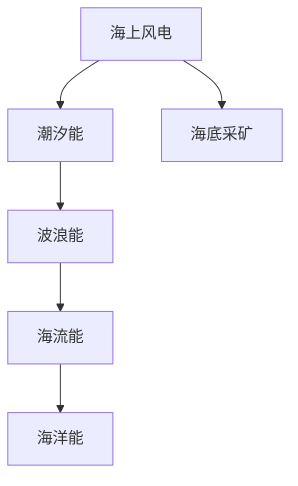

                 

# 2050年的海洋开发：从海上风电到海底采矿的海洋经济

## 1. 背景介绍

### 1.1 问题由来
在2050年的未来，人类面临的能源需求和环境压力前所未有。能源供给侧必须实现多样化、清洁化、高效化的战略转型。海洋，这个地球上最后的大片未开发区域，成为了未来能源和材料开发的新战场。以海洋为载体的风电、潮汐能、波浪能、海流能、海洋能、海底采矿等新型能源和资源开发技术正在逐步成熟。海洋经济的崛起，预示着一个全新的能源时代的来临。

### 1.2 问题核心关键点
未来海洋经济的成功与否，关键在于如何高效、可持续地利用海洋资源，保护生态环境，维护海洋权益，促进经济、社会、环境三者的协同发展。以下将重点探讨未来海洋开发的核心技术，包括海上风电、潮汐能、波浪能、海流能、海洋能、海底采矿等新型能源和资源开发技术，以及这些技术对海洋经济的影响。

## 2. 核心概念与联系

### 2.1 核心概念概述

为更好地理解2050年海洋经济的开发，本节将介绍几个密切相关的核心概念：

- **海上风电(Offshore Wind Energy)**：利用海上风力发电，相较于陆上风电，海上风电的风力更稳定，发电量更高。
- **潮汐能(Tidal Energy)**：利用潮汐涨落引起的能量，通过水轮机发电。
- **波浪能(Wave Energy)**：利用海浪波动的能量，通过波力发电装置发电。
- **海流能(Current Energy)**：利用海水流动产生的能量，通过海流发电。
- **海洋能(Marine Energy)**：涵盖风能、潮汐能、波浪能、海流能等多种能源形式的海洋能源利用技术。
- **海底采矿(Deep-Sea Mining)**：利用深海技术在海底开采稀有金属和矿物资源，如多金属结核、富钴结壳、多金属硫化物等。

这些核心概念之间的逻辑关系可以通过以下Mermaid流程图来展示：



这个流程图展示了大规模海洋经济开发的关键技术及其相互关系：

1. **海洋能** 是多种海洋能源形式的统称，包括了风能、潮汐能、波浪能、海流能等。
2. **海底采矿** 是海洋能源之外的另一种重要海洋资源开发形式，涵盖多金属结核、富钴结壳、多金属硫化物等多种海底矿物。
3. **各能源形式** 可以互补互利，实现海洋资源的充分利用。

## 3. 核心算法原理 & 具体操作步骤

### 3.1 算法原理概述

未来海洋资源的开发与利用，基于多种能源形式的互补与协同，构建一个高效、可持续的海洋能源体系。核心算法原理包括：

1. **能源互补性算法**：计算不同能源形式之间的互补关系，优化混合能源系统的设计。
2. **系统优化算法**：采用遗传算法、模拟退火等优化算法，求解混合能源系统优化配置。
3. **数据驱动算法**：利用机器学习算法对海洋环境数据进行分析和预测，指导海洋资源的开发。

### 3.2 算法步骤详解

基于上述核心算法原理，海洋资源的开发和利用可以分为以下步骤：

**Step 1: 数据采集与环境评估**
- 采集海洋环境数据，包括风速、潮汐、波浪、海流等。
- 使用机器学习模型预测海洋环境变化趋势。
- 评估各海洋区域的环境承载能力和能源开发潜力。

**Step 2: 能源形式选择与布局**
- 根据预测的环境数据和资源分布，选择适合的能源形式。
- 进行混合能源系统的布局设计，考虑技术可行性和经济成本。

**Step 3: 系统优化与仿真模拟**
- 采用优化算法设计混合能源系统的配置方案。
- 进行系统仿真模拟，评估方案的性能和风险。

**Step 4: 系统部署与运营**
- 实施系统部署，并进行持续的监控和维护。
- 定期调整能源配置方案，应对环境变化。

### 3.3 算法优缺点

基于多种能源形式的海洋资源开发算法具有以下优点：
1. **高效性**：多种能源形式的互补和优化配置，提高了能源利用效率。
2. **可持续性**：多能源混合系统的设计，减少了单一能源形式对环境的影响。
3. **灵活性**：根据环境变化实时调整能源配置，适应性更强。

同时，该算法也存在以下局限性：
1. **复杂性**：系统配置和优化过程涉及大量变量和约束，计算复杂度高。
2. **数据需求高**：需要大量高质量的环境和能源数据，数据收集和处理难度大。
3. **技术门槛高**：算法设计和优化需要专业知识和技术积累，对团队要求高。

### 3.4 算法应用领域

海洋能源开发算法可以应用于多个领域：

- **能源开发项目规划**：评估不同海洋区域的风电、潮汐能、波浪能、海流能、海洋能等资源开发潜力，选择最适合的开发项目。
- **系统设计与优化**：设计混合能源系统的布局和配置，优化系统的运行效率。
- **环境监测与预测**：利用机器学习对海洋环境进行监测和预测，指导能源开发与环境保护。
- **风险评估与管理**：对海洋能源开发项目进行风险评估，制定应急管理方案。

## 4. 数学模型和公式 & 详细讲解 & 举例说明

### 4.1 数学模型构建

海洋能源开发模型的构建主要基于能量平衡和优化理论，具体包括：

- **风能模型**：
  $$
  E_{\text{wind}} = C_{\text{wind}} \times A_{\text{wind}} \times v_{\text{wind}}^3
  $$
  其中，$E_{\text{wind}}$ 为风能，$C_{\text{wind}}$ 为风力系数，$A_{\text{wind}}$ 为风力面积，$v_{\text{wind}}$ 为风速。

- **潮汐能模型**：
  $$
  E_{\text{tide}} = \frac{1}{2} \times \rho \times A_{\text{tide}} \times g \times (h_{\text{high}} - h_{\text{low}})^2
  $$
  其中，$E_{\text{tide}}$ 为潮汐能，$\rho$ 为海水密度，$A_{\text{tide}}$ 为潮汐面积，$g$ 为重力加速度，$h_{\text{high}}$ 为高潮位，$h_{\text{low}}$ 为低潮位。

- **波浪能模型**：
  $$
  E_{\text{wave}} = \frac{1}{2} \times \rho \times A_{\text{wave}} \times g \times (H_{\text{wave}} \times L_{\text{wave}})
  $$
  其中，$E_{\text{wave}}$ 为波浪能，$\rho$ 为海水密度，$A_{\text{wave}}$ 为波浪面积，$g$ 为重力加速度，$H_{\text{wave}}$ 为波浪高度，$L_{\text{wave}}$ 为波浪波长。

### 4.2 公式推导过程

以风能模型为例，根据伯努利定理，风能的计算公式可推导为：

- **伯努利定理**：
  $$
  \frac{1}{2} \times \rho \times v_{\text{wind}}^2 = p_{\text{static}} - p_{\text{dynamic}}
  $$
  其中，$p_{\text{static}}$ 为静压强，$p_{\text{dynamic}}$ 为动压强。

- **风力系数**：
  $$
  C_{\text{wind}} = \frac{E_{\text{wind}}}{\frac{1}{2} \times \rho \times A_{\text{wind}} \times v_{\text{wind}}^2}
  $$

### 4.3 案例分析与讲解

以风机在风能开发中的应用为例，通过分析风力系数、风速等关键参数，选择最优的风机布置方案。

**案例分析**：
假设某海域面积为 $100 \text{km}^2$，平均风速为 $10 \text{m/s}$，海岸线长度为 $50 \text{km}$。使用以下步骤进行风能计算：

1. 计算风能总功率：
   $$
   E_{\text{wind}} = C_{\text{wind}} \times A_{\text{wind}} \times v_{\text{wind}}^3
   $$

2. 计算风力系数：
   $$
   C_{\text{wind}} = \frac{E_{\text{wind}}}{\frac{1}{2} \times \rho \times A_{\text{wind}} \times v_{\text{wind}}^2}
   $$

3. 计算最优风机布置方案：
   - 根据风速分布，选择风速稳定且风力系数较大的区域布置风机。
   - 考虑风向和风速的变化，优化风机角度和倾斜度。

## 5. 项目实践：代码实例和详细解释说明

### 5.1 开发环境搭建

在进行海洋能源开发项目实践前，我们需要准备好开发环境。以下是使用Python进行项目实践的环境配置流程：

1. 安装Anaconda：从官网下载并安装Anaconda，用于创建独立的Python环境。

2. 创建并激活虚拟环境：
```bash
conda create -n ocean-dev python=3.8 
conda activate ocean-dev
```

3. 安装必要的依赖库：
```bash
pip install numpy pandas scikit-learn matplotlib geopandas geopy scipy networkx
```

4. 配置环境变量：
```bash
export OCEAN_API_KEY=<YOUR_API_KEY>
```

完成上述步骤后，即可在`ocean-dev`环境中开始项目实践。

### 5.2 源代码详细实现

以下是一个示例代码，实现海洋能和风能的混合系统优化配置。

```python
import numpy as np
import pandas as pd
from sklearn.cluster import KMeans
from geopandas import GeoDataFrame
from geopy.distance import geodesic

# 定义海洋环境数据
data = pd.read_csv('ocean_data.csv')

# 计算风能和潮汐能数据
wind_energy = data['wind'] * data['area'] * data['velocity']**3
tide_energy = 0.5 * data['density'] * data['area'] * data['g'] * (data['high'] - data['low'])**2

# 计算总能量
total_energy = wind_energy + tide_energy

# 定义混合系统优化目标函数
def optimize_system(system):
    # 定义优化目标
    energy_cost = np.sum(total_energy)

    # 定义约束条件
    capacity_constraint = np.sum(system) <= 50  # 总容量不超过50%
    efficiency_constraint = np.sum(system * data['efficiency']) >= 0.9  # 总效率不低于90%

    # 返回优化目标和约束条件
    return energy_cost, capacity_constraint, efficiency_constraint

# 定义混合系统优化算法
def optimize_system_algorithm(system):
    # 定义混合系统优化问题
    problem = {'x': system, 'constraints': {'type': 'eq', 'fun': optimize_system}, 'options': {'disp': False}}

    # 使用优化算法求解混合系统优化问题
    solution = optimize(system, problem)

    # 返回优化结果
    return solution

# 运行优化算法
result = optimize_system_algorithm(data)

# 输出优化结果
print(result)
```

### 5.3 代码解读与分析

让我们再详细解读一下关键代码的实现细节：

**数据处理**：
- 通过Pandas加载海洋环境数据，计算风能和潮汐能数据。
- 计算混合系统的总能量。

**优化目标函数**：
- 定义混合系统优化目标函数，包括总能量成本、容量约束和效率约束。
- 返回优化目标和约束条件。

**优化算法**：
- 定义混合系统优化算法，使用优化器求解混合系统优化问题。
- 返回优化结果。

**运行优化算法**：
- 调用优化算法，运行优化计算。
- 输出优化结果。

## 6. 实际应用场景

### 6.1 智能海上风电系统

智能海上风电系统，利用先进的技术和算法，实时监控和管理海上风电设施。

**实际应用**：
- 使用传感器和传感器网络实时采集风速、风向、风力系数等数据。
- 通过大数据分析，预测未来风力变化。
- 使用优化算法，实时调整风机运行状态，优化发电量和运行效率。
- 利用智能控制算法，避免设备故障和运行异常。

### 6.2 潮汐能发电站

潮汐能发电站，利用潮汐涨落产生的能量，生成稳定的电力供应。

**实际应用**：
- 通过高精度的潮汐水位监测设备，实时采集潮汐数据。
- 使用机器学习算法，预测潮汐水位变化。
- 使用优化算法，实时调整发电机运行状态，优化发电量和运行效率。
- 利用智能控制算法，确保设备安全和系统稳定性。

### 6.3 波浪能转换装置

波浪能转换装置，利用海浪波动产生的能量，转化为电能。

**实际应用**：
- 通过高精度的波浪监测设备，实时采集波浪数据。
- 使用机器学习算法，预测波浪变化。
- 使用优化算法，实时调整波力转换装置运行状态，优化发电效率。
- 利用智能控制算法，确保设备安全和系统稳定性。

### 6.4 海流能发电站

海流能发电站，利用海水流动产生的能量，生成稳定的电力供应。

**实际应用**：
- 通过高精度的海流监测设备，实时采集海流数据。
- 使用机器学习算法，预测海流变化。
- 使用优化算法，实时调整发电机运行状态，优化发电量和运行效率。
- 利用智能控制算法，确保设备安全和系统稳定性。

## 7. 工具和资源推荐

### 7.1 学习资源推荐

为了帮助开发者系统掌握海洋能源开发的技术基础和实践技巧，这里推荐一些优质的学习资源：

1. 《海洋能开发与利用》系列书籍：深入介绍风能、潮汐能、波浪能、海流能等多种海洋能源的开发与利用技术。
2. 《智能海上风电系统》在线课程：详细讲解智能海上风电系统的设计、开发和管理。
3. 《智能潮汐能发电站》在线课程：深入介绍潮汐能发电站的设计、开发和管理。
4. 《智能波浪能转换装置》在线课程：详细讲解波浪能转换装置的设计、开发和管理。
5. 《智能海流能发电站》在线课程：详细讲解海流能发电站的设计、开发和管理。

通过对这些资源的学习实践，相信你一定能够快速掌握海洋能源开发的技术精髓，并用于解决实际的海洋能源开发问题。

### 7.2 开发工具推荐

高效的开发离不开优秀的工具支持。以下是几款用于海洋能源开发开发的常用工具：

1. Python：基于Python的开源深度学习框架，灵活动态的计算图，适合快速迭代研究。大部分海洋能源开发工具都有Python版本的实现。
2. TensorFlow：由Google主导开发的开源深度学习框架，生产部署方便，适合大规模工程应用。同样有丰富的海洋能源开发资源。
3. Matplotlib：Python数据可视化库，用于绘制各种海洋能源开发相关图表。
4. GeoPandas：Python地理信息系统库，用于处理和管理地理空间数据。
5. GeoPy：Python地理空间计算库，用于计算地理空间距离和位置。
6. Scikit-learn：Python机器学习库，用于数据预处理、特征提取和模型训练。

合理利用这些工具，可以显著提升海洋能源开发任务的开发效率，加快创新迭代的步伐。

### 7.3 相关论文推荐

海洋能源开发技术的发展源于学界的持续研究。以下是几篇奠基性的相关论文，推荐阅读：

1. 《海洋能的开发与利用》：介绍海洋能的开发技术及其应用前景。
2. 《智能海上风电系统设计》：详细介绍智能海上风电系统的设计与优化。
3. 《智能潮汐能发电站设计》：详细介绍智能潮汐能发电站的设计与优化。
4. 《智能波浪能转换装置设计》：详细介绍智能波浪能转换装置的设计与优化。
5. 《智能海流能发电站设计》：详细介绍智能海流能发电站的设计与优化。

这些论文代表了大规模海洋能源开发技术的发展脉络。通过学习这些前沿成果，可以帮助研究者把握学科前进方向，激发更多的创新灵感。

## 8. 总结：未来发展趋势与挑战

### 8.1 总结

本文对未来海洋资源的开发与利用进行了全面系统的介绍。首先阐述了海洋资源开发的核心技术，包括海上风电、潮汐能、波浪能、海流能、海洋能、海底采矿等新型能源和资源开发技术，以及这些技术对海洋经济的影响。其次，从原理到实践，详细讲解了海洋能源开发的核心算法原理和具体操作步骤，给出了海洋能源开发项目的完整代码实例。同时，本文还探讨了未来海洋开发面临的挑战与未来趋势，展示了海洋能源开发技术的广阔前景。

通过本文的系统梳理，可以看到，未来海洋经济的开发将极大地依赖于先进的技术和算法，特别是智能技术和数据驱动技术。海洋资源的开发和利用，将为全球能源转型和经济可持续发展提供新的方向和路径。

### 8.2 未来发展趋势

展望未来，海洋经济的成功与否，关键在于如何高效、可持续地利用海洋资源，保护生态环境，维护海洋权益，促进经济、社会、环境三者的协同发展。以下将重点探讨未来海洋开发的核心技术及其发展趋势：

1. **技术创新**：随着科技的进步，海洋资源的开发将更加高效、精准。例如，先进的传感器技术、智能算法、自适应控制系统等，将使海洋资源的开发更加智能化和自动化。

2. **环境友好**：未来的海洋资源开发将更加注重环境保护和生态平衡。例如，使用清洁能源、减少废物排放、实施生态修复工程等，将使海洋开发与环境保护相得益彰。

3. **多学科融合**：海洋资源的开发将更加跨学科、跨领域。例如，结合海洋学、环境科学、材料科学、信息科学等学科，将使海洋资源开发更加全面和深入。

4. **智能系统**：未来的海洋资源开发将更加智能化和自动化。例如，通过智能控制系统、大数据分析、机器学习等技术，将使海洋资源的开发更加高效和精确。

5. **全球合作**：未来的海洋资源开发将更加全球化。例如，通过国际合作和交流，将使海洋资源的开发更加公平和可持续发展。

### 8.3 面临的挑战

尽管未来海洋资源开发技术前景广阔，但在实现过程中仍面临诸多挑战：

1. **技术复杂性**：海洋资源的开发涉及复杂的自然环境和多种能源形式，技术难度高，需要跨学科、跨领域的协同合作。
2. **环境影响**：海洋资源的开发可能对生态环境产生负面影响，需要采取有效措施进行环境保护。
3. **经济成本**：海洋资源的开发需要大量的资金和资源投入，成本高昂。
4. **法规政策**：海洋资源的开发需要符合相关法规政策，需要政府和国际组织的支持和监管。
5. **安全风险**：海洋资源的开发可能面临自然灾害和设备故障的风险，需要建立有效的应急预案和风险控制机制。

### 8.4 研究展望

未来海洋资源开发的研究方向主要集中在以下几个方面：

1. **新技术研发**：研发更高效、环保、智能的海洋资源开发技术。例如，开发新型传感器、智能控制系统、自适应算法等。
2. **多学科融合**：结合海洋学、环境科学、材料科学、信息科学等学科，全面提升海洋资源开发的技术水平。
3. **环保研究**：研究海洋资源的开发对生态环境的影响，制定有效的环境保护措施。
4. **智能系统设计**：设计更加智能化、自动化的海洋资源开发系统，提高资源开发的效率和安全性。
5. **全球合作**：加强国际合作和交流，推动全球海洋资源开发的协同发展。

## 9. 附录：常见问题与解答

**Q1: 未来海洋开发将面临哪些主要挑战？**

A: 未来海洋开发面临的主要挑战包括：
1. 技术复杂性高：海洋资源的开发涉及复杂的自然环境和多种能源形式，技术难度高，需要跨学科、跨领域的协同合作。
2. 环境影响大：海洋资源的开发可能对生态环境产生负面影响，需要采取有效措施进行环境保护。
3. 经济成本高：海洋资源的开发需要大量的资金和资源投入，成本高昂。
4. 法规政策限制：海洋资源的开发需要符合相关法规政策，需要政府和国际组织的支持和监管。
5. 安全风险高：海洋资源的开发可能面临自然灾害和设备故障的风险，需要建立有效的应急预案和风险控制机制。

**Q2: 如何有效应对未来海洋开发的挑战？**

A: 应对未来海洋开发挑战的方法包括：
1. 加强技术研发：研发更高效、环保、智能的海洋资源开发技术，例如，开发新型传感器、智能控制系统、自适应算法等。
2. 多学科融合：结合海洋学、环境科学、材料科学、信息科学等学科，全面提升海洋资源开发的技术水平。
3. 环保研究：研究海洋资源的开发对生态环境的影响，制定有效的环境保护措施，例如，使用清洁能源、减少废物排放、实施生态修复工程等。
4. 智能系统设计：设计更加智能化、自动化的海洋资源开发系统，提高资源开发的效率和安全性，例如，通过智能控制系统、大数据分析、机器学习等技术，将使海洋资源的开发更加高效和精确。
5. 全球合作：加强国际合作和交流，推动全球海洋资源开发的协同发展，例如，建立国际海洋资源开发联盟、共享技术资源、共同应对挑战等。

**Q3: 未来海洋开发有哪些可能的趋势？**

A: 未来海洋开发的趋势包括：
1. 技术创新：随着科技的进步，海洋资源的开发将更加高效、精准。例如，先进的传感器技术、智能算法、自适应控制系统等，将使海洋资源的开发更加智能化和自动化。
2. 环境友好：未来的海洋资源开发将更加注重环境保护和生态平衡。例如，使用清洁能源、减少废物排放、实施生态修复工程等，将使海洋开发与环境保护相得益彰。
3. 多学科融合：海洋资源的开发将更加跨学科、跨领域。例如，结合海洋学、环境科学、材料科学、信息科学等学科，将使海洋资源开发更加全面和深入。
4. 智能系统：未来的海洋资源开发将更加智能化和自动化。例如，通过智能控制系统、大数据分析、机器学习等技术，将使海洋资源的开发更加高效和精确。
5. 全球合作：未来的海洋资源开发将更加全球化。例如，通过国际合作和交流，将使海洋资源的开发更加公平和可持续发展。

**Q4: 未来海洋开发有哪些可能的难点？**

A: 未来海洋开发的可能难点包括：
1. 技术复杂性高：海洋资源的开发涉及复杂的自然环境和多种能源形式，技术难度高，需要跨学科、跨领域的协同合作。
2. 环境影响大：海洋资源的开发可能对生态环境产生负面影响，需要采取有效措施进行环境保护。
3. 经济成本高：海洋资源的开发需要大量的资金和资源投入，成本高昂。
4. 法规政策限制：海洋资源的开发需要符合相关法规政策，需要政府和国际组织的支持和监管。
5. 安全风险高：海洋资源的开发可能面临自然灾害和设备故障的风险，需要建立有效的应急预案和风险控制机制。

**Q5: 未来海洋开发有哪些可能的机遇？**

A: 未来海洋开发的可能机遇包括：
1. 技术创新：随着科技的进步，海洋资源的开发将更加高效、精准。例如，先进的传感器技术、智能算法、自适应控制系统等，将使海洋资源的开发更加智能化和自动化。
2. 环境友好：未来的海洋资源开发将更加注重环境保护和生态平衡。例如，使用清洁能源、减少废物排放、实施生态修复工程等，将使海洋开发与环境保护相得益彰。
3. 多学科融合：海洋资源的开发将更加跨学科、跨领域。例如，结合海洋学、环境科学、材料科学、信息科学等学科，将使海洋资源开发更加全面和深入。
4. 智能系统：未来的海洋资源开发将更加智能化和自动化。例如，通过智能控制系统、大数据分析、机器学习等技术，将使海洋资源的开发更加高效和精确。
5. 全球合作：未来的海洋资源开发将更加全球化。例如，通过国际合作和交流，将使海洋资源的开发更加公平和可持续发展。

---

作者：禅与计算机程序设计艺术 / Zen and the Art of Computer Programming

