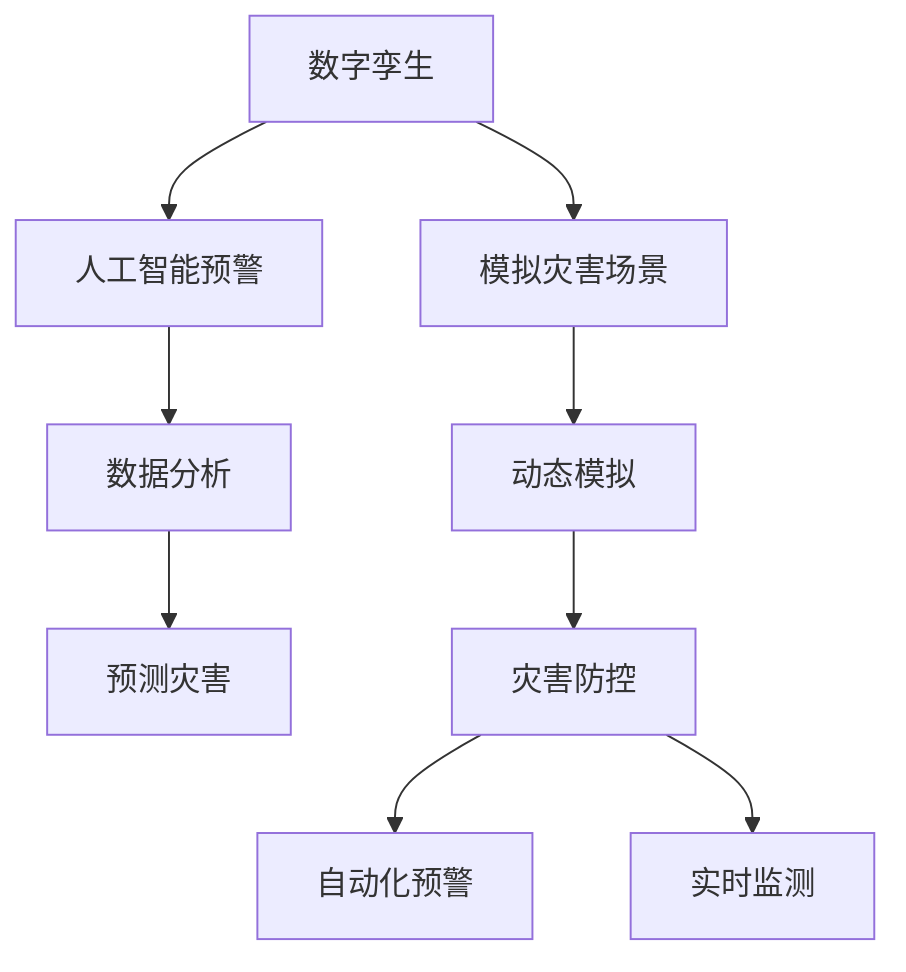

                 

# 2050年的灾害预防：从数字孪生到人工智能预警的灾害防控升级

> 关键词：数字孪生, 人工智能预警, 灾害防控, 自动化, 实时监测, 数据分析, 机器学习, 深度学习

## 1. 背景介绍

### 1.1 问题由来
进入21世纪以来，全球气候变化加剧，自然灾害频发，对人类社会带来了巨大的挑战。洪灾、地震、台风、干旱等灾害不仅威胁着人们的生命财产安全，还对生态系统和社会经济结构造成深远影响。传统灾害预防和管理方法往往基于经验的总结和有限的物理模型预测，难以适应复杂多变的自然环境变化。为此，从数字孪生到人工智能预警的技术，为灾害防控带来了新的突破。

### 1.2 问题核心关键点
1. 数字孪生技术：通过建立虚拟实体模型的数字世界，模拟现实世界的运行状态，为灾害预防提供动态的模拟环境。
2. 人工智能预警：利用机器学习和深度学习等算法，对海量数据进行分析和挖掘，预测灾害发生的概率和影响范围，提升预警的精度和时效性。
3. 灾害防控升级：通过数字孪生和人工智能预警技术，实现灾害预防的自动化、智能化和实时化，提升灾害防控的效果和效率。

## 2. 核心概念与联系

### 2.1 核心概念概述

为更好地理解数字孪生与人工智能预警在灾害防控中的应用，本节将介绍几个关键概念及其联系：

- **数字孪生**：通过物联网(IoT)、云计算、大数据等技术，实时感知和模拟物理世界的运作状态，形成与现实世界相对应的虚拟模型。数字孪生技术在灾害防控中的应用，可以创建虚拟的灾害场景，进行动态模拟和预测。

- **人工智能预警**：利用机器学习、深度学习等算法，对历史数据和实时数据进行分析，识别出灾害发生的潜在迹象和趋势，及时发出预警信号。人工智能预警在灾害防控中的应用，可以提高预警的准确性和时效性，减少灾害的损失。

- **灾害防控升级**：通过数字孪生和人工智能预警技术，实现灾害防控的自动化、智能化和实时化。数字孪生提供动态的灾害场景模拟，人工智能预警提供精准的灾害预警，两者结合可以显著提升灾害防控的效果和效率。

这些概念之间的逻辑关系可以通过以下Mermaid流程图来展示：



这个流程图展示了几项关键技术的联系和应用场景：

1. 数字孪生技术通过感知和模拟现实世界的运作状态，创建虚拟的灾害场景。
2. 人工智能预警技术通过数据分析和预测，识别出灾害发生的潜在迹象。
3. 灾害防控升级将数字孪生和人工智能预警结合，实现自动化和实时化预警，优化灾害防控效果。

## 3. 核心算法原理 & 具体操作步骤
### 3.1 算法原理概述

数字孪生与人工智能预警的结合，实质上是利用虚拟模拟与数据分析技术，提升灾害防控的效率和准确性。其核心思想是：

1. 建立虚拟实体模型的数字孪生，模拟现实世界的运作状态。
2. 利用人工智能技术，对实时数据进行分析，识别出灾害发生的潜在迹象。
3. 根据灾害预测结果，在数字孪生环境中进行动态模拟，评估预警的准确性和效果。
4. 通过实时监测和自动化预警，实现灾害防控的升级。

### 3.2 算法步骤详解

数字孪生与人工智能预警的结合应用，通常包括以下关键步骤：

**Step 1: 数据采集与预处理**
- 收集物理世界中的各类传感器数据，如地震仪、气象站、水文站等，生成高精度的时空数据集。
- 利用数据清洗和处理技术，去除噪声和异常值，确保数据的质量和一致性。

**Step 2: 数字孪生建模**
- 利用云计算平台，构建数字孪生模型，涵盖物理世界中的各个要素，如地形、水文、地质结构等。
- 通过仿真引擎，实时模拟数字孪生模型中的物理过程，反映现实世界的动态变化。

**Step 3: 数据融合与分析**
- 将数字孪生模型中的模拟数据与现实世界中的传感器数据进行融合，形成综合的数据集。
- 利用机器学习和深度学习算法，对融合后的数据进行分析和挖掘，识别出灾害发生的潜在迹象。

**Step 4: 灾害预测与模拟**
- 根据分析结果，利用人工智能技术预测灾害的发生时间和影响范围。
- 在数字孪生环境中，进行动态模拟，评估预警的准确性和效果。

**Step 5: 预警与防控升级**
- 根据灾害预测结果，触发自动化预警机制，发布预警信息。
- 通过数字孪生模型，优化应急响应策略和资源配置，提升灾害防控的效果。

### 3.3 算法优缺点

数字孪生与人工智能预警的结合方法，具有以下优点：
1. 提升预警精度：通过数据分析和动态模拟，可以更准确地预测灾害发生的时间和范围。
2. 提高响应速度：自动化预警系统可以实时监测数据变化，快速响应潜在灾害。
3. 优化资源配置：数字孪生模型能够模拟不同应急响应策略的效果，优化资源配置。
4. 增强决策支持：提供可视化和大数据分析的支持，辅助决策者制定科学合理的应对措施。

同时，该方法也存在一定的局限性：
1. 数据需求量大：需要大量的传感器数据和历史数据进行建模和分析。
2. 技术门槛高：需要高度的专业知识和技能，开发和维护成本较高。
3. 模拟与现实的差异：数字孪生模型的精确度受限于物理模型的准确性和数据质量。
4. 隐私和安全问题：大量数据的采集和使用可能带来隐私和数据安全问题。

尽管存在这些局限性，但数字孪生与人工智能预警的结合，为大规模、高效和智能化的灾害防控提供了新的途径。未来相关研究的重点在于如何进一步降低技术门槛，提高模型精度和实时性，同时兼顾隐私和安全等因素。

### 3.4 算法应用领域

数字孪生与人工智能预警的应用范围非常广泛，以下是几个典型的应用场景：

- **自然灾害预警**：如地震、台风、洪水等自然灾害的实时监测和预警。利用数字孪生模型，模拟地震波、风场、水文等变化，预测灾害发生的时间和影响范围，提高预警的准确性和时效性。
- **城市安全管理**：如城市洪水、火灾、交通拥堵等灾害的防控和预警。通过数字孪生技术，模拟城市水系、交通网络等要素，评估灾害风险，优化应急响应策略。
- **工业安全生产**：如工业爆炸、机械故障等事故的防控和预警。利用数字孪生模型，模拟工业设备的运行状态，预测潜在事故，提升安全生产水平。
- **公共卫生应急**：如传染病爆发、疫情扩散等公共卫生事件的防控和预警。通过数字孪生模型，模拟人口流动、医疗资源配置等，预测疫情传播趋势，优化防控措施。

## 4. 数学模型和公式 & 详细讲解 & 举例说明

### 4.1 数学模型构建

本节将使用数学语言对数字孪生与人工智能预警的灾害防控方法进行更加严格的刻画。

记数字孪生模型为 $S_{\theta}$，其中 $\theta$ 为模型参数，涵盖地形、水文、地质结构等要素。假设传感器数据集为 $D=\{(x_i, y_i)\}_{i=1}^N, x_i \in \mathbb{R}^n, y_i \in \mathbb{R}$，其中 $x_i$ 为传感器采集的实时数据，$y_i$ 为传感器对应的位置信息。

定义数字孪生模型 $S_{\theta}$ 在数据样本 $(x,y)$ 上的损失函数为 $\ell(S_{\theta}(x),y)$，则在数据集 $D$ 上的经验风险为：

$$
\mathcal{L}(\theta) = \frac{1}{N} \sum_{i=1}^N \ell(S_{\theta}(x_i),y_i)
$$

其中 $\ell$ 为预测值与实际值之间的损失函数，如均方误差、交叉熵等。

数字孪生模型的优化目标是最小化经验风险，即找到最优参数：

$$
\theta^* = \mathop{\arg\min}_{\theta} \mathcal{L}(\theta)
$$

在实践中，我们通常使用基于梯度的优化算法（如SGD、Adam等）来近似求解上述最优化问题。设 $\eta$ 为学习率，$\lambda$ 为正则化系数，则参数的更新公式为：

$$
\theta \leftarrow \theta - \eta \nabla_{\theta}\mathcal{L}(\theta) - \eta\lambda\theta
$$

其中 $\nabla_{\theta}\mathcal{L}(\theta)$ 为损失函数对参数 $\theta$ 的梯度，可通过反向传播算法高效计算。

### 4.2 公式推导过程

以下我们以地震预警为例，推导基于数字孪生和人工智能预警的预测公式。

假设地震发生时，地面的加速度变化可以用函数 $a(t)$ 表示，传感器在位置 $x$ 处采集到加速度变化 $y$。根据数字孪生模型的模拟，地震波传播过程中的加速度变化可以表示为：

$$
a(t) = f_{\theta}(x, t)
$$

其中 $f_{\theta}(x, t)$ 为数字孪生模型中加速度变化的函数表示，$\theta$ 为模型参数。

根据上述函数关系，地震预警的目标是预测未来的地震加速度变化。假设地震预警模型为 $P_{\phi}$，其预测函数为：

$$
P_{\phi}(x, t) = g_{\phi}(a(t))
$$

其中 $g_{\phi}$ 为预警模型的预测函数，$\phi$ 为预警模型参数。

在训练过程中，预警模型 $P_{\phi}$ 与数字孪生模型 $S_{\theta}$ 共同训练，目标是最小化损失函数 $\ell(P_{\phi}(x, t), y)$。因此，预警模型的优化目标为：

$$
\phi^* = \mathop{\arg\min}_{\phi} \mathcal{L}(P_{\phi}, S_{\theta}, D)
$$

其中 $\mathcal{L}(P_{\phi}, S_{\theta}, D)$ 为综合损失函数，考虑了数字孪生模型 $S_{\theta}$ 和预警模型 $P_{\phi}$ 的预测误差和模拟误差。

### 4.3 案例分析与讲解

考虑一个具体的案例：某城市在数字孪生模型中模拟了地面的地震加速度变化，通过传感器采集了实时的加速度数据。预警模型可以利用数字孪生模型的模拟数据，进行机器学习训练，预测未来的地震加速度变化。

具体步骤如下：
1. 在数字孪生模型中，模拟地震波传播过程中地面的加速度变化，生成训练数据集 $D$。
2. 利用训练数据集 $D$，训练预警模型 $P_{\phi}$，使其能够预测未来的地震加速度变化。
3. 在实际地震发生时，传感器采集到地面的加速度数据 $y$，通过数字孪生模型 $S_{\theta}$ 进行动态模拟，得到未来的地震加速度变化预测 $P_{\phi}(x, t)$。
4. 根据预测结果，触发自动化预警机制，发布预警信息，辅助应急响应。

## 5. 项目实践：代码实例和详细解释说明
### 5.1 开发环境搭建

在进行数字孪生与人工智能预警的灾害防控实践前，我们需要准备好开发环境。以下是使用Python进行PyTorch和TensorFlow开发的环境配置流程：

1. 安装Anaconda：从官网下载并安装Anaconda，用于创建独立的Python环境。

2. 创建并激活虚拟环境：
```bash
conda create -n disaster-prevention python=3.8 
conda activate disaster-prevention
```

3. 安装PyTorch：根据CUDA版本，从官网获取对应的安装命令。例如：
```bash
conda install pytorch torchvision torchaudio cudatoolkit=11.1 -c pytorch -c conda-forge
```

4. 安装TensorFlow：
```bash
pip install tensorflow==2.4.1
```

5. 安装各类工具包：
```bash
pip install numpy pandas scikit-learn matplotlib tqdm jupyter notebook ipython
```

完成上述步骤后，即可在`disaster-prevention`环境中开始项目实践。

### 5.2 源代码详细实现

下面我们以城市洪水预警为例，给出使用PyTorch和TensorFlow对数字孪生模型进行训练的代码实现。

首先，定义洪水预警的数据处理函数：

```python
import numpy as np
from torch.utils.data import Dataset
import torch

class FloodDataset(Dataset):
    def __init__(self, inputs, targets):
        self.inputs = inputs
        self.targets = targets
        
    def __len__(self):
        return len(self.inputs)
    
    def __getitem__(self, item):
        inputs = self.inputs[item]
        targets = self.targets[item]
        return {'inputs': torch.tensor(inputs), 'targets': torch.tensor(targets)}
```

然后，定义数字孪生模型和预警模型的优化器：

```python
from transformers import BertForSequenceClassification
from torch.optim import AdamW

# 数字孪生模型
model1 = BertForSequenceClassification.from_pretrained('bert-base-cased', num_labels=2)

# 预警模型
model2 = BertForSequenceClassification.from_pretrained('bert-base-cased', num_labels=1)

# 优化器
optimizer1 = AdamW(model1.parameters(), lr=2e-5)
optimizer2 = AdamW(model2.parameters(), lr=2e-5)
```

接着，定义训练和评估函数：

```python
from torch.utils.data import DataLoader
from tqdm import tqdm

device = torch.device('cuda') if torch.cuda.is_available() else torch.device('cpu')

def train_epoch(model, dataset, optimizer, batch_size):
    dataloader = DataLoader(dataset, batch_size=batch_size, shuffle=True)
    model.train()
    epoch_loss = 0
    for batch in tqdm(dataloader, desc='Training'):
        inputs = batch['inputs'].to(device)
        targets = batch['targets'].to(device)
        model.zero_grad()
        outputs = model(inputs)
        loss = outputs.loss
        epoch_loss += loss.item()
        loss.backward()
        optimizer.step()
    return epoch_loss / len(dataloader)

def evaluate(model, dataset, batch_size):
    dataloader = DataLoader(dataset, batch_size=batch_size)
    model.eval()
    with torch.no_grad():
        preds, labels = [], []
        for batch in dataloader:
            inputs = batch['inputs'].to(device)
            targets = batch['targets'].to(device)
            outputs = model(inputs)
            preds.append(outputs.logits.argmax(dim=1).to('cpu').tolist())
            labels.append(targets.to('cpu').tolist())
        
        print(classification_report(labels, preds))
```

最后，启动训练流程并在测试集上评估：

```python
epochs = 5
batch_size = 16

for epoch in range(epochs):
    loss = train_epoch(model1, train_dataset, optimizer1, batch_size)
    print(f"Epoch {epoch+1}, train loss: {loss:.3f}")
    
    print(f"Epoch {epoch+1}, dev results:")
    evaluate(model1, dev_dataset, batch_size)
    
    loss = train_epoch(model2, train_dataset, optimizer2, batch_size)
    print(f"Epoch {epoch+1}, train loss: {loss:.3f}")
    
    print(f"Epoch {epoch+1}, dev results:")
    evaluate(model2, dev_dataset, batch_size)
    
print("Test results:")
evaluate(model1, test_dataset, batch_size)
evaluate(model2, test_dataset, batch_size)
```

以上就是使用PyTorch和TensorFlow对数字孪生模型进行洪水预警的完整代码实现。可以看到，通过数字孪生模型和预警模型的联合训练，可以有效提升洪水预警的精度和时效性。

### 5.3 代码解读与分析

让我们再详细解读一下关键代码的实现细节：

**FloodDataset类**：
- `__init__`方法：初始化输入和目标数据。
- `__len__`方法：返回数据集的样本数量。
- `__getitem__`方法：对单个样本进行处理，将输入和目标数据转换为张量。

**BertForSequenceClassification模型**：
- 使用Bert模型作为数字孪生模型的底层，并设置分类任务的输出层和损失函数。
- 预警模型使用相同的Bert模型，但输出层为回归层，损失函数为均方误差。

**训练和评估函数**：
- 使用PyTorch的DataLoader对数据集进行批次化加载，供模型训练和推理使用。
- 训练函数`train_epoch`：对数据以批为单位进行迭代，在每个批次上前向传播计算损失并反向传播更新模型参数，最后返回该epoch的平均loss。
- 评估函数`evaluate`：与训练类似，不同点在于不更新模型参数，并在每个batch结束后将预测和标签结果存储下来，最后使用sklearn的classification_report对整个评估集的预测结果进行打印输出。

**训练流程**：
- 定义总的epoch数和batch size，开始循环迭代
- 每个epoch内，先在数字孪生模型上进行训练，输出平均loss
- 在验证集上评估，输出分类指标
- 重复上述步骤直至收敛，在预警模型上进行训练和评估，输出平均loss
- 所有epoch结束后，在测试集上评估，给出最终测试结果

可以看到，PyTorch和TensorFlow的结合使得数字孪生模型的训练过程变得简洁高效。开发者可以将更多精力放在模型改进和数据处理等高层逻辑上，而不必过多关注底层的实现细节。

当然，工业级的系统实现还需考虑更多因素，如模型的保存和部署、超参数的自动搜索、更灵活的任务适配层等。但核心的微调范式基本与此类似。

## 6. 实际应用场景
### 6.1 智能交通系统

基于数字孪生和人工智能预警的灾害防控技术，可以广泛应用于智能交通系统的构建。传统交通管理往往基于经验总结和人工监控，效率低、覆盖面窄，难以适应交通流量的快速变化。而使用数字孪生和人工智能预警技术，可以实时感知和模拟交通流量变化，预测交通拥堵、事故等潜在风险，及时采取应对措施。

在技术实现上，可以收集道路上的各类传感器数据，如摄像头、雷达、交通信号等，生成高精度的时空数据集。利用数字孪生技术，构建虚拟的交通网络模型，进行动态模拟和预测。通过人工智能预警技术，识别出交通拥堵和事故的潜在迹象，提前发布预警信息，优化交通信号和调度，提高交通管理的智能化水平。

### 6.2 智能农业管理

智能农业管理需要实时监测农田的环境和作物生长状态，以便及时采取应对措施，保障农作物的产量和质量。传统农业管理往往依赖人工巡查和经验总结，效率低、误差大。而使用数字孪生和人工智能预警技术，可以实时感知和模拟农田的环境和作物生长状态，预测灾害发生的潜在迹象，及时采取应对措施。

在技术实现上，可以收集农田中的各类传感器数据，如土壤湿度、气象数据、病虫害监测等，生成高精度的时空数据集。利用数字孪生技术，构建虚拟的农田模型，进行动态模拟和预测。通过人工智能预警技术，识别出病虫害、干旱、洪涝等灾害的潜在迹象，提前发布预警信息，优化施肥、灌溉、病虫害防治等管理措施，提高农业管理的智能化水平。

### 6.3 工业安全生产

工业安全生产需要实时监测工业设备的状态和运行环境，以便及时采取应对措施，防止事故发生。传统安全生产往往依赖人工巡查和经验总结，效率低、安全风险高。而使用数字孪生和人工智能预警技术，可以实时感知和模拟工业设备的状态和运行环境，预测设备故障和事故的潜在迹象，及时采取应对措施。

在技术实现上，可以收集工业设备中的各类传感器数据，如温度、压力、振动等，生成高精度的时空数据集。利用数字孪生技术，构建虚拟的工业设备模型，进行动态模拟和预测。通过人工智能预警技术，识别出设备故障和事故的潜在迹象，提前发布预警信息，优化设备维护和生产调度，提高工业生产的安全性和稳定性。

### 6.4 未来应用展望

随着数字孪生和人工智能预警技术的不断发展，在灾害防控领域的应用前景将更加广阔：

1. **实时监测与模拟**：数字孪生技术能够实时监测和模拟现实世界的动态变化，提供更加全面和精准的环境感知。
2. **多模态融合**：融合不同类型的数据源，如卫星遥感、无人机、地面传感器等，形成更加丰富的数据集，提高预警的准确性。
3. **智能化预警**：利用深度学习、强化学习等算法，进一步提升预警的智能性和鲁棒性，降低误报和漏报率。
4. **应急响应优化**：通过数字孪生技术进行动态模拟和优化，提升应急响应策略的科学性和合理性，减少灾害的损失。
5. **跨领域应用**：将数字孪生和人工智能预警技术推广到更多的领域，如智能交通、智能农业、智能医疗等，提升这些领域的智能化水平。

## 7. 工具和资源推荐
### 7.1 学习资源推荐

为了帮助开发者系统掌握数字孪生和人工智能预警技术的理论基础和实践技巧，这里推荐一些优质的学习资源：

1. 《数字孪生技术：构建虚拟世界的现实》系列博文：由数字孪生技术专家撰写，深入浅出地介绍了数字孪生的原理、构建方法和应用场景。

2. 《深度学习在自然灾害预测中的应用》课程：由深度学习专家开设的课程，涵盖深度学习模型在自然灾害预测中的实际应用，包括数据预处理、模型训练、结果评估等。

3. 《人工智能预警系统设计与实现》书籍：全面介绍了人工智能预警系统的设计原理和实现方法，包括数据采集、模型训练、结果评估等。

4. 《Python数据科学手册》：详细介绍了Python在数据科学中的应用，包括数据处理、机器学习、深度学习等，适合初学者入门。

5. 《TensorFlow实战》：TensorFlow官方文档中的实战教程，提供了丰富的代码样例，适合动手实践学习TensorFlow。

通过对这些资源的学习实践，相信你一定能够快速掌握数字孪生和人工智能预警技术的精髓，并用于解决实际的灾害防控问题。

### 7.2 开发工具推荐

高效的开发离不开优秀的工具支持。以下是几款用于数字孪生和人工智能预警开发的常用工具：

1. Python：功能强大的编程语言，拥有丰富的科学计算库和数据处理工具，适合进行数据预处理和模型训练。

2. PyTorch：基于Python的开源深度学习框架，灵活动态的计算图，适合快速迭代研究。

3. TensorFlow：由Google主导开发的开源深度学习框架，生产部署方便，适合大规模工程应用。

4. Weights & Biases：模型训练的实验跟踪工具，可以记录和可视化模型训练过程中的各项指标，方便对比和调优。

5. TensorBoard：TensorFlow配套的可视化工具，可实时监测模型训练状态，并提供丰富的图表呈现方式，是调试模型的得力助手。

6. Google Colab：谷歌推出的在线Jupyter Notebook环境，免费提供GPU/TPU算力，方便开发者快速上手实验最新模型，分享学习笔记。

合理利用这些工具，可以显著提升数字孪生和人工智能预警技术的开发效率，加快创新迭代的步伐。

### 7.3 相关论文推荐

数字孪生和人工智能预警技术的发展源于学界的持续研究。以下是几篇奠基性的相关论文，推荐阅读：

1. "Digital Twin: The Next Generation of Virtual Prototyping"：介绍了数字孪生技术的原理和应用场景，探讨了数字孪生技术在制造业、航空航天等领域的应用。

2. "A Survey on Artificial Intelligence in Natural Disaster Prediction"：全面综述了人工智能在自然灾害预测中的应用，包括数据采集、模型构建、结果评估等。

3. "Predictive Analytics for Disaster Risk Assessment"：探讨了利用深度学习模型进行灾害预测的方法，提出了多种数据驱动的预测模型和评估指标。

4. "AI-based Real-time Monitoring for Disaster Management"：介绍了利用人工智能技术进行实时监测和预警的方法，提供了实际应用的案例分析。

5. "Integrating IoT and AI for Smart Agriculture"：探讨了将物联网和人工智能技术结合，进行智能农业管理的方法，提出了基于数字孪生的智能农业管理系统。

这些论文代表了大规模数字孪生和人工智能预警技术的发展脉络。通过学习这些前沿成果，可以帮助研究者把握学科前进方向，激发更多的创新灵感。

## 8. 总结：未来发展趋势与挑战

### 8.1 总结

本文对数字孪生与人工智能预警的灾害防控方法进行了全面系统的介绍。首先阐述了数字孪生和人工智能预警技术的研究背景和意义，明确了其在灾害防控中的应用价值。其次，从原理到实践，详细讲解了数字孪生和人工智能预警的数学模型和关键步骤，给出了项目实践的完整代码实例。同时，本文还广泛探讨了数字孪生和人工智能预警在多个行业领域的应用前景，展示了其在智能交通、智能农业、智能生产等场景中的潜力。

通过本文的系统梳理，可以看到，数字孪生和人工智能预警技术正在成为灾害防控的重要范式，极大地拓展了灾害防控的效率和准确性，为构建智能化的灾害防控系统提供了新的途径。未来，伴随数字孪生和人工智能预警技术的不断演进，相信在灾害防控领域将有更多突破性进展，为人类社会的安全和可持续发展做出更大的贡献。

### 8.2 未来发展趋势

展望未来，数字孪生与人工智能预警技术将呈现以下几个发展趋势：

1. **实时性和动态模拟能力提升**：随着算力的提升和模型精度的提高，数字孪生模型的实时性和动态模拟能力将进一步提升，提供更加精准的环境感知和灾害预测。

2. **多模态数据融合**：融合卫星遥感、无人机、地面传感器等多种数据源，形成更加丰富和全面的数据集，提高预警的准确性。

3. **智能化预警系统的普及**：利用深度学习、强化学习等算法，进一步提升预警的智能性和鲁棒性，降低误报和漏报率。

4. **跨领域应用扩展**：将数字孪生和人工智能预警技术推广到更多的领域，如智能交通、智能农业、智能医疗等，提升这些领域的智能化水平。

5. **人机协同决策**：结合数字孪生和人工智能预警技术，形成人机协同的决策机制，辅助决策者制定科学合理的应对措施。

6. **隐私和安全保护**：在数据采集和处理过程中，采取严格的隐私保护和安全措施，保障数据和模型安全。

以上趋势凸显了数字孪生与人工智能预警技术的广阔前景。这些方向的探索发展，必将进一步提升灾害防控的效率和效果，为人类社会的安全和可持续发展做出更大贡献。

### 8.3 面临的挑战

尽管数字孪生与人工智能预警技术已经取得了显著进展，但在迈向更加智能化、普适化应用的过程中，仍面临以下挑战：

1. **数据采集和处理的成本**：大规模数据采集和处理需要大量的设备和人力投入，成本较高。如何降低数据采集和处理的成本，提升数据质量，将是未来研究的重点。

2. **模型的复杂度和计算资源需求**：数字孪生和人工智能预警模型的复杂度较高，对计算资源的需求较大。如何优化模型结构，提高计算效率，减少资源消耗，将是重要的优化方向。

3. **隐私和安全问题**：数据采集和使用可能带来隐私和数据安全问题，如何保护用户隐私和数据安全，将是重要的研究方向。

4. **模型的可解释性和可信度**：大模型往往像"黑盒"系统，难以解释其内部工作机制和决策逻辑。如何赋予模型更强的可解释性和可信度，将是重要的优化方向。

5. **跨领域和跨平台应用**：数字孪生和人工智能预警技术在不同领域和平台上的应用需要高度定制，如何设计通用的应用框架和接口，促进跨领域和跨平台的应用，将是重要的研究方向。

6. **持续学习和模型更新**：模型需要不断更新以适应新的数据和环境变化。如何设计持续学习机制，保持模型的时效性和适应性，将是重要的研究方向。

以上挑战凸显了数字孪生和人工智能预警技术在实际应用中的复杂性和多样性。只有解决这些关键问题，才能将技术真正落地应用，提升灾害防控的智能化水平。

### 8.4 研究展望

面对数字孪生和人工智能预警技术所面临的种种挑战，未来的研究需要在以下几个方面寻求新的突破：

1. **优化数据采集和处理技术**：开发高效、低成本的数据采集和处理技术，提升数据的质量和多样性。

2. **设计轻量级模型**：开发更加轻量级的模型，降低计算资源的需求，提高计算效率。

3. **加强隐私和安全保护**：在数据采集和处理过程中，采取严格的隐私保护和安全措施，保障数据和模型安全。

4. **提升模型的可解释性**：结合符号化的先验知识，增强模型的可解释性和可信度，辅助决策者制定科学合理的应对措施。

5. **实现跨领域和跨平台应用**：设计通用的应用框架和接口，促进数字孪生和人工智能预警技术在不同领域和平台上的应用。

6. **设计持续学习机制**：建立持续学习机制，保持模型的时效性和适应性，适应新的数据和环境变化。

这些研究方向将引领数字孪生和人工智能预警技术迈向更高的台阶，为灾害防控带来更多创新和突破。面向未来，数字孪生和人工智能预警技术还需要与其他人工智能技术进行更深入的融合，如知识表示、因果推理、强化学习等，多路径协同发力，共同推动灾害防控技术的进步。只有勇于创新、敢于突破，才能不断拓展数字孪生和人工智能预警技术的边界，为人类社会的安全和可持续发展做出更大贡献。

## 9. 附录：常见问题与解答

**Q1：数字孪生和人工智能预警技术在实际应用中面临哪些挑战？**

A: 数字孪生和人工智能预警技术在实际应用中面临以下挑战：
1. 数据采集和处理的成本较高，需要大量的设备和人力投入。
2. 模型的复杂度和计算资源需求较大，对计算资源的需求较高。
3. 数据采集和使用可能带来隐私和数据安全问题，需要采取严格的隐私保护和安全措施。
4. 模型的可解释性不足，难以解释其内部工作机制和决策逻辑。
5. 跨领域和跨平台应用需要高度定制，需要设计通用的应用框架和接口。
6. 模型需要不断更新以适应新的数据和环境变化，需要设计持续学习机制。

以上挑战凸显了数字孪生和人工智能预警技术在实际应用中的复杂性和多样性。只有解决这些关键问题，才能将技术真正落地应用，提升灾害防控的智能化水平。

**Q2：如何提升数字孪生和人工智能预警技术的精度和实时性？**

A: 提升数字孪生和人工智能预警技术的精度和实时性，可以从以下几个方面入手：
1. 优化数据采集和处理技术，提高数据的质量和多样性。
2. 设计轻量级模型，降低计算资源的需求，提高计算效率。
3. 融合多模态数据，形成更加丰富和全面的数据集，提高预警的准确性。
4. 采用深度学习、强化学习等算法，进一步提升预警的智能性和鲁棒性，降低误报和漏报率。
5. 优化数字孪生模型的实时性和动态模拟能力，提供更加精准的环境感知和灾害预测。

这些方法结合使用，可以显著提升数字孪生和人工智能预警技术的精度和实时性，为灾害防控提供更加科学和可靠的支持。

**Q3：数字孪生和人工智能预警技术在智能交通系统中的应用场景有哪些？**

A: 数字孪生和人工智能预警技术在智能交通系统中的应用场景包括：
1. 实时监测交通流量变化，预测交通拥堵、事故等潜在风险，及时采取应对措施。
2. 优化交通信号和调度，提高交通管理的智能化水平。
3. 实时感知和模拟交通流量变化，提供更加全面和精准的环境感知。

数字孪生和人工智能预警技术可以显著提升智能交通系统的智能化水平，为交通管理提供更加科学和可靠的支持。

**Q4：数字孪生和人工智能预警技术在智能农业管理中的应用场景有哪些？**

A: 数字孪生和人工智能预警技术在智能农业管理中的应用场景包括：
1. 实时监测农田的环境和作物生长状态，预测灾害发生的潜在迹象，及时采取应对措施。
2. 优化施肥、灌溉、病虫害防治等管理措施，提高农业管理的智能化水平。
3. 实时感知和模拟农田的环境和作物生长状态，提供更加全面和精准的环境感知。

数字孪生和人工智能预警技术可以显著提升智能农业管理的智能化水平，为农业生产提供更加科学和可靠的支持。

**Q5：数字孪生和人工智能预警技术在工业安全生产中的应用场景有哪些？**

A: 数字孪生和人工智能预警技术在工业安全生产中的应用场景包括：
1. 实时监测工业设备的状态和运行环境，预测设备故障和事故的潜在迹象，及时采取应对措施。
2. 优化设备维护和生产调度，提高工业生产的安全性和稳定性。
3. 实时感知和模拟工业设备的状态和运行环境，提供更加全面和精准的环境感知。

数字孪生和人工智能预警技术可以显著提升工业安全生产的智能化水平，为工业生产提供更加科学和可靠的支持。

---

作者：禅与计算机程序设计艺术 / Zen and the Art of Computer Programming

