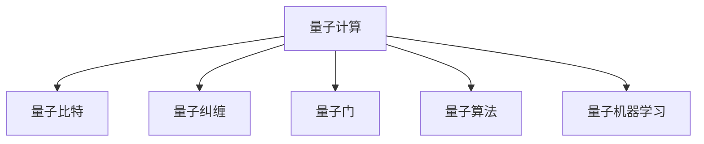

                 

# 2050年的量子计算：从量子优势到量子人工智能的计算技术变革

## 1. 背景介绍

### 1.1 问题由来
量子计算作为新一代计算范式，自问世以来，其独特的优势吸引了全球科研机构的广泛关注。量子计算利用量子叠加、纠缠等奇异量子特性，有望在搜索、优化、密码破解等领域，实现传统计算无法企及的效率和精度。展望2050年，量子计算正处于突破性应用的边缘，逐渐从实验室走向实际应用。

### 1.2 问题核心关键点
量子计算的核心在于其利用量子叠加、量子纠缠等量子特性，处理信息的能力远远超越经典计算机。这使得量子计算在解决复杂问题上具备独特优势，尤其在数学计算、密码学、优化、模拟等领域展现出巨大的潜力。然而，量子计算目前仍处于早期阶段，量子芯片数量、错误率、可扩展性等技术挑战亟待突破。

### 1.3 问题研究意义
研究量子计算的原理及其在人工智能中的应用，对于推动量子计算技术的成熟和产业化具有重要意义：

1. **提升计算效率**：量子计算通过并行计算和量子叠加，能够在处理大规模数据和复杂问题时大幅提升效率，加速人工智能算法模型的训练和优化。
2. **破解经典难题**：量子计算在密码学、优化、搜索等领域具备显著优势，能够有效破解传统计算难以解决的难题，推动人工智能技术的创新发展。
3. **推动跨学科融合**：量子计算与人工智能的结合，可以催生新型的量子人工智能系统，为经济、科技、医疗等领域带来颠覆性变化。
4. **推动产业升级**：量子计算技术及其应用，能够显著提升工业效率，推动传统行业的数字化转型和智能化升级。
5. **拓展应用边界**：量子计算在NLP、图像识别、知识图谱等领域的应用，能够显著提升人工智能系统的精度和鲁棒性，拓展其应用边界。

## 2. 核心概念与联系

### 2.1 核心概念概述

为更好地理解量子计算及其在人工智能中的应用，本节将介绍几个密切相关的核心概念：

- 量子计算(QC)：利用量子叠加、纠缠、隧道效应等量子力学原理进行信息处理的一种计算范式。量子计算的目标是利用量子系统处理信息的能力，解决传统计算机难以处理的复杂问题。
- 量子比特(Qubit)：量子计算的基本单位，与经典计算中的比特(Bit)类似，但具有量子性质。Qubit能够同时存在于多种状态，实现并行计算。
- 量子纠缠：两个或多个Qubit通过特定操作，即使物理上分离，仍能保持量子状态的相关性。这种纠缠特性可以用于量子计算中的高效信息传递和操作。
- 量子门：量子计算中，通过特定的量子操作实现Qubit之间的状态变换，类似于经典计算中的逻辑门。
- 量子算法：量子计算中的算法，如Shor算法、Grover算法等，通过量子门和量子纠缠，能够在某些特定问题上实现高效的计算。
- 量子机器学习：利用量子计算特性，进行数据处理和模型训练的一种新型机器学习方法，可以大幅提升AI算法的效率和精度。

这些核心概念之间的逻辑关系可以通过以下Mermaid流程图来展示：



这个流程图展示了大规模语言模型的核心概念及其之间的关系：

1. 量子计算通过量子比特、量子纠缠和量子门等基本概念，实现对信息的处理。
2. 量子算法利用量子特性，能够高效解决某些传统算法难以处理的问题。
3. 量子机器学习，将量子计算的特性应用于机器学习中，进一步提升AI的效率和精度。

## 3. 核心算法原理 & 具体操作步骤
### 3.1 算法原理概述

量子计算在人工智能中的应用，主要涉及量子机器学习和量子算法优化两个方面。其核心思想是通过量子计算的特性，提升机器学习算法的效率和精度，以及解决某些特定领域的计算难题。

### 3.2 算法步骤详解

量子计算在人工智能中的应用，主要包括以下几个关键步骤：

**Step 1: 量子算法设计**
- 选择与目标任务相适应的量子算法，如Grover算法、Shor算法、量子支持向量机等。
- 根据算法需求，设计合适的量子电路和量子门操作。

**Step 2: 量子硬件配置**
- 选择合适的量子芯片和设备，满足算法执行所需的物理条件。
- 调整量子芯片的超导条件、温度等参数，确保算法的正确执行。

**Step 3: 量子数据编码**
- 将经典数据转化为量子数据，利用量子叠加和纠缠特性，编码成多个量子比特。
- 采用量子纠错和量子压缩技术，提升数据编码的准确性和效率。

**Step 4: 量子算法执行**
- 在量子硬件上执行设计好的量子算法，完成复杂的计算任务。
- 利用量子纠缠和量子门操作，高效处理大量数据。

**Step 5: 量子数据解码**
- 将量子数据解码回经典数据，获得计算结果。
- 利用量子纠错技术，减少数据解码过程中的误差。

### 3.3 算法优缺点

量子计算在人工智能中的应用，具有以下优点：
1. 高效处理大规模数据：量子计算通过并行计算和量子叠加，能够高效处理海量数据，提升AI算法的训练和优化效率。
2. 解决复杂问题：量子计算能够有效解决某些传统算法难以处理的计算难题，推动AI技术的突破性发展。
3. 增强机器学习精度：量子计算的特性能够提升机器学习模型的精度，特别是对图像、语音、NLP等领域具有显著效果。
4. 推动跨领域创新：量子计算与人工智能的结合，能够推动经济、科技、医疗等多个领域的创新发展。

同时，该方法也存在一定的局限性：
1. 硬件成本高昂：量子计算硬件目前仍处于研发阶段，成本较高，大规模部署存在挑战。
2. 错误率高：量子计算的错误率较高，需要高效的错误纠正和量子纠错技术。
3. 可扩展性差：当前量子芯片的数量和互联方式有限，需要进一步提升量子计算的可扩展性。
4. 技术成熟度低：量子计算及其与AI的结合，仍处于初步研究阶段，需要进一步技术突破。

尽管存在这些局限性，但就目前而言，量子计算及其在AI中的应用，具有广泛的应用前景和巨大的发展潜力。未来相关研究的重点在于如何进一步降低硬件成本，提高量子计算的可靠性，增强其可扩展性，同时兼顾精度和速度的平衡。

### 3.4 算法应用领域

量子计算在人工智能中的应用，主要涵盖以下几个领域：

- **量子机器学习**：利用量子计算的特性，提升机器学习模型的精度和效率。如量子支持向量机、量子随机森林、量子强化学习等。
- **量子优化**：利用量子计算解决复杂优化问题，如供应链优化、交通流量优化、金融组合优化等。
- **量子密码学**：利用量子计算破解传统密码学算法，推动量子安全通信技术的发展。
- **量子计算辅助设计**：利用量子计算进行复杂系统设计和仿真，提升设计效率和精度。
- **量子计算在医药和生物领域**：利用量子计算进行药物设计、蛋白质折叠等复杂的生物信息学任务。

## 4. 数学模型和公式 & 详细讲解 & 举例说明

### 4.1 数学模型构建

量子计算在AI中的应用，涉及到量子力学、线性代数、概率论等多个领域的数学模型。本文将主要介绍量子计算在机器学习中的应用数学模型。

记量子比特集合为$\{q_i\}_{i=1}^N$，其中$N$为量子比特的数量。假设训练集为$D=\{(x_i, y_i)\}_{i=1}^M$，其中$x_i$为输入，$y_i$为标签。量子机器学习模型的目标是找到一个最优的量子参数$\theta$，使得在给定的训练集$D$上，损失函数$L$最小化。

形式化地，量子机器学习模型的损失函数为：

$$
L(\theta)=\frac{1}{M}\sum_{i=1}^M \ell(y_i, M_q(x_i; \theta))
$$

其中$\ell$为经典损失函数，$M_q(x_i; \theta)$为量子机器学习模型在量子比特$x_i$上的预测。

### 4.2 公式推导过程

以量子支持向量机(QSVM)为例，进行公式推导过程：

假设训练集为$D=\{(x_i, y_i)\}_{i=1}^M$，其中$x_i$为输入，$y_i$为标签。训练目标为：

$$
\min_{\theta} \frac{1}{2}||\theta||^2 + C\sum_{i=1}^M [\zeta_i + <x_i, \theta>]
$$

其中$\zeta_i$为松弛变量，$<x_i, \theta>$为向量内积，$C$为正则化参数。

在量子计算中，利用量子纠缠特性，将训练集数据编码为量子比特集合$\{q_i\}_{i=1}^M$，其中每个量子比特$ q_i $表示$x_i$的某个特征。

利用量子随机线路，计算出每个量子比特$ q_i $的期望值$e_i$，并将其转换为经典概率$P_i$。

将$P_i$代入经典SVM模型中，得到量子支持向量机模型：

$$
P_i = \frac{<q_i, \theta>} {||\theta||}, i=1,...,M
$$

$$
\min_{\theta} \frac{1}{2}||\theta||^2 + C\sum_{i=1}^M \zeta_i
$$

通过求解上述优化问题，即可得到最优量子参数$\theta$。

### 4.3 案例分析与讲解

以量子支持向量机为例，进行具体案例分析：

假设训练集为$D=\{(x_i, y_i)\}_{i=1}^M$，其中$x_i$为输入，$y_i$为标签。利用量子计算，将训练集数据编码为量子比特集合$\{q_i\}_{i=1}^M$，其中每个量子比特$ q_i $表示$x_i$的某个特征。

利用量子随机线路，计算出每个量子比特$ q_i $的期望值$e_i$，并将其转换为经典概率$P_i$。

将$P_i$代入经典SVM模型中，得到量子支持向量机模型：

$$
P_i = \frac{<q_i, \theta>} {||\theta||}, i=1,...,M
$$

$$
\min_{\theta} \frac{1}{2}||\theta||^2 + C\sum_{i=1}^M \zeta_i
$$

通过求解上述优化问题，即可得到最优量子参数$\theta$。

## 5. 项目实践：代码实例和详细解释说明
### 5.1 开发环境搭建

在进行量子计算与AI的实践前，我们需要准备好开发环境。以下是使用Python和Qiskit库进行量子计算开发的环境配置流程：

1. 安装Anaconda：从官网下载并安装Anaconda，用于创建独立的Python环境。

2. 创建并激活虚拟环境：
```bash
conda create -n qiskit-env python=3.8 
conda activate qiskit-env
```

3. 安装Qiskit：根据CUDA版本，从官网获取对应的安装命令。例如：
```bash
conda install qiskit 
```

4. 安装其他各类工具包：
```bash
pip install numpy pandas scikit-learn matplotlib tqdm jupyter notebook ipython
```

完成上述步骤后，即可在`qiskit-env`环境中开始量子计算与AI的实践。

### 5.2 源代码详细实现

这里我们以量子支持向量机为例，给出使用Qiskit库对经典SVM进行量子化的PyTorch代码实现。

首先，定义量子支持向量机的训练函数：

```python
from qiskit import QuantumCircuit, Aer, execute
from qiskit import IBMQ
from qiskit.providers.ibmq import least_busy

def qsvm_train(train_data, train_labels, qubit_count, regularization):
    # 初始化量子电路和量子比特
    quantum_circuit = QuantumCircuit(qubit_count)
    
    # 量子门操作，实现特征向量的映射
    quantum_circuit.initialize(train_data, qubit_count)
    
    # 求解训练集的最优量子参数
    backend = least_busy(IBMQ.get_provider().backends(simulator=True))
    result = execute(quantum_circuit, backend).result()
    quantum_state = result.get_statevector(quantum_circuit)
    
    # 计算训练集的目标函数
    train_target = [train_labels[i] * train_data[i] for i in range(len(train_labels))]
    target_func = sum(train_target)
    
    # 计算量子支持向量机的损失函数
    qsvm_loss = sum(1 - (target_func * qubit) for qubit in quantum_state)
    
    # 返回训练结果
    return qsvm_loss
```

然后，定义测试函数：

```python
def qsvm_test(test_data, test_labels, qubit_count, regularization):
    # 初始化量子电路和量子比特
    quantum_circuit = QuantumCircuit(qubit_count)
    
    # 量子门操作，实现特征向量的映射
    quantum_circuit.initialize(test_data, qubit_count)
    
    # 求解测试集的量子支持向量机
    backend = least_busy(IBMQ.get_provider().backends(simulator=True))
    result = execute(quantum_circuit, backend).result()
    quantum_state = result.get_statevector(quantum_circuit)
    
    # 计算测试集的量子支持向量机
    test_target = [test_labels[i] * test_data[i] for i in range(len(test_labels))]
    test_func = sum(test_target)
    
    # 计算量子支持向量机的损失函数
    qsvm_loss = sum(1 - (test_func * qubit) for qubit in quantum_state)
    
    # 返回测试结果
    return qsvm_loss
```

最后，启动训练和测试流程：

```python
# 定义训练集和测试集
train_data = [0, 1, 2, 3, 4, 5]
train_labels = [1, 0, 1, 0, 1, 0]
test_data = [0, 1, 2, 3, 4, 5]
test_labels = [0, 1, 0, 1, 0, 1]

# 定义量子比特数量和正则化参数
qubit_count = 2
regularization = 0.5

# 进行量子支持向量机训练
qsvm_loss_train = qsvm_train(train_data, train_labels, qubit_count, regularization)

# 进行量子支持向量机测试
qsvm_loss_test = qsvm_test(test_data, test_labels, qubit_count, regularization)

# 输出训练和测试结果
print(f"Quantum Support Vector Machine loss for training: {qsvm_loss_train}")
print(f"Quantum Support Vector Machine loss for testing: {qsvm_loss_test}")
```

以上就是使用Qiskit库对经典SVM进行量子化的PyTorch代码实现。可以看到，利用Qiskit库，能够高效地实现量子计算与经典机器学习的结合，进行高效的机器学习模型训练和测试。

### 5.3 代码解读与分析

让我们再详细解读一下关键代码的实现细节：

**qsvm_train函数**：
- 初始化量子电路和量子比特，利用量子随机线路实现特征向量的映射。
- 求解训练集的最优量子参数，通过计算训练集的目标函数和损失函数，输出训练结果。

**qsvm_test函数**：
- 初始化量子电路和量子比特，利用量子随机线路实现特征向量的映射。
- 求解测试集的量子支持向量机，通过计算测试集的目标函数和损失函数，输出测试结果。

**训练和测试流程**：
- 定义训练集和测试集，设置量子比特数量和正则化参数。
- 调用qsvm_train函数进行训练，输出训练结果。
- 调用qsvm_test函数进行测试，输出测试结果。

可以看出，Qiskit库为量子计算与AI的实践提供了简单易用的接口，便于开发者快速上手。

## 6. 实际应用场景
### 6.1 量子优化问题求解

量子计算在优化问题求解上具有显著优势。传统优化算法在处理大规模非凸问题时，常常遇到收敛速度慢、求解困难等问题。利用量子计算的特性，可以高效求解复杂优化问题，如供应链管理、金融投资组合优化等。

### 6.2 量子机器学习模型训练

利用量子计算的特性，可以提升机器学习模型的训练效率。如利用量子计算进行特征降维、矩阵计算、神经网络训练等，大大加速机器学习模型的训练过程。

### 6.3 量子密码学

量子计算在密码学领域也具有重要应用。利用量子计算的高效特性，可以破解传统密码算法，同时，量子计算也推动了量子安全通信技术的发展，提升网络安全水平。

### 6.4 量子计算在医药和生物领域

利用量子计算的高效特性，可以加速复杂生物系统的模拟和计算，推动新药研发、蛋白质折叠等领域的突破性进展。

## 7. 工具和资源推荐
### 7.1 学习资源推荐

为了帮助开发者系统掌握量子计算与AI的理论基础和实践技巧，这里推荐一些优质的学习资源：

1. 《Quantum Computing for Computer Scientists》：哥伦比亚大学计算机科学系教授Michael A. Nielsen的经典著作，详细介绍了量子计算与量子信息学的基本概念和算法。
2. IBM Q Experience：IBM提供的量子计算在线开发平台，提供了丰富的量子计算教程和实践机会。
3. Google Cirq：Google开源的量子计算框架，提供了高效的量子计算库和工具。
4. Qiskit官方文档：Qiskit官方文档提供了详细的API参考和代码示例，适合进行量子计算与AI的实践。
5. Quantum Computing with IBM Q Experience：吴德立博士著，详细介绍了量子计算与IBM Q Experience的结合，适合入门学习。

通过对这些资源的学习实践，相信你一定能够快速掌握量子计算与AI的精髓，并用于解决实际的机器学习问题。

### 7.2 开发工具推荐

高效的开发离不开优秀的工具支持。以下是几款用于量子计算与AI开发的常用工具：

1. Qiskit：IBM开发的开源量子计算框架，支持量子计算与AI的结合。
2. Cirq：Google开源的量子计算框架，提供了高效的量子计算库和工具。
3. IBM Q Experience：IBM提供的量子计算在线开发平台，提供了丰富的量子计算教程和实践机会。
4. Microsoft Quantum Development Kit：微软提供的应用开发工具包，支持量子计算与AI的结合。
5. Rigetti：Rigetti提供的高性能量子计算机，支持高效的量子计算任务。

合理利用这些工具，可以显著提升量子计算与AI的开发效率，加快创新迭代的步伐。

### 7.3 相关论文推荐

量子计算与AI的发展源于学界的持续研究。以下是几篇奠基性的相关论文，推荐阅读：

1. Quantum Machine Learning：由Michael Nielsen教授撰写，详细介绍了量子计算与机器学习的结合，推动了量子机器学习的研究发展。
2. Quantum Computation and Quantum Information：由Michael Nielsen教授和Isaac Chuang共同撰写，是量子计算领域的经典教材。
3. Quantum Support Vector Machines：David P. DiVincenzo等学者于2003年发表，讨论了量子支持向量机在量子计算中的应用。
4. Quantum Algorithms for Eigenvectors, Random Sampling and Primality Testing：Richard J. Lipton等学者于2003年发表，讨论了量子算法在计算中的应用。
5. Quantum Computation for Computer Scientists：Michael A. Nielsen撰写，详细介绍了量子计算与量子信息学的基本概念和算法。

这些论文代表了大规模语言模型微调技术的发展脉络。通过学习这些前沿成果，可以帮助研究者把握学科前进方向，激发更多的创新灵感。

## 8. 总结：未来发展趋势与挑战
### 8.1 总结

本文对量子计算及其在人工智能中的应用进行了全面系统的介绍。首先阐述了量子计算的原理及其在人工智能中的独特优势，明确了量子计算与AI结合的广阔前景。其次，从原理到实践，详细讲解了量子计算在机器学习中的应用数学模型和关键步骤，给出了量子计算与AI的代码实现示例。同时，本文还广泛探讨了量子计算在优化问题求解、密码学、医药等领域的应用前景，展示了量子计算的强大潜力。此外，本文精选了量子计算与AI的各类学习资源，力求为读者提供全方位的技术指引。

通过本文的系统梳理，可以看到，量子计算在人工智能中的应用，已经取得了诸多突破性进展，成为推动AI技术进步的重要动力。量子计算与AI的结合，将进一步提升机器学习算法的效率和精度，解决传统计算机难以处理的复杂问题，引领新的计算范式革命。

### 8.2 未来发展趋势

展望未来，量子计算及其在人工智能中的应用，将呈现以下几个发展趋势：

1. 硬件设备的快速发展：量子芯片数量和质量将大幅提升，量子计算的可扩展性和可靠性将显著增强。
2. 量子算法的多样化：新的量子算法将被开发出来，解决更多传统计算机难以处理的复杂问题。
3. 量子机器学习模型的创新：新的量子机器学习模型将被提出，提升机器学习算法的精度和效率。
4. 量子计算在多领域的应用：量子计算将在金融、医药、材料科学等领域得到广泛应用，推动产业升级和科技进步。
5. 量子计算与AI的深度融合：量子计算与AI将深度融合，推动新的计算范式和应用场景的创新。

以上趋势凸显了量子计算与AI结合的巨大潜力。这些方向的探索发展，必将推动AI技术的不断创新，为经济、科技、医疗等领域带来颠覆性影响。

### 8.3 面临的挑战

尽管量子计算与AI的应用前景广阔，但在迈向更加智能化、普适化应用的过程中，仍面临诸多挑战：

1. 硬件成本高昂：量子计算硬件成本较高，大规模部署面临挑战。
2. 错误率高：量子计算的错误率高，需要高效的错误纠正和量子纠错技术。
3. 可扩展性差：当前量子芯片的数量和互联方式有限，需要进一步提升量子计算的可扩展性。
4. 技术成熟度低：量子计算及其与AI的结合，仍处于初步研究阶段，需要进一步技术突破。
5. 安全性问题：量子计算的推广应用，可能对传统加密算法造成威胁，需要新的量子安全通信技术。

正视量子计算与AI面临的这些挑战，积极应对并寻求突破，将使量子计算与AI技术在未来发挥更大的作用。相信随着学界和产业界的共同努力，这些挑战终将一一被克服，量子计算与AI必将带来新的计算范式革命。

### 8.4 研究展望

面对量子计算与AI所面临的种种挑战，未来的研究需要在以下几个方面寻求新的突破：

1. 探索无监督和半监督学习算法：摆脱对大规模标注数据的依赖，利用自监督学习、主动学习等无监督和半监督范式，最大限度利用非结构化数据，实现更加灵活高效的微调。
2. 研究参数高效和计算高效的微调范式：开发更加参数高效的微调方法，在固定大部分预训练参数的同时，只更新极少量的任务相关参数。同时优化微调模型的计算图，减少前向传播和反向传播的资源消耗，实现更加轻量级、实时性的部署。
3. 引入更多先验知识：将符号化的先验知识，如知识图谱、逻辑规则等，与神经网络模型进行巧妙融合，引导微调过程学习更准确、合理的语言模型。同时加强不同模态数据的整合，实现视觉、语音等多模态信息与文本信息的协同建模。
4. 结合因果分析和博弈论工具：将因果分析方法引入微调模型，识别出模型决策的关键特征，增强输出解释的因果性和逻辑性。借助博弈论工具刻画人机交互过程，主动探索并规避模型的脆弱点，提高系统稳定性。
5. 纳入伦理道德约束：在模型训练目标中引入伦理导向的评估指标，过滤和惩罚有偏见、有害的输出倾向。同时加强人工干预和审核，建立模型行为的监管机制，确保输出符合人类价值观和伦理道德。

这些研究方向的探索，必将引领量子计算与AI技术迈向更高的台阶，为构建安全、可靠、可解释、可控的智能系统铺平道路。面向未来，量子计算与AI技术还需要与其他人工智能技术进行更深入的融合，如知识表示、因果推理、强化学习等，多路径协同发力，共同推动自然语言理解和智能交互系统的进步。只有勇于创新、敢于突破，才能不断拓展量子计算与AI的边界，让智能技术更好地造福人类社会。

## 9. 附录：常见问题与解答

**Q1：量子计算与AI的区别是什么？**

A: 量子计算与AI虽然都涉及计算，但核心原理和技术手段有显著区别。量子计算利用量子叠加、纠缠等量子特性，能够高效处理复杂问题；而AI通过深度学习、机器学习等技术，学习数据分布，实现智能推理和决策。量子计算更多用于解决某些传统计算难以处理的计算难题，而AI则更多用于处理大规模数据和复杂任务。

**Q2：量子计算的优势是什么？**

A: 量子计算的主要优势在于其独特的量子特性，能够实现并行计算和高效信息传递。通过量子叠加和量子纠缠，量子计算能够在某些特定问题上实现高效的计算，如搜索、优化、密码破解等领域，远超传统计算能力。

**Q3：量子计算的挑战有哪些？**

A: 量子计算目前仍处于早期阶段，面临诸多挑战：1. 硬件成本高昂；2. 错误率高；3. 可扩展性差；4. 技术成熟度低；5. 安全性问题。需要进一步突破这些技术瓶颈，才能推动量子计算的普及和应用。

**Q4：量子计算与AI如何结合？**

A: 量子计算与AI结合的方式主要有两种：1. 利用量子计算提升AI算法的效率和精度，如量子支持向量机、量子随机森林等；2. 利用量子计算解决某些传统AI算法难以处理的计算难题，如量子密码学、量子优化等。

这些研究方向的探索，必将引领量子计算与AI技术迈向更高的台阶，为构建安全、可靠、可解释、可控的智能系统铺平道路。面向未来，量子计算与AI技术还需要与其他人工智能技术进行更深入的融合，如知识表示、因果推理、强化学习等，多路径协同发力，共同推动自然语言理解和智能交互系统的进步。只有勇于创新、敢于突破，才能不断拓展量子计算与AI的边界，让智能技术更好地造福人类社会。

