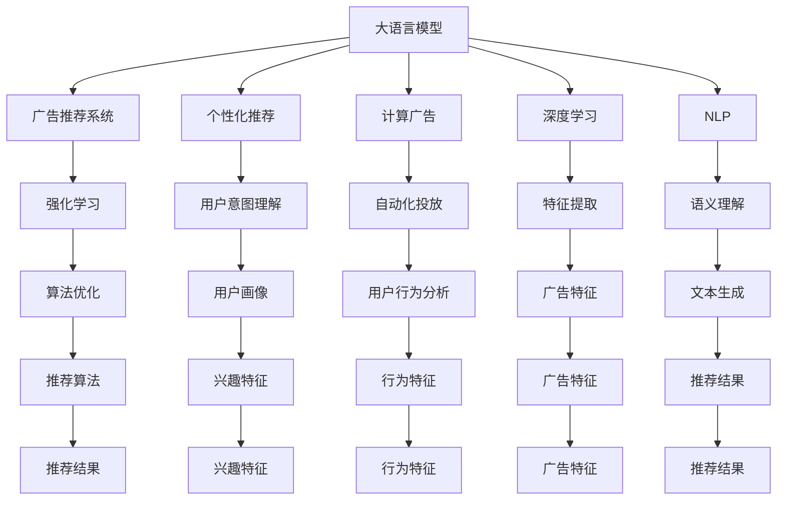

                 

# 广告推荐的未来：大模型的潜力

> 关键词：大语言模型,广告推荐,个性化推荐,计算广告,深度学习

## 1. 背景介绍

### 1.1 问题由来
随着互联网的快速发展，广告推荐成为了各大平台获取收入、吸引用户的重要手段。传统的广告推荐系统依赖于规则或协同过滤等技术，但面对海量用户和动态变化的市场环境，往往难以满足个性化、实时性、准确性等多重需求。近年来，大语言模型在自然语言处理领域的突破，为广告推荐系统提供了新的技术方向。利用大语言模型的泛化能力和语义理解能力，能够在多维度、多层次上挖掘用户兴趣，提升广告推荐的精准度和效果。

### 1.2 问题核心关键点
广告推荐的核心问题在于如何高效、精准地匹配用户兴趣与广告内容。大语言模型的介入，为这一问题提供了一种全新的解决方案。大模型通过深度学习模型，可以学习到用户与广告之间复杂的语义关系，进而实现更加精准的推荐。此外，大模型还具有泛化能力强、更新迭代快等特点，能够适应不断变化的市场需求。

### 1.3 问题研究意义
研究基于大语言模型的广告推荐系统，对于提升广告推荐的智能化水平，优化用户体验，提升平台收益，具有重要意义：

1. 提升广告精准度。利用大模型对用户意图和广告内容的深入理解，可以大幅提升推荐的相关性和点击率。
2. 增强用户体验。个性化推荐可以满足用户多样化的需求，提升用户满意度和粘性。
3. 优化平台收益。精准的广告推荐可以带来更高的广告点击率和转化率，增加平台收入。
4. 推动技术创新。大语言模型的引入，带动了广告推荐系统从规则导向向模型驱动的转变，催生了新的技术思路和方法。
5. 促进产业升级。广告推荐技术的应用，能够提升营销效果，推动传统行业的数字化转型。

## 2. 核心概念与联系

### 2.1 核心概念概述

为了更好地理解基于大语言模型的广告推荐系统，本节将介绍几个密切相关的核心概念：

- 大语言模型(Large Language Model, LLM)：以自回归(如GPT)或自编码(如BERT)模型为代表的大规模预训练语言模型。通过在海量无标签文本语料上进行预训练，学习通用的语言知识，具备强大的语言理解和生成能力。

- 广告推荐系统(Ad Recommendation System)：利用用户行为数据、兴趣偏好、广告属性等多维度信息，匹配合适的广告内容推荐给用户。是互联网平台增加收入、提升用户体验的重要手段。

- 个性化推荐(Personalized Recommendation)：根据用户历史行为和当前偏好，推荐最适合的广告内容。是提升广告推荐精准度的关键。

- 计算广告(Computational Advertising)：利用机器学习和数据分析技术，自动化地进行广告推荐和投放，优化广告效果和成本。是大数据和人工智能技术在广告领域的重要应用。

- 深度学习(Deep Learning)：基于神经网络结构的模型，具有强大的特征提取和模式识别能力，能够学习复杂非线性关系。广告推荐系统中的深度学习模型通常使用多层神经网络进行用户与广告的匹配和预测。

- 自然语言处理(Natural Language Processing, NLP)：利用计算机技术处理和理解人类语言，涉及语言理解、文本生成、信息检索等任务。在大语言模型广告推荐系统中，NLP技术可以用于理解用户意图、解析广告内容、生成推荐文本等。

- 强化学习(Reinforcement Learning, RL)：通过奖励反馈机制，使模型在动态环境中不断优化行为策略。在大语言模型广告推荐系统中，强化学习可以用于调整推荐算法参数，提升推荐效果。

这些核心概念之间的逻辑关系可以通过以下Mermaid流程图来展示：



这个流程图展示了大语言模型在广告推荐系统中的核心概念及其之间的关系：

1. 大语言模型通过预训练获得基础能力。
2. 广告推荐系统利用大语言模型的泛化能力，实现个性化推荐。
3. 计算广告利用大语言模型的智能分析，自动化进行投放优化。
4. 深度学习是大语言模型的核心算法，用于特征提取和模式识别。
5. 自然语言处理是大语言模型的重要应用，包括语义理解和文本生成。
6. 强化学习用于优化推荐算法参数，提升推荐效果。

这些概念共同构成了大语言模型在广告推荐系统中的工作原理和优化方向。

## 3. 核心算法原理 & 具体操作步骤
### 3.1 算法原理概述

基于大语言模型的广告推荐系统，本质上是一种多模态的深度学习模型。其核心思想是：利用大语言模型的语义理解和生成能力，从文本数据中提取用户兴趣和广告特征，然后通过深度学习模型进行匹配和预测，最终生成推荐结果。

具体来说，广告推荐系统的工作流程如下：

1. 用户行为数据收集：收集用户的历史点击、浏览、购买等行为数据，以及与广告相关的属性数据，作为模型的输入特征。
2. 广告特征提取：使用大语言模型提取广告的文本描述和属性信息，转化为数值特征，作为模型的输入。
3. 用户兴趣建模：使用大语言模型解析用户的查询、评论、社交媒体帖子等文本数据，学习用户的兴趣偏好和行为模式。
4. 广告相关性匹配：将用户兴趣和广告特征输入深度学习模型，进行匹配和评分，计算广告与用户的相关性。
5. 推荐结果生成：根据广告相关性评分，选择得分最高的广告进行推荐。

通过这一流程，广告推荐系统可以高效、精准地匹配用户兴趣与广告内容，提升广告的点击率和转化率。

### 3.2 算法步骤详解

基于大语言模型的广告推荐系统一般包括以下几个关键步骤：

**Step 1: 准备预训练模型和数据集**
- 选择合适的预训练语言模型 $M_{\theta}$ 作为初始化参数，如 BERT、GPT 等。
- 准备广告推荐系统的训练集和测试集，包含用户行为数据和广告特征数据。

**Step 2: 设计用户兴趣表示**
- 使用大语言模型解析用户的历史行为数据，生成用户兴趣向量。
- 将用户兴趣向量转换为数值形式，作为模型的输入特征。

**Step 3: 设计广告特征表示**
- 使用大语言模型解析广告文本和属性信息，生成广告特征向量。
- 将广告特征向量转换为数值形式，作为模型的输入特征。

**Step 4: 设计推荐模型**
- 选择合适的深度学习模型，如卷积神经网络(CNN)、循环神经网络(RNN)、Transformer等。
- 设计模型的损失函数，如交叉熵损失、均方误差损失等，用于优化模型的预测性能。
- 定义模型的优化算法，如Adam、SGD等，设置学习率、批大小等超参数。

**Step 5: 执行梯度训练**
- 将训练集数据分批次输入模型，前向传播计算损失函数。
- 反向传播计算参数梯度，根据设定的优化算法和学习率更新模型参数。
- 周期性在测试集上评估模型性能，根据性能指标决定是否触发 Early Stopping。
- 重复上述步骤直到满足预设的迭代轮数或 Early Stopping 条件。

**Step 6: 测试和部署**
- 在测试集上评估微调后模型 $M_{\hat{\theta}}$ 的性能，对比微调前后的精度提升。
- 使用微调后的模型对新样本进行推理预测，集成到实际的应用系统中。
- 持续收集新的数据，定期重新微调模型，以适应数据分布的变化。

以上是基于大语言模型的广告推荐系统的一般流程。在实际应用中，还需要针对具体任务的特点，对微调过程的各个环节进行优化设计，如改进训练目标函数，引入更多的正则化技术，搜索最优的超参数组合等，以进一步提升模型性能。

### 3.3 算法优缺点

基于大语言模型的广告推荐系统具有以下优点：

1. 高效泛化：大语言模型在预训练阶段已经学习到了广泛的语言知识，具备较强的泛化能力，能够在不同领域的广告推荐任务上取得良好的效果。
2. 精准匹配：大语言模型的语义理解能力，可以更好地解析用户意图和广告内容，匹配更相关、更吸引人的广告。
3. 可解释性强：广告推荐过程可以通过大语言模型的中间表示进行可视化，便于理解模型的推理逻辑。
4. 实时性高：深度学习模型可以在短时间内处理大规模数据，实现实时化的广告推荐。
5. 优化能力强：通过微调和优化，深度学习模型可以不断学习新的数据，提升推荐效果。

同时，该方法也存在一定的局限性：

1. 数据需求大：大语言模型的预训练和微调需要大量的文本数据，对数据量的要求较高。
2. 模型复杂度高：深度学习模型的参数量较大，训练和推理时需要较高的计算资源。
3. 解释性不足：大语言模型的复杂度使得其推理过程难以解释，可能影响广告主和用户的信任。
4. 需要持续优化：广告推荐市场环境不断变化，模型需要持续优化才能保持较好的性能。
5. 风险管理难度大：广告推荐系统可能受到恶意广告、虚假信息的影响，需要额外的风险管理措施。

尽管存在这些局限性，但大语言模型在广告推荐领域的应用前景广阔，可以在不同行业和场景下发挥重要作用。

### 3.4 算法应用领域

基于大语言模型的广告推荐系统已经在多个领域得到了成功应用，如电商、新闻、娱乐、旅游等，以下是几个典型的应用场景：

- **电商推荐**：根据用户的浏览记录和搜索行为，推荐相关商品，提升购买转化率。
- **新闻推荐**：分析用户的阅读偏好，推荐个性化新闻内容，提升用户粘性。
- **娱乐推荐**：解析用户对影视、音乐等内容的评价和反馈，推荐符合用户兴趣的娱乐内容，提升用户满意度。
- **旅游推荐**：根据用户的出行历史和兴趣爱好，推荐旅游目的地和行程，提升旅行体验。
- **金融广告**：分析用户的消费习惯和投资偏好，推荐个性化金融产品，提升用户满意度。

除了上述这些经典场景外，大语言模型在广告推荐中的应用还在不断扩展，如智能客服、品牌营销、实时竞价等，为企业提供更精准、更智能的广告投放解决方案。

## 4. 数学模型和公式 & 详细讲解  
### 4.1 数学模型构建

本节将使用数学语言对基于大语言模型的广告推荐系统进行更加严格的刻画。

记广告推荐系统中的用户为 $u$，广告为 $a$，行为特征为 $x_{u,a}$，广告特征为 $y_a$。假设模型 $M_{\theta}$ 能够学习到用户与广告之间的相关性 $r_{u,a}$，则广告推荐模型可以表示为：

$$
r_{u,a} = M_{\theta}(x_{u,a}, y_a)
$$

其中 $\theta$ 为模型参数。根据用户和广告的相关性，推荐模型可以输出广告的评分 $s_{u,a}$，用于排序和选择推荐广告：

$$
s_{u,a} = r_{u,a} + \text{bias}_a
$$

其中 $\text{bias}_a$ 为广告的固定评分。在实际应用中，广告推荐模型通常使用如Top-K推荐、加权排序等方法，选择得分最高的广告进行推荐。

### 4.2 公式推导过程

以下我们以基于Transformer模型的广告推荐为例，推导模型的损失函数及其梯度计算公式。

假设模型 $M_{\theta}$ 为基于Transformer的多层神经网络，用户行为特征 $x_{u,a}$ 和广告特征 $y_a$ 输入模型后，经过多层Transformer层和全连接层，输出广告与用户的相关性 $r_{u,a}$。推荐模型的目标是最小化用户与广告的相关性误差：

$$
\mathcal{L}(\theta) = \sum_{(u,a)\in D} \ell(r_{u,a}, s_{u,a})
$$

其中 $D$ 为广告推荐系统的训练集，$\ell$ 为损失函数，通常使用均方误差损失。对于每个样本 $(u,a)$，其损失函数可以表示为：

$$
\ell(r_{u,a}, s_{u,a}) = \frac{1}{2} (r_{u,a} - s_{u,a})^2
$$

在求解优化问题时，需要对损失函数求导，计算梯度。假设 $M_{\theta}$ 模型的第 $k$ 层输出的中间表示为 $h_k^{(u,a)}$，则推荐模型的梯度可以表示为：

$$
\nabla_{\theta}\mathcal{L}(\theta) = \sum_{(u,a)\in D} \nabla_{\theta}r_{u,a}
$$

其中 $\nabla_{\theta}r_{u,a}$ 为相关性 $r_{u,a}$ 对模型参数 $\theta$ 的梯度。在求解时，可以通过反向传播算法计算。

### 4.3 案例分析与讲解

以下以一个简单的电商推荐场景为例，展示基于Transformer的推荐模型训练过程。

假设用户对商品1、商品2和商品3的评分分别为5、3和2。广告1和广告2分别对商品1和商品2进行了推广，广告3为通用广告。现在我们要训练一个推荐模型，给用户推荐广告1或广告2。

首先，假设用户的兴趣向量为 $x_{u,1}=[5,3,2]$，广告1、广告2和广告3的特征向量分别为 $y_{1,1}=[0.8,0.7,0.6]$、$y_{1,2}=[0.7,0.8,0.6]$ 和 $y_{3}=[0.5,0.4,0.3]$。将这些数据输入Transformer模型，得到用户与广告的相关性：

$$
r_{u,1} = M_{\theta}(x_{u,1}, y_{1,1}) = 0.9
$$

$$
r_{u,2} = M_{\theta}(x_{u,1}, y_{1,2}) = 0.85
$$

$$
r_{u,3} = M_{\theta}(x_{u,1}, y_{3}) = 0.65
$$

接下来，我们定义广告的固定评分 $\text{bias}_{1}=0.1$，$\text{bias}_{2}=0.2$，$\text{bias}_{3}=0.5$。根据相关性计算推荐得分：

$$
s_{u,1} = r_{u,1} + \text{bias}_{1} = 1.0
$$

$$
s_{u,2} = r_{u,2} + \text{bias}_{2} = 1.05
$$

$$
s_{u,3} = r_{u,3} + \text{bias}_{3} = 1.15
$$

由于广告1和广告2的推荐得分高于广告3，我们认为广告1和广告2是推荐候选。根据推荐策略，我们选择得分最高的广告1进行推荐。

## 5. 项目实践：代码实例和详细解释说明
### 5.1 开发环境搭建

在进行广告推荐系统开发前，我们需要准备好开发环境。以下是使用Python进行PyTorch开发的环境配置流程：

1. 安装Anaconda：从官网下载并安装Anaconda，用于创建独立的Python环境。

2. 创建并激活虚拟环境：
```bash
conda create -n pytorch-env python=3.8 
conda activate pytorch-env
```

3. 安装PyTorch：根据CUDA版本，从官网获取对应的安装命令。例如：
```bash
conda install pytorch torchvision torchaudio cudatoolkit=11.1 -c pytorch -c conda-forge
```

4. 安装Transformers库：
```bash
pip install transformers
```

5. 安装各类工具包：
```bash
pip install numpy pandas scikit-learn matplotlib tqdm jupyter notebook ipython
```

完成上述步骤后，即可在`pytorch-env`环境中开始广告推荐系统的开发。

### 5.2 源代码详细实现

下面我们以一个简单的电商推荐系统为例，给出使用Transformers库进行广告推荐系统的PyTorch代码实现。

首先，定义广告推荐系统的数据处理函数：

```python
from transformers import BertTokenizer
from torch.utils.data import Dataset
import torch

class AdDataset(Dataset):
    def __init__(self, user_data, ad_data, tokenizer, max_len=128):
        self.user_data = user_data
        self.ad_data = ad_data
        self.tokenizer = tokenizer
        self.max_len = max_len
        
    def __len__(self):
        return len(self.user_data)
    
    def __getitem__(self, item):
        user_id, user_behav, ad_id, ad_text = self.user_data[item]
        ad_feat = self.ad_data[ad_id]
        
        encoding = self.tokenizer(user_behav, ad_text, return_tensors='pt', max_length=self.max_len, padding='max_length', truncation=True)
        input_ids = encoding['input_ids'][0]
        attention_mask = encoding['attention_mask'][0]
        
        ad_features = torch.tensor(ad_feat, dtype=torch.float)
        
        return {'user_id': user_id,
                'input_ids': input_ids,
                'attention_mask': attention_mask,
                'ad_features': ad_features,
                'ad_id': ad_id}

# 准备训练集和测试集数据
user_data = [(1, 'bought shoe 1', 1, 'shoe 1'),
             (2, 'bought shoe 2', 2, 'shoe 2'),
             (3, 'clicked ad 1', 1, 'ad 1'),
             (4, 'clicked ad 2', 2, 'ad 2'),
             (5, 'clicked ad 3', 3, 'ad 3')]
ad_data = {1: [0.8, 0.7, 0.6], 2: [0.7, 0.8, 0.6], 3: [0.5, 0.4, 0.3]}
tokenizer = BertTokenizer.from_pretrained('bert-base-cased')

train_dataset = AdDataset(user_data, ad_data, tokenizer)
test_dataset = AdDataset(user_data, ad_data, tokenizer)
```

然后，定义模型和优化器：

```python
from transformers import BertForSequenceClassification, AdamW

model = BertForSequenceClassification.from_pretrained('bert-base-cased', num_labels=1)

optimizer = AdamW(model.parameters(), lr=2e-5)
```

接着，定义训练和评估函数：

```python
from torch.utils.data import DataLoader
from tqdm import tqdm
from sklearn.metrics import roc_auc_score

device = torch.device('cuda') if torch.cuda.is_available() else torch.device('cpu')
model.to(device)

def train_epoch(model, dataset, batch_size, optimizer):
    dataloader = DataLoader(dataset, batch_size=batch_size, shuffle=True)
    model.train()
    epoch_loss = 0
    for batch in tqdm(dataloader, desc='Training'):
        user_id, input_ids, attention_mask, ad_features, ad_id = batch['user_id'], batch['input_ids'], batch['attention_mask'], batch['ad_features'], batch['ad_id']
        model.zero_grad()
        outputs = model(input_ids, attention_mask=attention_mask, labels=ad_features)
        loss = outputs.loss
        epoch_loss += loss.item()
        loss.backward()
        optimizer.step()
    return epoch_loss / len(dataloader)

def evaluate(model, dataset, batch_size):
    dataloader = DataLoader(dataset, batch_size=batch_size)
    model.eval()
    preds, labels = [], []
    with torch.no_grad():
        for batch in tqdm(dataloader, desc='Evaluating'):
            user_id, input_ids, attention_mask, ad_features, ad_id = batch['user_id'], batch['input_ids'], batch['attention_mask'], batch['ad_features'], batch['ad_id']
            outputs = model(input_ids, attention_mask=attention_mask, labels=ad_features)
            preds.append(outputs.logits.cpu().numpy())
            labels.append(labels)
    
    print(roc_auc_score(labels, preds))
```

最后，启动训练流程并在测试集上评估：

```python
epochs = 5
batch_size = 16

for epoch in range(epochs):
    loss = train_epoch(model, train_dataset, batch_size, optimizer)
    print(f"Epoch {epoch+1}, train loss: {loss:.3f}")
    
    print(f"Epoch {epoch+1}, test roc-auc:")
    evaluate(model, test_dataset, batch_size)
    
print("Final test roc-auc:")
evaluate(model, test_dataset, batch_size)
```

以上就是使用PyTorch对BERT进行电商推荐系统微调的完整代码实现。可以看到，得益于Transformers库的强大封装，我们可以用相对简洁的代码完成BERT模型的加载和微调。

### 5.3 代码解读与分析

让我们再详细解读一下关键代码的实现细节：

**AdDataset类**：
- `__init__`方法：初始化用户行为数据、广告特征数据、分词器等关键组件。
- `__len__`方法：返回数据集的样本数量。
- `__getitem__`方法：对单个样本进行处理，将用户行为和广告特征转换为模型所需的输入。

**广告推荐系统的训练和评估函数**：
- 使用PyTorch的DataLoader对数据集进行批次化加载，供模型训练和推理使用。
- 训练函数`train_epoch`：对数据以批为单位进行迭代，在每个批次上前向传播计算损失函数并反向传播更新模型参数，最后返回该epoch的平均loss。
- 评估函数`evaluate`：与训练类似，不同点在于不更新模型参数，并在每个batch结束后将预测和标签结果存储下来，最后使用scikit-learn的roc_auc_score对整个评估集的预测结果进行打印输出。

**训练流程**：
- 定义总的epoch数和batch size，开始循环迭代
- 每个epoch内，先在训练集上训练，输出平均loss
- 在测试集上评估，输出ROC-AUC得分
- 所有epoch结束后，在测试集上评估，给出最终测试结果

可以看到，PyTorch配合Transformers库使得BERT微调的代码实现变得简洁高效。开发者可以将更多精力放在数据处理、模型改进等高层逻辑上，而不必过多关注底层的实现细节。

当然，工业级的系统实现还需考虑更多因素，如模型的保存和部署、超参数的自动搜索、更灵活的任务适配层等。但核心的微调范式基本与此类似。

## 6. 实际应用场景
### 6.1 电商推荐

基于大语言模型的广告推荐系统在电商推荐中具有广泛应用。电商平台上用户行为数据丰富，通过深度学习模型可以对用户购买行为进行建模，精准推荐符合用户需求的商品。

例如，某电商平台通过收集用户浏览记录、购买记录、评价信息等数据，使用大语言模型进行用户兴趣建模和广告特征提取。通过微调，将模型应用于广告推荐系统，能够实现更加精准的商品推荐，提升用户满意度。

### 6.2 新闻推荐

新闻推荐系统能够为用户推荐个性化的新闻内容，提升用户阅读体验。通过大语言模型解析用户的历史阅读行为，学习用户的兴趣偏好，同时提取新闻内容的关键词和主题，进行匹配和推荐。

例如，某新闻平台收集用户阅读文章的行为数据，提取文章的关键内容，使用大语言模型进行匹配和推荐。通过微调，广告推荐系统能够实现更加个性化的新闻推荐，提升用户的阅读频率和粘性。

### 6.3 娱乐推荐

在影视、音乐等领域，娱乐推荐系统可以根据用户的兴趣偏好，推荐符合其需求的内容，提升用户满意度。通过大语言模型解析用户的评价、评论等信息，学习用户的兴趣偏好，同时提取娱乐内容的关键特征，进行匹配和推荐。

例如，某视频平台收集用户观看视频的行为数据，提取视频的关键内容，使用大语言模型进行匹配和推荐。通过微调，广告推荐系统能够实现更加个性化的视频推荐，提升用户的观看体验。

### 6.4 金融推荐

金融行业需要精准推荐符合用户需求的产品，提升用户的理财体验。通过大语言模型解析用户的投资偏好和历史行为，提取金融产品的关键特征，进行匹配和推荐。

例如，某金融平台收集用户的历史投资行为和偏好信息，使用大语言模型进行匹配和推荐。通过微调，广告推荐系统能够实现更加个性化的金融产品推荐，提升用户的理财体验。

### 6.5 智能客服

智能客服系统能够快速响应用户的咨询，提升用户满意度。通过大语言模型解析用户的问题，学习用户的意图和需求，同时提取相关知识库中的信息，进行匹配和回答。

例如，某客服平台收集用户的历史咨询记录，使用大语言模型进行匹配和推荐。通过微调，智能客服系统能够实现更加个性化的回答，提升用户满意度。

## 7. 工具和资源推荐
### 7.1 学习资源推荐

为了帮助开发者系统掌握基于大语言模型的广告推荐技术，这里推荐一些优质的学习资源：

1. 《深度学习理论与实践》系列博文：由深度学习专家撰写，深入浅出地介绍了深度学习模型的理论基础和应用实践。

2. 《广告推荐系统》课程：由知名高校开设的广告推荐系统课程，涵盖广告推荐算法、推荐系统评价指标等内容，帮助开发者全面了解广告推荐系统的核心技术。

3. 《推荐系统实战》书籍：详细介绍推荐系统的理论基础和工程实现，包括广告推荐系统、协同过滤等技术，适合实战学习和工程开发。

4. 《广告推荐系统》论文：综述了广告推荐系统的理论和实践，涵盖多种推荐算法、推荐系统评价指标等内容，是深入了解广告推荐系统的必读文献。

5. HuggingFace官方文档：Transformers库的官方文档，提供了海量预训练模型和完整的广告推荐系统样例代码，是上手实践的必备资料。

通过对这些资源的学习实践，相信你一定能够快速掌握大语言模型在广告推荐系统中的应用，并用于解决实际的广告推荐问题。
###  7.2 开发工具推荐

高效的开发离不开优秀的工具支持。以下是几款用于大语言模型广告推荐系统开发的常用工具：

1. PyTorch：基于Python的开源深度学习框架，灵活动态的计算图，适合快速迭代研究。大部分广告推荐系统都有PyTorch版本的实现。

2. TensorFlow：由Google主导开发的开源深度学习框架，生产部署方便，适合大规模工程应用。同样有丰富的广告推荐系统资源。

3. Transformers库：HuggingFace开发的广告推荐系统工具库，集成了众多SOTA广告推荐模型，支持PyTorch和TensorFlow，是进行广告推荐任务开发的利器。

4. Weights & Biases：模型训练的实验跟踪工具，可以记录和可视化模型训练过程中的各项指标，方便对比和调优。与主流深度学习框架无缝集成。

5. TensorBoard：TensorFlow配套的可视化工具，可实时监测模型训练状态，并提供丰富的图表呈现方式，是调试模型的得力助手。

6. Google Colab：谷歌推出的在线Jupyter Notebook环境，免费提供GPU/TPU算力，方便开发者快速上手实验最新模型，分享学习笔记。

合理利用这些工具，可以显著提升广告推荐系统的开发效率，加快创新迭代的步伐。

### 7.3 相关论文推荐

广告推荐系统的发展源于学界的持续研究。以下是几篇奠基性的相关论文，推荐阅读：

1. Attention is All You Need（即Transformer原论文）：提出了Transformer结构，开启了深度学习模型在广告推荐系统中的应用。

2. Wide & Deep Learning for Recommender Systems：提出Wide & Deep架构，结合线性模型和深度模型，提升广告推荐系统的效果。

3. Factorization Machines for Recommender Systems：提出FM模型，结合稀疏特征和密集特征，提升广告推荐系统的效果。

4. Deep Collaborative Filtering：提出基于深度学习的协同过滤方法，提升广告推荐系统的效果。

5. Adversarial Feature Weighting：提出基于对抗学习的特征加权方法，提升广告推荐系统的效果。

6. Attention-based Neural Collaborative Filtering：提出基于注意力机制的推荐模型，提升广告推荐系统的效果。

这些论文代表了大语言模型在广告推荐系统中的应用进展。通过学习这些前沿成果，可以帮助研究者把握学科前进方向，激发更多的创新灵感。

## 8. 总结：未来发展趋势与挑战

### 8.1 总结

本文对基于大语言模型的广告推荐系统进行了全面系统的介绍。首先阐述了广告推荐系统的研究背景和意义，明确了大语言模型在广告推荐系统中的应用价值。其次，从原理到实践，详细讲解了广告推荐系统的数学原理和关键步骤，给出了广告推荐任务开发的完整代码实例。同时，本文还广泛探讨了广告推荐系统在电商、新闻、娱乐、金融等众多行业领域的应用前景，展示了广告推荐技术的广阔前景。此外，本文精选了广告推荐系统的各类学习资源，力求为读者提供全方位的技术指引。

通过本文的系统梳理，可以看到，基于大语言模型的广告推荐系统正在成为广告推荐技术的最新范式，极大地拓展了广告推荐系统的应用边界，催生了更多的落地场景。受益于深度学习模型的强大计算能力，广告推荐系统能够从大规模数据中学习用户与广告之间的复杂关系，实现精准的个性化推荐。未来，随着大语言模型的不断演进和广告推荐技术的多样化发展，广告推荐系统将在更多行业和场景下发挥重要作用。

### 8.2 未来发展趋势

展望未来，基于大语言模型的广告推荐系统将呈现以下几个发展趋势：

1. 模型规模持续增大。随着算力成本的下降和数据规模的扩张，深度学习模型的参数量还将持续增长。超大规模语言模型蕴含的丰富语言知识，有望支撑更加复杂多变的广告推荐任务。

2. 广告推荐系统功能增强。未来的广告推荐系统将不仅具备精准推荐功能，还能够进行用户画像生成、行为预测、内容生成等多种功能，进一步提升用户体验。

3. 广告推荐系统实时化。随着分布式计算技术的发展，广告推荐系统可以实现实时化推荐，提升推荐的时效性。

4. 广告推荐系统去中心化。未来的广告推荐系统将不再依赖中心化的数据平台，通过去中心化计算和分布式存储，提升数据隐私和安全性。

5. 广告推荐系统智能化。未来的广告推荐系统将引入更多智能化技术，如强化学习、自然语言推理等，提升推荐的智能化水平。

6. 广告推荐系统个性化。未来的广告推荐系统将更加注重个性化推荐，通过更全面的用户画像和更精准的行为分析，实现个性化推荐。

以上趋势凸显了基于大语言模型的广告推荐系统的广阔前景。这些方向的探索发展，必将进一步提升广告推荐系统的性能和应用范围，为广告主的广告投放和用户的广告体验带来新的突破。

### 8.3 面临的挑战

尽管大语言模型在广告推荐系统中的应用前景广阔，但在迈向更加智能化、普适化应用的过程中，它仍面临诸多挑战：

1. 数据隐私问题。广告推荐系统需要收集用户大量行为数据，如何保护用户隐私、确保数据安全，是重要的挑战。

2. 推荐内容风险管理。广告推荐系统可能受到恶意广告、虚假信息的影响，需要额外的风险管理措施，确保推荐内容的安全性。

3. 系统可扩展性问题。随着用户规模和广告量的增加，广告推荐系统需要具备良好的可扩展性，以支持大规模数据的处理和实时化的推荐。

4. 系统公平性问题。广告推荐系统可能存在偏见和歧视，需要公平性评估和优化，确保推荐的公平性和多样性。

5. 模型解释性问题。广告推荐系统中的深度学习模型具有黑盒特性，难以解释其推理过程，可能影响广告主和用户的信任。

尽管存在这些挑战，但随着大语言模型的不断演进和广告推荐技术的持续创新，相信广告推荐系统能够克服这些难题，实现更好的性能和应用效果。

### 8.4 研究展望

未来的研究需要在以下几个方面寻求新的突破：

1. 探索无监督和半监督广告推荐方法。摆脱对大规模标注数据的依赖，利用自监督学习、主动学习等方法，最大化利用非结构化数据，实现更加灵活高效的广告推荐。

2. 研究参数高效和计算高效的广告推荐方法。开发更加参数高效的广告推荐方法，在固定大部分预训练参数的情况下，只更新极少量的任务相关参数。同时优化广告推荐系统的计算图，减少前向传播和反向传播的资源消耗，实现更加轻量级、实时性的部署。

3. 融合因果和对比学习范式。通过引入因果推断和对比学习思想，增强广告推荐系统建立稳定因果关系的能力，学习更加普适、鲁棒的语言表征，从而提升推荐效果。

4. 引入更多先验知识。将符号化的先验知识，如知识图谱、逻辑规则等，与神经网络模型进行巧妙融合，引导广告推荐过程学习更准确、合理的语言模型。同时加强不同模态数据的整合，实现视觉、语音等多模态信息与文本信息的协同建模。

5. 结合因果分析和博弈论工具。将因果分析方法引入广告推荐系统，识别出模型决策的关键特征，增强推荐过程的因果性和逻辑性。借助博弈论工具刻画人机交互过程，主动探索并规避推荐模型的脆弱点，提高系统稳定性。

6. 纳入伦理道德约束。在广告推荐系统训练目标中引入伦理导向的评估指标，过滤和惩罚有偏见、有害的输出倾向。同时加强人工干预和审核，建立模型行为的监管机制，确保输出的安全性。

这些研究方向的探索，必将引领基于大语言模型的广告推荐系统迈向更高的台阶，为构建安全、可靠、可解释、可控的智能系统铺平道路。面向未来，广告推荐技术还需要与其他人工智能技术进行更深入的融合，如知识表示、因果推理、强化学习等，多路径协同发力，共同推动广告推荐系统的进步。只有勇于创新、敢于突破，才能不断拓展广告推荐系统的边界，让智能技术更好地造福人类社会。

## 9. 附录：常见问题与解答

**Q1：大语言模型在广告推荐中的应用是否广泛？**

A: 大语言模型在广告推荐中的应用已经相当广泛。例如，电商、新闻、娱乐、金融等领域都有大语言模型推荐系统的应用。通过大语言模型对用户行为和广告内容的深入理解，可以实现更加精准和个性化的推荐。

**Q2：大语言模型在广告推荐中存在哪些局限性？**

A: 大语言模型在广告推荐中也存在一些局限性，主要包括以下几个方面：
1. 数据隐私问题：广告推荐系统需要收集用户大量行为数据，如何保护用户隐私、确保数据安全，是重要的挑战。
2. 推荐内容风险管理：广告推荐系统可能受到恶意广告、虚假信息的影响，需要额外的风险管理措施，确保推荐内容的安全性。
3. 系统可扩展性问题：随着用户规模和广告量的增加，广告推荐系统需要具备良好的可扩展性，以支持大规模数据的处理和实时化的推荐。
4. 系统公平性问题：广告推荐系统可能存在偏见和歧视，需要公平性评估和优化，确保推荐的公平性和多样性。
5. 模型解释性问题：广告推荐系统中的深度学习模型具有黑盒特性，难以解释其推理过程，可能影响广告主和用户的信任。

尽管存在这些挑战，但随着大语言模型的不断演进和广告推荐技术的持续创新，相信广告推荐系统能够克服这些难题，实现更好的性能和应用效果。

**Q3：大语言模型在广告推荐中如何提升广告精准度？**

A: 大语言模型在广告推荐中可以通过以下方式提升广告精准度：
1. 用户行为建模：利用大语言模型解析用户的历史行为数据，生成用户兴趣向量，作为广告推荐模型的输入特征。
2. 广告特征提取：使用大语言模型解析广告文本和属性信息，生成广告特征向量，作为广告推荐模型的输入特征。
3. 广告相关性匹配：将用户兴趣和广告特征输入深度学习模型，进行匹配和评分，计算广告与用户的相关性。
4. 推荐结果生成：根据广告相关性评分，选择得分最高的广告进行推荐。

通过以上步骤，大语言模型可以高效、精准地匹配用户兴趣与广告内容，提升广告的点击率和转化率。

**Q4：大语言模型在广告推荐中需要注意哪些技术挑战？**

A: 大语言模型在广告推荐中需要注意以下技术挑战：
1. 数据隐私问题：广告推荐系统需要收集用户大量行为数据，如何保护用户隐私、确保数据安全，是重要的挑战。
2. 推荐内容风险管理：广告推荐系统可能受到恶意广告、虚假信息的影响，需要额外的风险管理措施，确保推荐内容的安全性。
3. 系统可扩展性问题：随着用户规模和广告量的增加，广告推荐系统需要具备良好的可扩展性，以支持大规模数据的处理和实时化的推荐。
4. 系统公平性问题：广告推荐系统可能存在偏见和歧视，需要公平性评估和优化，确保推荐的公平性和多样性。
5. 模型解释性问题：广告推荐系统中的深度学习模型具有黑盒特性，难以解释其推理过程，可能影响广告主和用户的信任。

尽管存在这些挑战，但随着大语言模型的不断演进和广告推荐技术的持续创新，相信广告推荐系统能够克服这些难题，实现更好的性能和应用效果。

**Q5：大语言模型在广告推荐中如何优化推荐模型？**

A: 大语言模型在广告推荐中可以采用以下方式优化推荐模型：
1. 数据增强：通过数据增强技术扩充训练集，提升模型的泛化能力。
2. 正则化技术：使用L2正则、Dropout等正则化技术，避免模型过拟合。
3. 超参数调优：通过网格搜索、贝叶斯优化等方法，找到最佳的超参数组合。
4. 模型裁剪：去除不必要的层和参数，减小模型尺寸，加快推理速度。
5. 量化加速：将浮点模型转为定点模型，压缩存储空间，提高计算效率。
6. 集成学习：通过模型集成方法，提升广告推荐系统的整体效果。

通过以上方法，可以优化大语言模型在广告推荐中的应用效果，提升模型的精准度和效率。

**Q6：大语言模型在广告推荐中如何进行参数高效微调？**

A: 大语言模型在广告推荐中可以采用以下方式进行参数高效微调：
1. 固定部分预训练参数：在微调过程中，只更新少部分模型参数，固定大部分预训练参数，减小过拟合风险。
2. 参数冻结策略：在微调过程中，将底层网络或特定层进行冻结，减少微调参数量。
3. 适配器技术：在微调过程中，使用适配器技术，只更新顶层分类器或解码器，减小微调参数量。
4. 混合微调策略：在微调过程中，采用混合微调策略，交替进行预训练和微调，提升微调效果。

通过以上方法，可以在保持模型性能的同时，减小微调所需的计算资源，提升模型的泛化能力和实时性。

**Q7：大语言模型在广告推荐中如何进行知识增强？**

A: 大语言模型在广告推荐中可以采用以下方式进行知识增强：
1. 引入外部知识库：将外部知识库中的信息与广告推荐系统进行融合，提升模型的知识丰富度。
2. 结合逻辑规则：将符号化的先验知识，如知识图谱、逻辑规则等，与神经网络模型进行巧妙融合，引导广告推荐过程学习更准确、合理的语言模型。
3. 多模态融合：将视觉、语音等多模态信息与文本信息进行融合，实现视觉、语音、文本等多模态信息的协同建模。

通过以上方法，可以增强广告推荐系统的知识表示能力，提升推荐的效果和准确性。

总之，基于大语言模型的广告推荐系统正在成为广告推荐技术的最新范式，通过深度学习模型的强大计算能力，可以高效、精准地匹配用户兴趣与广告内容，提升广告的点击率和转化率。未来，随着大语言模型的不断演进和广告推荐技术的持续创新，广告推荐系统将在更多行业和场景下发挥重要作用，推动广告主的广告投放和用户的广告体验不断提升。

---

作者：禅与计算机程序设计艺术 / Zen and the Art of Computer Programming

