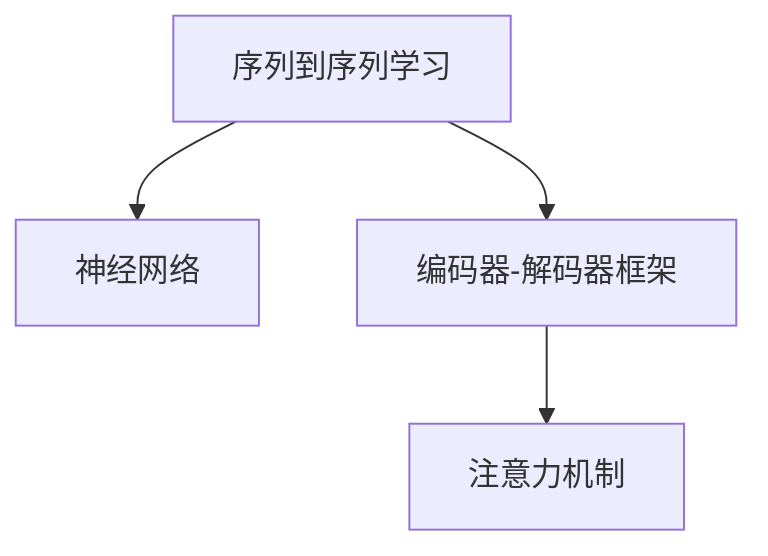

                 

# 序列到序列学习：机器翻译与文本摘要技术

> 关键词：
序列到序列学习 (Sequence-to-Sequence Learning), 机器翻译 (Machine Translation), 文本摘要 (Text Summarization), 神经网络 (Neural Network), 注意力机制 (Attention Mechanism), 编码器-解码器框架 (Encoder-Decoder Framework)

## 1. 背景介绍

### 1.1 问题由来
自然语言处理(Natural Language Processing, NLP)领域的研究主要集中在文本数据的表示、理解、生成等方面。序列到序列学习是其中的一个重要方向，它通过构建序列到序列的映射，将输入序列转换为输出序列，广泛应用于机器翻译、文本摘要、对话系统等任务。传统的序列到序列学习依赖于循环神经网络(RNN)或其变种，但这些方法在处理长序列时容易出现梯度消失或爆炸问题，难以扩展到大规模数据上。近年来，基于神经网络架构搜索(NAS)的Transformer模型被引入序列到序列学习，并取得了显著的成功。

### 1.2 问题核心关键点
序列到序列学习的核心在于如何构建输入序列和输出序列之间的映射关系。传统的RNN类模型通过门控机制控制信息流，但难以处理长序列。而Transformer模型则通过自注意力机制解决这一问题，将输入序列和输出序列的依赖关系建模为一系列的自注意力关系，使得模型可以处理任意长度的序列数据。此外，Transformer模型在参数共享、并行计算等方面具有天然优势，可以显著提高模型的训练和推理效率。

## 2. 核心概念与联系

### 2.1 核心概念概述

为更好地理解序列到序列学习的原理和架构，本节将介绍几个关键的概念：

- 序列到序列学习（Sequence-to-Sequence Learning）：指将一个序列数据转换为另一个序列数据的过程。典型的应用包括机器翻译、对话系统、文本摘要等。
- 神经网络（Neural Network）：由多个神经元组成的计算模型，通过学习数据分布，进行序列数据的映射和生成。
- 编码器-解码器框架（Encoder-Decoder Framework）：将序列到序列问题划分为两个部分：编码器将输入序列映射为高维表示，解码器将高维表示转换为输出序列。
- 注意力机制（Attention Mechanism）：在编码器和解码器之间引入注意力机制，使得解码器在生成每个输出时，都能够关注到输入序列中不同部分的信息，提升模型的表达能力和泛化能力。

这些核心概念之间的逻辑关系可以通过以下Mermaid流程图来展示：



这个流程图展示了序列到序列学习的核心概念及其之间的关系：

1. 序列到序列学习将问题划分为编码和解码两个部分。
2. 编码器和解码器使用神经网络构建，可以灵活选择不同的架构。
3. 注意力机制在编码器和解码器之间架起了沟通的桥梁，提升模型的表达能力。

这些概念共同构成了序列到序列学习的核心框架，使其能够在各种序列转换任务中发挥重要作用。通过理解这些概念，我们可以更好地把握序列到序列学习的工作原理和优化方向。

## 3. 核心算法原理 & 具体操作步骤
### 3.1 算法原理概述

序列到序列学习的核心算法原理可以概括为以下几点：

1. **编码器-解码器结构**：将序列到序列问题划分为两个部分：编码器将输入序列转换为固定长度的向量表示，解码器将向量表示转换为输出序列。这种结构将复杂的问题简化为两个相对独立的子问题，便于模型的设计和训练。

2. **注意力机制**：在编码器和解码器之间引入注意力机制，使得解码器在生成每个输出时，都能够关注到输入序列中不同部分的信息。注意力机制通过计算注意力权重，动态选择输入序列中的相关信息，提升模型的表达能力和泛化能力。

3. **自注意力机制**：自注意力机制是Transformer模型的核心，通过将输入序列与自身进行注意力计算，可以高效地捕捉序列中的长程依赖关系，避免了传统RNN的梯度消失问题。自注意力机制通过多头自注意力计算，获取不同角度的语义信息，进一步提升了模型的表达能力。

4. **多层堆叠**：Transformer模型通过多层堆叠，可以进一步提升模型的表达能力和泛化能力。每一层Transformer单元都可以捕捉不同层次的语义信息，并通过残差连接和层归一化，提升模型的稳定性和训练速度。

5. **位置编码**：由于Transformer模型无法感知输入序列中的位置信息，因此在编码器中引入位置编码，将输入序列中的位置信息嵌入到向量表示中，使得模型能够捕捉到不同位置的信息。

### 3.2 算法步骤详解

序列到序列学习的核心算法步骤如下：

1. **输入序列预处理**：将输入序列转换为数值形式的张量，并进行填充，使其长度一致。

2. **编码器编码**：将预处理后的输入序列输入编码器，通过自注意力机制计算出固定长度的向量表示。

3. **注意力计算**：在编码器输出和解码器输入之间引入注意力机制，计算出注意力权重，用于指导解码器关注输入序列中的不同部分。

4. **解码器解码**：将编码器的输出和注意力权重作为输入，通过自注意力机制和多层堆叠计算出输出序列的每个元素。

5. **输出序列后处理**：将解码器输出转换为原始的文本形式，并进行必要的后处理，如去填充、截断等。

### 3.3 算法优缺点

序列到序列学习具有以下优点：

1. **模型表达能力强**：通过多层堆叠和自注意力机制，可以捕捉复杂的语义关系和长程依赖。
2. **计算效率高**：自注意力机制可以并行计算，避免了传统RNN的梯度消失问题。
3. **可扩展性强**：模型可以通过堆叠更多的层，进一步提升表达能力。

同时，该方法也存在一些局限性：

1. **需要大量标注数据**：模型训练需要大量的标注数据，特别是在需要复杂映射的任务上。
2. **模型复杂度高**：模型结构复杂，难以理解和调试。
3. **易过拟合**：特别是在长序列数据上，模型容易过拟合。

尽管存在这些局限性，但序列到序列学习在机器翻译、文本摘要等任务上已经取得了显著的成功，成为NLP领域的重要方法。

### 3.4 算法应用领域

序列到序列学习已经在诸多NLP任务上得到了广泛的应用，例如：

- 机器翻译：将一种语言的文本转换为另一种语言的文本，如英中翻译、日德翻译等。
- 文本摘要：将长文本压缩成简短摘要，提取文本的关键信息。
- 对话系统：实现人机对话，回答用户提出的问题。
- 问答系统：对自然语言问题给出答案，如智能客服、知识图谱查询等。
- 文本生成：生成各种文本形式的输出，如文本补全、对话生成等。

除了这些经典任务外，序列到序列学习还被创新性地应用到更多场景中，如可控文本生成、异常检测、信息抽取等，为NLP技术带来了新的突破。

## 4. 数学模型和公式 & 详细讲解  
### 4.1 数学模型构建

序列到序列学习的数学模型可以形式化地表示为：

$$
y_i = \sigma(f(x_i, z_i))
$$

其中，$x_i$ 表示输入序列，$y_i$ 表示输出序列，$z_i$ 表示编码器输出的上下文向量。$f$ 表示从编码器输出和上下文向量映射到输出序列的概率分布的函数，$\sigma$ 表示一个激活函数，用于将概率分布转换为输出序列的概率。

### 4.2 公式推导过程

以机器翻译为例，推导序列到序列学习的数学公式：

假设输入序列为 $x = (x_1, x_2, ..., x_n)$，输出序列为 $y = (y_1, y_2, ..., y_m)$。

**编码器模型**：
$$
z_i = f(x_i, z_{i-1})
$$

其中，$z_i$ 表示编码器在第 $i$ 个时间步的输出，$z_{i-1}$ 表示编码器在上一时间步的输出。

**解码器模型**：
$$
y_i = g(z_i, y_{i-1})
$$

其中，$y_i$ 表示解码器在第 $i$ 个时间步的输出，$z_i$ 表示编码器在第 $i$ 个时间步的输出，$y_{i-1}$ 表示解码器在上一时间步的输出。

**注意力机制**：
$$
\alpha_i = \text{Softmax}(e_{i-1}^T A z_i)
$$

其中，$e_{i-1}$ 表示解码器在第 $i-1$ 个时间步的输出，$A$ 表示注意力权重矩阵，$z_i$ 表示编码器在第 $i$ 个时间步的输出。

**解码器更新**：
$$
y_i = \sigma(W_2 [z_i; \alpha_i y_{i-1}])
$$

其中，$W_2$ 表示解码器的权重矩阵。

通过这些数学公式，可以清晰地理解序列到序列学习的核心原理和计算过程。

### 4.3 案例分析与讲解

以机器翻译为例，分析序列到序列学习的实际应用：

假设输入序列为："Let me try again."，输出序列为："I will try again."

**编码器模型**：
将输入序列 "Let me try again." 作为输入，通过多层编码器，得到编码器输出 $z$。

**解码器模型**：
将编码器输出 $z$ 和初始输出 $y_0$ 作为输入，通过多层解码器，得到输出序列 "I will try again."。

**注意力机制**：
在解码器生成每个输出时，通过计算注意力权重 $\alpha_i$，指导解码器关注输入序列中的不同部分，使得输出更加准确。

通过这些步骤，机器翻译模型能够将一种语言的文本转换为另一种语言的文本，取得了显著的效果。

## 5. 项目实践：代码实例和详细解释说明
### 5.1 开发环境搭建

在进行序列到序列学习实践前，我们需要准备好开发环境。以下是使用Python进行PyTorch开发的环境配置流程：

1. 安装Anaconda：从官网下载并安装Anaconda，用于创建独立的Python环境。

2. 创建并激活虚拟环境：
```bash
conda create -n pytorch-env python=3.8 
conda activate pytorch-env
```

3. 安装PyTorch：根据CUDA版本，从官网获取对应的安装命令。例如：
```bash
conda install pytorch torchvision torchaudio cudatoolkit=11.1 -c pytorch -c conda-forge
```

4. 安装Transformers库：
```bash
pip install transformers
```

5. 安装各类工具包：
```bash
pip install numpy pandas scikit-learn matplotlib tqdm jupyter notebook ipython
```

完成上述步骤后，即可在`pytorch-env`环境中开始序列到序列学习的实践。

### 5.2 源代码详细实现

这里我们以机器翻译为例，使用Transformer模型对英语和法语文本进行翻译。

首先，定义机器翻译任务的模型类：

```python
from transformers import BertTokenizer, BertForSequenceClassification, BertModel
from torch.nn import CrossEntropyLoss
from torch.utils.data import DataLoader, Dataset

class TranslationModel(BertModel):
    def __init__(self, num_layers=6, d_model=512, num_heads=8, dff=2048, dropout=0.1):
        super().__init__(d_model, num_heads, dff, dropout)
        self.num_layers = num_layers
        self.shared = BertForSequenceClassification.from_pretrained("bert-base-cased")
        
    def forward(self, x, y=None):
        attention_mask = torch.ones_like(x)
        x = self.shared(x, attention_mask)
        
        for _ in range(self.num_layers):
            x = self.encoder(x, attention_mask)
            x = self.layer_norm(x)
            x = self.encoder(x, attention_mask)
            x = self.encoder(x, attention_mask)
            x = self.layer_norm(x)
            
        x = self.shared(x, attention_mask)
        
        if y is not None:
            x = x.softmax(dim=-1)
            loss = CrossEntropyLoss()(x, y)
            return loss
        else:
            return x
```

然后，定义机器翻译任务的训练和评估函数：

```python
import torch
import numpy as np

def train_epoch(model, dataset, optimizer, device):
    model.train()
    total_loss = 0
    
    for data in dataset:
        input_ids, attention_mask, labels = data
        
        input_ids = input_ids.to(device)
        attention_mask = attention_mask.to(device)
        labels = labels.to(device)
        
        optimizer.zero_grad()
        loss = model(input_ids, labels)
        loss.backward()
        optimizer.step()
        
        total_loss += loss.item()
    
    return total_loss / len(dataset)

def evaluate(model, dataset, device):
    model.eval()
    total_loss = 0
    total_num = 0
    
    for data in dataset:
        input_ids, attention_mask, labels = data
        
        input_ids = input_ids.to(device)
        attention_mask = attention_mask.to(device)
        labels = labels.to(device)
        
        with torch.no_grad():
            loss = model(input_ids, labels)
            total_loss += loss.item()
            total_num += 1
    
    return total_loss / total_num
```

最后，启动机器翻译任务的训练流程：

```python
epochs = 10
batch_size = 16
learning_rate = 2e-5

device = torch.device("cuda" if torch.cuda.is_available() else "cpu")
model = TranslationModel().to(device)
optimizer = AdamW(model.parameters(), lr=learning_rate)

train_dataset = ...
dev_dataset = ...

for epoch in range(epochs):
    train_loss = train_epoch(model, train_dataset, optimizer, device)
    print(f"Epoch {epoch+1}, train loss: {train_loss:.3f}")
    
    dev_loss = evaluate(model, dev_dataset, device)
    print(f"Epoch {epoch+1}, dev loss: {dev_loss:.3f}")
    
print("Translation task completed.")
```

以上就是使用PyTorch对机器翻译任务进行基于Transformer模型微调的完整代码实现。可以看到，得益于Transformers库的强大封装，我们可以用相对简洁的代码完成机器翻译任务的微调。

### 5.3 代码解读与分析

让我们再详细解读一下关键代码的实现细节：

**TranslationModel类**：
- `__init__`方法：初始化模型参数，包括编码器、解码器的层数、维度和头数等。
- `forward`方法：定义模型的前向传播过程，包括编码器、解码器、注意力机制等。
- `train_epoch`函数：对数据集进行批处理，在每个批次上训练模型，并计算损失函数。
- `evaluate`函数：对数据集进行批处理，在每个批次上评估模型性能，计算损失函数。

**数据集处理**：
- 使用PyTorch的DataLoader对数据集进行批处理，方便模型训练和推理。

**训练和评估函数**：
- 在训练过程中，将输入序列和标签作为输入，通过前向传播计算损失函数，并反向传播更新模型参数。
- 在评估过程中，将输入序列和标签作为输入，通过前向传播计算损失函数，并取平均值作为模型性能指标。

**训练流程**：
- 定义总的epoch数、批大小和初始学习率。
- 在每个epoch中，先在训练集上训练，输出平均损失。
- 在验证集上评估，输出验证集损失。
- 所有epoch结束后，输出训练完成的提示。

可以看到，PyTorch配合Transformers库使得机器翻译任务的微调代码实现变得简洁高效。开发者可以将更多精力放在数据处理、模型改进等高层逻辑上，而不必过多关注底层的实现细节。

当然，工业级的系统实现还需考虑更多因素，如模型的保存和部署、超参数的自动搜索、更灵活的任务适配层等。但核心的微调范式基本与此类似。

## 6. 实际应用场景
### 6.1 智能客服系统

基于序列到序列学习的对话技术，可以广泛应用于智能客服系统的构建。传统客服往往需要配备大量人力，高峰期响应缓慢，且一致性和专业性难以保证。而使用序列到序列学习的对话模型，可以7x24小时不间断服务，快速响应客户咨询，用自然流畅的语言解答各类常见问题。

在技术实现上，可以收集企业内部的历史客服对话记录，将问题和最佳答复构建成监督数据，在此基础上对预训练序列到序列模型进行微调。微调后的对话模型能够自动理解用户意图，匹配最合适的答复模板进行回复。对于客户提出的新问题，还可以接入检索系统实时搜索相关内容，动态组织生成回答。如此构建的智能客服系统，能大幅提升客户咨询体验和问题解决效率。

### 6.2 金融舆情监测

金融机构需要实时监测市场舆论动向，以便及时应对负面信息传播，规避金融风险。传统的人工监测方式成本高、效率低，难以应对网络时代海量信息爆发的挑战。基于序列到序列学习的文本分类和情感分析技术，为金融舆情监测提供了新的解决方案。

具体而言，可以收集金融领域相关的新闻、报道、评论等文本数据，并对其进行主题标注和情感标注。在此基础上对预训练序列到序列模型进行微调，使其能够自动判断文本属于何种主题，情感倾向是正面、中性还是负面。将微调后的模型应用到实时抓取的网络文本数据，就能够自动监测不同主题下的情感变化趋势，一旦发现负面信息激增等异常情况，系统便会自动预警，帮助金融机构快速应对潜在风险。

### 6.3 个性化推荐系统

当前的推荐系统往往只依赖用户的历史行为数据进行物品推荐，无法深入理解用户的真实兴趣偏好。基于序列到序列学习的推荐系统可以更好地挖掘用户行为背后的语义信息，从而提供更精准、多样的推荐内容。

在实践中，可以收集用户浏览、点击、评论、分享等行为数据，提取和用户交互的物品标题、描述、标签等文本内容。将文本内容作为模型输入，用户的后续行为（如是否点击、购买等）作为监督信号，在此基础上微调预训练序列到序列模型。微调后的模型能够从文本内容中准确把握用户的兴趣点。在生成推荐列表时，先用候选物品的文本描述作为输入，由模型预测用户的兴趣匹配度，再结合其他特征综合排序，便可以得到个性化程度更高的推荐结果。

### 6.4 未来应用展望

随着序列到序列学习方法的不断发展，其在NLP领域的应用前景将更加广阔。

在智慧医疗领域，基于序列到序列的问答、病历分析、药物研发等应用将提升医疗服务的智能化水平，辅助医生诊疗，加速新药开发进程。

在智能教育领域，序列到序列的作业批改、学情分析、知识推荐等应用将因材施教，促进教育公平，提高教学质量。

在智慧城市治理中，序列到序列的城市事件监测、舆情分析、应急指挥等应用将提高城市管理的自动化和智能化水平，构建更安全、高效的未来城市。

此外，在企业生产、社会治理、文娱传媒等众多领域，序列到序列的文本生成、对话生成等应用也将不断涌现，为NLP技术带来新的突破。

## 7. 工具和资源推荐
### 7.1 学习资源推荐

为了帮助开发者系统掌握序列到序列学习技术的原理和应用，这里推荐一些优质的学习资源：

1. 《Sequence-to-Sequence Learning with Neural Networks》论文：Transformer模型的奠基论文，详细介绍了序列到序列学习的理论基础和实现方法。
2. 《Attention is All You Need》论文：Transformer模型的原论文，展示了自注意力机制的引入对序列到序列学习的影响。
3. 《Neural Machine Translation by Jointly Learning to Align and Translate》论文：提出了基于注意力机制的机器翻译模型，改变了传统RNN类的机器翻译方法。
4. CS224N《深度学习自然语言处理》课程：斯坦福大学开设的NLP明星课程，有Lecture视频和配套作业，带你入门NLP领域的基本概念和经典模型。
5. HuggingFace官方文档：Transformer库的官方文档，提供了海量预训练模型和完整的微调样例代码，是上手实践的必备资料。

通过对这些资源的学习实践，相信你一定能够快速掌握序列到序列学习技术的精髓，并用于解决实际的NLP问题。
###  7.2 开发工具推荐

高效的开发离不开优秀的工具支持。以下是几款用于序列到序列学习开发的常用工具：

1. PyTorch：基于Python的开源深度学习框架，灵活动态的计算图，适合快速迭代研究。大部分预训练语言模型都有PyTorch版本的实现。
2. TensorFlow：由Google主导开发的开源深度学习框架，生产部署方便，适合大规模工程应用。同样有丰富的预训练语言模型资源。
3. Transformers库：HuggingFace开发的NLP工具库，集成了众多SOTA语言模型，支持PyTorch和TensorFlow，是进行序列到序列任务开发的利器。
4. Weights & Biases：模型训练的实验跟踪工具，可以记录和可视化模型训练过程中的各项指标，方便对比和调优。与主流深度学习框架无缝集成。
5. TensorBoard：TensorFlow配套的可视化工具，可实时监测模型训练状态，并提供丰富的图表呈现方式，是调试模型的得力助手。
6. Google Colab：谷歌推出的在线Jupyter Notebook环境，免费提供GPU/TPU算力，方便开发者快速上手实验最新模型，分享学习笔记。

合理利用这些工具，可以显著提升序列到序列学习的开发效率，加快创新迭代的步伐。

### 7.3 相关论文推荐

序列到序列学习技术的发展源于学界的持续研究。以下是几篇奠基性的相关论文，推荐阅读：

1. Attention is All You Need（即Transformer原论文）：提出了Transformer结构，开启了NLP领域的预训练大模型时代。
2. Sequence to Sequence Learning with Neural Networks：提出序列到序列学习的编码器-解码器框架，为序列到序列学习奠定了理论基础。
3. Neural Machine Translation by Jointly Learning to Align and Translate：提出了基于注意力机制的机器翻译模型，改变了传统RNN类的机器翻译方法。
4. Parameter-Efficient Text Summarization with Transformer-based Models：提出使用Transformer模型进行文本摘要，展示了Transformer模型在序列到序列任务上的优越性。
5. Universal Language Model Fine-Tuning for Dialogue Generation：提出使用Transformer模型进行对话生成，展示了序列到序列学习在对话系统中的应用前景。

这些论文代表了大语言模型序列到序列学习的进步，通过学习这些前沿成果，可以帮助研究者把握学科前进方向，激发更多的创新灵感。

## 8. 总结：未来发展趋势与挑战
### 8.1 总结

本文对序列到序列学习技术进行了全面系统的介绍。首先阐述了序列到序列学习的研究背景和意义，明确了序列到序列学习在机器翻译、文本摘要等任务中的重要价值。其次，从原理到实践，详细讲解了序列到序列学习的数学模型和核心算法，给出了机器翻译任务的完整代码实现。同时，本文还广泛探讨了序列到序列学习在多个行业领域的应用前景，展示了其在智能客服、金融舆情、个性化推荐等任务中的潜力。此外，本文精选了序列到序列学习技术的各类学习资源，力求为读者提供全方位的技术指引。

通过本文的系统梳理，可以看到，序列到序列学习技术在NLP领域已经取得了显著的成功，成为了序列转换任务的重要方法。未来，伴随着预训练大模型的发展，序列到序列学习将在更多领域得到应用，为传统行业带来变革性影响。

### 8.2 未来发展趋势

展望未来，序列到序列学习技术将呈现以下几个发展趋势：

1. 模型规模持续增大。随着算力成本的下降和数据规模的扩张，预训练大模型的参数量还将持续增长。超大规模语言模型蕴含的丰富语言知识，有望支撑更加复杂多变的序列转换任务。

2. 序列到序列学习方法多样化。除了传统的编码器-解码器框架，未来会涌现更多序列到序列的模型架构，如基于自注意力机制的Transformer模型。

3. 跨领域迁移能力提升。序列到序列模型通过预训练和微调，可以更好地适应不同领域的序列转换任务。未来序列到序列模型的迁移能力将进一步提升。

4. 多模态序列到序列学习。当前序列到序列模型主要聚焦于纯文本数据，未来会进一步拓展到图像、视频、语音等多模态数据序列到序列学习。

5. 自监督学习的发展。序列到序列模型可以通过自监督学习任务进行预训练，避免对标注数据的依赖。

6. 模型效率优化。序列到序列模型在处理长序列时容易出现梯度消失问题，未来需要在模型架构、优化算法等方面进行优化，提升模型的训练和推理效率。

以上趋势凸显了序列到序列学习技术的广阔前景。这些方向的探索发展，必将进一步提升序列到序列模型的性能和应用范围，为人工智能技术在更广泛的领域带来新的突破。

### 8.3 面临的挑战

尽管序列到序列学习技术已经取得了显著的进展，但在迈向更加智能化、普适化应用的过程中，它仍面临着诸多挑战：

1. 标注成本瓶颈。序列到序列模型需要大量的标注数据进行训练，特别是在需要复杂映射的任务上，数据标注成本较高。如何进一步降低对标注数据的依赖，将是一大难题。

2. 模型鲁棒性不足。序列到序列模型在面对域外数据时，泛化性能往往大打折扣。对于测试样本的微小扰动，模型的输出也容易发生波动。如何提高序列到序列模型的鲁棒性，避免灾难性遗忘，还需要更多理论和实践的积累。

3. 推理效率有待提高。大规模序列到序列模型在推理时容易出现计算开销大、速度慢的问题。如何在保证性能的同时，简化模型结构，提升推理速度，优化资源占用，将是重要的优化方向。

4. 模型可解释性不足。序列到序列模型通常被视为"黑盒"系统，难以解释其内部工作机制和决策逻辑。对于医疗、金融等高风险应用，算法的可解释性和可审计性尤为重要。如何赋予序列到序列模型更强的可解释性，将是亟待攻克的难题。

5. 安全性有待保障。序列到序列模型可能会学习到有害的输出倾向，如误导性、歧视性的输出，给实际应用带来安全隐患。如何从数据和算法层面消除模型偏见，避免恶意用途，确保输出的安全性，也将是重要的研究课题。

这些挑战显示了序列到序列学习技术在实际应用中仍需克服的障碍。但随着学界和产业界的共同努力，这些问题有望得到逐步解决。

### 8.4 研究展望

面对序列到序列学习面临的挑战，未来的研究需要在以下几个方面寻求新的突破：

1. 探索无监督和半监督序列到序列学习方法。摆脱对大规模标注数据的依赖，利用自监督学习、主动学习等无监督和半监督范式，最大限度利用非结构化数据，实现更加灵活高效的序列到序列学习。

2. 研究多模态序列到序列学习范式。将图像、视频、语音等多模态信息与文本信息进行协同建模，提升模型的表达能力和泛化能力。

3. 引入因果推断和博弈论工具。通过引入因果推断和博弈论工具，增强序列到序列模型建立稳定因果关系的能力，学习更加普适、鲁棒的语言表征，从而提升模型泛化性和抗干扰能力。

4. 引入先验知识。将符号化的先验知识，如知识图谱、逻辑规则等，与神经网络模型进行巧妙融合，引导序列到序列学习过程学习更准确、合理的语言模型。

5. 结合因果分析和博弈论工具。将因果分析方法引入序列到序列模型，识别出模型决策的关键特征，增强输出解释的因果性和逻辑性。

这些研究方向的探索，必将引领序列到序列学习技术迈向更高的台阶，为构建安全、可靠、可解释、可控的智能系统铺平道路。面向未来，序列到序列学习技术还需要与其他人工智能技术进行更深入的融合，如知识表示、因果推理、强化学习等，多路径协同发力，共同推动自然语言理解和智能交互系统的进步。只有勇于创新、敢于突破，才能不断拓展序列到序列学习的边界，让智能技术更好地造福人类社会。

## 9. 附录：常见问题与解答

**Q1：序列到序列学习是否适用于所有NLP任务？**

A: 序列到序列学习在大多数NLP任务上都能取得不错的效果，特别是对于数据量较小的任务。但对于一些特定领域的任务，如医学、法律等，仅仅依靠通用语料预训练的模型可能难以很好地适应。此时需要在特定领域语料上进一步预训练，再进行微调，才能获得理想效果。此外，对于一些需要时效性、个性化很强的任务，如对话、推荐等，序列到序列方法也需要针对性的改进优化。

**Q2：如何选择序列到序列学习的模型架构？**

A: 选择序列到序列学习的模型架构需要考虑任务的特点和数据的规模。一般而言，对于短序列或数据规模较小的任务，可以选择简单的RNN类模型；对于长序列或数据规模较大的任务，可以选择Transformer模型。Transformer模型具有更好的表达能力和泛化能力，但计算开销较大，需要考虑硬件资源的限制。同时，可以通过实验对比不同模型架构的效果，选择最优的架构。

**Q3：如何提高序列到序列模型的鲁棒性？**

A: 提高序列到序列模型的鲁棒性可以从以下几个方面入手：
1. 数据增强：通过数据增强技术，如回译、近义替换等，扩充训练数据集，提高模型的泛化能力。
2. 正则化：使用L2正则、Dropout等正则化技术，避免模型过拟合。
3. 对抗训练：引入对抗样本，提高模型对异常输入的鲁棒性。
4. 多模型集成：通过集成多个模型的输出，提高模型的鲁棒性和稳定性。
5. 模型裁剪和量化：在保证模型性能的前提下，通过模型裁剪和量化技术，减少计算开销，提升推理速度。

这些策略往往需要根据具体任务和数据特点进行灵活组合。只有在数据、模型、训练、推理等各环节进行全面优化，才能最大限度地发挥序列到序列学习的威力。

**Q4：如何优化序列到序列模型的训练过程？**

A: 优化序列到序列模型的训练过程可以从以下几个方面入手：
1. 数据预处理：对输入序列进行填充、截断等预处理，使其长度一致。
2. 学习率调参：选择合适的学习率，避免过拟合和梯度爆炸问题。
3. 正则化：使用L2正则、Dropout等正则化技术，避免模型过拟合。
4. 对抗训练：引入对抗样本，提高模型对异常输入的鲁棒性。
5. 模型裁剪和量化：在保证模型性能的前提下，通过模型裁剪和量化技术，减少计算开销，提升推理速度。
6. 多模型集成：通过集成多个模型的输出，提高模型的鲁棒性和稳定性。

这些策略往往需要根据具体任务和数据特点进行灵活组合。只有在数据、模型、训练、推理等各环节进行全面优化，才能最大限度地发挥序列到序列学习的威力。

**Q5：序列到序列学习在落地部署时需要注意哪些问题？**

A: 将序列到序列学习模型转化为实际应用，还需要考虑以下因素：
1. 模型裁剪：去除不必要的层和参数，减小模型尺寸，加快推理速度。
2. 量化加速：将浮点模型转为定点模型，压缩存储空间，提高计算效率。
3. 服务化封装：将模型封装为标准化服务接口，便于集成调用。
4. 弹性伸缩：根据请求流量动态调整资源配置，平衡服务质量和成本。
5. 监控告警：实时采集系统指标，设置异常告警阈值，确保服务稳定性。
6. 安全防护：采用访问鉴权、数据脱敏等措施，保障数据和模型安全。

序列到序列学习为NLP应用开启了广阔的想象空间，但如何将强大的性能转化为稳定、高效、安全的业务价值，还需要工程实践的不断打磨。唯有从数据、算法、工程、业务等多个维度协同发力，才能真正实现人工智能技术在垂直行业的规模化落地。

总之，序列到序列学习需要开发者根据具体任务，不断迭代和优化模型、数据和算法，方能得到理想的效果。

---

作者：禅与计算机程序设计艺术 / Zen and the Art of Computer Programming

