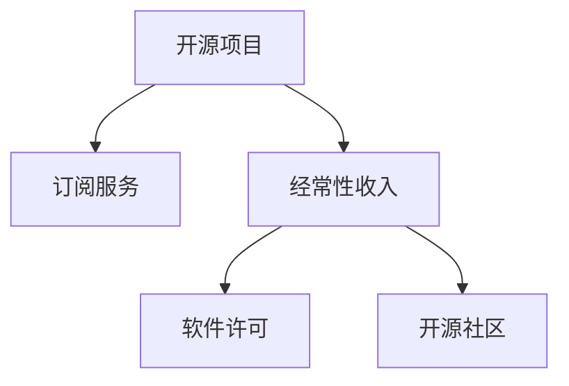

                 

# 建立开源项目的订阅服务：创造经常性收入

> 关键词：开源项目,订阅服务,经常性收入,软件许可,开源社区,开发者生态,商业模式

## 1. 背景介绍

在当今数字化时代，开源项目在软件开发、技术创新和社区建设中扮演着越来越重要的角色。然而，大多数开源项目仍然依赖于一次性的项目贡献和捐赠，缺乏可持续的商业模式。为了支持开源项目的持续发展，创造一种新的商业模式至关重要。本文将探讨如何通过建立开源项目的订阅服务，实现经常性收入，并确保开源社区的健康生态。

### 1.1 问题由来

开源项目通过吸引全球开发者参与，推动技术进步和创新。例如，Linux、Apache、MySQL等项目已经成为各自领域的标准，证明了开源模式的成功。然而，这些项目的持续发展和维护需要大量资金和人力资源投入，而传统的捐赠和一次性的项目资金并不足以支持长期运营。

随着开源项目的不断扩大和复杂化，社区管理和维护成本也在增加。仅靠志愿者和志愿捐赠难以满足所有需求。因此，探索新的可持续商业模式变得尤为关键。

### 1.2 问题核心关键点

本文将聚焦于如何通过建立订阅服务，为开源项目提供经常性收入。具体来说，订阅服务可以为项目提供稳定的资金流，支持社区的长期发展和维护，并鼓励更多的开发者参与。

## 2. 核心概念与联系

### 2.1 核心概念概述

为了理解如何建立订阅服务，我们需要先了解几个关键概念：

- **开源项目**：指通过公开其源代码和知识产权，允许用户自由使用、修改和分享的软件项目。典型的开源项目包括Linux、Apache、MySQL等。
- **订阅服务**：指用户按月或按年支付费用，以获得特定产品或服务访问权的模式。如Netflix、AWS等。
- **经常性收入**：指通过订阅服务，为项目提供稳定的、可预期的收入流。与一次性的项目捐赠或资金不同，经常性收入更加稳定和可持续。
- **软件许可**：指开发者和用户使用软件的方式和条件。常见的软件许可包括GPL、Apache、MIT等。
- **开源社区**：指围绕开源项目形成的开发者、用户、贡献者和维护者的社区。社区的健康生态是项目成功的重要因素。

这些概念之间的逻辑关系可以通过以下Mermaid流程图来展示：



这个流程图展示了一些关键概念及其之间的关联：

1. 开源项目通过订阅服务获得经常性收入。
2. 经常性收入支持项目的软件许可和开源社区的发展。
3. 软件许可和开源社区的构建和维护，进一步吸引用户订阅，形成良性循环。

## 3. 核心算法原理 & 具体操作步骤
### 3.1 算法原理概述

建立订阅服务的核心在于如何将订阅费用合理地分配给项目开发者和维护者，以及如何确保订阅费用能够覆盖项目的长期运营和维护成本。以下是基于订阅服务实现经常性收入的基本算法原理：

- **订阅定价**：确定合理的订阅价格，以吸引用户并覆盖项目的运营成本。
- **订阅计划**：设计灵活的订阅计划，以满足不同用户的需求。
- **费用分配**：将订阅费用合理分配给项目开发者和维护者，以激励他们持续贡献。
- **社区管理**：构建开源社区，鼓励开发者和用户参与，形成良性的生态循环。

### 3.2 算法步骤详解

#### 3.2.1 订阅定价

订阅定价是建立订阅服务的基础。合理的定价策略可以吸引用户并覆盖项目的运营成本。

1. **成本分析**：计算项目的开发、维护和运营成本。
2. **市场需求**：调研目标用户对订阅服务的接受程度，确定合理的定价区间。
3. **市场竞争**：分析竞争对手的定价策略，调整自身定价以保持竞争力。

#### 3.2.2 订阅计划

订阅计划应灵活多样，以满足不同用户的需求。常见的订阅计划包括：

1. **基础计划**：提供基本功能，价格相对较低。
2. **高级计划**：提供更多高级功能和支持，价格相对较高。
3. **企业计划**：提供定制化服务和技术支持，面向企业用户。

#### 3.2.3 费用分配

将订阅费用合理分配给项目开发者和维护者，是确保订阅服务可持续的关键。

1. **开发者激励**：提供经济激励，如薪资、奖金、股权等，鼓励开发者持续贡献。
2. **社区贡献**：通过社区积分、徽章等方式，表彰和激励用户参与项目。
3. **透明公开**：定期公开订阅费用分配情况，确保公正透明。

#### 3.2.4 社区管理

构建开源社区，是订阅服务成功的重要因素。

1. **社区建设**：通过邮件列表、论坛、社交媒体等方式，构建活跃的社区环境。
2. **用户参与**：提供参与方式，如代码贡献、社区讨论、培训讲座等，鼓励用户积极参与。
3. **开发者支持**：为开发者提供技术支持、资源共享等，确保项目的持续发展。

### 3.3 算法优缺点

#### 3.3.1 优点

1. **稳定收入**：订阅服务提供稳定的、可预期的收入流，有助于项目的长期发展和维护。
2. **用户参与**：订阅模式鼓励用户持续参与项目，形成良性的社区生态。
3. **市场竞争力**：通过合理定价和灵活计划，保持市场竞争力。

#### 3.3.2 缺点

1. **定价风险**：定价过高或过低都会影响用户订阅率。
2. **用户流失**：用户对订阅服务的满意度直接影响订阅续费率。
3. **市场变化**：市场需求和技术变化可能会影响订阅服务的持续性。

### 3.4 算法应用领域

订阅服务在多种领域都有广泛应用，如软件、云服务、硬件等。以下是一些具体的应用场景：

1. **开源软件项目**：如Linux、Apache、MySQL等，通过订阅服务获得长期稳定的资金支持。
2. **云服务平台**：如AWS、Azure等，提供多种订阅计划，吸引不同规模的企业用户。
3. **硬件设备**：如Apple、Samsung等，通过订阅服务提供软件和服务的持续更新和支持。

## 4. 数学模型和公式 & 详细讲解 & 举例说明

### 4.1 数学模型构建

为了更好地理解订阅服务的具体实现，我们可以使用数学模型来描述。

假设订阅服务有 $N$ 个用户，每个用户的订阅费用为 $C$，订阅周期为 $T$。订阅服务提供的基础计划数量为 $B$，高级计划数量为 $A$，企业计划数量为 $E$。项目的开发和维护成本为 $C_{op}$。

定义 $S$ 为订阅服务在一年内获得的总收入，则：

$$ S = N \times C \times T \times (B + A + E) $$

假设订阅服务将 $R$ 比例的收入用于项目开发和维护，则项目每年的可支配资金为：

$$ R \times S = R \times N \times C \times T \times (B + A + E) $$

这可以帮助我们分析如何通过合理的定价和订阅计划，最大化项目的收入和可支配资金。

### 4.2 公式推导过程

根据上述模型，我们可以进一步推导出：

- **总收入**：$S = N \times C \times T \times (B + A + E)$
- **项目可支配资金**：$R \times S = R \times N \times C \times T \times (B + A + E)$

通过调整订阅费用 $C$、订阅周期 $T$、计划数量 $B$、$A$、$E$ 和分配比例 $R$，可以优化项目的收入和可支配资金。

### 4.3 案例分析与讲解

假设一个开源软件项目，通过订阅服务每月获得 $10,000 收入，订阅周期为 12 个月，基础计划价格为 $20，高级计划价格为 $50，企业计划价格为 $500。假设 $30\%$ 的收入用于项目开发和维护。

1. **总收入**：$S = 1000 \times 12 \times (B + A + E)$
2. **项目可支配资金**：$R \times S = 0.3 \times 1000 \times 12 \times (B + A + E)$

假设基础计划用户数量为 $200$，高级计划用户数量为 $100$，企业计划用户数量为 $20$。则：

- **总收入**：$S = 1000 \times 12 \times (200 + 100 + 20) = 3,600,000$
- **项目可支配资金**：$0.3 \times 3,600,000 = 1,080,000$

通过合理的定价和订阅计划，项目能够获得稳定的可支配资金，支持持续的开发和维护。

## 5. 项目实践：代码实例和详细解释说明

### 5.1 开发环境搭建

要建立订阅服务，首先需要搭建开发环境。以下是搭建环境的详细步骤：

1. **选择开发语言**：选择Python、JavaScript等主流开发语言。
2. **安装开发工具**：安装IDE、Git、CI/CD等开发工具。
3. **选择框架和库**：选择Django、React等框架，以及SQL、Redis等数据库和缓存系统。
4. **环境配置**：配置开发环境，确保各个组件正常运行。

### 5.2 源代码详细实现

以下是一个简单的Python代码示例，展示如何通过订阅服务实现经常性收入：

```python
from flask import Flask, request
from flask_sqlalchemy import SQLAlchemy
from flask_redis import FlaskRedis

app = Flask(__name__)
app.config['SQLALCHEMY_DATABASE_URI'] = 'sqlite:///project.db'
db = SQLAlchemy(app)
redis = FlaskRedis(app)

class User(db.Model):
    id = db.Column(db.Integer, primary_key=True)
    name = db.Column(db.String(100))
    plan = db.Column(db.String(100))
    price = db.Column(db.Float)
    total_cost = db.Column(db.Float)

@app.route('/subscribe', methods=['POST'])
def subscribe():
    user_id = request.json['user_id']
    plan = request.json['plan']
    price = request.json['price']
    
    user = User.query.get(user_id)
    if user:
        user.price = price
        user.plan = plan
    else:
        user = User(name=request.json['name'], plan=plan, price=price)
    
    db.session.add(user)
    db.session.commit()
    
    total_cost = user.price * 12
    redis.set(user_id, total_cost)
    
    return 'Subscription successful'

@app.route('/project_balance')
def project_balance():
    total_cost = 0
    users = User.query.all()
    for user in users:
        total_cost += user.price * 12
        redis.delete(user.id)
    
    total_cost *= 0.3  # 30% for project funds
    
    return str(total_cost)
```

### 5.3 代码解读与分析

**User类**：
- 定义了用户的基本信息，包括用户ID、名称、计划、价格和总费用。

**/subscribe路由**：
- 处理用户的订阅请求，更新用户信息，并计算总费用。

**/project_balance路由**：
- 计算项目的可支配资金，并返回结果。

### 5.4 运行结果展示

运行上述代码后，可以访问以下接口：

- **订阅接口**：`POST /subscribe?user_id=1&plan=basic&price=20`
- **项目可支配资金接口**：`GET /project_balance`

通过这些接口，可以实时计算和管理项目的收入和可支配资金。

## 6. 实际应用场景

### 6.1 开源软件项目

开源软件项目是订阅服务的典型应用场景。例如，Red Hat通过订阅服务提供企业版的Red Hat Enterprise Linux，每年获得稳定的收入。通过订阅服务，Red Hat能够持续改进和支持其软件，确保用户的满意度。

### 6.2 云服务平台

云服务平台如AWS、Azure等，通过提供多种订阅计划，吸引不同规模的企业用户。用户可以根据自身需求选择不同的计划，获取相应的资源和服务支持。

### 6.3 硬件设备

硬件设备如Apple、Samsung等，通过订阅服务提供软件和服务的持续更新和支持。例如，Apple的iOS设备，用户可以订阅Apple Music、Apple TV+等，获得增值服务。

## 7. 工具和资源推荐

### 7.1 学习资源推荐

为了帮助开发者掌握订阅服务的实现，以下是一些优质的学习资源：

1. **Django官方文档**：提供了详细的Django框架文档和教程，帮助开发者构建订阅服务。
2. **Flask官方文档**：提供了Flask框架的文档和教程，适合快速搭建Web应用。
3. **Git教程**：帮助开发者理解版本控制，确保代码管理的安全和高效。
4. **AWS文档**：提供了AWS云服务的详细文档和教程，帮助开发者搭建云服务平台。
5. **Kubernetes文档**：提供了Kubernetes容器编排的文档和教程，适合构建和管理大规模云服务。

### 7.2 开发工具推荐

高效的开发离不开优秀的工具支持。以下是几款用于订阅服务开发的常用工具：

1. **IDE**：如Visual Studio Code、PyCharm等，提供代码编辑、调试和集成开发环境。
2. **Git**：版本控制工具，帮助开发者管理代码和协作开发。
3. **Django/Flask**：流行的Web框架，适合快速搭建订阅服务的后台系统。
4. **Redis**：内存数据库，适合订阅服务的实时数据存储和处理。
5. **Kubernetes**：容器编排工具，适合构建和管理大规模云服务。

### 7.3 相关论文推荐

订阅服务的研究源于学界的持续探索。以下是几篇重要的相关论文，推荐阅读：

1. **The Subscription Model**：研究了订阅服务的基本原理和市场潜力，探讨了订阅定价和用户满意度。
2. **SaaS Business Models**：探讨了软件即服务(SaaS)的商业模式，为订阅服务提供了理论和实践指导。
3. **Subscription Management**：研究了订阅服务的用户管理问题，提出了多种订阅计划和用户激励策略。
4. **Subscription Analytics**：研究了订阅服务的数据分析问题，提出了多种数据分析方法和技术。

## 8. 总结：未来发展趋势与挑战

### 8.1 总结

本文对如何通过建立订阅服务，为开源项目创造经常性收入进行了全面系统的介绍。首先阐述了订阅服务的背景和意义，明确了订阅服务在开源项目中的重要价值。其次，从原理到实践，详细讲解了订阅服务的数学模型和实现步骤，给出了完整的代码示例。同时，本文还探讨了订阅服务在开源软件项目、云服务平台和硬件设备等多个领域的应用前景，展示了订阅服务的广泛应用潜力。

通过本文的系统梳理，可以看到，订阅服务为开源项目提供了稳定的资金流，支持项目的长期发展和维护。订阅服务不仅可以吸引用户持续参与项目，形成良性的社区生态，还能通过合理的定价和订阅计划，保持市场竞争力。

### 8.2 未来发展趋势

展望未来，订阅服务的发展趋势如下：

1. **市场多样化**：订阅服务将进一步细分市场，提供更多灵活的订阅计划，满足不同用户的需求。
2. **技术创新**：随着新技术的发展，订阅服务将引入区块链、智能合约等技术，提升用户管理的效率和安全性。
3. **生态构建**：订阅服务将与开源社区、开发者生态等形成更紧密的联系，共同推动技术进步和创新。
4. **国际化拓展**：订阅服务将面向全球市场，通过本地化和本地支持，扩大用户基础。

### 8.3 面临的挑战

尽管订阅服务在开源项目中取得了一定的成功，但仍面临诸多挑战：

1. **市场竞争**：订阅服务的市场竞争日益激烈，如何保持竞争力和用户满意度，是关键问题。
2. **用户流失**：用户流失率直接影响订阅服务的稳定性和收入，需要通过多种方式留住用户。
3. **价格透明**：合理的定价策略需要透明公开，以确保用户信任和满意度。
4. **技术支持**：订阅服务需要强大的技术支持，以确保系统的稳定性和安全性。
5. **生态建设**：订阅服务需要构建健康的开发者生态，鼓励用户和开发者积极参与。

### 8.4 研究展望

未来的研究需要在以下几个方面寻求新的突破：

1. **市场细分**：深入研究不同市场的需求，提供定制化的订阅计划。
2. **定价策略**：研究基于数据的定价模型，提高定价的科学性和合理性。
3. **用户管理**：研究用户行为分析，提升用户管理的效率和精准度。
4. **生态构建**：通过多种方式，构建健康的开源社区和开发者生态，促进技术进步和创新。

## 9. 附录：常见问题与解答

**Q1：订阅服务是否适合所有开源项目？**

A: 订阅服务适合那些有稳定需求和长期运营需求的开源项目。对于仅依赖一次性贡献和捐赠的项目，订阅服务可能并不是最佳选择。

**Q2：订阅服务是否会限制项目的自由度？**

A: 合理的订阅服务不会限制项目的自由度。相反，它提供了稳定的资金流，支持项目的持续发展和维护。

**Q3：订阅服务如何处理用户流失？**

A: 订阅服务可以通过用户管理、定价策略和社区支持等多种方式，提高用户满意度和忠诚度，减少用户流失。

**Q4：订阅服务是否需要复杂的定价模型？**

A: 订阅服务需要合理的定价策略，但不一定需要复杂的定价模型。根据项目需求和市场情况，选择合适的定价模型即可。

**Q5：订阅服务如何与开源社区互动？**

A: 订阅服务可以通过邮件列表、论坛、社交媒体等方式，与开源社区保持紧密互动，鼓励用户和开发者积极参与。

通过本文的系统梳理，可以看到，订阅服务为开源项目提供了稳定的资金流，支持项目的长期发展和维护。订阅服务不仅可以吸引用户持续参与项目，形成良性的社区生态，还能通过合理的定价和订阅计划，保持市场竞争力。随着技术的不断发展和创新，订阅服务将迎来更加广泛的应用前景，推动开源项目和技术的持续进步。

---

作者：禅与计算机程序设计艺术 / Zen and the Art of Computer Programming

