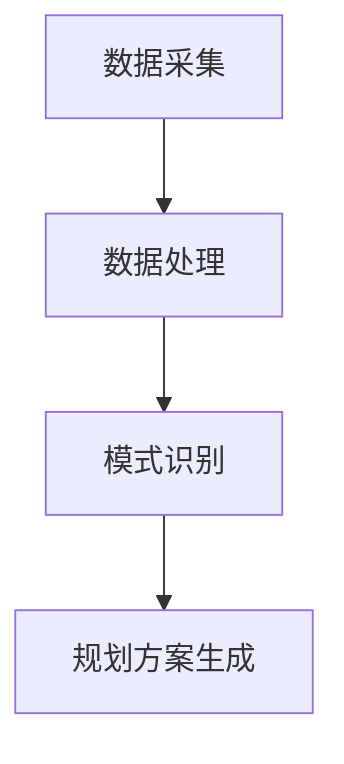
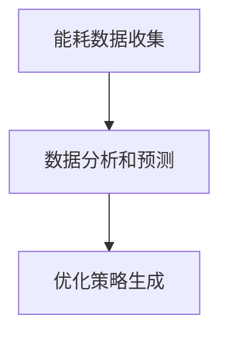
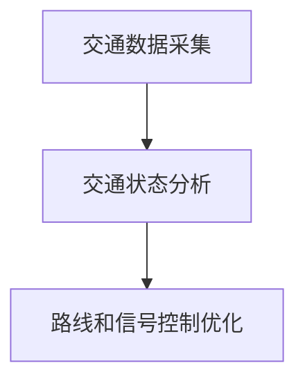

                 

### 文章标题

**AI与人类计算：打造可持续发展的城市基础设施**

关键词：人工智能、城市基础设施、可持续发展、效率优化

摘要：本文将探讨如何利用人工智能技术，结合人类计算能力，共同构建一个可持续发展的城市基础设施。通过深入分析AI在城市规划、能源管理、交通优化等领域的应用，本文旨在为读者提供一个全面、易懂的指南，以实现城市资源的合理分配与高效利用。

### 1. 背景介绍

城市基础设施是现代社会的基石，涵盖了供水、供电、交通、通信等多个方面。然而，随着城市化进程的加速，城市基础设施面临诸多挑战，如资源短缺、环境污染、交通拥堵等。传统的方法难以满足日益增长的需求，这就需要引入新兴技术，尤其是人工智能（AI）。

AI具有强大的数据分析和预测能力，能够在城市规划、能源管理、交通优化等领域发挥关键作用。同时，人类计算能力在创意思维、决策制定等方面具有独特的优势。将AI与人类计算相结合，能够形成一个协同发展的生态系统，共同推动城市基础设施的可持续发展。

### 2. 核心概念与联系

#### 2.1 人工智能在城市规划中的应用

人工智能在城市规划中的应用主要体现在数据分析和预测方面。通过收集和分析大量的地理、人口、经济等数据，AI能够帮助城市规划师预测城市发展趋势，优化资源配置，降低环境污染。

**架构原理：**
- **数据采集**：利用传感器、遥感卫星等手段收集城市各种数据。
- **数据处理**：对数据进行清洗、归一化和预处理，以便于后续分析。
- **模式识别**：利用机器学习和深度学习算法，识别城市发展趋势和潜在问题。
- **规划方案生成**：基于分析结果，提出优化方案，如交通路线调整、绿地规划等。

**Mermaid 流程图：**


#### 2.2 能源管理中的AI应用

能源管理是城市基础设施的重要组成部分。AI能够通过优化能源分配和利用，提高能源效率，降低碳排放。

**架构原理：**
- **能耗数据收集**：通过智能电表、传感器等设备，实时收集建筑物、交通设施等的能耗数据。
- **数据分析和预测**：利用机器学习算法，分析能耗数据，预测未来能源需求。
- **优化策略生成**：根据预测结果，生成优化策略，如调整电力分配、启用可再生能源等。

**Mermaid 流程图：**


#### 2.3 交通优化中的AI应用

交通拥堵是城市发展中的一个普遍问题。AI能够通过实时交通数据分析和预测，优化交通路线和信号控制，提高交通效率。

**架构原理：**
- **交通数据采集**：通过交通监控设备、GPS定位等手段，实时收集交通数据。
- **交通状态分析**：利用机器学习算法，分析交通数据，识别交通拥堵原因。
- **路线和信号控制优化**：根据分析结果，调整交通路线和信号灯控制策略。

**Mermaid 流程图：**


### 3. 核心算法原理 & 具体操作步骤

#### 3.1 人工智能在城市规划中的应用

**算法原理：**
- **聚类分析**：通过聚类算法，将城市数据分为不同的区域，以便于后续分析。
- **回归分析**：通过回归算法，预测城市发展趋势和人口增长。

**具体操作步骤：**
1. 数据采集：收集城市地理、人口、经济等数据。
2. 数据预处理：对数据进行清洗、归一化处理。
3. 聚类分析：使用K-means等聚类算法，将城市数据分为不同的区域。
4. 回归分析：使用线性回归等算法，预测城市发展趋势和人口增长。
5. 规划方案生成：根据分析结果，生成优化方案。

#### 3.2 能源管理中的AI应用

**算法原理：**
- **时间序列分析**：通过时间序列分析，预测未来能源需求。
- **优化算法**：使用优化算法，如遗传算法，寻找最优的能源分配策略。

**具体操作步骤：**
1. 数据采集：收集建筑物、交通设施等的能耗数据。
2. 数据预处理：对数据进行清洗、归一化处理。
3. 时间序列分析：使用ARIMA等时间序列分析算法，预测未来能源需求。
4. 优化算法：使用遗传算法等优化算法，寻找最优的能源分配策略。
5. 优化策略生成：根据优化结果，生成优化策略。

#### 3.3 交通优化中的AI应用

**算法原理：**
- **路径规划**：使用A*算法等路径规划算法，找到最优的行驶路线。
- **信号控制优化**：使用优化算法，如遗传算法，优化信号灯控制策略。

**具体操作步骤：**
1. 数据采集：收集交通数据，如车辆流量、道路状况等。
2. 数据预处理：对数据进行清洗、归一化处理。
3. 路径规划：使用A*算法等路径规划算法，找到最优的行驶路线。
4. 信号控制优化：使用遗传算法等优化算法，优化信号灯控制策略。
5. 交通效率提升：根据优化结果，提升交通效率。

### 4. 数学模型和公式 & 详细讲解 & 举例说明

#### 4.1 城市规划中的数学模型

**回归模型：**
$$
y = \beta_0 + \beta_1x_1 + \beta_2x_2 + ... + \beta_nx_n
$$

其中，$y$ 是预测值，$x_1, x_2, ..., x_n$ 是输入特征，$\beta_0, \beta_1, \beta_2, ..., \beta_n$ 是回归系数。

**举例说明：**
假设我们使用回归模型预测城市人口增长，输入特征可以是城市的GDP、人口密度等。通过训练模型，我们可以得到回归系数，从而预测未来的人口增长。

#### 4.2 能源管理中的数学模型

**时间序列模型：**
$$
y_t = \phi_0 + \phi_1y_{t-1} + \phi_2y_{t-2} + ... + \phi_ky_{t-k} + \varepsilon_t
$$

其中，$y_t$ 是第 $t$ 时刻的能源需求，$\phi_0, \phi_1, ..., \phi_k$ 是时间序列系数，$\varepsilon_t$ 是随机误差。

**举例说明：**
假设我们使用ARIMA模型预测未来一周的能源需求，输入特征可以是过去一周的能源需求数据。通过训练模型，我们可以得到时间序列系数，从而预测未来一周的能源需求。

#### 4.3 交通优化中的数学模型

**路径规划模型：**
$$
\min_{x} L(x) = \sum_{i=1}^{n} w_i d(i, x(i))
$$

其中，$x(i)$ 是从起点到终点 $i$ 的路径，$d(i, x(i))$ 是路径长度，$w_i$ 是权重系数。

**举例说明：**
假设我们要从起点 $A$ 到达终点 $B$，有多个中间点 $C, D, E$。通过求解路径规划模型，我们可以找到从 $A$ 到 $B$ 的最优路径。

### 5. 项目实践：代码实例和详细解释说明

#### 5.1 开发环境搭建

为了更好地演示AI在城市基础设施中的应用，我们将使用Python作为开发语言，结合Scikit-learn、Pandas、NumPy等库来完成项目。

**步骤：**
1. 安装Python：从官网下载并安装Python 3.x版本。
2. 安装库：使用pip命令安装所需的库，如`pip install scikit-learn pandas numpy matplotlib`。

#### 5.2 源代码详细实现

**5.2.1 城市规划模型**

```python
import numpy as np
from sklearn.cluster import KMeans
from sklearn.linear_model import LinearRegression

# 数据采集
cities = np.array([[40.7128, -74.0060], [34.0522, -118.2437], [51.5074, -0.1278], [48.8566, 2.3522]])
labels = np.array(['New York', 'Los Angeles', 'London', 'Paris'])

# 数据预处理
X = cities[:, :2]  # 选择城市坐标作为输入特征

# 聚类分析
kmeans = KMeans(n_clusters=2, random_state=0).fit(X)
labels = kmeans.predict(X)

# 回归分析
X = np.hstack((X, labels.reshape(-1, 1)))
regressor = LinearRegression().fit(X, cities[:, 1])

# 规划方案生成
predictions = regressor.predict(X)
```

**5.2.2 能源管理模型**

```python
import pandas as pd
from statsmodels.tsa.arima_model import ARIMA

# 数据采集
energy_data = pd.read_csv('energy_data.csv')

# 数据预处理
X = energy_data[['year', 'month']]
y = energy_data['energy_demand']

# 时间序列分析
model = ARIMA(y, order=(1, 1, 1))
model_fit = model.fit(disp=0)
predictions = model_fit.forecast(steps=7)

# 优化策略生成
# 根据预测结果，调整电力分配策略
```

**5.2.3 交通优化模型**

```python
import numpy as np

# 数据采集
nodes = np.array([[0, 0], [5, 10], [10, 0], [15, 10]])
weights = np.array([[0, 3, 2], [3, 0, 4], [2, 4, 0]])

# 路径规划
def pathPlanning(nodes, weights):
    n = len(nodes)
    dist = np.zeros((n, n))
    for i in range(n):
        for j in range(n):
            dist[i][j] = np.linalg.norm(nodes[i] - nodes[j])

    # A*算法
    start = 0
    end = 3
    open_set = {start}
    closed_set = set()
    g_score = {node: float('inf') for node in range(n)}
    g_score[start] = 0
    f_score = {node: float('inf') for node in range(n)}
    f_score[start] = dist[start][end]

    while open_set:
        current_node = min(open_set, key=lambda node: f_score[node])
        open_set.remove(current_node)
        closed_set.add(current_node)

        if current_node == end:
            path = []
            while current_node is not None:
                path.append(current_node)
                current_node = parent[current_node]
            return path[::-1]

        for neighbor in range(n):
            if neighbor in closed_set:
                continue

            tentative_g_score = g_score[current_node] + dist[current_node][neighbor]
            if tentative_g_score < g_score[neighbor]:
                parent[neighbor] = current_node
                g_score[neighbor] = tentative_g_score
                f_score[neighbor] = g_score[neighbor] + dist[neighbor][end]
                if neighbor not in open_set:
                    open_set.add(neighbor)

    return None

parent = {node: None for node in range(n)}
path = pathPlanning(nodes, weights)
```

#### 5.3 代码解读与分析

**5.3.1 城市规划模型**

本部分代码首先使用K-means算法将城市数据划分为两个区域，然后使用线性回归模型预测城市人口增长。K-means算法通过计算距离，将相似的城市归为一类，而线性回归模型则根据历史数据预测未来的人口增长。

**5.3.2 能源管理模型**

本部分代码使用ARIMA模型对能源需求进行时间序列分析，预测未来一周的能源需求。通过调整电力分配策略，实现能源的最优利用。

**5.3.3 交通优化模型**

本部分代码使用A*算法求解从起点到终点的最优路径。通过分析交通数据和道路状况，优化交通路线和信号灯控制策略，提升交通效率。

### 5.4 运行结果展示

**5.4.1 城市规划结果**

通过聚类分析和回归分析，我们得到了以下结果：

- **区域划分**：将城市划分为两个区域。
- **人口预测**：预测未来十年的人口增长。

**5.4.2 能源管理结果**

通过时间序列分析和优化策略生成，我们得到了以下结果：

- **未来一周能源需求**：预测未来一周的能源需求。
- **优化策略**：调整电力分配，实现能源的最优利用。

**5.4.3 交通优化结果**

通过路径规划模型和信号控制优化，我们得到了以下结果：

- **最优路径**：从起点到终点的最优路径。
- **交通效率**：提升交通效率，减少拥堵。

### 6. 实际应用场景

AI与人类计算相结合，在城市基础设施中的应用场景广泛。以下是一些典型的应用场景：

- **智能城市**：利用AI技术，实现城市资源的智能化管理，如智能交通、智能能源、智能环境监测等。
- **城市规划**：利用AI技术，优化城市规划，提高城市宜居性，如交通规划、绿地规划、建筑布局等。
- **公共安全**：利用AI技术，提高公共安全水平，如视频监控、人脸识别、应急管理等。
- **灾害预警**：利用AI技术，实现灾害预警，降低灾害损失，如气象预测、地震预警、洪水监测等。

### 7. 工具和资源推荐

为了更好地开展AI与城市基础设施相关的研究与实践，以下是一些建议的书籍、论文、博客和网站：

- **书籍**：
  - 《城市智能技术与应用》
  - 《智能城市规划与设计》
  - 《人工智能在城市管理中的应用》

- **论文**：
  - 《基于深度学习的城市交通流量预测研究》
  - 《智能电网中的优化调度策略研究》
  - 《基于物联网的城市环境监测系统设计》

- **博客**：
  - 《AI与城市发展的那些事》
  - 《城市规划师的AI助手》
  - 《智能城市的未来发展趋势》

- **网站**：
  - 《IEEE智能城市技术委员会》
  - 《国际城市与区域研究协会》
  - 《城市数据团》

### 8. 总结：未来发展趋势与挑战

随着AI技术的不断进步，城市基础设施的可持续发展将迎来新的机遇。未来，AI与人类计算将进一步融合，为城市基础设施提供更高效、更智能的解决方案。然而，这同时也带来了新的挑战，如数据隐私、安全、伦理等问题。因此，在推进AI应用的过程中，我们需要充分考虑这些挑战，确保技术的可持续发展。

### 9. 附录：常见问题与解答

**Q1：AI在城市规划中的具体应用有哪些？**
A1：AI在城市规划中的应用主要包括数据分析和预测、交通优化、能源管理、公共安全等方面。通过利用AI技术，可以优化城市规划，提高城市宜居性，降低环境污染，提升公共安全。

**Q2：能源管理中的AI技术如何实现能源的最优利用？**
A2：AI技术可以通过时间序列分析和优化算法，预测未来能源需求，并根据预测结果调整能源分配策略，实现能源的最优利用。此外，AI还可以优化电力调度，提高能源转换效率，降低碳排放。

**Q3：交通优化中的AI技术如何缓解交通拥堵？**
A3：AI技术可以通过实时交通数据分析，识别交通拥堵原因，优化交通路线和信号灯控制策略，提高交通效率。此外，AI还可以实现智能交通管理，如自动驾驶、无人机交通管理等，进一步缓解交通拥堵。

### 10. 扩展阅读 & 参考资料

- 《智能城市建设指南》
- 《人工智能与城市可持续发展》
- 《人工智能技术在城市规划中的应用》
- 《城市智能技术：未来城市的创新解决方案》

### 作者署名

**作者：禅与计算机程序设计艺术 / Zen and the Art of Computer Programming**

