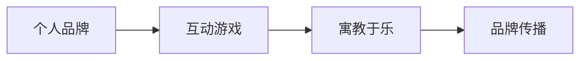

                 

# 开发个人品牌互动游戏：寓教于乐

## 1. 背景介绍

在数字化时代，个人品牌建设已成为一个重要的能力。一个鲜明、有影响力的个人品牌能够帮助我们建立专业形象，吸引更多的关注和机会。然而，如何有效地推广和维护个人品牌，却是一个复杂且极具挑战的问题。这不仅需要精心的内容创作和社交媒体策略，更需要具备教育和互动的能力。因此，本文将探讨一种创新的方法——开发个人品牌互动游戏，通过寓教于乐的方式，帮助个人提升品牌影响力。

## 2. 核心概念与联系

### 2.1 核心概念概述

为更好地理解这一创新方法，本节将介绍几个关键概念及其相互联系：

- **个人品牌**：指个人通过社交媒体、公共活动、专业知识分享等方式，在特定领域建立的认知度和信誉度。个人品牌是个人价值和市场定位的体现。
- **互动游戏**：指通过设计可交互的游戏，使玩家参与其中，体验学习、娱乐和社交的多重价值。互动游戏具有高参与度和吸引力，能有效提升玩家的品牌认知。
- **寓教于乐**：通过游戏化的方式，将教育和娱乐相结合，使玩家在享受游戏乐趣的同时，潜移默化地学习和成长。这种教育方式更加自然、有趣，能够有效提升学习效果。
- **品牌传播**：指通过各种渠道，如社交媒体、视频平台等，将个人品牌传递给更广泛的受众，提升品牌的影响力和知名度。

这些概念通过游戏化的方式进行有机结合，能够使个人品牌建设更加生动、有趣，从而提升品牌影响力和受众的参与度。

### 2.2 核心概念原理和架构的 Mermaid 流程图



此流程图展示了个人品牌、互动游戏、寓教于乐和品牌传播之间的关系。个人品牌通过设计互动游戏的方式，结合寓教于乐的教育理念，再通过品牌传播手段，实现更广泛的影响力提升。

## 3. 核心算法原理 & 具体操作步骤

### 3.1 算法原理概述

基于寓教于乐的互动游戏，其核心算法原理主要包括游戏设计、学习理论和品牌传播。以下将详细介绍这三部分的核心原理。

#### 3.1.1 游戏设计

游戏设计是互动游戏的基础，通过精心设计的游戏元素和规则，吸引玩家的参与和兴趣。游戏设计应具备以下特点：

- **趣味性**：游戏应具备足够的趣味性，吸引玩家持续参与。
- **挑战性**：游戏应具备一定的挑战性，使玩家在克服困难中获得成就感和满足感。
- **互动性**：游戏应具备良好的互动性，使玩家能够在参与中获得社交体验。
- **教育性**：游戏应具备一定的教育性，帮助玩家学习新知识或提升技能。

#### 3.1.2 学习理论

学习理论是寓教于乐的关键，通过科学的设计，使玩家在游戏中自然而然地学习新知识。常见的学习理论包括：

- **行为主义**：通过奖励和惩罚机制，鼓励玩家学习新知识。
- **认知主义**：通过引导玩家解决问题，使其在思考和探索中学习。
- **建构主义**：通过提供任务和挑战，使玩家主动构建知识结构。

#### 3.1.3 品牌传播

品牌传播是互动游戏的最终目标，通过有效的传播手段，将个人品牌传递给更广泛的受众。品牌传播应具备以下特点：

- **多渠道**：通过多种传播渠道（如社交媒体、视频平台等），扩大品牌覆盖范围。
- **多样化**：采用多样化的传播形式（如视频、文章、互动内容等），增加品牌曝光度。
- **持续性**：保持持续的品牌传播活动，增强品牌影响力。

### 3.2 算法步骤详解

#### 3.2.1 游戏设计步骤

1. **需求分析**：明确目标受众和品牌传播的目标，确定游戏的设计方向和教育内容。
2. **游戏概念**：设计游戏的基本概念，包括玩法、规则、奖励机制等。
3. **游戏原型**：使用游戏设计工具（如Unity、Unreal Engine等）创建游戏原型，并进行初步测试。
4. **反馈优化**：根据玩家反馈和测试结果，不断优化游戏设计和用户体验。

#### 3.2.2 学习理论步骤

1. **内容设计**：根据目标受众和教育目标，设计适合的游戏内容和任务。
2. **互动设计**：设计游戏中的互动元素，如任务完成、问题解决等，引导玩家学习。
3. **反馈机制**：设计奖励和惩罚机制，激励玩家完成任务并学习新知识。
4. **效果评估**：通过测试和数据分析，评估游戏的教育效果，进行持续优化。

#### 3.2.3 品牌传播步骤

1. **传播渠道**：选择适合的品牌传播渠道，如社交媒体、视频平台等。
2. **内容制作**：制作高质量的传播内容，包括游戏截图、视频、互动内容等。
3. **推广策略**：制定合理的推广策略，吸引目标受众参与互动游戏。
4. **效果评估**：通过数据分析，评估品牌传播效果，优化推广策略。

### 3.3 算法优缺点

#### 3.3.1 优点

1. **高参与度**：互动游戏能够有效提升玩家的参与度和兴趣，增强品牌互动。
2. **自然学习**：寓教于乐的游戏设计，使玩家在游戏过程中自然而然地学习新知识，提升学习效果。
3. **多样传播**：通过多种传播渠道，扩大品牌覆盖范围，增加品牌曝光度。

#### 3.3.2 缺点

1. **设计复杂**：互动游戏的设计和开发需要较高的专业知识和技能。
2. **资源投入**：开发和维护互动游戏需要一定的资源投入，包括时间、金钱和技术支持。
3. **效果依赖**：游戏的效果和品牌传播效果高度依赖于设计和运营，需要持续优化。

### 3.4 算法应用领域

互动游戏和寓教于乐的概念不仅适用于个人品牌建设，还广泛应用于多个领域。例如：

- **教育领域**：通过互动游戏和寓教于乐，提升学生的学习兴趣和效果，实现高效教学。
- **企业培训**：设计互动游戏和任务，提升员工的培训效果和参与度。
- **社交网络**：通过互动游戏和社交元素，增强用户粘性和品牌互动。
- **公共健康**：设计健康互动游戏，提高公众的健康意识和行为。

## 4. 数学模型和公式 & 详细讲解 & 举例说明

### 4.1 数学模型构建

基于寓教于乐的互动游戏，其数学模型主要涉及游戏设计、学习理论和品牌传播。以下将详细介绍这三部分的数学模型构建。

#### 4.1.1 游戏设计模型

游戏设计模型主要涉及游戏规则和任务设计。以一个简单的解谜游戏为例，其数学模型可以表示为：

$$
S = \{s_i | 1 \leq i \leq n\}
$$

其中，$S$ 表示所有游戏状态，$s_i$ 表示第 $i$ 个状态。游戏从一个初始状态 $s_0$ 开始，玩家通过一系列操作，逐步解谜，达到最终状态 $s_n$。

#### 4.1.2 学习理论模型

学习理论模型主要涉及任务设计和反馈机制。以一个学习语言单词的游戏为例，其数学模型可以表示为：

$$
L = \{l_i | 1 \leq i \leq m\}
$$

其中，$L$ 表示所有学习任务，$l_i$ 表示第 $i$ 个学习任务。玩家通过完成这些任务，学习新单词，最终掌握语言。

#### 4.1.3 品牌传播模型

品牌传播模型主要涉及传播渠道和内容制作。以一个社交媒体上的品牌传播为例，其数学模型可以表示为：

$$
C = \{c_j | 1 \leq j \leq p\}
$$

其中，$C$ 表示所有传播渠道，$c_j$ 表示第 $j$ 个传播渠道。通过这些渠道，品牌内容被传递给受众，增加品牌曝光度。

### 4.2 公式推导过程

#### 4.2.1 游戏设计公式推导

以解谜游戏为例，假设游戏规则为通过移动像素块，使棋盘上的数字相加等于目标值。其推导过程如下：

$$
S = \{(s_i, v_i) | 1 \leq i \leq n\}
$$

其中，$s_i$ 表示第 $i$ 个状态，$v_i$ 表示该状态的目标值。状态之间的转换关系可以表示为：

$$
s_{i+1} = f(s_i, a)
$$

其中，$a$ 表示玩家的操作，$f$ 表示状态转换函数。

#### 4.2.2 学习理论公式推导

以学习语言单词为例，假设任务为匹配单词和定义。其推导过程如下：

$$
L = \{(l_i, w_i, d_i) | 1 \leq i \leq m\}
$$

其中，$l_i$ 表示第 $i$ 个学习任务，$w_i$ 表示单词，$d_i$ 表示定义。任务完成情况可以表示为：

$$
C_i = f(w_i, d_i)
$$

其中，$f$ 表示匹配函数。

#### 4.2.3 品牌传播公式推导

以社交媒体上的品牌传播为例，假设传播渠道为微博、微信公众号、抖音等。其推导过程如下：

$$
C = \{(c_j, v_j) | 1 \leq j \leq p\}
$$

其中，$c_j$ 表示第 $j$ 个传播渠道，$v_j$ 表示该渠道的曝光量和互动量。品牌传播效果可以表示为：

$$
E_j = f(c_j)
$$

其中，$f$ 表示传播效果函数。

### 4.3 案例分析与讲解

以一个名为“品牌探险”的互动游戏为例，其设计如下：

#### 4.3.1 游戏设计案例

**游戏目标**：玩家需要完成一系列任务，探索一个神秘的世界，收集物品，解锁新的领域。

**游戏规则**：
1. 玩家可以通过移动、跳跃、解谜等方式，逐步推进游戏。
2. 每个任务完成后，玩家可以获得奖励，解锁新的领域和物品。
3. 玩家需要根据提示，理解游戏规则，完成任务。

#### 4.3.2 学习理论案例

**学习内容**：玩家需要学习新单词、数学公式、文化知识等。

**互动设计**：
1. 玩家需要在任务中根据提示，猜测单词、解决数学问题、理解文化背景。
2. 游戏提供多种互动方式，如选择、填空、匹配等。
3. 玩家完成任务后，系统会给出反馈，解释正确答案。

#### 4.3.3 品牌传播案例

**传播渠道**：
1. 微博：发布游戏截图、任务提示、互动内容。
2. 微信公众号：发布游戏攻略、任务解析、用户故事。
3. 抖音：发布游戏视频、互动直播、用户互动。

**内容制作**：
1. 游戏截图：精美且富有吸引力的游戏截图。
2. 视频内容：有趣的游戏过程、用户互动、品牌介绍。
3. 互动内容：挑战任务、用户挑战、品牌问答等。

## 5. 项目实践：代码实例和详细解释说明

### 5.1 开发环境搭建

要进行互动游戏的开发，首先需要搭建开发环境。以下是使用Python进行Unity游戏开发的环境配置流程：

1. 安装Unity Hub：从官网下载并安装Unity Hub，用于管理Unity版本。
2. 安装Unity：根据项目需求，选择适合的Unity版本进行下载安装。
3. 安装Python和Pygame：使用Python进行游戏逻辑开发，使用Pygame进行游戏界面开发。
4. 安装其他必要的开发工具：如Visual Studio Code、Git、Docker等。

完成上述步骤后，即可在开发环境中进行互动游戏的开发。

### 5.2 源代码详细实现

这里我们以一个简单的解谜游戏为例，给出使用Python进行Unity游戏开发的代码实现。

首先，创建Unity项目，配置游戏环境：

```python
import unity3d
unity3d.CreateProject("InteractiveGame", "InteractiveGame.png")
```

接着，编写游戏逻辑代码：

```python
import pygame
from pygame.locals import *

class Game:
    def __init__(self):
        self.screen = pygame.display.set_mode((640, 480))
        self.clock = pygame.time.Clock()
        self.gameover = False
        
        # 游戏状态初始化
        self.state = 0
        
        # 游戏规则初始化
        self.rules = [
            "移动像素块，使数字相加等于目标值。",
            "完成任务后，解锁新的领域和物品。",
            "根据提示，理解游戏规则，完成任务。"
        ]
        
    def run(self):
        while True:
            self.clock.tick(60)
            if self.state == 0:
                self.state = 1
            elif self.state == 1:
                self.state = 2
            elif self.state == 2:
                self.state = 3
            elif self.state == 3:
                self.state = 0
            else:
                self.state = 0
                
            self.screen.fill((255, 255, 255))
            pygame.display.flip()
            
            # 根据状态执行不同的操作
            if self.state == 0:
                self.load_initial_state()
            elif self.state == 1:
                self.load_task_state()
            elif self.state == 2:
                self.load_success_state()
            elif self.state == 3:
                self.load_gameover_state()
                
    def load_initial_state(self):
        # 初始状态游戏规则显示
        pygame.draw.rect(self.screen, (0, 0, 0), (50, 50, 450, 20))
        pygame.draw.rect(self.screen, (255, 255, 255), (50, 50, 400, 10))
        pygame.draw.text(self.screen, self.rules[0], (75, 70), (255, 255, 255), 24)
        
    def load_task_state(self):
        # 任务状态解谜显示
        pygame.draw.rect(self.screen, (0, 0, 0), (50, 50, 450, 20))
        pygame.draw.rect(self.screen, (255, 255, 255), (50, 50, 400, 10))
        pygame.draw.text(self.screen, self.rules[1], (75, 70), (255, 255, 255), 24)
        
    def load_success_state(self):
        # 成功状态奖励显示
        pygame.draw.rect(self.screen, (0, 0, 0), (50, 50, 450, 20))
        pygame.draw.rect(self.screen, (255, 255, 255), (50, 50, 400, 10))
        pygame.draw.text(self.screen, self.rules[2], (75, 70), (255, 255, 255), 24)
        
    def load_gameover_state(self):
        # 游戏结束状态显示
        pygame.draw.rect(self.screen, (0, 0, 0), (50, 50, 450, 20))
        pygame.draw.rect(self.screen, (255, 255, 255), (50, 50, 400, 10))
        pygame.draw.text(self.screen, "游戏结束", (75, 70), (255, 255, 255), 24)
```

然后，编写游戏界面代码：

```python
class UI:
    def __init__(self):
        self.font = pygame.font.Font(None, 24)
        
    def render_text(self, text, position):
        label = self.font.render(text, True, (0, 0, 0), (255, 255, 255))
        self.screen.blit(label, position)
        
    def render_image(self, image, position):
        self.screen.blit(image, position)
```

最后，运行游戏并进行测试：

```python
if __name__ == "__main__":
    game = Game()
    ui = UI()
    game.run()
```

以上就是使用Python进行Unity游戏开发的完整代码实现。可以看到，通过Python和Pygame的配合，我们可以高效地实现互动游戏的基本逻辑和界面，进一步扩展功能，提升游戏体验。

### 5.3 代码解读与分析

让我们再详细解读一下关键代码的实现细节：

**Game类**：
- `__init__`方法：初始化游戏屏幕、时钟、状态和规则。
- `run`方法：循环执行游戏逻辑，根据当前状态显示不同的游戏规则和界面。
- `load_initial_state`方法：显示初始状态的游戏规则。
- `load_task_state`方法：显示任务状态的游戏规则。
- `load_success_state`方法：显示成功状态的游戏规则。
- `load_gameover_state`方法：显示游戏结束状态的游戏规则。

**UI类**：
- `__init__`方法：初始化字体。
- `render_text`方法：渲染文本。
- `render_image`方法：渲染图片。

通过这些代码，我们可以实现一个基础的解谜游戏，玩家通过完成不同任务，逐步推进游戏，解锁新的领域和物品。游戏通过不同的状态和规则，寓教于乐，使玩家在游戏中学习新知识，提升品牌影响力。

## 6. 实际应用场景

### 6.1 智能客服系统

智能客服系统可以借助互动游戏，通过寓教于乐的方式，提升客服人员的品牌影响力。例如，设计一个“客服探险”游戏，通过解决客服问题和完成挑战任务，帮助客服人员提升服务技能和品牌认知。

#### 6.1.1 场景示例

- **游戏目标**：完成客服任务，解锁新的客户信息和互动模式。
- **游戏规则**：通过解决客户问题和提供优质服务，解锁新的客户信息和互动模式。
- **学习理论**：通过完成任务，学习客户问题的解决方案和服务技巧。
- **品牌传播**：通过客服人员的互动，提升品牌形象和客户满意度。

#### 6.1.2 实施步骤

1. **设计游戏**：根据客服任务和客户问题，设计游戏规则和互动元素。
2. **开发游戏**：使用Unity、Unreal Engine等游戏开发工具，开发互动游戏。
3. **测试优化**：在游戏开发完成后，进行测试优化，确保游戏的流畅性和易用性。
4. **部署应用**：将游戏部署到客服系统，客服人员通过游戏提升服务技能和品牌认知。

### 6.2 金融舆情监测

金融舆情监测可以借助互动游戏，通过寓教于乐的方式，提升金融分析师的品牌影响力。例如，设计一个“金融侦探”游戏，通过解决金融问题和完成挑战任务，帮助分析师提升金融分析技能和品牌认知。

#### 6.2.1 场景示例

- **游戏目标**：完成金融分析任务，解锁新的金融数据和分析模式。
- **游戏规则**：通过解决金融问题和提供精准分析，解锁新的金融数据和分析模式。
- **学习理论**：通过完成任务，学习金融分析的方法和技能。
- **品牌传播**：通过分析师的互动，提升品牌形象和市场信任。

#### 6.2.2 实施步骤

1. **设计游戏**：根据金融分析任务和金融问题，设计游戏规则和互动元素。
2. **开发游戏**：使用Unity、Unreal Engine等游戏开发工具，开发互动游戏。
3. **测试优化**：在游戏开发完成后，进行测试优化，确保游戏的流畅性和易用性。
4. **部署应用**：将游戏部署到金融分析系统，分析师通过游戏提升金融分析技能和品牌认知。

### 6.3 个性化推荐系统

个性化推荐系统可以借助互动游戏，通过寓教于乐的方式，提升推荐算法的品牌影响力。例如，设计一个“推荐探险”游戏，通过解决推荐问题和完成挑战任务，帮助推荐算法提升推荐效果和品牌认知。

#### 6.3.1 场景示例

- **游戏目标**：完成推荐任务，解锁新的推荐数据和算法模式。
- **游戏规则**：通过解决推荐问题和提供精准推荐，解锁新的推荐数据和算法模式。
- **学习理论**：通过完成任务，学习推荐算法的方法和技能。
- **品牌传播**：通过算法的互动，提升品牌形象和用户满意度。

#### 6.3.2 实施步骤

1. **设计游戏**：根据推荐任务和推荐问题，设计游戏规则和互动元素。
2. **开发游戏**：使用Unity、Unreal Engine等游戏开发工具，开发互动游戏。
3. **测试优化**：在游戏开发完成后，进行测试优化，确保游戏的流畅性和易用性。
4. **部署应用**：将游戏部署到推荐系统，推荐算法通过游戏提升推荐效果和品牌认知。

### 6.4 未来应用展望

随着技术的发展和应用场景的丰富，基于寓教于乐的互动游戏将迎来更广泛的应用。未来，我们可以预见互动游戏将在以下几个领域发挥重要作用：

1. **教育培训**：通过互动游戏和寓教于乐，提升学生的学习兴趣和效果，实现高效教学。
2. **企业培训**：设计互动游戏和任务，提升员工的培训效果和参与度。
3. **社交网络**：通过互动游戏和社交元素，增强用户粘性和品牌互动。
4. **公共健康**：设计健康互动游戏，提高公众的健康意识和行为。

## 7. 工具和资源推荐

### 7.1 学习资源推荐

为了帮助开发者系统掌握互动游戏的开发方法和应用场景，这里推荐一些优质的学习资源：

1. **《Unity游戏开发入门》系列博文**：详细介绍了Unity的基本概念和开发流程，适合初学者入门。
2. **《Python游戏编程》书籍**：介绍了使用Python和Pygame进行游戏开发的原理和实践，适合进阶学习。
3. **Coursera《互动游戏设计》课程**：斯坦福大学开设的互动游戏设计课程，涵盖游戏设计、交互设计、用户体验等方面。
4. **《游戏设计模式》书籍**：深入分析了游戏设计中的模式和技巧，适合游戏开发者参考。
5. **GitHub游戏项目**：GitHub上丰富的游戏项目和代码，适合学习和参考。

通过这些资源的学习实践，相信你一定能够快速掌握互动游戏的开发方法，并用于解决实际问题。

### 7.2 开发工具推荐

高效的开发离不开优秀的工具支持。以下是几款用于互动游戏开发的常用工具：

1. **Unity**：功能强大的游戏引擎，支持多种平台，适合3D和2D游戏开发。
2. **Unreal Engine**：先进的图形引擎，支持多种平台，适合高质量的3D游戏开发。
3. **Pygame**：简单易用的游戏库，适合2D游戏开发。
4. **Visual Studio Code**：高效且可扩展的代码编辑器，适合编程和游戏开发。
5. **Git**：版本控制系统，适合团队协作和版本管理。
6. **Docker**：容器化工具，适合游戏开发环境的打包和部署。

合理利用这些工具，可以显著提升互动游戏的开发效率，加快创新迭代的步伐。

### 7.3 相关论文推荐

互动游戏和寓教于乐的概念不仅适用于游戏开发，还广泛应用于教育和心理等领域。以下是几篇相关论文，推荐阅读：

1. **《基于互动游戏的学习研究综述》**：总结了互动游戏在学习和教育中的应用和效果。
2. **《互动游戏对学生学习效果的影响》**：分析了互动游戏对学生学习效果的影响和机制。
3. **《游戏化学习：理论、研究和实践》**：探讨了游戏化学习的基本理论、应用研究和实际案例。
4. **《基于互动游戏的心理健康干预》**：研究了互动游戏在心理健康干预中的应用和效果。
5. **《互动游戏在职业培训中的应用》**：分析了互动游戏在职业培训中的应用和效果。

这些论文代表了大语言模型微调技术的发展脉络。通过学习这些前沿成果，可以帮助研究者把握学科前进方向，激发更多的创新灵感。

## 8. 总结：未来发展趋势与挑战

### 8.1 研究成果总结

本文对基于寓教于乐的互动游戏进行了全面系统的介绍。首先，阐述了互动游戏在个人品牌建设中的创新价值，明确了其高参与度、自然学习和多渠道传播的独特优势。其次，从游戏设计、学习理论和品牌传播三个方面，详细讲解了互动游戏的核心算法原理。最后，通过具体的代码实例和实际应用场景，展示了互动游戏的开发方法和应用效果。

通过本文的系统梳理，可以看到，互动游戏通过寓教于乐的方式，使个人品牌建设更加生动、有趣，能够有效提升品牌影响力和受众的参与度。这种创新的方法将带来巨大的市场价值和社会效益。

### 8.2 未来发展趋势

展望未来，基于寓教于乐的互动游戏将呈现以下几个发展趋势：

1. **多样化应用**：互动游戏将在更多领域得到应用，如教育、企业培训、社交网络等。
2. **技术融合**：互动游戏将与其他技术进行更深入的融合，如人工智能、大数据、物联网等，拓展应用场景和提升效果。
3. **用户互动**：通过更多的用户互动和反馈，优化游戏设计和品牌传播效果，提升用户粘性和满意度。
4. **跨平台支持**：开发跨平台的游戏，使互动游戏能够在更多设备上运行，增加品牌曝光度。
5. **内容丰富**：通过丰富的游戏内容和互动元素，提升游戏的趣味性和教育性，吸引更多用户参与。

以上趋势凸显了互动游戏的广阔前景，这些方向的探索发展，将进一步提升互动游戏的效果和应用范围，为个人品牌建设提供更多的创新思路。

### 8.3 面临的挑战

尽管互动游戏在个人品牌建设中具有巨大的潜力，但在实际应用中也面临诸多挑战：

1. **技术门槛高**：互动游戏的开发和优化需要较高的专业知识和技能。
2. **资源投入大**：开发和维护互动游戏需要较大的资金和人力资源投入。
3. **用户互动不足**：部分用户可能对互动游戏缺乏兴趣，导致互动效果不佳。
4. **内容制作难**：高质量的游戏内容和品牌传播内容需要花费大量时间和精力制作。
5. **市场竞争激烈**：随着互动游戏的普及，市场竞争将更加激烈，需要持续创新和优化。

### 8.4 研究展望

面对互动游戏面临的挑战，未来的研究需要在以下几个方面寻求新的突破：

1. **技术简化**：简化互动游戏的开发流程，降低技术门槛，吸引更多开发者参与。
2. **资源优化**：优化互动游戏的资源利用，降低开发成本和资源投入。
3. **用户互动增强**：通过多种手段提升用户互动，增加游戏的趣味性和教育性。
4. **内容创意**：创造更多富有创意的游戏内容和品牌传播内容，提升用户粘性和品牌认知。
5. **市场推广**：加强互动游戏的市场推广，扩大品牌覆盖范围，提升品牌影响力。

这些研究方向将进一步推动互动游戏的发展，使互动游戏在个人品牌建设中发挥更大的作用，推动社会的数字化转型和智能化进步。

## 9. 附录：常见问题与解答

**Q1：互动游戏如何确保用户的学习效果？**

A: 互动游戏通过设计有趣的任务和奖励机制，使玩家在游戏过程中自然而然地学习新知识。关键在于任务设计需要符合认知规律，奖励机制需要激励玩家积极完成任务。此外，游戏可以提供多种学习方式，如挑战任务、知识测试、互动讨论等，使玩家能够在多种场景下进行学习。

**Q2：互动游戏的设计需要考虑哪些因素？**

A: 互动游戏的设计需要考虑以下因素：
1. **游戏性**：游戏需要具备趣味性和挑战性，使玩家持续参与。
2. **教育性**：游戏需要具备教育性，帮助玩家学习新知识。
3. **互动性**：游戏需要具备互动性，使玩家能够在互动中学习。
4. **品牌传播**：游戏需要具备品牌传播性，通过游戏提升品牌认知。

**Q3：互动游戏如何实现多渠道传播？**

A: 互动游戏可以通过多种渠道进行传播，如社交媒体、视频平台、游戏平台等。具体措施包括：
1. **社交媒体**：在社交媒体上发布游戏截图、视频、互动内容，吸引更多用户参与。
2. **视频平台**：在视频平台上发布游戏视频、直播、用户互动，增加品牌曝光度。
3. **游戏平台**：在游戏平台上发布游戏，吸引更多用户下载和体验。

通过这些措施，互动游戏可以实现多渠道传播，扩大品牌覆盖范围。

**Q4：互动游戏的设计和开发需要哪些工具？**

A: 互动游戏的设计和开发需要多种工具支持，包括：
1. **游戏引擎**：如Unity、Unreal Engine、GameMaker等。
2. **游戏开发框架**：如Unity3D、Unreal Engine等。
3. **编程语言**：如Python、C++、JavaScript等。
4. **版本控制工具**：如Git、SVN等。
5. **项目管理工具**：如Trello、Jira等。

合理利用这些工具，可以显著提升互动游戏的开发效率，加速创新迭代。

---

作者：禅与计算机程序设计艺术 / Zen and the Art of Computer Programming

