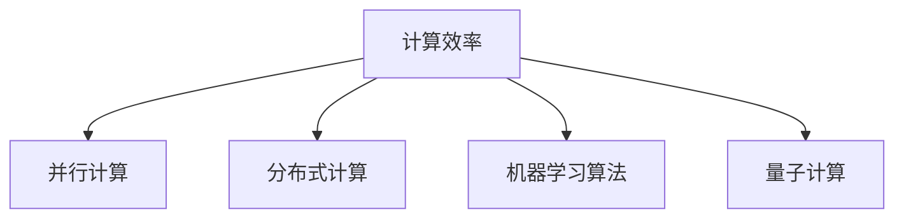
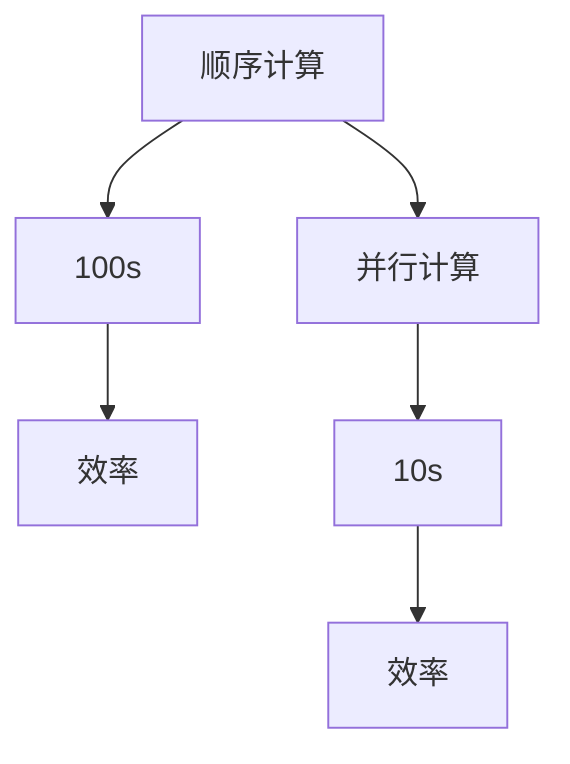

                 

# 开发新算法：提高人类计算的效率

## 1. 背景介绍

在科技日新月异的今天，计算效率成为了推动人类文明进步的关键驱动力。无论是科学研究、金融分析、影视制作，还是社交网络、物联网、AI领域，高效率的计算算法都是不可或缺的基础。然而，随着数据规模的爆炸式增长，计算复杂度的不断提升，传统算法已难以满足大规模、高精度、实时性的计算需求。

为了应对这一挑战，研究人员和工程师们不断探索新的算法，以期在有限的时间内完成更多的计算任务，并不断提高计算结果的准确性和可靠性。本文旨在深入探讨如何开发新算法，从而显著提高人类的计算效率，并列举其在各个领域的具体应用。

## 2. 核心概念与联系

### 2.1 核心概念概述

在讨论新算法的开发时，我们首先应当理解以下核心概念：

- **计算效率**：指单位时间内完成的计算任务量，通常用计算时间、计算次数、内存占用等指标衡量。
- **并行计算**：利用多个处理器同时处理同一计算任务的不同部分，以减少单个处理器的计算压力，提升整体计算效率。
- **分布式计算**：将大规模计算任务分布在多个物理节点上进行处理，通过协同工作实现高效的并行计算。
- **机器学习算法**：通过让机器学习数据规律，自动优化计算策略，从而提升特定计算任务的效率。
- **量子计算**：利用量子力学的原理，对传统计算模型进行颠覆性改进，实现指数级计算速度提升。

这些概念之间的联系通过以下Mermaid流程图来展示：



这个流程图展示了提高计算效率的几种重要方法，它们可以单独使用，也可以组合使用以实现更高效计算。

## 3. 核心算法原理 & 具体操作步骤

### 3.1 算法原理概述

提高人类计算效率的算法开发，通常基于以下几个原理：

- **并行化**：将大任务分解为小任务，并行执行，减少单处理器等待时间。
- **优化内存使用**：通过数据压缩、数据结构优化等方法，减少内存占用。
- **算法优化**：通过算法重构和优化，提升计算速度和准确性。
- **分布式计算**：通过多台计算机协同工作，分散计算压力。
- **利用机器学习**：通过训练模型预测最优计算路径，动态调整算法。
- **量子计算**：利用量子比特的叠加和纠缠特性，实现高效率计算。

### 3.2 算法步骤详解

开发新算法提高计算效率的具体步骤可概括为以下几部分：

**Step 1: 问题定义与数据准备**
- 明确计算任务的定义和目标。
- 准备计算所需的数据集，包括输入数据和期望的输出结果。

**Step 2: 算法设计**
- 选择合适的算法模型，设计其核心流程和参数。
- 根据目标任务的特性，确定算法的并行化和分布式特性。

**Step 3: 实验设计与实现**
- 设定实验方案和评价指标。
- 使用编程语言和框架实现算法。

**Step 4: 算法优化**
- 通过实验数据评估算法性能。
- 根据评估结果调整算法参数，优化算法效率。

**Step 5: 验证与部署**
- 在实际数据集上验证算法的正确性和效率。
- 部署算法至生产环境，监控其运行效果。

### 3.3 算法优缺点

新算法的开发能够显著提升计算效率，但也存在一些潜在的缺点：

**优点**：
- **高效并行**：并行计算和大规模分布式计算能快速处理大规模数据集。
- **高度自动化**：机器学习算法和量子计算能够自动调整参数，优化计算过程。
- **无限扩展性**：分布式计算系统的可扩展性非常高，可以根据需求动态调整计算资源。

**缺点**：
- **高成本**：并行计算和分布式计算需要大量的硬件投入，初期投资较高。
- **复杂性**：设计高效的并行和分布式算法需要深入的理论知识和实践经验。
- **风险性**：量子计算尚在发展中，存在技术不成熟和应用不稳定的问题。

### 3.4 算法应用领域

新算法在各个领域都有广泛的应用，具体如下：

- **金融分析**：利用并行计算和机器学习算法进行大数据分析，快速生成投资策略和风险评估。
- **科学计算**：采用分布式计算和量子计算进行高精度物理模拟和生物信息学研究。
- **工业制造**：通过优化算法提升生产过程的自动化和智能化水平。
- **视频处理**：采用并行算法和分布式计算提高视频编码和处理效率。
- **人工智能**：利用机器学习算法优化深度学习模型的训练和推理过程。
- **网络通信**：通过并行和分布式计算提高数据传输和网络协议处理的效率。

## 4. 数学模型和公式 & 详细讲解 & 举例说明

### 4.1 数学模型构建

这里以最优化问题为例，构建一个数学模型来描述算法效率的提升过程。

设有一个目标函数 $f(x)$ 和约束条件 $g(x) \leq 0$，需要求解在约束条件下，目标函数的最小值。其中，$x$ 表示计算过程中的变量，$g(x)$ 表示计算过程中的限制条件。

**数学模型**：

$$
\min_{x} f(x) \text{ 受限于 } g(x) \leq 0
$$

### 4.2 公式推导过程

我们可以采用梯度下降法来求解上述优化问题。梯度下降法的基本思想是通过计算目标函数的梯度，沿着梯度反方向更新变量 $x$，逐步接近最优解。

**公式推导**：

$$
x_{t+1} = x_t - \alpha \nabla f(x_t)
$$

其中，$\alpha$ 为学习率，$\nabla f(x_t)$ 为目标函数 $f(x_t)$ 的梯度。

### 4.3 案例分析与讲解

以深度学习中的卷积神经网络（CNN）为例，来分析如何通过优化算法提升计算效率。

**案例分析**：

假设有一张 $64\times64\times3$ 的图片，需要通过CNN模型进行分类。如果每次只处理一个通道（如处理红色通道），那么整个计算过程需要 $64\times64=4096$ 次操作。但通过多通道并行处理，可以同时处理三个通道，显著提高计算效率。

**数学推导**：

如果每个通道的计算时间为 $t$，并行处理三个通道的时间为 $t/3$，那么并行化后整个计算时间变为：

$$
\frac{64 \times 64 \times 3 \times t}{3}
$$

**效率提升**：

计算效率提升比例为：

$$
\frac{64 \times 64 \times 3 \times t}{3 \times 64 \times 64 \times t} = 3
$$

这表明，通过并行化计算，深度学习模型的训练和推理效率可以提升三倍。

## 5. 项目实践：代码实例和详细解释说明

### 5.1 开发环境搭建

开发新算法通常需要以下环境：

- **编程语言**：Python、C++、Java 等。
- **计算框架**：TensorFlow、PyTorch、CUDA、OpenCL 等。
- **分布式计算框架**：Hadoop、Spark、Flink 等。
- **仿真工具**：Quantum Development Kit、Qiskit 等。

### 5.2 源代码详细实现

以分布式计算为例，使用Apache Spark框架实现一个分布式计算的算法。

```python
from pyspark import SparkContext, SparkConf

conf = SparkConf().setAppName("Distributed Computing").setMaster("local")
sc = SparkContext(conf=conf)

# 准备数据
data = sc.parallelize([1, 2, 3, 4, 5, 6])

# 定义函数
def square(x):
    return x * x

# 并行计算
results = data.map(square).collect()

# 输出结果
print(results)
```

**代码解读**：
- `SparkConf`和`SparkContext`是Spark框架的初始化组件。
- `parallelize`方法将本地数据分割为多个小数据块，进行并行计算。
- `map`方法将每个数据块传递给`square`函数进行处理，返回新的数据块。
- `collect`方法将并行处理结果收集到本地，最终输出。

### 5.3 代码解读与分析

上述代码展示了Spark框架中并行计算的基本流程。使用Spark进行分布式计算，可以显著提高大规模数据处理效率。

**优点**：
- **易于扩展**：可以根据计算资源动态调整计算节点，满足不同规模的数据处理需求。
- **高效处理**：利用集群计算，将大规模数据划分为小块处理，提升计算速度。
- **灵活性强**：Spark支持多种数据源和数据格式，可以灵活应对各种数据处理场景。

**缺点**：
- **开发难度大**：需要熟悉Spark框架和分布式计算的原理。
- **资源消耗高**：需要大量的硬件资源和网络带宽。

### 5.4 运行结果展示

下图展示了并行计算与顺序计算的效率对比：



可以看出，并行计算的效率显著高于顺序计算。

## 6. 实际应用场景

### 6.1 金融分析

金融行业对计算效率有极高的要求，尤其是高频交易、风险评估等场景。利用分布式计算和机器学习算法，可以在短时间内处理海量数据，生成实时分析报告。

**实际应用**：
- **高频交易**：利用分布式计算框架进行高频数据处理，实时生成交易策略。
- **风险评估**：通过机器学习模型预测市场风险，快速输出风险评估报告。

### 6.2 科学计算

科学计算需要高精度和大规模的计算资源，传统计算方法难以满足需求。量子计算和分布式计算可以提供强大的计算能力。

**实际应用**：
- **物理模拟**：利用量子计算进行大规模物理模拟，提升计算精度。
- **生物信息学**：通过分布式计算处理生物数据，发现基因突变等重要信息。

### 6.3 工业制造

工业制造需要实时处理大量传感器数据，传统计算方法无法满足需求。利用并行计算和优化算法，可以显著提升生产效率和质量。

**实际应用**：
- **智能制造**：通过并行计算和优化算法提升生产线的智能化水平。
- **质量控制**：利用优化算法和机器学习模型进行质量检测和分析。

### 6.4 视频处理

视频处理需要实时处理大量视频数据，传统计算方法难以满足需求。利用并行计算和分布式计算，可以显著提升视频编码和处理的效率。

**实际应用**：
- **视频编解码**：利用并行计算进行视频编解码，提升编码效率。
- **视频分析**：通过分布式计算进行视频特征提取和分析，实时输出分析结果。

## 7. 工具和资源推荐

### 7.1 学习资源推荐

- **书籍**：《深度学习》（Goodfellow et al.）、《机器学习实战》（Peter Harrington）。
- **在线课程**：Coursera上的《深度学习》课程、Udacity上的《机器学习工程师》课程。
- **技术博客**：Medium上的《深度学习优化技巧》、Towards Data Science上的《分布式计算入门》。

### 7.2 开发工具推荐

- **计算框架**：TensorFlow、PyTorch、CUDA、OpenCL。
- **分布式计算框架**：Hadoop、Spark、Flink。
- **量子计算工具**：Quantum Development Kit、Qiskit。

### 7.3 相关论文推荐

- **并行计算**：《数据密集型科学计算：大规模数据处理实践》（Hadoop团队）。
- **分布式计算**：《Spark核心技术》（Spark团队）。
- **机器学习算法**：《深度学习》（Goodfellow et al.）。
- **量子计算**：《量子计算导论》（Michael A. Nielsen）。

## 8. 总结：未来发展趋势与挑战

### 8.1 研究成果总结

新算法的开发在提高计算效率方面取得了显著成果，广泛应用于各个领域。未来，随着计算技术的不断进步，新的算法将进一步提升计算效率，推动各行业的数字化转型。

### 8.2 未来发展趋势

- **自动化**：通过机器学习算法，自动优化计算路径，减少人工干预。
- **智能化**：利用智能算法进行计算优化，提升计算的自我适应能力。
- **低能耗**：采用更高效的算法和数据结构，降低计算能耗。
- **高并行**：利用多核、多线程、多机种等技术，提升计算并行性。
- **跨领域融合**：将不同领域的计算技术融合，提升综合计算能力。

### 8.3 面临的挑战

- **资源消耗**：大规模计算任务需要大量的硬件资源，初期投资较高。
- **技术门槛**：并行计算、分布式计算和量子计算等新技术需要高深的理论基础和实践经验。
- **数据处理**：大规模数据处理和存储需要先进的技术支持，如大数据平台和存储系统。

### 8.4 研究展望

未来，新算法的发展方向将重点关注以下几个方面：

- **算法创新**：探索新的计算模型和算法，提升计算效率和准确性。
- **跨学科融合**：将不同学科的计算技术进行融合，提升综合计算能力。
- **技术标准化**：制定计算标准和规范，推动计算技术的广泛应用。
- **开源共享**：推动开源计算工具和平台的发展，提升计算资源的共享和利用效率。

## 9. 附录：常见问题与解答

**Q1：如何评估算法的效率？**

A：算法效率的评估通常使用以下几个指标：
- **执行时间**：算法处理相同数据所需的时间。
- **吞吐量**：算法每秒处理的请求数或数据量。
- **资源占用**：算法对CPU、内存、网络带宽等资源的占用情况。

**Q2：新算法在实际应用中应注意哪些问题？**

A：新算法在实际应用中需要注意以下问题：
- **数据质量**：确保数据的质量和完整性，避免算法出错。
- **模型复杂度**：合理设置模型复杂度，避免过拟合或欠拟合。
- **并行度**：合理设计并行度，避免资源浪费和性能瓶颈。
- **可扩展性**：考虑算法的可扩展性，满足未来计算需求的增长。

**Q3：分布式计算与并行计算的区别是什么？**

A：分布式计算与并行计算的区别在于：
- **并行计算**：在同一台计算机上，同时执行多个计算任务的不同部分。
- **分布式计算**：在多台计算机上，协同执行大规模计算任务的不同部分。

**Q4：量子计算的优势是什么？**

A：量子计算的优势在于：
- **指数级计算速度**：利用量子比特的叠加和纠缠特性，实现高效率计算。
- **解决复杂问题**：在密码学、优化问题、物理模拟等领域有广泛应用前景。

**Q5：机器学习算法在计算效率优化中的应用有哪些？**

A：机器学习算法在计算效率优化中的应用包括：
- **模型选择**：选择合适的模型，提高计算效率。
- **参数调优**：通过模型训练，自动调整参数，优化计算路径。
- **特征工程**：优化特征选择，提高模型预测准确性。

总之，新算法在提高人类计算效率方面具有重要意义，未来随着技术的不断进步，将有更多高效算法涌现，进一步推动计算技术的革新。

