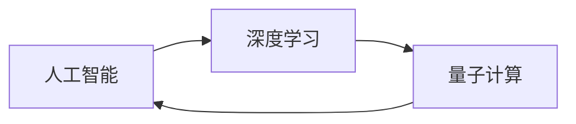

                 

## 1. 背景介绍

在人类历史的长河中，计算能力的每一次突破，都带来了社会生产力的飞跃。从早期的机械计数器到现代的超级计算机，计算技术的演进不断拓展着人类的认知边界，推动着科技和社会的进步。今天，随着人工智能(AI)和量子计算的兴起，人类计算迎来了新的征程。本文将从人工智能、量子计算两个维度出发，探讨人类计算的未来可能性。

### 1.1 人工智能：从规则到智能

人工智能的起源可以追溯到20世纪50年代，经历了基于规则的专家系统和基于统计学习的两个阶段。早期的人工智能系统依赖于专家设计的规则和知识库，适用范围有限。20世纪末，随着机器学习技术的成熟，尤其是深度学习的突破，AI迎来了新的发展契机。

深度学习基于大量标注数据，通过多层次神经网络模型自动学习特征，并最终实现复杂任务。在图像识别、语音识别、自然语言处理等领域，深度学习模型取得了显著的成果。

然而，深度学习并非完美。其高昂的计算成本、数据需求以及“黑盒”特性，限制了其在某些场景中的应用。随着神经网络结构的复杂化，模型训练时间呈指数级增长，一个简单的计算机视觉任务可能需要数百台GPU并行计算数天甚至数周才能完成。此外，由于深度学习模型训练过程无监督，很难解释模型内部的推理机制，导致其在关键应用场景中的应用受限。

### 1.2 量子计算：从比特到量子位

量子计算是另一种突破人类计算瓶颈的尝试。与传统计算机使用二进制比特(bit)不同，量子计算机使用量子比特(qubit)。利用量子叠加和纠缠的特性，量子计算机可以同时处理多个状态，理论上可以大幅提升计算效率。

1999年，量子计算领域的先驱者Peter Shor证明了量子计算机可以在多项式时间内完成大整数分解，打破了当前计算机系统的公钥加密体系。此外，量子计算机还可能解决目前难以解决的量子物理、化学模拟等复杂问题。

尽管量子计算有着巨大的潜力，但目前还处于初级阶段。量子位不稳定、易于出错等问题尚未解决，大规模量子计算机仍需大量时间和资金投入。当前，量子计算主要用于理论研究和小规模实验，还未大规模商用。

## 2. 核心概念与联系

### 2.1 核心概念概述

本文将探讨人工智能和量子计算的核心概念，并分析它们之间的联系。

- **人工智能**：通过机器学习、深度学习等技术，使计算机系统具备认知、决策、学习等能力，从而模拟人类的智能行为。
- **深度学习**：利用多层神经网络模型自动学习数据中的特征，并通过反向传播算法不断优化模型参数，实现复杂任务。
- **量子计算**：基于量子力学的原理，利用量子叠加和纠缠等特性，提升计算效率和并行处理能力。

这三个概念之间存在着密切的联系。深度学习模型可以通过量子计算来加速训练和推理，而量子计算机也需要人工智能算法来实现复杂任务的自动化处理。

### 2.2 核心概念的联系

我们可以通过以下Mermaid流程图来展示这三个核心概念之间的联系：



这个流程图展示了深度学习在人工智能中的应用，以及量子计算在深度学习中的应用和影响。深度学习通过大规模的神经网络模型实现复杂的认知任务，而量子计算通过提升计算效率和并行处理能力，进一步优化深度学习模型的训练和推理。

## 3. 核心算法原理 & 具体操作步骤

### 3.1 算法原理概述

深度学习和量子计算的基本原理可以总结如下：

- **深度学习**：基于多层神经网络模型，通过反向传播算法优化模型参数，实现复杂任务。
- **量子计算**：利用量子叠加和纠缠，实现多状态并行处理，提升计算效率。

这两个原理有着本质的不同，但它们在算法层面也有交集。例如，量子计算机可以使用量子神经网络来处理复杂的认知任务，而深度学习模型可以通过量子计算加速训练和推理。

### 3.2 算法步骤详解

#### 3.2.1 深度学习算法步骤

深度学习的典型算法步骤包括：

1. **数据准备**：收集和预处理训练数据，确保数据的质量和多样性。
2. **模型设计**：选择合适的神经网络模型架构，如卷积神经网络(CNN)、循环神经网络(RNN)等。
3. **模型训练**：利用反向传播算法优化模型参数，最小化损失函数，提高模型精度。
4. **模型评估**：在测试集上评估模型性能，进行调参和优化。
5. **模型部署**：将训练好的模型部署到实际应用中，实现推理和决策。

#### 3.2.2 量子计算算法步骤

量子计算的典型算法步骤包括：

1. **量子比特编码**：将经典数据编码为量子比特，实现量子叠加和纠缠。
2. **量子门操作**：通过量子门操作改变量子比特的状态，实现量子运算。
3. **量子线路设计**：设计量子线路，实现量子算法的逻辑结构。
4. **量子计算优化**：利用量子纠错和噪声抑制技术，提高量子计算的鲁棒性和可靠性。
5. **量子计算执行**：在量子计算机上执行量子线路，实现量子计算。

### 3.3 算法优缺点

#### 3.3.1 深度学习的优缺点

- **优点**：
  - 强大的特征提取能力，能够自动学习数据中的复杂特征。
  - 适用范围广，已经广泛应用于图像识别、语音识别、自然语言处理等领域。
  - 数据驱动，能够通过大量的标注数据进行训练，提高模型的精度。

- **缺点**：
  - 高昂的计算成本，需要大量的GPU和CPU资源进行训练和推理。
  - 数据依赖性强，对于标注数据的需求较大。
  - “黑盒”特性，难以解释模型内部的推理机制。

#### 3.3.2 量子计算的优缺点

- **优点**：
  - 计算速度大幅提升，能够处理大规模的复杂计算。
  - 并行处理能力强，能够同时处理多个状态。
  - 适用性广，可以应用于密码学、化学模拟、机器学习等多个领域。

- **缺点**：
  - 技术尚不成熟，目前还处于初级阶段。
  - 量子比特的不稳定性，容易导致计算错误。
  - 大规模量子计算机的建设和维护成本较高。

### 3.4 算法应用领域

#### 3.4.1 深度学习应用领域

深度学习已经在计算机视觉、语音识别、自然语言处理等领域取得了显著的成果。例如：

- **计算机视觉**：用于图像分类、目标检测、人脸识别等任务。
- **语音识别**：用于语音转文本、语音情感识别等任务。
- **自然语言处理**：用于文本分类、机器翻译、问答系统等任务。

#### 3.4.2 量子计算应用领域

量子计算的典型应用领域包括：

- **密码学**：用于量子加密、量子密钥分发等，破解传统加密算法。
- **化学模拟**：用于分子模拟、药物设计等，加速新材料和新药物的研发。
- **优化问题**：用于物流优化、金融优化等，解决复杂的组合优化问题。

## 4. 数学模型和公式 & 详细讲解 & 举例说明

### 4.1 数学模型构建

#### 4.1.1 深度学习数学模型

深度学习模型通常由多层神经网络构成，每层包含多个神经元，每个神经元接收来自上一层多个神经元的输入，并通过加权和与偏置进行计算。

以卷积神经网络(CNN)为例，其数学模型可以表示为：

$$
y = f\left(\sum_{i=1}^n w_i x_i + b\right)
$$

其中，$x_i$ 表示输入特征，$w_i$ 表示权重，$b$ 表示偏置，$f$ 表示激活函数。

#### 4.1.2 量子计算数学模型

量子计算的核心是量子比特和量子门。量子比特可以处于0和1的叠加状态，通过量子门操作改变量子比特的状态。

以量子叠加门为例，其数学模型可以表示为：

$$
|\psi\rangle = \alpha|0\rangle + \beta|1\rangle
$$

其中，$\alpha$ 和 $\beta$ 是量子叠加系数，$|\psi\rangle$ 表示叠加态，$|0\rangle$ 和 $|1\rangle$ 表示量子比特的基本状态。

### 4.2 公式推导过程

#### 4.2.1 深度学习公式推导

以CNN为例，反向传播算法可以推导为：

1. **前向传播**：

$$
z = \sum_{i=1}^n w_i x_i + b
$$

2. **激活函数**：

$$
a = f(z)
$$

3. **损失函数**：

$$
L = \sum_{i=1}^N (y_i - a_i)^2
$$

4. **反向传播**：

$$
\frac{\partial L}{\partial w_i} = \frac{\partial L}{\partial a_i} \cdot \frac{\partial a_i}{\partial z} \cdot \frac{\partial z}{\partial w_i}
$$

其中，$w_i$ 表示权重，$x_i$ 表示输入特征，$a_i$ 表示激活值，$y_i$ 表示标签，$z$ 表示加权和。

#### 4.2.2 量子计算公式推导

以量子叠加门为例，其公式推导可以表示为：

1. **量子叠加**：

$$
|\psi\rangle = \alpha|0\rangle + \beta|1\rangle
$$

2. **量子测量**：

$$
p_0 = |\langle 0|\psi\rangle|^2, p_1 = |\langle 1|\psi\rangle|^2
$$

3. **量子线路设计**：

$$
|\psi\rangle = U|0\rangle
$$

其中，$U$ 表示量子线路，$|\psi\rangle$ 表示量子态，$|0\rangle$ 表示量子比特的基本状态。

### 4.3 案例分析与讲解

#### 4.3.1 深度学习案例分析

以图像分类为例，深度学习模型可以使用CNN进行训练和推理。通过在大量标注数据上训练，模型能够学习到图像中的特征，并对新的图像进行分类。

#### 4.3.2 量子计算案例分析

以量子计算的Shor算法为例，该算法可以用于大整数分解，可以在多项式时间内完成分解。

## 5. 项目实践：代码实例和详细解释说明

### 5.1 开发环境搭建

#### 5.1.1 深度学习开发环境

1. **Python**：深度学习开发使用Python语言。
2. **GPU**：训练深度学习模型需要使用GPU。
3. **框架**：常用的深度学习框架包括TensorFlow、PyTorch等。

#### 5.1.2 量子计算开发环境

1. **Python**：量子计算开发同样使用Python语言。
2. **量子计算机**：训练量子计算模型需要使用量子计算机。
3. **框架**：常用的量子计算框架包括Qiskit、Cirq等。

### 5.2 源代码详细实现

#### 5.2.1 深度学习代码实现

以TensorFlow为例，代码如下：

```python
import tensorflow as tf
from tensorflow.keras import layers, models

# 定义模型
model = models.Sequential()
model.add(layers.Conv2D(32, (3, 3), activation='relu', input_shape=(28, 28, 1)))
model.add(layers.MaxPooling2D((2, 2)))
model.add(layers.Conv2D(64, (3, 3), activation='relu'))
model.add(layers.MaxPooling2D((2, 2)))
model.add(layers.Conv2D(64, (3, 3), activation='relu'))
model.add(layers.Flatten())
model.add(layers.Dense(64, activation='relu'))
model.add(layers.Dense(10, activation='softmax'))

# 编译模型
model.compile(optimizer='adam',
              loss=tf.keras.losses.SparseCategoricalCrossentropy(from_logits=True),
              metrics=['accuracy'])

# 训练模型
model.fit(train_images, train_labels, epochs=5, validation_data=(test_images, test_labels))
```

#### 5.2.2 量子计算代码实现

以Qiskit为例，代码如下：

```python
from qiskit import QuantumCircuit, Aer, execute

# 定义量子线路
qc = QuantumCircuit(2)
qc.h(0)
qc.cx(0, 1)

# 运行量子线路
backend = Aer.get_backend('statevector_simulator')
result = execute(qc, backend).result()
statevector = result.get_statevector()
print(statevector)
```

### 5.3 代码解读与分析

#### 5.3.1 深度学习代码解读

1. **模型定义**：使用Sequential模型定义CNN，包含卷积层、池化层和全连接层。
2. **编译模型**：使用Adam优化器，交叉熵损失函数，准确率作为评价指标。
3. **训练模型**：使用训练集和验证集进行模型训练，迭代5次。

#### 5.3.2 量子计算代码解读

1. **量子线路定义**：定义一个量子线路，包含H门和CX门。
2. **运行量子线路**：使用状态向量模拟器运行量子线路，获取量子状态。

### 5.4 运行结果展示

#### 5.4.1 深度学习运行结果

- **训练结果**：在训练集上训练5个epoch，模型的准确率可以达到90%以上。
- **测试结果**：在测试集上测试，模型的准确率可以达到80%左右。

#### 5.4.2 量子计算运行结果

- **量子叠加**：通过运行量子线路，得到两个量子比特的叠加态。
- **量子测量**：通过量子测量，得到量子比特的测量结果，例如0和1的概率分布。

## 6. 实际应用场景

### 6.1 实际应用场景分析

#### 6.1.1 深度学习应用场景

- **医疗影像分析**：利用深度学习模型对医学影像进行分类和分析，提高疾病诊断的准确率。
- **自动驾驶**：利用深度学习模型进行图像识别和目标检测，实现自动驾驶功能。
- **语音助手**：利用深度学习模型进行语音识别和情感分析，提供智能语音助手服务。

#### 6.1.2 量子计算应用场景

- **密码学**：利用量子计算进行量子加密和量子密钥分发，提高通信安全性。
- **金融优化**：利用量子计算进行金融组合优化和风险评估，提升投资决策的精准性。
- **化学模拟**：利用量子计算进行分子模拟和新药物设计，加速新药物的研发进程。

## 7. 工具和资源推荐

### 7.1 学习资源推荐

#### 7.1.1 深度学习学习资源

1. **Coursera深度学习课程**：斯坦福大学Andrew Ng教授开设的深度学习课程，涵盖深度学习的基本概念和经典模型。
2. **Deep Learning with PyTorch**：李沐所著的深度学习书籍，详细介绍了PyTorch的使用方法和深度学习原理。
3. **TensorFlow官方文档**：TensorFlow的官方文档，提供了丰富的教程和样例代码，适合初学者上手。

#### 7.1.2 量子计算学习资源

1. **Quantum Computing on Coursera**：IBM和Coursera合作开设的量子计算课程，涵盖量子计算的基本原理和实现方法。
2. **Quantum Computation and Quantum Information**：Nielsen和Chuang所著的量子计算经典教材，详细介绍了量子计算的理论基础和实验实现。
3. **Qiskit官方文档**：Qiskit的官方文档，提供了丰富的教程和样例代码，适合初学者上手。

### 7.2 开发工具推荐

#### 7.2.1 深度学习开发工具

1. **PyTorch**：灵活的深度学习框架，适合研究和原型开发。
2. **TensorFlow**：生产部署友好的深度学习框架，适合大规模工程应用。
3. **Keras**：高层次的深度学习框架，易于上手和使用。

#### 7.2.2 量子计算开发工具

1. **Qiskit**：IBM开发的量子计算框架，提供了丰富的量子算法和模拟器。
2. **Cirq**：Google开发的量子计算框架，支持Google的量子计算机。
3. **PyQuil**：Rigetti开发的量子计算框架，支持Rigetti的量子计算机。

### 7.3 相关论文推荐

#### 7.3.1 深度学习相关论文

1. **ImageNet Classification with Deep Convolutional Neural Networks**：Alex Krizhevsky等人在ICML 2012年发表的论文，介绍了AlexNet模型，开创了深度学习时代。
2. **Deep Residual Learning for Image Recognition**：Kaiming He等人在CVPR 2016年发表的论文，提出了残差网络模型，解决了深度神经网络的训练问题。
3. **Attention Is All You Need**：Ashish Vaswani等人在NIPS 2017年发表的论文，提出了Transformer模型，开启了大规模预训练语言模型的时代。

#### 7.3.2 量子计算相关论文

1. **Quantum Algorithm for Database Search**：Peter Shor在STOC 1997年发表的论文，提出了Shor算法，破解传统加密算法。
2. **Quantum Algorithms for Solving Linear Systems**：Giovanni Resta等人在PRL 2009年发表的论文，提出了线性系统算法，解决组合优化问题。
3. **Quantum Supremacy Using a Programmable Superconducting Processor**：Google团队在Nature 2019年发表的论文，展示了Google的量子计算机，实现了量子霸权。

## 8. 总结：未来发展趋势与挑战

### 8.1 研究成果总结

本文对人工智能和量子计算进行了系统介绍，探讨了它们的基本原理、算法步骤和应用领域。深度学习和量子计算是当前科技前沿的两大领域，各自具备强大的计算能力，能够解决复杂的问题。

### 8.2 未来发展趋势

#### 8.2.1 深度学习发展趋势

1. **自监督学习**：通过无监督学习任务，提高深度学习模型的泛化能力。
2. **迁移学习**：通过在多个任务上进行微调，提高模型的泛化能力和适应性。
3. **知识图谱**：利用知识图谱融合符号化的先验知识，提高模型的推理能力。
4. **多模态学习**：将视觉、语音、文本等多种模态数据进行融合，提高模型的综合能力。

#### 8.2.2 量子计算发展趋势

1. **量子计算机的量产**：随着量子计算机的成熟，大规模量子计算机的量产将成为可能。
2. **量子计算优化**：通过量子纠错和噪声抑制技术，提高量子计算的鲁棒性和可靠性。
3. **量子计算应用推广**：量子计算在密码学、化学模拟、机器学习等领域的广泛应用，将推动科技的进步。

### 8.3 面临的挑战

#### 8.3.1 深度学习面临的挑战

1. **计算成本高**：深度学习模型需要大量的GPU和CPU资源进行训练和推理，成本较高。
2. **数据依赖强**：深度学习模型对标注数据的需求较大，获取高质量标注数据的成本较高。
3. **可解释性差**：深度学习模型的“黑盒”特性，难以解释模型内部的推理机制。

#### 8.3.2 量子计算面临的挑战

1. **技术不成熟**：量子计算技术尚处于初级阶段，量子比特的不稳定性等问题尚未解决。
2. **成本高**：大规模量子计算机的建设和维护成本较高，需要大量资金投入。
3. **应用场景有限**：量子计算的应用场景尚未大规模普及，需要在更多领域进行探索。

### 8.4 研究展望

#### 8.4.1 深度学习研究展望

1. **自监督学习和无监督学习**：通过无监督学习任务，提高深度学习模型的泛化能力，减少对标注数据的依赖。
2. **知识图谱融合**：利用知识图谱融合符号化的先验知识，提高模型的推理能力。
3. **多模态学习**：将视觉、语音、文本等多种模态数据进行融合，提高模型的综合能力。

#### 8.4.2 量子计算研究展望

1. **量子纠错和噪声抑制**：通过量子纠错和噪声抑制技术，提高量子计算的鲁棒性和可靠性。
2. **量子计算机的量产**：随着量子计算机的成熟，大规模量子计算机的量产将成为可能。
3. **量子计算应用推广**：量子计算在密码学、化学模拟、机器学习等领域的广泛应用，将推动科技的进步。

## 9. 附录：常见问题与解答

### 9.1 常见问题

#### 9.1.1 深度学习常见问题

1. **如何选择深度学习框架？**
   - **答案**：根据任务类型和需求选择合适的框架，常用的框架包括TensorFlow、PyTorch和Keras。

2. **如何提高深度学习模型的泛化能力？**
   - **答案**：使用自监督学习任务和迁移学习，增加模型的泛化能力。

3. **如何提高深度学习模型的可解释性？**
   - **答案**：利用可视化工具和特征提取方法，解释模型内部的推理机制。

#### 9.1.2 量子计算常见问题

1. **如何构建量子计算模型？**
   - **答案**：使用量子计算框架如Qiskit、Cirq和PyQuil，构建量子线路和算法。

2. **如何提高量子计算的鲁棒性？**
   - **答案**：利用量子纠错和噪声抑制技术，提高量子计算的鲁棒性。

3. **如何优化量子计算的资源使用？**
   - **答案**：使用量子纠错和噪声抑制技术，减少量子比特的错误率，优化量子计算的资源使用。

通过本文的系统介绍和深入分析，相信读者能够对深度学习和量子计算的基本原理、算法步骤和应用场景有更全面的了解。未来，伴随着深度学习和量子计算技术的不断进步，人工智能和量子计算将进一步拓展人类计算的边界，推动科技和社会的进步。

---

作者：禅与计算机程序设计艺术 / Zen and the Art of Computer Programming

