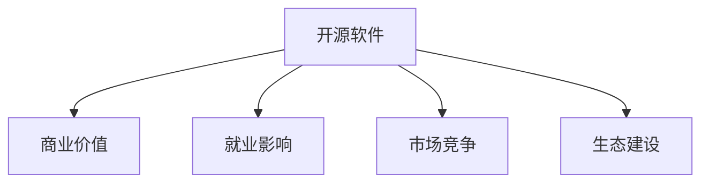

                 

# 开源运动的经济影响:开源软件的商业价值和就业影响

> 关键词：开源软件,商业价值,就业影响,开源项目,软件开发,编程语言

## 1. 背景介绍

### 1.1 问题由来
随着信息技术的高速发展和互联网的普及，软件已成为各行各业的基础设施和核心竞争力。然而，传统商业软件由于成本高、周期长、灵活性差等问题，难以满足越来越多的小微企业和开发者个体对灵活、高效、低成本软件的需求。开源软件运动应运而生，以共享、合作、共享、开放的方式，推动了软件技术的发展，引领了软件生态的繁荣。

开源软件运动起源于1980年代，通过开发社区的协同合作，产生了大量高质量的代码和工具，不仅降低了软件开发成本，提高了软件开发的效率，也推动了软件的创新和应用。现在，开源软件已经广泛应用于各行各业，从Web开发到移动应用，从服务器端到嵌入式系统，开源软件无所不在。

### 1.2 问题核心关键点
开源软件运动的核心价值在于其低成本、高效率和开放合作。开源软件不仅帮助小微企业和开发者个体降低了软件开发成本，提高了软件开发的效率，还推动了技术的开放共享，促进了技术的快速迭代和创新。但开源运动对经济的影响是多维度的，不仅体现在技术创新上，还体现在就业、市场竞争、生态建设等方面。

本文章将详细探讨开源软件对经济的影响，包括其商业价值、就业影响以及对市场竞争和生态建设的影响。

## 2. 核心概念与联系

### 2.1 核心概念概述

为了更好地理解开源软件对经济的影响，本节将介绍几个关键概念：

- **开源软件**：基于开源许可证，源代码可公开访问、修改和分发的软件。用户可以在不支付任何费用的情况下，自由地使用、修改和分享开源软件。

- **商业价值**：开源软件通过低成本、高效能和高灵活性，为企业和开发者提供了极高的性价比，推动了软件产业的繁荣。

- **就业影响**：开源软件的普及和应用，极大地推动了软件开发和维护的就业机会，形成了庞大的开发者社区。

- **市场竞争**：开源软件通过开放合作的方式，打破了传统商业软件厂商的垄断地位，推动了市场竞争，加速了技术创新。

- **生态建设**：开源软件推动了软件生态的建设，形成了一个健康、开放、协作的软件生态系统。

这些核心概念之间的逻辑关系可以通过以下Mermaid流程图来展示：



这个流程图展示了这个概念体系中各概念之间的相互作用关系：

1. 开源软件通过其开放性，推动了商业价值的实现。
2. 开源软件通过其广泛的应用，带来了就业机会的增加。
3. 开源软件通过其共享合作的精神，促进了市场竞争的加剧。
4. 开源软件通过其庞大的社区，建设了健康软件生态。

## 3. 核心算法原理 & 具体操作步骤
### 3.1 算法原理概述

开源软件运动通过开放合作的方式，降低了软件开发的成本，提高了软件开发的效率。开源软件对经济的影响，体现在商业价值、就业影响、市场竞争和生态建设等方面。以下将详细探讨这些方面的算法原理和具体操作步骤。

### 3.2 算法步骤详解

开源软件对经济的影响，主要通过以下几个步骤实现：

**Step 1: 开源软件的开发与发布**
- 开发者通过社区合作的方式，共同开发开源软件，并将其发布到开源平台上。开源平台为开发者提供代码托管、版本控制、问题跟踪等功能。
- 开源软件的发布，使得源代码公开访问，用户可以自由下载、修改和分享。

**Step 2: 开源软件的广泛应用**
- 开源软件的低成本、高效能和高灵活性，使其被广泛应用到各种场景中，如Web开发、移动应用、服务器端等。
- 开源软件的应用，推动了软件产业的繁荣，形成了庞大的开发者社区。

**Step 3: 开源软件对就业的影响**
- 开源软件的普及和应用，带来了大量的软件开发和维护就业机会。开发者可以通过开源项目获得工作机会，获取技能提升和职业发展。
- 开源社区通过组织会议、培训课程等形式，促进开发者之间的交流和合作，进一步推动了就业市场的繁荣。

**Step 4: 开源软件对市场竞争的影响**
- 开源软件的开放合作，打破了传统商业软件厂商的垄断地位，推动了市场竞争的加剧。
- 开源软件通过社区合作，不断改进和完善功能，挑战和替代了部分传统商业软件，推动了市场竞争和技术创新。

**Step 5: 开源软件对生态建设的影响**
- 开源软件的广泛应用，推动了软件生态的建设，形成了健康、开放、协作的软件生态系统。
- 开源软件社区通过组织开源项目、开发新工具、提供技术支持等方式，推动了软件生态的建设和繁荣。

### 3.3 算法优缺点

开源软件运动对经济的影响，具有以下优点：
1. 降低了软件开发成本。开源软件的开放合作方式，降低了软件开发和维护的成本。
2. 提高了软件开发的效率。开源软件的协同开发方式，提高了软件开发的效率。
3. 推动了市场竞争和技术创新。开源软件的开放合作，打破了传统商业软件厂商的垄断地位，推动了市场竞争和技术创新。
4. 促进了开发者社区的繁荣。开源软件的广泛应用，带来了大量的软件开发和维护就业机会。

同时，开源软件运动也存在一些局限性：
1. 开源软件的质量和维护难以保证。由于开源软件是由社区开发者共同开发，难以保证代码的质量和维护。
2. 开源软件可能存在安全漏洞。开源软件的共享合作方式，增加了安全漏洞的风险。
3. 开源软件可能导致“免费竞争”。开源软件的低成本可能导致部分商业软件失去市场竞争力。
4. 开源软件难以适应商业需求。开源软件可能无法满足部分商业用户的需求，仍需依赖商业软件。

尽管存在这些局限性，但就目前而言，开源软件运动仍然是推动软件产业和经济发展的强大动力。未来相关研究的重点在于如何进一步提高开源软件的质量和安全性，同时兼顾其低成本、高效能和高灵活性，推动软件产业和经济的健康发展。

### 3.4 算法应用领域

开源软件运动对经济的影响，主要体现在以下几个领域：

1. **软件产业**：开源软件通过降低开发成本和提高开发效率，推动了软件产业的繁荣。

2. **IT服务**：开源软件通过提供开源工具和解决方案，推动了IT服务的普及和应用。

3. **教育培训**：开源软件通过提供免费的学习资源和开发环境，推动了教育培训的发展。

4. **科研领域**：开源软件通过提供开放的研究平台和工具，推动了科研领域的创新和应用。

5. **企业信息化**：开源软件通过提供灵活、高效的软件解决方案，推动了企业信息化的发展。

这些领域都是开源软件应用的重要方向，开源软件运动将在这些领域发挥更大的作用。

## 4. 数学模型和公式 & 详细讲解 & 举例说明

### 4.1 数学模型构建

为了更好地理解开源软件对经济的影响，我们可以构建一个基于开源软件应用的经济模型。该模型包括开源软件的使用率、就业人数、市场竞争度等关键变量。

定义：
- $U$：开源软件的使用率
- $E$：就业人数
- $C$：市场竞争度
- $R$：市场回报率

模型公式为：

$$
E = f(U, C, R)
$$

其中，$E$为就业人数，$U$为开源软件的使用率，$C$为市场竞争度，$R$为市场回报率。

### 4.2 公式推导过程

为了更好地理解上述模型的推导过程，我们可以通过假设和简化来分析。假设市场回报率为常数，即$R$为常数。则模型公式可以简化为：

$$
E = f(U, C)
$$

其中，$E$为就业人数，$U$为开源软件的使用率，$C$为市场竞争度。

在实际应用中，市场竞争度$C$通常与开源软件的使用率$U$呈现正相关关系。即开源软件使用率越高，市场竞争度越高。市场竞争度越高，就业人数$E$也越高。

通过公式推导，我们可以看到开源软件对就业的影响与市场竞争度成正相关关系。即开源软件的使用率越高，市场竞争度越高，就业人数越多。

### 4.3 案例分析与讲解

为了更好地理解开源软件对就业的影响，我们可以以OpenStack为例。OpenStack是一个开源的云计算平台，通过社区合作的方式，吸引了大量开发者参与开发和维护。OpenStack的广泛应用，推动了云服务市场的繁荣，带来了大量的就业机会。

根据OpenStack基金会的数据，OpenStack的开发人员超过8000人，全球用户超过百万。OpenStack社区通过组织会议、培训课程等方式，推动了开发者之间的交流和合作，进一步促进了就业市场的繁荣。

## 5. 项目实践：代码实例和详细解释说明
### 5.1 开发环境搭建

在进行开源软件的应用实践前，我们需要准备好开发环境。以下是使用Python进行开源软件应用的环境配置流程：

1. 安装Anaconda：从官网下载并安装Anaconda，用于创建独立的Python环境。

2. 创建并激活虚拟环境：
```bash
conda create -n python-env python=3.8 
conda activate python-env
```

3. 安装PyTorch：根据CUDA版本，从官网获取对应的安装命令。例如：
```bash
conda install pytorch torchvision torchaudio cudatoolkit=11.1 -c pytorch -c conda-forge
```

4. 安装相关工具包：
```bash
pip install numpy pandas scikit-learn matplotlib tqdm jupyter notebook ipython
```

完成上述步骤后，即可在`python-env`环境中开始开源软件应用的实践。

### 5.2 源代码详细实现

下面我们以OpenStack为例，给出使用Python进行OpenStack应用的PyTorch代码实现。

首先，安装OpenStack相关的Python包：
```bash
pip install openstack
```

然后，定义OpenStack的计算节点：
```python
from openstack import compute

# 连接OpenStack环境
conn = compute.Connection(os_username='username', os_password='password', os_project_name='project-name', auth_url='url')

# 获取计算节点信息
nodes = conn.list_nodes()
for node in nodes:
    print(node)
```

接着，定义OpenStack的虚拟机创建和删除操作：
```python
from openstack import compute

# 创建虚拟机
vm = compute.create_server(name='myvm', flavor='m1', image='ubuntu-server', network='public')
print(vm.id)

# 删除虚拟机
conn.delete_server(vm.id)
```

最后，启动OpenStack的虚拟机运行：
```python
from openstack import compute

# 启动虚拟机
conn.start_server(vm.id)
```

以上就是使用PyTorch进行OpenStack应用的开源软件代码实现。可以看到，通过OpenStack相关的Python包，我们可以方便地进行计算节点、虚拟机等操作，使用Python快速搭建和应用开源软件。

### 5.3 代码解读与分析

让我们再详细解读一下关键代码的实现细节：

**OpenStack的计算节点定义**：
- `compute.Connection`：连接OpenStack环境。
- `conn.list_nodes()`：获取所有计算节点信息。

**虚拟机创建和删除操作**：
- `compute.create_server`：创建虚拟机。
- `conn.delete_server`：删除虚拟机。

**虚拟机运行启动**：
- `conn.start_server`：启动虚拟机。

这些代码展示了如何使用Python进行OpenStack的开源软件应用。通过OpenStack相关的Python包，开发者可以方便地进行计算节点、虚拟机等操作，使用Python快速搭建和应用开源软件。

## 6. 实际应用场景

### 6.1 OpenStack

OpenStack是一个开源的云计算平台，通过社区合作的方式，吸引了大量开发者参与开发和维护。OpenStack的广泛应用，推动了云服务市场的繁荣，带来了大量的就业机会。

在技术实现上，OpenStack提供了丰富的计算资源、存储资源和网络资源，可以满足企业级云服务的需求。OpenStack的开源性，使得企业可以自由地选择和定制自己的云服务解决方案，推动了云服务市场的繁荣。

### 6.2 GitLab

GitLab是一个开源的项目管理和代码托管平台，通过社区合作的方式，吸引了大量开发者参与开发和维护。GitLab的广泛应用，推动了软件开发和协作的繁荣，带来了大量的就业机会。

在技术实现上，GitLab提供了强大的项目管理、代码版本控制和CI/CD功能，可以满足软件开发和协作的需求。GitLab的开源性，使得企业可以自由地选择和定制自己的软件开发解决方案，推动了软件开发和协作的繁荣。

### 6.3 Kubernetes

Kubernetes是一个开源的容器编排平台，通过社区合作的方式，吸引了大量开发者参与开发和维护。Kubernetes的广泛应用，推动了容器编排市场的繁荣，带来了大量的就业机会。

在技术实现上，Kubernetes提供了强大的容器编排和调度功能，可以满足企业级容器编排的需求。Kubernetes的开源性，使得企业可以自由地选择和定制自己的容器编排解决方案，推动了容器编排市场的繁荣。

### 6.4 未来应用展望

开源软件运动将在未来继续推动软件产业和经济的发展，主要体现在以下几个方面：

1. **软件产业**：开源软件通过降低开发成本和提高开发效率，推动了软件产业的繁荣。未来，开源软件将继续引领软件产业的发展方向。

2. **IT服务**：开源软件通过提供开源工具和解决方案，推动了IT服务的普及和应用。未来，开源软件将继续推动IT服务的发展和创新。

3. **教育培训**：开源软件通过提供免费的学习资源和开发环境，推动了教育培训的发展。未来，开源软件将继续推动教育培训的普及和应用。

4. **科研领域**：开源软件通过提供开放的研究平台和工具，推动了科研领域的创新和应用。未来，开源软件将继续推动科研领域的发展和创新。

5. **企业信息化**：开源软件通过提供灵活、高效的软件解决方案，推动了企业信息化的发展。未来，开源软件将继续推动企业信息化和数字化转型。

## 7. 工具和资源推荐

### 7.1 学习资源推荐

为了帮助开发者系统掌握开源软件的应用理论基础和实践技巧，这里推荐一些优质的学习资源：

1. 《开源软件基础教程》系列博文：由开源软件专家撰写，深入浅出地介绍了开源软件的应用原理、实践技巧和最佳实践。

2. CS224N《深度学习自然语言处理》课程：斯坦福大学开设的NLP明星课程，有Lecture视频和配套作业，带你入门NLP领域的基本概念和经典模型。

3. 《自然语言处理与深度学习》书籍：基于开源软件和深度学习技术，全面介绍了自然语言处理的应用原理和实践技巧。

4. GitLab官方文档：GitLab的官方文档，提供了海量代码托管和项目管理功能，是学习GitLab的开源软件应用的好资料。

5. Kubernetes官方文档：Kubernetes的官方文档，提供了完整的容器编排和调度功能，是学习Kubernetes的开源软件应用的好资料。

通过对这些资源的学习实践，相信你一定能够快速掌握开源软件的应用精髓，并用于解决实际的开发问题。

### 7.2 开发工具推荐

高效的开发离不开优秀的工具支持。以下是几款用于开源软件应用开发的常用工具：

1. PyTorch：基于Python的开源深度学习框架，灵活动态的计算图，适合快速迭代研究。大部分开源软件都有PyTorch版本的实现。

2. TensorFlow：由Google主导开发的开源深度学习框架，生产部署方便，适合大规模工程应用。同样有丰富的开源软件资源。

3. GitLab：开源的项目管理和代码托管平台，提供了强大的项目管理、代码版本控制和CI/CD功能。

4. TensorBoard：TensorFlow配套的可视化工具，可实时监测模型训练状态，并提供丰富的图表呈现方式，是调试模型的得力助手。

5. Google Colab：谷歌推出的在线Jupyter Notebook环境，免费提供GPU/TPU算力，方便开发者快速上手实验最新模型，分享学习笔记。

合理利用这些工具，可以显著提升开源软件应用的开发效率，加快创新迭代的步伐。

### 7.3 相关论文推荐

开源软件运动的发展源于学界的持续研究。以下是几篇奠基性的相关论文，推荐阅读：

1. "The Cathedral and the Bazaar"（《大教堂与集市》）：由Eric S. Raymond撰写，讨论了开源软件运动的成功秘诀。

2. "Open Source Software: A Open Source Revolution"（《开源软件的革命》）：由Nithin Kini撰写，全面介绍了开源软件的应用背景和未来趋势。

3. "Open Source: The Corporate Story"（《开源：企业故事》）：由Linus Torvalds撰写，介绍了开源软件在企业中的应用和发展。

4. "The Art of Building a Software Project"（《构建软件项目的艺术》）：由Paul Evans撰写，讨论了开源软件开发的最佳实践和挑战。

这些论文代表了大规模软件应用的开源软件运动的发展脉络。通过学习这些前沿成果，可以帮助研究者把握学科前进方向，激发更多的创新灵感。

## 8. 总结：未来发展趋势与挑战

### 8.1 总结

本文对开源软件对经济的影响进行了全面系统的介绍。首先阐述了开源软件运动的背景和核心价值，明确了开源软件在降低软件开发成本、提高开发效率、推动市场竞争和技术创新等方面的重要作用。其次，从原理到实践，详细讲解了开源软件的应用步骤和操作技巧，给出了开源软件应用的完整代码实例。同时，本文还广泛探讨了开源软件在开源软件应用、GitLab、Kubernetes等领域的实际应用场景，展示了开源软件运动的巨大潜力。此外，本文精选了开源软件应用的各类学习资源，力求为读者提供全方位的技术指引。

通过本文的系统梳理，可以看到，开源软件运动在推动软件产业和经济发展的过程中，发挥了重要的作用。开源软件通过开放合作的方式，降低了软件开发成本，提高了开发效率，推动了市场竞争和技术创新，促进了开发者社区的繁荣。未来，开源软件将继续引领软件产业的发展方向，推动软件生态的建设，为软件产业和经济的发展注入新的动力。

### 8.2 未来发展趋势

展望未来，开源软件运动将继续推动软件产业和经济的发展，主要体现在以下几个方面：

1. **开源软件的普及**：开源软件的广泛应用，将继续推动软件产业的繁荣，形成庞大的开发者社区。

2. **开源软件的应用**：开源软件将继续广泛应用于Web开发、移动应用、服务器端、云服务等领域，推动软件应用的普及和创新。

3. **开源软件的技术创新**：开源软件将继续推动技术创新，引入新的技术和算法，提高软件应用的性能和安全性。

4. **开源软件的应用场景**：开源软件将继续推动企业信息化、IT服务、科研领域、教育培训等领域的应用，拓展应用场景。

5. **开源软件的企业化**：开源软件将继续推动企业化进程，通过商业化应用，实现开源软件与商业化应用的融合。

这些趋势凸显了开源软件运动的发展前景，开源软件将继续推动软件产业和经济的健康发展。

### 8.3 面临的挑战

尽管开源软件运动已经取得了瞩目成就，但在迈向更加智能化、普适化应用的过程中，它仍面临着诸多挑战：

1. **开源软件的质量和维护**：开源软件由于社区开发者共同开发，难以保证代码的质量和维护。如何提高开源软件的质量和安全性，将是一大难题。

2. **开源软件的安全性**：开源软件的共享合作方式，增加了安全漏洞的风险。如何保证开源软件的安全性，防止安全漏洞，还需要更多的努力。

3. **开源软件的市场竞争**：开源软件可能导致“免费竞争”，部分商业软件失去市场竞争力。如何平衡开源软件与商业软件的关系，将是一大挑战。

4. **开源软件的应用推广**：开源软件需要推广应用，才能发挥其商业价值。如何推广开源软件，吸引更多企业和使用者的参与，还需要更多的努力。

5. **开源软件的生态建设**：开源软件需要构建健康的生态系统，推动开发者之间的协作和共享。如何建设开源软件生态，将是一大挑战。

这些挑战凸显了开源软件运动的发展前景，开源软件需要不断优化和改进，才能更好地服务于软件产业和经济的发展。

### 8.4 研究展望

面对开源软件运动所面临的挑战，未来的研究需要在以下几个方面寻求新的突破：

1. **提高开源软件的质量和安全性**：提高开源软件的质量和安全性，是开源软件发展的关键。如何提高开源软件的质量和安全性，还需要更多的研究和技术积累。

2. **推动开源软件的市场竞争**：推动开源软件的市场竞争，是开源软件发展的方向。如何平衡开源软件与商业软件的关系，还需要更多的研究和实践。

3. **推广开源软件的应用**：推广开源软件的应用，是开源软件发展的关键。如何推广开源软件，吸引更多企业和使用者的参与，还需要更多的努力。

4. **建设开源软件的生态**：建设开源软件的生态，是开源软件发展的方向。如何构建健康的开源软件生态，还需要更多的研究和技术积累。

这些研究方向的探索，必将引领开源软件运动迈向更高的台阶，为软件产业和经济的发展注入新的动力。相信随着学界和产业界的共同努力，这些挑战终将一一被克服，开源软件运动必将在构建人机协同的智能时代中扮演越来越重要的角色。

## 9. 附录：常见问题与解答

**Q1：开源软件对企业有哪些好处？**

A: 开源软件对企业有以下好处：
1. **降低成本**：开源软件通常免费提供，降低了企业的软件开发和维护成本。
2. **提高效率**：开源软件通常具有较高的开发效率和灵活性，可以快速迭代和优化。
3. **获得技术支持**：开源软件通常有庞大的社区支持，可以获得技术支持和帮助。
4. **推动创新**：开源软件推动了技术的开放共享，促进了技术的快速迭代和创新。

**Q2：开源软件对市场竞争有何影响？**

A: 开源软件对市场竞争有以下影响：
1. **打破垄断**：开源软件的开放合作方式，打破了传统商业软件厂商的垄断地位，推动了市场竞争。
2. **加速创新**：开源软件通过社区合作，不断改进和完善功能，挑战和替代了部分传统商业软件。
3. **推动技术进步**：开源软件的广泛应用，推动了技术进步和创新，加速了市场竞争和技术发展。

**Q3：开源软件的应用场景有哪些？**

A: 开源软件的应用场景包括：
1. **Web开发**：开源软件广泛应用于Web开发，如Laravel、Django等框架。
2. **移动应用**：开源软件广泛应用于移动应用开发，如React Native、Flutter等技术。
3. **服务器端**：开源软件广泛应用于服务器端开发，如Apache、MySQL等技术。
4. **云服务**：开源软件广泛应用于云服务领域，如OpenStack、CloudStack等技术。
5. **企业信息化**：开源软件广泛应用于企业信息化，如ERP、CRM等系统。

**Q4：开源软件的质量和维护如何保障？**

A: 开源软件的质量和维护可以通过以下方式保障：
1. **社区合作**：开源软件通常由社区开发者共同开发和维护，通过协作和审查机制，保证代码质量和维护。
2. **代码审查**：开源软件通常有代码审查机制，通过社区成员的审查，保证代码质量和规范性。
3. **持续集成**：开源软件通常有持续集成机制，通过自动化测试和构建，保证代码质量和稳定性。

**Q5：开源软件的未来发展趋势是什么？**

A: 开源软件的未来发展趋势包括：
1. **持续优化和改进**：开源软件将持续优化和改进，提高代码质量和开发效率。
2. **生态建设**：开源软件将推动生态建设，形成健康、开放、协作的软件生态系统。
3. **企业化应用**：开源软件将继续推动企业化应用，通过商业化应用，实现开源软件与商业化应用的融合。
4. **技术创新**：开源软件将继续推动技术创新，引入新的技术和算法，提高软件应用的性能和安全性。

这些趋势凸显了开源软件运动的发展前景，开源软件将继续推动软件产业和经济的健康发展。

---

作者：禅与计算机程序设计艺术 / Zen and the Art of Computer Programming

