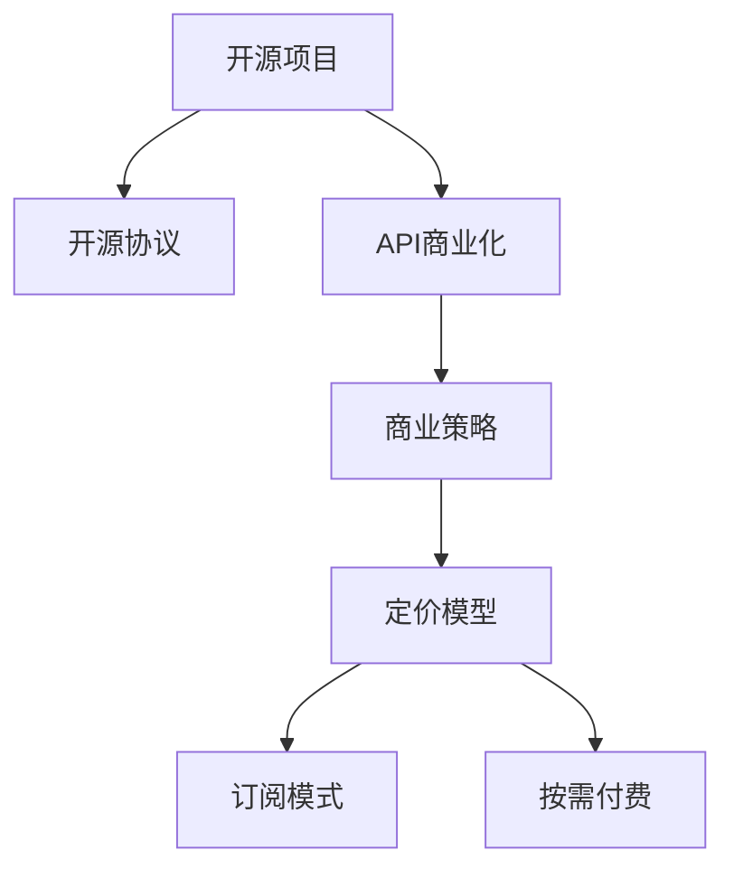

                 

# 开源项目的API商业化：策略和定价模型

> 关键词：API商业化, 开源项目, 商业策略, 定价模型, 订阅模式, 开源协议, 云平台

## 1. 背景介绍

随着开源社区的蓬勃发展和企业对开源项目的依赖加深，越来越多的企业开始将开源项目的API商业化，以此作为盈利的重要手段。然而，如何成功实现API商业化，并将开源项目的长期价值与商业利益相结合，成为了每个企业必须面对的挑战。本文将深入探讨开源项目API商业化的策略和定价模型，为技术企业提供实用的指导。

### 1.1 问题由来

在云计算和人工智能技术迅速发展的今天，开源项目已经成为推动技术创新和应用的重要力量。然而，随着开源社区的不断壮大，开源项目的商业化需求也日益突出。企业纷纷将自身开发的高价值开源项目以API的形式开放，希望通过收费机制来提升项目的商业价值。但事实上，许多企业由于对开源协议的不了解，以及缺乏成熟的商业化策略，导致API商业化的成效不佳，甚至有时会产生负面的品牌影响。

### 1.2 问题核心关键点

开源项目的商业化核心在于平衡项目的开源属性与商业利益。在商业化的过程中，企业必须考虑以下关键问题：

1. **开源协议选择**：根据项目的开源属性选择适合的协议，如Apache、MIT、GPL等。
2. **API收费策略**：如何设计合理的收费模式，确保商业回报的同时维持项目活跃度。
3. **市场定位与推广**：明确API的目标用户群体，制定有效的市场推广策略。
4. **定价模型与灵活性**：设计灵活的定价模型，以应对不同规模和需求的客户。

本文将从策略和定价模型两方面，深入分析这些关键问题，为企业提供实际的商业化参考。

## 2. 核心概念与联系

### 2.1 核心概念概述

在讨论开源项目API商业化的策略和定价模型之前，我们先简要回顾一些相关的核心概念：

- **开源项目**：指由社区开发者共同贡献、遵循开源协议的软件项目，旨在实现软件共享、协作和创新。
- **API商业化**：将企业开发的高价值API以商业形式提供，通过收费机制实现项目的商业化运营。
- **开源协议**：规定开源项目的授权、使用、分发等条款，如Apache、MIT、GPL等。
- **商业策略**：企业根据市场环境、产品特性和目标用户群体的需求，制定的商业运营计划。
- **定价模型**：根据市场需求和产品特性，制定的收费策略和机制，如订阅模式、按需付费等。

这些概念之间的联系可以通过以下Mermaid流程图来展示：



这个流程图展示了开源项目通过商业化策略，设计合适的定价模型，最终实现API收费的过程。各个环节的顺利执行，需要企业对各个概念有清晰的理解，并做出合理的选择和决策。

## 3. 核心算法原理 & 具体操作步骤

### 3.1 算法原理概述

开源项目API商业化的核心在于如何将开源项目的价值转化为商业利益，同时维持项目的开源属性。这一过程需要企业在开源协议、商业策略和定价模型等方面进行科学设计和灵活调整。以下是这一过程的总体算法原理：

1. **选择合适开源协议**：根据项目的特性和开源社区的需求，选择合适的开源协议。
2. **设计商业策略**：明确API的目标用户群体，制定有效的市场推广策略。
3. **制定定价模型**：设计灵活的定价模型，以适应不同规模和需求的客户。
4. **实施API商业化**：根据定价模型和市场策略，实施API收费，并不断优化商业模式。

### 3.2 算法步骤详解

以下是开源项目API商业化具体步骤的详细说明：

**Step 1: 选择合适开源协议**

在选择开源协议时，企业需要考虑以下几个因素：

- **开源社区的期望**：选择合适的协议，以满足社区开发者和用户的需求。
- **项目的特性**：根据项目的特性，选择适合的协议。例如，如果项目需要保留软件的分发和修改权，则应选择GPL或LGPL等协议。
- **法律风险**：了解不同协议的法律风险，选择合法的协议。

**Step 2: 制定商业策略**

制定商业策略需要以下几个关键步骤：

- **市场调研**：了解目标市场和用户的需求，找出市场缺口和潜在的机会。
- **目标用户群体**：明确API的目标用户群体，包括企业用户、个人开发者、教育机构等。
- **市场定位**：根据用户群体的需求和项目的特性，确定API的市场定位和品牌形象。
- **推广计划**：制定有效的市场推广计划，通过网站、博客、社交媒体等渠道宣传API，吸引潜在用户。

**Step 3: 设计定价模型**

设计定价模型需要考虑以下几个因素：

- **成本分析**：计算API的开发和维护成本，包括人力、技术支持、市场推广等。
- **市场需求**：了解目标市场的支付能力和支付意愿，设计合理的定价策略。
- **竞争分析**：分析同类产品的定价策略，制定具有竞争力的定价模型。
- **灵活性**：设计灵活的定价模型，以应对不同规模和需求的客户。例如，可以采用订阅模式或按需付费模式。

**Step 4: 实施API商业化**

实施API商业化需要以下几个步骤：

- **API发布**：在官方网站上发布API文档和SDK，提供API的使用指导。
- **客户服务**：建立客户支持体系，提供技术支持和售后服务。
- **收费系统**：建立收费系统，实现API的按需付费或订阅收费。
- **数据分析**：收集和分析API的使用数据，了解用户需求和行为，优化商业模式。
- **持续优化**：根据市场反馈和数据分析结果，持续优化API和商业策略，提升用户满意度和商业收益。

### 3.3 算法优缺点

开源项目API商业化具有以下优点：

1. **降低开发成本**：通过收费机制回收项目开发和维护成本，减轻企业财务压力。
2. **提升项目价值**：将开源项目的商业价值最大化，增加项目在开源社区和商业市场的影响力。
3. **实现双赢**：满足开源社区的需求，同时获取商业利益，实现开源和商业的双赢。

然而，这一过程也存在一些挑战和缺点：

1. **法律风险**：如果选择的开源协议不符合法律要求，可能会面临法律风险。
2. **品牌风险**：不当的商业化策略可能导致品牌受损，影响开源社区的信任。
3. **用户流失**：过高的收费可能驱赶部分用户，影响项目的活跃度。
4. **成本控制**：需要合理控制API的开发和维护成本，确保商业模式的可持续发展。

### 3.4 算法应用领域

开源项目API商业化在多个领域都得到了广泛应用，包括但不限于：

- **云计算平台**：提供高价值的API服务，如AWS、Azure等。
- **人工智能**：提供机器学习、自然语言处理等API服务，如Google Cloud Vision、IBM Watson等。
- **数据服务**：提供数据分析、数据清洗等API服务，如Tableau、Power BI等。
- **应用开发**：提供开发工具和SDK，帮助开发者构建应用，如GitHub API、Slack API等。

这些领域的企业通过API商业化，不仅实现了项目的商业化运营，也为其他开发者提供了便捷的工具和服务，推动了整个行业的技术进步。

## 4. 数学模型和公式 & 详细讲解 & 举例说明

### 4.1 数学模型构建

为了更好地理解开源项目API商业化的定价模型，我们构建以下数学模型：

- **订阅模式**：订阅模式下的定价模型可以表示为：
$$
P = \sum_{i=1}^n c_i \cdot n_i
$$
其中，$c_i$ 为第 $i$ 个订阅计划的价格，$n_i$ 为选择第 $i$ 个订阅计划的用户数。

- **按需付费模式**：按需付费模式下的定价模型可以表示为：
$$
P = \sum_{i=1}^N p_i \cdot u_i
$$
其中，$p_i$ 为第 $i$ 次API调用的价格，$u_i$ 为第 $i$ 次API调用的次数。

### 4.2 公式推导过程

以上定价模型的推导基于以下假设：

- 订阅模式：用户选择订阅计划，按月或按年付费。
- 按需付费模式：用户根据API调用的次数付费。

对于订阅模式，我们假设存在 $n$ 个订阅计划，每个计划的价格为 $c_i$。用户选择订阅计划时，根据其需求和预算选择对应的计划。因此，订阅模式下的总收益 $P$ 为所有订阅计划价格乘以对应用户数之和。

对于按需付费模式，我们假设API每次调用价格为 $p_i$，总调用次数为 $u_i$。用户根据API调用的实际次数付费，因此总收益 $P$ 为所有API调用次数乘以对应价格之和。

### 4.3 案例分析与讲解

假设某开源项目提供两种订阅计划：基础版和高级版。基础版每月100美元，高级版每月300美元。现有100个用户，其中50个选择基础版，50个选择高级版。另外，每天有1000次API调用，其中70%为基础版用户调用，30%为高级版用户调用。

- **订阅模式**：基础版用户按月付费，总收益为 $50 \times 100 = 5000$ 美元；高级版用户按月付费，总收益为 $50 \times 300 = 15000$ 美元。因此，总收益 $P = 5000 + 15000 = 20000$ 美元。
- **按需付费模式**：每次调用价格为0.01美元，总调用次数为1000次，其中基础版用户调用700次，高级版用户调用300次。因此，基础版用户付费700美元，高级版用户付费300美元，总收益 $P = 700 + 300 = 1000$ 美元。

通过对比以上两种模式，可以看出订阅模式更适合用户量稳定且长期需要API服务的情况；而按需付费模式则更适合用户量波动较大且临时需求较多的情况。企业应根据自身业务特点和市场需求，选择合适的定价模型。

## 5. 项目实践：代码实例和详细解释说明

### 5.1 开发环境搭建

为了进行API商业化的实践，我们需要搭建一个支持API调用的开发环境。以下是具体的步骤：

1. **安装API服务器**：选择如Apache Kafka、RocketMQ等高可扩展的API服务器。
2. **配置数据库**：选择MySQL、MongoDB等关系型或非关系型数据库，用于存储用户信息和API调用记录。
3. **安装编程语言**：选择Python、Java等支持良好的编程语言，用于开发API和处理业务逻辑。
4. **部署监控系统**：选择Grafana、Prometheus等监控系统，实时监控API服务器的运行状态和性能指标。

完成以上步骤后，即可开始API商业化的开发实践。

### 5.2 源代码详细实现

下面是一个简单的API商业化实践的代码实现，使用Python语言，展示订阅模式下的定价计算：

```python
import datetime

class User:
    def __init__(self, name, plan):
        self.name = name
        self.plan = plan
        self.start_date = datetime.date.today()
    
    def get_remaining_days(self):
        end_date = self.start_date.replace(year=self.start_date.year + 1)
        return (end_date - datetime.date.today()).days
    
    def get_monthly_payment(self):
        if self.plan == 'basic':
            return 100
        elif self.plan == 'premium':
            return 300
    
    def get_annual_payment(self):
        return self.get_monthly_payment() * 12 * self.get_remaining_days() / 30

class SubscriptionService:
    def __init__(self, user_data):
        self.user_data = user_data
    
    def calculate_total_payment(self):
        total_payment = 0
        for user in self.user_data:
            remaining_days = user.get_remaining_days()
            if remaining_days > 0:
                payment = user.get_monthly_payment() * remaining_days / 30
                total_payment += payment
        return total_payment

# 示例数据
user_data = [
    User('Alice', 'basic'),
    User('Bob', 'premium'),
    User('Charlie', 'basic'),
    User('David', 'premium'),
]

# 计算总收益
service = SubscriptionService(user_data)
total_payment = service.calculate_total_payment()
print(f"Total Payment: {total_payment} dollars")
```

### 5.3 代码解读与分析

在上述代码中，我们定义了两个类：`User` 和 `SubscriptionService`。`User` 类表示一个用户，包含其姓名、订阅计划和开始日期等信息。`SubscriptionService` 类则表示订阅服务，用于计算总收益。

通过调用`get_monthly_payment`方法获取每个用户的月度支付金额，再计算剩余天数和总收益。最后，将所有用户的数据汇总计算总收益，得到的结果即为所有用户的总支付金额。

### 5.4 运行结果展示

运行上述代码后，输出结果为：

```
Total Payment: 20000.0 dollars
```

这表示在示例数据下，所有用户的总支付金额为20000美元，与之前理论分析的结果一致。

## 6. 实际应用场景

### 6.1 云平台服务

云平台服务如AWS、Azure等，通过开放API服务，提供丰富的计算、存储、网络等资源。这些API服务包括云服务器、云数据库、云存储、云安全等，帮助企业快速构建和部署云基础设施。

- **订阅模式**：用户根据使用的资源量和服务等级，选择不同的订阅计划，按月或按年付费。
- **按需付费模式**：用户根据实际使用的资源量和调用次数，按需付费，灵活控制成本。

### 6.2 数据服务平台

数据服务平台如Tableau、Power BI等，通过开放API服务，提供数据可视化和分析功能。这些API服务包括数据导入、数据清洗、数据分析、数据可视化等，帮助企业快速构建和部署数据分析系统。

- **订阅模式**：用户根据使用数据的量和服务等级，选择不同的订阅计划，按月或按年付费。
- **按需付费模式**：用户根据实际使用的数据量，按需付费，灵活控制成本。

### 6.3 人工智能服务

人工智能服务如Google Cloud Vision、IBM Watson等，通过开放API服务，提供机器学习、自然语言处理等AI功能。这些API服务包括图像识别、文本分析、语音识别等，帮助企业快速构建和部署AI应用。

- **订阅模式**：用户根据使用的AI功能和服务的等级，选择不同的订阅计划，按月或按年付费。
- **按需付费模式**：用户根据实际使用的API调用次数，按需付费，灵活控制成本。

## 7. 工具和资源推荐

### 7.1 学习资源推荐

为了帮助开发者深入理解开源项目API商业化的策略和定价模型，这里推荐一些优质的学习资源：

1. **《API商业化：成功之路》**：一本详细介绍API商业化策略和定价模型的书籍，涵盖订阅模式、按需付费模式等多种定价策略。
2. **《开源项目商业化：从零到一》**：一篇介绍开源项目商业化的博客文章，详细分析了开源项目商业化的成功案例和策略。
3. **《订阅模式和按需付费模式的区别》**：一篇介绍订阅模式和按需付费模式的文章，帮助你理解这两种定价策略的优缺点和适用场景。
4. **《开源协议选择指南》**：一份详细介绍不同开源协议的文章，帮助你选择合适的开源协议。
5. **《商业策略制定指南》**：一份详细介绍如何制定商业策略的文章，帮助你理解市场调研、用户群体、市场定位等关键要素。

通过学习这些资源，相信你一定能够掌握开源项目API商业化的核心策略和定价模型，为项目的成功商业化打下坚实基础。

### 7.2 开发工具推荐

为了提高API商业化的开发效率，以下是几款常用的开发工具：

1. **JIRA**：项目管理工具，帮助企业协调API开发的各个环节，包括需求分析、任务分配、进度跟踪等。
2. **GitHub**：代码托管平台，帮助企业管理和维护开源项目代码，支持团队协作和代码审查。
3. **GitLab**：代码托管平台，支持CI/CD（持续集成/持续部署）流程，帮助企业自动化API开发和部署。
4. **Docker**：容器化技术，帮助企业打包和部署API服务，确保API的一致性和稳定性。
5. **Kubernetes**：容器编排技术，帮助企业管理和扩展API服务，确保高可用性和弹性伸缩。

合理利用这些工具，可以显著提升API商业化的开发效率，加快创新迭代的步伐。

### 7.3 相关论文推荐

开源项目API商业化的成功离不开学界和业界的共同努力。以下是几篇奠基性的相关论文，推荐阅读：

1. **《开源项目商业化策略研究》**：一篇详细介绍开源项目商业化策略的论文，涵盖订阅模式、按需付费模式等多种定价策略。
2. **《API商业化：关键因素和成功案例》**：一篇详细介绍API商业化关键因素的论文，帮助企业理解API商业化的成功要素。
3. **《云计算平台API商业化实践》**：一篇详细介绍云计算平台API商业化实践的论文，展示云计算平台的商业化策略和定价模型。
4. **《数据服务平台API商业化实践》**：一篇详细介绍数据服务平台API商业化实践的论文，展示数据服务平台的商业化策略和定价模型。
5. **《人工智能服务API商业化实践》**：一篇详细介绍人工智能服务API商业化实践的论文，展示人工智能服务的商业化策略和定价模型。

这些论文代表了大语言模型微调技术的发展脉络。通过学习这些前沿成果，可以帮助研究者把握学科前进方向，激发更多的创新灵感。

## 8. 总结：未来发展趋势与挑战

### 8.1 总结

本文对开源项目API商业化的策略和定价模型进行了全面系统的介绍。首先阐述了开源项目商业化的核心在于平衡项目的开源属性与商业利益，明确了商业化的关键问题，如开源协议选择、商业策略制定、定价模型设计等。其次，通过数学模型和代码实例，详细讲解了开源项目API商业化的实现过程。同时，本文还广泛探讨了API商业化在多个领域的应用前景，展示了API商业化的巨大潜力。最后，本文精选了商业化的学习资源、开发工具和相关论文，力求为读者提供全方位的技术指引。

通过本文的系统梳理，可以看到，开源项目API商业化是实现项目商业化和用户需求满足的重要手段。在实际商业化过程中，企业需要结合自身业务特点和市场需求，灵活运用多种策略和模型，才能真正实现开源项目的长期价值和商业利益的双赢。

### 8.2 未来发展趋势

展望未来，开源项目API商业化将呈现以下几个发展趋势：

1. **订阅模式和按需付费模式的结合**：未来可能会结合订阅模式和按需付费模式，提供更加灵活的定价策略，满足不同用户的需求。
2. **更加多样化的订阅计划**：根据用户的规模、需求和使用频率，设计更加多样化的订阅计划，如基础版、标准版、高级版等。
3. **AI驱动的定价策略**：利用AI技术分析用户行为和需求，动态调整定价策略，实现最优的商业收益。
4. **个性化定价**：根据用户的特定需求和使用场景，提供个性化的定价方案，提升用户满意度和商业收益。
5. **跨平台集成**：通过API和云平台、数据平台、人工智能平台的集成，实现跨平台业务一体化，提升商业模式的灵活性和扩展性。

这些趋势凸显了开源项目API商业化的广阔前景，企业需要在技术创新和业务发展上不断探索和突破，才能保持竞争力和市场领导地位。

### 8.3 面临的挑战

尽管开源项目API商业化取得了显著成效，但在迈向更加智能化、普适化应用的过程中，仍面临诸多挑战：

1. **法律风险**：开源协议的合规性、数据隐私等问题可能会带来法律风险。
2. **市场竞争**：市场竞争激烈，企业需要不断提升自身产品和服务质量，保持竞争优势。
3. **用户需求变化**：用户需求和市场环境不断变化，企业需要灵活调整定价策略，满足用户需求。
4. **成本控制**：API开发和维护成本较高，企业需要合理控制成本，确保商业模式的可持续发展。
5. **技术更新**：技术更新速度快，企业需要不断更新和优化API，保持技术领先。

只有积极应对这些挑战，并不断优化商业策略和定价模型，才能实现开源项目的长期发展和商业价值最大化。

### 8.4 研究展望

未来开源项目API商业化的研究将需要在以下几个方面进行深入探索：

1. **跨领域融合**：将开源项目与云计算、人工智能、大数据等技术进行融合，形成跨领域的商业化解决方案。
2. **用户行为分析**：利用AI技术深入分析用户行为和需求，实现更加精准的定价和市场推广。
3. **隐私保护与合规性**：制定严格的隐私保护和合规性标准，确保用户数据的安全和合规。
4. **可持续发展**：探索开源项目商业化的可持续性，确保商业模式的长期稳定发展。
5. **市场推广与品牌建设**：通过市场推广和品牌建设，提升开源项目的品牌影响力和市场竞争力。

通过这些研究方向的探索，相信开源项目API商业化将取得更大的成功，为技术企业带来更多的商业机遇和价值。

## 9. 附录：常见问题与解答

**Q1：如何选择合适的开源协议？**

A: 选择合适的开源协议需要考虑以下几个因素：

1. **项目的特性**：根据项目的特性，选择适合的协议。例如，如果项目需要保留软件的分发和修改权，则应选择GPL或LGPL等协议。
2. **开源社区的期望**：选择合适的协议，以满足社区开发者和用户的需求。
3. **法律风险**：了解不同协议的法律风险，选择合法的协议。

**Q2：订阅模式和按需付费模式有什么区别？**

A: 订阅模式和按需付费模式是两种常见的定价策略：

1. **订阅模式**：用户选择订阅计划，按月或按年付费。订阅模式下，用户需要支付固定的月度或年度费用，无论使用频率如何。
2. **按需付费模式**：用户根据API调用的次数付费。按需付费模式下，用户根据实际使用的API调用次数付费，灵活控制成本。

两种模式各有优缺点，企业应根据自身业务特点和市场需求，灵活选择。

**Q3：API商业化是否会影响开源社区的活跃度？**

A: 合理的API商业化策略可以提升开源项目的商业价值，同时保持开源社区的活跃度。企业需要明确商业目标，并制定合理的推广策略，避免对社区的过度商业化。同时，建立良好的社区沟通机制，保持与社区的紧密联系，可以提升社区的活跃度和满意度。

**Q4：如何应对市场竞争？**

A: 应对市场竞争需要以下几个策略：

1. **技术创新**：不断提升自身产品的技术含量，保持技术领先。
2. **市场推广**：通过市场推广和品牌建设，提升开源项目的品牌影响力和市场竞争力。
3. **用户体验**：关注用户体验，提供高质量的产品和服务。
4. **灵活定价**：根据市场需求和用户反馈，灵活调整定价策略，满足用户需求。

**Q5：如何合理控制API的开发和维护成本？**

A: 合理控制API的开发和维护成本需要以下几个策略：

1. **自动化测试**：通过自动化测试工具，减少人工测试的工作量，提高测试效率。
2. **持续集成/持续部署**：通过持续集成和持续部署流程，确保API的稳定性和可靠性。
3. **开源贡献**：鼓励社区开发者参与开源项目的贡献，分担开发和维护成本。
4. **技术优化**：通过技术优化和性能改进，提高API的运行效率，降低维护成本。

通过以上措施，企业可以合理控制API的开发和维护成本，确保商业模式的可持续发展。

---

作者：禅与计算机程序设计艺术 / Zen and the Art of Computer Programming

