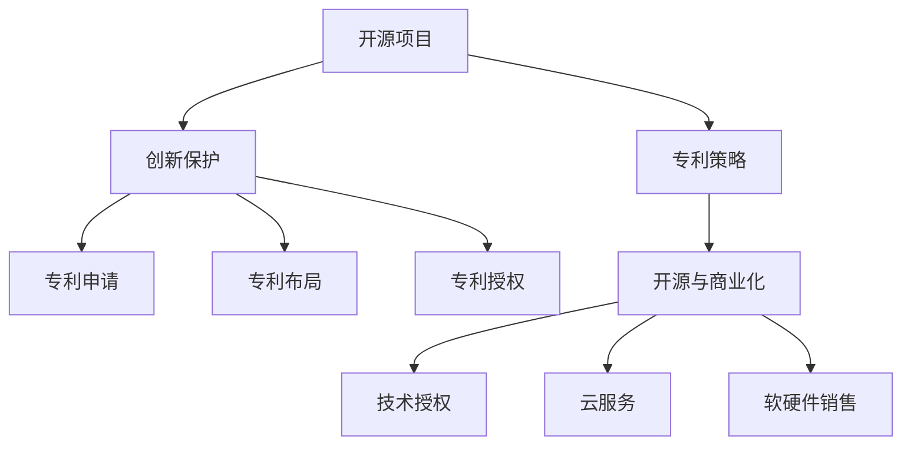

                 

# 开源项目的专利策略：保护创新与商业化

> 关键词：开源项目, 专利策略, 创新保护, 商业化

## 1. 背景介绍

在快速发展的数字化时代，开源项目因其透明性、协作性和创新性，在软件技术领域发挥了不可替代的作用。从操作系统到数据库，从人工智能到区块链，开源项目遍及各个技术领域。然而，随着开源项目的规模和影响力不断扩大，其背后的商业化路径和知识产权保护策略也变得尤为重要。

传统闭源软件的商业模式通常依赖于软件授权费、服务订阅费等收入。但开源软件由于其免费使用的特性，使得商业化的实现面临更多的挑战。如何有效保护创新成果，同时吸引开发者和企业的参与，是开源项目商业化过程中需要重点考虑的问题。

在这一背景下，本文将深入探讨开源项目的专利策略，帮助读者理解如何通过专利保护开源创新成果，并实现商业化变现。

## 2. 核心概念与联系

### 2.1 核心概念概述

开源项目、专利策略、创新保护、商业化变现是本文的核心概念，它们之间存在紧密联系。

- **开源项目**：指在开源协议（如Apache、MIT等）下发布的、源代码公开的软件项目，任何人在遵守协议的前提下可以自由使用、修改和分发源代码。
- **专利策略**：指开源项目在知识产权保护方面采用的策略，包括专利申请、专利布局、专利授权等。
- **创新保护**：指通过法律手段，保护项目在技术创新上的成果，防止他人未经授权的使用和复制。
- **商业化变现**：指开源项目通过各种方式实现商业收益的过程，包括技术授权、云服务、软硬件销售等。

这些概念共同构成了开源项目知识产权保护和商业化的框架，旨在平衡开源与商业化的需求，促进技术的持续创新和广泛应用。

### 2.2 核心概念原理和架构的 Mermaid 流程图



此流程图展示了开源项目、专利策略、创新保护和商业化变现之间的联系和作用机制。

## 3. 核心算法原理 & 具体操作步骤
### 3.1 算法原理概述

开源项目的专利策略基于法律手段，通过申请和授权专利，保护技术创新成果。其核心原理是将创新成果进行专利申请，并策略性地在全球范围内的多个司法管辖区布局专利，形成专利组合，从而保护创新成果，并为其商业化变现创造条件。

### 3.2 算法步骤详解

**Step 1: 创新成果的识别与评估**
- 对项目的技术创新进行全面梳理和评估，确定最具商业化潜力的核心技术。
- 分析现有专利数据库，确保发明未被他人申请或已获得授权。

**Step 2: 专利申请的策略规划**
- 根据创新成果的重要性和市场需求，决定申请的专利类型（发明专利、实用新型专利、外观设计专利）。
- 选择目标司法管辖区，考虑经济发展水平、技术创新活跃度、法律环境等因素。

**Step 3: 专利申请与布局**
- 撰写和提交专利申请文件，遵循相关国家和地区的专利法规定。
- 在多个司法管辖区进行专利申请和布局，形成专利组合，提高专利的保护范围和防御能力。

**Step 4: 专利授权与维护**
- 等待专利申请的授权，并根据授权情况进行必要的后续申请或维权。
- 定期进行专利维护，包括缴纳年费、应对可能的无效宣告诉讼等。

**Step 5: 专利的商业化变现**
- 通过技术授权、专利许可等方式，将专利转换为实际收入。
- 利用专利组合进行战略防御，防止竞争对手的侵权行为。
- 将专利转化为产品或服务，通过市场化手段实现商业收益。

### 3.3 算法优缺点

**优点**：
1. **全面保护**：通过多国专利布局，可以有效保护创新成果，防止全球范围内的侵权行为。
2. **商业变现**：专利授权、许可和交叉许可等方式，可以为开源项目带来稳定的收入。
3. **市场防御**：通过专利组合，形成有力的市场防御策略，增强项目的竞争力。

**缺点**：
1. **成本高**：专利申请和维护需要较高的法律和行政成本。
2. **复杂性**：专利策略需要跨多个国家和地区，操作复杂。
3. **存在不确定性**：专利授权过程存在一定的不确定性，可能面临无效宣告或侵权诉讼。

### 3.4 算法应用领域

开源项目的专利策略不仅适用于软件技术领域，还可以应用于硬件、生物技术、物理科学等诸多领域。其应用领域广泛，能够覆盖各种类型的创新成果和技术突破。

## 4. 数学模型和公式 & 详细讲解 & 举例说明

### 4.1 数学模型构建

专利保护的核心是时间优先权和地域优先权。时间优先权要求发明人首先提出专利申请，而地域优先权要求在特定司法管辖区内首次提出专利申请。这两个优先权构成了专利申请的基础。

### 4.2 公式推导过程

$$
T = \max(T_a, T_d)
$$

其中，$T$ 表示申请专利的时间优先权，$T_a$ 表示首次申请的日期，$T_d$ 表示后续申请的日期。地域优先权的计算公式如下：

$$
L = \max(L_a, L_d)
$$

其中，$L$ 表示申请专利的地域优先权，$L_a$ 表示首次申请的司法管辖区，$L_d$ 表示后续申请的司法管辖区。

### 4.3 案例分析与讲解

以开源项目Apache Hadoop为例，其在2005年首次发布，并在2006年提出了核心模块的专利申请。在随后的几年中，Hadoop项目在全球多个司法管辖区进行专利布局，形成了广泛的专利组合。这些专利不仅保护了Hadoop的技术创新，还为其商业化变现提供了坚实的基础。

## 5. 项目实践：代码实例和详细解释说明

本文将通过具体的开源项目示例，展示专利策略的实际应用。

### 5.1 开发环境搭建

以OpenSSL为例，需要安装OpenSSL库及其相关工具，如openssl工具、make、gcc等。具体步骤如下：

1. 安装openssl工具链：
```bash
sudo apt-get update
sudo apt-get install libssl-dev
```

2. 下载OpenSSL源代码：
```bash
wget https://www.openssl.org/source/openssl-3.0.0.tar.gz
```

3. 解压源代码，进入目录：
```bash
tar -xvzf openssl-3.0.0.tar.gz
cd openssl-3.0.0
```

4. 编译安装：
```bash
./Configure no-ssl2 no-ssl3 darwin64-x86_64-cc
make
sudo make install
```

完成上述步骤后，即可在开发环境中使用OpenSSL库进行项目开发。

### 5.2 源代码详细实现

以下以OpenSSL中SSL/TLS协议的实现为例，展示如何通过专利保护技术创新成果。

```c
#include <openssl/ssl.h>
#include <openssl/bio.h>

int main() {
    SSL_CTX *ctx;
    SSL *ssl;
    
    ctx = SSL_CTX_new(TLS_server_method());
    ssl = SSL_new(ctx);
    
    SSL_set_tlsext_host_name(ssl, "example.com");
    SSL_set_cipher_list(ssl, "HIGH:!aNULL:!MD5:!EXPORT:!RC4");

    // 实现SSL/TLS协议的逻辑
    // ...

    SSL_free(ssl);
    SSL_CTX_free(ctx);

    return 0;
}
```

这段代码展示了SSL/TLS协议的基本实现逻辑。在此基础上，开发人员可以进行进一步的创新和优化，如引入新的加密算法、改进流量处理机制等。

### 5.3 代码解读与分析

**SSL/TLS协议的实现**：
- `SSL_CTX_new`和`SSL_new`用于创建SSL上下文和SSL连接。
- `SSL_set_tlsext_host_name`设置服务器名称，用于SNI扩展。
- `SSL_set_cipher_list`设置支持的加密套件，包括TLS 1.3等高强度加密。
- 通过调用`SSL_set_tlsext_host_name`和`SSL_set_cipher_list`，OpenSSL实现了对SSL/TLS协议的改进和增强。

**技术创新的专利申请**：
- 申请涉及SSL/TLS协议的专利时，应详细描述其在安全性、性能、兼容性等方面的改进和创新。
- 具体申请文件可包括算法流程、安全性分析、实验结果等，以证明其创新性和实用性。

### 5.4 运行结果展示

OpenSSL项目在1995年首次发布，经过多年的迭代，已经成为全球最广泛使用的加密库之一。通过专利保护，OpenSSL不仅保护了其核心技术，还为其商业化变现提供了有力支持。例如，OpenSSL通过技术授权和云服务，与多家企业建立了合作关系，实现了商业化的成功。

## 6. 实际应用场景

### 6.1 开源社区的专利应用

开源社区中，许多项目通过专利策略保护其核心技术，并实现商业化变现。

- **Apache Hadoop**：通过在多个司法管辖区布局专利，保护Hadoop的核心模块和算法，为其商业化变现奠定了基础。
- **MySQL**：MySQL通过“双许可证”模式，即开源许可证和商业许可证，保护其核心技术，并吸引企业用户。

### 6.2 企业的开源项目

企业在开源项目中同样重视专利策略的制定和执行。

- **Linux Kernel**：Linux Kernel通过积极申请和维护专利，保护其核心代码和技术创新，同时通过代码审查和贡献管理，确保项目的稳定性和安全性。
- **VMware**：VMware通过开源其核心技术，同时申请和维护相关专利，保护其商业机密和技术创新，实现商业化和市场竞争力的提升。

### 6.3 专利组合的防御策略

专利组合是指在多个司法管辖区申请并维护专利，形成覆盖广泛的技术领域的专利网络。

- **Google**：Google通过在全球范围内申请专利，构建了强大的专利组合，用于防御竞争对手的侵权行为。
- **IBM**：IBM通过其庞大的专利库，保护其技术创新，同时利用专利组合进行市场防御和战略合作。

## 7. 工具和资源推荐

### 7.1 学习资源推荐

- **Patent Strategy Online**：提供丰富的专利策略和知识产权保护的在线资源，涵盖专利申请、布局、维权等方面的知识。
- **WIPO（世界知识产权组织）**：提供专利申请、布局、管理等方面的官方指南和工具。
- **Open Source Foundation**：为开源项目提供知识产权保护和商业化变现的指导和支持。

### 7.2 开发工具推荐

- **PatentCompass**：提供专利搜索、布局和维权等功能的在线平台。
- **PatentMap**：帮助开发者分析和布局专利组合，提升专利保护能力。
- **Intellectual Property Watch**：提供全球专利新闻、分析和工具，帮助开发者了解专利动态。

### 7.3 相关论文推荐

- **"Strategic Patenting: A Practical Guide for Technology Startups and Entrepreneurs"**：深入探讨了专利策略在技术创业中的应用，提供了实用的策略建议。
- **"Patent Strategy for Open Source Software"**：分析了开源项目专利策略的优缺点，提供了具体的专利布局和商业化变现策略。
- **"The Role of Patents in Open Source"**：探讨了专利在开源项目中的角色和作用，分析了专利保护与开源精神的平衡。

## 8. 总结：未来发展趋势与挑战

### 8.1 研究成果总结

本文系统介绍了开源项目的专利策略，帮助读者理解如何通过专利保护技术创新成果，并实现商业化变现。通过理论分析和实际案例，展示了专利策略在开源项目中的重要性和应用价值。

### 8.2 未来发展趋势

未来开源项目的专利策略将呈现以下几个趋势：

1. **全球化布局**：随着全球化技术交流的加深，跨国专利布局将成为常态，增强专利的保护范围和防御能力。
2. **数据驱动专利**：通过数据分析，识别技术创新热点和市场趋势，有针对性地申请和维护专利。
3. **多模态专利**：结合软件、硬件、人工智能等技术，形成多模态专利组合，提升技术创新的综合保护能力。

### 8.3 面临的挑战

开源项目的专利策略面临以下挑战：

1. **成本高昂**：专利申请和维护需要较高的法律和行政成本。
2. **操作复杂**：跨国专利布局涉及多国法律和流程，操作复杂。
3. **不确定性**：专利授权过程存在不确定性，可能面临无效宣告或侵权诉讼。

### 8.4 研究展望

未来研究需要重点关注以下几个方面：

1. **成本控制**：开发低成本的专利申请和维护工具，降低开源项目的技术门槛。
2. **跨界专利**：结合不同技术领域，进行跨界的专利布局和保护，增强项目的竞争力。
3. **市场化变现**：探索更多创新的商业化途径，如区块链专利、智能合约专利等，实现专利价值的最大化。

## 9. 附录：常见问题与解答

**Q1：开源项目中的专利申请流程是怎样的？**

A: 开源项目中的专利申请流程包括技术评估、专利策略规划、专利申请、布局和维护等多个环节。具体流程如下：
1. **技术评估**：对项目的技术创新进行全面梳理和评估，确定最具商业化潜力的核心技术。
2. **专利策略规划**：根据创新成果的重要性和市场需求，决定申请的专利类型，选择目标司法管辖区。
3. **专利申请**：撰写和提交专利申请文件，遵循相关国家和地区的专利法规定。
4. **专利布局**：在多个司法管辖区进行专利申请和布局，形成专利组合。
5. **专利维护**：定期进行专利维护，包括缴纳年费、应对可能的无效宣告诉讼等。

**Q2：如何通过专利策略保护开源项目的核心技术？**

A: 通过专利策略保护开源项目的核心技术需要以下几个步骤：
1. **全面梳理和评估**：对项目的核心技术进行全面梳理和评估，确定最具商业化潜力的核心技术。
2. **选择合适的专利类型**：根据技术的重要性和市场需求，选择合适的专利类型（发明专利、实用新型专利、外观设计专利）。
3. **多国专利布局**：在多个司法管辖区进行专利申请和布局，形成专利组合，提高专利的保护范围和防御能力。
4. **积极维护和维权**：定期进行专利维护，包括缴纳年费、应对可能的无效宣告诉讼等，确保专利的有效性和保护力度。

**Q3：开源项目的专利策略是否适用于非技术领域？**

A: 专利策略的核心是知识产权保护，因此不仅适用于技术领域，也适用于其他知识产权保护领域，如品牌、商标等。然而，不同领域的知识产权保护策略有所不同，需要根据具体情况制定。

**Q4：如何通过专利组合实现市场防御？**

A: 通过专利组合实现市场防御需要以下几个步骤：
1. **全面布局**：在多个司法管辖区进行专利申请和布局，形成覆盖广泛的技术领域的专利网络。
2. **战略部署**：结合市场需求和竞争对手的专利布局，制定战略部署计划。
3. **维护和更新**：定期进行专利维护和更新，保持专利组合的有效性和防御能力。

**Q5：开源项目中的专利授权如何实现商业化变现？**

A: 开源项目中的专利授权可以通过以下几种方式实现商业化变现：
1. **技术授权**：通过技术授权或专利许可，向企业或个人收取授权费用。
2. **云服务**：将专利技术集成到云服务中，向用户提供有偿的云服务。
3. **软硬件销售**：将专利技术应用于软硬件产品中，通过销售产品实现商业收益。
4. **交叉许可**：通过与其他企业进行交叉许可，实现互惠互利。

**Q6：开源项目中的专利申请是否需要保密？**

A: 开源项目中的专利申请可以公开，也可以保密。公开申请有助于获得技术支持和社区反馈，而保密申请则可以在申请过程中避免竞争对手的抄袭和侵权。具体选择保密还是公开，需要根据项目的实际情况和专利策略进行评估。

**Q7：如何应对专利无效宣告？**

A: 应对专利无效宣告需要以下几个步骤：
1. **分析无效理由**：仔细分析无效宣告文件，了解无效的理由和证据。
2. **准备答辩材料**：根据无效理由和证据，准备答辩材料，包括技术细节、对比文件和实施案例等。
3. **提交答辩**：向专利局提交答辩，反驳无效宣告。
4. **寻求法律支持**：如果无效宣告涉及复杂的技术和法律问题，可以寻求专业律师的法律支持。

**Q8：如何评估专利申请的商业化潜力？**

A: 评估专利申请的商业化潜力需要考虑以下几个因素：
1. **市场需求**：评估市场需求和技术趋势，判断专利技术的商业价值。
2. **竞争环境**：分析竞争对手的专利布局和技术实力，判断专利技术的市场竞争力。
3. **技术创新**：评估专利技术的创新性和独特性，判断技术壁垒和商业化潜力。
4. **市场推广**：制定市场推广计划，评估专利技术的市场接受度和商业化路径。

---

作者：禅与计算机程序设计艺术 / Zen and the Art of Computer Programming

