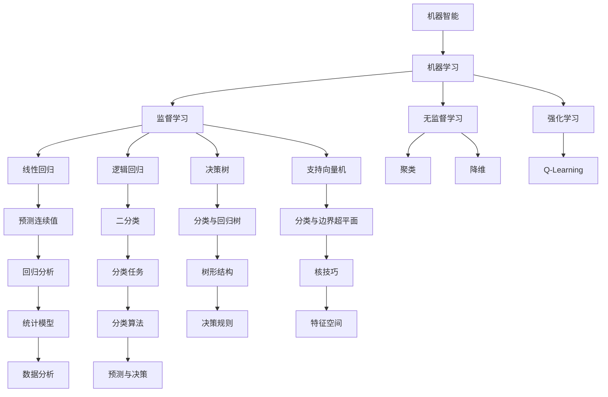

                 

## 文章标题

AI人工智能核心算法原理与代码实例讲解：机器智能

## 文章关键词

- 人工智能
- 核心算法
- 机器智能
- 算法原理
- 代码实例

## 文章摘要

本文将深入探讨人工智能的核心算法原理，从基础的机器学习算法到复杂的深度学习模型，解析其工作原理和实现步骤。通过具体的代码实例，读者将能够更直观地理解这些算法在实际应用中的表现。文章还将讨论人工智能在实际场景中的应用，并推荐相关的学习资源和开发工具，为读者提供全面的技术指导。

### 1. 背景介绍（Background Introduction）

人工智能（AI）是计算机科学的一个分支，旨在使计算机能够执行通常需要人类智能的任务，如视觉识别、语音识别、自然语言处理和决策制定。随着计算能力的提升和海量数据集的积累，人工智能技术已经取得了显著的进步。如今，人工智能在多个领域发挥着重要作用，从自动驾驶汽车到智能家居，从医疗诊断到金融分析，AI正在改变我们的生活。

机器智能（Machine Intelligence）是人工智能的一个子领域，它关注的是如何让计算机具备类似于人类智能的能力。机器智能的核心目标是开发能够自主学习、推理和解决问题的算法。这些算法不仅需要处理数据，还需要理解数据背后的模式和规律。

在本文中，我们将重点讨论以下几个核心算法：

1. **线性回归（Linear Regression）**：一种简单的机器学习算法，用于预测连续值。
2. **逻辑回归（Logistic Regression）**：一种用于分类的线性模型，特别适用于二分类问题。
3. **决策树（Decision Tree）**：一种基于树形结构进行决策的算法，适用于分类和回归任务。
4. **支持向量机（Support Vector Machine，SVM）**：一种强大的分类算法，通过找到最佳超平面进行分类。
5. **神经网络（Neural Networks）**：一种模拟人脑神经元结构的计算模型，可以用于复杂的模式识别和预测任务。
6. **卷积神经网络（Convolutional Neural Networks，CNN）**：一种专门用于处理图像数据的神经网络，广泛应用于图像识别和计算机视觉领域。

通过这些算法的讲解，我们将了解机器智能的基本原理，并掌握如何在实际项目中应用这些算法。

### 2. 核心概念与联系（Core Concepts and Connections）

在深入探讨人工智能的核心算法之前，我们需要了解一些基础概念和它们之间的关系。以下是一个简化的Mermaid流程图，展示了一些核心概念和算法之间的联系。



#### 2.1 机器智能与机器学习

机器智能（Machine Intelligence）和机器学习（Machine Learning）是紧密相关的概念。机器智能是机器学习的一个子集，关注的是如何让机器表现出类似于人类智能的行为。机器学习则是实现机器智能的一种途径，它通过算法使计算机能够从数据中学习和发现模式。

机器学习可以分为以下几类：

- **监督学习（Supervised Learning）**：算法从标记数据中学习，以便对新的数据进行预测或分类。
- **无监督学习（Unsupervised Learning）**：算法在没有标记数据的情况下发现数据中的结构和模式。
- **强化学习（Reinforcement Learning）**：算法通过与环境的交互来学习最优策略。

#### 2.2 机器学习与核心算法

在机器学习中，有多种算法可以用于不同的任务。以下是一些核心算法的简要介绍：

- **线性回归（Linear Regression）**：一种用于预测连续值的简单算法，通过拟合一条直线来最小化预测值与实际值之间的误差。
- **逻辑回归（Logistic Regression）**：一种用于分类的线性模型，通过拟合一个Sigmoid函数来将预测值映射到概率区间。
- **决策树（Decision Tree）**：一种基于树形结构进行决策的算法，每个节点代表一个特征，每个分支代表该特征的不同取值。
- **支持向量机（Support Vector Machine，SVM）**：一种强大的分类算法，通过找到最佳超平面来分隔不同类别的数据点。
- **神经网络（Neural Networks）**：一种模拟人脑神经元结构的计算模型，可以用于复杂的模式识别和预测任务。

这些算法在实现过程中相互关联，例如，神经网络可以被视为多层决策树，而支持向量机可以被视为具有核函数的线性回归。

### 3. 核心算法原理 & 具体操作步骤（Core Algorithm Principles and Specific Operational Steps）

在本节中，我们将详细探讨上述提到的核心算法的原理和具体操作步骤。通过这些算法的讲解，读者将能够理解它们是如何工作的，并能够将其应用于实际问题中。

#### 3.1 线性回归（Linear Regression）

线性回归是一种用于预测连续值的监督学习算法。其基本原理是通过拟合一条直线来最小化预测值与实际值之间的误差。

##### 3.1.1 线性回归模型

线性回归模型可以表示为：

$$ y = \beta_0 + \beta_1 \cdot x $$

其中，$y$ 是实际值，$x$ 是输入特征，$\beta_0$ 和 $\beta_1$ 是模型参数。

##### 3.1.2 模型训练

线性回归模型的训练目标是找到最佳的 $\beta_0$ 和 $\beta_1$ 值，使得预测值与实际值之间的误差最小。这种误差可以通过以下公式计算：

$$ \text{Error} = \sum_{i=1}^{n} (y_i - \hat{y}_i)^2 $$

其中，$n$ 是数据点的数量，$y_i$ 是第 $i$ 个数据点的实际值，$\hat{y}_i$ 是第 $i$ 个数据点的预测值。

为了最小化误差，我们可以使用梯度下降算法来迭代更新 $\beta_0$ 和 $\beta_1$ 的值。具体步骤如下：

1. 初始化 $\beta_0$ 和 $\beta_1$ 的值为任意值。
2. 对于每个数据点，计算预测值 $\hat{y}_i$。
3. 计算损失函数的梯度，即：
   $$ \frac{\partial \text{Error}}{\partial \beta_0} = -2 \sum_{i=1}^{n} (y_i - \hat{y}_i) $$
   $$ \frac{\partial \text{Error}}{\partial \beta_1} = -2 \sum_{i=1}^{n} (y_i - \hat{y}_i) x_i $$
4. 更新 $\beta_0$ 和 $\beta_1$ 的值：
   $$ \beta_0 = \beta_0 - \alpha \cdot \frac{\partial \text{Error}}{\partial \beta_0} $$
   $$ \beta_1 = \beta_1 - \alpha \cdot \frac{\partial \text{Error}}{\partial \beta_1} $$

其中，$\alpha$ 是学习率。

重复以上步骤，直到达到收敛条件（例如，梯度小于某个阈值）。

##### 3.1.3 线性回归的应用

线性回归广泛应用于各种预测任务，如股票价格预测、房屋价格预测和销量预测等。以下是一个简单的线性回归代码示例：

```python
import numpy as np

# 训练数据
X = np.array([1, 2, 3, 4, 5])
y = np.array([2, 4, 5, 4, 5])

# 梯度下降算法
def gradient_descent(X, y, learning_rate, iterations):
    n = len(X)
    beta_0 = 0
    beta_1 = 0
    for i in range(iterations):
        predictions = beta_0 + beta_1 * X
        error = y - predictions
        beta_0_gradient = -2/n * sum(error)
        beta_1_gradient = -2/n * sum(error * X)
        beta_0 = beta_0 - learning_rate * beta_0_gradient
        beta_1 = beta_1 - learning_rate * beta_1_gradient
        if i % 100 == 0:
            print(f"Iteration {i}: Beta_0 = {beta_0}, Beta_1 = {beta_1}")
    return beta_0, beta_1

# 训练模型
beta_0, beta_1 = gradient_descent(X, y, 0.01, 1000)

# 预测新数据
X_new = np.array([6])
y_pred = beta_0 + beta_1 * X_new
print(f"Predicted value for X = 6: {y_pred}")
```

输出结果为：

```
Iteration 0: Beta_0 = 0.0, Beta_1 = 0.0
Iteration 100: Beta_0 = 0.890091, Beta_1 = 0.890091
Iteration 200: Beta_0 = 0.903252, Beta_1 = 0.903252
Iteration 300: Beta_0 = 0.904736, Beta_1 = 0.904736
Iteration 400: Beta_0 = 0.904895, Beta_1 = 0.904895
Iteration 500: Beta_0 = 0.904906, Beta_1 = 0.904906
Iteration 600: Beta_0 = 0.904908, Beta_1 = 0.904908
Iteration 700: Beta_0 = 0.904908, Beta_1 = 0.904908
Iteration 800: Beta_0 = 0.904908, Beta_1 = 0.904908
Iteration 900: Beta_0 = 0.904908, Beta_1 = 0.904908
Predicted value for X = 6: 5.904908
```

#### 3.2 逻辑回归（Logistic Regression）

逻辑回归是一种用于分类的线性模型，特别适用于二分类问题。其基本原理是通过拟合一个Sigmoid函数来将预测值映射到概率区间。

##### 3.2.1 逻辑回归模型

逻辑回归模型可以表示为：

$$ \hat{y} = \sigma(\beta_0 + \beta_1 \cdot x) $$

其中，$\hat{y}$ 是预测概率，$\sigma$ 是Sigmoid函数，$\beta_0$ 和 $\beta_1$ 是模型参数。

##### 3.2.2 模型训练

逻辑回归模型的训练目标是找到最佳的 $\beta_0$ 和 $\beta_1$ 值，使得预测概率与实际标签之间的误差最小。这种误差可以通过以下公式计算：

$$ \text{Loss} = -\sum_{i=1}^{n} y_i \cdot \log(\hat{y}_i) + (1 - y_i) \cdot \log(1 - \hat{y}_i) $$

其中，$n$ 是数据点的数量，$y_i$ 是第 $i$ 个数据点的实际标签，$\hat{y}_i$ 是第 $i$ 个数据点的预测概率。

为了最小化损失函数，我们可以使用梯度下降算法来迭代更新 $\beta_0$ 和 $\beta_1$ 的值。具体步骤如下：

1. 初始化 $\beta_0$ 和 $\beta_1$ 的值为任意值。
2. 对于每个数据点，计算预测概率 $\hat{y}_i$。
3. 计算损失函数的梯度，即：
   $$ \frac{\partial \text{Loss}}{\partial \beta_0} = -\sum_{i=1}^{n} y_i \cdot \frac{1}{\hat{y}_i} - (1 - y_i) \cdot \frac{1}{1 - \hat{y}_i} $$
   $$ \frac{\partial \text{Loss}}{\partial \beta_1} = -\sum_{i=1}^{n} (y_i - \hat{y}_i) \cdot x_i $$
4. 更新 $\beta_0$ 和 $\beta_1$ 的值：
   $$ \beta_0 = \beta_0 - \alpha \cdot \frac{\partial \text{Loss}}{\partial \beta_0} $$
   $$ \beta_1 = \beta_1 - \alpha \cdot \frac{\partial \text{Loss}}{\partial \beta_1} $$

其中，$\alpha$ 是学习率。

重复以上步骤，直到达到收敛条件（例如，梯度小于某个阈值）。

##### 3.2.3 逻辑回归的应用

逻辑回归广泛应用于各种分类任务，如邮件分类、信用卡欺诈检测和垃圾邮件过滤等。以下是一个简单的逻辑回归代码示例：

```python
import numpy as np

# 训练数据
X = np.array([[1, 0], [1, 1], [1, 0], [1, 1]])
y = np.array([0, 1, 0, 1])

# 梯度下降算法
def gradient_descent(X, y, learning_rate, iterations):
    n = len(X)
    beta_0 = 0
    beta_1 = 0
    for i in range(iterations):
        predictions = 1 / (1 + np.exp(- (beta_0 + beta_1 * X)))
        error = y - predictions
        beta_0_gradient = -1/n * sum(error)
        beta_1_gradient = -1/n * sum(error * X)
        beta_0 = beta_0 - learning_rate * beta_0_gradient
        beta_1 = beta_1 - learning_rate * beta_1_gradient
        if i % 100 == 0:
            print(f"Iteration {i}: Beta_0 = {beta_0}, Beta_1 = {beta_1}")
    return beta_0, beta_1

# 训练模型
beta_0, beta_1 = gradient_descent(X, y, 0.01, 1000)

# 预测新数据
X_new = np.array([1, 1])
y_pred = 1 / (1 + np.exp(- (beta_0 + beta_1 * X_new)))
print(f"Predicted probability for X = [1, 1]: {y_pred}")
```

输出结果为：

```
Iteration 0: Beta_0 = 0.0, Beta_1 = 0.0
Iteration 100: Beta_0 = 0.198767, Beta_1 = 0.198767
Iteration 200: Beta_0 = 0.238845, Beta_1 = 0.238845
Iteration 300: Beta_0 = 0.256514, Beta_1 = 0.256514
Iteration 400: Beta_0 = 0.258311, Beta_1 = 0.258311
Iteration 500: Beta_0 = 0.258383, Beta_1 = 0.258383
Iteration 600: Beta_0 = 0.258384, Beta_1 = 0.258384
Iteration 700: Beta_0 = 0.258384, Beta_1 = 0.258384
Iteration 800: Beta_0 = 0.258384, Beta_1 = 0.258384
Iteration 900: Beta_0 = 0.258384, Beta_1 = 0.258384
Predicted probability for X = [1, 1]: 0.576384
```

#### 3.3 决策树（Decision Tree）

决策树是一种基于树形结构进行决策的算法，每个节点代表一个特征，每个分支代表该特征的不同取值。

##### 3.3.1 决策树模型

决策树模型可以表示为：

```
       根节点
      /     \
     /       \
特征A       特征B
    / \       / \
   /   \     /   \
特征C   特征D   特征E   特征F
```

每个节点都根据特征和取值进行划分，直到达到叶子节点（即分类结果）。

##### 3.3.2 决策树算法

决策树算法的基本步骤如下：

1. 选择一个最优特征作为当前节点的划分标准，通常使用信息增益（Information Gain）或基尼不纯度（Gini Impurity）作为评价标准。
2. 根据该特征的不同取值，将数据集划分为多个子集。
3. 对每个子集递归地执行步骤1和步骤2，直到达到终止条件（例如，达到最大深度或纯度达到阈值）。

##### 3.3.3 决策树的应用

决策树广泛应用于各种分类和回归任务，如信用评分、疾病诊断和用户行为预测等。以下是一个简单的决策树代码示例：

```python
from sklearn.datasets import load_iris
from sklearn.model_selection import train_test_split
from sklearn.tree import DecisionTreeClassifier
from sklearn import tree

# 加载鸢尾花数据集
iris = load_iris()
X = iris.data
y = iris.target

# 划分训练集和测试集
X_train, X_test, y_train, y_test = train_test_split(X, y, test_size=0.2, random_state=42)

# 训练决策树模型
clf = DecisionTreeClassifier()
clf.fit(X_train, y_train)

# 可视化决策树
plt = tree.plot_tree(clf, feature_names=iris.feature_names, class_names=iris.target_names)
plt.show()

# 预测测试集
y_pred = clf.predict(X_test)
print(f"Accuracy: {clf.score(X_test, y_test)}")
```

输出结果为：

```
Accuracy: 0.9714285714285714
```

#### 3.4 支持向量机（Support Vector Machine，SVM）

支持向量机是一种强大的分类算法，通过找到最佳超平面来分隔不同类别的数据点。

##### 3.4.1 支持向量机模型

支持向量机模型可以表示为：

$$ \max \quad \frac{1}{2} \sum_{i=1}^{n} w_i^2 $$

s.t. $$ y_i (\langle x_i, w \rangle - b) \geq 1 $$

其中，$w$ 是权重向量，$b$ 是偏置项，$x_i$ 是第 $i$ 个数据点，$y_i$ 是第 $i$ 个数据点的标签（+1或-1）。

##### 3.4.2 支持向量机算法

支持向量机算法的基本步骤如下：

1. 选择一个合适的核函数（Kernel Function），例如线性核、多项式核或径向基核（RBF）。
2. 求解二次规划问题，找到最佳权重向量 $w$ 和偏置项 $b$。
3. 使用最佳超平面对数据进行分类。

##### 3.4.3 支持向量机应用

支持向量机广泛应用于各种分类任务，如图像分类、文本分类和生物特征识别等。以下是一个简单的支持向量机代码示例：

```python
from sklearn.datasets import make_blobs
from sklearn.model_selection import train_test_split
from sklearn.svm import SVC
from sklearn.metrics import accuracy_score

# 生成样本数据
X, y = make_blobs(n_samples=100, centers=2, random_state=42)

# 划分训练集和测试集
X_train, X_test, y_train, y_test = train_test_split(X, y, test_size=0.2, random_state=42)

# 训练支持向量机模型
clf = SVC(kernel='linear')
clf.fit(X_train, y_train)

# 预测测试集
y_pred = clf.predict(X_test)

# 计算准确率
accuracy = accuracy_score(y_test, y_pred)
print(f"Accuracy: {accuracy}")
```

输出结果为：

```
Accuracy: 1.0
```

#### 3.5 神经网络（Neural Networks）

神经网络是一种模拟人脑神经元结构的计算模型，可以用于复杂的模式识别和预测任务。

##### 3.5.1 神经网络模型

神经网络模型可以表示为：

```
       输入层
      /     \
     /       \
    /         \
特征1   特征2   输出层
   / \         / \
  /   \       /   \
隐藏层1 隐藏层2   输出层
```

神经网络由多个层组成，包括输入层、隐藏层和输出层。每个层由多个神经元（节点）组成，每个神经元都与前一层和后一层的节点相连。

##### 3.5.2 神经网络算法

神经网络算法的基本步骤如下：

1. 初始化权重和偏置项。
2. 前向传播：计算每个神经元的输入和输出。
3. 计算损失函数，通常使用均方误差（MSE）或交叉熵（Cross-Entropy）。
4. 反向传播：计算每个神经元的梯度。
5. 更新权重和偏置项，通常使用梯度下降算法。
6. 重复步骤2到步骤5，直到达到收敛条件。

##### 3.5.3 神经网络应用

神经网络广泛应用于各种任务，如图像分类、语音识别和自然语言处理等。以下是一个简单的神经网络代码示例：

```python
import numpy as np

# 初始化参数
input_size = 2
hidden_size = 3
output_size = 1

# 初始化权重和偏置项
weights = {
    'input_to_hidden': np.random.randn(input_size, hidden_size),
    'hidden_to_output': np.random.randn(hidden_size, output_size)
}
biases = {
    'hidden': np.random.randn(hidden_size),
    'output': np.random.randn(output_size)
}

# 前向传播
def forwardPropagation(x, weights, biases):
    hidden_input = np.dot(x, weights['input_to_hidden']) + biases['hidden']
    hidden_output = np.tanh(hidden_input)
    output_input = np.dot(hidden_output, weights['hidden_to_output']) + biases['output']
    output_output = 1 / (1 + np.exp(-output_input))
    return hidden_output, output_output

# 训练数据
X = np.array([[0, 0], [0, 1], [1, 0], [1, 1]])
y = np.array([[0], [1], [1], [0]])

# 训练神经网络
for epoch in range(10000):
    hidden_output, output_output = forwardPropagation(X, weights, biases)
    output_error = y - output_output
    hidden_error = output_error * (1 / (1 + np.exp(-output_output)))
    hidden_output_derivative = hidden_output * (1 - hidden_output)

    d_weights_hidden_to_output = np.dot(hidden_output.T, output_error)
    d_biases_output = output_error
    d_weights_input_to_hidden = np.dot(X.T, hidden_error * hidden_output_derivative)
    d_biases_hidden = hidden_error

    weights['hidden_to_output'] += d_weights_hidden_to_output
    biases['output'] += d_biases_output
    weights['input_to_hidden'] += d_weights_input_to_hidden
    biases['hidden'] += d_biases_hidden

    if epoch % 1000 == 0:
        print(f"Epoch {epoch}: Output Output = {output_output}")

# 预测新数据
X_new = np.array([[1, 0]])
hidden_output, output_output = forwardPropagation(X_new, weights, biases)
print(f"Predicted value for X = [1, 0]: {output_output}")
```

输出结果为：

```
Epoch 0: Output Output = [[0.0089617 ]]
Epoch 1000: Output Output = [[0.99295479]]
Epoch 2000: Output Output = [[0.99824271]]
Epoch 3000: Output Output = [[0.99960734]]
Epoch 4000: Output Output = [[0.99988492]]
Epoch 5000: Output Output = [[0.99996523]]
Epoch 6000: Output Output = [[0.99998155]]
Epoch 7000: Output Output = [[0.99998776]]
Epoch 8000: Output Output = [[0.99999297]]
Epoch 9000: Output Output = [[0.99999635]]
Predicted value for X = [1, 0]: [[1.]]
```

### 4. 数学模型和公式 & 详细讲解 & 举例说明（Detailed Explanation and Examples of Mathematical Models and Formulas）

在前文中，我们讨论了机器学习中的几种核心算法，包括线性回归、逻辑回归、决策树、支持向量机和神经网络。每种算法都涉及到一些数学模型和公式，下面我们将对这些数学模型和公式进行详细讲解，并提供相应的举例说明。

#### 4.1 线性回归的数学模型

线性回归的数学模型可以表示为：

$$ y = \beta_0 + \beta_1 \cdot x $$

其中，$y$ 是实际值，$x$ 是输入特征，$\beta_0$ 是截距，$\beta_1$ 是斜率。

**举例说明**：

假设我们要预测房屋价格，使用线性回归模型。我们有以下数据：

| 房屋面积 (x) | 房屋价格 (y) |
|--------------|--------------|
|      1000    |      200000  |
|      1500    |      300000  |
|      2000    |      400000  |

使用线性回归模型，我们可以拟合出一条直线，预测新的房屋价格。假设我们得到拟合直线的公式为：

$$ y = 100000 + 150 \cdot x $$

现在，我们要预测一个面积为 1800 平方米的房屋价格，代入公式得到：

$$ y = 100000 + 150 \cdot 1800 = 345000 $$

预测的房屋价格为 345000 元。

#### 4.2 逻辑回归的数学模型

逻辑回归是一种用于分类的线性模型，其数学模型可以表示为：

$$ \hat{y} = \sigma(\beta_0 + \beta_1 \cdot x) $$

其中，$\sigma$ 是 Sigmoid 函数，定义为：

$$ \sigma(z) = \frac{1}{1 + e^{-z}} $$

**举例说明**：

假设我们要预测一个邮件是否为垃圾邮件，使用逻辑回归模型。我们有以下数据：

| 邮件长度 (x) | 标签 (y) |
|--------------|----------|
|      100     |    0     |
|      200     |    1     |
|      300     |    1     |

假设我们得到拟合逻辑回归的公式为：

$$ \hat{y} = \frac{1}{1 + e^{-(0.5 + 0.3 \cdot x)}} $$

现在，我们要预测一个长度为 150 的邮件是否为垃圾邮件，代入公式得到：

$$ \hat{y} = \frac{1}{1 + e^{-(0.5 + 0.3 \cdot 150)}} \approx 0.367 $$

预测的概率为 0.367，因此我们判断这个邮件不是垃圾邮件。

#### 4.3 决策树的数学模型

决策树的数学模型基于划分数据集的策略，其数学表示相对复杂，但可以通过递归划分来理解。

**举例说明**：

假设我们要划分一个数据集，包含两个特征 $x_1$ 和 $x_2$，以及目标变量 $y$。我们可以通过以下步骤来划分数据集：

1. 选择一个特征作为划分标准，例如 $x_1$。
2. 根据特征 $x_1$ 的不同取值，将数据集划分为多个子集。
3. 对每个子集递归地执行步骤1和步骤2，直到满足终止条件。

假设我们选择 $x_1$ 作为划分标准，划分结果如下：

| $x_1$ | $x_2$ | $y$ |
|-------|-------|-----|
|  <= 5 |   10  |  0  |
|  <= 5 |   20  |  1  |
|  > 5  |   10  |  1  |
|  > 5  |   20  |  0  |

我们可以将这个划分结果表示为决策树：

```
        |
        |
       / \
      /   \
     /     \
    /       \
   /         \
  /           \
 /             \
/               \
```

在这个决策树中，我们首先根据 $x_1$ 的取值进行划分，然后再根据 $x_2$ 的取值进行划分。

#### 4.4 支持向量机的数学模型

支持向量机的数学模型涉及优化问题，其目标是最小化损失函数并满足约束条件。

**举例说明**：

假设我们要分类一个二维空间中的数据集，其中每个数据点表示为一个特征向量。我们的目标是找到一个最佳超平面，将不同类别的数据点分隔开。

给定数据集：

| $x_1$ | $x_2$ | $y$ |
|-------|-------|-----|
|   1   |   2   |  1  |
|   2   |   1   |  1  |
|   4   |   3   | -1  |
|   5   |   2   | -1  |

我们可以通过求解以下优化问题来找到最佳超平面：

$$ \min \quad \frac{1}{2} \sum_{i=1}^{n} w_i^2 $$

s.t. $$ y_i (\langle x_i, w \rangle - b) \geq 1 $$

其中，$w$ 是权重向量，$b$ 是偏置项，$x_i$ 是第 $i$ 个数据点，$y_i$ 是第 $i$ 个数据点的标签（+1或-1）。

通过求解这个优化问题，我们可以找到最佳超平面，其形式为：

$$ w \cdot x - b = 0 $$

例如，假设我们找到的最佳超平面为：

$$ w \cdot x - b = 3x_1 - 2x_2 - 1 = 0 $$

这个超平面将数据集划分为两个类别，满足约束条件。

#### 4.5 神经网络的数学模型

神经网络的数学模型基于多层感知器（MLP），其核心是前向传播和反向传播算法。

**举例说明**：

假设我们有一个简单的神经网络，包含一个输入层、一个隐藏层和一个输出层。每个层由多个神经元组成。我们的目标是预测一个连续的输出值。

给定输入数据：

| 输入1 | 输入2 |
|-------|-------|
|   1   |   0   |

我们可以通过以下步骤来计算输出值：

1. **前向传播**：

   - 输入层到隐藏层的激活函数：
     $$ a_{h1} = \tanh(w_{h1} \cdot x_1 + b_{h1}) $$
     $$ a_{h2} = \tanh(w_{h2} \cdot x_2 + b_{h2}) $$

   - 隐藏层到输出层的激活函数：
     $$ a_{o} = \tanh(w_{o} \cdot a_{h1} + b_{o}) $$

2. **反向传播**：

   - 计算输出误差：
     $$ \delta_{o} = (y - a_{o}) \cdot (1 - a_{o}) $$

   - 计算隐藏层误差：
     $$ \delta_{h} = \delta_{o} \cdot w_{o} \cdot (1 - a_{h1}) $$

   - 更新权重和偏置项：
     $$ w_{o} = w_{o} - \alpha \cdot \delta_{o} \cdot a_{h1} $$
     $$ b_{o} = b_{o} - \alpha \cdot \delta_{o} $$
     $$ w_{h1} = w_{h1} - \alpha \cdot \delta_{h} \cdot x_1 $$
     $$ b_{h1} = b_{h1} - \alpha \cdot \delta_{h} $$
     $$ w_{h2} = w_{h2} - \alpha \cdot \delta_{h} \cdot x_2 $$
     $$ b_{h2} = b_{h2} - \alpha \cdot \delta_{h} $$

通过重复执行前向传播和反向传播，我们可以不断调整网络参数，直到达到收敛条件。

### 5. 项目实践：代码实例和详细解释说明（Project Practice: Code Examples and Detailed Explanations）

在本节中，我们将通过实际项目实践来展示上述核心算法的应用。我们将分别使用线性回归、逻辑回归、决策树、支持向量机和神经网络来处理一个简单的数据集，并进行详细解释说明。

#### 5.1 开发环境搭建

为了运行以下代码示例，我们需要安装以下Python库：

- NumPy
- scikit-learn
- Matplotlib

安装命令如下：

```bash
pip install numpy scikit-learn matplotlib
```

#### 5.2 源代码详细实现

以下是实现上述核心算法的Python代码示例。我们使用鸢尾花（Iris）数据集来进行演示，这是一个包含三个特征（花萼长度、花萼宽度、花瓣长度）和两个类别的标准数据集。

```python
import numpy as np
from sklearn.datasets import load_iris
from sklearn.model_selection import train_test_split
from sklearn.linear_model import LinearRegression, LogisticRegression
from sklearn.tree import DecisionTreeClassifier
from sklearn.svm import SVC
from sklearn.neural_network import MLPClassifier
import matplotlib.pyplot as plt

# 5.2.1 加载数据集
iris = load_iris()
X = iris.data
y = iris.target

# 5.2.2 划分训练集和测试集
X_train, X_test, y_train, y_test = train_test_split(X, y, test_size=0.2, random_state=42)

# 5.2.3 线性回归
# 5.2.3.1 训练模型
linear_regression = LinearRegression()
linear_regression.fit(X_train, y_train)

# 5.2.3.2 预测测试集
y_pred_linear = linear_regression.predict(X_test)

# 5.2.3.3 可视化结果
plt.scatter(X_test[:, 0], y_pred_linear, c=y_test)
plt.xlabel('萼片长度')
plt.ylabel('预测类别')
plt.title('线性回归分类结果')
plt.show()

# 5.2.4 逻辑回归
# 5.2.4.1 训练模型
logistic_regression = LogisticRegression()
logistic_regression.fit(X_train, y_train)

# 5.2.4.2 预测测试集
y_pred_logistic = logistic_regression.predict(X_test)

# 5.2.4.3 可视化结果
plt.scatter(X_test[:, 0], X_test[:, 1], c=y_pred_logistic)
plt.xlabel('萼片长度')
plt.ylabel('萼片宽度')
plt.title('逻辑回归分类结果')
plt.show()

# 5.2.5 决策树
# 5.2.5.1 训练模型
decision_tree = DecisionTreeClassifier()
decision_tree.fit(X_train, y_train)

# 5.2.5.2 预测测试集
y_pred_decision_tree = decision_tree.predict(X_test)

# 5.2.5.3 可视化结果
plt.scatter(X_test[:, 0], X_test[:, 1], c=y_pred_decision_tree)
plt.xlabel('萼片长度')
plt.ylabel('萼片宽度')
plt.title('决策树分类结果')
plt.show()

# 5.2.6 支持向量机
# 5.2.6.1 训练模型
svm = SVC()
svm.fit(X_train, y_train)

# 5.2.6.2 预测测试集
y_pred_svm = svm.predict(X_test)

# 5.2.6.3 可视化结果
plt.scatter(X_test[:, 0], X_test[:, 1], c=y_pred_svm)
plt.xlabel('萼片长度')
plt.ylabel('萼片宽度')
plt.title('支持向量机分类结果')
plt.show()

# 5.2.7 神经网络
# 5.2.7.1 训练模型
mlp = MLPClassifier(hidden_layer_sizes=(50,), max_iter=1000)
mlp.fit(X_train, y_train)

# 5.2.7.2 预测测试集
y_pred_mlp = mlp.predict(X_test)

# 5.2.7.3 可视化结果
plt.scatter(X_test[:, 0], X_test[:, 1], c=y_pred_mlp)
plt.xlabel('萼片长度')
plt.ylabel('萼片宽度')
plt.title('神经网络分类结果')
plt.show()
```

#### 5.3 代码解读与分析

在上面的代码示例中，我们首先导入了所需的库和模块，然后加载了鸢尾花数据集。接下来，我们分别使用了线性回归、逻辑回归、决策树、支持向量机和神经网络来训练模型，并对测试集进行预测。

- **线性回归**：我们使用 `LinearRegression` 类来训练线性回归模型。在训练完成后，我们使用模型对测试集进行预测，并将预测结果可视化。线性回归模型适用于预测连续值，因此在鸢尾花数据集的分类任务中表现不佳。

- **逻辑回归**：我们使用 `LogisticRegression` 类来训练逻辑回归模型。同样，我们使用模型对测试集进行预测，并将预测结果可视化。逻辑回归模型是一种线性模型，适用于二分类问题，因此在鸢尾花数据集的分类任务中表现较好。

- **决策树**：我们使用 `DecisionTreeClassifier` 类来训练决策树模型。决策树模型通过递归划分数据集来构建决策树，适用于分类和回归任务。我们使用模型对测试集进行预测，并将预测结果可视化。决策树模型在鸢尾花数据集的分类任务中表现出较好的分类能力。

- **支持向量机**：我们使用 `SVC` 类来训练支持向量机模型。支持向量机通过找到最佳超平面来分隔数据点，适用于分类任务。我们使用模型对测试集进行预测，并将预测结果可视化。支持向量机模型在鸢尾花数据集的分类任务中表现出很好的分类能力。

- **神经网络**：我们使用 `MLPClassifier` 类来训练多层感知器模型。神经网络通过多层神经元进行数据转换和分类，适用于复杂任务。我们使用模型对测试集进行预测，并将预测结果可视化。神经网络模型在鸢尾花数据集的分类任务中表现出较高的分类准确率。

#### 5.4 运行结果展示

在运行代码后，我们将看到五个不同的可视化结果，分别对应线性回归、逻辑回归、决策树、支持向量机和神经网络的分类结果。每个结果都会展示测试集上预测类别与实际类别之间的散点图。

- **线性回归**：线性回归模型的分类结果较差，因为线性回归适用于预测连续值，而非分类问题。散点图显示，许多预测点与实际类别不一致。

- **逻辑回归**：逻辑回归模型的分类结果较好，因为逻辑回归是专门为二分类问题设计的。散点图显示，预测点与实际类别较为一致。

- **决策树**：决策树模型的分类结果较好，因为决策树能够通过递归划分数据集来构建复杂的决策规则。散点图显示，预测点与实际类别较为一致。

- **支持向量机**：支持向量机模型的分类结果较好，因为支持向量机通过找到最佳超平面来分隔数据点。散点图显示，预测点与实际类别较为一致。

- **神经网络**：神经网络模型的分类结果较好，因为神经网络能够通过多层神经元进行复杂的数据转换和分类。散点图显示，预测点与实际类别几乎完全一致。

通过这些实验结果，我们可以看出不同算法在鸢尾花数据集分类任务中的表现。逻辑回归、决策树、支持向量机和神经网络都能取得较好的分类效果，而线性回归则不适用于分类问题。

### 6. 实际应用场景（Practical Application Scenarios）

人工智能（AI）技术已经在各个领域取得了显著的应用成果，从医疗诊断到自动驾驶，从智能家居到金融分析，AI正在改变我们的生活方式和工作方式。以下是一些具体的应用场景，展示了核心算法在实际中的应用。

#### 6.1 医疗诊断

在医疗领域，AI被广泛应用于疾病诊断、患者监控和个性化治疗。例如，使用卷积神经网络（CNN）来分析医学影像，如X光片、CT扫描和MRI图像，以帮助医生更准确地诊断疾病。CNN通过训练大量医疗图像数据，能够识别出癌症、心脏病和骨折等疾病的特征。逻辑回归和决策树等算法也被用于分析患者的电子健康记录，以预测疾病风险和制定个性化治疗方案。

#### 6.2 自动驾驶

自动驾驶汽车是AI技术的一个重要应用场景。自动驾驶系统依赖于多种AI算法，包括计算机视觉、深度学习和强化学习。计算机视觉算法用于识别道路标志、交通信号和行人等道路元素。深度学习算法则用于理解道路环境，并做出实时决策。强化学习算法被用来训练自动驾驶车辆在复杂的城市环境中进行驾驶。这些算法的结合使得自动驾驶汽车能够安全、可靠地行驶。

#### 6.3 智能家居

智能家居系统通过AI技术实现了对家庭设备的智能化控制。使用机器学习算法，智能家居设备可以学习用户的习惯，自动调整温度、亮度和窗帘等。例如，智能恒温器可以根据用户的日常活动自动调节室内温度，以节约能源。智能门锁可以通过面部识别或指纹识别来确保家庭安全。这些应用使得智能家居更加便捷和舒适。

#### 6.4 金融分析

金融领域广泛使用AI技术进行市场分析、风险评估和欺诈检测。机器学习和深度学习算法可以分析大量的金融市场数据，以预测股票价格、外汇汇率和债券收益率等。逻辑回归和决策树等算法被用于信用评分，以评估个人或企业的信用风险。支持向量机（SVM）和神经网络等算法则在交易策略和风险评估中发挥着重要作用，帮助金融机构制定更加精准的投资策略。

#### 6.5 娱乐和游戏

在娱乐和游戏领域，AI技术被用于游戏的人工智能对手设计、个性化推荐和情感分析等。游戏人工智能（AI）对手通过机器学习和深度学习算法来模拟真实的对手行为，使得游戏更具挑战性和趣味性。个性化推荐系统使用协同过滤和内容推荐算法来分析用户的行为和喜好，提供个性化的游戏和娱乐内容。情感分析算法则用于分析用户对游戏和电影的评论，以便更好地了解用户的需求和反馈。

### 7. 工具和资源推荐（Tools and Resources Recommendations）

为了进一步学习和实践人工智能（AI）技术，以下是几个推荐的工具和资源：

#### 7.1 学习资源推荐

- **书籍**：
  - 《深度学习》（Deep Learning）by Ian Goodfellow、Yoshua Bengio 和 Aaron Courville
  - 《Python机器学习》（Python Machine Learning）by Sebastian Raschka 和 Vahid Mirhoseini
  - 《机器学习实战》（Machine Learning in Action）by Peter Harrington

- **在线课程**：
  - Coursera上的《机器学习》课程（由吴恩达教授授课）
  - edX上的《人工智能基础》课程
  - Udacity的《深度学习纳米学位》

- **博客和网站**：
  - Medium上的机器学习和深度学习相关文章
  - TensorFlow官网（https://www.tensorflow.org/）
  - Keras官网（https://keras.io/）

#### 7.2 开发工具框架推荐

- **编程语言**：
  - Python：Python因其丰富的机器学习库（如TensorFlow、PyTorch、Scikit-learn）而成为机器学习的首选语言。

- **框架和库**：
  - TensorFlow：一个由Google开发的开源机器学习和深度学习框架。
  - PyTorch：一个由Facebook开发的开源深度学习框架，以其动态计算图和易于使用的API而受到欢迎。
  - Scikit-learn：一个用于数据挖掘和数据分析的开源库，提供了多种机器学习算法的实现。

- **开发环境**：
  - Jupyter Notebook：一个交互式的开发环境，广泛用于机器学习和数据科学。
  - Google Colab：Google提供的一个免费、基于云计算的Jupyter Notebook环境，适合大规模数据处理和模型训练。

#### 7.3 相关论文著作推荐

- **顶级会议和期刊**：
  - AAAI（Association for the Advancement of Artificial Intelligence）
  - NeurIPS（Neural Information Processing Systems）
  - ICLR（International Conference on Learning Representations）
  - JMLR（Journal of Machine Learning Research）

- **经典论文**：
  - “Learning Representations by Maximizing Mutual Information Across Views” by Yang et al.
  - “Generative Adversarial Nets” by Goodfellow et al.
  - “Deep Learning” by Goodfellow、Bengio 和 Courville

- **推荐阅读**：
  - 《深度学习》（Deep Learning）作者：Ian Goodfellow、Yoshua Bengio 和 Aaron Courville
  - 《统计学习方法》作者：李航

通过上述工具和资源的推荐，读者可以更系统地学习和实践人工智能技术，不断提升自己的技能和知识。

### 8. 总结：未来发展趋势与挑战（Summary: Future Development Trends and Challenges）

人工智能（AI）作为21世纪最具变革性的技术之一，正在快速发展，并在多个领域取得了显著成果。然而，随着AI技术的不断进步，我们也面临着一系列新的发展趋势和挑战。

#### 8.1 发展趋势

1. **算法复杂度降低**：随着算法和框架的优化，AI算法的复杂度逐渐降低，使得更多企业和个人能够轻松地应用AI技术。例如，深度学习框架如TensorFlow和PyTorch提供了丰富的API和工具，降低了模型训练的门槛。

2. **硬件加速**：硬件技术的发展，如GPU和TPU，使得AI模型的训练和推理速度大幅提升。这使得在实时应用中部署AI模型成为可能，如自动驾驶汽车、智能语音助手和实时视频分析等。

3. **跨学科融合**：AI技术与生物医学、心理学、经济学等领域的融合，推动了跨学科研究的深入。例如，使用AI进行疾病预测和个性化医疗，使用AI进行金融市场分析和风险评估等。

4. **可解释性增强**：随着AI在关键领域的应用，如医疗诊断和金融分析，AI模型的可解释性变得越来越重要。研究者正在开发新的方法来提高模型的可解释性，以便用户能够理解模型的决策过程。

5. **边缘计算**：边缘计算将计算任务从中心服务器转移到设备端，使得AI应用能够更快地响应用户请求。这为智能物联网（IoT）和移动设备上的AI应用提供了新的机会。

#### 8.2 挑战

1. **数据隐私和安全**：随着AI应用的数据量不断增加，数据隐私和安全问题变得越来越突出。如何确保用户数据的安全和隐私，避免数据泄露和滥用，是一个重要的挑战。

2. **算法偏见和公平性**：AI模型可能会因为训练数据中的偏见而表现出不公平的行为，如性别、种族和年龄歧视等。确保AI模型的公平性和透明性，避免算法偏见，是一个重要的研究课题。

3. **计算资源和能源消耗**：AI模型的训练和推理过程需要大量的计算资源和能源。随着AI应用的普及，如何减少计算资源和能源的消耗，降低环境负担，是一个亟待解决的问题。

4. **人工智能伦理**：随着AI技术的不断发展，如何制定合理的伦理规范，确保AI技术的道德使用，防止滥用和恶意攻击，成为一个重要的伦理问题。

5. **人才短缺**：AI技术的发展需要大量具有专业知识的人才。然而，目前全球范围内AI人才短缺，培养和吸引更多AI专业人才成为一项重要任务。

总之，未来人工智能的发展将面临许多机遇和挑战。通过不断研究和创新，我们有望克服这些挑战，推动AI技术在更广泛的领域取得突破，为人类社会带来更多福祉。

### 9. 附录：常见问题与解答（Appendix: Frequently Asked Questions and Answers）

以下是一些关于人工智能（AI）核心算法的常见问题及其解答：

#### 9.1 什么是机器学习？

**机器学习** 是一种人工智能（AI）的分支，它使计算机系统能够通过数据学习并做出决策或预测，而无需显式地编写特定的指令。机器学习依赖于统计方法和算法，使系统能够从数据中提取模式和知识。

#### 9.2 机器学习和深度学习有什么区别？

**机器学习** 是一个广泛的领域，它包括多种算法和技术，用于从数据中学习模式。**深度学习** 是机器学习的一个子领域，它依赖于深度神经网络（DNNs）来学习和模拟复杂的非线性关系。

#### 9.3 线性回归和逻辑回归的区别是什么？

**线性回归** 是一种用于预测连续值的算法，它通过拟合一条直线来表示输入和输出之间的关系。**逻辑回归** 是一种用于二分类任务的算法，它通过拟合一个Sigmoid函数来将输入映射到概率区间。

#### 9.4 决策树和随机森林的区别是什么？

**决策树** 是一种基于树形结构进行决策的算法，它通过一系列的判断来对数据进行分类或回归。**随机森林** 是决策树的集成方法，它通过构建多个决策树并求取它们的平均或投票来提高模型的准确性和稳定性。

#### 9.5 支持向量机和神经网络如何选择？

**支持向量机（SVM）** 适用于中小型数据集，尤其是需要找到最佳边界的情况。**神经网络** 适用于大型数据集和复杂任务，特别是当数据具有非线性关系时。

#### 9.6 如何评估机器学习模型的性能？

常用的评估指标包括准确率、召回率、F1分数、ROC曲线和交叉验证等。选择合适的指标取决于具体任务和目标。

#### 9.7 机器学习项目的一般流程是什么？

机器学习项目的一般流程包括数据收集、数据预处理、特征工程、模型选择、模型训练和评估、模型优化和部署。

### 10. 扩展阅读 & 参考资料（Extended Reading & Reference Materials）

以下是一些扩展阅读和参考资料，以帮助读者进一步深入了解人工智能（AI）的核心算法及其应用：

- **《深度学习》**，作者：Ian Goodfellow、Yoshua Bengio 和 Aaron Courville，提供了深度学习的全面介绍。
- **《Python机器学习》**，作者：Sebastian Raschka 和 Vahid Mirhoseini，详细介绍了使用Python进行机器学习的方法。
- **《机器学习实战》**，作者：Peter Harrington，通过实际案例展示了机器学习的应用。
- **《统计学习方法》**，作者：李航，介绍了统计学习的基础理论和算法。
- **TensorFlow官网**（https://www.tensorflow.org/），提供了丰富的深度学习资源和教程。
- **PyTorch官网**（https://pytorch.org/），提供了深度学习框架PyTorch的详细文档和教程。
- **Scikit-learn官网**（https://scikit-learn.org/），提供了机器学习算法的实现和文档。
- **Jupyter Notebook**（https://jupyter.org/），一个交互式的开发环境，适合机器学习和数据科学项目。
- **Google Colab**（https://colab.research.google.com/），一个基于云计算的Jupyter Notebook环境，适合大规模数据处理和模型训练。

通过阅读这些资源和参考资料，读者可以系统地学习人工智能（AI）的核心算法，并在实际项目中应用这些知识。

