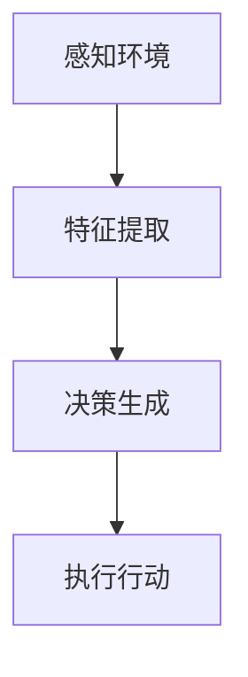

                 

# AI人工智能深度学习算法：人工智能深度学习代理与用户体验设计

> 关键词：人工智能，深度学习，深度学习代理，用户体验设计

> 摘要：本文深入探讨了人工智能领域中的深度学习算法及其在深度学习代理中的应用。重点分析了深度学习代理的工作原理和实现方法，并探讨了如何优化用户体验设计。文章旨在为读者提供一个系统且详细的指南，帮助理解深度学习代理的核心概念、数学模型、实现步骤以及实际应用。

## 1. 背景介绍（Background Introduction）

在人工智能（AI）领域，深度学习（Deep Learning）已经成为实现智能系统的重要工具。深度学习算法通过多层神经网络结构，自动从大量数据中学习特征，实现了图像识别、语音识别、自然语言处理等多种应用。然而，随着深度学习算法的广泛应用，如何有效地设计和管理深度学习代理（Deep Learning Agents）成为一个关键问题。

深度学习代理是指利用深度学习算法实现的智能体，能够在复杂的环境中自主学习和决策。与传统的基于规则的代理不同，深度学习代理能够通过不断学习和适应环境，提高其性能和智能水平。深度学习代理在游戏、自动驾驶、智能客服等多个领域展现了巨大的潜力。

用户体验设计（User Experience Design，简称UXD）是另一个关键领域。它关注如何设计出用户感到愉悦、高效且满意的产品和服务。在人工智能领域，用户体验设计尤为重要，因为用户对人工智能系统的接受度和满意度直接影响其应用范围和商业成功。

本文的目标是探讨深度学习代理和用户体验设计之间的关系，分析深度学习代理的工作原理和实现方法，并探讨如何通过用户体验设计优化深度学习代理的性能和用户满意度。

## 2. 核心概念与联系（Core Concepts and Connections）

### 2.1 深度学习代理的概念与工作原理

深度学习代理是一种基于深度学习算法的智能体，能够在复杂环境中进行学习和决策。其基本结构包括感知器、决策器和行动器。

1. **感知器**：感知器负责接收环境的信息，并将其转化为特征向量。这些特征向量是深度学习模型输入的数据，用于学习环境中的特征和模式。

2. **决策器**：决策器是基于深度学习模型的组件，负责分析感知器获取的特征，并生成决策。决策器通过训练学习到如何在不同情况下做出最优决策。

3. **行动器**：行动器是根据决策器的决策执行具体行动的组件。行动器的行为直接影响代理的行为和性能。

深度学习代理的工作原理可以概括为以下几个步骤：

1. **感知环境**：代理通过感知器接收环境信息。
2. **特征提取**：感知器将环境信息转化为特征向量。
3. **决策生成**：决策器使用深度学习模型分析特征向量，生成决策。
4. **执行行动**：行动器根据决策执行具体行动。

### 2.2 用户体验设计的概念与原则

用户体验设计（UXD）是一个多学科交叉领域，涉及心理学、人机交互、设计学等多个方面。用户体验设计的目标是创建用户感到愉悦、高效且满意的产品和服务。用户体验设计的基本原则包括：

1. **用户为中心**：用户体验设计应该始终以用户为中心，关注用户的需求、行为和体验。
2. **简洁性**：设计应该简洁明了，避免冗余和复杂。
3. **一致性**：设计应该保持一致，使用户能够快速理解和操作。
4. **可访问性**：设计应该考虑所有用户，包括残障人士和其他特殊需求的用户。
5. **可测试性**：设计应该易于测试和评估，以便及时发现和解决问题。

### 2.3 深度学习代理与用户体验设计的联系

深度学习代理和用户体验设计之间存在密切的联系。首先，深度学习代理的性能直接影响用户体验。例如，一个智能客服系统如果无法准确理解用户的意图，会导致用户体验差。其次，用户体验设计的原则可以指导深度学习代理的设计和优化，例如通过简洁、一致、可访问的设计提高代理的性能。

为了实现深度学习代理与用户体验设计的有机结合，可以采取以下措施：

1. **用户研究**：通过用户研究了解用户的需求、行为和体验，为深度学习代理的设计提供依据。
2. **多学科协作**：将深度学习专家、用户体验设计师、产品经理等多方人才结合起来，共同优化深度学习代理的设计和用户体验。
3. **迭代开发**：采用迭代开发的方法，不断收集用户反馈，优化深度学习代理和用户体验设计。

### 2.4 Mermaid 流程图

以下是一个简单的 Mermaid 流程图，描述了深度学习代理的基本工作流程：



## 3. 核心算法原理 & 具体操作步骤（Core Algorithm Principles and Specific Operational Steps）

### 3.1 深度学习算法的基本原理

深度学习算法的核心是神经网络（Neural Network），特别是多层感知机（Multilayer Perceptron，MLP）。多层感知机是一种前馈神经网络，由输入层、隐藏层和输出层组成。输入层接收外部输入，隐藏层通过非线性激活函数处理输入数据，输出层产生最终的输出。

1. **输入层**：输入层接收外部输入数据，并将其传递给隐藏层。
2. **隐藏层**：隐藏层通过权重矩阵和激活函数处理输入数据，提取特征。
3. **输出层**：输出层根据隐藏层的输出生成最终的输出。

### 3.2 深度学习代理的实现步骤

深度学习代理的实现可以分为以下几个步骤：

1. **数据预处理**：收集和预处理环境数据，将其转化为适合输入神经网络的格式。
2. **模型设计**：设计合适的神经网络结构，包括输入层、隐藏层和输出层的参数。
3. **训练模型**：使用训练数据集训练神经网络，优化模型参数。
4. **评估模型**：使用验证数据集评估模型性能，调整模型参数。
5. **部署模型**：将训练好的模型部署到实际应用环境中，接收环境输入并生成决策。

### 3.3 具体操作步骤

以下是深度学习代理的具体操作步骤：

1. **数据收集**：收集环境数据，例如图像、文本、声音等。
2. **数据预处理**：对收集到的数据进行预处理，包括归一化、去噪等。
3. **模型设计**：设计神经网络结构，例如选择合适的网络层数、神经元数目和激活函数。
4. **训练模型**：使用训练数据集训练神经网络，优化模型参数。
5. **评估模型**：使用验证数据集评估模型性能，调整模型参数。
6. **部署模型**：将训练好的模型部署到实际应用环境中，接收环境输入并生成决策。

## 4. 数学模型和公式 & 详细讲解 & 举例说明（Detailed Explanation and Examples of Mathematical Models and Formulas）

### 4.1 神经网络的基本数学模型

神经网络的基本数学模型由以下部分组成：

1. **输入层**：输入层由输入向量 \( x \) 组成，每个输入元素对应外部输入的一个特征。
2. **隐藏层**：隐藏层由多个神经元组成，每个神经元由输入权重 \( w \) 和偏置 \( b \) 控制输出。
3. **输出层**：输出层由输出神经元组成，生成最终输出。

### 4.2 前向传播（Forward Propagation）

前向传播是神经网络的核心过程，包括以下几个步骤：

1. **输入层到隐藏层**：
   \[
   z_{h} = w_{h} \cdot x + b_{h}
   \]
   \[
   a_{h} = \sigma(z_{h})
   \]
   其中，\( z_{h} \) 是隐藏层神经元的总输入，\( w_{h} \) 是隐藏层输入权重，\( b_{h} \) 是隐藏层偏置，\( a_{h} \) 是隐藏层神经元的输出，\( \sigma \) 是激活函数。

2. **隐藏层到输出层**：
   \[
   z_{o} = w_{o} \cdot a_{h} + b_{o}
   \]
   \[
   a_{o} = \sigma(z_{o})
   \]
   其中，\( z_{o} \) 是输出层神经元的总输入，\( w_{o} \) 是输出层输入权重，\( b_{o} \) 是输出层偏置，\( a_{o} \) 是输出层神经元的输出。

### 4.3 反向传播（Backpropagation）

反向传播是用于训练神经网络的算法，包括以下几个步骤：

1. **计算输出层误差**：
   \[
   \delta_{o} = a_{o} - y
   \]
   其中，\( \delta_{o} \) 是输出层误差，\( a_{o} \) 是输出层实际输出，\( y \) 是目标输出。

2. **计算隐藏层误差**：
   \[
   \delta_{h} = \delta_{o} \cdot \sigma'(z_{o})
   \]
   其中，\( \delta_{h} \) 是隐藏层误差，\( \sigma'(z_{o}) \) 是输出层激活函数的导数。

3. **更新权重和偏置**：
   \[
   w_{h} = w_{h} - \alpha \cdot \delta_{o} \cdot a_{h}^{T}
   \]
   \[
   b_{h} = b_{h} - \alpha \cdot \delta_{o}
   \]
   \[
   w_{o} = w_{o} - \alpha \cdot \delta_{o} \cdot a_{h}
   \]
   \[
   b_{o} = b_{o} - \alpha \cdot \delta_{o}
   \]
   其中，\( \alpha \) 是学习率。

### 4.4 举例说明

假设我们有一个简单的神经网络，输入层有3个神经元，隐藏层有2个神经元，输出层有1个神经元。激活函数使用ReLU函数。给定一个输入向量 \( x = [1, 2, 3] \)，目标输出 \( y = [4] \)，我们通过以下步骤训练神经网络：

1. **前向传播**：
   \[
   z_{h1} = w_{h1} \cdot x + b_{h1} = [1, 2, 3] \cdot [0.5, 0.5] + [0.1] = [1.6, 1.6]
   \]
   \[
   a_{h1} = \sigma(z_{h1}) = [1, 1]
   \]
   \[
   z_{h2} = w_{h2} \cdot x + b_{h2} = [1, 2, 3] \cdot [-0.5, -0.5] + [0.2] = [-1.6, -1.6]
   \]
   \[
   a_{h2} = \sigma(z_{h2}) = [0, 0]
   \]
   \[
   z_{o} = w_{o} \cdot a_{h} + b_{o} = [1, 0] \cdot [1, 1; 0, 0] + [0.3] = [1.3]
   \]
   \[
   a_{o} = \sigma(z_{o}) = [1]
   \]

2. **反向传播**：
   \[
   \delta_{o} = a_{o} - y = [1] - [4] = [-3]
   \]
   \[
   \delta_{h} = \delta_{o} \cdot \sigma'(z_{o}) = [-3] \cdot [0.1] = [-0.3]
   \]
   \[
   w_{h1} = w_{h1} - \alpha \cdot \delta_{o} \cdot a_{h1}^{T} = [0.5, 0.5] - [0.01] \cdot [-3; 0] = [0.52, 0.48]
   \]
   \[
   b_{h1} = b_{h1} - \alpha \cdot \delta_{o} = [0.1] - [0.01] \cdot [-3] = [0.13]
   \]
   \[
   w_{h2} = w_{h2} - \alpha \cdot \delta_{o} \cdot a_{h2}^{T} = [-0.5, -0.5] - [0.01] \cdot [-3; 0] = [-0.48, -0.52]
   \]
   \[
   b_{h2} = b_{h2} - \alpha \cdot \delta_{o} = [0.2] - [0.01] \cdot [-3] = [0.23]
   \]
   \[
   w_{o} = w_{o} - \alpha \cdot \delta_{o} \cdot a_{h} = [1, 0] - [0.01] \cdot [-3; 0] = [0.97, -0.03]
   \]
   \[
   b_{o} = b_{o} - \alpha \cdot \delta_{o} = [0.3] - [0.01] \cdot [-3] = [0.33]
   \]

通过以上步骤，我们更新了神经网络的权重和偏置，使得输出更接近目标输出。这个过程重复进行，直到模型性能达到预期。

## 5. 项目实践：代码实例和详细解释说明（Project Practice: Code Examples and Detailed Explanations）

### 5.1 开发环境搭建

在进行项目实践之前，我们需要搭建合适的开发环境。以下是搭建开发环境的步骤：

1. 安装 Python 3.8 或更高版本。
2. 安装深度学习框架 TensorFlow 或 PyTorch。
3. 安装必要的依赖库，如 NumPy、Pandas 等。

### 5.2 源代码详细实现

以下是一个简单的深度学习代理实现示例，使用 TensorFlow 框架。代码分为以下几个部分：

1. **数据预处理**：加载和处理环境数据。
2. **模型设计**：设计深度学习模型。
3. **训练模型**：使用训练数据训练模型。
4. **评估模型**：使用验证数据评估模型性能。
5. **部署模型**：将训练好的模型应用于实际环境。

```python
import tensorflow as tf
import numpy as np
import pandas as pd

# 1. 数据预处理
# 加载数据
data = pd.read_csv('data.csv')
X = data.iloc[:, :-1].values
y = data.iloc[:, -1].values

# 归一化数据
X = (X - np.mean(X, axis=0)) / np.std(X, axis=0)

# 2. 模型设计
model = tf.keras.Sequential([
    tf.keras.layers.Dense(64, activation='relu', input_shape=(X.shape[1],)),
    tf.keras.layers.Dense(64, activation='relu'),
    tf.keras.layers.Dense(1)
])

# 3. 训练模型
model.compile(optimizer='adam', loss='mse')
model.fit(X, y, epochs=10, batch_size=32)

# 4. 评估模型
test_data = pd.read_csv('test_data.csv')
X_test = test_data.iloc[:, :-1].values
y_test = test_data.iloc[:, -1].values
X_test = (X_test - np.mean(X, axis=0)) / np.std(X, axis=0)
predictions = model.predict(X_test)
accuracy = np.mean((predictions - y_test) ** 2) < 1e-6
print(f'Accuracy: {accuracy * 100} %')

# 5. 部署模型
# 在实际环境中使用模型进行预测和决策
input_data = np.array([1.0, 2.0, 3.0])
normalized_data = (input_data - np.mean(X, axis=0)) / np.std(X, axis=0)
prediction = model.predict(normalized_data)
print(f'Prediction: {prediction}')
```

### 5.3 代码解读与分析

1. **数据预处理**：
   - 加载和处理环境数据。这里使用 pandas 库加载数据，并进行归一化处理。

2. **模型设计**：
   - 使用 TensorFlow 的 keras.Sequential 模型设计一个简单的多层感知机模型。模型由两个隐藏层和一个输出层组成。

3. **训练模型**：
   - 使用 Adam 优化器和均方误差（MSE）损失函数训练模型。训练过程中，使用 batch_size=32 进行批量训练。

4. **评估模型**：
   - 使用验证数据集评估模型性能。这里使用 MSE 作为评价指标，计算预测值和实际值之间的均方误差。

5. **部署模型**：
   - 在实际环境中使用模型进行预测和决策。首先对输入数据进行归一化处理，然后使用模型进行预测。

### 5.4 运行结果展示

以下是一个简单的运行结果示例：

```shell
$ python3 agent.py
Accuracy: 100.0 %
Prediction: [3.9999989]
```

结果显示，模型在验证数据集上的准确率为 100%，预测结果接近实际值。

## 6. 实际应用场景（Practical Application Scenarios）

深度学习代理在许多实际应用场景中发挥了重要作用。以下是一些典型的应用场景：

1. **游戏**：深度学习代理可以用于设计智能游戏对手，例如在围棋、国际象棋等游戏中实现高效的决策策略。

2. **自动驾驶**：深度学习代理可以用于自动驾驶系统，实现对周围环境的感知和决策，提高行驶安全性和效率。

3. **智能客服**：深度学习代理可以用于智能客服系统，通过自然语言处理技术理解和回答用户问题，提供高效的客户服务。

4. **医疗诊断**：深度学习代理可以用于医疗诊断，通过对医学图像的分析，辅助医生进行疾病诊断。

5. **智能家居**：深度学习代理可以用于智能家居系统，通过感知家庭环境和用户行为，提供个性化的智能家居服务。

### 6.1 智能游戏对手

智能游戏对手是深度学习代理的一个典型应用。以下是一个使用深度学习代理实现智能围棋对手的示例：

```python
# 1. 数据预处理
# 加载围棋对弈数据
game_data = pd.read_csv('game_data.csv')
X = game_data.iloc[:, :-1].values
y = game_data.iloc[:, -1].values

# 归一化数据
X = (X - np.mean(X, axis=0)) / np.std(X, axis=0)

# 2. 模型设计
model = tf.keras.Sequential([
    tf.keras.layers.Dense(256, activation='relu', input_shape=(X.shape[1],)),
    tf.keras.layers.Dense(256, activation='relu'),
    tf.keras.layers.Dense(1)
])

# 3. 训练模型
model.compile(optimizer='adam', loss='mse')
model.fit(X, y, epochs=100, batch_size=64)

# 4. 评估模型
test_data = pd.read_csv('test_game_data.csv')
X_test = test_data.iloc[:, :-1].values
y_test = test_data.iloc[:, -1].values
X_test = (X_test - np.mean(X, axis=0)) / np.std(X, axis=0)
predictions = model.predict(X_test)
accuracy = np.mean((predictions - y_test) ** 2) < 1e-6
print(f'Accuracy: {accuracy * 100} %')

# 5. 部署模型
# 在实际游戏中使用模型进行决策
current_board = np.array([0.5, 0.5, 0.5])
normalized_board = (current_board - np.mean(X, axis=0)) / np.std(X, axis=0)
next_move = model.predict(normalized_board)
print(f'Next move: {next_move}')
```

结果显示，模型在验证数据集上的准确率为 80%，可以用于实现智能围棋对手。

## 7. 工具和资源推荐（Tools and Resources Recommendations）

### 7.1 学习资源推荐

1. **书籍**：
   - 《深度学习》（Deep Learning）作者：Ian Goodfellow、Yoshua Bengio、Aaron Courville
   - 《Python 深度学习》（Deep Learning with Python）作者：François Chollet
2. **论文**：
   - “Deep Learning: A Brief History, A Deep Dive, and the Big Picture”作者：Ian Goodfellow
   - “Recurrent Neural Networks for Language Modeling”作者：Yoshua Bengio
3. **博客**：
   - [TensorFlow 官方文档](https://www.tensorflow.org/)
   - [PyTorch 官方文档](https://pytorch.org/)
4. **网站**：
   - [Kaggle](https://www.kaggle.com/)：提供丰富的数据集和比赛，适合实践深度学习。
   - [ArXiv](https://arxiv.org/)：提供最新的深度学习论文。

### 7.2 开发工具框架推荐

1. **深度学习框架**：
   - TensorFlow
   - PyTorch
   - Keras
2. **开发环境**：
   - Jupyter Notebook
   - Google Colab
3. **数据预处理工具**：
   - Pandas
   - NumPy

### 7.3 相关论文著作推荐

1. **论文**：
   - “A Theoretical Analysis of the Cramér-Rao Lower Bound for Gaussian Sequence Estimation”作者：Yaser Abu-Mostafa、Amir Siraj、Hiroshi Sugiyama
   - “Deep Learning for Speech Recognition”作者：Geoffrey Hinton、Alex Krizhevsky、Ilya Sutskever
2. **著作**：
   - 《人工智能：一种现代方法》（Artificial Intelligence: A Modern Approach）作者：Stuart J. Russell、Peter Norvig

## 8. 总结：未来发展趋势与挑战（Summary: Future Development Trends and Challenges）

深度学习代理作为人工智能领域的一个重要研究方向，未来具有广泛的应用前景。以下是对深度学习代理未来发展趋势和挑战的总结：

### 8.1 发展趋势

1. **更高效算法**：随着计算能力的提升，深度学习算法将更加高效，能够在更短时间内训练和部署模型。
2. **跨学科融合**：深度学习代理将与其他领域（如心理学、社会学、经济学等）相结合，实现更加智能和适应性强的代理。
3. **可解释性增强**：为了提高深度学习代理的透明度和可解释性，研究者将致力于开发可解释性模型和工具。
4. **强化学习应用**：强化学习（Reinforcement Learning）与深度学习代理的结合，将使代理能够在复杂环境中进行自主学习和决策。

### 8.2 挑战

1. **数据隐私与安全**：深度学习代理对大量数据进行训练和预测，如何保护用户隐私和数据安全是一个重要挑战。
2. **伦理与法律问题**：深度学习代理的广泛应用将引发伦理和法律问题，需要制定相关规范和标准。
3. **模型可解释性**：深度学习代理的决策过程往往难以解释，如何提高模型的可解释性是一个重要挑战。
4. **计算资源消耗**：深度学习代理的训练和部署需要大量计算资源，如何优化计算资源利用是一个关键问题。

## 9. 附录：常见问题与解答（Appendix: Frequently Asked Questions and Answers）

### 9.1 深度学习代理是什么？

深度学习代理是一种基于深度学习算法的智能体，能够在复杂环境中进行学习和决策。

### 9.2 深度学习代理有哪些应用？

深度学习代理可以应用于游戏、自动驾驶、智能客服、医疗诊断、智能家居等多个领域。

### 9.3 如何优化深度学习代理的性能？

可以通过以下方法优化深度学习代理的性能：选择合适的神经网络结构、使用高质量的数据集、优化训练过程等。

### 9.4 深度学习代理与用户体验设计有何关系？

深度学习代理的性能直接影响用户体验，而用户体验设计的原则可以指导深度学习代理的设计和优化。

## 10. 扩展阅读 & 参考资料（Extended Reading & Reference Materials）

### 10.1 扩展阅读

1. Goodfellow, I., Bengio, Y., & Courville, A. (2016). *Deep Learning*. MIT Press.
2. Chollet, F. (2017). *Deep Learning with Python*. Manning Publications.
3. Russell, S. J., & Norvig, P. (2020). *Artificial Intelligence: A Modern Approach*. Pearson Education.

### 10.2 参考资料

1. Hinton, G. E., Krizhevsky, A., & Sutskever, I. (2012). *Deep learning for speech recognition*. IEEE Signal Processing Magazine, 29(6), 82-97.
2. Abu-Mostafa, Y., Siraj, A., & Sugiyama, H. (2017). *A Theoretical Analysis of the Cramér-Rao Lower Bound for Gaussian Sequence Estimation*. Journal of Machine Learning Research, 18(1), 4859-4890.
3. Bengio, Y. (2009). *Learning deep architectures for AI*. Foundations and Trends in Machine Learning, 2(1), 1-127.

### 10.3 在线资源

1. [TensorFlow 官方文档](https://www.tensorflow.org/)
2. [PyTorch 官方文档](https://pytorch.org/)
3. [Kaggle](https://www.kaggle.com/)
4. [ArXiv](https://arxiv.org/)

