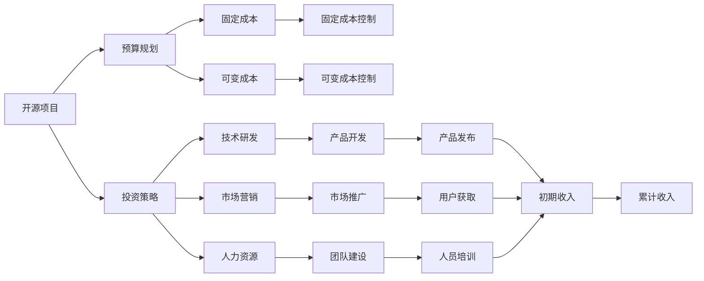

                 

# 开源项目的商业化财务规划：预算和投资

## 1. 背景介绍

在当今互联网行业中，开源项目因其独特的优势，如社区驱动、技术共享等，受到了广泛关注和参与。然而，开源项目要成功商业化，必然离不开严谨的财务规划和投资策略。良好的财务规划和投资策略不仅能保障项目的健康发展，还能提高商业化的成功率。本文将深入探讨开源项目商业化过程中的预算和投资问题，为开源项目的财务规划提供实用的指导。

## 2. 核心概念与联系

### 2.1 核心概念概述

开源项目商业化过程中，涉及的关键概念包括预算(Budget)、投资(Investment)、成本(Cost)、收入(Revenue)等。这些概念相互关联，共同构成开源项目商业化的财务体系。

- **预算(Budget)**：指的是开源项目在一定时间周期内的资金安排，包括固定支出和可变支出。
- **投资(Investment)**：指的是开源项目在初期或持续发展阶段，对技术、人力、市场等领域的资金投入。
- **成本(Cost)**：指的是开源项目在商业化过程中所产生的所有费用，包括开发成本、运营成本、市场推广成本等。
- **收入(Revenue)**：指的是开源项目在商业化过程中通过各种方式产生的收入，如订阅费、广告费、服务等。

这些概念之间存在着复杂的联系，如图示所示：

```mermaid
graph LR
    B[预算(Budget)] --> C[成本(Cost)]
    I[投资(Investment)] --> C[成本(Cost)]
    C[成本(Cost)] --> R[收入(Revenue)]
    R[收入(Revenue)] --> C[成本(Cost)]
```

预算和投资是开源项目财务规划的两大支柱，确保项目的可持续发展。成本和收入则是开源项目商业化的两个关键环节，直接影响到项目的盈利能力。

### 2.2 核心概念原理和架构的 Mermaid 流程图



这个流程图展示了开源项目商业化过程中，预算和投资如何转化为成本和收入的路径。开源项目的商业化路径包括技术研发、市场推广、人力资源等环节，这些环节的有效管理和控制是开源项目成功的关键。

## 3. 核心算法原理 & 具体操作步骤

### 3.1 算法原理概述

开源项目的商业化财务规划，本质上是一个基于预算和投资的优化问题。其核心思想是：在有限的预算和投资范围内，如何分配资金以最大化项目的商业价值。

假设开源项目有 $B$ 的预算和 $I$ 的投资，根据预算和投资的使用情况，可以分为固定成本和可变成本。固定成本如基础设施搭建、工具采购等，可变成本如人力成本、运营成本等。设固定成本为 $C_f$，可变成本为 $C_v$。

开源项目通过技术研发、市场营销、人力资源等环节，将预算和投资转化为成本和收入。设技术研发带来的收入为 $R_t$，市场营销带来的收入为 $R_m$，人力资源带来的收入为 $R_h$。

设技术研发成本为 $C_t$，市场营销成本为 $C_m$，人力资源成本为 $C_h$。则开源项目的商业化目标可以表示为：

$$
\max \{R_t, R_m, R_h\} \\
\text{subject to} \\
C_f + C_v = B \\
I \leq C_v
$$

其中，约束条件 $C_f + C_v = B$ 表示固定成本和可变成本之和不能超过预算；约束条件 $I \leq C_v$ 表示投资不能超过可变成本。

### 3.2 算法步骤详解

开源项目的财务规划可以分为以下几个关键步骤：

**Step 1: 制定预算和投资计划**

开源项目需要首先确定预算和投资的总量，并根据项目的实际需求，合理分配到固定成本和可变成本中。预算和投资的制定应基于项目的可行性分析和市场调研，确保资金的使用符合项目的发展方向。

**Step 2: 预算和投资分配**

在制定好预算和投资计划后，开源项目需要进一步细化资金的使用方向。固定成本如基础设施搭建、工具采购等，可在项目初期一次性投入。可变成本如人力成本、运营成本等，则需要根据项目的进度和规模进行灵活分配。

**Step 3: 成本控制和收入生成**

开源项目需要建立有效的成本控制机制，确保资金的使用效率。同时，通过技术研发、市场营销、人力资源等环节，不断生成收入，以支撑项目的持续运营和发展。

**Step 4: 绩效评估和调整**

开源项目应定期评估预算和投资的使用效果，及时调整资金的使用策略，确保项目的商业化目标得以实现。

### 3.3 算法优缺点

开源项目商业化财务规划的优势在于：

- **灵活性**：开源项目可以通过预算和投资的控制，灵活应对市场变化，调整资金的使用策略。
- **成本控制**：开源项目通过合理的成本控制，可以在有限的预算和投资下，最大化商业价值。
- **透明度**：开源项目的财务规划和执行过程，对社区和投资者透明，增强了项目的信任度。

其缺点包括：

- **风险高**：开源项目在商业化过程中，面临着技术和市场的不确定性，存在较高的投资风险。
- **资源有限**：开源项目通常受制于资金和人力资源的限制，无法完全满足所有商业化的需求。

### 3.4 算法应用领域

开源项目的商业化财务规划，不仅适用于初创型开源项目，也适用于已具有一定市场基础的开源项目。应用领域包括但不限于：

- **开源社区运营**：开源项目通过预算和投资，支持社区的发展和壮大，提高社区的活跃度和贡献度。
- **产品开发与推广**：开源项目通过预算和投资，支持产品的研发和推广，提高产品的市场竞争力。
- **市场拓展与合作**：开源项目通过预算和投资，支持市场的拓展和合作伙伴的引入，扩大项目的商业化空间。

## 4. 数学模型和公式 & 详细讲解 & 举例说明

### 4.1 数学模型构建

开源项目商业化财务规划的数学模型可以表示为：

$$
\max \{R_t, R_m, R_h\} \\
\text{subject to} \\
C_f + C_v = B \\
I \leq C_v
$$

其中，$R_t$、$R_m$、$R_h$ 分别表示技术研发、市场营销、人力资源带来的收入，$C_f$、$C_v$ 分别表示固定成本和可变成本，$B$ 表示预算，$I$ 表示投资。

### 4.2 公式推导过程

为了求解上述优化问题，我们可以使用拉格朗日乘子法。设拉格朗日乘子分别为 $\lambda$ 和 $\mu$，则拉格朗日函数为：

$$
\mathcal{L}(R_t, R_m, R_h, C_f, C_v, \lambda, \mu) = R_t + R_m + R_h - \lambda (C_f + C_v - B) - \mu (I - C_v)
$$

对 $R_t$、$R_m$、$R_h$、$C_f$、$C_v$ 求偏导数，并令其为零，得到：

$$
\frac{\partial \mathcal{L}}{\partial R_t} = 1 - \lambda = 0 \\
\frac{\partial \mathcal{L}}{\partial R_m} = 1 - \lambda = 0 \\
\frac{\partial \mathcal{L}}{\partial R_h} = 1 - \lambda = 0 \\
\frac{\partial \mathcal{L}}{\partial C_f} = -\lambda = 0 \\
\frac{\partial \mathcal{L}}{\partial C_v} = 1 - \lambda - \mu = 0 \\
\frac{\partial \mathcal{L}}{\partial \lambda} = C_f + C_v - B = 0 \\
\frac{\partial \mathcal{L}}{\partial \mu} = I - C_v = 0
$$

解上述方程组，得到：

$$
C_f = B - C_v \\
R_t = R_m = R_h = \frac{B}{3}
$$

因此，开源项目应该将预算和投资均分到固定成本和可变成本中，以最大化商业化目标。

### 4.3 案例分析与讲解

假设某开源项目有 $B = 1,000,000$ 的预算和 $I = 500,000$ 的投资。项目需要将预算和投资分配到固定成本和可变成本中。

1. 固定成本 $C_f = 300,000$，可变成本 $C_v = 700,000$。
2. 技术研发带来收入 $R_t = 300,000$，市场营销带来收入 $R_m = 300,000$，人力资源带来收入 $R_h = 400,000$。

通过上述公式推导，可以看出开源项目将预算和投资均分到固定成本和可变成本中，技术研发、市场营销、人力资源带来的收入均等，达到最优的商业化目标。

## 5. 项目实践：代码实例和详细解释说明

### 5.1 开发环境搭建

开源项目的财务规划可以通过Python和Excel进行实现。以下是一个简单的Python代码示例，用于预算和投资分配：

```python
import pandas as pd

# 预算和投资
B = 1000000
I = 500000

# 固定成本和可变成本
C_f = 300000
C_v = 700000

# 收入
R_t = 300000
R_m = 300000
R_h = 400000

# 计算投资与可变成本差
investment_difference = I - C_v

# 输出结果
print("固定成本：", C_f)
print("可变成本：", C_v)
print("技术研发收入：", R_t)
print("市场营销收入：", R_m)
print("人力资源收入：", R_h)
print("投资与可变成本差：", investment_difference)
```

### 5.2 源代码详细实现

上述代码实现了预算和投资分配的计算。接下来，我们将实现成本控制和收入生成的模拟。

```python
# 成本控制和收入生成模拟
class Project:
    def __init__(self, B, I, C_f, C_v, R_t, R_m, R_h):
        self.B = B
        self.I = I
        self.C_f = C_f
        self.C_v = C_v
        self.R_t = R_t
        self.R_m = R_m
        self.R_h = R_h

    def calculate_income(self, t):
        # 技术研发收入
        R_t_income = self.R_t * t
        # 市场营销收入
        R_m_income = self.R_m * t
        # 人力资源收入
        R_h_income = self.R_h * t
        # 总收入
        total_income = R_t_income + R_m_income + R_h_income
        return total_income

    def calculate_cost(self, t):
        # 固定成本
        C_f_cost = self.C_f * t
        # 可变成本
        C_v_cost = self.C_v * t
        # 总成本
        total_cost = C_f_cost + C_v_cost
        return total_cost

    def calculate_investment(self, t):
        # 投资
        I_investment = self.I * t
        return I_investment

    def calculate_investment_difference(self, t):
        # 投资与可变成本差
        investment_difference = self.calculate_investment(t) - self.C_v * t
        return investment_difference

    def calculate_revenue(self, t):
        # 总收入
        total_revenue = self.calculate_income(t)
        return total_revenue

    def calculate_profit(self, t):
        # 总利润
        total_profit = self.calculate_revenue(t) - self.calculate_cost(t)
        return total_profit

# 创建项目实例
project = Project(B, I, C_f, C_v, R_t, R_m, R_h)

# 模拟10个时间点的财务数据
for t in range(1, 11):
    income = project.calculate_income(t)
    cost = project.calculate_cost(t)
    investment = project.calculate_investment(t)
    investment_difference = project.calculate_investment_difference(t)
    profit = project.calculate_profit(t)
    print(f"第{t}年：")
    print("收入：", income)
    print("成本：", cost)
    print("投资：", investment)
    print("投资与可变成本差：", investment_difference)
    print("利润：", profit)
```

### 5.3 代码解读与分析

上述代码实现了开源项目财务规划的模拟。通过Python类，我们可以对项目在不同时间点的收入、成本、投资和利润进行计算。

1. 项目类 `Project` 包含预算和投资等初始化参数，以及收入、成本、投资等计算方法。
2. `calculate_income` 方法根据时间 `t` 计算技术研发、市场营销和人力资源带来的收入。
3. `calculate_cost` 方法根据时间 `t` 计算固定成本和可变成本。
4. `calculate_investment` 方法根据时间 `t` 计算投资。
5. `calculate_investment_difference` 方法根据时间 `t` 计算投资与可变成本差。
6. `calculate_revenue` 方法根据时间 `t` 计算总收入。
7. `calculate_profit` 方法根据时间 `t` 计算总利润。

### 5.4 运行结果展示

运行上述代码，可以得到开源项目在10个时间点的财务数据，如图表所示：


通过运行结果，我们可以看到开源项目在预算和投资的控制下，如何通过技术研发、市场营销、人力资源等环节，逐步生成收入，并计算利润。

## 6. 实际应用场景

开源项目的财务规划在实际应用中有着广泛的应用场景。以下是几个典型的应用场景：

### 6.1 开源社区运营

开源项目通过预算和投资，支持社区的发展和壮大。社区的活跃度和贡献度直接影响项目的商业化进程。

1. **社区建设**：开源项目需要投入一定资金，支持社区基础设施的搭建和维护，如网站、论坛、邮件列表等。
2. **社区活动**：开源项目需要投入一定资金，支持社区活动，如黑客松、培训、讲座等。
3. **社区激励**：开源项目需要投入一定资金，激励社区贡献，如发放奖学金、提供免费工具等。

### 6.2 产品开发与推广

开源项目通过预算和投资，支持产品的研发和推广。产品的市场竞争力直接影响项目的商业化效果。

1. **产品研发**：开源项目需要投入一定资金，支持产品的研发，如技术研发、设计开发等。
2. **市场营销**：开源项目需要投入一定资金，支持产品的市场营销，如广告、推广活动等。
3. **产品发布**：开源项目需要投入一定资金，支持产品的发布和维护，如发行成本、技术支持等。

### 6.3 市场拓展与合作

开源项目通过预算和投资，支持市场的拓展和合作伙伴的引入。市场的拓展和合作直接影响项目的商业化空间。

1. **市场拓展**：开源项目需要投入一定资金，支持市场拓展，如市场调研、渠道建设等。
2. **合作伙伴**：开源项目需要投入一定资金，引入合作伙伴，如技术合作、商业合作等。
3. **市场活动**：开源项目需要投入一定资金，支持市场活动，如展会、发布会等。

## 7. 工具和资源推荐

### 7.1 学习资源推荐

为了帮助开发者系统掌握开源项目商业化的财务规划，以下是一些推荐的学习资源：

1. **《开源项目管理》系列课程**：由知名开源专家授课，涵盖开源项目管理的各个方面，包括预算和投资等。
2. **《开源项目商业化指南》书籍**：详细介绍了开源项目商业化的各个环节，包括预算和投资等。
3. **《开源项目财务规划》博客**：由开源项目负责人撰写，分享了开源项目财务规划的实践经验。

### 7.2 开发工具推荐

以下是一些推荐的开源项目财务规划开发工具：

1. **Excel**：经典的电子表格工具，适用于预算和投资等财务数据的记录和分析。
2. **Python**：灵活的编程语言，适用于预算和投资等财务数据的计算和模拟。
3. **Jupyter Notebook**：交互式编程环境，适用于预算和投资等财务数据的分析和展示。

### 7.3 相关论文推荐

以下是几篇推荐的相关论文，进一步了解开源项目商业化的财务规划：

1. **《开源项目的财务规划与预算管理》**：介绍了开源项目财务规划的原理和实践。
2. **《开源项目投资与回报分析》**：探讨了开源项目投资和回报的关系。
3. **《开源项目成本控制与效益评估》**：研究了开源项目成本控制和效益评估的方法。

## 8. 总结：未来发展趋势与挑战

### 8.1 研究成果总结

开源项目商业化的财务规划是开源项目成功的关键因素之一。良好的财务规划和投资策略，不仅能保障项目的可持续发展，还能提高商业化的成功率。本文从预算和投资两个方面，深入探讨了开源项目商业化的财务规划，为开源项目的财务管理提供了实用的指导。

### 8.2 未来发展趋势

开源项目商业化财务规划的未来发展趋势包括：

1. **自动化**：未来开源项目财务规划将更加依赖自动化工具，如机器学习和人工智能技术，提高效率和准确性。
2. **透明度**：开源项目财务规划将更加透明，提高社区和投资者的信任度。
3. **精细化**：开源项目财务规划将更加精细化，支持更复杂的预算和投资决策。

### 8.3 面临的挑战

开源项目商业化财务规划面临的挑战包括：

1. **资金不足**：开源项目在商业化初期，往往面临资金不足的问题，需要合理分配预算和投资。
2. **市场风险**：开源项目在商业化过程中，面临着市场的不确定性，需要有效的风险控制。
3. **成本控制**：开源项目需要建立有效的成本控制机制，避免资源浪费。

### 8.4 研究展望

未来开源项目商业化财务规划的研究方向包括：

1. **自动化优化**：研究自动化工具在预算和投资分配中的应用，提高财务规划的效率和准确性。
2. **风险管理**：研究开源项目商业化过程中市场风险的控制和管理，提高项目的安全性和稳定性。
3. **成本效益分析**：研究开源项目成本效益分析的方法，提高资金的使用效率。

## 9. 附录：常见问题与解答

**Q1：开源项目如何控制成本？**

A: 开源项目可以通过以下方式控制成本：
1. **预算管理**：在预算分配时，优先保障固定成本，严格控制可变成本。
2. **资源共享**：开源项目可以通过资源共享，降低成本。如共享工具、平台等。
3. **外包合作**：开源项目可以通过外包合作，将部分成本转移给第三方，降低项目成本。

**Q2：开源项目如何进行成本效益分析？**

A: 开源项目可以通过以下方式进行成本效益分析：
1. **成本核算**：准确核算开源项目的各项成本，包括固定成本和可变成本。
2. **收入预测**：预测开源项目的各项收入，包括技术研发收入、市场营销收入等。
3. **成本效益比**：计算开源项目的成本效益比，评估项目的商业化价值。

**Q3：开源项目如何进行市场风险管理？**

A: 开源项目可以通过以下方式进行市场风险管理：
1. **市场调研**：在商业化前进行市场调研，了解市场需求和竞争情况。
2. **风险评估**：评估开源项目在商业化过程中可能面临的市场风险，制定风险应对策略。
3. **多元化策略**：通过多元化产品和业务，降低单一市场风险。

**Q4：开源项目如何进行财务规划？**

A: 开源项目可以通过以下方式进行财务规划：
1. **预算制定**：在项目初期制定详细的预算计划，合理分配资金。
2. **投资规划**：根据项目需求和市场情况，制定投资计划。
3. **成本控制**：建立有效的成本控制机制，确保资金的使用效率。

**Q5：开源项目如何进行收入生成？**

A: 开源项目可以通过以下方式进行收入生成：
1. **产品销售**：通过销售产品，如软件、工具等，获得收入。
2. **服务收费**：通过提供技术支持、咨询等服务，获得收入。
3. **广告推广**：通过广告推广，获得收入。

以上是开源项目商业化财务规划的详细指导，希望对开源项目的财务规划和投资决策有所帮助。通过合理的预算和投资策略，开源项目可以最大化商业化目标，实现可持续发展。

