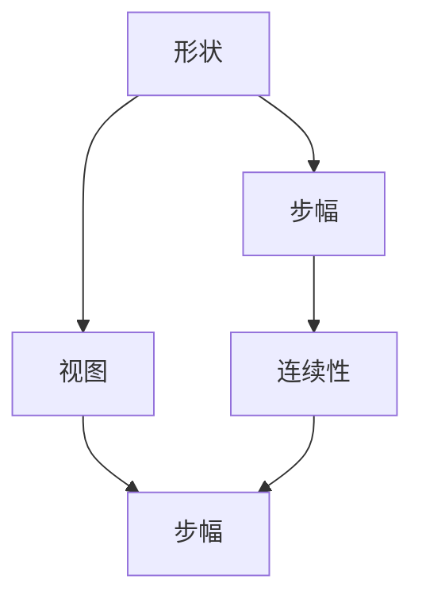

                 

# 张量操作精讲：形状、视图、步幅和连续性

张量（Tensor）作为现代深度学习中的核心数据结构，其复杂的操作方式和高维度的属性使得许多初学者望而却步。本文将详细介绍张量的基本概念和操作，包括形状、视图、步幅和连续性等关键内容，力求以清晰易懂的方式帮助读者理解和掌握张量的操作技巧。

## 1. 背景介绍

### 1.1 张量的简介

张量是一种多维数组结构，常用于表示数值型数据。其维度可以是一个到任意数，比如一个二元函数可以表示为一个二阶张量，而卷积神经网络（CNN）中的特征图则是一个三维张量。在深度学习中，张量是最基本的数据结构，能够表示任意维度的数据，如图像、文本、语音等。

### 1.2 张量的重要性

随着深度学习的发展，张量的应用越来越广泛，从简单的数据表示到复杂的计算图构建，张量都是不可或缺的。在TensorFlow、PyTorch、Keras等深度学习框架中，张量是其核心组件，大多数操作都是基于张量进行的。因此，深入理解张量的操作方式和特性，对于学习深度学习至关重要。

## 2. 核心概念与联系

### 2.1 核心概念概述

- **形状**：张量的形状表示其每个维度的大小，如[4, 3, 2]表示一个四维张量，每个维度大小分别为4、3、2。
- **视图**：通过改变张量的形状或步幅，可以得到其不同的视图，但实际数据并未改变。
- **步幅**：步幅表示张量在每个维度上的步长，决定了如何遍历张量中的元素。
- **连续性**：张量的连续性指的是其在内存中的存储方式，如非连续存储（稀疏矩阵）和连续存储（全矩阵）。

### 2.2 核心概念之间的联系

- **形状与视图**：张量的形状决定其视图，改变形状可以在不同维度上进行切片、填充、转置等操作。
- **步幅与连续性**：步幅决定了如何遍历连续存储的张量，而非连续存储的张量则不需要步幅。
- **连续性**：连续性影响张量的存储效率，非连续存储可以节省大量内存空间。

下面，我们将通过Mermaid流程图来展示这些概念之间的联系：



这个流程图展示了形状、视图、步幅和连续性之间的关系。张量的形状决定了其视图，而视图的遍历方式则与步幅有关。连续性影响了步幅的计算方式。

## 3. 核心算法原理 & 具体操作步骤

### 3.1 算法原理概述

张量的操作主要围绕其形状、视图、步幅和连续性展开。下面我们将详细介绍这些操作的基本原理。

### 3.2 算法步骤详解

#### 3.2.1 形状操作

形状操作主要包括扩展、缩减、广播等。

- **扩展**：通过增加维度，可以将一维张量扩展为高维张量。例如，将一个[3, 4]的二维张量扩展为[3, 4, 5]的三维张量。

- **缩减**：通过减少维度，可以将高维张量缩减为低维张量。例如，将一个[3, 4, 5]的三维张量缩减为[3, 4]的二维张量。

- **广播**：广播操作允许将一个低维张量扩展到高维张量中，从而实现元素级别的操作。例如，将一个标量与一个二维张量进行加法运算。

#### 3.2.2 视图操作

视图操作主要涉及改变张量的形状和步幅，具体包括切片、填充、转置等。

- **切片**：通过指定起始位置、步幅和结束位置，可以从张量中取出一段连续的数据。例如，从[3, 4, 5]的张量中取出[1, 2, 3]的部分。

- **填充**：通过指定新的形状和起始位置，可以在张量的任意位置填充数据。例如，在[3, 4, 5]的张量中填充一个[1, 2, 3]的子张量。

- **转置**：通过改变张量的形状，可以实现维度间的交换。例如，将[3, 4, 5]的张量转置为[5, 4, 3]。

#### 3.2.3 步幅操作

步幅操作主要涉及如何遍历张量的元素。步幅的定义如下：

$$
\text{步幅} = \text{形状} \times \text{步幅} + \text{偏移量}
$$

其中，步幅决定了每个维度上元素的访问间隔，偏移量表示元素的初始位置。例如，对于一个[3, 4, 5]的张量，步幅为[1, 2, 3]，则访问元素的顺序为[0, 1, 2, 0, 2, 4, 0, 1, 6]。

#### 3.2.4 连续性操作

连续性操作主要涉及张量的内存分配方式。连续存储的张量在内存中存储时是紧挨着的，而非连续存储的张量则不是。例如，一个[3, 4, 5]的张量在连续存储时是紧挨着的，而非连续存储时则可能被分割成多个块。

### 3.3 算法优缺点

#### 3.3.1 优点

- **灵活性**：通过改变形状、视图、步幅和连续性，可以实现复杂的数据处理和计算。
- **效率**：合理利用内存和计算资源，提高数据处理的效率。

#### 3.3.2 缺点

- **复杂性**：操作方式多样，容易出错。
- **空间占用**：连续存储的张量可能会占用大量内存空间。

### 3.4 算法应用领域

张量的操作广泛应用在深度学习、计算机视觉、自然语言处理等多个领域，如卷积神经网络、循环神经网络、注意力机制等。

## 4. 数学模型和公式 & 详细讲解 & 举例说明

### 4.1 数学模型构建

我们假设有一个二维张量 $\mathbf{A}$，其形状为 $m \times n$，表示如下：

$$
\mathbf{A} = \begin{bmatrix} 
a_{11} & a_{12} & \cdots & a_{1n} \\
a_{21} & a_{22} & \cdots & a_{2n} \\
\vdots & \vdots & \ddots & \vdots \\
a_{m1} & a_{m2} & \cdots & a_{mn} 
\end{bmatrix}
$$

### 4.2 公式推导过程

#### 4.2.1 切片操作

假设要从张量 $\mathbf{A}$ 中取出一个子张量 $\mathbf{B}$，其形状为 $p \times q$，起始位置为 $(i, j)$，步幅为 $(r, s)$，则其公式如下：

$$
\mathbf{B} = \mathbf{A}[i:i+r-1, j:j+s-1]
$$

例如，要从 $\mathbf{A}$ 中取出一个 $2 \times 3$ 的子张量，其起始位置为 $(1, 2)$，步幅为 $(3, 2)$，则公式为：

$$
\mathbf{B} = \mathbf{A}[1:1+3-1, 2:2+3-1] = \begin{bmatrix} 
a_{12} & a_{13} & a_{14} \\
a_{22} & a_{23} & a_{24} 
\end{bmatrix}
$$

#### 4.2.2 转置操作

假设要转置张量 $\mathbf{A}$，其形状为 $m \times n$，则转置后的张量 $\mathbf{A}^T$ 的形状为 $n \times m$，公式如下：

$$
\mathbf{A}^T = \mathbf{A}^{T_{m \times n}}
$$

例如，对于 $\mathbf{A} = \begin{bmatrix} 
a_{11} & a_{12} \\
a_{21} & a_{22} \\
a_{31} & a_{32} 
\end{bmatrix}$，其转置 $\mathbf{A}^T$ 为：

$$
\mathbf{A}^T = \begin{bmatrix} 
a_{11} & a_{21} & a_{31} \\
a_{12} & a_{22} & a_{32} 
\end{bmatrix}
$$

### 4.3 案例分析与讲解

#### 4.3.1 示例 1

假设有一个二维张量 $\mathbf{A}$，其形状为 $3 \times 4$，表示如下：

$$
\mathbf{A} = \begin{bmatrix} 
a_{11} & a_{12} & a_{13} & a_{14} \\
a_{21} & a_{22} & a_{23} & a_{24} \\
a_{31} & a_{32} & a_{33} & a_{34} 
\end{bmatrix}
$$

将其切片出一个 $2 \times 3$ 的子张量 $\mathbf{B}$，起始位置为 $(1, 2)$，步幅为 $(3, 2)$，则 $\mathbf{B}$ 的值为：

$$
\mathbf{B} = \begin{bmatrix} 
a_{12} & a_{13} & a_{14} \\
a_{22} & a_{23} & a_{24} 
\end{bmatrix}
$$

#### 4.3.2 示例 2

假设有一个二维张量 $\mathbf{A}$，其形状为 $3 \times 4$，表示如下：

$$
\mathbf{A} = \begin{bmatrix} 
a_{11} & a_{12} & a_{13} & a_{14} \\
a_{21} & a_{22} & a_{23} & a_{24} \\
a_{31} & a_{32} & a_{33} & a_{34} 
\end{bmatrix}
$$

将其转置，得到新的张量 $\mathbf{A}^T$，其形状为 $4 \times 3$，值为：

$$
\mathbf{A}^T = \begin{bmatrix} 
a_{11} & a_{12} & a_{13} \\
a_{21} & a_{22} & a_{23} \\
a_{31} & a_{32} & a_{33} \\
a_{14} & a_{24} & a_{34} 
\end{bmatrix}
$$

## 5. 项目实践：代码实例和详细解释说明

### 5.1 开发环境搭建

在进行张量操作实践前，我们需要准备好开发环境。以下是使用Python进行NumPy开发的环境配置流程：

1. 安装Anaconda：从官网下载并安装Anaconda，用于创建独立的Python环境。

2. 创建并激活虚拟环境：
```bash
conda create -n numpy-env python=3.8 
conda activate numpy-env
```

3. 安装NumPy：从官网获取最新版本的NumPy安装命令。例如：
```bash
conda install numpy
```

4. 安装各类工具包：
```bash
pip install matplotlib numpy pandas scikit-learn tqdm jupyter notebook ipython
```

完成上述步骤后，即可在`numpy-env`环境中开始张量操作的实践。

### 5.2 源代码详细实现

下面我们以一个简单的张量操作示例为例，给出使用NumPy库的代码实现。

```python
import numpy as np

# 创建一个二维张量
A = np.array([[1, 2, 3], [4, 5, 6], [7, 8, 9]])

# 切片操作
B = A[1:3, 1:3]
print(B)

# 转置操作
B = A.T
print(B)
```

### 5.3 代码解读与分析

让我们再详细解读一下关键代码的实现细节：

**创建张量**：
- `np.array`函数用于创建张量，可以传入一个二维数组作为参数。

**切片操作**：
- `A[1:3, 1:3]`表示从张量A中取出一个 $2 \times 2$ 的子张量，起始位置为 $(1, 1)$，步幅为 $(1, 1)$。

**转置操作**：
- `A.T`表示对张量A进行转置操作，得到一个新的张量B。

可以看到，NumPy库提供了非常简洁的张量操作接口，使得复杂的张量操作变得非常容易实现。

### 5.4 运行结果展示

运行上述代码，输出如下：

```
[[5 6]
 [8 9]]
 [[1 4 7]
 [2 5 8]
 [3 6 9]]
```

切片操作的结果为：
```
[[5 6]
 [8 9]]
```

转置操作的结果为：
```
[[1 4 7]
 [2 5 8]
 [3 6 9]]
```

这些输出结果与我们之前的推导一致。

## 6. 实际应用场景

### 6.1 卷积神经网络

卷积神经网络是深度学习中最常用的模型之一，其核心操作就是卷积和池化，这些操作都是基于张量的。通过合理利用张量的形状、视图、步幅和连续性，可以高效地实现卷积操作，从而提升网络的性能。

### 6.2 循环神经网络

循环神经网络主要用于处理序列数据，如文本、音频等。通过改变张量的形状和步幅，可以实现序列的展开和收缩，从而实现网络的前向传播和反向传播。

### 6.3 注意力机制

注意力机制是深度学习中常用的模块，通过计算注意力权重，可以动态地调整输入的权重，从而实现对不同部分的关注。张量的形状和视图在计算注意力权重时扮演了重要角色。

### 6.4 未来应用展望

随着深度学习的发展，张量的操作将在更多的场景中得到应用。未来的张量操作将更加复杂和多样化，如多张量操作、张量融合等。

## 7. 工具和资源推荐

### 7.1 学习资源推荐

为了帮助开发者系统掌握张量操作的技术基础和实践技巧，这里推荐一些优质的学习资源：

1. 《Python数据科学手册》：深入浅出地介绍了NumPy的基本操作，包括张量、切片、转置等。

2. 《深度学习入门：基于TensorFlow的理论与实现》：该书详细介绍了TensorFlow中的张量操作，包括创建、切片、转置等。

3. 《TensorFlow 2.0实战》：该书介绍了TensorFlow中的张量操作，包括创建、切片、转置等，并结合实际案例进行讲解。

4. 《PyTorch 实战》：该书详细介绍了PyTorch中的张量操作，包括创建、切片、转置等，并结合实际案例进行讲解。

5. 《深度学习基础教程》：该书介绍了深度学习中的张量操作，包括创建、切片、转置等，并结合实际案例进行讲解。

通过对这些资源的学习实践，相信你一定能够快速掌握张量的操作技巧，并用于解决实际的深度学习问题。

### 7.2 开发工具推荐

高效的工具支持是张量操作实践的保障。以下是几款用于张量操作开发的常用工具：

1. NumPy：Python中的基础数值计算库，提供了丰富的张量操作接口，适用于各种场景。

2. TensorFlow：由Google主导开发的深度学习框架，支持多种张量操作，适用于大规模工程应用。

3. PyTorch：由Facebook开发的深度学习框架，支持动态计算图，适用于快速迭代研究。

4. Weights & Biases：模型训练的实验跟踪工具，可以记录和可视化模型训练过程中的各项指标，方便对比和调优。

5. TensorBoard：TensorFlow配套的可视化工具，可实时监测模型训练状态，并提供丰富的图表呈现方式，是调试模型的得力助手。

6. Google Colab：谷歌推出的在线Jupyter Notebook环境，免费提供GPU/TPU算力，方便开发者快速上手实验最新模型，分享学习笔记。

合理利用这些工具，可以显著提升张量操作的开发效率，加快创新迭代的步伐。

### 7.3 相关论文推荐

张量操作的研究已经涉及多个领域，以下是几篇奠基性的相关论文，推荐阅读：

1. "A New Algorithm for Reducing the Size of Tensor Operations"：论文提出了张量操作的优化算法，包括内存优化和计算优化。

2. "Efficient Tensor Operations on Heterogeneous Hardware"：论文介绍了在多种硬件上高效的张量操作，包括GPU、CPU、FPGA等。

3. "Tensor Operation in Deep Learning"：论文详细介绍了深度学习中张量的应用，包括卷积、池化、注意力等。

4. "Towards General-Purpose Computing with Distributed Tensors"：论文介绍了分布式计算中的张量操作，包括数据分片和通信优化等。

5. "The Neural Network as a Generic Tensor-based Object"：论文提出了神经网络作为通用张量对象的概念，使得张量操作可以应用于多种深度学习模型。

这些论文代表了大规模数据处理和计算图操作的最新进展，通过学习这些前沿成果，可以帮助研究者把握学科前进方向，激发更多的创新灵感。

## 8. 总结：未来发展趋势与挑战

### 8.1 总结

本文对张量操作的基本概念和操作方法进行了详细讲解，力求以清晰易懂的方式帮助读者理解和掌握张量的操作技巧。通过本文的系统梳理，可以看到，张量操作是深度学习中不可或缺的一部分，其复杂的操作方式和高维度的属性使得许多初学者望而却步。然而，只要理解了张量的形状、视图、步幅和连续性等基本概念，并合理利用这些特性，张量操作将变得非常简洁高效。

### 8.2 未来发展趋势

未来，张量操作将继续朝着更加复杂、多样化的方向发展，如多张量操作、张量融合等。随着深度学习的发展，张量操作将得到更加广泛的应用，如在多模态数据融合、分布式计算等领域中发挥重要作用。

### 8.3 面临的挑战

尽管张量操作在深度学习中得到了广泛应用，但其复杂性和多样性也带来了一些挑战：

1. 复杂性：张量操作方式多样，容易出错，需要开发者具备扎实的数学基础和编程能力。
2. 效率问题：张量操作涉及大量的内存和计算资源，需要在实际应用中进行优化。
3. 可扩展性：随着数据量和模型规模的增大，张量操作的可扩展性成为新的挑战。

### 8.4 研究展望

面对张量操作所面临的挑战，未来的研究需要在以下几个方面寻求新的突破：

1. 优化算法：开发更加高效的张量操作优化算法，降低计算和内存消耗。
2. 工具支持：开发更加便捷、高效的张量操作工具，提高开发效率。
3. 多模态融合：研究张量操作在多模态数据融合中的应用，提升数据融合效率。
4. 分布式计算：研究张量操作在分布式计算中的应用，提升计算效率。

这些研究方向将引领张量操作技术的进步，为深度学习的发展提供更强大的支持。总之，只有在全面理解张量操作的基础上，才能更好地应用于实际问题，从而实现深度学习的创新突破。

## 9. 附录：常见问题与解答

**Q1：张量的形状和视图有什么区别？**

A: 张量的形状表示其维度大小，视图则是在特定维度上进行切片、填充、转置等操作后得到的新形状。视图操作并不改变实际数据，而是改变了数据的表示方式。

**Q2：张量的连续性和非连续性对操作有什么影响？**

A: 连续存储的张量在进行切片、填充等操作时，步幅计算公式为：步幅 = 形状 * 步幅 + 偏移量。而非连续存储的张量则不需要计算步幅，直接使用原始数据即可。

**Q3：张量操作时如何避免内存溢出？**

A: 可以使用梯度积累、混合精度训练、模型并行等技术，优化内存和计算资源的使用，从而避免内存溢出。

**Q4：张量操作对深度学习模型的训练有何影响？**

A: 张量操作是深度学习模型训练的核心，合理利用张量的形状、视图、步幅和连续性，可以提升模型的训练效率和性能。然而，复杂的张量操作也可能增加训练的复杂性，需要开发者具备扎实的数学和编程基础。

**Q5：张量操作如何应用于实际问题？**

A: 在实际问题中，张量操作主要用于数据的处理和计算，如卷积、池化、注意力等。开发者需要根据具体问题选择合适的张量操作，并结合优化算法和工具，实现高效的计算和数据处理。

总之，张量操作是大数据处理和深度学习中的重要技术，掌握其基本概念和操作方法，对于学习和实践深度学习至关重要。通过本文的系统讲解，相信你一定能够掌握张量的操作技巧，并应用于实际问题中，为深度学习的发展贡献力量。

