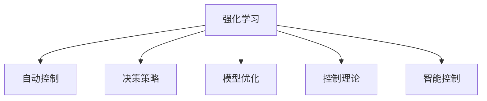

                 

# 强化学习在自动控制中的应用

> 关键词：强化学习, 自动控制, 决策策略, 模型优化, 控制理论, 智能控制, 无人驾驶, 机器人控制

## 1. 背景介绍

### 1.1 问题由来
强化学习（Reinforcement Learning, RL）作为人工智能（AI）领域的前沿技术，近年来在自动控制（Automatic Control）领域得到了广泛的应用。自动控制领域的目标是通过控制算法实现对系统的有效管理，使其能够满足特定的性能指标和约束条件。传统的自动控制方法主要依赖于预定义的控制律和模型，但这种方法往往需要大量的手工调参和专业知识，且难以应对复杂和动态变化的环境。

强化学习则提供了一种更加智能和自适应的解决方案。通过与环境进行交互，强化学习模型可以逐步学习到最优的决策策略，实现对系统的精确控制。这种无需先验知识、能够适应环境变化的能力，使得强化学习在自动控制领域具有巨大的潜力。

### 1.2 问题核心关键点
强化学习的核心思想是“以试错学习”，即通过与环境的互动来调整策略，优化行为。在自动控制中，强化学习的目标是通过模型学习，使得系统能够在特定的环境条件下，做出最优的决策，实现性能指标的优化。具体来说，强化学习在自动控制中的应用主要包括以下几个方面：

- 模型优化：强化学习可以用于模型的优化，如线性模型、神经网络模型等，使其能够更好地适应环境。
- 控制策略：通过强化学习，可以学习到最优的控制策略，实现系统的精确控制。
- 自适应控制：强化学习可以实现自适应控制，使其能够应对环境的变化和不确定性。
- 智能控制：强化学习可以用于智能控制系统的构建，如无人驾驶、机器人控制等。

## 2. 核心概念与联系

### 2.1 核心概念概述

为了更好地理解强化学习在自动控制中的应用，本节将介绍几个密切相关的核心概念：

- 强化学习（Reinforcement Learning, RL）：通过与环境互动，学习最优决策策略的过程。强化学习模型通过接收环境反馈，调整策略，逐步优化行为。
- 自动控制（Automatic Control）：通过控制算法实现对系统的有效管理，使其能够满足特定的性能指标和约束条件。自动控制的目标是使系统能够自主地进行调节，以适应外部环境的变化。
- 决策策略（Decision Strategy）：强化学习模型的核心组成部分，决定了模型在每个状态下应采取的行动。决策策略可以基于价值函数或策略函数构建。
- 模型优化（Model Optimization）：强化学习可以用于模型的优化，使得模型能够更好地适应环境，提高控制精度。
- 控制理论（Control Theory）：自动控制的基础理论，包括控制系统的稳定性、可控性和可观测性等概念。
- 智能控制（Smart Control）：基于人工智能技术的自动化控制系统，如无人驾驶、机器人控制等。

这些核心概念之间的逻辑关系可以通过以下Mermaid流程图来展示：



这个流程图展示了这个核心概念之间的关系：

1. 强化学习通过与环境的互动，学习最优的决策策略。
2. 强化学习可以用于优化自动控制模型，提高控制精度。
3. 强化学习可以在控制理论的指导下，实现智能控制。
4. 智能控制是强化学习在自动控制领域的典型应用。

## 3. 核心算法原理 & 具体操作步骤
### 3.1 算法原理概述

强化学习在自动控制中的应用，主要基于以下核心原理：

1. **动态规划（Dynamic Programming, DP）**：通过将复杂问题分解为多个子问题，逐步优化。动态规划在强化学习中广泛应用，特别是在离散状态和动作空间中。
2. **Q-learning**：一种基于值函数（Value Function）的强化学习算法，通过与环境交互，逐步更新Q值，优化策略。
3. **策略梯度方法（Policy Gradient Methods）**：通过优化策略函数，实现对策略的微调，逐步改进决策策略。
4. **蒙特卡罗方法（Monte Carlo Methods）**：通过随机抽样，评估策略的效果，优化模型。

这些算法原理构成了强化学习在自动控制中的应用基础。通过这些算法，强化学习可以逐步学习到最优的决策策略，实现系统的自适应控制。

### 3.2 算法步骤详解

强化学习在自动控制中的应用，主要包括以下几个关键步骤：

**Step 1: 构建环境模型**
- 定义控制系统的状态空间和动作空间，确定环境的状态转移模型。
- 定义环境的奖励函数，用于评估策略的效果。
- 设计评估指标，如系统的稳态误差、控制精度等。

**Step 2: 选择算法和策略**
- 选择合适的强化学习算法（如DP、Q-learning、策略梯度等）。
- 设计决策策略，可以基于值函数或策略函数构建。
- 选择合适的优化器（如Adam、SGD等）。

**Step 3: 训练和优化**
- 将训练集划分为训练集和验证集，进行模型训练。
- 在训练过程中，根据反馈信息逐步更新模型参数，优化决策策略。
- 周期性在验证集上评估策略效果，防止过拟合。
- 重复上述步骤直到满足预设的收敛条件。

**Step 4: 部署和应用**
- 将优化后的策略应用到实际控制系统中。
- 持续监测系统状态，调整策略以适应环境变化。
- 根据实际效果，进行进一步的优化和调整。

以上是强化学习在自动控制中的应用一般流程。在实际应用中，还需要针对具体问题，对各个环节进行优化设计，如改进训练目标函数，引入更多的正则化技术，搜索最优的超参数组合等，以进一步提升模型性能。

### 3.3 算法优缺点

强化学习在自动控制中的应用，具有以下优点：
1. 自适应性强：强化学习能够根据环境的变化，动态调整策略，适应复杂和动态变化的环境。
2. 不需要先验知识：强化学习不需要对系统有深刻的了解，能够从实际数据中学习最优策略。
3. 泛化能力强：强化学习能够从有限的数据中学习到通用的策略，具有较强的泛化能力。
4. 智能控制：强化学习可以用于构建智能控制系统，如无人驾驶、机器人控制等，实现更高级的自动化。

同时，该方法也存在一定的局限性：
1. 训练时间长：强化学习通常需要大量的训练数据和计算资源，训练时间较长。
2. 数据需求大：强化学习需要大量的标注数据，训练数据获取成本较高。
3. 可解释性不足：强化学习模型的决策过程缺乏可解释性，难以对其推理逻辑进行分析和调试。
4. 模型复杂度高：强化学习模型通常较为复杂，难以实现模型的可视化。

尽管存在这些局限性，但就目前而言，强化学习在自动控制中的应用已成为一种重要的技术手段。未来相关研究的重点在于如何进一步降低训练成本，提高模型的泛化能力和可解释性，同时兼顾智能控制系统的实际应用需求。

### 3.4 算法应用领域

强化学习在自动控制中的应用已经广泛渗透到多个领域，如：

- 机器人控制：用于机器人的导航、抓取、定位等任务，实现自主的避障和路径规划。
- 无人驾驶：用于无人驾驶汽车的控制，实现自适应巡航、避障等高级驾驶功能。
- 工业自动化：用于工厂的生产线优化、设备维护等任务，实现自适应控制和优化。
- 电力系统：用于电力系统的负荷优化、调度等任务，实现智能电网的管理和优化。
- 医疗诊断：用于医疗设备的控制和优化，实现精准医疗和智能诊断。

除了上述这些经典应用外，强化学习还在更多场景中得到了应用，如自适应信号控制、交通流优化等，为自动控制技术的发展注入了新的动力。

## 4. 数学模型和公式 & 详细讲解  
### 4.1 数学模型构建

强化学习在自动控制中的应用，通常采用如下数学模型：

- 状态空间：$\mathcal{S}$，表示系统的当前状态。
- 动作空间：$\mathcal{A}$，表示系统可采取的行动。
- 奖励函数：$r(s, a)$，用于评估策略的效果。
- 状态转移模型：$P(s'|s, a)$，表示在状态$s$下采取行动$a$后，状态转移到$s'$的概率。

定义强化学习模型的目标函数为：

$$
J(\pi) = \mathbb{E}\left[\sum_{t=0}^{\infty} \gamma^t r(s_t, a_t) \right]
$$

其中，$\pi$为策略函数，$\gamma$为折扣因子。

### 4.2 公式推导过程

以Q-learning算法为例，推导强化学习模型的梯度更新公式。

根据Q-learning算法，定义状态-动作对的Q值：

$$
Q(s, a) = \mathbb{E}\left[\sum_{t=0}^{\infty} \gamma^t r(s_t, a_t) \right]
$$

在每一步，通过状态-动作对$(s_t, a_t)$，计算出下一个状态-动作对的Q值：

$$
Q'(s', a') = \mathbb{E}\left[\sum_{t=0}^{\infty} \gamma^t r(s_{t+1}, a_{t+1}) \right]
$$

通过状态转移模型，计算出下一个状态$s'$的概率：

$$
P(s'|s, a) = \sum_{s'} P(s'|s, a) Q(s', a')
$$

通过动作价值函数，计算出下一个状态的动作价值：

$$
Q(s', a') = \max_a Q(s', a)
$$

通过上述公式，可以得到Q-learning算法的更新公式：

$$
Q(s, a) \leftarrow Q(s, a) + \alpha(r + \gamma \max_{a'} Q(s', a') - Q(s, a))
$$

其中，$\alpha$为学习率。

### 4.3 案例分析与讲解

以下以无人驾驶为例，展示强化学习在自动控制中的应用。

**问题描述**：
- 目标：实现无人驾驶汽车的安全导航和路径规划。
- 状态空间：$\mathcal{S} = \{s_1, s_2, ..., s_n\}$，表示汽车当前的位姿、速度和方向。
- 动作空间：$\mathcal{A} = \{a_1, a_2, ..., a_m\}$，表示汽车的加减速和转向动作。
- 奖励函数：$r(s, a)$，用于评估策略的效果。
- 状态转移模型：$P(s'|s, a)$，表示汽车在当前状态$s$下采取行动$a$后，状态转移到$s'$的概率。

**解决方案**：
- 定义决策策略：$\pi(s)$，表示在状态$s$下采取行动$a$的概率。
- 选择算法：使用Q-learning算法，通过与环境互动，逐步优化决策策略。
- 设计奖励函数：设计奖励函数，用于评估策略的效果。

通过上述步骤，可以逐步学习到最优的决策策略，实现无人驾驶汽车的安全导航和路径规划。

## 5. 项目实践：代码实例和详细解释说明
### 5.1 开发环境搭建

在进行强化学习项目实践前，我们需要准备好开发环境。以下是使用Python进行强化学习开发的常见环境配置流程：

1. 安装Anaconda：从官网下载并安装Anaconda，用于创建独立的Python环境。

2. 创建并激活虚拟环境：
```bash
conda create -n rl-env python=3.8 
conda activate rl-env
```

3. 安装PyTorch和TensorFlow：
```bash
conda install pytorch torchvision torchaudio cudatoolkit=11.1 -c pytorch -c conda-forge
conda install tensorflow
```

4. 安装相关库：
```bash
pip install gym
pip install stable-baselines3
```

完成上述步骤后，即可在`rl-env`环境中开始强化学习实践。

### 5.2 源代码详细实现

这里以Q-learning算法在Cart-Pole问题中的应用为例，给出使用稳定基线（Stable Baselines）库的代码实现。

首先，导入相关库：

```python
from stable_baselines3 import DQN
from stable_baselines3.common.env_util import make_vec_env
from stable_baselines3.common.policies import MlpPolicy
import gym
```

然后，定义环境：

```python
env = gym.make("CartPole-v1")
env = make_vec_env(env, n_envs=1)
```

接着，定义模型：

```python
model = DQN(policy_class=MlpPolicy, env=env)
```

然后，训练模型：

```python
model.learn(total_timesteps=10000, verbose=1)
```

最后，评估模型：

```python
eval_env = make_vec_env(env, n_envs=1)
model.test(eval_env)
```

以上就是使用PyTorch和Stable Baselines进行Q-learning算法的代码实现。可以看到，使用Stable Baselines，开发者可以更简洁地实现强化学习模型，并进行快速迭代。

### 5.3 代码解读与分析

让我们再详细解读一下关键代码的实现细节：

**gym库**：
- 提供了丰富的环境库，如Cart-Pole、Mountain-Car等，用于模拟各种自动控制场景。
- 可以定义自定义环境，模拟复杂的控制系统。

**Stable Baselines库**：
- 提供了多种强化学习算法，如DQN、SAC、PPO等。
- 提供了训练、评估、保存模型等功能，方便开发者进行快速实验。

**模型训练**：
- 使用训练函数`learn`进行模型训练，指定训练轮数和训练频率。
- 通过调用`test`函数进行模型评估，输出模型性能指标。

可以看到，通过使用PyTorch和Stable Baselines，强化学习在自动控制中的应用变得简洁高效。开发者可以将更多精力放在算法设计、实验优化等高层逻辑上，而不必过多关注底层的实现细节。

当然，工业级的系统实现还需考虑更多因素，如模型的保存和部署、超参数的自动搜索、更灵活的策略设计等。但核心的强化学习范式基本与此类似。

## 6. 实际应用场景
### 6.1 无人驾驶

强化学习在无人驾驶领域得到了广泛应用。通过在仿真环境和实际道路场景中进行训练，强化学习模型可以实现自适应巡航、避障、路径规划等功能。

在仿真环境中，可以模拟各种复杂的驾驶场景，如交通信号灯、行人过街、突发情况等。通过强化学习模型进行训练，模型可以逐步学习到最优的驾驶策略，实现自主的路径规划和决策。

在实际道路场景中，通过高精地图和传感器数据，强化学习模型可以实现实时导航和避障。通过与环境的互动，模型可以逐步适应各种道路条件和交通规则，实现更加智能的驾驶。

### 6.2 机器人控制

强化学习在机器人控制领域也有着广泛的应用。通过在仿真环境中进行训练，强化学习模型可以实现机器人的导航、抓取、定位等任务。

在仿真环境中，可以模拟各种复杂的机器人操作场景，如室内导航、自动清洁、移动避障等。通过强化学习模型进行训练，模型可以逐步学习到最优的操作策略，实现自主的路径规划和操作控制。

在实际应用中，通过高精度传感器和计算平台，强化学习模型可以实现实时操作和反馈调整。通过与环境的互动，模型可以逐步适应各种操作条件和环境变化，实现更加智能的操作控制。

### 6.3 工业自动化

强化学习在工业自动化领域也有着重要的应用。通过在仿真环境中进行训练，强化学习模型可以实现工业机器人的路径规划、设备维护等任务。

在仿真环境中，可以模拟各种复杂的工业操作场景，如焊接、喷漆、组装等。通过强化学习模型进行训练，模型可以逐步学习到最优的操作策略，实现自主的路径规划和操作控制。

在实际应用中，通过高精度传感器和计算平台，强化学习模型可以实现实时操作和反馈调整。通过与环境的互动，模型可以逐步适应各种操作条件和环境变化，实现更加智能的操作控制。

### 6.4 电力系统

强化学习在电力系统领域也有着广泛的应用。通过在仿真环境中进行训练，强化学习模型可以实现电力系统的负荷优化、调度等任务。

在仿真环境中，可以模拟各种复杂的电力系统场景，如负荷预测、调度优化等。通过强化学习模型进行训练，模型可以逐步学习到最优的调度策略，实现系统的最优运行。

在实际应用中，通过高精度传感器和计算平台，强化学习模型可以实现实时调度和反馈调整。通过与环境的互动，模型可以逐步适应各种系统条件和环境变化，实现更加智能的电力系统管理。

## 7. 工具和资源推荐
### 7.1 学习资源推荐

为了帮助开发者系统掌握强化学习在自动控制中的应用，这里推荐一些优质的学习资源：

1. 《Reinforcement Learning: An Introduction》书籍：由Richard S. Sutton和Andrew G. Barto合著，全面介绍了强化学习的基本概念和算法。
2. Coursera《Reinforcement Learning Specialization》课程：由David Silver教授主讲，涵盖强化学习的经典算法和应用，适合系统学习。
3. DeepMind《Reinforcement Learning at Google》报告：详细介绍了Google在强化学习方面的应用实践，展示了前沿技术的发展方向。
4. OpenAI Gym库文档：提供了丰富的环境库和算法库，是进行强化学习实验的必备工具。
5. Stable Baselines库文档：提供了多种强化学习算法和模型，适合快速实现和实验。

通过对这些资源的学习实践，相信你一定能够快速掌握强化学习在自动控制中的应用，并用于解决实际的自动控制问题。

### 7.2 开发工具推荐

高效的开发离不开优秀的工具支持。以下是几款用于强化学习开发的常用工具：

1. PyTorch：基于Python的开源深度学习框架，灵活的计算图和自动微分技术，适合强化学习模型的构建和训练。
2. TensorFlow：由Google主导开发的开源深度学习框架，支持多种分布式计算平台，适合大规模强化学习实验。
3. OpenAI Gym：提供了丰富的环境库和算法库，是进行强化学习实验的必备工具。
4. Stable Baselines：提供了多种强化学习算法和模型，适合快速实现和实验。
5. TensorBoard：TensorFlow配套的可视化工具，实时监测训练过程，帮助开发者进行调试和优化。

合理利用这些工具，可以显著提升强化学习在自动控制中的应用开发效率，加快创新迭代的步伐。

### 7.3 相关论文推荐

强化学习在自动控制领域的发展源于学界的持续研究。以下是几篇奠基性的相关论文，推荐阅读：

1. DQN: Deep Reinforcement Learning for Humanoid Robotics：提出Q-learning算法在机器人控制中的应用，展示了强化学习在机器人控制中的巨大潜力。
2. AlphaGo Zero: Mastering the Game of Go without Human Knowledge：展示了强化学习在复杂策略游戏中的应用，为自动控制提供了新的思路。
3. Proximal Policy Optimization (PPO): A Simple Algorithm with Strong Convergence Guarantees for Model-Free Reinforcement Learning：提出PPO算法，进一步优化了强化学习模型的训练效率和效果。
4. SAC: Soft Actor-Critic Methods for Continuous Control：提出Soft Actor-Critic算法，应用于连续动作空间，提高了强化学习模型的泛化能力。

这些论文代表了大语言模型微调技术的发展脉络。通过学习这些前沿成果，可以帮助研究者把握学科前进方向，激发更多的创新灵感。

## 8. 总结：未来发展趋势与挑战

### 8.1 总结

本文对强化学习在自动控制中的应用进行了全面系统的介绍。首先阐述了强化学习在自动控制领域的背景和应用前景，明确了强化学习在自适应控制、智能控制方面的独特价值。其次，从原理到实践，详细讲解了强化学习的数学模型和算法步骤，给出了强化学习任务开发的完整代码实例。同时，本文还广泛探讨了强化学习在无人驾驶、机器人控制、工业自动化等多个领域的应用前景，展示了强化学习范式的巨大潜力。此外，本文精选了强化学习的各类学习资源，力求为读者提供全方位的技术指引。

通过本文的系统梳理，可以看到，强化学习在自动控制领域的应用已经成为一种重要的技术手段，极大地拓展了自动控制系统的应用边界，为智能控制系统的实现提供了新的路径。未来，伴随强化学习技术的不断演进，相信自动控制系统将在更广阔的应用领域大放异彩，深刻影响人类的生产生活方式。

### 8.2 未来发展趋势

展望未来，强化学习在自动控制中的应用将呈现以下几个发展趋势：

1. 模型复杂度提升：随着算法和算力不断进步，强化学习模型的复杂度将进一步提升，能够处理更加复杂和动态的环境。
2. 数据需求降低：随着模型结构和算法优化，强化学习模型对数据的需求将降低，能够更高效地从少量数据中学习最优策略。
3. 多模态融合：强化学习模型将更多地融合视觉、听觉等多模态信息，提升系统对环境的感知能力。
4. 自适应性增强：强化学习模型将具备更强的自适应性，能够更灵活地应对环境变化和不确定性。
5. 跨领域迁移：强化学习模型将具备更强的跨领域迁移能力，能够在不同领域之间进行知识迁移和应用。
6. 智能控制系统：强化学习将在更多领域实现智能控制，如无人驾驶、机器人控制等。

以上趋势凸显了强化学习在自动控制领域的广阔前景。这些方向的探索发展，必将进一步提升自动控制系统的性能和应用范围，为智能控制系统的实现提供新的技术路径。

### 8.3 面临的挑战

尽管强化学习在自动控制中的应用已经取得了显著进展，但在迈向更加智能化、普适化应用的过程中，它仍面临着诸多挑战：

1. 训练时间长：强化学习模型通常需要大量的训练数据和计算资源，训练时间较长。如何降低训练成本，提高训练效率，是未来的重要研究方向。
2. 数据需求大：强化学习模型需要大量的标注数据，获取标注数据的成本较高。如何降低数据需求，提高模型的泛化能力，是未来的重要研究方向。
3. 可解释性不足：强化学习模型的决策过程缺乏可解释性，难以对其推理逻辑进行分析和调试。如何增强模型的可解释性，是未来的重要研究方向。
4. 模型复杂度高：强化学习模型通常较为复杂，难以实现模型的可视化。如何简化模型结构，提高模型效率，是未来的重要研究方向。
5. 鲁棒性不足：强化学习模型对环境的噪声和变化敏感，鲁棒性不足。如何提高模型的鲁棒性，增强模型的抗干扰能力，是未来的重要研究方向。

这些挑战亟需学术界和工业界的共同努力，通过理论研究和技术创新，不断突破。相信随着这些问题的逐步解决，强化学习在自动控制中的应用将迈向更高的成熟度，进一步推动自动控制技术的进步。

### 8.4 研究展望

面对强化学习在自动控制领域所面临的挑战，未来的研究需要在以下几个方面寻求新的突破：

1. 深度强化学习：结合深度学习和强化学习，提高模型的复杂度和精度。
2. 分布式强化学习：通过分布式计算，提高强化学习模型的训练效率和效果。
3. 强化学习优化：优化强化学习模型的训练过程，提高模型的泛化能力和鲁棒性。
4. 跨模态融合：将视觉、听觉等多模态信息融合到强化学习模型中，提升系统对环境的感知能力。
5. 可解释强化学习：开发具有可解释性的强化学习模型，增强模型的透明度和可理解性。
6. 动态强化学习：研究动态环境下的强化学习算法，提高模型对环境变化的适应能力。

这些研究方向将进一步拓展强化学习在自动控制领域的应用，推动自动控制技术的不断进步。相信随着学界和产业界的共同努力，强化学习在自动控制中的应用必将取得更大的突破。

## 9. 附录：常见问题与解答

**Q1：强化学习在自动控制中的应用有哪些限制？**

A: 强化学习在自动控制中的应用存在以下限制：
1. 训练时间长：强化学习模型通常需要大量的训练数据和计算资源，训练时间较长。
2. 数据需求大：强化学习模型需要大量的标注数据，获取标注数据的成本较高。
3. 可解释性不足：强化学习模型的决策过程缺乏可解释性，难以对其推理逻辑进行分析和调试。
4. 模型复杂度高：强化学习模型通常较为复杂，难以实现模型的可视化。
5. 鲁棒性不足：强化学习模型对环境的噪声和变化敏感，鲁棒性不足。

**Q2：如何提高强化学习模型的泛化能力？**

A: 提高强化学习模型的泛化能力，可以采取以下方法：
1. 使用更多的环境：通过在更多环境中进行训练，提高模型的泛化能力。
2. 使用更多的动作空间：通过在更大动作空间中进行训练，提高模型的决策能力。
3. 使用更多的奖励函数：通过在更多奖励函数中进行训练，提高模型的适应能力。
4. 使用更多的优化器：通过在更多优化器中进行训练，提高模型的训练效率。
5. 使用更多的正则化技术：通过在更多正则化技术中进行训练，提高模型的鲁棒性。

**Q3：强化学习在自动控制中的应用有哪些未来方向？**

A: 强化学习在自动控制中的应用未来方向包括：
1. 深度强化学习：结合深度学习和强化学习，提高模型的复杂度和精度。
2. 分布式强化学习：通过分布式计算，提高强化学习模型的训练效率和效果。
3. 强化学习优化：优化强化学习模型的训练过程，提高模型的泛化能力和鲁棒性。
4. 跨模态融合：将视觉、听觉等多模态信息融合到强化学习模型中，提升系统对环境的感知能力。
5. 可解释强化学习：开发具有可解释性的强化学习模型，增强模型的透明度和可理解性。
6. 动态强化学习：研究动态环境下的强化学习算法，提高模型对环境变化的适应能力。

通过这些方向的探索发展，相信强化学习在自动控制中的应用将取得更大的突破，为智能控制系统的实现提供新的技术路径。

---

作者：禅与计算机程序设计艺术 / Zen and the Art of Computer Programming

