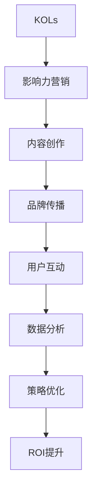

                 

# 影响力营销创业：社交媒体时代的营销利器

> 关键词：影响力营销,社交媒体,内容创作,品牌传播,用户互动,数据分析,策略优化,ROI提升

## 1. 背景介绍

### 1.1 问题由来
在互联网时代，信息爆炸和注意力稀缺成为新的营销挑战。传统的广告投放和内容推送方式，往往难以触达用户，且难以实现精准营销。而社交媒体的崛起，为品牌提供了更直接、更具互动性的营销渠道。通过影响力营销，企业可以借助网红、博主等意见领袖的影响力，进行高效的传播和互动，实现更高的用户参与度和品牌忠诚度。

### 1.2 问题核心关键点
影响力营销的核心在于利用社交媒体平台的影响力，借助具有高信任度的KOLs（Key Opinion Leaders），对目标受众进行精准的内容推送和互动。其关键点包括：

- 选择合适的KOLs：需要评估KOLs的受众群体、粉丝质量、互动率等因素，选择最合适的合作伙伴。
- 制定清晰的营销策略：明确营销目标、受众画像、内容形式和传播渠道，设计有吸引力的营销活动。
- 进行数据分析和策略优化：通过分析数据反馈，不断优化内容策略，提升ROI（投资回报率）。
- 监测和评估效果：实时监控营销活动的效果，评估KPI（关键绩效指标），确保营销目标的实现。

### 1.3 问题研究意义
研究影响力营销，对于提升品牌传播效果、降低营销成本、提高用户互动和忠诚度等方面具有重要意义：

1. 提升品牌传播效果：KOLs具有高度的信任度和传播力，能快速引起目标受众的关注和讨论，提升品牌曝光度和认知度。
2. 降低营销成本：相比于传统的广告投放，影响力营销的边际成本较低，能以较小的投入实现高影响力的传播。
3. 提高用户互动和忠诚度：KOLs通过与粉丝的互动，能建立更强的情感连接，提升用户的参与度和忠诚度。
4. 实现精准营销：KOLs能够深入了解目标受众的需求和偏好，通过精准的内容推送和互动，实现更高效的营销。

## 2. 核心概念与联系

### 2.1 核心概念概述

为更好地理解影响力营销的原理和实施步骤，本节将介绍几个核心概念：

- **KOLs（Key Opinion Leaders）**：即关键意见领袖，指在特定领域内具有高度影响力、信任度和专业知识的个人或机构。
- **影响力营销（Influencer Marketing）**：指通过KOLs的传播和互动，达到品牌推广、产品销售等营销目标的策略。
- **内容创作（Content Creation）**：包括文案撰写、视频制作、图片编辑等多种形式，旨在吸引和保持目标受众的兴趣。
- **品牌传播（Brand Propagation）**：通过KOLs的传播，提升品牌知名度、美誉度和市场份额。
- **用户互动（User Engagement）**：通过KOLs与粉丝的互动，增强品牌与用户之间的情感连接和忠诚度。
- **数据分析（Data Analytics）**：通过监测和分析营销活动的数据，优化策略，提升效果。
- **策略优化（Strategy Optimization）**：根据数据分析结果，不断优化营销策略，提升ROI。

这些核心概念之间的逻辑关系可以通过以下Mermaid流程图来展示：



这个流程图展示了一些核心概念及其之间的关系：

1. KOLs是影响力营销的基石。
2. 内容创作是营销活动的基础，用于吸引和保持目标受众。
3. 品牌传播通过KOLs的传播，实现品牌曝光和认知提升。
4. 用户互动通过KOLs与粉丝的互动，建立品牌忠诚度和情感连接。
5. 数据分析用于监测和评估营销效果，为策略优化提供依据。
6. 策略优化通过数据驱动的决策，提升营销ROI。
7. 最终目标是通过综合运用这些概念，实现品牌价值的最大化。

## 3. 核心算法原理 & 具体操作步骤

### 3.1 算法原理概述

影响力营销的实施，本质上是一种基于社交媒体平台的有目标、有策略的传播过程。其核心思想是：通过精心挑选的KOLs，利用其影响力，对目标受众进行精准的内容推送和互动，实现品牌传播和用户互动的双重目标。

形式化地，假设目标受众为 $S$，KOLs为 $K$，影响力营销的目标为 $T$。则影响力营销的过程可以表示为：

$$
T = F(K,S)
$$

其中 $F$ 为影响力函数，表示KOLs对目标受众 $S$ 施加影响力的过程。

### 3.2 算法步骤详解

影响力营销的实施流程一般包括以下几个关键步骤：

**Step 1: 选择KOLs**
- 评估潜在KOLs的受众群体、互动率、粉丝质量等因素，选择适合的合作伙伴。
- 与KOLs进行初步接触，了解其合作意向和需求。

**Step 2: 制定营销策略**
- 确定营销目标和受众画像。
- 设计吸引目标受众的内容形式，如图文、视频、直播等。
- 选择合适的社交媒体平台，制定传播渠道策略。
- 设定明确的KPIs，如曝光量、互动率、转化率等。

**Step 3: 内容创作与传播**
- 根据策略要求，进行内容创作和编辑。
- 将内容通过KOLs进行传播，并进行实时监测。
- 分析传播效果，评估内容的质量和受众反应。

**Step 4: 数据分析与优化**
- 收集和分析传播数据，评估KPIs。
- 根据数据分析结果，进行策略调整和优化。
- 定期评估营销效果，确保ROI提升。

**Step 5: 监测与评估**
- 实时监测营销活动，及时发现问题并解决。
- 评估营销效果，对比预期目标和实际表现。
- 定期进行策略复盘，总结经验教训。

### 3.3 算法优缺点

影响力营销具有以下优点：
1. 高效传播：KOLs的传播能力强，能快速触达目标受众。
2. 精准营销：通过数据分析，能够实现精准的内容推送和互动。
3. 低成本高收益：相比于传统广告，影响力营销的边际成本低，但效果显著。
4. 提升用户忠诚度：通过互动，能建立更强的品牌情感连接和忠诚度。

同时，该方法也存在一定的局限性：
1. KOLs的选择和合作难度大：找到合适的KOLs并建立合作关系，需要时间和资源。
2. 数据隐私和安全问题：需注意用户数据的隐私保护和安全问题。
3. 效果难以量化：某些营销活动的效果难以直接量化，需要通过间接指标评估。
4. 依赖社交媒体平台：受社交媒体平台政策变化的影响，营销效果存在不确定性。

尽管存在这些局限性，但就目前而言，影响力营销仍是大品牌和中小企业进行社交媒体营销的重要手段。未来相关研究的重点在于如何进一步提高KOLs的选择和合作效率，增强数据隐私保护，优化策略优化算法，以及增强营销效果的量化评估方法。

### 3.4 算法应用领域

影响力营销已在多个领域得到广泛应用，包括但不限于：

- **时尚和美妆**：通过时尚博主、美妆博主等KOLs，推广最新的时尚和美妆产品。
- **旅游和酒店**：通过旅游博主、酒店推荐者等KOLs，推广旅游目的地和酒店服务。
- **健康与健身**：通过健康博主、健身教练等KOLs，推广健康饮食和健身产品。
- **食品和饮料**：通过美食博主、酒评家等KOLs，推广新推出的食品和饮料。
- **科技和电子**：通过科技博主、电子设备测评者等KOLs，推广最新科技产品。

除了上述这些领域，影响力营销还在体育、教育、家居、金融等多个行业领域得到应用，为品牌传播和用户互动带来了新的可能性。

## 4. 数学模型和公式 & 详细讲解 & 举例说明

### 4.1 数学模型构建

影响力营销的实施，涉及多维度的数据和指标。我们可以使用数学模型来刻画影响力营销的全过程。

假设KOLs的受众群体为 $S$，KOLs的数量为 $K$，内容的质量为 $C$，传播的互动率为 $I$，广告的转化率为 $T$。则影响力营销的效果可以表示为：

$$
E = f(K, S, C, I, T)
$$

其中 $E$ 为营销效果，$K$ 为KOLs数量，$S$ 为受众群体，$C$ 为内容质量，$I$ 为互动率，$T$ 为广告转化率。

### 4.2 公式推导过程

为了更好地理解影响力营销的数学模型，我们以简单的二元影响力传播为例进行推导：

假设一个KOL对目标受众 $S$ 传播内容 $C$，受众的反应为 $I$，内容的质量为 $C$，则传播的效果可以表示为：

$$
I = g(C) \times h(K) \times T
$$

其中 $g(C)$ 为内容质量对受众反应的影响，$h(K)$ 为KOLs数量对传播效果的影响，$T$ 为广告转化率。

通过推导，我们可以发现，内容质量、KOLs数量和广告转化率，都是影响影响力营销效果的因素。进一步分析，可以发现：

- 内容质量越高，受众的反应 $I$ 越大。
- KOLs数量越多，传播的影响力 $h(K)$ 越大。
- 广告转化率越高，最终的广告效果 $T$ 越好。

### 4.3 案例分析与讲解

假设一家电子产品公司希望通过影响力营销推广其新推出的智能手表。公司选取了5名知名科技博主作为KOLs，通过社交媒体平台进行推广。以下是对该案例的详细分析：

**选择KOLs**
- 评估了5名科技博主的受众群体、互动率和粉丝质量，选择了粉丝数量较大且互动率高的博主。
- 与博主进行初步沟通，了解其合作意愿和需求，并达成了合作协议。

**制定营销策略**
- 确定了推广目标为提高品牌知名度和智能手表的销售量。
- 设计了包括产品介绍视频、使用评测、用户评价等形式的内容。
- 选择了微博、微信公众号、抖音等社交媒体平台，并制定了多渠道传播策略。
- 设定了KPIs，如视频观看量、点赞数、评论数、销售量等。

**内容创作与传播**
- 制作了高质量的推广视频、图文和评测内容。
- 通过选定的KOLs在社交媒体上传播内容，并进行实时监测。
- 分析了内容传播的效果，评估了观看量、点赞数、评论数等数据。

**数据分析与优化**
- 收集了推广数据，包括视频观看量、点赞数、评论数、销售量等。
- 根据数据分析结果，进行了策略调整和优化，如增加了更多互动性内容，优化了传播渠道等。
- 定期评估营销效果，确保达到了预设的KPIs。

**监测与评估**
- 实时监测推广活动，及时发现问题并解决。
- 评估推广效果，对比预期目标和实际表现，总结经验教训。

## 5. 项目实践：代码实例和详细解释说明

### 5.1 开发环境搭建

在进行影响力营销实践前，我们需要准备好开发环境。以下是使用Python进行数据分析和策略优化的环境配置流程：

1. 安装Anaconda：从官网下载并安装Anaconda，用于创建独立的Python环境。

2. 创建并激活虚拟环境：
```bash
conda create -n influencer-env python=3.8 
conda activate influencer-env
```

3. 安装相关库：
```bash
pip install pandas numpy matplotlib scikit-learn seaborn nltk
```

4. 安装社交媒体API接口：
```bash
pip install twitterapi pyshorteners
```

完成上述步骤后，即可在`influencer-env`环境中开始影响力营销的开发和实践。

### 5.2 源代码详细实现

这里我们以一个简单的社交媒体影响力传播案例为例，给出影响力营销的Python代码实现。

首先，定义KOLs和受众的数据结构：

```python
class Influencer:
    def __init__(self, name, followers, engagement_rate, content_quality):
        self.name = name
        self.followers = followers
        self.engagement_rate = engagement_rate
        self.content_quality = content_quality

class Audience:
    def __init__(self, age, gender, interests):
        self.age = age
        self.gender = gender
        self.interests = interests
```

然后，定义内容质量和互动率的计算函数：

```python
def calculate_content_quality(content):
    # 使用自然语言处理技术，计算内容的质量得分
    # 此处代码实现略

def calculate_engagement_rate(followers, engagement_rate):
    # 计算KOLs的互动率
    return followers * engagement_rate
```

接着，定义影响力营销的模型函数：

```python
def influence_marketing(kol, audience, content_quality, engagement_rate, conversion_rate):
    # 计算KOLs对受众的影响力传播效果
    return content_quality * engagement_rate * conversion_rate
```

最后，进行影响力营销的模拟和分析：

```python
# 定义KOLs和受众
kol1 = Influencer("KOL1", 10000, 0.05, 0.8)
kol2 = Influencer("KOL2", 5000, 0.1, 0.9)
audience1 = Audience(25, "male", ["科技", "电影", "运动"])
audience2 = Audience(30, "female", ["美妆", "时尚", "美食"])

# 进行影响力营销模拟
effect1 = influence_marketing(kol1, audience1, calculate_content_quality("高质量内容"), calculate_engagement_rate(kol1.followers, kol1.engagement_rate), 0.2)
effect2 = influence_marketing(kol2, audience2, calculate_content_quality("一般内容"), calculate_engagement_rate(kol2.followers, kol2.engagement_rate), 0.3)

# 输出结果
print(f"KOL1对受众1的影响力传播效果：{effect1}")
print(f"KOL2对受众2的影响力传播效果：{effect2}")
```

以上就是使用Python进行影响力营销的完整代码实现。可以看到，通过定义类和函数，我们能够清晰地表达和计算影响力营销的全过程。

### 5.3 代码解读与分析

让我们再详细解读一下关键代码的实现细节：

**Influencer类和Audience类**：
- 定义了KOLs和受众的基本属性，如粉丝数量、互动率、内容质量和受众的年龄、性别、兴趣等。

**calculate_content_quality函数和calculate_engagement_rate函数**：
- 使用自然语言处理技术（如TF-IDF、情感分析等）计算内容质量和KOLs的互动率。

**influence_marketing函数**：
- 根据内容质量、互动率和广告转化率，计算KOLs对受众的影响力传播效果。

**模拟和分析过程**：
- 创建了多个KOLs和受众对象，进行了两轮影响力营销模拟。
- 计算并输出每个KOLs对受众的影响力传播效果。

可以看到，通过Python代码的实现，我们能够将复杂的数学模型和数据分析过程，转化为具体的计算和输出。这为影响力营销的实践提供了有力的支持。

当然，实际的营销活动中，还需要进一步结合社交媒体API接口、数据分析工具等，进行更深入的策略优化和效果评估。但核心的微调范式基本与此类似。

## 6. 实际应用场景

### 6.1 智能手表推广

假设某智能手表公司希望通过影响力营销推广其新推出的智能手表。通过分析用户行为数据，该公司发现年轻消费者对智能手表的需求较高。于是选择了5名在科技、运动领域具有较高影响力的博主作为KOLs，在微博、微信公众号、抖音等社交媒体平台进行推广。

**选择KOLs**
- 评估了5名科技博主的受众群体、互动率和粉丝质量，选择了粉丝数量较大且互动率高的博主。
- 与博主进行初步沟通，了解其合作意愿和需求，并达成了合作协议。

**制定营销策略**
- 确定了推广目标为提高品牌知名度和智能手表的销售量。
- 设计了包括产品介绍视频、使用评测、用户评价等形式的内容。
- 选择了微博、微信公众号、抖音等社交媒体平台，并制定了多渠道传播策略。
- 设定了KPIs，如视频观看量、点赞数、评论数、销售量等。

**内容创作与传播**
- 制作了高质量的推广视频、图文和评测内容。
- 通过选定的KOLs在社交媒体上传播内容，并进行实时监测。
- 分析了内容传播的效果，评估了观看量、点赞数、评论数等数据。

**数据分析与优化**
- 收集了推广数据，包括视频观看量、点赞数、评论数、销售量等。
- 根据数据分析结果，进行了策略调整和优化，如增加了更多互动性内容，优化了传播渠道等。
- 定期评估营销效果，确保达到了预设的KPIs。

**监测与评估**
- 实时监测推广活动，及时发现问题并解决。
- 评估推广效果，对比预期目标和实际表现，总结经验教训。

通过影响力营销，该公司不仅在短时间内提高了智能手表的品牌知名度，还实现了显著的销售量增长。

### 6.2 服装品牌推广

假设某服装品牌希望通过影响力营销推广其新季度的服饰系列。通过数据分析，该品牌发现年轻女性对时尚服饰的关注度较高。于是选择了5名在时尚、美妆领域具有较高影响力的博主作为KOLs，在Instagram、小红书等社交媒体平台进行推广。

**选择KOLs**
- 评估了5名美妆博主的受众群体、互动率和粉丝质量，选择了粉丝数量较大且互动率高的博主。
- 与博主进行初步沟通，了解其合作意愿和需求，并达成了合作协议。

**制定营销策略**
- 确定了推广目标为提高品牌知名度和服饰销售量。
- 设计了包括新品发布视频、穿搭教程、用户评价等形式的内容。
- 选择了Instagram、小红书等社交媒体平台，并制定了多渠道传播策略。
- 设定了KPIs，如视频观看量、点赞数、评论数、销售量等。

**内容创作与传播**
- 制作了高质量的推广视频、图文和穿搭教程内容。
- 通过选定的KOLs在社交媒体上传播内容，并进行实时监测。
- 分析了内容传播的效果，评估了观看量、点赞数、评论数等数据。

**数据分析与优化**
- 收集了推广数据，包括视频观看量、点赞数、评论数、销售量等。
- 根据数据分析结果，进行了策略调整和优化，如增加了更多互动性内容，优化了传播渠道等。
- 定期评估营销效果，确保达到了预设的KPIs。

**监测与评估**
- 实时监测推广活动，及时发现问题并解决。
- 评估推广效果，对比预期目标和实际表现，总结经验教训。

通过影响力营销，该品牌不仅提升了服饰系列的品牌知名度，还吸引了大量年轻女性的关注和购买，实现了显著的销售增长。

## 7. 工具和资源推荐

### 7.1 学习资源推荐

为了帮助开发者系统掌握影响力营销的理论基础和实践技巧，这里推荐一些优质的学习资源：

1. **《影响力》（Robert Cialdini）**：经典的影响力心理学著作，详细分析了影响他人行为的心理机制。
2. **《社交媒体营销实战指南》**：全面介绍社交媒体营销的策略、工具和方法，适合实战操作。
3. **《数据分析实战》（Joel Grus）**：讲解了数据分析的基本概念和Python实现，是数据分析入门的经典教材。
4. **《自然语言处理入门》（Francois Chollet）**：讲解了自然语言处理的基本概念和TensorFlow实现，是深度学习入门的经典教材。
5. **《社交媒体数据分析》（Marianne Hicks）**：讲解了社交媒体数据分析的原理和工具，适合实际应用。

通过对这些资源的学习实践，相信你一定能够快速掌握影响力营销的理论基础和实践技巧，并用于解决实际的NLP问题。

### 7.2 开发工具推荐

高效的开发离不开优秀的工具支持。以下是几款用于影响力营销开发的常用工具：

1. **Python**：基于Python的社交媒体API接口，如Twitter API、Instagram API等，方便开发者进行数据收集和分析。
2. **NumPy**：用于数据处理和计算，支持高效的数组运算。
3. **Pandas**：用于数据整理和分析，支持数据读写、切片、聚合等操作。
4. **Matplotlib**：用于数据可视化，支持绘制各种类型的图表。
5. **Seaborn**：基于Matplotlib的数据可视化库，支持更高级的数据可视化需求。
6. **NLTK**：自然语言处理工具包，支持文本分析、情感分析等功能。

合理利用这些工具，可以显著提升影响力营销的开发效率，加快创新迭代的步伐。

### 7.3 相关论文推荐

影响力营销的研究源于学界的持续研究。以下是几篇奠基性的相关论文，推荐阅读：

1. **"Viral Marketing: A Longitudinal Study of Viral Marketing Campaigns"**（R. B. Cialdini, K. M. Reno, J. K. Kallgren, and R. H. Petty）：研究了病毒营销活动的传播效果和影响机制。
2. **"Influencer Marketing: A Strategic Tool to Enhance Brand Visibility and Loyalty"**（E. Scherer）：探讨了影响力营销在品牌提升和用户忠诚度方面的应用。
3. **"Power of Words: How to Create Impactful Influencer Marketing Content"**（M. Harrington）：详细分析了影响内容质量和传播效果的关键因素。
4. **"Content Analytics for Digital Marketing: Challenges and Opportunities"**（A. Hunt, D. I. Foster, and A. A. Pein）：讲解了数据在数字营销中的应用和挑战。
5. **"Influence Networks in Social Media: The Power of Community Engagement"**（C. M. Anderson and D. J. Fornell）：研究了社交媒体中的影响力网络及其对品牌传播的影响。

这些论文代表了大影响力营销的研究脉络。通过学习这些前沿成果，可以帮助研究者把握学科前进方向，激发更多的创新灵感。

## 8. 总结：未来发展趋势与挑战

### 8.1 总结

本文对影响力营销的实施原理和实践流程进行了全面系统的介绍。首先阐述了影响力营销的研究背景和意义，明确了影响力营销在提升品牌传播效果、降低营销成本、提高用户互动和忠诚度等方面的独特价值。其次，从原理到实践，详细讲解了影响力营销的数学模型和操作步骤，给出了影响力营销的完整代码实例。同时，本文还广泛探讨了影响力营销在智能手表推广、服装品牌推广等多个行业领域的应用前景，展示了影响力营销的广阔应用空间。

通过本文的系统梳理，可以看到，影响力营销为品牌传播和用户互动带来了新的可能性，其高效、精准、低成本的特点，使其在社交媒体时代成为营销的重要手段。未来，伴随社交媒体平台的持续发展和技术的不断进步，影响力营销的应用范围和效果将进一步提升。

### 8.2 未来发展趋势

展望未来，影响力营销的发展趋势将呈现以下几个方向：

1. **多渠道融合**：影响力营销将从单一的社交媒体平台，拓展到多个渠道，如微信、QQ、抖音等，实现多渠道融合传播。
2. **内容多样化**：除了传统的图文内容，还将引入短视频、直播、AR/VR等多样化内容形式，提升用户体验和互动性。
3. **数据驱动**：通过大数据和人工智能技术，实时分析营销效果，优化策略，提升ROI。
4. **跨领域应用**：影响力营销将从单一的时尚、美妆领域，拓展到更多行业，如教育、旅游、金融等，提升品牌传播效果。
5. **个性化推荐**：通过用户行为数据分析，实现个性化的内容推荐，提升用户参与度和忠诚度。
6. **全球化扩展**：影响力营销将从国内市场拓展到国际市场，借助全球化的KOLs进行跨国传播，提升品牌国际影响力。

以上趋势凸显了影响力营销的广阔前景。这些方向的探索发展，必将进一步提升品牌传播效果，降低营销成本，提高用户互动和忠诚度，推动社交媒体营销的持续发展。

### 8.3 面临的挑战

尽管影响力营销已经取得了一定的成功，但在其发展过程中仍面临诸多挑战：

1. **KOLs选择难度大**：找到合适的KOLs并建立合作关系，需要时间和资源，且KOLs的合作意愿和传播效果存在不确定性。
2. **数据隐私问题**：需注意用户数据的隐私保护和安全问题，避免数据泄露和滥用。
3. **内容质量难以控制**：不同KOLs的内容质量和传播效果存在差异，难以统一管理和控制。
4. **平台政策变化**：受社交媒体平台政策变化的影响，营销效果存在不确定性。
5. **ROI评估困难**：某些营销活动的效果难以直接量化，需要通过间接指标评估，如品牌认知度、用户互动率等。

尽管存在这些挑战，但通过不断优化合作策略、提升数据安全措施、引入先进技术和方法，影响力营销仍有望在未来实现更大的突破和应用。

### 8.4 研究展望

面对影响力营销所面临的挑战，未来的研究需要在以下几个方面寻求新的突破：

1. **智能化内容创作**：借助AI技术，实现内容的自动化创作和优化，提升内容质量和传播效果。
2. **精准用户定位**：通过大数据分析，实现更精准的用户画像和定位，提升用户参与度和忠诚度。
3. **多模态内容传播**：引入短视频、直播、AR/VR等多样化内容形式，提升用户互动性和传播效果。
4. **跨平台数据整合**：实现多平台数据的整合和分析，提升策略优化效果。
5. **隐私保护技术**：引入隐私保护技术，确保用户数据的安全和隐私。
6. **全球化合作策略**：研究全球化的合作策略，借助全球化的KOLs进行跨国传播，提升品牌国际影响力。

这些研究方向的探索，必将引领影响力营销技术迈向更高的台阶，为品牌传播和用户互动带来更多的可能性。面向未来，影响力营销需要与大数据、人工智能、隐私保护等前沿技术相结合，多路径协同发力，共同推动社交媒体营销的持续发展。只有勇于创新、敢于突破，才能不断拓展影响力营销的边界，让社交媒体营销技术更好地服务于品牌和用户。

## 9. 附录：常见问题与解答

**Q1：影响力营销是否适用于所有品牌和产品？**

A: 影响力营销适用于大多数品牌和产品，特别是那些具有较高品牌知名度、较高用户互动需求的产品。但对于一些特定领域的产品，如高端奢侈品、专业医疗等，需要结合产品特点，制定有针对性的营销策略。

**Q2：如何选择适合的KOLs？**

A: 选择适合的KOLs是影响力营销的关键。一般需要考虑以下几个因素：
- KOLs的受众群体和粉丝质量。
- KOLs的互动率和传播效果。
- KOLs的合作意愿和品牌契合度。
- KOLs的行业影响力和专业背景。
- KOLs的合作费用和预算范围。

**Q3：如何设计有吸引力的内容？**

A: 设计有吸引力的内容是影响力营销的核心。一般需要考虑以下几个因素：
- 内容的多样性，包括图文、视频、直播等。
- 内容的趣味性和互动性，吸引目标受众的注意。
- 内容的价值性和实用性，提供有用的信息或解决方案。
- 内容的创意性和独特性，突出品牌的特色和优势。
- 内容的品牌契合度，与品牌形象和价值观一致。

**Q4：如何进行数据分析和策略优化？**

A: 数据分析和策略优化是影响力营销的重要环节。一般需要考虑以下几个因素：
- 收集和整理传播数据，包括观看量、点赞数、评论数、转化率等。
- 分析数据，评估KPIs的表现，识别问题和机会。
- 根据数据分析结果，进行策略调整和优化，如调整内容形式、优化传播渠道、增加互动环节等。
- 定期评估营销效果，确保ROI提升。

**Q5：如何保障数据隐私和安全？**

A: 保障数据隐私和安全是影响力营销的重要要求。一般需要考虑以下几个因素：
- 数据收集和使用符合法律法规要求，如GDPR、CCPA等。
- 采用数据匿名化、加密等技术手段，保护用户隐私。
- 定期进行数据安全审计和风险评估，及时发现和修复漏洞。
- 制定数据使用和分享协议，明确各方权利和责任。

通过这些步骤，可以最大限度地保障数据隐私和安全，确保影响力营销的合规性和可信赖性。

---

作者：禅与计算机程序设计艺术 / Zen and the Art of Computer Programming

