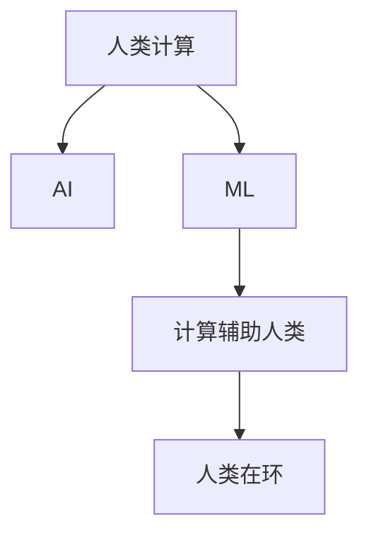

                 

# 微任务，大贡献：探索人类计算的价值

## 1. 背景介绍

### 1.1 问题由来

随着计算技术的飞速发展，人工智能(AI)和机器学习(ML)技术的应用领域不断扩展，从自然语言处理(NLP)到计算机视觉(CV)，再到机器人学和自动驾驶，AI和ML技术已经渗透到了社会的各个角落。然而，尽管这些技术取得了显著进展，但它们的根基仍然建立在人类计算的基础上。人类计算，即通过人脑进行的有意识计算，是AI系统能够正常运作的基础。

### 1.2 问题核心关键点

人类计算在AI和ML系统中扮演着至关重要的角色。无论是通过编写代码、设计算法、训练模型，还是解释模型输出，人类的智慧和经验都是不可或缺的。然而，随着计算任务的复杂性和数据量的不断增加，单纯依靠人类计算已经无法满足日益增长的需求。因此，如何更好地利用人类计算，使其在AI和ML系统中发挥更大的作用，成为一个亟待解决的问题。

## 2. 核心概念与联系

### 2.1 核心概念概述

为了更好地理解人类计算在AI和ML系统中的价值，本节将介绍几个密切相关的核心概念：

- 人类计算(Human Computation)：指人类通过智力、经验和创造力进行的有意识计算。在AI和ML系统中，人类计算主要体现在知识获取、模型设计和结果解释等方面。

- 人工智能(AI)：指通过模拟人类智能行为，使计算机系统具备自主学习、决策和执行的能力。人类计算在AI系统中充当着设计者、训练者和优化者的角色。

- 机器学习(ML)：指让计算机系统通过数据和算法，自动学习模式并做出预测或决策的过程。人类计算在ML中体现在数据标注、特征选择和模型调试等方面。

- 人类在环(Human-in-the-Loop, HiL)：指在AI和ML系统中，将人类的智慧和经验融入到计算过程中，提升系统的可靠性和可解释性。

- 计算辅助人类(CAI)：指利用计算技术辅助人类进行复杂计算，提升计算效率和准确性，进而增强人类的决策能力。

这些核心概念之间的逻辑关系可以通过以下Mermaid流程图来展示：



这个流程图展示了人类计算在AI和ML系统中的作用和联系：

1. 人类计算是AI和ML系统的设计者和优化者，提供知识和智慧。
2. 机器学习通过对大量数据进行学习，自动提取模式。
3. 计算辅助人类通过工具和技术，提高人类计算效率。
4. 人类在环系统将人类智慧和计算结合，提升系统性能和可解释性。

## 3. 核心算法原理 & 具体操作步骤

### 3.1 算法原理概述

在AI和ML系统中，人类计算的价值主要体现在以下几个方面：

- **知识获取**：AI和ML系统需要大量的领域知识才能进行有效的学习。这些知识通常来自于人类专家的经验和研究成果。

- **模型设计**：设计高效的模型结构是AI和ML系统成功的关键。这需要人类在长期实践中积累的智慧和经验。

- **数据标注**：高质量的数据标注是ML系统学习的基础。数据标注通常需要人类的判断和决策。

- **结果解释**：AI和ML系统的输出通常需要人类的理解和解释。人类计算在结果解释和决策支持中起着重要作用。

- **系统优化**：在模型训练和系统运行过程中，需要不断优化模型和系统性能，这通常需要人类的经验和判断。

### 3.2 算法步骤详解

基于人类计算的AI和ML系统设计一般包括以下关键步骤：

1. **需求分析和设计**：明确系统目标和需求，设计合理的系统架构。

2. **数据收集和标注**：收集和标注大量数据，作为模型训练的输入。

3. **模型训练和优化**：选择合适的算法和模型，通过数据训练和优化模型。

4. **系统部署和测试**：将训练好的模型部署到实际应用中，进行测试和验证。

5. **结果解释和优化**：对系统输出进行解释，根据反馈优化模型和系统。

### 3.3 算法优缺点

基于人类计算的AI和ML系统设计具有以下优点：

- **灵活性高**：人类可以根据实际情况，灵活调整模型和算法，适应不同场景的需求。

- **可解释性强**：人类能够理解和解释模型的内部机制和决策过程，提供可信的解释和建议。

- **适应性强**：人类能够根据实际情况，不断优化模型和系统，适应复杂和多变的任务环境。

- **效率高**：人类利用其智慧和经验，能够快速识别问题和提出解决方案。

然而，这些系统也存在以下缺点：

- **依赖性强**：系统的成功高度依赖于专家的知识和经验，一旦专家离开，系统可能面临性能下降。

- **成本高**：数据标注和模型训练需要大量的人力和时间，成本较高。

- **主观性强**：人类判断和决策存在主观性和不确定性，可能影响系统的客观性和公正性。

### 3.4 算法应用领域

基于人类计算的AI和ML系统已经在多个领域得到了广泛应用，例如：

- 自然语言处理(NLP)：通过人类的语言理解和生成能力，实现机器翻译、情感分析、问答系统等功能。

- 计算机视觉(CV)：利用人类的视觉感知和理解能力，实现图像分类、目标检测、图像生成等功能。

- 自动驾驶：将人类的驾驶经验和安全意识融入到车辆自动驾驶系统中，提高驾驶安全性。

- 机器人学：利用人类的操作和感知能力，实现机器人的自主移动和操作。

- 医疗诊断：通过人类的医学知识和经验，提高疾病的诊断和预测准确性。

- 金融风险评估：利用人类的金融知识和经验，进行风险评估和投资决策。

这些应用展示了人类计算在AI和ML系统中的巨大潜力，为各行各业带来了新的变革。

## 4. 数学模型和公式 & 详细讲解 & 举例说明

### 4.1 数学模型构建

在AI和ML系统中，人类计算的价值通常通过数学模型来表达。一个典型的AI和ML系统设计模型包括：

- **数据模型**：描述数据的分布和特性，如高斯分布、正态分布等。

- **模型结构**：定义模型的内部结构和参数，如神经网络、决策树等。

- **损失函数**：衡量模型输出与真实标签之间的差异，如均方误差、交叉熵等。

- **优化算法**：通过最小化损失函数，调整模型参数，如梯度下降、Adam等。

### 4.2 公式推导过程

以下以线性回归模型为例，推导最小化损失函数的过程。

假设模型 $M(x)=w_1x_1+w_2x_2+b$，其中 $x_1$ 和 $x_2$ 为特征，$y$ 为真实标签，$w_1$ 和 $w_2$ 为模型参数，$b$ 为偏置项。模型预测输出为 $\hat{y}=M(x)$。

均方误差损失函数为：

$$
\mathcal{L}(M)=\frac{1}{N}\sum_{i=1}^N (y_i - \hat{y}_i)^2
$$

其中 $N$ 为样本数量。

最小化损失函数 $\mathcal{L}(M)$ 的过程为：

$$
\min_{w_1, w_2, b} \mathcal{L}(M)
$$

根据梯度下降算法，最小化损失函数的过程为：

$$
\theta \leftarrow \theta - \eta \nabla_{\theta}\mathcal{L}(\theta)
$$

其中 $\eta$ 为学习率，$\nabla_{\theta}\mathcal{L}(\theta)$ 为损失函数对模型参数的梯度，可通过反向传播算法高效计算。

### 4.3 案例分析与讲解

以图像分类任务为例，假设模型结构为卷积神经网络(CNN)，训练数据集为ImageNet，每个样本包含 $299\times299$ 的图像和相应标签。模型参数初始化为随机值。

**数据预处理**：将图像进行归一化和裁剪，减少过拟合。

**模型训练**：将图像输入CNN模型，计算损失函数和梯度，使用梯度下降算法更新模型参数。

**模型测试**：在测试集上评估模型性能，通过精度和召回率等指标进行评估。

## 5. 项目实践：代码实例和详细解释说明

### 5.1 开发环境搭建

在进行AI和ML系统开发前，需要准备好开发环境。以下是使用Python进行TensorFlow开发的环境配置流程：

1. 安装Anaconda：从官网下载并安装Anaconda，用于创建独立的Python环境。

2. 创建并激活虚拟环境：
```bash
conda create -n tf-env python=3.7 
conda activate tf-env
```

3. 安装TensorFlow：根据CUDA版本，从官网获取对应的安装命令。例如：
```bash
pip install tensorflow==2.4
```

4. 安装其他工具包：
```bash
pip install numpy scipy pandas scikit-learn matplotlib jupyter notebook ipython
```

完成上述步骤后，即可在`tf-env`环境中开始AI和ML系统开发。

### 5.2 源代码详细实现

下面我们以图像分类任务为例，给出使用TensorFlow进行CNN模型训练的Python代码实现。

首先，定义CNN模型和优化器：

```python
import tensorflow as tf

# 定义CNN模型
def create_model():
    model = tf.keras.Sequential([
        tf.keras.layers.Conv2D(32, (3, 3), activation='relu', input_shape=(299, 299, 3)),
        tf.keras.layers.MaxPooling2D((2, 2)),
        tf.keras.layers.Flatten(),
        tf.keras.layers.Dense(10, activation='softmax')
    ])
    return model

# 定义优化器
optimizer = tf.keras.optimizers.Adam(learning_rate=0.001)

# 创建模型实例
model = create_model()

# 编译模型
model.compile(optimizer=optimizer, loss='categorical_crossentropy', metrics=['accuracy'])
```

然后，定义数据集和模型训练过程：

```python
# 加载数据集
(train_images, train_labels), (test_images, test_labels) = tf.keras.datasets.cifar10.load_data()

# 数据预处理
train_images = train_images / 255.0
test_images = test_images / 255.0

# 数据增强
train_dataset = tf.keras.preprocessing.image.ImageDataGenerator(
    width_shift_range=0.1,
    height_shift_range=0.1,
    horizontal_flip=True
)
train_generator = train_dataset.flow(train_images, train_labels, batch_size=32)

# 模型训练
model.fit(train_generator, epochs=10, validation_data=(test_images, test_labels))
```

最后，评估模型在测试集上的表现：

```python
# 评估模型
test_loss, test_acc = model.evaluate(test_images, test_labels)
print('Test accuracy:', test_acc)
```

以上就是使用TensorFlow进行CNN模型图像分类任务微调的完整代码实现。可以看到，得益于TensorFlow的强大封装，我们可以用相对简洁的代码完成模型的构建和训练。

### 5.3 代码解读与分析

让我们再详细解读一下关键代码的实现细节：

**create_model函数**：
- 定义了包含卷积层、池化层和全连接层的CNN模型。

**optimizer和model.compile**：
- 定义了Adam优化器，并使用compile方法将模型与优化器、损失函数和评估指标绑定。

**ImageDataGenerator和flow方法**：
- 使用ImageDataGenerator进行数据增强，包括随机裁剪、水平翻转等操作。flow方法用于将增强后的图像数据和标签转换为TensorFlow的数据集。

**model.fit**：
- 调用fit方法训练模型，设置训练轮数和验证集。

**model.evaluate**：
- 调用evaluate方法在测试集上评估模型性能，返回损失和准确率。

可以看到，TensorFlow提供了丰富的API，使得CNN模型的训练过程变得简单高效。开发者可以将更多精力放在数据处理、模型改进等高层逻辑上，而不必过多关注底层的实现细节。

当然，工业级的系统实现还需考虑更多因素，如模型的保存和部署、超参数的自动搜索、更灵活的任务适配层等。但核心的微调范式基本与此类似。

## 6. 实际应用场景

### 6.1 智能医疗诊断

基于人类计算的AI系统已经在医疗领域得到了广泛应用，如智能医疗诊断。传统的医疗诊断依赖于医生的经验和直觉，但在面对复杂病例和大量数据时，医生的判断可能会存在偏差。通过引入AI系统，可以有效提升诊断的准确性和效率。

在技术实现上，可以收集大量的病历数据和专家诊断结果，对模型进行预训练。在实际应用中，将新病人的病历输入模型，输出诊断结果，辅助医生进行决策。对于不确定的病例，医生可以进一步检查和分析，以确保诊断的准确性。

### 6.2 自动驾驶

自动驾驶技术是AI和ML系统在交通领域的典型应用。传统的驾驶依赖于司机的经验和直觉，但面对复杂的城市交通环境，人类司机的判断和反应速度可能受限。通过引入AI系统，可以大幅提升自动驾驶的安全性和可靠性。

在技术实现上，可以收集大量的驾驶数据和交通场景数据，对模型进行预训练。在实际应用中，AI系统可以实时感知和理解交通环境，做出安全驾驶决策，提高驾驶效率和安全性。

### 6.3 金融风险评估

金融领域需要快速评估大量交易和投资的风险，传统的人工评估方式效率低下，容易产生偏差。通过引入AI系统，可以有效提升金融风险评估的准确性和效率。

在技术实现上，可以收集大量的金融数据和专家评估结果，对模型进行预训练。在实际应用中，将新的交易数据输入模型，输出风险评估结果，辅助决策者进行投资决策。

### 6.4 未来应用展望

随着AI和ML技术的不断发展，基于人类计算的AI和ML系统将在更多领域得到应用，为各行各业带来变革性影响。

在智慧城市治理中，基于人类计算的AI系统可以帮助城市管理部门实时监测和分析各类事件，提高应急响应和决策效率。在教育领域，AI系统可以辅助教师进行个性化教学，提高教学效果和学生体验。在科学研究中，AI系统可以帮助科学家进行数据分析和实验设计，加速科研进程。

## 7. 工具和资源推荐

### 7.1 学习资源推荐

为了帮助开发者系统掌握AI和ML技术，这里推荐一些优质的学习资源：

1. 《深度学习》系列书籍：由深度学习领域的权威专家撰写，全面介绍了深度学习的理论基础和实践技巧。

2. Coursera《深度学习专项课程》：由斯坦福大学开设的深度学习课程，涵盖从基础到高级的多个主题，提供了丰富的学习材料和作业。

3. TensorFlow官方文档：TensorFlow的官方文档，提供了丰富的API和样例代码，是入门和进阶学习的重要资源。

4. PyTorch官方文档：PyTorch的官方文档，提供了丰富的API和样例代码，适合深度学习和模型优化实践。

5. Kaggle数据集和竞赛平台：提供了丰富的数据集和竞赛机会，可以实践和提升数据分析和模型训练技能。

通过对这些资源的学习实践，相信你一定能够快速掌握AI和ML技术的精髓，并用于解决实际的计算问题。

### 7.2 开发工具推荐

高效的开发离不开优秀的工具支持。以下是几款用于AI和ML系统开发的常用工具：

1. TensorFlow：由Google主导开发的开源深度学习框架，生产部署方便，适合大规模工程应用。

2. PyTorch：基于Python的开源深度学习框架，灵活动态的计算图，适合快速迭代研究。

3. Jupyter Notebook：交互式编程环境，支持代码编写、数据可视化和模型训练，是数据分析和模型训练的重要工具。

4. Weights & Biases：模型训练的实验跟踪工具，可以记录和可视化模型训练过程中的各项指标，方便对比和调优。

5. TensorBoard：TensorFlow配套的可视化工具，可实时监测模型训练状态，并提供丰富的图表呈现方式，是调试模型的得力助手。

合理利用这些工具，可以显著提升AI和ML系统的开发效率，加快创新迭代的步伐。

### 7.3 相关论文推荐

AI和ML技术的发展源于学界的持续研究。以下是几篇奠基性的相关论文，推荐阅读：

1. 《ImageNet分类挑战赛》：描述了ImageNet数据集的构建和AI系统在图像分类任务上的突破性进展。

2. 《深度学习在自然语言处理中的应用》：介绍了深度学习在NLP任务上的应用，包括文本分类、机器翻译、情感分析等。

3. 《自动驾驶技术综述》：综述了自动驾驶技术的现状和发展方向，介绍了AI系统在驾驶感知和决策中的应用。

4. 《医疗AI系统综述》：综述了医疗AI系统的现状和发展方向，介绍了AI系统在医疗诊断和治疗中的应用。

这些论文代表了大规模AI和ML系统的研究和应用进展，展示了AI技术在各个领域的应用潜力。

## 8. 总结：未来发展趋势与挑战

### 8.1 研究成果总结

本文对基于人类计算的AI和ML系统进行了全面系统的介绍。首先阐述了人类计算在AI和ML系统中的价值，明确了AI和ML系统设计对人类智慧和经验的依赖。其次，从原理到实践，详细讲解了基于人类计算的AI和ML系统设计的数学模型和算法步骤，给出了AI和ML系统开发的完整代码实例。同时，本文还广泛探讨了AI和ML系统在多个行业领域的应用前景，展示了人类计算的巨大潜力。最后，本文精选了AI和ML技术的各类学习资源，力求为读者提供全方位的技术指引。

通过本文的系统梳理，可以看到，基于人类计算的AI和ML系统正在成为各行各业的重要工具，极大地提升了计算效率和决策能力。未来，伴随AI和ML技术的不断发展，基于人类计算的AI和ML系统将进一步拓展应用边界，带来更多的创新和突破。

### 8.2 未来发展趋势

展望未来，基于人类计算的AI和ML系统将呈现以下几个发展趋势：

1. **多模态融合**：未来的AI系统将融合视觉、语音、文本等多种模态数据，提升系统的感知和理解能力。

2. **自监督学习**：未来的AI系统将利用未标注数据进行预训练，减少对标注数据的依赖，提升系统的泛化能力。

3. **端到端系统**：未来的AI系统将更加注重端到端设计，减少中间环节，提升系统的实时性和可靠性。

4. **边缘计算**：未来的AI系统将更多地应用于边缘计算场景，提高计算效率和数据隐私性。

5. **人机协同**：未来的AI系统将更好地融合人类智慧和计算能力，提升系统的决策和解释能力。

以上趋势凸显了基于人类计算的AI和ML系统的发展方向，为各行各业带来了新的变革。这些方向的探索发展，必将进一步提升AI系统的性能和应用范围，为人类社会的进步贡献力量。

### 8.3 面临的挑战

尽管基于人类计算的AI和ML系统已经取得了显著成就，但在迈向更加智能化、普适化应用的过程中，它仍面临诸多挑战：

1. **数据隐私和安全**：AI系统需要大量数据进行训练，但这些数据可能包含敏感信息，如何保护数据隐私和安全是一个重要问题。

2. **模型可解释性**：AI系统的决策过程通常缺乏可解释性，难以对其推理逻辑进行分析和调试。

3. **鲁棒性和泛化能力**：AI系统面对新数据时，泛化性能往往大打折扣。如何提高模型的鲁棒性和泛化能力，还需要更多理论和实践的积累。

4. **计算资源和成本**：AI系统需要大量的计算资源进行训练和推理，成本较高。如何提高计算效率，降低成本，是一个重要的研究方向。

5. **伦理和社会影响**：AI系统在决策过程中可能存在偏见和歧视，如何保证其公平性和公正性，是一个亟待解决的问题。

6. **知识更新和迭代**：AI系统需要不断更新和迭代，以适应不断变化的数据和需求。如何实现知识的高效更新和迭代，是一个重要的挑战。

这些挑战凸显了基于人类计算的AI和ML系统的复杂性和多样性，需要各方共同努力，不断探索和解决。

### 8.4 研究展望

面对基于人类计算的AI和ML系统面临的挑战，未来的研究需要在以下几个方面寻求新的突破：

1. **隐私保护技术**：发展隐私保护技术，如差分隐私、联邦学习等，确保数据隐私和安全。

2. **可解释性技术**：发展可解释性技术，如模型蒸馏、可视化等，提升模型的可解释性和可审计性。

3. **鲁棒性优化**：发展鲁棒性优化技术，如对抗训练、自适应学习等，提升模型的泛化能力和鲁棒性。

4. **计算效率提升**：发展计算效率提升技术，如模型压缩、硬件加速等，降低计算成本。

5. **知识管理技术**：发展知识管理技术，如知识图谱、逻辑推理等，提升系统的知识整合和推理能力。

6. **伦理和社会影响评估**：发展伦理和社会影响评估技术，确保AI系统的公平性、公正性和可接受性。

这些研究方向将引领基于人类计算的AI和ML系统迈向更高的台阶，为构建安全、可靠、可解释、可控的智能系统铺平道路。面向未来，基于人类计算的AI和ML系统还需要与其他AI技术进行更深入的融合，如知识表示、因果推理、强化学习等，多路径协同发力，共同推动自然语言理解和智能交互系统的进步。只有勇于创新、敢于突破，才能不断拓展AI系统的边界，让智能技术更好地造福人类社会。

## 9. 附录：常见问题与解答

**Q1：AI和ML系统设计是否需要人类计算？**

A: 是的，AI和ML系统设计高度依赖于人类智慧和经验。无论是在模型选择、算法设计、数据标注，还是在结果解释和优化过程中，人类的智慧和经验都是不可或缺的。

**Q2：AI和ML系统设计中如何利用人类计算？**

A: AI和ML系统设计中，利用人类计算的方式主要包括以下几个方面：

1. **知识获取**：通过人类专家的研究成果和经验，为AI和ML系统提供领域知识和常识。

2. **模型设计**：利用人类智慧，设计高效的模型结构和算法，提高系统的性能。

3. **数据标注**：通过人类专家的判断和决策，进行高质量的数据标注。

4. **结果解释**：通过人类专家的理解和解释，提供可信的决策和解释。

5. **系统优化**：通过人类专家的经验和判断，不断优化系统性能，提高系统的可靠性和可解释性。

**Q3：AI和ML系统设计的成本和效率如何？**

A: AI和ML系统设计在初期可能面临较高的成本和复杂度，但一旦系统设计完成并上线，其计算效率和决策能力将大幅提升。

1. **成本**：AI和ML系统设计需要大量的人类计算资源，包括时间、人力和数据标注成本。

2. **效率**：AI和ML系统可以高效处理大量数据，自动学习和推理，提升决策效率。

**Q4：AI和ML系统设计的未来趋势是什么？**

A: 基于人类计算的AI和ML系统未来将呈现以下几个发展趋势：

1. **多模态融合**：未来的AI系统将融合多种模态数据，提升系统的感知和理解能力。

2. **自监督学习**：未来的AI系统将利用未标注数据进行预训练，减少对标注数据的依赖。

3. **端到端系统**：未来的AI系统将更加注重端到端设计，减少中间环节，提升系统的实时性和可靠性。

4. **边缘计算**：未来的AI系统将更多地应用于边缘计算场景，提高计算效率和数据隐私性。

5. **人机协同**：未来的AI系统将更好地融合人类智慧和计算能力，提升系统的决策和解释能力。

这些趋势凸显了基于人类计算的AI和ML系统的发展方向，为各行各业带来了新的变革。

**Q5：AI和ML系统设计面临的挑战是什么？**

A: AI和ML系统设计面临的挑战包括：

1. **数据隐私和安全**：AI系统需要大量数据进行训练，但这些数据可能包含敏感信息，如何保护数据隐私和安全是一个重要问题。

2. **模型可解释性**：AI系统的决策过程通常缺乏可解释性，难以对其推理逻辑进行分析和调试。

3. **鲁棒性和泛化能力**：AI系统面对新数据时，泛化性能往往大打折扣。如何提高模型的鲁棒性和泛化能力，还需要更多理论和实践的积累。

4. **计算资源和成本**：AI系统需要大量的计算资源进行训练和推理，成本较高。如何提高计算效率，降低成本，是一个重要的研究方向。

5. **伦理和社会影响**：AI系统在决策过程中可能存在偏见和歧视，如何保证其公平性、公正性和可接受性，是一个亟待解决的问题。

6. **知识更新和迭代**：AI系统需要不断更新和迭代，以适应不断变化的数据和需求。如何实现知识的高效更新和迭代，是一个重要的挑战。

这些挑战凸显了基于人类计算的AI和ML系统的复杂性和多样性，需要各方共同努力，不断探索和解决。

---

作者：禅与计算机程序设计艺术 / Zen and the Art of Computer Programming

