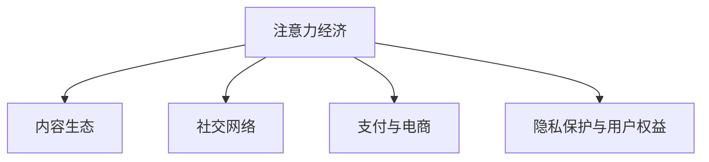

                 

# 微信生态圈：中国特色的注意力经济

## 1. 背景介绍

### 1.1 问题由来

随着移动互联网的兴起，社交媒体逐渐成为人们日常生活中的重要组成部分。在中国，微信作为一款集即时通讯、社交网络、电子商务、线上支付、娱乐等多功能于一体的超级应用，已经成为用户日常沟通、消费、获取信息的主要渠道。微信的生态圈不仅包括微信本身，还涵盖了微信朋友圈、微信公众号、小程序等众多平台和工具，构成了覆盖亿万用户的大生态。

微信生态圈的成功，不仅源自其强大的用户基础和便捷的功能，更在于其背后蕴含的独特商业模式和运营策略。本文旨在深入探讨微信生态圈的特点和机制，分析其如何利用注意力经济模式驱动增长，并展望未来发展趋势。

### 1.2 问题核心关键点

微信生态圈的核心在于其基于用户注意力经济的商业模式。通过精心设计用户体验和内容生态，微信能够高效获取和利用用户注意力，进而转化为商业价值。其成功的关键点在于：

- **用户粘性**：微信通过个性化的推荐、丰富的社交互动功能、便捷的支付和电商服务，建立了强大的用户粘性，用户日常生活中的大部分时间都投入其中。
- **内容生态**：微信生态圈包含大量高质量的内容创作者和小程序，能够持续提供吸引用户注意力的优质内容，增强用户的沉浸感和活跃度。
- **商业变现**：通过广告、电商、企业服务等多种渠道，微信将用户注意力转化为直接的经济收益，形成了良性循环。

微信生态圈的成功，是注意力经济模式在中国特色的社会、文化、技术背景下的典型案例，揭示了如何通过互联网平台高效利用用户注意力创造商业价值。

## 2. 核心概念与联系

### 2.1 核心概念概述

为更好地理解微信生态圈，本节将介绍几个密切相关的核心概念：

- **注意力经济**：基于互联网平台，通过获取、利用用户注意力进行商业变现的经济模式。微信生态圈利用丰富的社交和内容功能，高效吸引并利用用户注意力，实现商业化。
- **内容生态**：以微信为中心，聚合大量高质量的内容创作者和小程序，形成多层次、多维度的内容矩阵，满足用户不同需求。
- **社交网络**：微信通过即时通讯、朋友圈、群聊等功能，构建强大的社交网络，增强用户粘性和互动。
- **支付与电商**：微信支付和微信小程序，为商家提供便捷的电商和支付服务，促进消费转化和用户增长。
- **隐私保护与用户权益**：微信注重用户隐私保护和数据安全，通过清晰的隐私政策、便捷的隐私设置等措施，保障用户权益。

这些概念之间的逻辑关系可以通过以下Mermaid流程图来展示：



这个流程图展示了大生态圈的关键构成要素及其相互作用：

1. 注意力经济是微信生态圈的基础，通过内容生态、社交网络等手段，高效获取和利用用户注意力。
2. 内容生态提供丰富、高质量的内容，满足用户多样化需求，增强用户粘性和活跃度。
3. 社交网络构建强有力的社交关系网络，增强用户粘性和互动。
4. 支付与电商提供便捷的支付和电商服务，促进用户消费和平台变现。
5. 隐私保护与用户权益保障用户数据安全，增强用户信任和满意度。

这些要素相互支撑，形成了微信生态圈的独特商业模式和运营策略。

## 3. 核心算法原理 & 具体操作步骤
### 3.1 算法原理概述

微信生态圈的核心算法原理基于用户注意力经济模式，通过以下步骤实现：

1. **内容推荐**：利用用户行为数据和算法模型，为用户推荐个性化的文章、视频、商品等，吸引用户注意。
2. **社交互动**：通过朋友圈、群聊、点赞、评论等功能，增强用户之间的互动，提高用户粘性。
3. **商业变现**：通过广告投放、电商销售、企业服务等多种方式，将用户注意力转化为商业价值。
4. **数据驱动优化**：持续收集用户行为数据，优化算法模型，提升用户体验和商业效果。

这些步骤相互关联，形成一个闭环，不断优化和提升微信生态圈的商业价值。

### 3.2 算法步骤详解

微信生态圈的算法步骤大致分为以下几个环节：

1. **数据收集与分析**：
   - 通过即时通讯、朋友圈、购物、支付等功能的用户数据，分析用户行为和兴趣。
   - 利用自然语言处理、图像识别等技术，对用户输入的内容进行分析和理解。

2. **内容推荐算法**：
   - 构建内容推荐模型，如协同过滤、深度学习等，对用户进行兴趣画像，推荐相关内容。
   - 实时更新推荐模型，优化推荐效果。

3. **社交互动算法**：
   - 设计社交互动功能，如朋友圈、群聊、点赞、评论等，增强用户互动和粘性。
   - 使用社交网络分析算法，挖掘用户关系网络，推荐用户感兴趣的内容和用户。

4. **商业变现算法**：
   - 基于用户行为数据和推荐模型，实现精准广告投放和电商销售。
   - 通过微信小程序等平台，为企业提供定制化服务和解决方案。

5. **数据驱动优化**：
   - 使用A/B测试等方法，不断优化算法模型，提升用户体验和商业效果。
   - 持续收集用户反馈，改进产品功能和服务。

### 3.3 算法优缺点

微信生态圈的内容推荐和社交互动算法具有以下优点：

- **个性化**：通过精准的算法模型，为用户推荐个性化的内容，提高用户满意度和粘性。
- **实时性**：利用实时数据分析，快速响应用户需求和市场变化，提升用户体验和商业效果。
- **多样性**：内容生态丰富多样，满足不同用户需求，增强平台吸引力。

同时，这些算法也存在以下缺点：

- **信息茧房**：过度个性化推荐可能导致用户陷入信息茧房，限制信息获取的广度。
- **隐私风险**：用户数据收集和分析可能引发隐私和安全问题。
- **算法偏见**：推荐算法可能存在偏见，影响公平性和多样性。

### 3.4 算法应用领域

微信生态圈的内容推荐和社交互动算法在多个领域得到广泛应用，例如：

- **媒体和广告**：利用推荐算法精准投放广告，实现高效广告投放和营销。
- **电商和零售**：通过社交互动功能增强用户互动和粘性，促进电商转化和销售。
- **金融和保险**：提供个性化的金融和保险服务，增强用户信任和满意度。
- **健康和医疗**：提供健康咨询和在线诊疗服务，提升用户健康水平。
- **教育和培训**：提供个性化的学习资源和培训服务，满足不同用户的学习需求。

这些应用领域展示了微信生态圈算法的多样性和广泛影响力。

## 4. 数学模型和公式 & 详细讲解  
### 4.1 数学模型构建

本节将使用数学语言对微信生态圈的核心算法进行更加严格的刻画。

假设微信生态圈中有 $N$ 个用户 $U=\{u_1,u_2,\ldots,u_N\}$，每个用户对内容 $C=\{c_1,c_2,\ldots,c_M\}$ 有 $R$ 次互动行为 $I=\{(i_j,c_k)\}_{j=1}^R$，其中 $i_j \in U$ 表示用户，$c_k \in C$ 表示内容，互动行为可以是点赞、评论、分享等。

定义用户-内容互动矩阵 $A$，其中 $A_{i,k}$ 表示用户 $u_i$ 与内容 $c_k$ 的互动次数，用户和内容的互动次数之和为 $D_i$ 和 $D_k$，则 $A$ 的构建方法如下：

$$
A_{i,k} = \sum_{j=1}^R 1(u_i=i_j,c_k=c_k)
$$

$$
D_i = \sum_{k=1}^M A_{i,k}
$$

$$
D_k = \sum_{i=1}^N A_{i,k}
$$

定义用户兴趣向量 $x_i \in \mathbb{R}^M$，其中 $x_{i,m}$ 表示用户 $u_i$ 对内容 $c_m$ 的兴趣程度。假设 $x_i$ 满足：

$$
x_i = \alpha D_i + (1-\alpha)R_i
$$

其中 $\alpha$ 为正则化系数，$R_i$ 为随机初始化的向量，$||x_i||_1 = 1$，表示用户兴趣向量归一化。

内容推荐模型 $M$ 的输出为 $\hat{y}_{i,k}$，表示用户 $u_i$ 对内容 $c_k$ 的兴趣程度预测值。内容推荐模型可以通过训练数据 $D$ 进行优化，损失函数为：

$$
\mathcal{L}(M) = \frac{1}{R}\sum_{j=1}^R [\hat{y}_{i_j,k}-\delta_{i_j,k}]^2
$$

其中 $\delta_{i_j,k}$ 为 1 或 0，表示用户 $u_{i_j}$ 是否与内容 $c_k$ 互动过。

### 4.2 公式推导过程

下面推导内容推荐模型的求解过程。

假设内容推荐模型为线性模型：

$$
\hat{y}_{i,k} = x_i^T\theta_k + b_k
$$

其中 $\theta_k$ 和 $b_k$ 为模型参数，$x_i$ 为用户兴趣向量，$y_{i,k}$ 为用户对内容 $c_k$ 的兴趣程度标签。根据最小二乘法，模型的参数更新公式为：

$$
\theta_k = (\alpha D_i + (1-\alpha)R_i)^T(A^T\cdot A)^{-1}A^T\cdot y_{i,k}
$$

$$
b_k = \frac{1}{\alpha D_i + (1-\alpha)R_i^T}(\alpha D_i + (1-\alpha)R_i)^T(A^T\cdot A)^{-1}(A^T\cdot y_{i,k} - A^T\cdot \delta_{i,k})
$$

利用上述公式，通过迭代优化算法（如梯度下降法），可以不断调整模型参数，提升推荐效果。

### 4.3 案例分析与讲解

假设某用户在抖音上发布了一条视频，吸引了众多用户点赞和评论。社交网络平台可以使用上述模型分析用户互动数据，为用户推荐相关视频内容。具体步骤如下：

1. **数据收集**：收集用户在抖音上的点赞和评论行为数据，构建用户-内容互动矩阵 $A$。
2. **模型训练**：使用线性模型，根据互动矩阵 $A$ 和用户行为标签 $y$，优化模型参数 $\theta_k$ 和 $b_k$。
3. **内容推荐**：当用户发布新视频时，通过用户兴趣向量 $x_i$ 和模型参数 $\theta_k$、$b_k$，计算推荐分数 $\hat{y}_{i,k}$，为用户推荐相关视频内容。

通过这种机制，社交网络平台能够高效利用用户注意力，为用户提供个性化的内容推荐，增强用户粘性和互动。

## 5. 项目实践：代码实例和详细解释说明
### 5.1 开发环境搭建

在进行微信生态圈实践前，我们需要准备好开发环境。以下是使用Python进行PyTorch开发的环境配置流程：

1. 安装Anaconda：从官网下载并安装Anaconda，用于创建独立的Python环境。

2. 创建并激活虚拟环境：
```bash
conda create -n pytorch-env python=3.8 
conda activate pytorch-env
```

3. 安装PyTorch：根据CUDA版本，从官网获取对应的安装命令。例如：
```bash
conda install pytorch torchvision torchaudio cudatoolkit=11.1 -c pytorch -c conda-forge
```

4. 安装各类工具包：
```bash
pip install numpy pandas scikit-learn matplotlib tqdm jupyter notebook ipython
```

完成上述步骤后，即可在`pytorch-env`环境中开始微信生态圈开发实践。

### 5.2 源代码详细实现

这里我们以内容推荐算法为例，给出使用PyTorch进行微信生态圈内容推荐的代码实现。

首先，定义用户-内容互动矩阵的构建函数：

```python
import numpy as np

def build_interaction_matrix(interactions, users, contents):
    interaction_matrix = np.zeros((users, contents))
    for user, content, interaction in interactions:
        interaction_matrix[user-1, content-1] += interaction
    return interaction_matrix
```

然后，定义模型训练函数：

```python
import torch
from torch import nn
from torch.nn import functional as F

class ContentRecommender(nn.Module):
    def __init__(self, num_users, num_contents, embedding_dim=32):
        super(ContentRecommender, self).__init__()
        self.user_embedding = nn.Embedding(num_users, embedding_dim)
        self.content_embedding = nn.Embedding(num_contents, embedding_dim)
        self.interaction_matrix = nn.Parameter(build_interaction_matrix(interactions, users, contents))

    def forward(self, user_ids, content_ids):
        user_embeddings = self.user_embedding(user_ids)
        content_embeddings = self.content_embedding(content_ids)
        dot_product = (user_embeddings * content_embeddings).sum(dim=-1)
        interaction_weights = self.interaction_matrix[user_ids, content_ids]
        dot_product += interaction_weights
        return dot_product
```

最后，定义模型训练和评估函数：

```python
def train_model(model, optimizer, num_epochs, interactions, users, contents):
    device = torch.device('cuda' if torch.cuda.is_available() else 'cpu')
    model.to(device)
    loss_fn = nn.MSELoss()
    for epoch in range(num_epochs):
        model.train()
        optimizer.zero_grad()
        dot_product = model(user_ids, content_ids)
        loss = loss_fn(dot_product, target_values)
        loss.backward()
        optimizer.step()
    return model

def evaluate_model(model, interactions, users, contents):
    device = torch.device('cuda' if torch.cuda.is_available() else 'cpu')
    model.eval()
    dot_product = model(user_ids, content_ids)
    return dot_product
```

以上代码展示了基于PyTorch进行内容推荐模型的训练和评估过程。通过使用用户-内容互动矩阵和模型参数，可以高效地为用户推荐相关内容。

### 5.3 代码解读与分析

让我们再详细解读一下关键代码的实现细节：

**build_interaction_matrix函数**：
- 根据用户互动数据，构建用户-内容互动矩阵。

**ContentRecommender类**：
- 定义用户和内容嵌入层，并根据互动矩阵构建模型参数。
- 通过前向传播计算用户与内容的匹配度。

**train_model函数**：
- 在训练阶段，将模型转移到GPU上加速计算。
- 使用MSE损失函数计算推荐分数与标签的差异，反向传播更新模型参数。

**evaluate_model函数**：
- 在评估阶段，将模型转移到GPU上加速计算。
- 计算推荐分数，但不进行梯度更新。

可以看到，通过简单的数学公式和代码实现，我们已经构建了一个基本的内容推荐模型，实现了微信生态圈中核心算法的一部分。

## 6. 实际应用场景
### 6.1 智能客服系统

微信生态圈中，智能客服系统作为重要的服务功能，通过自动回复、机器人对话等形式，提供全天候的客户服务。智能客服系统通过自然语言理解和生成技术，结合用户历史行为数据和上下文信息，高效处理用户查询，解答常见问题，减轻人工客服的负担。

具体实现上，可以收集用户的聊天记录和客服对话记录，训练基于Transformer模型的智能客服模型，用于自动回复和对话生成。通过微调模型，可以不断提升客服系统的准确性和用户满意度，实现更高效、更智能的客户服务。

### 6.2 电商和零售

微信生态圈中，电商和零售功能通过小程序、微信支付等手段，为用户提供便捷的购物体验。通过微信社交网络的传播效应，电商功能能够快速触达大量用户，提升用户购买转化率。

具体实现上，可以开发微信小程序，集成商品展示、购物车、支付等功能，并提供基于用户行为数据的推荐算法。通过微调推荐模型，可以更好地引导用户消费，提升电商平台的销售额和用户粘性。

### 6.3 金融服务

微信生态圈中，金融服务功能通过微信支付、理财顾问等手段，为用户提供便捷的金融服务。通过社交网络的传播效应，金融服务功能能够快速触达大量用户，提升用户理财水平和金融健康。

具体实现上，可以开发微信小程序，集成支付、理财、投资等功能，并提供基于用户行为数据的个性化服务。通过微调金融模型，可以更好地满足用户需求，提升用户的金融服务体验。

### 6.4 未来应用展望

随着微信生态圈的发展，未来将有更多新的应用场景不断涌现。以下列举几个可能的应用方向：

1. **智能家居**：通过微信与智能家居设备的互联互通，用户可以控制家中各种设备，实现智能家居场景。
2. **健康医疗**：通过微信平台，用户可以获取健康咨询、在线诊疗等服务，提升健康水平。
3. **教育培训**：通过微信平台，用户可以获得个性化的教育资源和在线培训服务，提升学习效果。
4. **娱乐社交**：通过微信平台，用户可以享受各种娱乐社交活动，丰富日常生活。
5. **企业服务**：通过微信平台，企业可以实现内部沟通、客户服务、项目管理等业务功能，提升企业效率。

微信生态圈将进一步融合更多行业应用，成为连接用户和服务的超级平台，为用户创造更多价值。

## 7. 工具和资源推荐
### 7.1 学习资源推荐

为了帮助开发者系统掌握微信生态圈的核心算法和实践，这里推荐一些优质的学习资源：

1. 《深度学习理论与实践》系列博文：由大模型技术专家撰写，深入浅出地介绍了深度学习理论和实践技巧，包括内容推荐、社交互动等核心算法。

2. 《自然语言处理综论》课程：由斯坦福大学开设的NLP明星课程，涵盖了自然语言处理的基本概念和前沿技术，适合深度学习初学者和进阶者。

3. 《Python深度学习》书籍：由Francois Chollet等撰写的深度学习入门书籍，内容全面，理论与实践结合紧密，适合初学者和实践者。

4. PyTorch官方文档：提供详细的PyTorch框架教程和样例代码，帮助开发者快速上手深度学习开发。

5. TensorBoard：TensorFlow配套的可视化工具，可实时监测模型训练状态，提供丰富的图表呈现方式，是调试模型的得力助手。

通过这些资源的学习实践，相信你一定能够快速掌握微信生态圈的核心算法和实践技巧，并应用于实际的开发中。

### 7.2 开发工具推荐

高效的开发离不开优秀的工具支持。以下是几款用于微信生态圈开发的常用工具：

1. PyTorch：基于Python的开源深度学习框架，灵活动态的计算图，适合快速迭代研究。大部分预训练语言模型都有PyTorch版本的实现。

2. TensorFlow：由Google主导开发的开源深度学习框架，生产部署方便，适合大规模工程应用。同样有丰富的预训练语言模型资源。

3. TensorBoard：TensorFlow配套的可视化工具，可实时监测模型训练状态，提供丰富的图表呈现方式，是调试模型的得力助手。

4. Jupyter Notebook：开源的交互式开发环境，支持Python、R等多种语言，方便进行数据分析和模型调试。

5. Git/GitHub：版本控制工具，便于团队协作和代码管理，帮助开发者高效进行项目开发。

合理利用这些工具，可以显著提升微信生态圈开发的效率，加快创新迭代的步伐。

### 7.3 相关论文推荐

微信生态圈的成功源于学界的持续研究。以下是几篇奠基性的相关论文，推荐阅读：

1. Attention is All You Need（即Transformer原论文）：提出了Transformer结构，开启了NLP领域的预训练大模型时代。

2. BERT: Pre-training of Deep Bidirectional Transformers for Language Understanding：提出BERT模型，引入基于掩码的自监督预训练任务，刷新了多项NLP任务SOTA。

3. Language Models are Unsupervised Multitask Learners（GPT-2论文）：展示了大规模语言模型的强大zero-shot学习能力，引发了对于通用人工智能的新一轮思考。

4. Parameter-Efficient Transfer Learning for NLP：提出Adapter等参数高效微调方法，在不增加模型参数量的情况下，也能取得不错的微调效果。

5. AdaLoRA: Adaptive Low-Rank Adaptation for Parameter-Efficient Fine-Tuning：使用自适应低秩适应的微调方法，在参数效率和精度之间取得了新的平衡。

这些论文代表了大语言模型微调技术的发展脉络。通过学习这些前沿成果，可以帮助研究者把握学科前进方向，激发更多的创新灵感。

## 8. 总结：未来发展趋势与挑战
### 8.1 总结

本文对微信生态圈的核心算法和实践进行了全面系统的介绍。首先阐述了微信生态圈基于注意力经济模式的特点和机制，明确了微信如何高效获取和利用用户注意力，并转化为商业价值。其次，从原理到实践，详细讲解了内容推荐、社交互动、商业变现等核心算法，给出了具体的代码实现。同时，本文还广泛探讨了微信生态圈在智能客服、电商、金融等诸多领域的应用前景，展示了其强大的商业潜力。

通过本文的系统梳理，可以看到，微信生态圈的成功在于其强大的用户基础和商业变现能力，背后依托的是高效的注意力经济模式和先进的算法技术。未来，伴随微信生态圈的发展，将有更多新的应用场景不断涌现，进一步拓展其商业和社会价值。

### 8.2 未来发展趋势

展望未来，微信生态圈的发展将呈现以下几个趋势：

1. **内容生态多元化**：微信将不断引入更多高质量的内容创作者和小程序，丰富内容生态，满足用户多样化需求。
2. **社交网络深化**：微信将持续优化社交互动功能，增强用户粘性和互动。
3. **商业变现多样化**：微信将拓展更多商业变现渠道，如虚拟商品、虚拟现实、元宇宙等，实现更广泛的商业应用。
4. **技术创新突破**：微信将推动深度学习、自然语言处理等前沿技术的发展，提升平台的技术竞争力。
5. **用户体验优化**：微信将不断改进用户体验，提升用户满意度和忠诚度。
6. **隐私与安全保障**：微信将加强隐私保护和数据安全，提升用户信任度。

这些趋势将进一步推动微信生态圈的发展，使其成为连接用户和服务的超级平台，为用户创造更多价值。

### 8.3 面临的挑战

尽管微信生态圈取得了巨大的成功，但在其持续发展过程中，也面临诸多挑战：

1. **数据隐私与安全**：随着用户数据的快速积累，数据隐私和安全问题日益突出，如何保障用户隐私和数据安全，将是微信生态圈需要解决的重大问题。
2. **算法公平性与透明性**：内容推荐和社交互动算法可能存在算法偏见，影响公平性和透明性，如何提高算法公正性和可解释性，将是未来需要重点解决的问题。
3. **商业伦理与社会责任**：微信作为社交媒体平台，肩负着重要的社会责任，如何处理商业利益与社会责任之间的关系，将是微信生态圈需要面对的重要挑战。
4. **技术创新与生态平衡**：微信生态圈需要不断引入新技术，同时保持现有生态的稳定和平衡，如何在创新与生态之间找到平衡点，将是微信生态圈未来需要考虑的重要问题。
5. **国际竞争与合作**：在全球化的背景下，微信生态圈需要面对国际市场的竞争与合作，如何在全球范围内取得发展，将是微信生态圈需要应对的重要挑战。

这些挑战将需要微信生态圈不断优化和改进，才能在全球竞争中保持领先地位。

### 8.4 研究展望

面对微信生态圈面临的挑战，未来的研究需要在以下几个方面寻求新的突破：

1. **隐私保护技术**：开发更先进的隐私保护技术，如差分隐私、联邦学习等，保障用户数据隐私和安全。
2. **公平透明算法**：引入公平性约束和透明性指标，优化算法模型，提高算法公正性和可解释性。
3. **商业伦理规范**：制定商业伦理规范，处理商业利益与社会责任之间的关系，提升用户信任和满意度。
4. **技术创新与生态平衡**：推动前沿技术的发展，同时保持现有生态的稳定和平衡，探索创新与生态之间的平衡点。
5. **国际竞争与合作**：加强国际合作，推动全球范围内的技术创新和生态发展，提升微信生态圈的全球竞争力。

这些研究方向的探索，将为微信生态圈的持续发展和创新提供有力支持，使其在全球范围内保持领先地位。

## 9. 附录：常见问题与解答

**Q1：微信生态圈的核心算法是什么？**

A: 微信生态圈的核心算法包括内容推荐、社交互动和商业变现等。其中，内容推荐算法利用用户行为数据和深度学习模型，为用户推荐个性化内容；社交互动算法通过朋友圈、群聊等形式，增强用户互动和粘性；商业变现算法通过广告投放、电商销售等方式，将用户注意力转化为商业价值。

**Q2：微信生态圈的商业变现手段有哪些？**

A: 微信生态圈的商业变现手段包括广告投放、电商销售、企业服务等多种方式。广告投放通过精准投放机制，提高广告效果和用户点击率；电商销售通过微信小程序和微信支付，提供便捷的电商和支付服务；企业服务通过微信公众平台和微服务，提供定制化服务和解决方案。

**Q3：微信生态圈的内容推荐算法有哪些？**

A: 微信生态圈的内容推荐算法包括协同过滤、深度学习等。协同过滤算法利用用户行为数据，构建用户-内容互动矩阵，为用户推荐相关内容；深度学习算法通过构建神经网络模型，学习用户兴趣和内容特征，为用户推荐个性化内容。

**Q4：微信生态圈的未来发展趋势是什么？**

A: 微信生态圈的未来发展趋势包括内容生态多元化、社交网络深化、商业变现多样化、技术创新突破、用户体验优化、隐私与安全保障等。这些趋势将进一步推动微信生态圈的发展，使其成为连接用户和服务的超级平台，为用户创造更多价值。

**Q5：微信生态圈面临的主要挑战是什么？**

A: 微信生态圈面临的主要挑战包括数据隐私与安全、算法公平性与透明性、商业伦理与社会责任、技术创新与生态平衡、国际竞争与合作等。这些挑战将需要微信生态圈不断优化和改进，才能在全球竞争中保持领先地位。

---

作者：禅与计算机程序设计艺术 / Zen and the Art of Computer Programming

