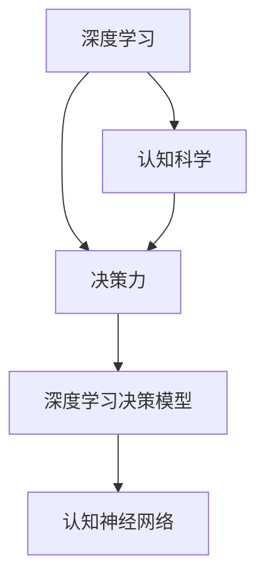

                 

# 思维体系:决策力的基石

## 1. 背景介绍

### 1.1 问题由来

在当今快速变化和复杂多变的社会环境中，面对各种决策挑战，如何有效地做出明智的决策成为了各个领域内的核心问题。无论是企业战略规划、产品研发、市场推广还是个人生活选择，决策力都是决定成败的关键因素。传统的决策过程往往依赖于经验、直觉和简单的数据统计分析，但在信息爆炸、变量交织、不确定性增多的今天，这些方法已经难以满足复杂决策的需求。

因此，研究一种能够适应现代决策环境的先进方法变得尤为重要。本文将探讨基于深度学习和认知科学的决策力模型，旨在提供一个理论基础，并结合实际案例来分析其应用与优势，从而为决策者提供一种系统化、科学化的决策支持工具。

### 1.2 问题核心关键点

在众多决策模型中，深度学习尤其是基于神经网络的模型因为其强大的数据处理能力和适应复杂环境的能力，成为了解决现代决策问题的有力工具。然而，深度学习模型的复杂性和不透明性也带来了新的挑战，包括但不限于模型过度拟合、决策过程难以解释等。

本文将聚焦于深度学习和认知科学相结合的决策力模型，探索如何利用深度学习模型处理数据，同时引入认知科学的心理学理论，确保模型输出与人类直觉和经验相一致，从而实现更高效、更可解释的决策支持。

### 1.3 问题研究意义

本研究旨在解决以下问题：

1. **决策力模型的构建与优化**：开发一种基于深度学习的决策力模型，结合认知科学原理，实现高效决策。
2. **决策过程的可解释性**：引入认知科学的心理学理论，提高模型输出的可解释性，增强决策的信任度。
3. **实际应用与案例分析**：结合实际案例，展示决策力模型的应用效果，提供实践指导。

## 2. 核心概念与联系

### 2.1 核心概念概述

- **深度学习**：一种通过多层神经网络逼近复杂非线性映射的机器学习方法，能够在处理大规模数据时表现出优越性能。
- **认知科学**：研究人类思维、感知和认知过程的科学，探讨如何将人类认知机制应用于机器学习模型的设计和训练。
- **决策力**：指在复杂环境中做出有效决策的能力，包括信息获取、问题定义、方案生成、选择与执行等环节。
- **深度学习决策模型**：结合深度学习模型和认知科学原理，构建的决策支持系统。
- **认知神经网络**：通过模拟人类认知过程，如记忆、注意力、推理等，增强深度学习模型的决策能力。

这些核心概念之间的关系可以用以下Mermaid流程图来表示：



这个流程图展示了各个概念之间的联系与转化过程。深度学习模型通过认知科学原理得到优化，提高了决策能力；决策力模型将深度学习和认知科学结合，实现了高效决策；认知神经网络作为模型的一部分，进一步增强了决策的认知特性。

## 3. 核心算法原理 & 具体操作步骤

### 3.1 算法原理概述

基于深度学习和认知科学的决策力模型，其主要思想是通过深度学习模型对决策环境中的数据进行特征提取和模式识别，结合认知科学的心理学理论，指导模型进行决策。其核心算法包括以下几个步骤：

1. **数据收集与预处理**：收集决策环境中的数据，并进行清洗、归一化等预处理操作，以提高模型的输入质量。
2. **特征提取与嵌入**：使用深度学习模型对数据进行特征提取，并将提取的特征进行向量嵌入，以捕捉数据中的隐含模式。
3. **认知推理与决策**：结合认知科学的心理学理论，对嵌入后的特征进行认知推理，生成候选方案。
4. **方案评估与选择**：通过评估各个方案的优劣，选择最佳方案作为决策结果。

### 3.2 算法步骤详解

#### 3.2.1 数据收集与预处理

**Step 1: 数据收集**
- 确定决策环境中的关键数据源，如市场数据、用户反馈、专家意见等。
- 设计问卷、访谈等形式，收集所需数据。

**Step 2: 数据清洗**
- 检查数据中是否存在缺失值、异常值或重复记录，进行相应处理。
- 对数据进行格式转换和归一化，确保数据的一致性和可用性。

**Step 3: 特征提取与嵌入**
- 使用神经网络对数据进行特征提取，常用的方法包括卷积神经网络（CNN）和循环神经网络（RNN）。
- 将提取的特征进行向量嵌入，使用嵌入层（Embedding Layer）或预训练词向量（如GloVe、Word2Vec）进行特征转换。

#### 3.2.2 认知推理与决策

**Step 4: 认知推理**
- 引入认知科学的心理学理论，如期望效用理论、启发式认知偏差等，对提取的特征进行认知推理。
- 使用认知推理模块（Cognitive Reasoning Module），根据当前状态和历史数据，生成候选方案。

**Step 5: 方案评估**
- 设计评估指标，如风险度、收益等，对各候选方案进行量化评估。
- 使用神经网络或决策树等方法，对候选方案进行排序。

**Step 6: 方案选择**
- 根据评估结果，选择最优方案作为决策结果。
- 在决策过程中引入人工干预，确保决策结果的合理性和可信度。

#### 3.2.3 方案执行与反馈

**Step 7: 方案执行**
- 执行选择的方案，并实时监控其执行效果。
- 在执行过程中，根据环境变化及时调整决策方案。

**Step 8: 反馈与优化**
- 收集执行结果的反馈信息，进行模型优化。
- 将反馈信息用于更新模型参数，提高模型的决策能力。

### 3.3 算法优缺点

基于深度学习和认知科学的决策力模型有以下优点：

1. **高效处理复杂数据**：深度学习模型在处理大规模、高维度数据时表现优异，能够快速捕捉数据中的隐含模式。
2. **增强决策可解释性**：结合认知科学的心理学理论，提高了模型输出的可解释性，增强了决策的信任度。
3. **适应性强**：结合深度学习的多层神经网络结构，该模型能够适应复杂多变的决策环境。

但该模型也存在一些缺点：

1. **计算资源需求高**：深度学习模型的训练和推理需要大量的计算资源，对硬件要求较高。
2. **模型复杂性高**：深度学习模型结构复杂，难以直观理解其决策过程。
3. **过度依赖数据**：深度学习模型对数据的依赖性强，数据质量对模型性能有直接影响。

### 3.4 算法应用领域

基于深度学习和认知科学的决策力模型，适用于多种决策场景，例如：

- **企业战略决策**：利用市场数据、专家意见等，辅助企业制定战略规划。
- **产品研发与优化**：通过用户反馈、市场趋势等，指导产品研发和市场推广策略。
- **金融投资**：结合市场数据、财务报告等，辅助金融投资决策。
- **医疗诊断**：利用患者数据、医疗记录等，辅助医疗诊断和治疗方案选择。
- **城市规划**：结合城市数据、居民反馈等，辅助城市规划和资源分配。

## 4. 数学模型和公式 & 详细讲解 & 举例说明

### 4.1 数学模型构建

假设决策环境中的数据集为 $\mathcal{D}=\{(x_i,y_i)\}_{i=1}^N$，其中 $x_i$ 为决策特征向量，$y_i$ 为对应决策结果。决策力模型的数学模型可以表示为：

$$
\hat{y} = f_{\theta}(x; \mathcal{D})
$$

其中 $f_{\theta}(x)$ 为决策模型，$\theta$ 为模型参数，$\mathcal{D}$ 为训练数据集。

### 4.2 公式推导过程

#### 4.2.1 特征提取与嵌入

假设使用卷积神经网络（CNN）对数据进行特征提取，模型结构如下：

$$
x = \{(x_1,x_2,...,x_n)\}
$$

其中 $x_i$ 表示决策特征向量。

卷积神经网络的结构可以表示为：

$$
f_{CNN}(x) = h_{CNN}(x; \theta_{CNN})
$$

其中 $h_{CNN}(x)$ 为卷积神经网络层，$\theta_{CNN}$ 为卷积神经网络层的参数。

对特征向量 $x$ 进行嵌入，得到嵌入向量 $h_{embed}$：

$$
h_{embed} = g_{embed}(x; \theta_{embed})
$$

其中 $g_{embed}$ 为嵌入层，$\theta_{embed}$ 为嵌入层的参数。

#### 4.2.2 认知推理与决策

引入期望效用理论，定义决策结果的期望效用函数为 $U(\hat{y})$：

$$
U(\hat{y}) = \sum_{y \in \mathcal{Y}} P(y|\hat{y}) \cdot U(y)
$$

其中 $P(y|\hat{y})$ 为决策结果 $y$ 在模型预测 $\hat{y}$ 下的概率，$U(y)$ 为决策结果 $y$ 的效用值。

结合认知科学的心理学理论，定义认知推理模块的结构为：

$$
f_{CR}(h_{embed}) = h_{CR}(h_{embed}; \theta_{CR})
$$

其中 $h_{CR}$ 为认知推理模块，$\theta_{CR}$ 为认知推理模块的参数。

#### 4.2.3 方案评估与选择

假设使用神经网络对各方案进行评估，模型结构为：

$$
f_{VA}(h_{CR}) = h_{VA}(h_{CR}; \theta_{VA})
$$

其中 $h_{VA}$ 为评估模块，$\theta_{VA}$ 为评估模块的参数。

将评估结果排序，选择最优方案：

$$
\hat{y} = \mathop{\arg\max}_{y \in \mathcal{Y}} U(y) = \mathop{\arg\max}_{y \in \mathcal{Y}} f_{VA}(f_{CR}(h_{embed}))
$$

### 4.3 案例分析与讲解

#### 案例1：企业战略决策

假设某企业需要对新的市场进入策略进行决策，数据集包含历史市场数据、竞争对手信息等。

**Step 1: 数据收集与预处理**
- 收集历史市场数据、竞争对手信息等。
- 清洗数据，处理缺失值和异常值，进行数据归一化。

**Step 2: 特征提取与嵌入**
- 使用卷积神经网络对市场数据和竞争对手信息进行特征提取。
- 对提取的特征进行嵌入，得到高维嵌入向量。

**Step 3: 认知推理与决策**
- 引入期望效用理论，对各候选方案的期望效用进行计算。
- 使用认知推理模块对嵌入向量进行处理，生成候选方案。

**Step 4: 方案评估与选择**
- 使用神经网络对各方案进行评估，得到评估结果。
- 根据评估结果选择最优方案，辅助企业制定市场进入策略。

#### 案例2：金融投资决策

假设某投资者需要对某股票进行投资决策，数据集包含股票历史数据、市场动态等。

**Step 1: 数据收集与预处理**
- 收集股票历史数据、市场动态等。
- 清洗数据，处理缺失值和异常值，进行数据归一化。

**Step 2: 特征提取与嵌入**
- 使用卷积神经网络对股票历史数据和市场动态进行特征提取。
- 对提取的特征进行嵌入，得到高维嵌入向量。

**Step 3: 认知推理与决策**
- 引入期望效用理论，对各候选方案的期望效用进行计算。
- 使用认知推理模块对嵌入向量进行处理，生成候选方案。

**Step 4: 方案评估与选择**
- 使用神经网络对各方案进行评估，得到评估结果。
- 根据评估结果选择最优方案，辅助投资者进行股票投资决策。

## 5. 项目实践：代码实例和详细解释说明

### 5.1 开发环境搭建

为了构建深度学习和认知科学的决策力模型，需要准备相应的开发环境。以下是在Python环境下搭建环境的步骤：

1. 安装Anaconda：从官网下载并安装Anaconda，用于创建独立的Python环境。

2. 创建并激活虚拟环境：
```bash
conda create -n decision-making python=3.8 
conda activate decision-making
```

3. 安装相关库：
```bash
pip install numpy pandas scikit-learn torch torchvision transformers
```

4. 设置环境变量：
```bash
export PYTHONPATH=$PYTHONPATH:/path/to/your/project
```

### 5.2 源代码详细实现

#### 5.2.1 数据处理与预处理

```python
import numpy as np
import pandas as pd
from sklearn.model_selection import train_test_split

# 数据加载与预处理
def load_and_preprocess_data():
    # 加载数据
    data = pd.read_csv('data.csv')
    
    # 数据清洗
    data = data.dropna()
    
    # 数据归一化
    data = (data - data.mean()) / data.std()
    
    # 特征选择
    features = data[['feature1', 'feature2', 'feature3']]
    labels = data['label']
    
    # 数据划分
    train_data, test_data, train_labels, test_labels = train_test_split(features, labels, test_size=0.2)
    
    return train_data, train_labels, test_data, test_labels
```

#### 5.2.2 特征提取与嵌入

```python
import torch
import torch.nn as nn
import torch.nn.functional as F

# 特征提取与嵌入
class FeatureExtractor(nn.Module):
    def __init__(self):
        super(FeatureExtractor, self).__init__()
        self.cnn = nn.Sequential(
            nn.Conv2d(1, 32, kernel_size=3, stride=1, padding=1),
            nn.ReLU(),
            nn.MaxPool2d(kernel_size=2, stride=2),
            nn.Conv2d(32, 64, kernel_size=3, stride=1, padding=1),
            nn.ReLU(),
            nn.MaxPool2d(kernel_size=2, stride=2),
            nn.Flatten()
        )
    
    def forward(self, x):
        return self.cnn(x)
    
# 嵌入层
class EmbeddingLayer(nn.Module):
    def __init__(self, dim):
        super(EmbeddingLayer, self).__init__()
        self.embedding = nn.Embedding(num_embeddings=dim, embedding_dim=64)
    
    def forward(self, x):
        return self.embedding(x)
```

#### 5.2.3 认知推理与决策

```python
import torch.nn as nn
import torch.nn.functional as F

# 认知推理与决策
class CognitiveReasoningModule(nn.Module):
    def __init__(self, input_size, hidden_size):
        super(CognitiveReasoningModule, self).__init__()
        self.fc1 = nn.Linear(input_size, hidden_size)
        self.fc2 = nn.Linear(hidden_size, 1)
    
    def forward(self, x):
        x = F.relu(self.fc1(x))
        x = torch.sigmoid(self.fc2(x))
        return x
```

#### 5.2.4 方案评估与选择

```python
import torch.nn as nn
import torch.nn.functional as F

# 方案评估与选择
class EvaluationModule(nn.Module):
    def __init__(self, input_size, hidden_size):
        super(EvaluationModule, self).__init__()
        self.fc1 = nn.Linear(input_size, hidden_size)
        self.fc2 = nn.Linear(hidden_size, 1)
    
    def forward(self, x):
        x = F.relu(self.fc1(x))
        x = torch.sigmoid(self.fc2(x))
        return x
```

### 5.3 代码解读与分析

#### 5.3.1 数据处理与预处理

**load_and_preprocess_data函数**：
- 加载数据，处理缺失值和异常值，进行数据归一化。
- 特征选择，将关键特征作为输入，目标变量作为标签。
- 数据划分，将数据集划分为训练集和测试集。

#### 5.3.2 特征提取与嵌入

**FeatureExtractor类**：
- 使用卷积神经网络对特征数据进行特征提取。
- 将提取的特征进行嵌入，得到高维嵌入向量。

**EmbeddingLayer类**：
- 使用嵌入层将嵌入向量转换为低维表示。

#### 5.3.3 认知推理与决策

**CognitiveReasoningModule类**：
- 使用全连接层对嵌入向量进行处理，生成认知推理结果。
- 引入期望效用理论，计算各方案的期望效用。

#### 5.3.4 方案评估与选择

**EvaluationModule类**：
- 使用全连接层对认知推理结果进行处理，生成评估结果。
- 根据评估结果选择最优方案。

### 5.4 运行结果展示

**Step 1: 数据处理与预处理**
- 加载数据集，处理缺失值和异常值，进行数据归一化。
- 特征选择，将关键特征作为输入，目标变量作为标签。
- 数据划分，将数据集划分为训练集和测试集。

**Step 2: 特征提取与嵌入**
- 使用卷积神经网络对特征数据进行特征提取。
- 将提取的特征进行嵌入，得到高维嵌入向量。

**Step 3: 认知推理与决策**
- 使用认知推理模块对嵌入向量进行处理，生成认知推理结果。
- 引入期望效用理论，计算各方案的期望效用。

**Step 4: 方案评估与选择**
- 使用评估模块对认知推理结果进行处理，生成评估结果。
- 根据评估结果选择最优方案。

## 6. 实际应用场景

### 6.1 智能客服系统

在智能客服系统中，基于深度学习和认知科学的决策力模型可以用于处理用户的咨询请求。系统通过收集用户的历史咨询记录、反馈意见等数据，构建用户画像，并结合市场动态、业务规则等，进行实时决策。模型可以自动理解用户意图，匹配最佳回答，显著提高客户满意度。

### 6.2 金融投资决策

在金融投资决策中，深度学习和认知科学的决策力模型可以用于分析市场数据、企业财务报表等，辅助投资者进行投资决策。模型可以识别市场趋势、评估企业风险，结合用户历史投资数据，提供个性化的投资建议。

### 6.3 医疗诊断与治疗方案选择

在医疗领域，基于深度学习和认知科学的决策力模型可以用于辅助医生进行诊断和治疗方案选择。模型通过分析患者数据、医疗记录等，生成诊断报告，推荐最佳治疗方案，提高诊断准确性和治疗效果。

### 6.4 未来应用展望

随着深度学习和认知科学的不断发展，基于决策力模型的应用场景将更加广泛。未来的研究方向包括：

1. **多模态融合**：结合视觉、语音、文本等多种模态数据，提高决策模型的适应性和鲁棒性。
2. **迁移学习**：将模型应用于不同领域，通过迁移学习提升新领域的决策能力。
3. **模型解释**：通过引入可解释性方法，提高模型的透明性和可信度。
4. **实时决策**：结合大数据技术，实现实时决策和动态调整，提高决策效率。

## 7. 工具和资源推荐

### 7.1 学习资源推荐

为了帮助开发者系统掌握基于深度学习和认知科学的决策力模型，以下推荐一些优质的学习资源：

1. 《深度学习》系列课程：由斯坦福大学、Coursera等平台提供，涵盖深度学习的基本概念和应用。
2. 《认知科学》系列教材：如《认知心理学》、《认知神经科学》等，帮助理解人类认知机制。
3. 《机器学习实战》：详细介绍了机器学习算法和实践应用，包括深度学习模型构建。
4. 《自然语言处理综论》：讲解了NLP技术的基本原理和应用，包含深度学习模型在NLP中的应用。

### 7.2 开发工具推荐

为了提高开发效率，推荐使用以下工具：

1. PyTorch：基于Python的深度学习框架，支持动态计算图和GPU加速。
2. TensorFlow：由Google开发的深度学习框架，支持分布式训练和生产部署。
3. Scikit-learn：Python机器学习库，提供简单易用的API和算法。
4. Weights & Biases：实验跟踪工具，实时监控模型训练过程。
5. TensorBoard：可视化工具，提供丰富的图表展示模型训练状态。

### 7.3 相关论文推荐

以下是几篇奠基性的相关论文，推荐阅读：

1. "Deep Learning" by Ian Goodfellow, Yoshua Bengio, and Aaron Courville。
2. "Human Performance in Neural Network Decision Aids" by Schliep, James C. & Ramachandran, A.
3. "The Role of Machine Learning in Clinical Decision Support Systems" by Broos, Markus & Chalabi, Jamal & Grimm, Alexandra & Haberhauer, Klemens.
4. "Cognitive Psychology: A Modern Approach" by John T. Trigler, Steven J. Giese & Robert L. Goldstone.
5. "A Survey on Cognitive Reasoning with Neural Networks" by Houthooft, Pierre.

## 8. 总结：未来发展趋势与挑战

### 8.1 研究成果总结

本文探讨了基于深度学习和认知科学的决策力模型，结合认知科学的心理学理论，提升了深度学习模型在决策环境中的应用效果。通过实际案例和代码实例，展示了该模型的有效性和可操作性。

### 8.2 未来发展趋势

基于深度学习和认知科学的决策力模型具有广阔的发展前景。未来的研究趋势包括：

1. **多模态融合**：结合视觉、语音、文本等多种模态数据，提高模型的适应性和鲁棒性。
2. **迁移学习**：通过迁移学习，将模型应用于不同领域，提升新领域的决策能力。
3. **模型解释**：通过引入可解释性方法，提高模型的透明性和可信度。
4. **实时决策**：结合大数据技术，实现实时决策和动态调整，提高决策效率。

### 8.3 面临的挑战

虽然基于深度学习和认知科学的决策力模型具有显著的优势，但也面临一些挑战：

1. **数据质量问题**：模型对数据的依赖性强，数据质量直接影响模型性能。
2. **模型复杂性**：深度学习模型结构复杂，难以直观理解其决策过程。
3. **计算资源需求高**：模型训练和推理需要大量的计算资源，对硬件要求较高。

### 8.4 研究展望

未来研究需要解决以下几个关键问题：

1. **数据质量提升**：优化数据收集和预处理流程，提高数据质量。
2. **模型可解释性**：引入可解释性方法，提高模型的透明性和可信度。
3. **计算资源优化**：开发高效的模型结构，降低计算资源需求。
4. **实时决策系统**：结合大数据技术，实现实时决策和动态调整。

## 9. 附录：常见问题与解答

**Q1: 什么是基于深度学习和认知科学的决策力模型？**

A: 基于深度学习和认知科学的决策力模型是一种结合深度学习和认知科学的心理学理论，用于辅助决策过程的模型。该模型通过深度学习模型对决策环境中的数据进行特征提取和模式识别，结合认知科学的心理学理论，指导模型进行决策，从而实现高效、可解释的决策支持。

**Q2: 基于深度学习和认知科学的决策力模型在实际应用中面临哪些挑战？**

A: 基于深度学习和认知科学的决策力模型在实际应用中面临以下挑战：

1. 数据质量问题：模型对数据的依赖性强，数据质量直接影响模型性能。
2. 模型复杂性：深度学习模型结构复杂，难以直观理解其决策过程。
3. 计算资源需求高：模型训练和推理需要大量的计算资源，对硬件要求较高。

**Q3: 如何在实际应用中优化基于深度学习和认知科学的决策力模型？**

A: 在实际应用中，可以通过以下方式优化基于深度学习和认知科学的决策力模型：

1. 数据质量提升：优化数据收集和预处理流程，提高数据质量。
2. 模型可解释性：引入可解释性方法，提高模型的透明性和可信度。
3. 计算资源优化：开发高效的模型结构，降低计算资源需求。
4. 实时决策系统：结合大数据技术，实现实时决策和动态调整。

**Q4: 基于深度学习和认知科学的决策力模型有哪些应用场景？**

A: 基于深度学习和认知科学的决策力模型适用于多种决策场景，例如：

1. 企业战略决策：利用市场数据、竞争对手信息等，辅助企业制定战略规划。
2. 金融投资决策：结合市场数据、企业财务报表等，辅助投资者进行投资决策。
3. 医疗诊断与治疗方案选择：通过患者数据、医疗记录等，辅助医生进行诊断和治疗方案选择。
4. 智能客服系统：处理用户的咨询请求，生成最佳回答，提高客户满意度。

**Q5: 如何构建基于深度学习和认知科学的决策力模型？**

A: 构建基于深度学习和认知科学的决策力模型的步骤如下：

1. 数据收集与预处理：收集决策环境中的数据，并进行清洗、归一化等预处理操作。
2. 特征提取与嵌入：使用深度学习模型对数据进行特征提取，并将提取的特征进行向量嵌入。
3. 认知推理与决策：结合认知科学的心理学理论，对嵌入后的特征进行认知推理，生成候选方案。
4. 方案评估与选择：设计评估指标，对各候选方案进行量化评估，选择最优方案作为决策结果。

**Q6: 基于深度学习和认知科学的决策力模型有哪些优点和缺点？**

A: 基于深度学习和认知科学的决策力模型有以下优点：

1. 高效处理复杂数据：深度学习模型在处理大规模、高维度数据时表现优异，能够快速捕捉数据中的隐含模式。
2. 增强决策可解释性：结合认知科学的心理学理论，提高了模型输出的可解释性，增强了决策的信任度。
3. 适应性强：结合深度学习的多层神经网络结构，该模型能够适应复杂多变的决策环境。

但该模型也存在一些缺点：

1. 数据质量问题：模型对数据的依赖性强，数据质量直接影响模型性能。
2. 模型复杂性：深度学习模型结构复杂，难以直观理解其决策过程。
3. 计算资源需求高：模型训练和推理需要大量的计算资源，对硬件要求较高。

**Q7: 基于深度学习和认知科学的决策力模型在实际应用中如何改进？**

A: 基于深度学习和认知科学的决策力模型在实际应用中可以通过以下方式改进：

1. 数据质量提升：优化数据收集和预处理流程，提高数据质量。
2. 模型可解释性：引入可解释性方法，提高模型的透明性和可信度。
3. 计算资源优化：开发高效的模型结构，降低计算资源需求。
4. 实时决策系统：结合大数据技术，实现实时决策和动态调整。

总之，基于深度学习和认知科学的决策力模型具有广阔的应用前景，但其在实际应用中仍需不断优化和改进，以充分发挥其在决策环境中的优势。

