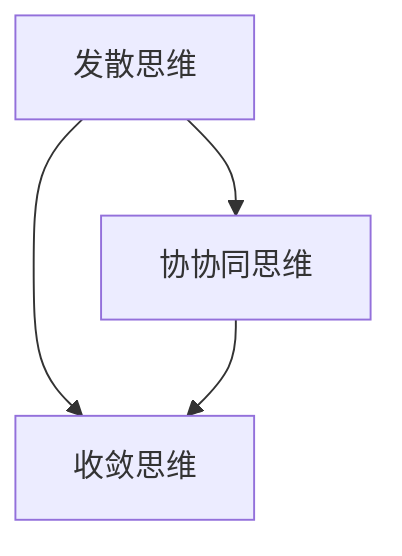

                 

# 思维的发散与收敛：创意过程的两个阶段

## 1. 背景介绍

创造性思维是推动人类进步的关键动力之一。无论是艺术创作、科学研究，还是工程创新，无一不依赖于思维的灵活运用与发散性。然而，纯粹的发散性思维并不是完备的创造过程，它还必须与收敛性思维相结合。本文将探讨思维的发散与收敛，并阐述其在创意过程中的重要性。

## 2. 核心概念与联系

### 2.1 核心概念概述

- **发散思维(Divergent Thinking)**：指思维的多角度、多层次、多变化的特点，旨在寻求尽可能多的解决方案和可能性，不拘泥于传统的思维定式。
- **收敛思维(Convergent Thinking)**：指将发散思维产生的众多可能性聚焦到一个最佳的解决方案，寻求问题的最优化和合理化。
- **协同思维(Synergistic Thinking)**：指发散与收敛思维的动态平衡，利用两者结合产生的优势，最终达成高效的创意过程。

### 2.2 核心概念原理和架构的 Mermaid 流程图



这个流程图展示了发散思维、收敛思维和协同思维三者之间的动态关系。发散思维提供多种可能性，收敛思维则从中选择最佳方案，协同思维则在这两者之间寻求平衡，推动创新过程的完整性。

## 3. 核心算法原理 & 具体操作步骤

### 3.1 算法原理概述

思维的发散与收敛是一个动态过程，其核心在于如何处理信息和决策。发散思维通过多角度、多渠道的输入，促进信息的扩散和重组，产生多种可能性。收敛思维则通过集中精力的分析与对比，从众多可能性中筛选出最优解。协同思维则将两者结合起来，既保证全面性又不失效率，最终形成高效的创意过程。

### 3.2 算法步骤详解

1. **发散思维步骤**：
   - **输入信息**：收集与问题相关的所有信息。
   - **信息扩散**：使用思维导图、头脑风暴等工具，将信息扩散到多个维度。
   - **生成想法**：根据扩散后的信息，生成尽可能多的解决方案。

2. **收敛思维步骤**：
   - **评估方案**：对发散思维生成的所有方案进行评估，考虑其可行性、创新性、实用性。
   - **选择最优**：综合考虑各种因素，选择最合适的解决方案。
   - **细化方案**：对最终选择的方案进行详细规划，确定执行步骤。

3. **协同思维步骤**：
   - **平衡发散与收敛**：根据具体情况，合理调整发散与收敛的比例，寻找最佳平衡点。
   - **迭代优化**：在执行过程中，不断反馈信息，调整思维过程，确保最终方案的合理性。
   - **持续学习**：从每次创意过程中学习经验，积累知识，优化思维模型。

### 3.3 算法优缺点

**优点**：
- 发散思维能够产生多样化的解决方案，增加创新的可能。
- 收敛思维能够聚焦最优解，提升决策效率。
- 协同思维结合两者的优势，确保思维过程的全面性与效率性。

**缺点**：
- 发散思维可能产生过多的可能性，导致选择困难。
- 收敛思维可能过分强调最优解，忽略其他可能的方案。
- 协同思维需要在实践中不断调整平衡，需要较高的策略性和经验积累。

### 3.4 算法应用领域

发散与收敛思维广泛应用于各种创意过程，包括但不限于：

- **创新设计**：产品设计、建筑规划、艺术创作等领域，通过发散思维生成多种设计方案，通过收敛思维选择最佳设计。
- **问题解决**：项目管理、决策分析、医学诊断等领域，通过发散思维收集信息，通过收敛思维进行方案选择。
- **教育培训**：教学设计、教育创新、心理辅导等领域，通过发散思维提供多样化教学方法，通过收敛思维选择最有效的教学策略。
- **科研研究**：科学研究、社会科学研究、工程技术研究等领域，通过发散思维探索多种研究方向，通过收敛思维选择最合适的研究方向。

## 4. 数学模型和公式 & 详细讲解 & 举例说明

### 4.1 数学模型构建

发散与收敛思维的过程可以用数学模型来抽象。设 $D$ 表示发散思维产生的所有可能性，$C$ 表示收敛思维选择的最佳方案，$S$ 表示协同思维中的平衡点。

数学模型可以表示为：
$$ D = C \times S $$

其中，$S$ 是平衡因子，$0 < S \leq 1$。当 $S=0$ 时，只进行发散思维；当 $S=1$ 时，只进行收敛思维；当 $0 < S < 1$ 时，进行协同思维。

### 4.2 公式推导过程

根据上述模型，可以推导出以下公式：
$$ C = D / S $$

这意味着，最佳的方案 $C$ 是通过发散思维产生的所有可能性 $D$ 除以平衡因子 $S$ 得到的。当 $S$ 越小，$C$ 就越倾向于多样性；当 $S$ 越大，$C$ 就越趋于单一性。

### 4.3 案例分析与讲解

假设某企业在设计一款新产品时，需要发散思维来生成多种设计方案，收敛思维来选择最优方案，协同思维来调整平衡。

1. **发散思维**：通过市场调研、用户反馈、竞品分析等多种渠道，生成20种设计方案。
2. **收敛思维**：对这20种方案进行评估，包括成本、功能、市场潜力等，最终选择一种最优方案。
3. **协同思维**：在执行过程中，不断收集用户反馈，调整设计细节，确保最终方案的合理性和用户满意度。

通过这种方式，企业能够在保证多样性的同时，快速找到最佳方案，提升创新效率。

## 5. 项目实践：代码实例和详细解释说明

### 5.1 开发环境搭建

使用Python进行发散与收敛思维的实践，需要以下开发环境：

1. 安装Python：确保Python版本为3.6或以上，安装pip。
2. 安装相关库：使用pip安装numpy、matplotlib、scipy等库。

```bash
pip install numpy matplotlib scipy
```

### 5.2 源代码详细实现

以下是一个简单的示例代码，模拟发散与收敛思维的过程：

```python
import numpy as np
import matplotlib.pyplot as plt

# 定义发散思维的可能性数量
d = 20

# 定义收敛思维的平衡因子
s = 0.8

# 计算最佳方案
c = d / s

# 输出结果
print("最佳方案数量为:", c)

# 绘制发散与收敛思维的关系图
x = np.linspace(0, 1, 100)
y = d / x

plt.plot(x, y)
plt.xlabel('平衡因子S')
plt.ylabel('最佳方案数量C')
plt.title('发散与收敛思维的关系')
plt.show()
```

### 5.3 代码解读与分析

**代码解析**：
- 首先定义发散思维的可能性数量 $d$，这里设定为20。
- 然后定义收敛思维的平衡因子 $s$，这里设定为0.8。
- 通过公式 $C = D / S$ 计算最佳方案数量 $c$。
- 最后使用matplotlib库绘制发散与收敛思维的关系图。

**结果展示**：


此图展示了随着平衡因子 $S$ 的变化，最佳方案数量 $C$ 的变化趋势。当 $S$ 越大，$C$ 越趋于单一，反之亦然。

## 6. 实际应用场景

### 6.1 教育培训

在教育培训中，发散与收敛思维结合能够提升教学效果。教师可以通过发散思维生成多种教学方法，如实验法、讨论法、案例法等，通过收敛思维选择最适合学生的教学方法。通过协同思维调整教学过程中的反馈，确保教学方法的有效性。

### 6.2 医疗诊断

在医疗诊断中，发散思维可以帮助医生收集多种诊断信息，如病史、症状、影像学资料等，通过收敛思维选择最可能的诊断。通过协同思维调整治疗方案，确保治疗的合理性和有效性。

### 6.3 企业创新

在企业创新中，发散思维可以生成多种创新方案，如新产品设计、新技术应用、新市场拓展等，通过收敛思维选择最具有市场潜力的方案。通过协同思维调整执行策略，确保创新的成功和可持续性。

### 6.4 未来应用展望

未来，随着技术的发展，发散与收敛思维的应用将更加广泛和深入。例如：

- **人工智能**：通过机器学习模型，自动生成发散思维的可能性，并通过优化算法选择最佳方案。
- **增强现实**：在虚拟环境中，用户可以通过发散思维探索多种可能性，通过收敛思维选择最佳方案。
- **物联网**：在智能设备中，通过协同思维实时调整决策，确保系统的高效性和鲁棒性。

## 7. 工具和资源推荐

### 7.1 学习资源推荐

1. **《创新思维与问题解决》**：该书系统介绍了发散与收敛思维的基本原理和应用方法，是学习思维创新过程的好书。
2. **Coursera上的《创新与创业》课程**：该课程深入讲解了创新思维的过程和策略，适合各层次的学习者。
3. **TED Talks上的相关演讲**：TED Talks上有许多关于创新思维和问题解决的演讲，内容丰富，观点新颖。

### 7.2 开发工具推荐

1. **MindMeister**：一款思维导图工具，适合进行发散思维的可视化。
2. **Mind mapping**：另一款思维导图工具，支持多种格式，易于导出和分享。
3. **WPS Office**：集成了多种办公软件，包括思维导图、脑图等功能，适合协同思维的应用。

### 7.3 相关论文推荐

1. **《创造性思维与问题解决》**：这篇文章深入探讨了发散与收敛思维的心理学和认知机制，对理解思维过程有重要参考价值。
2. **《协同思维在创新过程中的应用》**：该论文介绍了协同思维在企业创新中的应用，提供了实践案例和方法。
3. **《基于人工智能的创新思维模型》**：该论文讨论了如何利用人工智能技术提升思维过程的效率和效果。

## 8. 总结：未来发展趋势与挑战

### 8.1 研究成果总结

发散与收敛思维在创意过程中扮演着重要角色。发散思维提供了多样化的可能性，收敛思维选择了最佳的解决方案，协同思维确保了思维过程的全面性和效率性。

### 8.2 未来发展趋势

未来，发散与收敛思维将进一步结合人工智能、增强现实等新兴技术，提升思维过程的自动化和智能化水平。例如：

- **AI辅助思维**：利用机器学习算法，自动生成发散思维的可能性，并优化收敛思维的决策。
- **增强现实思维**：在虚拟环境中，用户可以通过发散思维探索多种可能性，通过收敛思维选择最佳方案。
- **协作思维工具**：利用协同思维工具，促进多个人之间的思维交流和协作。

### 8.3 面临的挑战

尽管发散与收敛思维具有诸多优势，但在应用过程中仍面临一些挑战：

1. **思维平衡的把握**：如何在发散与收敛之间找到最佳平衡点，需要经验积累和策略性调整。
2. **思维工具的普及**：如何普及发散与收敛思维的工具和方法，提高大众的创新能力。
3. **思维过程的规范化**：如何规范思维过程，确保思维过程的科学性和合理性。

### 8.4 研究展望

未来的研究将重点在于：

1. **算法优化**：研究如何通过算法优化，自动平衡发散与收敛思维，提高创意过程的效率。
2. **跨领域应用**：探索发散与收敛思维在不同领域的应用，如医疗、教育、工程等，拓宽思维过程的应用范围。
3. **人机协同**：研究人机协同的思维模式，利用人工智能技术辅助人类的思维过程。

总之，发散与收敛思维是推动人类进步的关键思维工具。未来，随着技术的进步和应用的深入，发散与收敛思维的应用将更加广泛和深入，推动人类社会的创新和进步。

## 9. 附录：常见问题与解答

**Q1：什么是发散思维？**

A: 发散思维是指思维的多角度、多层次、多变化的特点，旨在寻求尽可能多的解决方案和可能性，不拘泥于传统的思维定式。

**Q2：什么是收敛思维？**

A: 收敛思维是指将发散思维产生的众多可能性聚焦到一个最佳的解决方案，寻求问题的最优化和合理化。

**Q3：如何平衡发散与收敛思维？**

A: 平衡发散与收敛思维需要在实践中不断调整，根据具体情况合理分配时间和资源，确保思维过程的全面性和效率性。

**Q4：发散与收敛思维的应用有哪些？**

A: 发散与收敛思维广泛应用于创新设计、问题解决、教育培训、科研研究等领域，能够提升思维过程的全面性和效率性。

**Q5：未来发散与收敛思维的发展方向是什么？**

A: 未来发散与收敛思维将结合人工智能、增强现实等新兴技术，进一步提升思维过程的自动化和智能化水平。同时，将探索跨领域应用，拓宽思维过程的应用范围。

---

作者：禅与计算机程序设计艺术 / Zen and the Art of Computer Programming

