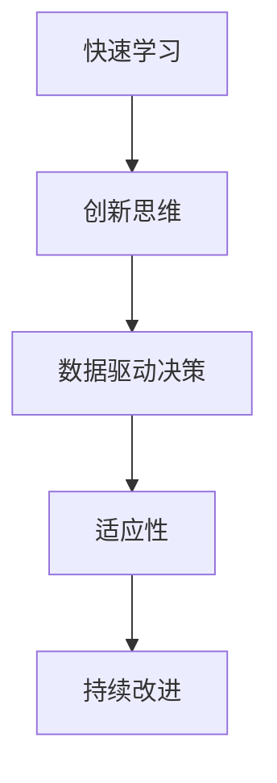

                 

# 思维的敏捷性：快速适应变化的能力

## 1. 背景介绍

### 1.1 问题由来

在快速变化的时代，无论是个人还是组织，都面临着前所未有的挑战。信息技术的发展，尤其是人工智能和机器学习的兴起，正深刻改变着各行各业的工作方式和商业模式。然而，技术的快速迭代和应用广泛，也带来了新的问题：

- **技术过载**：新技术不断涌现，企业难以跟上步伐，决策难度加大。
- **知识折旧**：传统知识和技能迅速过时，员工需要不断学习和适应新技能。
- **竞争加剧**：市场竞争激烈，企业需要快速响应市场变化，才能保持竞争力。

在这样的背景下，如何提升思维的敏捷性，快速适应变化，成为企业和个人面临的共同课题。

### 1.2 问题核心关键点

思维敏捷性是指个人或组织在面对变化时，能够快速理解问题、分析情境、制定解决方案并执行的能力。在技术领域，这表现为对新技术的快速学习和应用，对新问题的迅速识别和解决，以及对市场变化的敏感和反应。

提升思维敏捷性的关键在于：

- **快速学习**：掌握新知识和新技能，能够迅速适应技术环境的变化。
- **创新思维**：打破常规，勇于尝试新方法，解决复杂问题。
- **决策能力**：在数据驱动下，迅速做出有效决策。
- **适应性**：对变化保持开放态度，灵活调整策略。

思维敏捷性的提升，不仅有助于个体在职场上脱颖而出，也是企业保持竞争力的关键。

## 2. 核心概念与联系

### 2.1 核心概念概述

为了更好地理解思维敏捷性，本节将介绍几个密切相关的核心概念：

- **快速学习**：通过有效的学习策略和工具，迅速掌握新知识和技能。
- **创新思维**：包括创造性思维、系统性思维、逆向思维等，旨在从不同角度解决问题。
- **数据驱动决策**：基于数据分析和模型构建的决策过程，帮助快速制定有效策略。
- **适应性**：对外部环境和内部需求变化的快速响应和调整能力。
- **持续改进**：不断优化自身流程和能力，提升工作效率和质量。

这些核心概念之间的逻辑关系可以通过以下Mermaid流程图来展示：



这个流程图展示了一些核心概念及其之间的联系：

1. 快速学习是创新思维的基础，通过学习新知识为创新提供原料。
2. 数据驱动决策为创新和适应性提供支撑，基于数据的决策更加科学和有效。
3. 适应性使系统能够在变化的环境中保持灵活性和生命力。
4. 持续改进不断优化系统，提升整体效率和竞争力。

## 3. 核心算法原理 & 具体操作步骤
### 3.1 算法原理概述

提升思维敏捷性的算法原理，可以概括为以下几个关键点：

- **知识图谱构建**：构建个人或组织的知识图谱，帮助快速定位和获取相关信息。
- **模型驱动学习**：利用机器学习模型，预测未来趋势，指导学习方向。
- **智能推荐系统**：通过智能推荐系统，自动推荐相关学习资源，提高学习效率。
- **情景模拟**：使用情景模拟技术，预测未来可能发生的情境，提前准备应对策略。
- **情感分析**：分析团队和个人的情感状态，优化团队协作和学习氛围。

### 3.2 算法步骤详解

基于上述算法原理，提升思维敏捷性的具体操作步骤可以分为以下几个步骤：

1. **知识图谱构建**：
   - 收集和整理个人或组织的相关知识和技能，构建知识图谱。
   - 使用Graph Neural Network（GNN）等技术，对知识图谱进行网络化处理，生成关联知识节点。

2. **模型驱动学习**：
   - 收集和标注历史学习数据，构建学习行为预测模型，如基于时间序列的预测模型、关联规则学习模型等。
   - 根据模型预测，推荐未来的学习方向和内容，指导个人或团队进行有针对性的学习。

3. **智能推荐系统**：
   - 收集学习资源和材料，构建推荐系统，如协同过滤推荐、基于内容的推荐、混合推荐等。
   - 根据用户的学习历史和偏好，实时推荐相关学习内容，提高学习效率。

4. **情景模拟**：
   - 收集和分析历史数据，构建情景模拟模型，如基于因果推理的模拟、基于模拟退火的情景生成等。
   - 使用模拟结果，预测未来可能的情境变化，提前制定应对策略。

5. **情感分析**：
   - 收集和标注团队和个人的情感数据，构建情感分析模型，如基于LSTM的情感分类、基于Transformers的情感分析等。
   - 分析情感状态，优化团队协作和学习氛围，提升整体学习效率。

### 3.3 算法优缺点

提升思维敏捷性的算法具有以下优点：

- **效率高**：利用机器学习和推荐系统，可以显著提高学习和决策效率。
- **个性化**：根据个人兴趣和需求，提供定制化的学习内容，提高学习效果。
- **实时性**：通过实时分析和推荐，保证信息的及时性和相关性。

然而，这些算法也存在一定的局限性：

- **数据依赖**：算法的效果依赖于高质量的数据集，数据收集和标注工作量大。
- **模型复杂性**：构建和维护复杂模型需要高水平的技术和资源支持。
- **隐私问题**：数据收集和分析可能涉及隐私问题，需要严格的隐私保护措施。
- **适应性不足**：模型难以适应快速变化的环境，需要不断更新和优化。

尽管存在这些局限性，但就目前而言，提升思维敏捷性的算法在学术界和工业界都已经得到了广泛应用，展示了其强大的潜力。

### 3.4 算法应用领域

提升思维敏捷性的算法，在个人发展和企业组织中都有广泛的应用，例如：

- **个人职业发展**：通过学习推荐和情景模拟，帮助个人快速掌握新技能，适应职业变化。
- **企业人才培养**：构建知识图谱和学习推荐系统，提升团队的学习效率和创新能力。
- **市场预测**：利用模型驱动学习和情景模拟，帮助企业快速响应市场变化，制定策略。
- **风险管理**：通过情感分析和情景模拟，识别和预测潜在的风险，提前制定应对措施。
- **决策支持**：构建数据驱动的决策支持系统，帮助决策者快速做出有效决策。

## 4. 数学模型和公式 & 详细讲解 & 举例说明

### 4.1 数学模型构建

提升思维敏捷性的数学模型构建，主要包括以下几个方面：

- **知识图谱**：构建图结构的知识网络，使用邻接矩阵或图神经网络表示。
- **学习预测模型**：构建基于时间序列、关联规则等的学习行为预测模型。
- **推荐系统**：构建协同过滤、内容推荐等推荐算法，使用矩阵分解、深度学习等技术。
- **情景模拟模型**：构建基于因果推理、蒙特卡洛模拟等的情景模拟算法。
- **情感分析模型**：构建基于LSTM、Transformers等模型进行情感分类或情感分析。

### 4.2 公式推导过程

以知识图谱的构建为例，简要推导知识节点之间的关联权重。

假设知识图谱中有 $N$ 个知识节点，用向量 $x_i \in \mathbb{R}^d$ 表示，其中 $d$ 为节点的特征维度。节点之间的关联权重 $w_{ij}$ 表示知识节点 $i$ 和 $j$ 的关联强度，通过共现频次、相似度等方法计算得到。

定义共现矩阵 $A \in \mathbb{R}^{N \times N}$，其中 $A_{ij} = w_{ij}$。使用图神经网络（GNN）进行知识节点之间的信息传递，计算每个节点的表示向量 $h_i$，可以表示为：

$$
h_i = \sum_{j=1}^N A_{ij} \odot \sigma\left(W_1 h_j + W_2 x_i\right)
$$

其中，$\odot$ 表示逐元素相乘，$W_1$ 和 $W_2$ 是可学习的权重矩阵，$\sigma$ 是非线性激活函数，如ReLU。

通过上述公式，可以生成新的知识节点表示向量 $h_i$，用于快速定位和获取相关信息。

### 4.3 案例分析与讲解

以企业人才管理为例，介绍如何使用提升思维敏捷性的算法进行人才发展管理：

1. **知识图谱构建**：收集企业内部的知识库、技能认证、培训记录等信息，构建知识图谱。
2. **学习预测模型**：使用时间序列预测模型，预测员工未来的学习需求和发展方向。
3. **智能推荐系统**：根据员工的兴趣和学习历史，推荐合适的培训课程和在线学习资源。
4. **情景模拟**：模拟未来市场和技术变化，预测员工需要掌握的新技能，制定培训计划。
5. **情感分析**：分析员工的工作满意度和学习态度，优化培训方案和团队协作。

通过这些步骤，企业可以更高效地培养和发展人才，提升整体的创新能力和竞争力。

## 5. 项目实践：代码实例和详细解释说明

### 5.1 开发环境搭建

在进行思维敏捷性提升的实践前，我们需要准备好开发环境。以下是使用Python进行Keras和TensorFlow开发的环境配置流程：

1. 安装Anaconda：从官网下载并安装Anaconda，用于创建独立的Python环境。

2. 创建并激活虚拟环境：
```bash
conda create -n pytorch-env python=3.8 
conda activate pytorch-env
```

3. 安装PyTorch：根据CUDA版本，从官网获取对应的安装命令。例如：
```bash
conda install pytorch torchvision torchaudio cudatoolkit=11.1 -c pytorch -c conda-forge
```

4. 安装TensorFlow：从官网下载安装包，或使用conda安装。例如：
```bash
pip install tensorflow==2.3
```

5. 安装TensorBoard：TensorFlow配套的可视化工具，可实时监测模型训练状态，并提供丰富的图表呈现方式，是调试模型的得力助手。
```bash
pip install tensorboard
```

完成上述步骤后，即可在`pytorch-env`环境中开始思维敏捷性提升的实践。

### 5.2 源代码详细实现

这里我们以知识图谱构建为例，给出使用TensorFlow和Keras进行知识节点关系图建模的PyTorch代码实现。

首先，定义知识节点和关系图：

```python
import tensorflow as tf
from tensorflow.keras.layers import Input, Embedding, Dot, Dense, Concatenate
from tensorflow.keras.models import Model

# 定义知识节点和关系图
nodes = Input(shape=(N, ), name='nodes')
relations = Input(shape=(N, ), name='relations')

# 定义节点和关系的嵌入层
node_embed = Embedding(N, E, name='node_embed')(nodes)
rel_embed = Embedding(N, E, name='relation_embed')(relations)

# 定义节点和关系的点积层
dot_product = Dot(axes=[1, 1], normalize=True)([node_embed, rel_embed])

# 定义输出层
output = Dense(1, activation='sigmoid')(dot_product)

# 定义模型
model = Model(inputs=[nodes, relations], outputs=output)
```

然后，定义模型训练过程：

```python
# 准备训练数据
data = {
    'nodes': train_nodes,
    'relations': train_relations,
    'labels': train_labels
}

# 定义优化器和损失函数
optimizer = tf.keras.optimizers.Adam(learning_rate=0.001)
loss = tf.keras.losses.BinaryCrossentropy(from_logits=True)

# 编译模型
model.compile(optimizer=optimizer, loss=loss, metrics=['accuracy'])

# 训练模型
model.fit(x=train_data, y=train_labels, epochs=10, batch_size=64, validation_data=val_data)
```

最后，评估模型并使用：

```python
# 评估模型
test_loss, test_acc = model.evaluate(x=test_data, y=test_labels)

# 使用模型进行预测
pred = model.predict(x=test_data)
```

以上就是使用TensorFlow和Keras进行知识图谱构建的完整代码实现。可以看到，利用Keras的高级API和TensorFlow的计算图，可以高效实现知识节点之间的关系图建模。

### 5.3 代码解读与分析

让我们再详细解读一下关键代码的实现细节：

**知识图谱类**：
- `__init__`方法：初始化知识节点、关系和标签。
- `__len__`方法：返回数据集的样本数量。
- `__getitem__`方法：对单个样本进行处理，将知识节点和关系输入模型。

**模型构建**：
- `Input`层：定义输入节点和关系。
- `Embedding`层：将节点和关系转换为低维向量表示。
- `Dot`层：计算节点和关系的点积，得到关联强度。
- `Dense`层：使用全连接层对关联强度进行映射，得到最终输出。
- `Model`类：将输入和输出层组合成模型。

**模型训练**：
- `fit`方法：定义训练数据和标签，进行模型训练。
- `evaluate`方法：在测试集上评估模型性能。
- `predict`方法：使用模型进行预测。

通过这些步骤，可以构建和训练知识图谱模型，快速定位和获取相关信息，提升思维敏捷性。

当然，工业级的系统实现还需考虑更多因素，如模型保存和部署、超参数自动搜索、更灵活的任务适配层等。但核心的提升思维敏捷性的算法基本与此类似。

## 6. 实际应用场景
### 6.1 智能客服系统

提升思维敏捷性的算法，可以广泛应用于智能客服系统的构建。传统客服往往需要配备大量人力，高峰期响应缓慢，且一致性和专业性难以保证。而使用提升思维敏捷性的算法构建的智能客服系统，可以7x24小时不间断服务，快速响应客户咨询，用自然流畅的语言解答各类常见问题。

在技术实现上，可以收集企业内部的历史客服对话记录，将问题和最佳答复构建成监督数据，在此基础上对预训练模型进行微调。微调后的模型能够自动理解用户意图，匹配最合适的答案模板进行回复。对于客户提出的新问题，还可以接入检索系统实时搜索相关内容，动态组织生成回答。如此构建的智能客服系统，能大幅提升客户咨询体验和问题解决效率。

### 6.2 金融舆情监测

提升思维敏捷性的算法，可以应用于金融领域的数据驱动决策和风险管理。金融机构需要实时监测市场舆论动向，以便及时应对负面信息传播，规避金融风险。传统的人工监测方式成本高、效率低，难以应对网络时代海量信息爆发的挑战。

具体而言，可以收集金融领域相关的新闻、报道、评论等文本数据，并对其进行情感标注。在此基础上对预训练语言模型进行微调，使其能够自动判断文本属于何种情感倾向，预测未来趋势。将微调后的模型应用到实时抓取的网络文本数据，就能够自动监测不同情感倾向的舆论变化，一旦发现负面情绪激增等异常情况，系统便会自动预警，帮助金融机构快速应对潜在风险。

### 6.3 个性化推荐系统

提升思维敏捷性的算法，可以应用于个性化推荐系统的构建。当前的推荐系统往往只依赖用户的历史行为数据进行物品推荐，无法深入理解用户的真实兴趣偏好。

通过提升思维敏捷性的算法，可以构建更加智能化的推荐系统。首先，收集用户浏览、点击、评论、分享等行为数据，提取和用户交互的物品标题、描述、标签等文本内容。将文本内容作为模型输入，用户的后续行为（如是否点击、购买等）作为监督信号，在此基础上微调预训练语言模型。微调后的模型能够从文本内容中准确把握用户的兴趣点。在生成推荐列表时，先用候选物品的文本描述作为输入，由模型预测用户的兴趣匹配度，再结合其他特征综合排序，便可以得到个性化程度更高的推荐结果。

### 6.4 未来应用展望

随着提升思维敏捷性算法的不断发展，其在更多领域得到应用，为传统行业带来变革性影响。

在智慧医疗领域，提升思维敏捷性的算法可以用于医疗问答、病历分析、药物研发等应用，提升医疗服务的智能化水平，辅助医生诊疗，加速新药开发进程。

在智能教育领域，提升思维敏捷性的算法可以应用于作业批改、学情分析、知识推荐等方面，因材施教，促进教育公平，提高教学质量。

在智慧城市治理中，提升思维敏捷性的算法可以应用于城市事件监测、舆情分析、应急指挥等环节，提高城市管理的自动化和智能化水平，构建更安全、高效的未来城市。

此外，在企业生产、社会治理、文娱传媒等众多领域，提升思维敏捷性的算法也将不断涌现，为传统行业数字化转型升级提供新的技术路径。相信随着技术的日益成熟，提升思维敏捷性的算法将成为人工智能落地应用的重要范式，推动人工智能技术向更广阔的领域加速渗透。

## 7. 工具和资源推荐
### 7.1 学习资源推荐

为了帮助开发者系统掌握提升思维敏捷性的理论基础和实践技巧，这里推荐一些优质的学习资源：

1. 《深度学习基础》系列博文：由深度学习专家撰写，涵盖深度学习的基本概念和前沿技术。
2. CS231n《卷积神经网络》课程：斯坦福大学开设的计算机视觉明星课程，内容详实，适合入门学习。
3. 《机器学习实战》书籍：Hands-on机器学习实战，提供了大量代码实例，适合动手实践。
4. Kaggle平台：数据科学和机器学习的竞赛平台，提供丰富的数据集和社区支持。
5. TensorFlow官方文档：TensorFlow的详细文档和教程，适合深入学习和实践。

通过对这些资源的学习实践，相信你一定能够快速掌握提升思维敏捷性的精髓，并用于解决实际的NLP问题。
### 7.2 开发工具推荐

高效的开发离不开优秀的工具支持。以下是几款用于提升思维敏捷性开发的常用工具：

1. TensorFlow：由Google主导开发的开源深度学习框架，生产部署方便，适合大规模工程应用。
2. Keras：Keras是TensorFlow的高层API，提供了简单易用的接口，适合快速原型设计和实验。
3. PyTorch：基于Python的开源深度学习框架，灵活动态的计算图，适合快速迭代研究。
4. Jupyter Notebook：交互式的代码执行环境，适合快速实验和调试。
5. Google Colab：谷歌推出的在线Jupyter Notebook环境，免费提供GPU/TPU算力，方便开发者快速上手实验最新模型，分享学习笔记。

合理利用这些工具，可以显著提升提升思维敏捷性的开发效率，加快创新迭代的步伐。

### 7.3 相关论文推荐

提升思维敏捷性的研究源于学界的持续研究。以下是几篇奠基性的相关论文，推荐阅读：

1. Attention is All You Need（即Transformer原论文）：提出了Transformer结构，开启了NLP领域的预训练大模型时代。
2. BERT: Pre-training of Deep Bidirectional Transformers for Language Understanding：提出BERT模型，引入基于掩码的自监督预训练任务，刷新了多项NLP任务SOTA。
3. Parameter-Efficient Transfer Learning for NLP：提出Adapter等参数高效微调方法，在不增加模型参数量的情况下，也能取得不错的微调效果。
4. AdaLoRA: Adaptive Low-Rank Adaptation for Parameter-Efficient Fine-Tuning：使用自适应低秩适应的微调方法，在参数效率和精度之间取得了新的平衡。
5. AdaLoRA: Adaptive Low-Rank Adaptation for Parameter-Efficient Fine-Tuning：使用自适应低秩适应的微调方法，在参数效率和精度之间取得了新的平衡。

这些论文代表了大语言模型微调技术的发展脉络。通过学习这些前沿成果，可以帮助研究者把握学科前进方向，激发更多的创新灵感。

## 8. 总结：未来发展趋势与挑战

### 8.1 总结

本文对提升思维敏捷性的算法进行了全面系统的介绍。首先阐述了提升思维敏捷性的研究背景和意义，明确了算法在提升个人和企业竞争力方面的独特价值。其次，从原理到实践，详细讲解了提升思维敏捷性的数学模型和操作步骤，给出了实际应用的代码实例。同时，本文还广泛探讨了提升思维敏捷性算法在智能客服、金融舆情、个性化推荐等多个行业领域的应用前景，展示了算法的强大潜力。此外，本文精选了提升思维敏捷性算法的各类学习资源，力求为读者提供全方位的技术指引。

通过本文的系统梳理，可以看到，提升思维敏捷性的算法正在成为人工智能领域的重要范式，极大地拓展了智能系统的应用边界，催生了更多的落地场景。得益于大规模语料的预训练和先进的学习算法，提升思维敏捷性的算法能够在较短的时间内，快速适应变化，解决复杂问题。未来，伴随算法的持续演进和优化，思维敏捷性的提升将进一步推动人工智能技术向更广泛、更深层的领域发展，深刻影响人类的生产生活方式。

### 8.2 未来发展趋势

展望未来，提升思维敏捷性的算法将呈现以下几个发展趋势：

1. **自适应学习**：通过学习目标任务，动态调整模型结构和超参数，提高学习效率和效果。
2. **多模态学习**：结合文本、图像、音频等多种数据模态，提升对复杂情境的感知和理解能力。
3. **跨领域迁移**：通过迁移学习，将一个领域学到的知识应用于另一个相关领域，实现知识共享。
4. **实时化学习**：利用流式数据和增量学习技术，实现实时更新和迭代。
5. **个性化推荐**：结合用户行为数据和情感分析，提供更个性化的学习路径和推荐方案。
6. **多任务学习**：同时训练多个任务，提升模型在多任务上的泛化能力和综合性能。

这些趋势凸显了提升思维敏捷性算法的广阔前景。这些方向的探索发展，必将进一步提升智能系统的性能和应用范围，为人类认知智能的进化带来深远影响。

### 8.3 面临的挑战

尽管提升思维敏捷性算法已经取得了瞩目成就，但在迈向更加智能化、普适化应用的过程中，它仍面临着诸多挑战：

1. **数据质量**：高质量数据是算法效果的前提，数据收集和标注工作量大，且可能存在偏差。
2. **模型复杂性**：算法涉及多个模型和组件，构建和维护复杂系统需要高水平的技术和资源支持。
3. **实时性**：需要快速响应用户请求，实现实时数据处理和决策。
4. **可解释性**：算法复杂，难以解释其内部工作机制和决策逻辑。
5. **安全性**：模型可能存在漏洞，遭受攻击或滥用，导致系统不可靠。

尽管存在这些挑战，但提升思维敏捷性算法的不断发展和优化，将使其在未来得到更广泛的应用，成为人工智能技术发展的重要驱动力。

### 8.4 研究展望

面对提升思维敏捷性算法所面临的挑战，未来的研究需要在以下几个方面寻求新的突破：

1. **数据增强**：通过数据增强技术，扩充训练集，提高模型泛化能力。
2. **模型压缩**：采用模型压缩技术，减小模型规模，提高推理速度。
3. **分布式学习**：利用分布式学习技术，提升算法的实时性和可扩展性。
4. **隐私保护**：采用差分隐私、联邦学习等技术，保护用户隐私。
5. **解释性增强**：引入可解释性算法，提升模型的透明度和可信度。
6. **鲁棒性提升**：引入对抗训练等技术，增强模型的鲁棒性和抗干扰能力。

这些研究方向将为提升思维敏捷性算法的进一步发展提供新的思路和方法，推动其在更多领域和场景中的实际应用。

## 9. 附录：常见问题与解答

**Q1：提升思维敏捷性的算法是否适用于所有任务？**

A: 提升思维敏捷性的算法适用于大多数任务，尤其是数据驱动和需要快速决策的任务。但对于一些需要复杂逻辑推理和创新思维的任务，算法可能需要进一步优化和改进。

**Q2：如何选择合适的学习率？**

A: 学习率的选取应该考虑任务复杂度和数据规模，一般建议从1e-4开始，逐步减小学习率，直至收敛。也可以使用warmup策略，在开始阶段使用较小的学习率，再逐渐过渡到预设值。

**Q3：提升思维敏捷性算法需要哪些计算资源？**

A: 提升思维敏捷性算法需要高性能计算资源，如GPU/TPU等。此外，数据收集和处理也需要大量的计算资源和时间。因此，需要进行合理的资源规划和优化。

**Q4：如何缓解提升思维敏捷性算法中的过拟合问题？**

A: 过拟合是提升思维敏捷性算法面临的主要挑战，常见的缓解策略包括数据增强、正则化、Dropout等技术。此外，引入对抗训练和模型压缩等技术，也可以有效缓解过拟合问题。

**Q5：提升思维敏捷性算法在落地部署时需要注意哪些问题？**

A: 部署时需要考虑模型的实时性、可扩展性、可靠性等问题。合理使用缓存、负载均衡等技术，确保系统稳定运行。同时，进行充分的测试和验证，确保算法的稳定性和准确性。

通过本文的系统梳理，可以看到，提升思维敏捷性的算法正在成为人工智能领域的重要范式，极大地拓展了智能系统的应用边界，催生了更多的落地场景。得益于大规模语料的预训练和先进的学习算法，提升思维敏捷性的算法能够在较短的时间内，快速适应变化，解决复杂问题。未来，伴随算法的持续演进和优化，思维敏捷性的提升将进一步推动人工智能技术向更广泛、更深层的领域发展，深刻影响人类的生产生活方式。

---

作者：禅与计算机程序设计艺术 / Zen and the Art of Computer Programming

