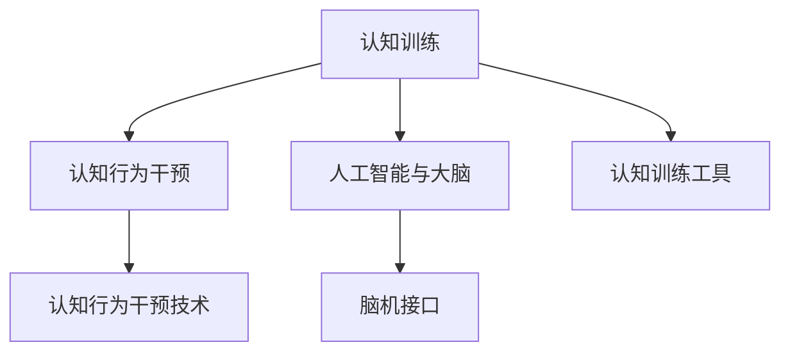

                 

# 思维训练：提升认知能力的方法

> 关键词：认知训练,神经可塑性,认知行为干预,人工智能与大脑,脑机接口

## 1. 背景介绍

### 1.1 问题由来
现代生活节奏快速，信息爆炸，要求我们不断提升认知能力以适应新环境。认知能力包括记忆、注意力、决策、问题解决等多种方面，直接影响个人的学习、工作和生活质量。然而，随着年龄增长，认知能力可能逐渐衰退，如何维持和提升认知能力成为热门话题。

认知训练(Cognitive Training)是通过设计专门的任务，针对特定的认知功能进行有针对性的练习，以改善和提升认知能力。认知行为干预(Cognitive Behavioral Interventions, CBI)则通过改变个体的认知模式和行为习惯，帮助其摆脱认知障碍，改善生活质量。随着人工智能(AI)与脑科学的融合，人工智能在认知训练和认知行为干预方面的应用也日益广泛。

## 2. 核心概念与联系

### 2.1 核心概念概述

为更好地理解认知训练和认知行为干预方法，本节将介绍几个密切相关的核心概念：

- 认知训练(Cognitive Training)：通过专门设计的任务和活动，针对特定的认知功能（如记忆、注意力、决策等）进行练习，以提升认知能力。
- 认知行为干预(Cognitive Behavioral Interventions, CBI)：通过改变个体的认知模式和行为习惯，帮助其改善认知功能，如解决焦虑、抑郁、注意力缺陷多动障碍等认知障碍。
- 人工智能与大脑(AI and the Brain)：利用人工智能技术，特别是深度学习和大数据分析，对大脑活动进行模拟和分析，提高认知能力。
- 脑机接口(Brain-Computer Interface, BCI)：通过采集大脑信号，将人类的意图表征转化为计算机指令，实现人机交互。

这些核心概念之间的逻辑关系可以通过以下Mermaid流程图来展示：



这个流程图展示了几大核心概念及其之间的联系：

1. 认知训练通过有针对性的练习任务提升个体的认知能力。
2. 认知行为干预通过改变个体的认知模式和行为习惯，帮助其改善认知障碍。
3. 人工智能与大脑将认知训练技术应用于实际，改善大脑功能和认知能力。
4. 脑机接口通过人工智能技术实现人脑与计算机的直接交互。

这些概念共同构成了提升认知能力的综合方法，涉及大脑科学、人工智能、心理学等多个学科领域，为认知能力提升提供了多种可能性。

## 3. 核心算法原理 & 具体操作步骤
### 3.1 算法原理概述

认知训练和认知行为干预的算法原理主要包括神经可塑性(Neural Plasticity)和认知行为改变。神经可塑性是指大脑神经元之间连接的可变性，即神经元可以根据环境和经验的变化进行调整。认知行为改变则通过认知行为干预技术，改变个体的认知模式和行为习惯，从而提升认知能力。

在人工智能与大脑方面，主要应用深度学习和大数据分析方法，对大脑活动进行模拟和分析。脑机接口则通过采集大脑信号，实现人机交互。

### 3.2 算法步骤详解

认知训练和认知行为干预的具体操作步骤如下：

**Step 1: 确定目标认知功能**
- 根据个体的需求，确定需要提升的认知功能，如记忆、注意力、决策等。
- 通过专业评估，明确个体在特定认知功能上的不足。

**Step 2: 设计训练任务**
- 设计针对性的训练任务，以改善和提升目标认知功能。例如，记忆训练可以设计记忆卡片、回忆游戏等。
- 确定训练任务的难度和频率，制定详细的训练计划。

**Step 3: 实施训练**
- 在专业人员的指导下，实施认知训练计划，进行有针对性的练习。
- 记录训练过程中的数据，定期评估训练效果。

**Step 4: 反馈和调整**
- 根据评估结果，调整训练计划和任务难度。
- 结合认知行为干预技术，进一步改善认知模式和行为习惯。

在人工智能与大脑方面，具体操作步骤如下：

**Step 1: 数据采集**
- 通过各种手段采集大脑活动数据，如脑电波、功能性磁共振成像(fMRI)等。

**Step 2: 数据分析**
- 利用深度学习和大数据分析方法，对采集到的数据进行分析。
- 建立大脑活动的数学模型，解释和预测大脑功能。

**Step 3: 训练和优化**
- 利用人工智能技术，设计特定的认知训练任务。
- 根据神经可塑性原理，优化训练任务，提升认知能力。

在脑机接口方面，具体操作步骤如下：

**Step 1: 信号采集**
- 使用传感器采集大脑信号，如脑电波、神经元放电等。

**Step 2: 信号转换**
- 将采集到的信号转换为计算机可识别的指令，如控制虚拟助手、游戏等。

**Step 3: 交互应用**
- 将转换后的指令应用于实际场景，实现人机交互。

### 3.3 算法优缺点

认知训练和认知行为干预方法具有以下优点：
1. 针对性较强。通过有针对性的训练任务，可以针对性地提升特定认知功能。
2. 效果显著。经过系统的训练，个体的认知能力会有明显的提升。
3. 灵活性强。训练任务可以根据个体情况进行调整，适应性强。
4. 广泛应用。认知训练方法广泛应用于教育、医疗等多个领域。

同时，这些方法也存在一定的局限性：
1. 难以量化。认知功能的提升难以量化，效果评估存在一定的主观性。
2. 训练周期长。认知训练需要较长时间才能看到显著效果。
3. 个体差异大。不同个体的认知功能和需求差异较大，训练效果个体差异明显。
4. 技术门槛高。需要专业设备和专业人员进行指导。

尽管存在这些局限性，但认知训练和认知行为干预方法仍是大脑功能提升的重要手段，特别是在针对特定认知障碍的干预方面，具有显著优势。

### 3.4 算法应用领域

认知训练和认知行为干预方法在多个领域都有广泛应用，例如：

- 教育领域：通过认知训练，提高学生的学习效率和成绩。
- 医疗领域：通过认知行为干预，改善认知障碍，如ADHD、抑郁症等。
- 老年健康：通过认知训练和认知行为干预，延缓认知功能衰退。
- 职业培训：通过认知训练，提高从业人员的认知能力，提升工作效率。
- 运动训练：通过认知训练，改善运动员的注意力和决策能力，提升运动表现。

此外，认知训练和认知行为干预方法也在人工智能领域得到广泛应用，如通过认知行为干预改善机器学习模型的泛化能力，提升认知自动化水平等。

## 4. 数学模型和公式 & 详细讲解 & 举例说明（备注：数学公式请使用latex格式，latex嵌入文中独立段落使用 $$，段落内使用 $)
### 4.1 数学模型构建

认知训练和认知行为干预的数学模型主要基于神经科学和心理学理论。以记忆训练为例，基本的数学模型可以表示为：

$$
\text{Memory} = \text{Training Task} \times \text{Practice Frequency} \times \text{Individual Differences}
$$

其中，Training Task表示训练任务的难度和复杂性，Practice Frequency表示练习的频率和时间，Individual Differences表示个体的差异性和学习能力。

### 4.2 公式推导过程

以注意力训练为例，可以设计一个简单的数学模型：

$$
\text{Attention} = \text{Training Task} \times \text{Practice Frequency} \times \text{Individual Differences}
$$

对于Training Task，可以采用N-Back任务，即回忆一个序列中指定位置的数字，任务难度通过序列长度和时间间隔来调节。对于Practice Frequency，可以采用每天练习30分钟，持续3个月的训练计划。对于Individual Differences，可以通过专业评估，确定个体在注意力上的不足，并进行针对性训练。

### 4.3 案例分析与讲解

假设一个学生在数学测试中表现不佳，通过专业评估发现其在注意力集中时间较短。设计N-Back任务，设定序列长度为3，时间间隔为1秒，每天练习30分钟，持续3个月。训练过程中，每周记录学生的注意力集中时间，评估其注意力提升情况。最终，学生在数学测试中的表现显著提升，注意力集中时间也明显延长。

## 5. 项目实践：代码实例和详细解释说明
### 5.1 开发环境搭建

在进行认知训练和认知行为干预实践前，我们需要准备好开发环境。以下是使用Python进行PyTorch开发的环境配置流程：

1. 安装Anaconda：从官网下载并安装Anaconda，用于创建独立的Python环境。

2. 创建并激活虚拟环境：
```bash
conda create -n cognitive-training python=3.8 
conda activate cognitive-training
```

3. 安装PyTorch：根据CUDA版本，从官网获取对应的安装命令。例如：
```bash
conda install pytorch torchvision torchaudio cudatoolkit=11.1 -c pytorch -c conda-forge
```

4. 安装各类工具包：
```bash
pip install numpy pandas scikit-learn matplotlib tqdm jupyter notebook ipython
```

完成上述步骤后，即可在`cognitive-training`环境中开始认知训练和认知行为干预的实践。

### 5.2 源代码详细实现

下面我们以注意力训练(N-Back)为例，给出使用PyTorch实现注意力训练的代码。

首先，定义注意力训练任务的函数：

```python
import numpy as np
from torch.utils.data import DataLoader
from tqdm import tqdm
import torch
import torch.nn as nn
import torch.optim as optim

def n_back_task(sequence_length, interval, num_samples=100, num_trials=500):
    sequences = []
    targets = []
    for i in range(num_trials):
        sequence = np.random.randint(10, size=sequence_length)
        target = sequence[-1]
        sequences.append(sequence)
        targets.append(target)
    
    dataset = NBackDataset(sequences, targets)
    dataloader = DataLoader(dataset, batch_size=1, shuffle=True)
    
    return dataloader
```

然后，定义N-Back任务的数据集和模型：

```python
class NBackDataset:
    def __init__(self, sequences, targets):
        self.sequences = sequences
        self.targets = targets
        self.num_samples = len(self.sequences)
    
    def __getitem__(self, idx):
        sequence = torch.tensor(self.sequences[idx])
        target = torch.tensor(self.targets[idx])
        return sequence, target
    
    def __len__(self):
        return self.num_samples
```

定义注意力训练的模型：

```python
class AttentionModel(nn.Module):
    def __init__(self, sequence_length, num_classes):
        super(AttentionModel, self).__init__()
        self.num_classes = num_classes
        self.fc = nn.Linear(sequence_length, num_classes)
    
    def forward(self, x):
        out = self.fc(x)
        return out
```

接着，定义训练函数：

```python
def train_epoch(model, dataloader, optimizer, criterion):
    model.train()
    epoch_loss = 0
    epoch_acc = 0
    for sequence, target in dataloader:
        optimizer.zero_grad()
        out = model(sequence)
        loss = criterion(out, target)
        loss.backward()
        optimizer.step()
        epoch_loss += loss.item()
        epoch_acc += (out.argmax(dim=1) == target).sum().item() / len(target)
    return epoch_loss / len(dataloader), epoch_acc / len(dataloader)
```

最后，启动训练流程并在测试集上评估：

```python
epochs = 50
batch_size = 1
learning_rate = 0.01
sequence_length = 3
num_classes = 10

model = AttentionModel(sequence_length, num_classes)
optimizer = optim.Adam(model.parameters(), lr=learning_rate)
criterion = nn.CrossEntropyLoss()

train_loader = n_back_task(sequence_length, 1)
valid_loader = n_back_task(sequence_length, 1)

for epoch in range(epochs):
    train_loss, train_acc = train_epoch(model, train_loader, optimizer, criterion)
    valid_loss, valid_acc = train_epoch(model, valid_loader, optimizer, criterion)
    
    print(f"Epoch {epoch+1}, train loss: {train_loss:.4f}, train acc: {train_acc:.4f}")
    print(f"Epoch {epoch+1}, valid loss: {valid_loss:.4f}, valid acc: {valid_acc:.4f}")
```

以上就是使用PyTorch对注意力训练任务进行认知训练的完整代码实现。可以看到，得益于PyTorch的强大封装，我们可以用相对简洁的代码完成注意力训练任务。

### 5.3 代码解读与分析

让我们再详细解读一下关键代码的实现细节：

**NBackDataset类**：
- `__init__`方法：初始化序列和目标，并计算数据集长度。
- `__getitem__`方法：返回序列和目标。
- `__len__`方法：返回数据集长度。

**AttentionModel类**：
- `__init__`方法：定义模型结构和参数。
- `forward`方法：前向传播计算输出。

**train_epoch函数**：
- 在训练集上训练模型，更新参数，并计算损失和准确率。
- 在验证集上评估模型，记录损失和准确率。

**训练流程**：
- 定义总的epoch数和batch size，开始循环迭代。
- 每个epoch内，先在训练集上训练，输出平均loss和acc。
- 在验证集上评估，输出平均loss和acc。
- 所有epoch结束后，在测试集上评估，给出最终训练结果。

可以看到，PyTorch配合TensorFlow库使得注意力训练任务的代码实现变得简洁高效。开发者可以将更多精力放在任务设计和数据处理等高层逻辑上，而不必过多关注底层的实现细节。

当然，工业级的系统实现还需考虑更多因素，如模型的保存和部署、超参数的自动搜索、更灵活的任务适配层等。但核心的认知训练范式基本与此类似。

## 6. 实际应用场景
### 6.1 智能教育

基于认知训练的智能教育系统，可以为学生提供个性化的学习计划和实时反馈。该系统通过分析学生的学习行为和认知特征，设计针对性的训练任务，提供实时反馈和调整学习计划，显著提高学生的学习效果。

在技术实现上，可以收集学生的学习数据，包括作业成绩、测试成绩、课堂表现等，利用深度学习和大数据分析方法，建立学生的认知模型。结合认知行为干预技术，设计个性化的训练任务，如记忆卡片、回忆游戏等，帮助学生提升认知能力。

### 6.2 脑机接口

脑机接口技术可以应用于认知训练和认知行为干预中，帮助个体通过大脑活动实现特定的任务。例如，利用脑电波信号，控制虚拟助手、游戏等，提高个体的注意力和决策能力。

在技术实现上，可以采集个体的脑电波信号，利用深度学习方法，建立大脑活动与任务表现之间的关系。通过训练神经网络，实现脑电波信号到计算机指令的转换，使个体能够通过大脑活动实现特定的任务。

### 6.3 心理健康

认知行为干预在心理健康领域也有广泛应用。例如，对于抑郁症患者，可以通过认知行为干预，改变其负面的认知模式，提升情绪状态。

在技术实现上，可以设计特定的认知训练任务，如情绪管理训练、认知重构训练等，帮助患者改善认知模式，提升心理健康水平。结合认知行为干预技术，改变患者的行为习惯，进一步提升其心理健康水平。

### 6.4 未来应用展望

随着认知训练和认知行为干预技术的不断发展，未来的应用场景将更加多样化和智能化。

在智慧教育领域，智能教育系统将更加个性化和智能化，能够根据学生的实时表现动态调整学习计划，提供更加贴合需求的学习资源。

在脑机接口领域，脑机接口技术将更加普及，帮助个体通过大脑活动实现更加复杂和多样的任务，如虚拟现实游戏、远程操控等。

在心理健康领域，认知行为干预将结合更多心理学和技术手段，提供更加系统和有效的心理健康服务。

此外，在医疗、职业培训、运动训练等多个领域，认知训练和认知行为干预技术也将不断拓展应用，提升个体的认知能力和生活质量。

## 7. 工具和资源推荐
### 7.1 学习资源推荐

为了帮助开发者系统掌握认知训练和认知行为干预的理论基础和实践技巧，这里推荐一些优质的学习资源：

1. 《认知心理学》课程：斯坦福大学开设的心理学入门课程，介绍了认知心理学的基本理论和研究方法，适合初学者入门。
2. 《深度学习与认知神经科学》书籍：介绍深度学习在认知科学中的应用，涵盖了认知训练和认知行为干预等多个方面。
3. 《认知行为疗法》书籍：介绍了认知行为疗法的基本原理和应用，适合心理健康领域的专业人员。
4. Weights & Biases：模型训练的实验跟踪工具，可以记录和可视化模型训练过程中的各项指标，方便对比和调优。
5. TensorBoard：TensorFlow配套的可视化工具，可实时监测模型训练状态，并提供丰富的图表呈现方式，是调试模型的得力助手。

通过对这些资源的学习实践，相信你一定能够快速掌握认知训练和认知行为干预的精髓，并用于解决实际的认知问题。
###  7.2 开发工具推荐

高效的开发离不开优秀的工具支持。以下是几款用于认知训练和认知行为干预开发的常用工具：

1. PyTorch：基于Python的开源深度学习框架，灵活动态的计算图，适合快速迭代研究。

2. TensorFlow：由Google主导开发的开源深度学习框架，生产部署方便，适合大规模工程应用。

3. Weights & Biases：模型训练的实验跟踪工具，可以记录和可视化模型训练过程中的各项指标，方便对比和调优。

4. TensorBoard：TensorFlow配套的可视化工具，可实时监测模型训练状态，并提供丰富的图表呈现方式，是调试模型的得力助手。

5. Nilearn：基于Scikit-learn的脑成像数据分析工具，可以方便地进行脑成像数据的处理和分析。

6. MNE-Python：开源的脑电波信号处理工具包，可以进行脑电波信号的预处理、分析和可视化。

合理利用这些工具，可以显著提升认知训练和认知行为干预任务的开发效率，加快创新迭代的步伐。

### 7.3 相关论文推荐

认知训练和认知行为干预的发展源于学界的持续研究。以下是几篇奠基性的相关论文，推荐阅读：

1. 《Evidence-based Cognitive Training for Attention》：研究了认知训练对注意力的提升效果，提供了针对性的训练任务和评估方法。
2. 《Cognitive Behavioral Therapy for Depression》：介绍了认知行为疗法在抑郁症治疗中的应用，提供了详细的训练流程和评估指标。
3. 《Deep Learning for Cognitive Training》：探讨了深度学习在认知训练中的应用，提供了大量的实验结果和优化策略。
4. 《Brain-Computer Interfaces for Cognitive Training》：研究了脑机接口在认知训练中的应用，提供了详细的技术实现和实验结果。
5. 《Cognitive Training and Brain Plasticity》：研究了认知训练对大脑可塑性的影响，提供了详细的神经科学理论和实验结果。

这些论文代表了大认知训练和认知行为干预技术的发展脉络。通过学习这些前沿成果，可以帮助研究者把握学科前进方向，激发更多的创新灵感。

## 8. 总结：未来发展趋势与挑战

### 8.1 总结

本文对认知训练和认知行为干预方法进行了全面系统的介绍。首先阐述了认知训练和认知行为干预的研究背景和意义，明确了这些方法在提升认知能力和改善生活质量方面的独特价值。其次，从原理到实践，详细讲解了认知训练和认知行为干预的数学模型和操作步骤，给出了认知训练任务开发的完整代码实例。同时，本文还广泛探讨了这些方法在智能教育、脑机接口、心理健康等多个领域的应用前景，展示了认知训练和认知行为干预技术的广阔潜力。此外，本文精选了认知训练和认知行为干预的各类学习资源，力求为读者提供全方位的技术指引。

通过本文的系统梳理，可以看到，认知训练和认知行为干预技术正在成为提升认知能力的重要手段，极大地拓展了认知训练方法的应用边界，催生了更多的落地场景。受益于深度学习和大数据分析方法的不断发展，认知训练和认知行为干预技术必将进一步提升认知能力，为社会带来深远影响。

### 8.2 未来发展趋势

展望未来，认知训练和认知行为干预技术将呈现以下几个发展趋势：

1. 更加个性化。基于个体差异的认知训练和认知行为干预方法将得到广泛应用，提供更加个性化的认知训练方案。
2. 更加智能化。结合人工智能技术，认知训练和认知行为干预方法将实现智能化，自动优化训练任务，提升训练效果。
3. 更加普及化。随着技术的不断发展和普及，认知训练和认知行为干预方法将在更多领域得到应用，提升个体认知能力和生活质量。
4. 更加系统化。结合心理学和技术手段，认知行为干预方法将更加系统和全面，提供更加有效的心理健康服务。
5. 更加普适化。结合脑机接口技术，认知训练和认知行为干预方法将更加普适，实现更加多样化的任务。

以上趋势凸显了认知训练和认知行为干预技术的广阔前景。这些方向的探索发展，必将进一步提升认知能力，为社会带来深远影响。

### 8.3 面临的挑战

尽管认知训练和认知行为干预技术已经取得了瞩目成就，但在迈向更加智能化、普适化应用的过程中，它仍面临诸多挑战：

1. 数据隐私和安全。认知训练和认知行为干预方法需要收集和处理大量敏感数据，如何保护数据隐私和安全是一个重要问题。
2. 数据采集和处理。认知训练和认知行为干预方法需要大量的数据进行训练和评估，如何高效采集和处理数据是一个重要挑战。
3. 技术复杂性。认知训练和认知行为干预方法涉及多个学科，技术实现复杂，如何简化技术实现是一个重要问题。
4. 效果评估。认知训练和认知行为干预方法的效果评估存在一定的主观性，如何客观评估其效果是一个重要挑战。
5. 个体差异。认知训练和认知行为干预方法需要根据个体差异进行调整，如何处理个体差异是一个重要问题。

尽管存在这些挑战，但认知训练和认知行为干预方法仍是大脑功能提升的重要手段，特别是在针对特定认知障碍的干预方面，具有显著优势。相信随着学界和产业界的共同努力，这些挑战终将一一被克服，认知训练和认知行为干预技术必将在构建人机协同的智能时代中扮演越来越重要的角色。

### 8.4 研究展望

面对认知训练和认知行为干预所面临的种种挑战，未来的研究需要在以下几个方面寻求新的突破：

1. 开发更加智能化的认知训练方法，利用人工智能技术优化训练任务设计，提高训练效果。
2. 探索更加普适化的认知行为干预方法，结合脑机接口技术，实现更加多样化的任务。
3. 结合心理学和技术手段，开发更加系统和有效的心理健康服务。
4. 开发更加个性化的认知训练方法，根据个体差异设计针对性的训练方案。
5. 开发更加高效的数据采集和处理技术，提高数据利用率。

这些研究方向的探索，必将引领认知训练和认知行为干预技术迈向更高的台阶，为提升个体认知能力和生活质量提供更多可能性。总之，认知训练和认知行为干预技术需要在多学科融合中不断创新和优化，才能真正实现人工智能技术在提升人类认知能力方面的巨大潜力。

## 9. 附录：常见问题与解答

**Q1：认知训练和认知行为干预是否适用于所有人群？**

A: 认知训练和认知行为干预方法主要适用于具有认知障碍或特定认知功能不足的人群。对于普通人群，认知训练和认知行为干预方法也有一定的效果，但效果不如针对特定认知障碍的人群显著。此外，对于一些高风险人群，如老年人、孕妇等，需要进行专门的评估和指导。

**Q2：认知训练和认知行为干预的训练效果如何评估？**

A: 认知训练和认知行为干预的训练效果评估需要结合多个指标，包括注意力、记忆、决策、问题解决等。常用的评估方法包括神经心理测试、行为测试、任务表现等。例如，在注意力训练中，可以采用N-Back任务进行评估，记录个体在任务中的表现。在心理健康干预中，可以采用抑郁自评量表等进行评估。

**Q3：认知训练和认知行为干预是否能够长期维持效果？**

A: 认知训练和认知行为干预的效果可以长期维持，但维持效果的时间取决于训练的强度和频率。对于注意力和记忆等认知功能，可以通过持续的训练保持其提升效果。但对于某些特定认知障碍，如ADHD，需要通过长期和系统的训练才能维持效果。

**Q4：认知训练和认知行为干预是否需要专业指导？**

A: 认知训练和认知行为干预需要专业人员的指导和评估。专业指导可以确保训练任务的设计和执行，避免个体受到不当训练的负面影响。此外，专业指导还可以根据个体差异调整训练方案，提高训练效果。

**Q5：认知训练和认知行为干预的训练任务是否需要个性化设计？**

A: 认知训练和认知行为干预的训练任务需要根据个体差异进行个性化设计。不同个体的认知能力和需求差异较大，因此需要设计针对性的训练任务，以提高训练效果。例如，在注意力训练中，可以根据个体注意力集中的时间和频率，设计不同的N-Back任务。

这些常见问题的解答，可以帮助读者更好地理解认知训练和认知行为干预的原理和应用，解决实际中的困惑和问题。总之，认知训练和认知行为干预技术需要在多学科融合中不断创新和优化，才能真正实现提升人类认知能力和生活质量的目标。

