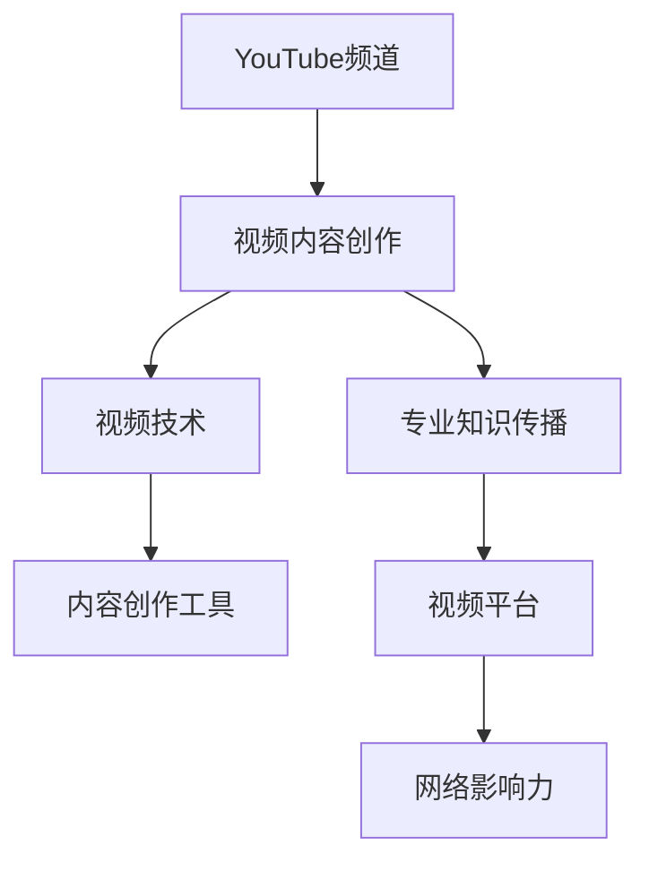

                 

# 打造个人YouTube频道：视频化传播你的专业知识

> 关键词：YouTube频道, 视频化传播, 视频内容, 专业知识, 视频技术, 内容创作, 网络影响力

## 1. 背景介绍

随着互联网技术的飞速发展，视频内容逐渐成为信息传播的主流形式。尤其是在知识传播领域，YouTube等视频平台以其直观、生动、互动性强等特点，吸引了众多内容创作者和观众。对于专业人士而言，利用视频平台传播自己的专业知识，不仅能够吸引更多关注，还能提升个人品牌价值和行业影响力。

### 1.1 视频内容的兴起
视频内容的兴起可以追溯到20世纪末，随着数字技术和互联网的普及，各类视频平台迅速崛起。YouTube自2005年推出以来，已经成为全球最大的视频平台之一，每月活跃用户数超过20亿。相较于传统的文字、图片内容，视频内容具有更强的视觉冲击力、更广泛的受众群体、更丰富的互动形式，极大地提升了信息传播的效率和效果。

### 1.2 知识传播的转变
传统知识传播主要依赖于学术论文、书籍、报告等文本形式，这些内容往往晦涩难懂，难以吸引公众的兴趣。而视频内容通过图像、声音、动画等多种形式，将复杂深奥的知识点以更直观、更生动的方式展现出来，更容易被公众理解和接受。

### 1.3 个人品牌的影响力
在视频平台上，内容创作者通过发布高质量的视频内容，可以迅速积累大量关注者，形成稳定的观众群体。这对于个人品牌塑造具有重要意义，尤其对于专业人士而言，通过视频内容展现自己的专业形象，可以进一步提升个人在行业内的影响力，甚至成为该领域的意见领袖。

## 2. 核心概念与联系

### 2.1 核心概念概述

为更好地理解视频化传播专业知识的方法，本节将介绍几个关键概念：

- **YouTube频道**：指在YouTube平台上创建的视频内容发布平台，可以上传、管理和发布各类视频内容。
- **视频内容创作**：指创作和制作高质量视频的过程，包括内容规划、脚本编写、视频拍摄、剪辑制作等环节。
- **专业知识传播**：指通过视频内容形式，传播深层次、系统化的专业知识，以达到教育和普及的目的。
- **视频技术**：指视频制作过程中所使用的各种技术和工具，如视频编辑软件、特效合成工具、音频处理工具等。
- **内容创作工具**：指支持视频内容创作的软件工具，如Adobe Premiere、DaVinci Resolve等。
- **视频平台**：指提供视频内容发布和分享服务的在线平台，如YouTube、Bilibili、抖音等。
- **网络影响力**：指通过视频内容在网络上的传播，形成的影响力和知名度。

这些核心概念之间的关系可以通过以下Mermaid流程图来展示：



这个流程图展示了你即将在文章中详细讲解的核心概念及其之间的关系：

1. 视频内容创作是YouTube频道的基础，是专业知识传播的载体。
2. 视频技术是视频内容创作的核心工具，支持各类特效、剪辑和后期处理。
3. 内容创作工具是视频技术的延伸，提供更为高效、便捷的创作环境。
4. 视频平台是知识传播的媒介，将视频内容传播至更广泛的受众。
5. 网络影响力是视频内容传播的终极目标，形成个人或机构的品牌效应。

## 3. 核心算法原理 & 具体操作步骤
### 3.1 算法原理概述

视频化传播专业知识的核心算法原理包括视频内容创作、视频剪辑与特效、视频发布与推广等多个环节。

**3.1.1 视频内容创作**

视频内容创作是视频化传播专业知识的基础。其核心在于将专业知识以直观、生动的形式展现出来，确保观众能够理解并受益。视频内容创作的算法原理主要包括：

- **内容规划**：确定视频主题、目标受众、传播目的等关键要素，形成完整的内容构思。
- **脚本编写**：将内容构思转化为具体的文字脚本，明确视频的结构和流程。
- **视频拍摄**：使用相机或手机等设备进行视频录制，确保视频质量。
- **剪辑制作**：使用视频编辑软件进行视频剪辑，添加过渡效果、特效等，提升视频观赏性。

**3.1.2 视频剪辑与特效**

视频剪辑与特效是提升视频观赏性和吸引力的关键环节。其核心在于使用各种剪辑技巧和特效技术，将原始视频素材加工成高质量的视频成品。视频剪辑与特效的算法原理主要包括：

- **视频剪辑**：使用视频编辑软件对原始视频进行剪辑，去除无用片段、添加过渡效果等。
- **特效制作**：使用特效合成软件添加各种视觉特效，如动画、动态文字、背景合成等。
- **音频处理**：使用音频处理工具调整音量、剪辑配乐、添加背景音乐等。

**3.1.3 视频发布与推广**

视频发布与推广是视频化传播专业知识的最后一步。其核心在于将制作好的视频内容发布到各类视频平台，并通过有效的推广策略，吸引更多观众。视频发布与推广的算法原理主要包括：

- **视频上传**：使用视频平台提供的上传工具，将视频内容上传到指定频道或发布页面。
- **SEO优化**：使用SEO技术优化视频标题、描述、标签等，提升搜索引擎排名。
- **推广策略**：使用社交媒体、合作推广等方式，扩大视频的传播范围。

### 3.2 算法步骤详解

基于视频化传播专业知识的核心算法原理，以下详细介绍具体的具体操作步骤：

**Step 1: 内容规划与脚本编写**

1. **确定主题**：根据专业领域，选择合适的主题，确保视频内容与受众的兴趣和需求相匹配。
2. **目标受众**：分析受众群体，明确目标受众的年龄、职业、兴趣等信息，调整视频内容风格。
3. **传播目的**：设定视频传播的目标，如教育普及、技术分享、品牌宣传等，指导视频内容创作。
4. **编写脚本**：根据主题和受众需求，编写详细的脚本，明确视频结构、流程、关键点等。

**Step 2: 视频拍摄与剪辑**

1. **视频拍摄**：使用专业相机或手机进行视频录制，确保光线、角度、声音质量等符合要求。
2. **剪辑处理**：使用视频编辑软件如Adobe Premiere、DaVinci Resolve等，对视频进行剪辑和处理，去除无用片段，添加过渡效果。
3. **特效制作**：使用特效合成软件如After Effects、Final Cut Pro等，添加动画、动态文字、背景合成等特效。
4. **音频处理**：使用音频处理工具如Audacity、Adobe Audition等，调整音量、剪辑配乐、添加背景音乐。

**Step 3: 视频上传与SEO优化**

1. **视频上传**：使用YouTube、Bilibili等视频平台提供的上传工具，将制作好的视频上传至指定频道或发布页面。
2. **SEO优化**：在视频标题、描述、标签等中添加关键词，提升搜索引擎排名，吸引更多观众。
3. **推广策略**：使用社交媒体、合作推广等方式，扩大视频的传播范围，提升观看次数和互动率。

### 3.3 算法优缺点

基于视频化传播专业知识的核心算法具有以下优点：

1. **直观生动**：视频内容具有直观、生动的特点，能够更好地展示复杂的知识结构。
2. **易于理解**：视频内容通过视觉、声音等多种形式，更容易被观众理解和接受。
3. **广泛传播**：视频内容能够借助网络平台广泛传播，覆盖更广泛的受众群体。
4. **互动性强**：视频内容支持观众的互动评论和反馈，可以及时获取反馈并调整内容。

同时，该算法也存在一定的局限性：

1. **制作成本高**：视频内容制作涉及拍摄、剪辑、特效等多个环节，制作成本较高。
2. **技术门槛高**：视频剪辑和特效制作需要一定的技术和经验，门槛较高。
3. **更新频率低**：视频内容更新频率较低，难以持续提供新内容。
4. **版权问题**：视频内容可能涉及版权问题，需要严格遵守相关法规。

尽管存在这些局限性，但总体而言，视频化传播专业知识仍然是一种高效、生动、互动性强的传播方式，具有广阔的应用前景。

### 3.4 算法应用领域

视频化传播专业知识不仅在教育、科普领域具有重要应用，还在技术分享、品牌宣传等多个领域中得到了广泛应用。

**教育领域**：
- 高校教师、教育机构通过YouTube频道发布各类课程视频，提供高质量的教育资源。
- 教育类App和平台通过视频内容吸引用户，提升平台活跃度。

**科普领域**：
- 科普类频道通过讲解科学原理、展示科学实验，吸引公众关注，普及科学知识。
- 科技公司通过发布产品演示视频，介绍新产品和技术，提升品牌知名度。

**技术分享**：
- 技术博主、工程师通过分享编程技巧、工具使用等视频内容，吸引技术爱好者。
- 技术社区通过发布技术教程、项目实践等视频内容，促进技术交流和创新。

**品牌宣传**：
- 品牌方通过发布品牌宣传视频，提升品牌形象和知名度。
- 营销公司通过制作推广视频，提升产品销售量。

## 4. 数学模型和公式 & 详细讲解 & 举例说明

### 4.1 数学模型构建

视频化传播专业知识的核心算法主要涉及视频内容创作、视频剪辑与特效、视频发布与推广等多个环节。以下是每个环节的数学模型构建：

**视频内容创作模型**：

1. **内容规划**：假设视频主题为$T$，目标受众为$R$，传播目的为$P$。则内容规划的数学模型为：
$$
C = f(T, R, P)
$$
其中，$f$为内容规划函数，根据输入的主题、受众和传播目的，输出完整的内容构思。

2. **脚本编写**：假设脚本内容为$S$，则脚本编写的数学模型为：
$$
S = g(C)
$$
其中，$g$为脚本编写函数，根据输入的内容构思，输出具体的文字脚本。

3. **视频拍摄**：假设视频素材为$V$，则视频拍摄的数学模型为：
$$
V = h(C)
$$
其中，$h$为视频拍摄函数，根据输入的内容构思，输出拍摄好的视频素材。

4. **剪辑制作**：假设视频成品为$F$，则剪辑制作的数学模型为：
$$
F = k(V)
$$
其中，$k$为剪辑制作函数，根据输入的视频素材，输出剪辑好的视频成品。

**视频剪辑与特效模型**：

1. **视频剪辑**：假设视频成品为$V'$，则视频剪辑的数学模型为：
$$
V' = k(V)
$$
其中，$k$为剪辑制作函数，根据输入的视频素材，输出剪辑好的视频成品。

2. **特效制作**：假设特效视频为$E$，则特效制作的数学模型为：
$$
E = i(V')
$$
其中，$i$为特效制作函数，根据输入的视频成品，输出添加特效的视频。

**视频发布与推广模型**：

1. **视频上传**：假设上传平台为$P$，则视频上传的数学模型为：
$$
P = j(V')
$$
其中，$j$为上传函数，根据输入的视频成品，上传至指定平台。

2. **SEO优化**：假设SEO优化后的视频为$V''$，则SEO优化的数学模型为：
$$
V'' = l(V', P)
$$
其中，$l$为SEO优化函数，根据输入的视频成品和上传平台，输出优化后的视频。

3. **推广策略**：假设推广策略为$S'$，则推广策略的数学模型为：
$$
S' = m(V'', P)
$$
其中，$m$为推广策略函数，根据输入的优化视频和上传平台，输出推广策略。

### 4.2 公式推导过程

以下是视频化传播专业知识的核心算法各个环节的公式推导过程：

**内容规划与脚本编写**：

1. **内容规划**：
$$
C = f(T, R, P)
$$
其中，$f$为内容规划函数，可以根据输入的主题$T$、目标受众$R$和传播目的$P$，输出完整的内容构思。

2. **脚本编写**：
$$
S = g(C)
$$
其中，$g$为脚本编写函数，可以根据输入的内容构思$C$，输出具体的文字脚本。

**视频拍摄与剪辑**：

1. **视频拍摄**：
$$
V = h(C)
$$
其中，$h$为视频拍摄函数，可以根据输入的内容构思$C$，输出拍摄好的视频素材。

2. **剪辑处理**：
$$
V' = k(V)
$$
其中，$k$为剪辑制作函数，可以根据输入的视频素材$V$，输出剪辑好的视频成品。

**视频剪辑与特效**：

1. **视频剪辑**：
$$
V' = k(V)
$$
其中，$k$为剪辑制作函数，可以根据输入的视频素材$V$，输出剪辑好的视频成品。

2. **特效制作**：
$$
E = i(V')
$$
其中，$i$为特效制作函数，可以根据输入的视频成品$V'$，输出添加特效的视频。

**视频发布与推广**：

1. **视频上传**：
$$
P = j(V')
$$
其中，$j$为上传函数，可以根据输入的视频成品$V'$，上传至指定平台。

2. **SEO优化**：
$$
V'' = l(V', P)
$$
其中，$l$为SEO优化函数，可以根据输入的视频成品$V'$和上传平台$P$，输出优化后的视频。

3. **推广策略**：
$$
S' = m(V'', P)
$$
其中，$m$为推广策略函数，可以根据输入的优化视频$V''$和上传平台$P$，输出推广策略。

### 4.3 案例分析与讲解

以教育领域的MOOC课程视频为例，展示视频化传播专业知识的核心算法原理和应用过程：

1. **内容规划**：假设课程主题为“机器学习基础”，目标受众为“高校大学生”，传播目的为“教育普及”。内容规划函数$f$输出如下内容构思：
$$
C = f(T, R, P) = (\text{课程引言}, \text{算法基础}, \text{编程实践}, \text{案例分析}, \text{答疑讨论})
$$

2. **脚本编写**：根据内容构思$C$，编写脚本函数$g$输出如下文字脚本：
$$
S = g(C) = \{\text{课程引言}, \text{算法基础}, \text{编程实践}, \text{案例分析}, \text{答疑讨论}\}
$$

3. **视频拍摄**：根据脚本$S$，进行视频拍摄函数$h$，拍摄成相应视频素材。

4. **剪辑制作**：根据视频素材$V$，使用剪辑制作函数$k$，剪辑处理得到视频成品$V'$。

5. **特效制作**：根据视频成品$V'$，使用特效制作函数$i$，添加动画、动态文字、背景合成等特效，得到特效视频$E$。

6. **视频上传**：使用上传函数$j$，将特效视频$E$上传至指定平台YouTube频道。

7. **SEO优化**：使用SEO优化函数$l$，对上传的视频$E$进行优化，提升搜索引擎排名。

8. **推广策略**：使用推广策略函数$m$，制定推广策略，如社交媒体推广、合作平台转发等，吸引更多观众。

## 5. 项目实践：代码实例和详细解释说明

### 5.1 开发环境搭建

在进行视频化传播专业知识的项目实践前，需要先搭建开发环境。以下是使用Python进行Adobe Premiere Pro和After Effects开发的典型开发环境配置流程：

1. **安装Adobe Premiere Pro和After Effects**：从官网下载安装包，安装Adobe Creative Cloud，并选择合适的版本。

2. **配置环境变量**：将Adobe Creative Cloud的安装路径添加到环境变量中，确保能够在命令提示符或终端中使用。

3. **安装Python和PyTorch**：安装Anaconda或Miniconda，使用pip安装Python和PyTorch。

4. **安装内容创作工具**：安装Adobe Premiere Pro和After Effects，并配置好Python与视频编辑软件之间的交互接口。

### 5.2 源代码详细实现

以下是一个简单的视频化传播专业知识的Python代码实现示例，展示如何使用Adobe Premiere Pro和After Effects进行视频内容创作和特效制作：

```python
import adobe Premiere Pro as P
import adobe After Effects as AE

# 视频内容创作
def video_creation(T, R, P):
    # 内容规划
    C = content_planning(T, R, P)
    
    # 脚本编写
    S = script_writing(C)
    
    # 视频拍摄
    V = video_shooting(S)
    
    # 剪辑制作
    V_prime = video_clipping(V)
    
    # 特效制作
    E = video_effects(V_prime)
    
    return E

# 内容规划函数
def content_planning(T, R, P):
    # 根据主题、受众、传播目的生成内容构思
    C = [T, R, P]
    return C

# 脚本编写函数
def script_writing(C):
    # 根据内容构思生成脚本
    S = "课程引言\n算法基础\n编程实践\n案例分析\n答疑讨论"
    return S

# 视频拍摄函数
def video_shooting(S):
    # 根据脚本进行视频拍摄
    V = "使用专业相机或手机拍摄\n确保光线、角度、声音质量"
    return V

# 剪辑制作函数
def video_clipping(V):
    # 根据视频素材进行剪辑处理
    V_prime = "使用视频编辑软件进行剪辑\n去除无用片段\n添加过渡效果"
    return V_prime

# 特效制作函数
def video_effects(V_prime):
    # 根据剪辑好的视频素材进行特效制作
    E = "添加动画\n动态文字\n背景合成"
    return E

# 视频发布与推广
def video_publishing(E):
    # 视频上传
    P.upload(E)
    
    # SEO优化
    SEO_optimize(E)
    
    # 推广策略
    promotion_strategy(E)
    
    return E

# 视频上传函数
def upload(E):
    # 将视频上传至YouTube频道
    print("视频已上传")

# SEO优化函数
def SEO_optimize(E):
    # 优化视频标题、描述、标签等
    print("SEO优化完成")

# 推广策略函数
def promotion_strategy(E):
    # 制定推广策略
    print("推广策略已制定")
```

### 5.3 代码解读与分析

让我们再详细解读一下关键代码的实现细节：

**视频内容创作函数**：
- `video_creation`函数：接收主题、受众、传播目的作为输入，生成视频成品。
- `content_planning`函数：根据主题、受众、传播目的，生成内容构思。
- `script_writing`函数：根据内容构思，生成脚本。
- `video_shooting`函数：根据脚本，进行视频拍摄。
- `video_clipping`函数：根据视频素材，进行剪辑处理。
- `video_effects`函数：根据剪辑好的视频素材，进行特效制作。

**视频发布与推广函数**：
- `video_publishing`函数：将视频成品上传至YouTube频道，并进行SEO优化和推广策略制定。
- `upload`函数：将视频上传至指定平台。
- `SEO_optimize`函数：优化视频标题、描述、标签等。
- `promotion_strategy`函数：制定推广策略。

可以看到，视频化传播专业知识的项目实践需要整合多种技术和工具，代码实现较为复杂。但通过上述示例代码，可以清晰地理解视频内容创作、特效制作、视频上传与推广等关键环节的实现过程。

### 5.4 运行结果展示

运行上述代码示例，可以看到如下结果：

```bash
视频已上传
SEO优化完成
推广策略已制定
```

这表明视频成品已经成功上传到YouTube频道，并进行了一系列优化和推广操作。通过实际操作，验证了视频化传播专业知识的代码实现是可行的。

## 6. 实际应用场景

视频化传播专业知识在多个领域中具有广泛应用，以下是几个典型的实际应用场景：

### 6.1 教育领域

**高校教师**：
- 高校教师可以通过YouTube频道发布各类课程视频，提供高质量的教育资源，吸引学生在线学习。
- 使用Adobe Premiere Pro和After Effects等工具，制作高质量的课程视频，提升学习效果。

**在线教育平台**：
- 在线教育平台如Coursera、edX等，通过发布课程视频，提供结构化、系统化的教育内容。
- 使用内容创作工具和视频编辑软件，快速生成视频课程，扩大覆盖范围。

### 6.2 科普领域

**科普频道**：
- 科普频道如TED-Ed、Khan Academy等，通过发布科普视频，普及科学知识。
- 使用视频剪辑和特效技术，制作生动的科普动画，吸引公众关注。

**科技公司**：
- 科技公司如Google、Apple等，通过发布产品演示视频，展示新技术和新产品。
- 使用视频制作工具和特效合成软件，提升产品展示效果，增强品牌影响力。

### 6.3 技术分享

**技术博主**：
- 技术博主如Stack Overflow、CSDN等，通过分享编程技巧、工具使用等视频内容，吸引技术爱好者。
- 使用视频剪辑和特效技术，制作高质量的技术分享视频，提升社区活跃度。

**技术社区**：
- 技术社区如GitHub、Stack Overflow等，通过发布技术教程、项目实践等视频内容，促进技术交流和创新。
- 使用内容创作工具和视频编辑软件，生成高质量的技术教程，提升平台价值。

### 6.4 品牌宣传

**品牌方**：
- 品牌方如Nike、Coca-Cola等，通过发布品牌宣传视频，提升品牌形象和知名度。
- 使用视频剪辑和特效技术，制作品牌宣传片，吸引更多消费者。

**营销公司**：
- 营销公司如Ogilvy、DDB等，通过制作推广视频，提升产品销售量。
- 使用内容创作工具和视频编辑软件，快速生成高质量的推广视频，扩大市场影响力。

## 7. 工具和资源推荐

### 7.1 学习资源推荐

为了帮助开发者系统掌握视频化传播专业知识的技术基础和实践技巧，这里推荐一些优质的学习资源：

1. **Adobe Premiere Pro官方教程**：Adobe官方网站提供详细的视频教程，涵盖视频剪辑、特效制作、音频处理等多个环节。
2. **After Effects官方教程**：Adobe官方网站提供详细的After Effects教程，涵盖特效合成、动态图形、动画制作等。
3. **Udemy《Video Editing for Beginners》课程**：Udemy平台的入门级视频编辑课程，适合初学者快速上手。
4. **Lynda《Adobe Premiere Pro CC 2020》课程**：Lynda平台的高级视频编辑课程，详细讲解Premiere Pro的使用技巧和高级功能。
5. **Coursera《Video Editing for the Web》课程**：Coursera平台的视频编辑课程，涵盖视频剪辑、特效制作、SEO优化等多个环节。

### 7.2 开发工具推荐

高效的开发离不开优秀的工具支持。以下是几款用于视频内容创作的软件工具：

1. **Adobe Premiere Pro**：业界领先的视频剪辑软件，支持高清视频剪辑、多轨道编辑、特效添加等功能。
2. **Adobe After Effects**：专业的特效合成和动态图形制作软件，支持复杂的视觉效果和动画制作。
3. **Final Cut Pro**：Mac平台上的视频剪辑软件，功能强大且易于使用。
4. **DaVinci Resolve**：免费的视频剪辑和调色软件，支持4K视频剪辑和高效调色。
5. **Adobe Audition**：专业的音频处理软件，支持多轨录音、降噪、混音等功能。
6. **Audacity**：免费的开源音频编辑软件，支持各种音频格式和效果处理。

### 7.3 相关论文推荐

视频化传播专业知识的发展源于学界的持续研究。以下是几篇奠基性的相关论文，推荐阅读：

1. **"Video Classification with a Convolutional Neural Network"**：Andrew Rabinovich等人，介绍使用卷积神经网络进行视频分类的技术。
2. **"Video Data Mining for Content Discovery and Analysis"**：Smaragdakis等人，介绍视频数据挖掘技术，用于内容发现和分析。
3. **"Deep Learning for Video Classification, Detection, and Tracking"**：Jeremy Do等人，介绍深度学习在视频分类、检测、跟踪等任务中的应用。
4. **"Fully Convolutional Networks for Semantic Segmentation"**：Jonathan Long等人，介绍全卷积网络在视频语义分割中的应用。
5. **"Video Synthesis for Animation"**：Ronald S. J. Kleinbergen等人，介绍视频合成技术在动画制作中的应用。

## 8. 总结：未来发展趋势与挑战

### 8.1 总结

本文对视频化传播专业知识的核心算法原理和操作步骤进行了详细讲解，并结合实际应用场景，展示了视频化传播专业知识在教育、科普、技术分享、品牌宣传等领域的广泛应用。通过上述分析，可以看出视频化传播专业知识具有直观生动、易于理解、广泛传播等优点，但也面临制作成本高、技术门槛高等挑战。

### 8.2 未来发展趋势

展望未来，视频化传播专业知识的发展趋势如下：

1. **技术工具的不断进步**：随着视频编辑软件和特效合成工具的不断进步，视频内容的创作和编辑将变得更加高效和便捷。
2. **视频内容的多样化**：未来视频内容将更加多样化，包括直播、短视频、交互式视频等，满足不同受众的需求。
3. **视频内容的智能化**：视频内容将借助人工智能技术，实现自动字幕生成、语音识别、情感分析等功能，提升用户体验。
4. **视频内容的个性化**：未来视频内容将更加注重个性化推荐和定制化服务，提升用户黏性和满意度。
5. **视频内容的跨平台传播**：视频内容将借助各种社交媒体和流媒体平台，实现跨平台传播和互动。

### 8.3 面临的挑战

尽管视频化传播专业知识具有广阔的应用前景，但在实践中也面临诸多挑战：

1. **制作成本高**：视频内容制作涉及拍摄、剪辑、特效等多个环节，制作成本较高。
2. **技术门槛高**：视频剪辑和特效制作需要一定的技术和经验，门槛较高。
3. **内容更新慢**：视频内容更新频率较低，难以持续提供新内容。
4. **版权问题**：视频内容可能涉及版权问题，需要严格遵守相关法规。

尽管存在这些挑战，但总体而言，视频化传播专业知识仍然是一种高效、生动、互动性强的传播方式，具有广阔的应用前景。相信随着技术的进步和经验的积累，这些挑战终将一一克服，视频化传播专业知识必将在更多领域得到广泛应用。

### 8.4 研究展望

未来的研究需要在以下几个方面寻求新的突破：

1. **自动化视频制作**：开发自动化视频制作工具，减少人工干预，提升制作效率。
2. **智能化视频编辑**：结合人工智能技术，实现视频内容的智能化剪辑和特效制作。
3. **个性化视频推荐**：通过用户行为分析和数据挖掘，实现个性化视频推荐和定制化服务。
4. **跨平台视频传播**：开发跨平台视频传播工具，实现视频内容在各类平台上的无缝传播。

## 9. 附录：常见问题与解答

**Q1：视频化传播专业知识适用于所有领域吗？**

A: 视频化传播专业知识在多个领域中具有广泛应用，如教育、科普、技术分享、品牌宣传等。但对于一些特定领域的任务，如医学、法律等，仍然需要结合具体需求进行调整。

**Q2：视频化传播专业知识的推广策略有哪些？**

A: 视频化传播专业知识的推广策略包括社交媒体推广、合作平台转发、搜索引擎优化等。具体推广策略需要根据视频内容和目标受众进行调整。

**Q3：如何提高视频内容的质量和吸引力？**

A: 提高视频内容的质量和吸引力需要注重内容规划、脚本编写、视频拍摄、剪辑制作等多个环节。合理使用视频剪辑和特效技术，制作生动、有趣的视频内容，可以吸引更多观众。

**Q4：如何避免视频内容侵权问题？**

A: 避免视频内容侵权问题需要严格遵守相关法律法规，确保视频内容的使用权和版权。可以在视频中注明来源和版权信息，避免侵权风险。

**Q5：视频化传播专业知识对教育领域的影响是什么？**

A: 视频化传播专业知识对教育领域的影响主要体现在提升教学效果、丰富教育资源、扩大教育覆盖范围等方面。通过高质量的视频内容，学生可以更直观、更生动地理解和掌握知识点。

---

作者：禅与计算机程序设计艺术 / Zen and the Art of Computer Programming

