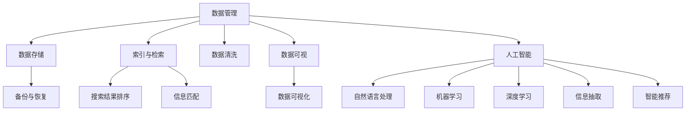

                 

# 打造个人知识库的全栈技术方案

> 关键词：个人知识库,全栈技术,数据管理,信息检索,人工智能,大数据,深度学习,自然语言处理

## 1. 背景介绍

在信息化高速发展的今天，个人知识管理已经成为许多专业人士提升效率和竞争力的重要手段。无论是学生、教师、科研人员还是行业专家，大家都希望能够高效地存储、检索和利用各种知识和信息，以助力个人成长和企业创新。

然而，由于知识库建设涉及多方面的技术和工具，且许多技术细节不为普通人所熟知，使得构建一个高效、易于使用的个人知识库成为一项复杂且耗时的任务。本文旨在提供一个全面的技术方案，帮助读者系统地搭建个人知识库，涉及数据管理、信息检索、人工智能和深度学习等领域的核心技术。

## 2. 核心概念与联系

在详细阐述技术方案前，我们先明确几个核心概念及其相互关联：

- **数据管理**：涉及数据的存储、备份、迁移、安全等技术。
- **信息检索**：通过索引、排序、匹配等手段，高效获取所需信息。
- **人工智能**：包括机器学习、自然语言处理（NLP）、深度学习等，用于自动化信息抽取、智能推荐等任务。
- **大数据技术**：涵盖数据采集、存储、分析和可视化等全链条技术。

这些技术紧密相连，共同构成个人知识库的完整架构。以下是一个Mermaid流程图，展示了这些核心概念间的相互联系：



## 3. 核心算法原理 & 具体操作步骤

### 3.1 算法原理概述

本节介绍几个核心算法的基本原理：

- **数据清洗**：用于去除噪音数据，只保留有用信息。常见的数据清洗技术包括去重、过滤、标准化等。
- **索引与检索**：通过建立索引，对数据进行高效搜索和匹配。常用的算法包括倒排索引、向量空间模型等。
- **自然语言处理**：包括分词、词性标注、命名实体识别等，用于处理文本数据。
- **机器学习和深度学习**：用于信息抽取、智能推荐、情感分析等任务，提升知识库的智能化程度。

### 3.2 算法步骤详解

构建个人知识库涉及以下步骤：

1. **数据采集与清洗**：收集各种信息源，包括电子书、论文、新闻、笔记等，并进行清洗和去重。
2. **建立索引**：为数据创建倒排索引，支持高效检索。
3. **数据存储与备份**：使用云存储或本地存储方案，确保数据的安全和可恢复性。
4. **信息抽取与智能推荐**：利用NLP和机器学习技术，从文本中提取关键信息，并根据用户历史行为进行智能推荐。
5. **用户界面设计**：设计一个直观易用的知识库UI，支持全文搜索、标签管理、笔记撰写等功能。

### 3.3 算法优缺点

**数据管理**：
- 优点：支持大容量数据存储、数据备份与恢复。
- 缺点：存在数据丢失和泄露的风险。

**信息检索**：
- 优点：检索速度较快，支持复杂查询。
- 缺点：索引建立和维护成本较高，对大数据量检索效果有待提升。

**自然语言处理**：
- 优点：提高了信息处理的效率和准确性。
- 缺点：处理非结构化数据较为困难。

**机器学习和深度学习**：
- 优点：智能化推荐、信息抽取等应用效果显著。
- 缺点：需要大量标注数据，训练成本高，存在过拟合风险。

### 3.4 算法应用领域

个人知识库的核心技术广泛应用于以下领域：

- **学术研究**：学术期刊、专利文献、研究报告等数据的管理和检索。
- **企业知识管理**：企业内部知识库的构建与维护，员工知识共享和协作。
- **教育培训**：教育资源的管理、学生学习行为的追踪与分析。
- **个人笔记管理**：个人笔记、文档、图片等信息的存储和检索。
- **知识挖掘**：从大数据中提取有价值的信息，辅助决策和策略制定。

## 4. 数学模型和公式 & 详细讲解 & 举例说明

### 4.1 数学模型构建

数据清洗和索引构建涉及以下数学模型：

- **倒排索引**：使用哈希表或B树实现，将关键词映射到包含该关键词的文档列表。
- **向量空间模型**：将文档和查询表示为向量，计算相似度。

### 4.2 公式推导过程

**倒排索引**：
- 给定文档集合 $D$，关键词集合 $K$，倒排索引 $I$ 定义为：
  $$
  I = \{ (k, \{d\}) \mid k \in K, d \in D, k \text{ 在 } d \text{ 中出现} \}
  $$
- 查询时，将查询词 $q$ 转换为向量 $q_v$，在倒排索引中查找包含 $q$ 的文档列表 $\{d\}$。

**向量空间模型**：
- 文档 $d$ 表示为向量 $d_v$，查询 $q$ 表示为向量 $q_v$，计算余弦相似度：
  $$
  \cos \theta (q_v, d_v) = \frac{q_v \cdot d_v}{\|q_v\| \cdot \|d_v\|}
  $$

### 4.3 案例分析与讲解

**案例1：学术资源管理**

- 数据源：学术数据库、图书馆电子书籍、学术论文。
- 数据清洗：去重、格式化、标准化。
- 索引建立：关键词提取，建立倒排索引。
- 智能推荐：基于用户阅读历史，推荐相关论文。

**案例2：企业知识库构建**

- 数据源：内部文档、员工培训材料、客户反馈。
- 数据清洗：去除冗余信息、格式化数据。
- 索引建立：构建全文本索引，支持全文检索。
- 智能推荐：根据员工访问历史，推荐相关文档和资源。

## 5. 项目实践：代码实例和详细解释说明

### 5.1 开发环境搭建

搭建个人知识库需要以下环境：

- **编程语言**：Python
- **数据处理库**：Pandas、NumPy
- **索引库**：Whoosh、Elasticsearch
- **机器学习库**：Scikit-learn、TensorFlow

### 5.2 源代码详细实现

以下是个人知识库的简单代码实现，包括数据清洗、索引构建和智能推荐：

```python
import pandas as pd
from sklearn.feature_extraction.text import TfidfVectorizer
from sklearn.metrics.pairwise import cosine_similarity
from sklearn.decomposition import TruncatedSVD

# 数据清洗
df = pd.read_csv('data.csv')
df = df.drop_duplicates()

# 建立索引
vectorizer = TfidfVectorizer()
X = vectorizer.fit_transform(df['content'])
index = dict(zip(range(len(X)), vectorizer.get_feature_names()))

# 数据存储
df.to_csv('cleaned_data.csv', index=False)

# 智能推荐
svd = TruncatedSVD(n_components=10)
X_svd = svd.fit_transform(X)
similarity_matrix = cosine_similarity(X_svd, X_svd)

def recommend(query, top_n=5):
    query_vec = vectorizer.transform([query])
    similarity = cosine_similarity(query_vec, X_svd)
    similarity_matrix = pd.DataFrame(similarity, index=index, columns=index)
    recommendations = similarity_matrix.index[(similarity_matrix.iloc[0] > 0.5).any(axis=1)].tolist()[:top_n]
    return recommendations
```

### 5.3 代码解读与分析

上述代码实现了基本的个人知识库功能，包括数据清洗、建立索引和智能推荐。

- **数据清洗**：使用Pandas库对数据进行去重、格式化处理。
- **索引构建**：使用Scikit-learn库的TfidfVectorizer进行文本向量化，建立倒排索引。
- **智能推荐**：使用TruncatedSVD降维，结合余弦相似度计算推荐结果。

## 6. 实际应用场景

个人知识库在多个实际场景中得到了广泛应用，如：

- **学术研究**：管理科研文献、实验数据，辅助论文写作。
- **企业知识管理**：支持员工知识分享、协作，构建企业知识资产。
- **个人笔记管理**：记录、整理个人笔记，提升学习效率和工作能力。
- **教学培训**：整理教学资料，推荐相关学习资源，支持远程教育。

## 7. 工具和资源推荐

### 7.1 学习资源推荐

为了帮助开发者系统掌握个人知识库的核心技术，这里推荐一些优质的学习资源：

1. **《Python数据科学手册》**：由Jake VanderPlas 撰写，详细介绍了Python数据处理、机器学习、可视化等方面的知识。
2. **《自然语言处理综论》**：由Daniel Jurafsky 和 James H. Martin 合著，系统介绍了自然语言处理的基础理论和应用。
3. **Coursera 数据科学课程**：由知名大学和机构开设，涵盖数据清洗、机器学习、深度学习等核心内容。
4. **Kaggle 竞赛平台**：参与各种数据科学竞赛，提升实践能力。

### 7.2 开发工具推荐

构建个人知识库需要以下常用工具：

- **IDE**：PyCharm、VS Code、Jupyter Notebook
- **数据处理库**：Pandas、NumPy
- **索引库**：Whoosh、Elasticsearch
- **机器学习库**：Scikit-learn、TensorFlow
- **Web框架**：Django、Flask

### 7.3 相关论文推荐

个人知识库技术的发展离不开学界的持续研究，以下是几篇经典论文，推荐阅读：

1. **《PageRank算法》**：由Larry Page 和 Sergey Brin 提出，是一种用于网页排序的算法，被广泛应用于搜索引擎。
2. **《信息检索的向量空间模型》**：由Christopher D. Manning、Prabhakar Raghavan 和 Hinrich Schütze 合著，详细介绍了向量空间模型的理论和应用。
3. **《深度学习在自然语言处理中的应用》**：由Yoshua Bengio、Geoffrey Hinton 和 Yann LeCun 合著，介绍了深度学习在NLP中的应用。
4. **《知识图谱在知识管理中的应用》**：介绍了知识图谱在企业知识管理中的应用，如何构建和管理知识图谱。

## 8. 总结：未来发展趋势与挑战

### 8.1 研究成果总结

本文对个人知识库的核心技术进行了详细阐述，涵盖数据管理、信息检索、人工智能和深度学习等领域的核心技术。通过系统介绍，希望能帮助读者全面掌握个人知识库的搭建和优化方法。

### 8.2 未来发展趋势

展望未来，个人知识库技术将呈现以下几个发展趋势：

1. **智能化程度提升**：利用深度学习和大数据技术，进一步提升推荐系统的效果和个性化程度。
2. **跨平台支持**：支持多平台、多设备访问，提升知识库的灵活性和可访问性。
3. **语义检索**：利用NLP技术，实现基于语义的智能检索，提升检索准确性和用户体验。
4. **云服务化**：知识库的构建和维护将更多依赖云服务，降低本地部署的复杂性和成本。
5. **协作与共享**：支持多人协作、知识共享，提升知识库的社会价值。

### 8.3 面临的挑战

尽管个人知识库技术不断进步，但在实际应用中仍面临一些挑战：

1. **数据隐私与安全**：如何确保用户数据的隐私和安全，防止数据泄露。
2. **计算资源限制**：大规模数据处理和模型训练需要强大的计算资源，如何降低计算成本。
3. **用户体验设计**：如何设计一个直观、易用的UI，提升用户的使用体验。
4. **多语言支持**：如何处理多语言信息，提升知识库的通用性。

### 8.4 研究展望

未来，个人知识库技术需要在以下几个方面寻求新的突破：

1. **跨语言知识管理**：构建跨语言知识图谱，支持多语言信息的统一管理。
2. **多模态知识融合**：将文本、图像、视频等多模态数据融合，提升知识库的全面性和深度。
3. **知识图谱驱动的推荐系统**：利用知识图谱辅助推荐系统，提升推荐效果和多样性。
4. **个性化学习平台**：构建个性化学习推荐平台，提升学习效率和效果。
5. **智能协作工具**：开发智能协作工具，支持多人协作和知识共享。

## 9. 附录：常见问题与解答

**Q1: 如何有效地清洗数据？**

A: 数据清洗的关键在于去除噪音数据和冗余信息。具体步骤包括：
1. 去除重复数据和空值。
2. 格式化文本数据，统一编码格式。
3. 标准化数据格式，如统一日期格式。
4. 去除无关字段，只保留有用信息。

**Q2: 如何提高检索速度？**

A: 提高检索速度的关键在于建立高效的索引。具体方法包括：
1. 使用倒排索引，建立关键词和文档之间的映射关系。
2. 优化索引结构，使用B树或哈希表。
3. 利用缓存技术，减少磁盘I/O操作。
4. 使用向量空间模型，计算相似度。

**Q3: 如何设计推荐系统？**

A: 推荐系统的设计思路包括：
1. 收集用户行为数据，如阅读历史、搜索记录。
2. 提取文本特征，如TF-IDF、词袋模型。
3. 构建用户-物品矩阵，计算相似度。
4. 使用协同过滤或基于内容的推荐算法，进行推荐。

**Q4: 如何选择适合的技术栈？**

A: 选择技术栈的关键在于考虑项目需求、团队技能和资源限制。具体方法包括：
1. 评估项目需求，选择适合的技术栈。
2. 考虑团队技能，选择熟悉的技术栈。
3. 评估资源限制，选择低成本的技术栈。
4. 参考社区和开源项目，选择成熟的技术栈。

作者：禅与计算机程序设计艺术 / Zen and the Art of Computer Programming

