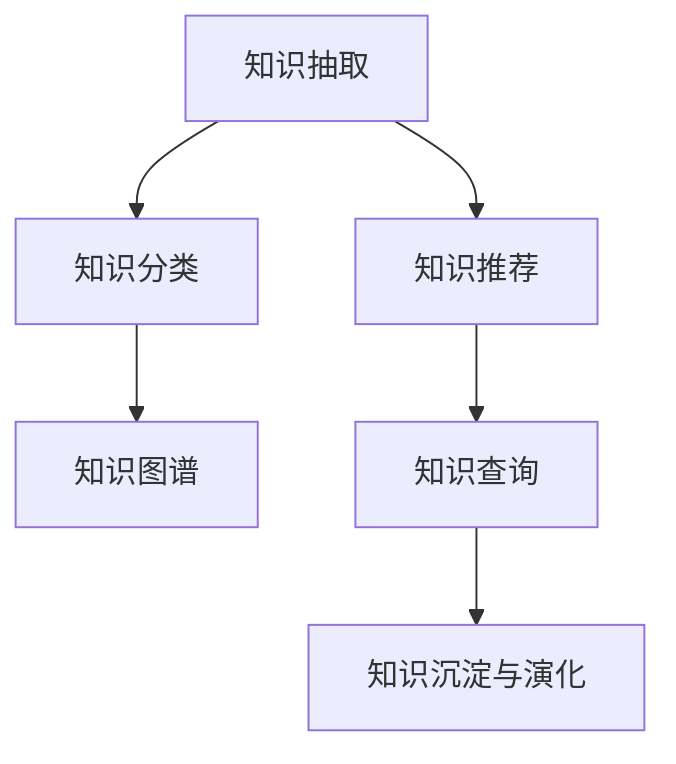

                 

# 打造个人知识管理的AI助手

## 1. 背景介绍

### 1.1 问题由来
在信息化时代，信息过载已经成为了个人知识管理的最大难题。一方面，来自各类平台的信息源源不断，如何从中提取有价值的知识，成为一项艰巨的任务。另一方面，即便提取到了知识，如何有效地整合、检索和应用这些知识，也让人头痛不已。为了解决这一问题，人工智能（AI）技术应运而生，尤其是在自然语言处理（NLP）领域的突破，为构建智能化的知识管理系统提供了可能。

### 1.2 问题核心关键点
本文将探讨如何利用人工智能技术，特别是基于语言模型的技术，打造个人知识管理的智能助手。具体来说，我们将重点关注以下核心问题：
1. **知识抽取与分类**：如何从海量的文本信息中，自动识别出关键知识和相关主题，并进行有效的分类。
2. **知识关联与链接**：如何建立知识间的关联关系，形成知识图谱，支持跨领域的知识检索和关联。
3. **知识推荐与更新**：如何根据用户的历史行为和兴趣，推荐相关的知识和资源，并持续更新知识库。
4. **知识查询与使用**：如何设计智能化的查询界面，使用户能够快速、准确地找到所需知识。
5. **知识沉淀与演化**：如何通过学习用户的互动记录和反馈，优化知识管理系统的表现。

## 2. 核心概念与联系

### 2.1 核心概念概述

为了更好地理解构建智能知识助手的技术路径，本节将介绍几个关键概念：

- **知识抽取**：从非结构化的文本中自动识别和提取出关键信息，如实体、事件、关系等。
- **知识分类**：将提取出的知识根据主题、领域等维度进行分类和组织，形成知识库。
- **知识图谱**：构建由节点和边组成的知识图，节点代表实体或概念，边表示实体间的关系。
- **知识推荐**：基于用户的历史行为和兴趣，推荐相关知识资源，支持个性化学习。
- **知识查询**：设计智能化的查询接口，使用户能够通过自然语言或特定的查询语言，快速获取所需知识。
- **知识沉淀与演化**：通过学习用户的互动和反馈，不断优化知识库和推荐系统，使知识管理更加智能化。

这些概念之间的关系可以通过以下Mermaid流程图来展示：



这个流程图展示了从知识抽取到知识推荐的完整知识管理流程，其中每个环节都依赖于前一个环节的结果，共同构成了完整的知识管理闭环。

## 3. 核心算法原理 & 具体操作步骤
### 3.1 算法原理概述

基于语言模型的知识管理AI助手，其核心思想是利用预训练语言模型从文本中抽取和理解知识，并将其转化为结构化的形式，进而支持知识分类、关联和推荐等任务。其基本流程包括以下几个步骤：

1. **预训练语言模型的选择**：选择合适的预训练语言模型，如BERT、GPT等，作为知识抽取和分类的基础。
2. **知识抽取**：使用预训练模型对文本进行解析，自动识别和抽取其中的关键信息。
3. **知识分类**：对抽取出的知识进行分类，将其归入预定义的主题或领域。
4. **知识图谱构建**：将分类的知识转化为节点和边，形成知识图谱，支持知识查询和关联。
5. **知识推荐**：基于用户的历史行为和兴趣，在知识图谱上推荐相关知识节点。
6. **知识查询**：设计智能化的查询界面，使用户能够通过自然语言查询知识。
7. **知识沉淀与演化**：不断学习用户反馈，优化知识库和推荐算法。

### 3.2 算法步骤详解

#### 3.2.1 预训练语言模型的选择

选择合适的预训练语言模型是构建知识助手的第一步。常用的预训练模型包括BERT、GPT、RoBERTa等，它们在处理自然语言理解方面表现优异。本文以BERT为例进行讲解。

#### 3.2.2 知识抽取

知识抽取的目标是从文本中自动提取和识别出实体、事件、关系等关键信息。常用的方法包括命名实体识别（NER）、事件抽取（EAE）等。以NER为例，其步骤如下：

1. 对文本进行分词，将句子分解成单词或短语。
2. 对每个单词进行标注，确定其是否为实体，如果是，则进一步识别实体类型（如人名、地名、组织机构名等）。
3. 对标注结果进行过滤和整合，去除无关信息，提取关键实体。

#### 3.2.3 知识分类

知识分类的目的是将抽取出的实体和事件按照主题或领域进行分类，便于后续的知识管理和推荐。常用的分类方法包括基于规则的分类、基于机器学习的分类等。以基于机器学习的分类为例，其步骤如下：

1. 收集领域相关的文本数据，标注其所属的主题或领域。
2. 使用预训练语言模型对标注数据进行特征提取。
3. 训练分类模型，如支持向量机（SVM）、随机森林（RF）等，将抽取出的知识进行分类。

#### 3.2.4 知识图谱构建

知识图谱是由节点和边组成的有向图，节点代表实体或概念，边表示实体间的关系。构建知识图谱的第一步是确定知识节点。以实体节点为例，其步骤如下：

1. 对分类后的知识进行去重和合并，形成节点。
2. 确定节点之间的关系，如“属于”、“包含”、“与…关联”等。
3. 使用图数据库（如Neo4j）存储和管理知识图谱。

#### 3.2.5 知识推荐

知识推荐的目标是根据用户的历史行为和兴趣，推荐相关的知识节点。常用的推荐方法包括基于内容的推荐、基于协同过滤的推荐等。以基于内容的推荐为例，其步骤如下：

1. 收集用户的历史行为数据，如浏览、点击、收藏等。
2. 对用户的历史行为进行分析和建模，提取用户兴趣特征。
3. 使用预训练语言模型对知识节点进行特征提取。
4. 训练推荐模型，如矩阵分解（MF）、深度学习模型（如DNN）等，将用户兴趣特征与知识节点特征进行匹配，推荐相关知识节点。

#### 3.2.6 知识查询

知识查询的目标是设计智能化的查询界面，使用户能够快速、准确地找到所需知识。常用的方法包括自然语言查询、结构化查询等。以自然语言查询为例，其步骤如下：

1. 设计查询界面，使用户能够通过自然语言输入查询。
2. 使用预训练语言模型对用户输入进行解析和理解。
3. 在知识图谱上搜索相关知识节点。
4. 返回查询结果，使用户能够获取所需知识。

#### 3.2.7 知识沉淀与演化

知识沉淀与演化的目的是不断学习用户的互动和反馈，优化知识库和推荐算法。常用的方法包括基于强化学习的优化、基于在线学习的优化等。以基于强化学习的优化为例，其步骤如下：

1. 收集用户的互动和反馈数据，如点击、反馈等。
2. 设计奖励机制，对用户的互动和反馈进行评估和反馈。
3. 使用强化学习算法（如Q-learning、Deep Q-learning等）优化知识抽取、分类、推荐等环节。
4. 不断学习用户的互动和反馈，优化知识库和推荐算法。

### 3.3 算法优缺点

基于语言模型的知识管理AI助手有以下优点：

1. **高效性**：利用预训练语言模型的高效特征提取能力，可以快速从文本中提取和分类知识。
2. **准确性**：预训练语言模型在大规模数据上进行了充分的训练，能够较好地识别和抽取关键信息。
3. **灵活性**：知识管理系统的设计可以根据需求进行调整和扩展，支持多领域的知识管理。

同时，该方法也存在一些缺点：

1. **资源需求高**：构建知识管理系统需要高性能的计算资源，如GPU、TPU等。
2. **数据质量要求高**：知识抽取和分类的准确性高度依赖于数据的质量和标注的准确性。
3. **用户隐私问题**：知识管理系统需要收集和处理用户的互动数据，可能涉及用户隐私和数据安全问题。

尽管存在这些缺点，基于语言模型的知识管理AI助手仍然具有广阔的应用前景，值得进一步研究和探索。

### 3.4 算法应用领域

基于语言模型的知识管理AI助手已经广泛应用于多个领域，以下是几个典型的应用场景：

1. **学术研究**：帮助科研人员快速检索和整理文献资料，提高研究效率。
2. **企业知识管理**：帮助企业员工快速获取所需知识，支持决策和知识分享。
3. **教育培训**：帮助学生和教师快速查找教学资源，提高学习效果。
4. **医疗健康**：帮助医生和护士快速获取相关病例和知识，支持医疗决策和护理。
5. **公共管理**：帮助政府机构快速获取政策文件和相关知识，支持公共服务。

## 4. 数学模型和公式 & 详细讲解  
### 4.1 数学模型构建

本节将使用数学语言对基于语言模型的知识管理AI助手的构建过程进行更加严格的刻画。

设输入文本为 $x$，对应的预训练语言模型为 $M_{\theta}$，其中 $\theta$ 为模型参数。假设知识抽取的任务为从文本中识别出实体 $e$，知识分类的任务为将识别出的实体 $e$ 分类为预定义的主题或领域 $c$。知识推荐的任务为根据用户的历史行为 $h$ 和兴趣 $i$，推荐相关的知识节点 $k$。

定义知识抽取的损失函数为 $\ell_{\text{抽取}}(M_{\theta}, x, e)$，知识分类的损失函数为 $\ell_{\text{分类}}(M_{\theta}, x, e, c)$，知识推荐的损失函数为 $\ell_{\text{推荐}}(M_{\theta}, h, i, k)$。则知识管理的整体损失函数为：

$$
\mathcal{L}(\theta) = \alpha \ell_{\text{抽取}}(M_{\theta}, x, e) + \beta \ell_{\text{分类}}(M_{\theta}, x, e, c) + \gamma \ell_{\text{推荐}}(M_{\theta}, h, i, k)
$$

其中 $\alpha$、$\beta$、$\gamma$ 为权值，用于平衡不同任务的重要性。

### 4.2 公式推导过程

以知识抽取为例，假设预训练语言模型的输出为 $M_{\theta}(x)$，则抽取实体 $e$ 的过程可以表示为：

$$
e = \text{max}_{e'} \mathcal{L}_{\text{抽取}}(M_{\theta}(x), e')
$$

其中 $\mathcal{L}_{\text{抽取}}$ 为实体抽取的损失函数，通常使用交叉熵损失。

在得到实体 $e$ 后，进行知识分类时，可以使用分类损失函数：

$$
\ell_{\text{分类}}(M_{\theta}(x), e, c) = -\log P_{M_{\theta}(x)}(c|e)
$$

其中 $P_{M_{\theta}(x)}(c|e)$ 表示在给定实体 $e$ 的情况下，模型预测的类别 $c$ 的概率。

在知识推荐方面，常用的推荐方法包括基于内容的推荐和基于协同过滤的推荐。以基于内容的推荐为例，其推荐公式为：

$$
\hat{k} = \text{argmax}_{k} \langle \mathcal{L}_{\text{推荐}}(M_{\theta}(x), h, i, k) \rangle
$$

其中 $\langle \mathcal{L}_{\text{推荐}} \rangle$ 表示推荐损失函数的期望值。

### 4.3 案例分析与讲解

以学术论文知识管理为例，其构建流程如下：

1. **预训练语言模型选择**：选择BERT作为预训练语言模型。
2. **知识抽取**：使用BERT对论文标题和摘要进行解析，识别出关键实体，如作者、研究主题、关键词等。
3. **知识分类**：将识别出的实体按照研究领域进行分类，如计算机科学、生物医学、物理学等。
4. **知识图谱构建**：将分类后的实体存储在图数据库中，建立实体之间的关系，如引用关系、作者合作关系等。
5. **知识推荐**：根据用户的历史行为和兴趣，推荐相关的学术论文。
6. **知识查询**：设计自然语言查询界面，使用户能够通过自然语言输入查询，返回相关论文。

## 5. 项目实践：代码实例和详细解释说明
### 5.1 开发环境搭建

在进行知识管理系统构建前，我们需要准备好开发环境。以下是使用Python进行PyTorch开发的环境配置流程：

1. 安装Anaconda：从官网下载并安装Anaconda，用于创建独立的Python环境。

2. 创建并激活虚拟环境：
```bash
conda create -n pytorch-env python=3.8 
conda activate pytorch-env
```

3. 安装PyTorch：根据CUDA版本，从官网获取对应的安装命令。例如：
```bash
conda install pytorch torchvision torchaudio cudatoolkit=11.1 -c pytorch -c conda-forge
```

4. 安装TensorFlow：由Google主导开发的开源深度学习框架，生产部署方便，适合大规模工程应用。同样有丰富的预训练语言模型资源。

5. 安装Transformers库：HuggingFace开发的NLP工具库，集成了众多SOTA语言模型，支持PyTorch和TensorFlow，是进行知识管理系统开发的利器。

6. 安装各类工具包：
```bash
pip install numpy pandas scikit-learn matplotlib tqdm jupyter notebook ipython
```

完成上述步骤后，即可在`pytorch-env`环境中开始知识管理系统构建实践。

### 5.2 源代码详细实现

下面我们以学术论文知识管理为例，给出使用Transformers库对BERT模型进行知识管理的PyTorch代码实现。

首先，定义知识管理系统的数据处理函数：

```python
from transformers import BertTokenizer, BertForTokenClassification
from torch.utils.data import Dataset
import torch

class PaperDataset(Dataset):
    def __init__(self, papers, labels, tokenizer, max_len=128):
        self.papers = papers
        self.labels = labels
        self.tokenizer = tokenizer
        self.max_len = max_len
        
    def __len__(self):
        return len(self.papers)
    
    def __getitem__(self, item):
        paper = self.papers[item]
        label = self.labels[item]
        
        encoding = self.tokenizer(paper, return_tensors='pt', max_length=self.max_len, padding='max_length', truncation=True)
        input_ids = encoding['input_ids'][0]
        attention_mask = encoding['attention_mask'][0]
        paper_id = encoding['paper_id'][0]
        
        label_ids = [label] * (self.max_len - len(label))
        labels = torch.tensor(label_ids, dtype=torch.long)
        
        return {'input_ids': input_ids, 
                'attention_mask': attention_mask,
                'paper_id': paper_id,
                'labels': labels}

# 收集学术数据
papers = [paper1, paper2, paper3, ...]
labels = [1, 0, 1, ...]  # 例如，0表示计算机科学，1表示生物医学
tokenizer = BertTokenizer.from_pretrained('bert-base-cased')

train_dataset = PaperDataset(papers, labels, tokenizer)
dev_dataset = PaperDataset(papers, labels, tokenizer)
test_dataset = PaperDataset(papers, labels, tokenizer)
```

然后，定义模型和优化器：

```python
from transformers import BertForTokenClassification, AdamW

model = BertForTokenClassification.from_pretrained('bert-base-cased', num_labels=2)

optimizer = AdamW(model.parameters(), lr=2e-5)
```

接着，定义训练和评估函数：

```python
from torch.utils.data import DataLoader
from tqdm import tqdm
from sklearn.metrics import accuracy_score

device = torch.device('cuda') if torch.cuda.is_available() else torch.device('cpu')
model.to(device)

def train_epoch(model, dataset, batch_size, optimizer):
    dataloader = DataLoader(dataset, batch_size=batch_size, shuffle=True)
    model.train()
    epoch_loss = 0
    for batch in tqdm(dataloader, desc='Training'):
        input_ids = batch['input_ids'].to(device)
        attention_mask = batch['attention_mask'].to(device)
        paper_id = batch['paper_id'].to(device)
        labels = batch['labels'].to(device)
        model.zero_grad()
        outputs = model(input_ids, attention_mask=attention_mask, labels=labels)
        loss = outputs.loss
        epoch_loss += loss.item()
        loss.backward()
        optimizer.step()
    return epoch_loss / len(dataloader)

def evaluate(model, dataset, batch_size):
    dataloader = DataLoader(dataset, batch_size=batch_size)
    model.eval()
    preds, labels = [], []
    with torch.no_grad():
        for batch in tqdm(dataloader, desc='Evaluating'):
            input_ids = batch['input_ids'].to(device)
            attention_mask = batch['attention_mask'].to(device)
            paper_id = batch['paper_id'].to(device)
            labels = batch['labels'].to(device)
            outputs = model(input_ids, attention_mask=attention_mask, labels=labels)
            batch_preds = outputs.logits.argmax(dim=2).to('cpu').tolist()
            batch_labels = batch_labels.to('cpu').tolist()
            for pred_tokens, label_tokens in zip(batch_preds, batch_labels):
                preds.append(pred_tokens[:len(label_tokens)])
                labels.append(label_tokens)
                
    return accuracy_score(labels, preds)

# 启动训练流程并在测试集上评估
epochs = 5
batch_size = 16

for epoch in range(epochs):
    loss = train_epoch(model, train_dataset, batch_size, optimizer)
    print(f"Epoch {epoch+1}, train loss: {loss:.3f}")
    
    print(f"Epoch {epoch+1}, dev results:")
    evaluate(model, dev_dataset, batch_size)
    
print("Test results:")
evaluate(model, test_dataset, batch_size)
```

以上就是使用PyTorch对BERT进行学术论文知识管理的完整代码实现。可以看到，得益于Transformers库的强大封装，我们可以用相对简洁的代码完成BERT模型的加载和微调。

### 5.3 代码解读与分析

让我们再详细解读一下关键代码的实现细节：

**PaperDataset类**：
- `__init__`方法：初始化文本、标签、分词器等关键组件。
- `__len__`方法：返回数据集的样本数量。
- `__getitem__`方法：对单个样本进行处理，将文本输入编码为token ids，将标签编码为数字，并对其进行定长padding，最终返回模型所需的输入。

**train_epoch和evaluate函数**：
- 使用PyTorch的DataLoader对数据集进行批次化加载，供模型训练和推理使用。
- 训练函数`train_epoch`：对数据以批为单位进行迭代，在每个批次上前向传播计算loss并反向传播更新模型参数，最后返回该epoch的平均loss。
- 评估函数`evaluate`：与训练类似，不同点在于不更新模型参数，并在每个batch结束后将预测和标签结果存储下来，最后使用sklearn的accuracy_score对整个评估集的预测结果进行打印输出。

**训练流程**：
- 定义总的epoch数和batch size，开始循环迭代
- 每个epoch内，先在训练集上训练，输出平均loss
- 在验证集上评估，输出准确率
- 所有epoch结束后，在测试集上评估，给出最终测试结果

可以看到，PyTorch配合Transformers库使得BERT知识管理的代码实现变得简洁高效。开发者可以将更多精力放在数据处理、模型改进等高层逻辑上，而不必过多关注底层的实现细节。

当然，工业级的系统实现还需考虑更多因素，如模型的保存和部署、超参数的自动搜索、更灵活的任务适配层等。但核心的微调范式基本与此类似。

## 6. 实际应用场景
### 6.1 智能文献推荐

基于知识管理系统的智能文献推荐，可以显著提升科研人员的文献检索效率和研究质量。传统文献推荐往往依赖人工筛选和手动标注，耗时耗力，且难以覆盖所有文献。而利用知识管理系统的知识抽取和分类能力，可以快速识别和整理相关文献，并基于用户兴趣推荐高价值文献。

在技术实现上，可以收集学术领域的论文数据，并标注其所属主题和领域。在此基础上对预训练模型进行微调，使其能够自动抽取和分类文献信息。微调后的模型可以自动从数据库中检索出用户感兴趣的相关文献，并推荐给用户。此外，知识管理系统的学习机制，还可以根据用户反馈不断优化文献推荐结果。

### 6.2 企业知识库构建

企业知识库是企业知识管理的核心，其目标是将企业的内部和外部知识进行整合和存储，供员工快速检索和应用。传统的知识库构建往往依赖人工标注和手动整理，耗时耗力且难以保持数据的时效性。而利用知识管理系统，可以快速抽取和分类企业的业务文档、技术手册、客户案例等知识资源，形成知识库，供员工快速检索和应用。

在技术实现上，可以收集企业的内部文档和外部资源，并标注其所属主题和领域。在此基础上对预训练模型进行微调，使其能够自动抽取和分类知识资源。微调后的模型可以自动从数据库中检索出用户所需的知识资源，并形成知识库。此外，知识管理系统的学习机制，还可以根据用户反馈不断优化知识库的构建和更新。

### 6.3 个性化学习辅助

在教育培训领域，知识管理系统可以为学生和教师提供个性化学习辅助，提升学习效果。传统教育培训往往依赖手动标注和课程设计，耗时耗力且难以覆盖所有学习资源。而利用知识管理系统，可以快速抽取和分类学习资源，形成个性化的学习路径，并根据用户的历史行为和兴趣推荐相关学习资源。

在技术实现上，可以收集学生的学习行为数据，并标注其所属主题和领域。在此基础上对预训练模型进行微调，使其能够自动抽取和分类学习资源。微调后的模型可以自动从数据库中检索出用户感兴趣的学习资源，并推荐给用户。此外，知识管理系统的学习机制，还可以根据用户反馈不断优化学习路径和推荐结果。

### 6.4 未来应用展望

随着知识管理系统的发展，其应用范围将不断扩大，涵盖更多领域，提升各个领域的知识管理和应用水平。以下是几个可能的应用方向：

1. **智能会议管理**：利用知识管理系统对会议内容进行抽取和分类，支持会议纪要的自动化整理和检索。
2. **智能医疗健康**：利用知识管理系统对医疗文献进行抽取和分类，支持医疗决策和健康管理。
3. **智能客服系统**：利用知识管理系统对客户咨询内容进行抽取和分类，支持智能客服的自动应答和知识推荐。
4. **智能项目管理**：利用知识管理系统对项目文档进行抽取和分类，支持项目管理的自动化和智能化。
5. **智能媒体管理**：利用知识管理系统对媒体内容进行抽取和分类，支持媒体管理的自动化和智能化。

总之，基于语言模型的知识管理AI助手将为各个领域带来智能化、高效化的知识管理和应用，提升整体的生产力水平。

## 7. 工具和资源推荐
### 7.1 学习资源推荐

为了帮助开发者系统掌握知识管理的理论基础和实践技巧，这里推荐一些优质的学习资源：

1. 《自然语言处理入门与实践》系列博文：由大模型技术专家撰写，深入浅出地介绍了自然语言处理的基本概念和经典模型，包括知识管理的相关内容。

2. CS229《机器学习》课程：斯坦福大学开设的机器学习经典课程，内容全面，适合深入学习机器学习的基础理论和算法。

3. 《Deep Learning with PyTorch》书籍：由知名作者撰写，详细介绍了PyTorch的使用方法，适合初学者入门。

4. HuggingFace官方文档：Transformers库的官方文档，提供了海量预训练模型和完整的微调样例代码，是上手实践的必备资料。

5. OpenAI Blog：OpenAI博客，提供了大量前沿的NLP研究和应用案例，适合学习最新的NLP技术。

通过对这些资源的学习实践，相信你一定能够快速掌握知识管理的精髓，并用于解决实际的NLP问题。
###  7.2 开发工具推荐

高效的开发离不开优秀的工具支持。以下是几款用于知识管理系统构建开发的常用工具：

1. PyTorch：基于Python的开源深度学习框架，灵活动态的计算图，适合快速迭代研究。大部分预训练语言模型都有PyTorch版本的实现。

2. TensorFlow：由Google主导开发的开源深度学习框架，生产部署方便，适合大规模工程应用。同样有丰富的预训练语言模型资源。

3. Transformers库：HuggingFace开发的NLP工具库，集成了众多SOTA语言模型，支持PyTorch和TensorFlow，是进行知识管理系统开发的利器。

4. Weights & Biases：模型训练的实验跟踪工具，可以记录和可视化模型训练过程中的各项指标，方便对比和调优。与主流深度学习框架无缝集成。

5. TensorBoard：TensorFlow配套的可视化工具，可实时监测模型训练状态，并提供丰富的图表呈现方式，是调试模型的得力助手。

6. Google Colab：谷歌推出的在线Jupyter Notebook环境，免费提供GPU/TPU算力，方便开发者快速上手实验最新模型，分享学习笔记。

合理利用这些工具，可以显著提升知识管理系统构建的开发效率，加快创新迭代的步伐。

### 7.3 相关论文推荐

知识管理系统的研究始于学界，并逐渐应用于工业界。以下是几篇奠基性的相关论文，推荐阅读：

1. Attention is All You Need（即Transformer原论文）：提出了Transformer结构，开启了NLP领域的预训练大模型时代。

2. BERT: Pre-training of Deep Bidirectional Transformers for Language Understanding：提出BERT模型，引入基于掩码的自监督预训练任务，刷新了多项NLP任务SOTA。

3. Knowledge Graph Embeddings and Their Applications：介绍了知识图谱嵌入方法，如何通过学习实体和关系，形成知识表示，支持知识推理和查询。

4. Recommendation Systems with Deep Learning：综述了深度学习在推荐系统中的应用，包括基于内容的推荐和基于协同过滤的推荐。

5. Knowledge Base Population with a Metadata-driven Knowledge Selection Method：介绍了知识库构建的方法，如何通过元数据驱动的知识选择，优化知识库的构建和更新。

这些论文代表了大语言模型知识管理系统的发展脉络。通过学习这些前沿成果，可以帮助研究者把握学科前进方向，激发更多的创新灵感。

## 8. 总结：未来发展趋势与挑战

### 8.1 总结

本文对基于语言模型的知识管理AI助手的构建过程进行了全面系统的介绍。首先阐述了知识管理系统的研究背景和意义，明确了AI助手在提升知识管理效率和效果方面的独特价值。其次，从原理到实践，详细讲解了知识管理系统的构建流程，包括预训练语言模型的选择、知识抽取、知识分类、知识图谱构建、知识推荐、知识查询、知识沉淀与演化等环节。

通过本文的系统梳理，可以看到，基于语言模型的知识管理AI助手在构建和应用上已经具备了较为成熟的技术框架和实践路径，可以显著提升知识管理的效率和效果。未来，伴随预训练语言模型的进一步发展和知识管理系统的不断演进，该技术必将在更广泛的领域和场景中得到应用，推动人类社会的智能化进程。

### 8.2 未来发展趋势

展望未来，知识管理AI助手的发展趋势将体现在以下几个方面：

1. **模型规模持续增大**：随着算力成本的下降和数据规模的扩张，预训练语言模型的参数量还将持续增长。超大模型的知识抽取和分类能力将更加强大，能够处理更加复杂和丰富的知识资源。

2. **知识抽取和分类的精度提升**：未来的知识管理系统将利用更先进的自然语言处理技术，提升知识抽取和分类的准确性和鲁棒性，能够更好地识别和分类复杂的知识资源。

3. **知识图谱的多模态融合**：未来的知识管理系统将不仅仅局限于文本知识，还将融合图像、视频、语音等多模态数据，支持更丰富的知识表示和推理。

4. **知识推荐的个性化和动态化**：未来的知识管理系统将利用更多的用户数据和行为信息，实现更个性化和动态化的知识推荐，支持用户多样化的需求。

5. **知识查询的自然语言处理**：未来的知识管理系统将利用更先进的小语种处理技术和对话系统，支持自然语言查询，提升用户的使用体验。

6. **知识管理的自动化和智能化**：未来的知识管理系统将通过自动化和智能化的学习机制，不断优化知识抽取、分类、推荐等环节，实现知识管理的自动化和智能化。

以上趋势凸显了知识管理系统的发展方向。这些方向的探索发展，必将进一步提升知识管理的效率和效果，为各行各业的知识管理提供新的工具和方法。

### 8.3 面临的挑战

尽管知识管理系统已经取得了一定的进展，但在迈向更加智能化、普适化应用的过程中，它仍面临一些挑战：

1. **数据质量问题**：知识管理系统的构建高度依赖于数据质量，如何获取和标注高质量的数据，是亟需解决的问题。

2. **计算资源需求高**：构建和维护知识管理系统需要高性能的计算资源，如GPU、TPU等，如何降低资源成本，是亟需解决的问题。

3. **用户隐私和数据安全**：知识管理系统需要收集和处理大量的用户数据，如何保护用户隐私和数据安全，是亟需解决的问题。

4. **知识抽取和分类的复杂性**：知识抽取和分类任务本身具有较高的复杂性，如何提升抽取和分类的准确性和鲁棒性，是亟需解决的问题。

5. **知识图谱的构建和维护**：知识图谱的构建和维护是一个耗时耗力的过程，如何自动化和智能化地构建和维护知识图谱，是亟需解决的问题。

6. **知识推荐的准确性和多样性**：知识推荐系统需要满足用户的多样化需求，如何提升推荐系统的准确性和多样性，是亟需解决的问题。

7. **知识查询的效率和准确性**：知识查询系统需要支持自然语言查询，如何提升查询的效率和准确性，是亟需解决的问题。

8. **知识管理系统的可扩展性和稳定性**：知识管理系统需要支持大规模、高并发、高可靠性的应用，如何保证系统的可扩展性和稳定性，是亟需解决的问题。

尽管存在这些挑战，知识管理系统作为知识管理的重要工具，其发展前景仍然广阔，值得我们继续探索和实践。

### 8.4 研究展望

面对知识管理系统所面临的挑战，未来的研究需要在以下几个方面寻求新的突破：

1. **无监督和半监督知识抽取与分类**：探索无监督和半监督的学习方法，摆脱对大规模标注数据的依赖，利用自监督学习、主动学习等无监督和半监督范式，最大限度利用非结构化数据，实现更加灵活高效的知识抽取和分类。

2. **知识图谱的多模态融合**：探索如何将图像、视频、语音等多模态数据与文本数据进行融合，形成更全面、准确的知识表示，支持多模态知识查询和推理。

3. **知识推荐的动态化与个性化**：探索如何利用实时数据和行为信息，实现更动态化、个性化的知识推荐，支持用户多样化的需求。

4. **知识查询的自然语言处理**：探索如何利用小语种处理技术和对话系统，支持自然语言查询，提升用户的使用体验。

5. **知识管理的自动化与智能化**：探索如何利用自动化和智能化的学习机制，不断优化知识抽取、分类、推荐等环节，实现知识管理的自动化和智能化。

6. **知识图谱的自动化构建与维护**：探索如何自动化地构建和维护知识图谱，减少人工干预，提高构建和维护效率。

7. **知识管理的隐私保护与数据安全**：探索如何在知识管理过程中保护用户隐私和数据安全，确保数据的使用合规性和安全性。

这些研究方向的探索，必将引领知识管理系统的不断进步，为知识管理和智能化应用提供新的方法和工具。面向未来，知识管理系统需要与其他人工智能技术进行更深入的融合，如知识表示、因果推理、强化学习等，多路径协同发力，共同推动知识管理的智能化进程。只有勇于创新、敢于突破，才能不断拓展知识管理的边界，让知识管理更好地服务于人类社会。

## 9. 附录：常见问题与解答

**Q1：知识管理系统如何获取高质量的数据？**

A: 获取高质量的数据是构建知识管理系统的关键。以下是一些获取高质量数据的策略：

1. **公开数据集**：利用开源数据集，如OpenAI的ALBERT数据集，快速构建知识管理系统。

2. **爬虫技术**：利用爬虫技术从互联网获取数据，但需注意遵守法律法规和道德规范。

3. **用户生成数据**：利用众包平台，如Amazon Mechanical Turk，收集用户生成的数据。

4. **付费数据服务**：利用付费数据服务，如Google Cloud、Amazon S3，获取高质量的数据资源。

5. **专业机构数据**：利用专业机构的数据，如政府公开数据、企业内部数据，获取高质量的知识资源。

通过以上策略，可以获取高质量的数据，为知识管理系统提供有力的数据支持。

**Q2：知识管理系统的计算资源需求如何？**

A: 构建和维护知识管理系统需要高性能的计算资源，如GPU、TPU等。以下是一些降低计算资源需求的策略：

1. **模型裁剪**：去除不必要的层和参数，减小模型尺寸，加快推理速度。

2. **模型量化**：将浮点模型转为定点模型，压缩存储空间，提高计算效率。

3. **分布式训练**：利用分布式训练技术，加速模型训练过程。

4. **数据增强**：通过数据增强技术，减少数据集大小，提高模型泛化能力。

5. **缓存机制**：利用缓存机制，减少重复计算，提高推理效率。

通过以上策略，可以显著降低知识管理系统的计算资源需求，使其更加高效和实用。

**Q3：知识管理系统的用户隐私和数据安全如何保障？**

A: 保障知识管理系统的用户隐私和数据安全是构建知识管理系统的关键。以下是一些保障用户隐私和数据安全的策略：

1. **数据加密**：对用户数据进行加密处理，确保数据在传输和存储过程中的安全性。

2. **访问控制**：利用访问控制技术，限制对敏感数据的访问权限，防止数据泄露。

3. **数据匿名化**：对用户数据进行匿名化处理，防止数据泄露和隐私泄露。

4. **数据审计**：对用户数据进行审计，确保数据的使用合规性和安全性。

5. **安全监控**：利用安全监控技术，实时监测系统的安全状况，防止数据泄露和恶意攻击。

通过以上策略，可以保障知识管理系统的用户隐私和数据安全，确保数据的使用合规性和安全性。

**Q4：知识管理系统的知识抽取和分类任务有多复杂？**

A: 知识抽取和分类任务本身具有较高的复杂性，需要综合利用自然语言处理、计算机视觉、机器学习等技术，才能实现高精度和高效性。以下是一些提高知识抽取和分类任务准确性的策略：

1. **模型融合**：利用多个模型进行融合，提升知识抽取和分类的准确性和鲁棒性。

2. **多层次特征提取**：利用多层次特征提取技术，提取文本的语义、语法、句法等多层次特征，提升知识抽取和分类的准确性。

3. **数据增强**：通过数据增强技术，增加训练数据的多样性，提高模型的泛化能力。

4. **迁移学习**：利用迁移学习技术，将知识抽取和分类任务与预训练模型相结合，提升模型的泛化能力和准确性。

5. **自监督学习**：利用自监督学习技术，从非标注数据中学习知识抽取和分类任务，提升模型的鲁棒性和泛化能力。

通过以上策略，可以提升知识抽取和分类的准确性和鲁棒性，实现高效的知识抽取和分类。

**Q5：知识图谱的构建和维护有多困难？**

A: 知识图谱的构建和维护是一个耗时耗力的过程，需要大量人工干预和专业知识。以下是一些自动化和智能化构建和维护知识图谱的策略：

1. **自动标注**：利用自动标注技术，对文本进行自动标注，减少人工标注的负担。

2. **知识推理**：利用知识推理技术，自动发现实体之间的关系，减少人工标注的负担。

3. **知识图谱演化**：利用知识图谱演化技术，自动更新和维护知识图谱，减少人工维护的负担。

4. **社区协作**：利用社区协作技术，邀请社区成员参与知识图谱的构建和维护，提升知识图谱的准确性和完整性。

5. **元数据驱动**：利用元数据驱动的知识选择技术，优化知识图谱的构建和维护，减少人工干预的负担。

通过以上策略，可以自动化和智能化地构建和维护知识图谱，提升知识图谱的准确性和完整性。

**Q6：知识推荐的准确性和多样性如何提升？**

A: 知识推荐的准确性和多样性是知识管理系统的重要指标，需要综合利用多种技术手段，才能实现高质量的知识推荐。以下是一些提升知识推荐准确性和多样性的策略：

1. **基于内容的推荐**：利用文本特征和知识图谱，实现基于内容的推荐，提升推荐的相关性和准确性。

2. **基于协同过滤的推荐**：利用用户行为数据和知识图谱，实现基于协同过滤的推荐，提升推荐的个性化和多样性。

3. **融合推荐**：利用多种推荐算法进行融合，提升推荐的准确性和多样性。

4. **多维度推荐**：利用多个维度（如时间、地点、用户兴趣等）进行推荐，提升推荐的个性化和多样性。

5. **动态推荐**：利用实时数据和行为信息，实现动态推荐，提升推荐的个性化和时效性。

通过以上策略，可以提升知识推荐的准确性和多样性，满足用户的多样化需求。

**Q7：知识查询的自然语言处理有多复杂？**

A: 知识查询的自然语言处理具有较高的复杂性，需要综合利用自然语言处理、计算机视觉、语音识别等技术，才能实现高效的自然语言查询。以下是一些提高知识查询自然语言处理效率和准确性的策略：

1. **小语种处理**：利用小语种处理技术，实现多语言查询，提升查询的覆盖范围。

2. **对话系统**：利用对话系统技术，实现自然语言对话，提升用户的使用体验。

3. **知识推理**：利用知识推理技术，实现自然语言推理，提升查询的准确性和相关性。

4. **智能推荐**：利用智能推荐技术，实现自然语言推荐，提升查询的个性化和多样性。

5. **知识图谱查询**：利用知识图谱查询技术，实现自然语言查询，提升查询的准确性和相关性。

通过以上策略，可以提升知识查询的自然语言处理效率和准确性，提升用户的使用体验。

---

作者：禅与计算机程序设计艺术 / Zen and the Art of Computer Programming

