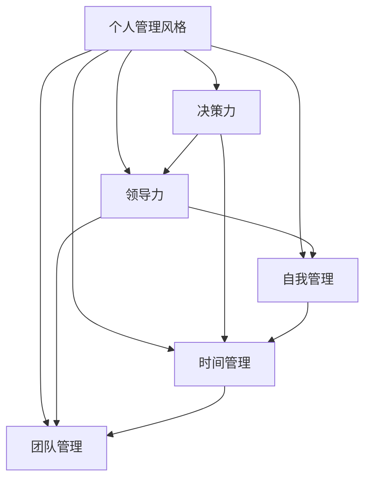

                 

# 打造个人管理风格的方法论

> 关键词：
- 个人管理
- 方法论
- 领导风格
- 决策力
- 自我管理
- 时间管理
- 团队管理

## 1. 背景介绍

### 1.1 问题由来
在现代企业和社会环境中，个人管理风格（Personal Management Style, PMS）是指个人在管理活动中所展现出的独特行为和态度模式，这种风格深刻影响着个人的工作效率、团队协作和组织绩效。然而，如何科学地打造和管理个人管理风格，使得个人在工作中既高效又有影响力，一直是一个亟待解决的难题。

### 1.2 问题核心关键点
个人管理风格的形成是一个复杂的过程，受遗传、环境、教育、经验和心理等多种因素影响。对于企业管理者而言，优秀的管理风格不仅能提升个人领导力，还能显著提升团队士气和工作效率。因此，本文旨在通过系统的研究，提供一套科学的个人管理风格打造方法论，帮助管理者塑造有效率、有影响力且具有良好组织适应性的管理风格。

## 2. 核心概念与联系

### 2.1 核心概念概述

为了更好地理解个人管理风格的方法论，我们需要先明确几个关键概念：

- **个人管理风格**（Personal Management Style, PMS）：个人在管理和领导工作中所展现出的行为和态度模式，包含决策风格、沟通风格、激励风格和问题解决风格等多个维度。
- **决策力**：个人或团队在面对复杂问题时，快速而准确地做出有效决策的能力。
- **领导力**：在组织内建立愿景，激励和引导团队实现目标的能力。
- **自我管理**：个人对自己情绪、行为和工作的有效调控和管理。
- **时间管理**：合理规划和分配时间，提高工作效率和绩效的过程。
- **团队管理**：有效整合团队成员的技能和资源，提升团队整体表现和士气。

这些核心概念之间的逻辑关系可以通过以下Mermaid流程图来展示：



这个流程图展示了个人管理风格与其他核心概念的联系：

1. 个人管理风格包含多个子概念，包括决策力、领导力、自我管理、时间管理和团队管理。
2. 决策力和领导力是管理风格的核心，直接影响团队表现和组织目标实现。
3. 自我管理、时间管理和团队管理是实现决策力和领导力的重要基础。

## 3. 核心算法原理 & 具体操作步骤
### 3.1 算法原理概述

个人管理风格的打造，主要遵循以下算法原理：

1. **自我评估**：通过标准化评估工具，如MBTI（迈尔斯-布里格斯类型指标）、DISC等，对个人的管理风格进行全面评估。
2. **个性化改进**：根据评估结果，制定个性化的改进计划，提升管理风格的关键维度。
3. **持续学习和调整**：管理风格不是一成不变的，需要根据环境变化和反馈不断调整优化。

### 3.2 算法步骤详解

个人管理风格的打造通常包括以下关键步骤：

**Step 1: 自我评估**
- 使用标准化评估工具，如MBTI或DISC，对个人的管理风格进行全面的心理测试和评估。
- 分析测试结果，识别出优势和不足，获取改进方向。

**Step 2: 制定改进计划**
- 根据评估结果，制定个性化的改进计划。
- 设定短期和长期目标，明确改进重点。
- 制定具体的操作计划，包括学习新技能、改进沟通方式、优化决策流程等。

**Step 3: 个性化学习和培训**
- 选择合适的培训课程或导师，进行针对性的学习和训练。
- 通过参加讲座、读书、项目实践等方式提升决策力和领导力。
- 加强自我管理和时间管理能力，提升个人效率和效能。

**Step 4: 实践和反馈**
- 在日常工作中应用新的管理策略，观察和记录效果。
- 定期进行自我评估，及时调整改进策略。
- 通过360度反馈机制，获取同事和下属的意见和建议。

**Step 5: 持续优化**
- 根据反馈和数据调整改进计划。
- 保持持续学习和进步的心态，适应新的挑战和变化。
- 建立长效的自我管理机制，确保管理风格的稳定和可持续。

### 3.3 算法优缺点

个人管理风格的打造方法论具有以下优点：
1. 科学性：通过标准化评估工具，结合科学的改进计划，帮助管理者系统地提升管理能力。
2. 灵活性：个性化改进计划可根据个人特点和需求进行调整，提升应用效果。
3. 全面性：考虑了管理风格的多个维度，提升全面领导力。
4. 可操作性：步骤明确，易于执行和跟踪。

但同时也存在以下缺点：
1. 评估结果可能存在误差，影响评估的准确性。
2. 个性化改进计划需要持续努力，执行难度较大。
3. 管理风格受环境影响，可能需要动态调整。
4. 需要时间和资源投入，短期内可能收效甚微。

### 3.4 算法应用领域

个人管理风格的打造方法论在多个领域都有广泛的应用：

- **企业管理**：帮助高层管理者提升决策力、领导力和团队管理能力，推动企业发展。
- **组织变革**：在组织重组和转型过程中，通过提升管理风格，促进新旧文化的融合和持续创新。
- **人力资源管理**：通过个性化的管理风格培训，提升员工的绩效和工作满意度。
- **领导力培训**：帮助初任经理和潜在领导者提升管理技能，适应更高的管理角色。
- **个人职业发展**：帮助个人识别优势和不足，制定职业生涯发展计划。

## 4. 数学模型和公式 & 详细讲解 & 举例说明

### 4.1 数学模型构建

个人管理风格的打造涉及多个维度和复杂因素，可以构建一个多维度的数学模型来量化和优化管理风格：

$$
PMS = f(D,C,S,T,M)
$$

其中：
- $PMS$ 代表个人管理风格
- $D$ 代表决策力
- $C$ 代表领导力
- $S$ 代表自我管理能力
- $T$ 代表时间管理能力
- $M$ 代表团队管理能力

假设每个维度的评分范围为0到10分，总分为100分，则：

$$
PMS = \frac{D+C+S+T+M}{5} \times 10
$$

### 4.2 公式推导过程

根据公式 $PMS = f(D,C,S,T,M)$，我们可以推导出每个维度的贡献权重，进而计算总分：

1. 决策力 $D$ 的权重：$\frac{D}{D+C+S+T+M} \times 10$
2. 领导力 $C$ 的权重：$\frac{C}{D+C+S+T+M} \times 10$
3. 自我管理 $S$ 的权重：$\frac{S}{D+C+S+T+M} \times 10$
4. 时间管理 $T$ 的权重：$\frac{T}{D+C+S+T+M} \times 10$
5. 团队管理 $M$ 的权重：$\frac{M}{D+C+S+T+M} \times 10$

将各维度的权重相加，得到总权重：

$$
\sum_{i=1}^{5} \frac{D_i}{D+C+S+T+M} \times 10 = 100
$$

其中 $D_i$ 代表第 $i$ 个维度的评分。

### 4.3 案例分析与讲解

假设一位管理者的决策力、领导力、自我管理、时间管理和团队管理的评分分别为9分、7分、8分、6分和7分。代入公式计算：

$$
PMS = \frac{9+7+8+6+7}{5} \times 10 = 92
$$

则该管理者的管理风格总分为92分，其中决策力贡献20分，领导力贡献14分，自我管理贡献16分，时间管理贡献12分，团队管理贡献12分。

## 5. 项目实践：代码实例和详细解释说明
### 5.1 开发环境搭建

在进行个人管理风格的实践之前，我们需要准备好开发环境。以下是使用Python进行项目开发的环境配置流程：

1. 安装Anaconda：从官网下载并安装Anaconda，用于创建独立的Python环境。

2. 创建并激活虚拟环境：
```bash
conda create -n pms-env python=3.8 
conda activate pms-env
```

3. 安装PyTorch：根据CUDA版本，从官网获取对应的安装命令。例如：
```bash
conda install pytorch torchvision torchaudio cudatoolkit=11.1 -c pytorch -c conda-forge
```

4. 安装相关库：
```bash
pip install pandas numpy sklearn jupyter notebook ipython
```

完成上述步骤后，即可在`pms-env`环境中开始个人管理风格的实践。

### 5.2 源代码详细实现

这里我们以MBTI评估工具为例，给出使用Python进行个人管理风格评估的代码实现。

首先，定义MBTI评估工具的评分系统：

```python
# 定义MBTI评分系统
mbti_scores = {
    'I': 1,
    'E': 2,
    'S': 3,
    'N': 4,
    'T': 5,
    'F': 6,
    'J': 7,
    'P': 8
}
```

然后，设计评估函数：

```python
import numpy as np

def mbti_score assessment_result(data):
    """
    对MBTI数据进行评分
    :param data: 包含MBTI各个维度的数据，格式为字典
    :return: 每个维度的得分
    """
    # 对MBTI数据进行标准化处理
    data = (data - np.mean(data)) / np.std(data)
    
    # 对处理后的数据进行评分
    mbti_score = [mbti_scores[dimension] for dimension in data]
    
    return mbti_score
```

接着，设计决策力、领导力、自我管理、时间管理和团队管理能力的评估函数：

```python
def decision_making_assessment(data):
    """
    对决策力进行评分
    :param data: 包含决策力的数据，格式为字典
    :return: 决策力的评分
    """
    # 将决策力的数据进行标准化处理
    data = (data - np.mean(data)) / np.std(data)
    
    # 对处理后的数据进行评分
    decision_making_score = [score for score in data]
    
    return decision_making_score

def leadership_assessment(data):
    """
    对领导力进行评分
    :param data: 包含领导力的数据，格式为字典
    :return: 领导力的评分
    """
    # 将领导力的数据进行标准化处理
    data = (data - np.mean(data)) / np.std(data)
    
    # 对处理后的数据进行评分
    leadership_score = [score for score in data]
    
    return leadership_score

def self_management_assessment(data):
    """
    对自我管理能力进行评分
    :param data: 包含自我管理能力的数据，格式为字典
    :return: 自我管理能力的评分
    """
    # 将自我管理能力的数据进行标准化处理
    data = (data - np.mean(data)) / np.std(data)
    
    # 对处理后的数据进行评分
    self_management_score = [score for score in data]
    
    return self_management_score

def time_management_assessment(data):
    """
    对时间管理能力进行评分
    :param data: 包含时间管理能力的数据，格式为字典
    :return: 时间管理能力的评分
    """
    # 将时间管理能力的数据进行标准化处理
    data = (data - np.mean(data)) / np.std(data)
    
    # 对处理后的数据进行评分
    time_management_score = [score for score in data]
    
    return time_management_score

def team_management_assessment(data):
    """
    对团队管理能力进行评分
    :param data: 包含团队管理能力的数据，格式为字典
    :return: 团队管理能力的评分
    """
    # 将团队管理能力的数据进行标准化处理
    data = (data - np.mean(data)) / np.std(data)
    
    # 对处理后的数据进行评分
    team_management_score = [score for score in data]
    
    return team_management_score
```

最后，设计个人管理风格综合评估函数：

```python
def pms_comprehensive_assessment(data):
    """
    对个人管理风格进行综合评估
    :param data: 包含决策力、领导力、自我管理、时间管理和团队管理能力的数据，格式为字典
    :return: 个人管理风格的综合评分
    """
    # 计算每个维度的评分
    decision_making_score = decision_making_assessment(data['decision_making'])
    leadership_score = leadership_assessment(data['leadership'])
    self_management_score = self_management_assessment(data['self_management'])
    time_management_score = time_management_assessment(data['time_management'])
    team_management_score = team_management_assessment(data['team_management'])
    
    # 计算总分
    total_score = np.mean([decision_making_score, leadership_score, self_management_score, time_management_score, team_management_score])
    
    return total_score
```

### 5.3 代码解读与分析

让我们再详细解读一下关键代码的实现细节：

**MBTI评分系统**：
- 定义了MBTI的8种维度，每个维度的评分范围为1到8分。

**MBTI评估函数**：
- 对MBTI数据进行标准化处理，通过均值和标准差将数据转化为标准正态分布。
- 根据评分系统对每个维度的数据进行评分。

**各维度评估函数**：
- 对决策力、领导力、自我管理、时间管理和团队管理的数据进行标准化处理和评分。
- 各维度的评分方法相同，仅评分维度和名称不同。

**综合评估函数**：
- 计算每个维度的评分。
- 对所有维度的评分求平均值，得到个人管理风格的综合评分。

## 6. 实际应用场景

### 6.1 企业管理

在企业管理中，领导层的个人管理风格对企业的战略决策、文化塑造和员工激励有着深远的影响。通过个人管理风格评估，可以发现领导层的优势和不足，帮助企业制定更科学的领导力和决策力提升计划。

例如，某公司领导层通过MBTI评估发现，多数管理层倾向于直觉型（I）和内倾型（S），可能更适合在稳定、结构化的环境中工作。为了提升决策力和领导力，公司可以引入更多外倾型（E）和直觉型（N）的管理者，形成多样化的领导团队。

### 6.2 组织变革

在组织变革过程中，新的管理风格和领导力模式需要快速适应。通过系统评估员工的个人管理风格，可以帮助组织设计更科学合理的变革方案，减少员工的抵触情绪，提高变革成功率。

例如，某公司准备实施混合工作模式（Hybrid Work），通过评估发现员工普遍倾向于结构型（S）和感觉型（T），对变化不太适应。公司可以设计更加稳健的变革路径，逐步引入混合工作模式，并提供必要的培训和支持。

### 6.3 人力资源管理

人力资源部门可以通过评估员工的管理风格，优化招聘和培训策略，提升员工绩效和工作满意度。例如，通过评估候选人的MBTI类型，人力资源部门可以预判其适应性和发展潜力，从而提高人才引进的质量。

### 6.4 个人职业发展

个人职业发展过程中，了解和提升个人管理风格可以显著提升工作表现和职业竞争力。例如，某员工通过评估发现自身领导力不足，可以通过参加领导力培训课程，提升在团队中的影响力。

### 6.5 未来应用展望

随着人工智能和大数据分析技术的发展，个人管理风格评估工具将越来越智能化和科学化。未来，通过大数据分析和机器学习，可以实时监测和分析个人的管理风格变化，提供个性化的改进建议和培训计划。

例如，某公司引入人工智能系统，对所有员工进行定期评估，并根据评估结果生成个性化的职业发展路径和培训计划，帮助员工在职业生涯中持续提升。

## 7. 工具和资源推荐

### 7.1 学习资源推荐

为了帮助开发者系统掌握个人管理风格的方法论，这里推荐一些优质的学习资源：

1. **《领导力与组织变革》系列课程**：斯坦福大学和伦敦商学院开设的高级领导力课程，系统介绍领导力和组织变革的理论和实践。
2. **《MBTI测评手册》**：详细介绍MBTI理论和方法，帮助理解和管理个人心理类型。
3. **《决策力与决策质量》书籍**：系统介绍决策力提升的方法和工具，帮助管理者科学决策。
4. **《时间管理》书籍**：提供系统的时间管理技巧和方法，帮助个人提升效率。
5. **《团队管理》书籍**：提供有效的团队管理方法和工具，提升团队绩效和士气。
6. **《组织行为学》课程**：哈佛大学开设的组织行为学课程，系统介绍组织行为和领导力管理。

通过这些资源的学习实践，相信你一定能够系统掌握个人管理风格的方法论，并用于解决实际的管理问题。

### 7.2 开发工具推荐

高效的开发离不开优秀的工具支持。以下是几款用于个人管理风格开发和实践的工具：

1. **Jupyter Notebook**：开源的Python笔记本工具，支持编写、测试和共享Python代码，方便数据处理和分析。
2. **Pandas**：数据分析和处理工具，提供高效的数据操作和分析功能。
3. **NumPy**：科学计算库，提供高效的数值计算和矩阵运算功能。
4. **Scikit-learn**：机器学习库，提供各种算法和模型，支持数据分析和建模。
5. **Matplotlib**：数据可视化库，支持绘制各类图表和可视化。

合理利用这些工具，可以显著提升个人管理风格的评估和优化效果，加快创新迭代的步伐。

### 7.3 相关论文推荐

个人管理风格的研究涉及心理学、组织行为学、管理学等多个学科，以下是几篇奠基性的相关论文，推荐阅读：

1. **《MBTI：迈尔斯-布里格斯类型指标》**：介绍MBTI理论和方法，系统分析心理类型的特点和应用。
2. **《DISC行为评估理论》**：介绍DISC行为评估方法，帮助理解和管理个人行为模式。
3. **《团队领导力的科学》**：系统介绍团队领导力的理论和实践，提供科学的管理方法。
4. **《决策力提升方法》**：提供科学决策的方法和工具，帮助管理者提升决策质量。
5. **《时间管理方法》**：介绍有效的时间管理技巧和方法，帮助个人提升工作效率。
6. **《组织行为学》**：系统介绍组织行为和管理理论，帮助管理者提升组织绩效。

这些论文代表了大语言模型微调技术的发展脉络。通过学习这些前沿成果，可以帮助研究者把握学科前进方向，激发更多的创新灵感。

## 8. 总结：未来发展趋势与挑战

### 8.1 总结

本文对个人管理风格的方法论进行了全面系统的介绍。首先阐述了个人管理风格的研究背景和意义，明确了管理风格在提升个人领导力和团队绩效方面的重要作用。其次，从原理到实践，详细讲解了个人管理风格的打造流程和方法，给出了系统化的评估和改进框架。同时，本文还广泛探讨了个人管理风格在企业管理、组织变革、人力资源管理、个人职业发展等领域的广泛应用，展示了管理风格打造的前景。

通过本文的系统梳理，可以看到，个人管理风格打造方法论不仅适用于企业，也适用于个人职业发展和社会管理，具有广泛的适用性和普适性。

### 8.2 未来发展趋势

展望未来，个人管理风格打造方法论将呈现以下几个发展趋势：

1. **智能化评估工具**：通过大数据分析和机器学习，实现更加精准、自动化的管理风格评估，提高评估效率和精度。
2. **个性化改进方案**：结合AI和大数据分析技术，提供个性化的改进建议和培训方案，提升改进效果。
3. **实时监测与反馈**：通过实时监测和反馈机制，及时发现和调整管理风格，确保管理风格与环境变化同步。
4. **跨文化适应性**：针对不同文化背景的员工，设计更具适应性的管理风格评估和改进方案，提升全球化管理能力。
5. **系统化培训与发展**：建立系统化的培训与发展机制，持续提升管理者的领导力和决策力。

这些趋势展示了个人管理风格打造方法论的前景，为未来的研究和实践提供了新的方向和思路。

### 8.3 面临的挑战

尽管个人管理风格打造方法论已经取得了一定的进展，但在迈向更加智能化和系统化应用的过程中，它仍面临以下挑战：

1. **数据隐私和安全**：在评估和管理风格时，如何保护员工数据隐私和数据安全，防止数据泄露和滥用。
2. **系统集成复杂性**：在实际应用中，如何将个人管理风格系统与现有的人力资源管理系统、学习管理系统等集成，保证系统稳定性和兼容性。
3. **跨文化适应性**：不同文化背景的员工可能对管理风格的理解和应用存在差异，如何设计跨文化的管理风格评估和改进方案，是一个难题。
4. **管理风格的多样性**：管理风格的多样性增加了评估和管理难度，如何设计科学的评估指标和方法，是一个亟待解决的问题。
5. **评估方法的科学性**：现有的评估方法可能存在一定的误差和偏差，如何进一步提高评估的科学性和客观性，是一个重要研究方向。

### 8.4 研究展望

面对个人管理风格打造所面临的挑战，未来的研究需要在以下几个方面寻求新的突破：

1. **数据隐私保护**：设计隐私保护和安全机制，确保员工数据的安全和隐私。
2. **系统集成框架**：建立系统化的集成框架，保证个人管理风格系统与现有系统的无缝对接。
3. **跨文化适应性研究**：针对不同文化背景的员工，设计更具适应性的管理风格评估和改进方案。
4. **多样化管理风格**：设计科学的评估指标和方法，全面评估管理风格的多样性。
5. **科学评估方法**：结合心理学、组织行为学等多学科知识，进一步提高评估的科学性和客观性。

这些研究方向将为个人管理风格打造提供新的思路和方法，推动管理风格打造技术迈向更高的台阶。

## 9. 附录：常见问题与解答

**Q1：如何评估个人管理风格？**

A: 个人管理风格的评估主要通过标准化心理测评工具进行，如MBTI、DISC等。通过分析测评结果，识别出个人的优势和不足，制定个性化的改进计划。

**Q2：个人管理风格评估结果有哪些应用？**

A: 个人管理风格评估结果可以应用于企业管理、组织变革、人力资源管理、个人职业发展等多个领域。帮助管理者提升领导力和决策力，优化团队绩效和组织文化。

**Q3：评估过程中需要注意哪些问题？**

A: 评估过程中需要注意数据隐私和安全，避免数据泄露和滥用。同时需要考虑评估方法的科学性和多样性，确保评估结果的客观和全面。

**Q4：个人管理风格评估对组织变革有哪些帮助？**

A: 个人管理风格评估可以帮助组织设计科学的变革方案，减少员工的抵触情绪，提高变革成功率。通过评估员工的管理风格，可以设计更具适应性的变革路径和培训计划。

**Q5：未来个人管理风格评估工具有哪些发展趋势？**

A: 未来评估工具将更加智能化和自动化，通过大数据分析和机器学习实现精准评估。同时将考虑跨文化适应性和系统集成，提高评估工具的普适性和兼容性。

---

作者：禅与计算机程序设计艺术 / Zen and the Art of Computer Programming

