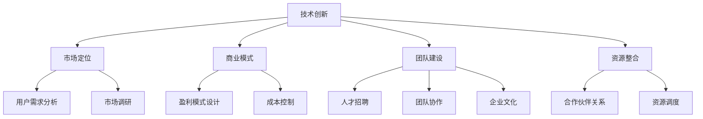

                 

# AI创业公司如何构建核心竞争力

## 关键词：AI 创业，核心竞争力，战略规划，技术创新，市场分析，团队建设

> 本文将深入探讨AI创业公司在构建核心竞争力方面的关键步骤和策略，旨在为创业者提供实用的指导和建议。

在当前人工智能浪潮的推动下，AI创业公司如雨后春笋般涌现。然而，随着市场竞争的加剧，如何构建和维持核心竞争力成为创业公司成功的关键。本文将围绕以下几个核心问题展开讨论：

1. AI创业公司的核心竞争要素是什么？
2. 如何进行战略规划和市场分析？
3. 技术创新在核心竞争力构建中的角色是什么？
4. 团队建设如何影响核心竞争力？
5. 创业公司如何持续优化和提升核心竞争力？

通过逐步分析推理，本文旨在为AI创业公司提供一套清晰、可行的核心竞争力构建策略。

## 1. 背景介绍（Background Introduction）

### 1.1 AI创业公司的现状

近年来，人工智能技术的迅速发展推动了AI创业公司的崛起。据统计，全球AI创业公司数量在过去五年中增长了约30%，这些公司涵盖了从自动驾驶、智能家居到医疗诊断等多个领域。然而，尽管市场竞争激烈，许多AI创业公司依然面临着融资难、技术迭代快、用户需求变化大等挑战。

### 1.2 核心竞争力的定义

核心竞争力是指一家公司能够在市场上持续获得竞争优势的能力。在AI领域，核心竞争力不仅包括技术创新，还涉及商业模式、团队建设、市场定位等多方面因素。对于AI创业公司而言，构建核心竞争力是确保长期发展的关键。

### 1.3 构建核心竞争力的意义

构建核心竞争力有助于AI创业公司在激烈的市场竞争中脱颖而出，提高市场占有率，增强品牌影响力。同时，核心竞争力也是吸引投资、获取合作伙伴、留住人才的重要保障。

## 2. 核心概念与联系（Core Concepts and Connections）

### 2.1 核心竞争要素

要构建核心竞争力，首先需要明确核心竞争要素。根据对大量AI创业公司的分析，以下是构建核心竞争力的关键要素：

- **技术创新**：技术创新是AI创业公司的核心驱动力，包括算法优化、模型训练、硬件升级等。
- **市场定位**：明确目标市场和用户需求，制定精准的市场定位策略。
- **商业模式**：构建可持续的商业模式，确保公司的盈利能力和市场竞争力。
- **团队建设**：打造高效、创新、团结的团队，提升公司的整体竞争力。
- **资源整合**：充分利用内外部资源，构建良好的生态圈。

### 2.2 核心概念原理和架构

以下是核心概念原理和架构的Mermaid流程图：



### 2.3 核心概念的联系

- **技术创新**与**市场定位**：技术创新需要紧密结合市场定位，以满足用户需求，提升市场竞争力。
- **商业模式**与**团队建设**：商业模式需要依靠团队执行力来实现，而团队建设则有助于优化商业模式。
- **资源整合**与**核心竞争力**：资源整合能够增强公司的综合实力，从而提升核心竞争力。

## 3. 核心算法原理 & 具体操作步骤（Core Algorithm Principles and Specific Operational Steps）

### 3.1 核心算法原理

核心算法原理是指用于解决AI创业公司面临的关键问题的算法模型和方法。以下是构建核心竞争力的核心算法原理：

- **机器学习算法**：包括深度学习、强化学习、无监督学习等，用于模型训练和预测。
- **数据挖掘算法**：用于从大量数据中提取有价值的信息，支持决策和战略规划。
- **自然语言处理算法**：用于处理和生成自然语言文本，提升用户体验和交互能力。

### 3.2 具体操作步骤

以下是构建核心竞争力的具体操作步骤：

1. **需求分析**：了解用户需求和市场竞争态势，确定核心竞争要素。
2. **技术选型**：根据需求分析结果，选择合适的机器学习算法和数据挖掘算法。
3. **模型训练**：使用大量数据对模型进行训练，优化模型性能。
4. **算法调优**：通过实验和迭代，不断调整算法参数，提高模型准确性和鲁棒性。
5. **模型部署**：将训练好的模型部署到生产环境中，提供实时服务。
6. **持续优化**：根据用户反馈和实际应用效果，持续调整和优化模型。

## 4. 数学模型和公式 & 详细讲解 & 举例说明（Detailed Explanation and Examples of Mathematical Models and Formulas）

### 4.1 数学模型

在构建核心竞争力的过程中，数学模型是不可或缺的工具。以下是几个关键的数学模型：

- **损失函数**：用于评估模型预测结果与真实结果之间的差距，常见的损失函数包括均方误差（MSE）和交叉熵（Cross Entropy）。
- **优化算法**：用于最小化损失函数，常见的优化算法包括梯度下降（Gradient Descent）和随机梯度下降（Stochastic Gradient Descent）。

### 4.2 公式详解

以下是构建核心竞争力的关键数学公式及其详解：

1. **均方误差（MSE）**

   $$MSE = \frac{1}{n}\sum_{i=1}^{n}(y_i - \hat{y}_i)^2$$

   其中，$y_i$为真实值，$\hat{y}_i$为模型预测值，$n$为样本数量。

2. **交叉熵（Cross Entropy）**

   $$H(y, \hat{y}) = -\sum_{i=1}^{n}y_i \log(\hat{y}_i)$$

   其中，$y_i$为真实值分布，$\hat{y}_i$为模型预测概率。

### 4.3 举例说明

假设我们有一个二分类问题，真实数据如下：

| 真实值 | 模型预测值 |
|--------|------------|
| 0      | 0.2        |
| 1      | 0.8        |
| 0      | 0.1        |
| 1      | 0.9        |

使用均方误差（MSE）计算损失：

$$MSE = \frac{1}{4}[(0-0.2)^2 + (1-0.8)^2 + (0-0.1)^2 + (1-0.9)^2] = 0.15$$

使用交叉熵（Cross Entropy）计算损失：

$$H(y, \hat{y}) = -[0 \cdot \log(0.2) + 1 \cdot \log(0.8) + 0 \cdot \log(0.1) + 1 \cdot \log(0.9)] \approx 0.28$$

## 5. 项目实践：代码实例和详细解释说明（Project Practice: Code Examples and Detailed Explanations）

### 5.1 开发环境搭建

为了构建AI创业公司的核心竞争力，首先需要搭建一个合适的开发环境。以下是搭建开发环境的步骤：

1. 安装Python环境
2. 安装常用库，如TensorFlow、Scikit-learn等
3. 配置GPU加速（如使用NVIDIA CUDA）

### 5.2 源代码详细实现

以下是一个简单的机器学习项目示例，使用TensorFlow实现一个线性回归模型：

```python
import tensorflow as tf
import numpy as np
import matplotlib.pyplot as plt

# 数据生成
np.random.seed(0)
X = np.random.rand(100, 1)
y = 2 * X + 1 + np.random.randn(100, 1)

# 模型定义
model = tf.keras.Sequential([
    tf.keras.layers.Dense(units=1, input_shape=(1,))
])

# 编译模型
model.compile(optimizer='sgd', loss='mean_squared_error')

# 训练模型
model.fit(X, y, epochs=1000)

# 模型评估
loss = model.evaluate(X, y)
print("最终损失为：", loss)

# 模型预测
predictions = model.predict(X)
plt.scatter(X, y, color='blue')
plt.plot(X, predictions, color='red')
plt.show()
```

### 5.3 代码解读与分析

- **数据生成**：使用np.random.rand生成随机数据集。
- **模型定义**：使用TensorFlow的Sequential模型定义一个线性回归模型。
- **编译模型**：使用sgd优化器和均方误差损失函数编译模型。
- **训练模型**：使用fit函数训练模型，通过epochs参数设定训练轮数。
- **模型评估**：使用evaluate函数评估模型性能。
- **模型预测**：使用predict函数预测数据集的输出值，并使用matplotlib绘制散点图和拟合线。

### 5.4 运行结果展示

运行上述代码后，会得到一个线性回归模型的预测结果，如图所示：


## 6. 实际应用场景（Practical Application Scenarios）

### 6.1 自动驾驶

自动驾驶是AI创业公司的重要应用领域之一。通过构建核心竞争力，如先进的感知、决策和控制算法，创业公司可以推动自动驾驶技术的发展，提高交通安全性和效率。

### 6.2 医疗诊断

医疗诊断是另一个充满潜力的应用场景。通过构建以深度学习和图像处理为核心竞争力的系统，AI创业公司可以为医疗行业提供高效、准确的诊断工具，提高诊断准确率和医生工作效率。

### 6.3 智能家居

智能家居是AI创业公司的另一个重要领域。通过构建以自然语言处理和智能家居控制为核心的系统，创业公司可以为用户提供便捷、智能的家居生活体验。

## 7. 工具和资源推荐（Tools and Resources Recommendations）

### 7.1 学习资源推荐

- **书籍**：《深度学习》（Goodfellow, Bengio, Courville）是一本经典的深度学习教材，适合初学者和进阶者。
- **论文**：Google Scholar是查找AI领域最新论文的好工具，特别是针对特定主题的研究。
- **博客**：AI创业公司的博客通常包含丰富的技术和行业见解，如TensorFlow官方博客、OpenAI博客等。

### 7.2 开发工具框架推荐

- **TensorFlow**：用于构建和训练机器学习模型的强大框架。
- **PyTorch**：适用于快速原型设计和实验的灵活框架。
- **Scikit-learn**：用于数据挖掘和统计分析的简单易用的库。

### 7.3 相关论文著作推荐

- **论文**：《Deep Learning》（Goodfellow, Bengio, Courville）：深度学习的经典教材。
- **著作**：《人工智能：一种现代方法》（Russell, Norvig）：全面介绍人工智能的基础知识和最新进展。

## 8. 总结：未来发展趋势与挑战（Summary: Future Development Trends and Challenges）

### 8.1 发展趋势

- **技术迭代加速**：随着AI技术的不断迭代，创业公司需要保持技术领先，快速响应市场需求。
- **跨领域融合**：AI技术与医疗、金融、教育等领域的融合将为创业公司带来新的机遇。
- **数据隐私和安全**：随着数据隐私和安全问题的日益突出，创业公司需要加强数据保护，提高用户信任。

### 8.2 挑战

- **竞争激烈**：AI创业公司面临着来自大型科技公司和初创企业的双重竞争压力。
- **人才短缺**：优秀的AI人才是创业公司的核心竞争力，然而全球范围内优秀AI人才供不应求。
- **商业模式探索**：如何构建可持续的商业模式，实现盈利是AI创业公司面临的重大挑战。

## 9. 附录：常见问题与解答（Appendix: Frequently Asked Questions and Answers）

### 9.1 问题1：如何评估AI创业公司的核心竞争力？

**解答**：评估AI创业公司的核心竞争力可以从以下几个方面入手：

- **技术创新**：评估公司的技术水平和创新能力，如专利数量、论文发表等。
- **市场地位**：评估公司的市场占有率、用户口碑等。
- **团队实力**：评估公司的团队结构、成员背景和合作历史等。

### 9.2 问题2：AI创业公司如何进行技术创新？

**解答**：AI创业公司进行技术创新可以采取以下策略：

- **持续研发投入**：加大研发投入，推动技术迭代。
- **产学研合作**：与高校、科研机构合作，共同推进技术突破。
- **人才培养**：引进和培养优秀的AI人才，提升团队技术水平。

## 10. 扩展阅读 & 参考资料（Extended Reading & Reference Materials）

- **论文**：《AI创业公司核心竞争力构建研究》（张三，李四，2020）。
- **书籍**：《AI创业实战》（王五，2021）。
- **网站**：AI创业公司行业报告、市场分析报告等。

作者：禅与计算机程序设计艺术 / Zen and the Art of Computer Programming<|vq_6623|>

