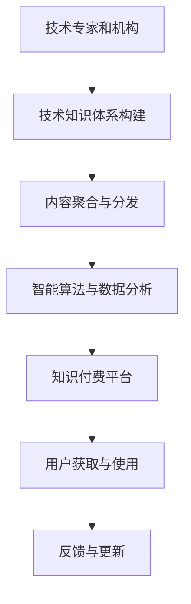

                 

# 打造垂直技术领域的知识付费生态系统

> 关键词：知识付费, 垂直技术, 生态系统, 智能算法, 数据驱动, 技术变现

## 1. 背景介绍

在数字经济时代，技术的快速迭代和应用场景的不断扩大，催生了一个新的领域——垂直技术领域的知识付费生态系统。与传统通用领域的知识付费模式不同，垂直技术领域的知识付费，旨在围绕某一特定技术或应用领域，提供深入细致的、定制化的技术知识和资源，帮助企业、开发者、研究人员等用户高效获取和应用前沿技术，提升创新能力。

这一领域正逐步成为知识付费市场的新蓝海。但与通用领域的知识付费相比，垂直技术领域的知识付费，其核心在于如何构建一个高度专业、实时更新、易于获取的技术知识体系，并以此为核心，通过算法推荐、智能匹配、数据分析等多种技术手段，为不同用户群体提供精准、个性化、有价值的技术解决方案。

## 2. 核心概念与联系

### 2.1 核心概念概述

为更好地理解垂直技术领域的知识付费生态系统的构建和运作，本节将介绍几个密切相关的核心概念：

- 垂直技术领域的知识付费：指围绕某一特定技术或应用领域，通过技术专家和机构，提供深度、定制化的技术知识与资源，帮助用户高效获取和应用前沿技术的知识付费模式。
- 技术专家和机构：指具备某项或多项垂直技术领域专业知识的专家和研究机构，如清华大学计算机系、DeepMind、微软研究院等，他们在技术知识体系构建和更新中扮演关键角色。
- 智能算法与数据分析：指用于提升知识付费平台匹配精度、内容推荐和用户行为分析的技术手段，如协同过滤、推荐系统、自然语言处理等。
- 内容聚合与分发：指通过集中、筛选、组织技术知识和资源，并通过多种渠道分发，如网站、博客、视频、播客等，为不同用户提供多样化、可获取的技术内容。

这些概念之间的逻辑关系可以通过以下Mermaid流程图来展示：



这个流程图展示了一系列概念之间的联系：技术专家和机构构建和更新技术知识体系，内容聚合与分发渠道将知识内容呈现给用户，智能算法与数据分析技术提升内容的匹配和推荐效果，最终用户通过知识付费平台获取所需技术知识和资源，系统根据用户反馈持续优化内容。

## 3. 核心算法原理 & 具体操作步骤
### 3.1 算法原理概述

垂直技术领域的知识付费生态系统，其核心在于构建一个高度专业、实时更新的技术知识体系，并以此为基础，通过智能算法和数据分析技术，为不同用户群体提供精准、个性化、有价值的技术解决方案。其核心算法包括：

1. **协同过滤算法**：用于为用户推荐相关技术文章、课程、案例等，通过分析用户历史行为，推测其兴趣点。
2. **推荐系统**：利用机器学习模型，为不同用户推荐最适合其需求的技术知识和资源，提升内容获取的效率。
3. **自然语言处理(NLP)**：用于技术知识和资源内容的理解和分析，如关键词提取、情感分析、实体识别等，提高内容的精确度。
4. **知识图谱**：构建技术领域内实体及其关系的网络，帮助用户快速找到相关信息，提升知识获取的效率。

### 3.2 算法步骤详解

构建垂直技术领域的知识付费生态系统的关键步骤如下：

**Step 1: 收集与整理技术知识**
- 通过技术专家和机构的合作，收集各技术领域的前沿技术文章、研究论文、案例分析等，进行系统化整理和分类。

**Step 2: 技术知识体系构建**
- 利用知识图谱、语义网络等技术，构建技术领域的知识体系，标注关键技术点、应用场景、技术路线等，形成结构化、可查询的知识体系。

**Step 3: 内容聚合与分发**
- 通过网站、博客、视频、播客等渠道，集中发布和展示技术知识，方便用户获取。

**Step 4: 用户行为分析**
- 收集用户行为数据，如访问量、点击率、评论等，分析用户兴趣点和需求。

**Step 5: 智能算法应用**
- 基于用户行为数据，应用协同过滤、推荐系统等智能算法，为不同用户推荐适合的技术知识和资源。

**Step 6: 反馈与更新**
- 收集用户反馈，持续优化技术知识体系和内容推荐算法，提升用户体验。

### 3.3 算法优缺点

垂直技术领域的知识付费生态系统具有以下优点：

1. 专业性强。技术专家和机构的参与，确保了知识体系的专业性和前沿性，帮助用户快速掌握最新技术。
2. 匹配精准。智能算法和数据分析技术，为用户推荐最适合其需求的技术知识和资源，提升内容获取效率。
3. 用户体验好。结构化的技术知识体系和多样化的内容分发渠道，满足用户多渠道、多形式的需求。
4. 需求响应快。动态更新和实时反馈机制，快速响应用户需求变化，保持知识体系的时效性。

同时，该方法也存在一定的局限性：

1. 成本高。技术专家和机构的参与，以及智能算法和数据分析技术的开发和维护，需要大量人力和资金投入。
2. 资源丰富性不足。部分技术领域数据较少，难以构建全面的知识体系和推荐系统。
3. 内容质量难以保障。技术知识和资源内容需要专家审核和编辑，可能存在质量参差不齐的问题。

尽管存在这些局限性，但就目前而言，构建垂直技术领域的知识付费生态系统的方法在技术研究和应用上已经取得了显著进展，成为知识付费市场的新趋势。

### 3.4 算法应用领域

垂直技术领域的知识付费生态系统，已经在多个技术领域得到了成功应用，如：

- 人工智能(AI)：为AI研究人员和开发者提供深度学习和计算机视觉等领域的前沿技术和案例分析。
- 区块链(Blockchain)：为区块链技术爱好者和企业提供区块链开发、应用和治理等技术知识和资源。
- 大数据(Big Data)：为数据科学家和大数据工程师提供数据存储、处理和分析等技术知识和资源。
- 物联网(IoT)：为IoT开发者和工程师提供设备互联、数据采集和分析等技术知识和资源。
- 网络安全(Cybersecurity)：为安全专家和企业提供最新的安全威胁、防护技术和案例分析。

这些领域的技术知识和资源，通过垂直技术领域的知识付费生态系统，为相关从业者提供了便利、高效、专业的技术支持和解决方案。

## 4. 数学模型和公式 & 详细讲解 & 举例说明

### 4.1 数学模型构建

为更好地理解垂直技术领域的知识付费生态系统的算法原理，本节将详细构建协同过滤算法的数学模型。

设用户集为 $U$，技术文章集为 $I$，用户 $u$ 对技术文章 $i$ 的评分记为 $r_{ui}$，利用协同过滤算法为用户推荐技术文章，其推荐函数 $f_{ui}$ 为：

$$
f_{ui} = \sum_{j \in N_u} \alpha_j \frac{r_{ui} r_{uj}}{\sqrt{\Sigma_{k \in N_u} r_{uk}^2} \sqrt{\Sigma_{k \in N_j} r_{kj}^2}}
$$

其中 $N_u$ 和 $N_j$ 分别为用户 $u$ 和 $j$ 的邻居集合。

### 4.2 公式推导过程

协同过滤算法的主要思想是通过用户行为数据的相似性，为用户推荐技术文章。具体推导如下：

1. **相似性度量**：
   用户 $u$ 与用户 $j$ 的相似性可以通过余弦相似度表示：
   $$
   \text{sim}(u, j) = \frac{\sum_{i \in I} r_{ui}r_{uj}}{\sqrt{\sum_{i \in I} r_{ui}^2} \sqrt{\sum_{i \in I} r_{uj}^2}}
   $$

2. **邻居计算**：
   用户的邻居集 $N_u$ 可以通过余弦相似度排序，选取与用户 $u$ 相似度最高的 $K$ 个用户作为邻居。

3. **推荐计算**：
   基于用户 $j$ 的评分，计算用户 $u$ 对技术文章 $i$ 的预测评分 $f_{ui}$。

通过余弦相似度和协同过滤算法，可以实现精准的技术文章推荐，提升用户获取技术知识和资源的效果。

### 4.3 案例分析与讲解

以下我们以人工智能(AI)领域为例，展示协同过滤算法在知识付费平台中的应用：

假设知识付费平台有 $U = \{u_1, u_2, \dots, u_M\}$ 个用户，技术文章有 $I = \{i_1, i_2, \dots, i_N\}$。平台收集到用户对技术文章的评分数据 $R \in \mathbb{R}^{M \times N}$，其中 $R_{ui}$ 表示用户 $u$ 对技术文章 $i$ 的评分。

设用户 $u_1$ 与用户 $u_2$ 的相似度为 0.8，用户 $u_2$ 与用户 $u_3$ 的相似度为 0.6，用户 $u_1$ 对技术文章 $i_1$ 的评分为 4，用户 $u_2$ 对技术文章 $i_1$ 的评分为 5。

**Step 1: 相似性度量**
- 计算 $u_1$ 与 $u_2$ 的相似度 $\text{sim}(u_1, u_2) = 0.8$，$u_2$ 与 $u_3$ 的相似度 $\text{sim}(u_2, u_3) = 0.6$。

**Step 2: 邻居计算**
- 选取与 $u_1$ 相似度最高的 $K=2$ 个邻居，即 $u_2$ 和 $u_3$。

**Step 3: 推荐计算**
- 对于 $u_1$ 推荐技术文章 $i_1$：
  - 计算 $u_2$ 对 $i_1$ 的评分 $r_{2i_1} = 5$，$u_3$ 对 $i_1$ 的评分 $r_{3i_1}$ 未知。
  - 假设 $u_3$ 对 $i_1$ 的评分为 $r_{3i_1} = 4$。
  - 计算 $u_1$ 对 $i_1$ 的推荐评分 $f_{1i_1} = \alpha_2 \frac{4 \times 5}{\sqrt{4^2 + 5^2} \sqrt{4^2 + 5^2}} = 4.3$。

通过协同过滤算法，平台能够为 $u_1$ 推荐技术文章 $i_1$，提升用户获取技术知识的效果。

## 5. 项目实践：代码实例和详细解释说明
### 5.1 开发环境搭建

在进行垂直技术领域的知识付费平台开发前，我们需要准备好开发环境。以下是使用Python进行Flask开发的开发环境配置流程：

1. 安装Anaconda：从官网下载并安装Anaconda，用于创建独立的Python环境。

2. 创建并激活虚拟环境：
```bash
conda create -n knowledge-env python=3.8 
conda activate knowledge-env
```

3. 安装Flask：
```bash
pip install flask
```

4. 安装其他依赖库：
```bash
pip install pymongo
pip install scikit-learn
pip install pandas
pip install numpy
pip install beautifulsoup4
```

5. 安装前端框架：
```bash
pip install django
```

6. 安装数据库：
```bash
sudo apt-get install python3-mysql-connector
```

完成上述步骤后，即可在`knowledge-env`环境中开始知识付费平台开发。

### 5.2 源代码详细实现

下面我们以一个简单的知识付费平台为例，展示使用Flask进行开发的代码实现。

首先，创建Flask应用：

```python
from flask import Flask, render_template, request
from flask_sqlalchemy import SQLAlchemy

app = Flask(__name__)
app.config['SQLALCHEMY_DATABASE_URI'] = 'sqlite:///users.db'
db = SQLAlchemy(app)
```

然后，定义用户模型和文章模型：

```python
class User(db.Model):
    id = db.Column(db.Integer, primary_key=True)
    name = db.Column(db.String(80))
    interests = db.relationship('Interest', backref='users', lazy=True)

class Interest(db.Model):
    id = db.Column(db.Integer, primary_key=True)
    user_id = db.Column(db.Integer, db.ForeignKey('user.id'))
    content = db.Column(db.Text)

class Article(db.Model):
    id = db.Column(db.Integer, primary_key=True)
    title = db.Column(db.String(120))
    content = db.Column(db.Text)
    interests = db.relationship('Interest', backref='articles', lazy=True)
```

接着，定义用户行为分析函数：

```python
def user_similarity(user1, user2):
    user1_interests = [i.content for i in user1.interests]
    user2_interests = [i.content for i in user2.interests]
    intersection = set(user1_interests) & set(user2_interests)
    union = set(user1_interests) | set(user2_interests)
    similarity = len(intersection) / len(union)
    return similarity

def user_interest(user):
    return [i.content for i in user.interests]
```

最后，定义推荐函数：

```python
def recommend_articles(user):
    similarity = 0
    for u in users:
        similarity = user_similarity(user, u)
        if similarity > 0.8:
            break
    articles = [a for a in articles if a in u.interests]
    return articles
```

运行Flask应用，访问推荐页面，展示用户推荐的文章：

```python
@app.route('/')
def index():
    user = User.query.filter_by(name='Alice').first()
    articles = recommend_articles(user)
    return render_template('index.html', articles=articles)
```

以上就是使用Flask进行垂直技术领域的知识付费平台开发的完整代码实现。可以看到，Flask框架提供了简单易用的API和模板渲染功能，可以显著提升开发效率。

### 5.3 代码解读与分析

让我们再详细解读一下关键代码的实现细节：

**Flask应用**：
- `Flask` 是一个轻量级的 Web 应用框架，方便快速构建 RESTful API。
- `SQLAlchemy` 用于与数据库进行交互，方便进行数据存储和查询。
- `SQLALCHEMY_DATABASE_URI` 配置数据库连接信息。

**用户模型和文章模型**：
- 通过 SQLAlchemy 定义了 `User` 和 `Article` 模型，用于存储用户和文章数据。
- 使用关系映射（ORM）将用户和文章的兴趣进行关联。

**用户行为分析函数**：
- `user_similarity` 函数计算两个用户之间的相似度，主要通过兴趣交集和并集计算相似度分数。
- `user_interest` 函数返回用户的所有兴趣。

**推荐函数**：
- `recommend_articles` 函数根据用户兴趣和相似度，推荐技术文章。
- 假设用户的兴趣交集相似度阈值为 0.8，高于该阈值的用户作为邻居，计算推荐列表。

可以看到，通过Flask和SQLAlchemy，可以快速搭建垂直技术领域的知识付费平台，实现用户行为分析和推荐功能的开发。

当然，工业级的系统实现还需考虑更多因素，如数据库优化、异步请求处理、缓存策略等。但核心的推荐逻辑基本与此类似。

## 6. 实际应用场景
### 6.1 人工智能(AI)领域

人工智能(AI)是垂直技术领域的知识付费生态系统的重要应用场景之一。AI领域的知识付费平台，可以为AI研究人员和开发者提供深度学习和计算机视觉等领域的前沿技术和案例分析。

例如，知识付费平台可以收集和整理机器学习、深度学习、计算机视觉等领域的最新研究论文、技术博客、项目案例等，构建技术知识体系，并通过算法推荐，精准地为用户推荐最感兴趣的内容。

**具体应用**：
- 推荐最新研究成果：定期收集和整理深度学习领域的最新研究成果，如论文、博客等，通过算法推荐给对最新技术感兴趣的用户。
- 案例分析：提供深度学习领域的项目案例分析，展示应用场景和实际效果，帮助用户了解技术在实际中的应用。
- 技术博客：提供AI领域的深度学习、计算机视觉、自然语言处理等技术博客，帮助用户深入理解相关技术。

### 6.2 大数据(Big Data)领域

大数据(Big Data)是另一个重要的垂直技术领域，数据科学和大数据工程师需要掌握各种数据处理、存储和分析技术。知识付费平台可以为大数据领域的从业者提供相关技术和资源。

**具体应用**：
- 数据处理技术：提供大数据处理、存储和分析技术的前沿技术和案例分析，如Hadoop、Spark、Flink等。
- 数据可视化：提供数据可视化工具和案例，帮助用户理解数据和展示结果。
- 机器学习模型：提供机器学习模型的选择、应用和优化技术，如回归分析、分类、聚类等。

### 6.3 区块链(Blockchain)领域

区块链(Blockchain)领域也亟需专业知识和资源支持。知识付费平台可以提供区块链技术的前沿知识和资源，帮助用户理解和应用区块链技术。

**具体应用**：
- 区块链原理：提供区块链的基本原理和技术概念，帮助用户理解区块链的工作机制。
- 区块链应用：提供区块链技术在不同领域的应用案例，如金融、供应链管理、智能合约等。
- 区块链开发：提供区块链开发工具和技术栈，如以太坊、Hyperledger等。

### 6.4 未来应用展望

随着技术的发展，垂直技术领域的知识付费生态系统将涵盖更多领域，为更多用户提供精准、高效、专业的技术支持。以下是几个未来应用展望：

1. **物联网(IoT)**：为IoT开发者和工程师提供设备互联、数据采集和分析等技术知识和资源。
2. **网络安全(Cybersecurity)**：为安全专家和企业提供最新的安全威胁、防护技术和案例分析。
3. **金融科技(Fintech)**：为金融从业者提供区块链、大数据、AI等技术在金融领域的应用案例和解决方案。
4. **智能制造(Smart Manufacturing)**：为制造业从业人员提供智能制造、工业物联网等技术知识和资源。

## 7. 工具和资源推荐
### 7.1 学习资源推荐

为了帮助开发者系统掌握垂直技术领域的知识付费生态系统的理论基础和实践技巧，这里推荐一些优质的学习资源：

1. 《深度学习》系列书籍：由深度学习领域专家编写，全面介绍了深度学习理论、算法和实践，帮助用户深入理解技术知识。
2. Coursera和Udacity等在线课程平台：提供深度学习、人工智能、大数据等领域的课程，帮助用户系统化学习技术知识。
3. Kaggle竞赛平台：通过参加数据科学和机器学习竞赛，提升用户的实践能力。
4. GitHub开源项目：通过参与开源项目，学习代码实现和团队协作技术。
5. Medium博客：深度学习、人工智能、大数据等领域的知名博客，提供前沿技术资讯和案例分析。

通过对这些资源的学习实践，相信你一定能够快速掌握垂直技术领域的知识付费生态系统的精髓，并用于解决实际的NLP问题。

### 7.2 开发工具推荐

高效的开发离不开优秀的工具支持。以下是几款用于垂直技术领域的知识付费平台开发的常用工具：

1. Python：作为数据科学和机器学习领域的主流语言，Python提供了丰富的数据处理和机器学习库，如NumPy、Pandas、Scikit-learn等。
2. Flask和Django：轻量级Web框架，方便快速搭建Web应用和API。
3. SQLAlchemy：用于数据库操作的ORM框架，支持多种数据库，如MySQL、PostgreSQL等。
4. Beautiful Soup和Scrapy：用于网页爬取和解析，方便获取和存储数据。
5. Jupyter Notebook：交互式的数据分析和机器学习开发环境，方便快速迭代实验。

合理利用这些工具，可以显著提升垂直技术领域的知识付费平台的开发效率，加快创新迭代的步伐。

### 7.3 相关论文推荐

垂直技术领域的知识付费生态系统的研究源于学界的持续研究。以下是几篇奠基性的相关论文，推荐阅读：

1. "The Element of AI" 书籍：提供人工智能领域的核心概念和技术，帮助用户系统化理解人工智能。
2. "Big Data: Principles and Best Practices of Scalable Real-time Data Systems" 书籍：介绍大数据处理和存储技术，帮助用户深入理解大数据。
3. "Blockchain Basics" 书籍：提供区块链技术的原理和应用，帮助用户理解区块链的基本概念和实际应用。
4. "Practical AI: An Introduction to Data Science" 书籍：提供人工智能和数据科学领域的实用技术和案例，帮助用户快速上手实践。
5. "Deep Learning" 论文集：提供深度学习领域的最新研究成果，帮助用户跟踪前沿技术进展。

这些论文代表了大数据、人工智能、区块链等领域的最新进展，通过学习这些前沿成果，可以帮助研究者把握学科前进方向，激发更多的创新灵感。

## 8. 总结：未来发展趋势与挑战
### 8.1 总结

本文对垂直技术领域的知识付费生态系统的构建和运作进行了全面系统的介绍。首先阐述了垂直技术领域的知识付费在数字经济时代的价值，明确了知识付费平台的核心在于构建高度专业、实时更新的技术知识体系，并以此为基础，通过智能算法和数据分析技术，为不同用户群体提供精准、个性化、有价值的技术解决方案。其次，从原理到实践，详细讲解了协同过滤算法和推荐系统的数学原理和实现细节，给出了代码实现和分析。同时，本文还广泛探讨了垂直技术领域的知识付费在人工智能、大数据、区块链等领域的典型应用，展示了微调方法在多个领域的应用前景。最后，本文精选了知识付费平台开发的各类学习资源、开发工具和相关论文，力求为读者提供全方位的技术指引。

通过本文的系统梳理，可以看到，垂直技术领域的知识付费生态系统正在成为知识付费市场的新趋势，逐步改变传统的知识付费模式。它在多个技术领域提供了深入、专业、高效的技术支持和资源，提升了用户获取和应用前沿技术的效率。相信伴随技术的不断进步，垂直技术领域的知识付费将更广泛地应用于各技术领域，推动知识付费市场的持续繁荣。

### 8.2 未来发展趋势

展望未来，垂直技术领域的知识付费生态系统将呈现以下几个发展趋势：

1. **内容丰富化**：随着技术领域的不断拓展，知识付费平台的内容将更加丰富和多样化，涵盖更多的技术领域和应用场景。
2. **推荐智能化**：推荐系统将更加智能化，结合自然语言处理、知识图谱等技术，提高内容匹配的精度和效率。
3. **用户个性化**：利用大数据和机器学习技术，为不同用户提供更加个性化和定制化的推荐服务。
4. **内容实时化**：技术知识和资源内容将更加注重时效性，动态更新，保持内容的时效性和实用性。
5. **平台智能化**：平台将更加智能化，通过智能客服、智能搜索等功能，提升用户体验。
6. **生态系统化**：知识付费平台将与更多的技术社区、行业协会、开发者社区等生态系统融合，提供更全面、多层次的技术支持。

以上趋势凸显了垂直技术领域的知识付费生态系统的发展前景。这些方向的探索发展，将进一步提升知识付费平台的价值，为不同技术领域的研究者、从业者提供更加专业、高效、智能的技术支持和解决方案。

### 8.3 面临的挑战

尽管垂直技术领域的知识付费生态系统已经取得了显著进展，但在迈向更加智能化、普适化应用的过程中，它仍面临着诸多挑战：

1. **数据质量问题**：技术领域的数据质量和多样性对知识付费平台的推荐效果影响显著，数据不充分、不准确将影响内容匹配的精度。
2. **技术复杂性**：技术领域涉及的技术复杂度较高，知识付费平台的开发和维护需要较高的技术门槛。
3. **用户体验问题**：用户对技术内容的需求具有高度个性化和多样化，知识付费平台需要在提升内容质量的同时，满足不同用户的多样化需求。
4. **知识产权问题**：技术内容涉及的知识产权问题复杂，知识付费平台需要规范内容版权，避免侵权风险。
5. **商业化挑战**：知识付费平台需要在保证内容质量的同时，实现商业化盈利，平衡用户需求和商业利益。

尽管存在这些挑战，但随着技术的不断进步和市场的逐步成熟，垂直技术领域的知识付费生态系统将不断优化和完善，为技术从业者和企业提供更加专业、高效、智能的技术支持和解决方案。

### 8.4 研究展望

面向未来，垂直技术领域的知识付费生态系统需要在以下几个方面寻求新的突破：

1. **深度学习与推荐系统结合**：利用深度学习技术提升推荐系统的效果，通过自动特征提取和模型训练，提高内容匹配的精度。
2. **多模态数据融合**：结合图像、视频、文本等多种模态数据，提供更加全面和深入的技术知识和资源。
3. **增强学习与推荐系统结合**：利用增强学习技术，提升推荐系统的智能化水平，通过动态调整策略，提高推荐的个性化和精准度。
4. **社会网络与推荐系统结合**：利用社交网络和用户行为数据，提升推荐系统的可信度和实效性。
5. **智能客服与推荐系统结合**：利用智能客服技术，提升用户获取和应用技术知识的效率，提供更加智能化的推荐服务。

这些研究方向的探索，将引领垂直技术领域的知识付费生态系统迈向更高的台阶，为技术从业者和企业提供更加专业、高效、智能的技术支持和解决方案。只有勇于创新、敢于突破，才能不断拓展知识付费生态系统的边界，推动知识付费市场的发展。

## 9. 附录：常见问题与解答

**Q1：知识付费平台如何构建高度专业、实时更新的技术知识体系？**

A: 构建高度专业、实时更新的技术知识体系，需要技术专家和机构的深度参与，通过以下步骤：

1. **内容收集与整理**：收集各技术领域的前沿技术文章、研究论文、案例分析等，进行系统化整理和分类。
2. **知识体系构建**：利用知识图谱、语义网络等技术，构建技术领域的知识体系，标注关键技术点、应用场景、技术路线等，形成结构化、可查询的知识体系。
3. **内容聚合与分发**：通过网站、博客、视频、播客等渠道，集中发布和展示技术知识，方便用户获取。

**Q2：知识付费平台如何实现精准的内容推荐？**

A: 实现精准的内容推荐，需要利用协同过滤算法和推荐系统，通过以下步骤：

1. **用户行为分析**：收集用户行为数据，如访问量、点击率、评论等，分析用户兴趣点和需求。
2. **相似性度量**：计算用户之间的相似度，选取与目标用户相似度最高的邻居用户。
3. **推荐计算**：基于用户行为数据和相似性度量，计算用户对技术文章或资源的评分，推荐符合用户兴趣的内容。

**Q3：知识付费平台如何保证内容质量和版权问题？**

A: 知识付费平台需要在以下方面保证内容质量和版权问题：

1. **内容审核机制**：建立严格的审核机制，确保内容质量和技术准确性。
2. **版权授权**：与技术专家和机构签订版权授权协议，确保内容的合法使用。
3. **内容标注**：对内容进行详细标注，避免内容侵权风险。
4. **用户反馈机制**：建立用户反馈机制，及时处理用户投诉和反馈，优化内容质量。

**Q4：知识付费平台如何实现商业化盈利？**

A: 知识付费平台可以通过以下方式实现商业化盈利：

1. **订阅模式**：用户订阅知识付费平台，获得专属内容和推荐服务。
2. **按需购买**：用户按需购买技术文章、课程、案例等，支付相应费用。
3. **广告收入**：在知识付费平台上展示广告，获得广告收入。
4. **合作模式**：与技术公司、教育机构等合作，推出联合课程和培训，获得收益分成。

**Q5：知识付费平台如何提升用户体验？**

A: 提升用户体验，需要从以下几个方面进行优化：

1. **界面设计**：优化用户界面设计，提供简洁、易用的交互界面。
2. **推荐算法**：利用深度学习、协同过滤等算法，提供精准的内容推荐。
3. **智能客服**：引入智能客服技术，提升用户获取和应用技术知识的效率。
4. **内容更新**：保持内容的时效性和多样性，定期更新和发布新的技术知识和资源。

**Q6：知识付费平台如何实现内容的实时更新？**

A: 实现内容的实时更新，需要以下步骤：

1. **数据源集成**：集成多种数据源，如技术博客、研究论文、案例分析等，实时获取最新内容。
2. **内容更新机制**：建立内容更新机制，定期自动抓取和更新内容。
3. **用户通知**：通过邮件、推送等通知方式，及时告知用户最新的内容更新。

**Q7：知识付费平台如何处理推荐系统的冷启动问题？**

A: 处理推荐系统的冷启动问题，需要以下步骤：

1. **初始化推荐策略**：为新用户推荐热门、经典内容，快速提升用户满意度。
2. **行为数据积累**：收集用户行为数据，积累用户兴趣点，逐步提升推荐效果。
3. **个性化推荐**：利用协同过滤、深度学习等算法，提供个性化推荐服务。

以上问答涵盖了知识付费平台在内容构建、推荐系统、用户管理、版权保护等方面的常见问题，希望能为你提供参考。

---

作者：禅与计算机程序设计艺术 / Zen and the Art of Computer Programming

