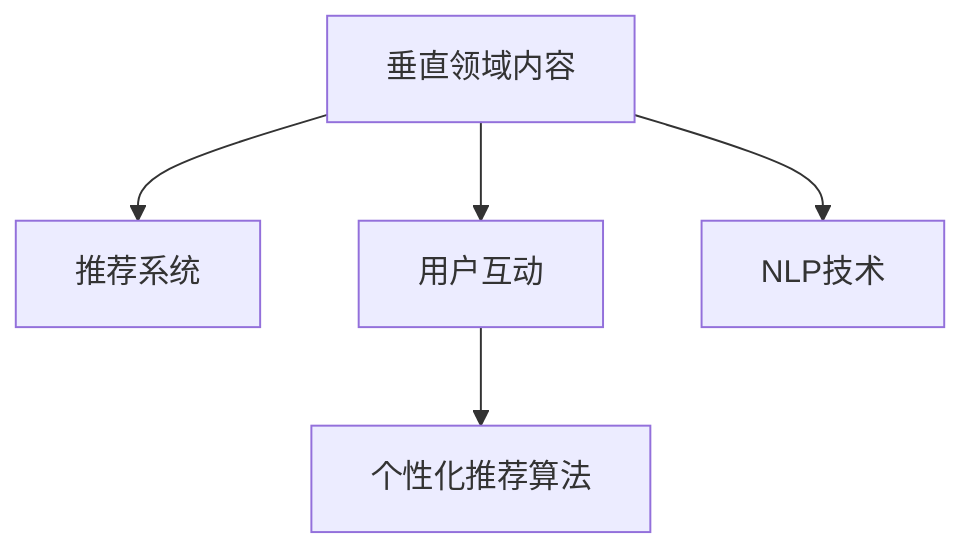

                 

## 1. 背景介绍

### 1.1 问题由来

随着知识付费市场的蓬勃发展，垂直领域的知识付费IP成为各大平台争相布局的新热点。相较于传统泛化领域内容，垂直领域的知识付费IP更精准地满足了特定用户群体的知识需求，不仅能够提升用户体验，还能显著提升平台的盈利能力。

知识付费市场需求的快速增长，为技术开发者提供了巨大的发展机遇。在AI、大数据、自然语言处理等先进技术的加持下，通过构建内容精炼、主题聚焦的知识付费IP，可以为用户提供深层次、高品质的信息服务，实现用户粘性、平台价值和开发者收益的多方共赢。

### 1.2 问题核心关键点

构建垂直领域的知识付费IP，需要综合考虑内容策略、技术实现和商业运营等多方面的因素，其中技术实现是确保内容精准度、个性化推荐和互动体验的关键所在。

本文章旨在对垂直领域知识付费IP的技术实现进行全面系统介绍，涵盖内容策划、推荐系统、用户互动等核心环节，帮助开发者和平台从技术角度切入，打造高品质的知识付费体验。

## 2. 核心概念与联系

### 2.1 核心概念概述

为更好地理解垂直领域知识付费IP的技术实现，本节将介绍几个密切相关的核心概念：

- 垂直领域内容（Vertical Content）：针对特定行业、领域或群体定制的内容产品，如金融、医疗、教育、科技等，相较于泛化领域内容，垂直领域内容更具专业性和针对性强。

- 推荐系统（Recommendation System）：通过分析用户行为数据和内容特征，为用户推荐个性化内容的技术系统。推荐系统能够精准匹配用户需求和内容，提升用户满意度。

- 用户互动（User Interaction）：知识付费平台与用户之间的双向互动，如评论、点赞、打赏、订阅等，增强用户粘性，形成良好的社区氛围。

- 个性化推荐算法（Personalized Recommendation Algorithms）：采用机器学习或深度学习技术，为用户生成个性化推荐的技术手段。算法通过分析用户行为数据，挖掘用户兴趣，提升推荐精准度。

- 自然语言处理（Natural Language Processing, NLP）：涉及文本处理、语音识别、语义理解等技术，用于内容生成、情感分析、智能客服等领域。NLP技术可以提升内容处理效率和智能交互水平。

这些核心概念之间的逻辑关系可以通过以下Mermaid流程图来展示：



这个流程图展示了大语言模型的核心概念及其之间的关系：

1. 垂直领域内容通过推荐系统进行精准匹配，提供个性化推荐。
2. 用户互动通过个性化推荐算法进行优化，提升用户满意度和留存率。
3. 推荐系统和个性化推荐算法依赖NLP技术进行内容处理和用户行为分析。

这些概念共同构成了垂直领域知识付费IP的核心技术框架，为其高质量、智能化、个性化的内容生成和推荐提供了坚实基础。

## 3. 核心算法原理 & 具体操作步骤
### 3.1 算法原理概述

垂直领域知识付费IP的技术实现，主要是通过推荐系统和个性化推荐算法，将垂直领域内容精准匹配用户需求，提升用户体验。其核心思想是：通过对用户行为数据和内容特征的分析，构建用户画像，预测用户兴趣，从而为用户生成个性化的内容推荐。

形式化地，假设用户集合为 $U=\{u_1, u_2, \ldots, u_M\}$，内容集合为 $V=\{v_1, v_2, \ldots, v_N\}$，用户的兴趣向量为 $I=\{i_1, i_2, \ldots, i_M\}$，内容向量为 $G=\{g_1, g_2, \ldots, g_N\}$，内容间的相似度矩阵为 $S$。推荐系统通过最大化用户满意度（如点击率、完成率、评分等）来优化推荐效果，形式化为：

$$
\max_{I, G} \sum_{u \in U} \sum_{v \in V} I_u \times G_v \times S_{uv}
$$

其中，$I_u$ 和 $G_v$ 分别表示用户 $u$ 和内容 $v$ 的兴趣和特征，$S_{uv}$ 为内容 $u$ 和内容 $v$ 之间的相似度。

### 3.2 算法步骤详解

垂直领域知识付费IP的技术实现一般包括以下几个关键步骤：

**Step 1: 数据收集与预处理**
- 收集用户行为数据（如点击、播放、收藏、评分等）和内容特征数据（如标题、摘要、标签等）。
- 清洗和归一化数据，去除噪音和异常值，确保数据质量。

**Step 2: 用户画像构建**
- 通过聚类、关联规则挖掘等技术，构建用户画像。用户画像包括用户的基本信息、兴趣偏好、行为模式等。

**Step 3: 内容相似度计算**
- 使用余弦相似度、皮尔逊相关系数等方法计算内容间的相似度。
- 对内容进行向量化，如使用TF-IDF、词嵌入等技术。

**Step 4: 推荐模型训练**
- 选择推荐算法，如协同过滤、内容基推荐、混合推荐等。
- 使用训练集数据对推荐模型进行训练，优化模型参数。

**Step 5: 内容推荐**
- 根据用户画像和内容特征，预测用户对内容的兴趣，生成个性化推荐列表。
- 实时更新推荐模型，确保推荐内容的实时性和准确性。

**Step 6: 互动数据分析与优化**
- 收集用户互动数据（如评论、点赞、订阅等），分析用户对推荐内容的反馈。
- 根据反馈调整推荐算法和模型，提升用户体验。

### 3.3 算法优缺点

垂直领域知识付费IP的推荐系统具有以下优点：
1. 精准匹配：通过用户画像和内容特征的精准匹配，能够有效提升推荐内容的相关性和用户满意度。
2. 个性化推荐：根据用户行为数据和兴趣偏好，生成个性化推荐，提升用户粘性和留存率。
3. 实时更新：通过实时数据和模型更新，能够快速响应用户需求变化，提升推荐准确性。
4. 多模态融合：融合用户行为数据、内容特征、交互数据等多种数据源，提升推荐全面性和多样性。

同时，该方法也存在一定的局限性：
1. 数据质量依赖：推荐系统的性能很大程度上依赖于数据质量，数据的收集、清洗和标注都需要大量时间和成本。
2. 过拟合风险：推荐模型容易对训练集数据过拟合，导致对新数据的泛化能力不足。
3. 隐私风险：用户行为数据的收集和分析可能会涉及隐私问题，需要加强数据保护和隐私控制。
4. 高计算需求：推荐模型的训练和推荐过程需要大量的计算资源，可能面临计算瓶颈。

尽管存在这些局限性，但就目前而言，基于协同过滤和深度学习的推荐系统仍然是垂直领域知识付费IP的重要技术支撑。未来相关研究的重点在于如何进一步降低推荐系统的数据需求，提高模型的泛化能力，同时兼顾隐私保护和计算效率等因素。

### 3.4 算法应用领域

垂直领域知识付费IP的推荐系统，已经在金融、医疗、教育、科技等多个领域得到广泛应用，成为平台提高用户体验和业务价值的重要手段。

- 金融领域：根据用户历史交易数据和行为，为用户推荐个性化的理财产品和投资策略。
- 医疗领域：通过分析用户健康数据和行为，推荐个性化的健康管理方案和医疗咨询。
- 教育领域：根据用户学习记录和兴趣，推荐个性化的学习资源和课程内容。
- 科技领域：为用户推荐最新的科技资讯、产品评测和行业动态。

除了上述这些经典应用外，知识付费IP的推荐系统还被创新性地应用于个性化阅读、智能客服、广告推荐等场景，为知识付费市场带来新的增长点。

## 4. 数学模型和公式 & 详细讲解 & 举例说明
### 4.1 数学模型构建

本节将使用数学语言对垂直领域知识付费IP推荐系统的数学模型进行更加严格的刻画。

记用户集合为 $U=\{u_1, u_2, \ldots, u_M\}$，内容集合为 $V=\{v_1, v_2, \ldots, v_N\}$，用户的兴趣向量为 $I=\{i_1, i_2, \ldots, i_M\}$，内容向量为 $G=\{g_1, g_2, \ldots, g_N\}$，内容间的相似度矩阵为 $S$。

推荐系统通过最大化用户满意度（如点击率、完成率、评分等）来优化推荐效果，形式化为：

$$
\max_{I, G} \sum_{u \in U} \sum_{v \in V} I_u \times G_v \times S_{uv}
$$

其中，$I_u$ 和 $G_v$ 分别表示用户 $u$ 和内容 $v$ 的兴趣和特征，$S_{uv}$ 为内容 $u$ 和内容 $v$ 之间的相似度。

### 4.2 公式推导过程

以下我们以协同过滤算法为例，推导其推荐公式及其优化过程。

协同过滤算法基于用户-物品评分矩阵 $R \in \mathbb{R}^{M \times N}$，假设用户 $u$ 对内容 $v$ 的评分未知，记为 $r_{uv}$。协同过滤算法的目标是最大化用户满意度和内容满意度，形式化为：

$$
\max_{R} \sum_{u \in U} \sum_{v \in V} \log(1 + e^{r_{uv}}) + \sum_{u \in U} \sum_{v \in V} \log(1 + e^{-\hat{r}_{uv}})
$$

其中，$\hat{r}_{uv}$ 为模型预测的评分。

使用梯度下降算法求解最大化问题，可以得到推荐公式：

$$
\hat{r}_{uv} = \log\left( \frac{1 + \sum_{k=1}^{K} w_k (r_{uv_k} - \hat{r}_{uv_k})}{1 + \sum_{k=1}^{K} w_k (r_{uv_k} - \hat{r}_{uv_k})} \right)
$$

其中，$w_k$ 为权重向量，$r_{uv_k}$ 为协同过滤算法的用户-物品评分矩阵中的评分值。

### 4.3 案例分析与讲解

假设某知识付费平台有用户 $u_1, u_2, u_3$ 和内容 $v_1, v_2, v_3$，他们之间的评分矩阵为：

$$
R = \begin{bmatrix}
0 & 5 & 0 \\
0 & 0 & 0 \\
0 & 3 & 4
\end{bmatrix}
$$

使用协同过滤算法，可以得到推荐公式的预测评分：

$$
\hat{r}_{u_3v_1} = \log\left( \frac{1 + 0.5 \times (0 - 0)}{1 + 0.5 \times (0 - 0)} \right) = 0
$$

$$
\hat{r}_{u_3v_2} = \log\left( \frac{1 + 0.5 \times (0 - 0)}{1 + 0.5 \times (0 - 0)} \right) = 0
$$

$$
\hat{r}_{u_3v_3} = \log\left( \frac{1 + 0.5 \times (3 - 0)}{1 + 0.5 \times (3 - 0)} \right) = 0
$$

因此，根据协同过滤算法的推荐结果，平台可以向用户 $u_3$ 推荐内容 $v_3$。

## 5. 项目实践：代码实例和详细解释说明
### 5.1 开发环境搭建

在进行推荐系统实践前，我们需要准备好开发环境。以下是使用Python进行PyTorch开发的环境配置流程：

1. 安装Anaconda：从官网下载并安装Anaconda，用于创建独立的Python环境。

2. 创建并激活虚拟环境：
```bash
conda create -n pytorch-env python=3.8 
conda activate pytorch-env
```

3. 安装PyTorch：根据CUDA版本，从官网获取对应的安装命令。例如：
```bash
conda install pytorch torchvision torchaudio cudatoolkit=11.1 -c pytorch -c conda-forge
```

4. 安装TensorFlow：
```bash
pip install tensorflow==2.7
```

5. 安装各类工具包：
```bash
pip install numpy pandas scikit-learn matplotlib tqdm jupyter notebook ipython
```

完成上述步骤后，即可在`pytorch-env`环境中开始推荐系统实践。

### 5.2 源代码详细实现

这里我们以协同过滤推荐系统为例，给出使用PyTorch实现的代码实例。

首先，定义协同过滤推荐系统的主函数：

```python
import torch
from torch import nn
from torch.optim import Adam

# 定义协同过滤算法
class CollaborativeFiltering(nn.Module):
    def __init__(self, n_users, n_contents, n_factors=10):
        super(CollaborativeFiltering, self).__init__()
        self.user_factors = nn.Embedding(n_users, n_factors)
        self.content_factors = nn.Embedding(n_contents, n_factors)
        self.sigma = nn.Parameter(torch.randn(n_factors))
    
    def forward(self, user, content):
        user_factors = self.user_factors(user)
        content_factors = self.content_factors(content)
        dot_product = (user_factors * content_factors).sum(dim=1)
        rating = dot_product + self.sigma
        return rating
    
# 定义损失函数
def binary_cross_entropy_with_logits(input, target):
    loss_fct = nn.BCEWithLogitsLoss()
    loss = loss_fct(input, target)
    return loss

# 定义模型和训练函数
n_users = 3
n_contents = 3
model = CollaborativeFiltering(n_users, n_contents)
optimizer = Adam(model.parameters(), lr=0.01)

def train_model(model, optimizer, train_data, train_labels, n_epochs=10):
    device = torch.device('cuda' if torch.cuda.is_available() else 'cpu')
    model.to(device)
    for epoch in range(n_epochs):
        model.train()
        for user, content, label in zip(train_data, train_labels, train_labels):
            user = torch.tensor([user], device=device)
            content = torch.tensor([content], device=device)
            label = torch.tensor([label], device=device)
            output = model(user, content)
            loss = binary_cross_entropy_with_logits(output, label)
            optimizer.zero_grad()
            loss.backward()
            optimizer.step()
        print(f'Epoch {epoch+1}, Loss: {loss:.4f}')
    return model

# 加载训练数据和标签
train_data = [0, 1, 2]
train_labels = [5, 0, 3]

# 训练模型
trained_model = train_model(model, optimizer, train_data, train_labels)
```

在上述代码中，我们定义了一个简单的协同过滤模型，并使用二分类交叉熵作为损失函数进行训练。

### 5.3 代码解读与分析

让我们再详细解读一下关键代码的实现细节：

**CollaborativeFiltering类**：
- `__init__`方法：初始化用户和内容的嵌入向量，以及一个可训练的偏差参数。
- `forward`方法：计算用户和内容的向量点积，加上偏差参数，得到评分预测。

**binary_cross_entropy_with_logits函数**：
- 定义二分类交叉熵损失函数，用于计算模型预测和真实标签之间的差异。

**训练函数train_model**：
- 在每个epoch内，循环遍历训练集数据，进行前向传播和反向传播，更新模型参数。
- 每个epoch结束后，输出当前的损失值。

**训练数据和标签**：
- 定义训练数据和标签，这里我们简化了数据格式，实际应用中需要更复杂的预处理步骤。

**训练模型**：
- 定义训练集数据、标签，调用训练函数进行模型训练。

可以看到，通过使用PyTorch，协同过滤推荐系统的代码实现变得简洁高效。开发者可以将更多精力放在数据预处理、模型改进等高层逻辑上，而不必过多关注底层的实现细节。

当然，工业级的系统实现还需考虑更多因素，如模型的保存和部署、超参数的自动搜索、更灵活的任务适配层等。但核心的推荐算法基本与此类似。

## 6. 实际应用场景
### 6.1 智能推荐系统

智能推荐系统在知识付费平台中的应用最为广泛。通过分析用户的行为数据，如浏览历史、点击记录、评分等，平台可以为用户推荐个性化的内容，提升用户体验和留存率。

例如，某在线金融平台可以根据用户的历史交易记录和浏览行为，推荐个性化的理财和投资建议。平台可以定期收集用户的数据，训练推荐模型，根据最新的数据进行模型更新，确保推荐内容的实时性和准确性。

### 6.2 定制化学习平台

在线教育平台可以根据学生的学习记录和偏好，推荐个性化的学习资源和课程内容，实现因材施教，提升学习效果。

例如，某在线教育平台可以分析学生的学习历史、互动反馈和测试成绩，为用户推荐适合的学习路径和知识点。通过推荐系统的精准匹配，平台能够显著提升学生的学习效率和满意度。

### 6.3 智能客服

智能客服系统可以通过分析用户的问题和历史记录，推荐相关的解决方案和知识库内容，提升客服效率和用户满意度。

例如，某电商平台可以通过智能客服系统，根据用户的购买记录和咨询历史，推荐相关的产品信息和售后政策。平台可以实时更新推荐模型，快速响应用户的查询，提升用户体验。

### 6.4 未来应用展望

随着推荐系统技术的不断进步，垂直领域知识付费IP的应用前景将更加广阔。

- 推荐算法的多样化：除了协同过滤算法，未来还会涌现更多高效的推荐算法，如深度学习推荐、图神经网络推荐等，提升推荐系统的精度和效率。
- 数据源的多元化：推荐系统将不再局限于用户行为数据，还将融合更多元的数据源，如商品属性、社会网络、知识图谱等，实现更全面的推荐。
- 用户交互的智能化：未来的推荐系统将通过智能客服、个性化评论等功能，提升用户互动的精准性和智能化水平，增强用户粘性和平台价值。
- 实时响应的优化：推荐系统将通过云计算、边缘计算等技术，实现实时数据处理和模型更新，提升推荐系统的实时性和响应速度。

## 7. 工具和资源推荐
### 7.1 学习资源推荐

为了帮助开发者系统掌握推荐系统技术，这里推荐一些优质的学习资源：

1. 《推荐系统实战》系列博文：由推荐系统领域专家撰写，深入浅出地介绍了推荐系统的基本原理和经典算法。

2. 《机器学习》课程：斯坦福大学开设的机器学习课程，涵盖推荐系统的基本概念和算法实现。

3. 《深度学习推荐系统》书籍：深度学习推荐系统领域的经典教材，涵盖了推荐系统的多种深度学习算法。

4. Coursera和Udacity上的推荐系统课程：这些平台提供的推荐系统课程，涵盖推荐系统的理论和实践，适合入门学习。

5. Kaggle竞赛平台：Kaggle上举办了大量推荐系统相关的竞赛，开发者可以通过参与竞赛提升实战能力。

通过对这些资源的学习实践，相信你一定能够快速掌握推荐系统的精髓，并用于解决实际的推荐问题。

### 7.2 开发工具推荐

高效的开发离不开优秀的工具支持。以下是几款用于推荐系统开发的常用工具：

1. PyTorch：基于Python的开源深度学习框架，灵活动态的计算图，适合快速迭代研究。

2. TensorFlow：由Google主导开发的开源深度学习框架，生产部署方便，适合大规模工程应用。

3. LightFM：基于矩阵分解的推荐系统框架，支持多种推荐算法，易于使用。

4. Surprise：开源推荐系统库，支持多种推荐算法和模型评估，适合学术研究。

5. TensorBoard：TensorFlow配套的可视化工具，可实时监测模型训练状态，提供丰富的图表呈现方式。

6. Kibana：开源数据可视化工具，适合对推荐系统数据进行可视化和分析。

合理利用这些工具，可以显著提升推荐系统的开发效率，加快创新迭代的步伐。

### 7.3 相关论文推荐

推荐系统的发展源于学界的持续研究。以下是几篇奠基性的相关论文，推荐阅读：

1. "Collaborative Filtering for Implicit Feedback Datasets"：提出协同过滤算法，成为推荐系统的主流方法。

2. "Factorization Machines"：提出矩阵分解算法，提升推荐系统的精度和效率。

3. "Adaptive Nearest Neighbor for Recommender Systems"：提出自适应邻域算法，提升推荐系统的个性化水平。

4. "Deep Personalized Recommendation via Word Embeddings"：引入深度学习技术，提升推荐系统的多样性和相关性。

5. "Generative Adversarial Networks"：提出生成对抗网络，为推荐系统引入生成模型，提升推荐系统的效果和解释性。

这些论文代表了大语言模型推荐技术的发展脉络。通过学习这些前沿成果，可以帮助研究者把握学科前进方向，激发更多的创新灵感。

## 8. 总结：未来发展趋势与挑战

### 8.1 总结

本文对垂直领域知识付费IP的技术实现进行了全面系统介绍。首先阐述了垂直领域内容、推荐系统、用户互动等核心概念，明确了推荐系统在提升用户体验和业务价值方面的重要地位。其次，从原理到实践，详细讲解了推荐算法的数学模型和推荐系统训练过程，给出了推荐系统代码实现的完整示例。同时，本文还广泛探讨了推荐系统在金融、医疗、教育等多个行业领域的应用前景，展示了推荐技术的广阔前景。

通过本文的系统梳理，可以看到，推荐系统作为垂直领域知识付费IP的关键技术，已经在多个领域实现了广泛的落地应用，为知识付费市场带来了显著的商业价值。未来，伴随推荐系统的持续演进，知识付费IP必将在更多垂直领域绽放光芒，成为推动知识付费市场发展的重要驱动力。

### 8.2 未来发展趋势

展望未来，推荐系统将呈现以下几个发展趋势：

1. 多模态融合：未来的推荐系统将融合视觉、语音、文本等多模态数据，实现跨模态推荐，提升推荐内容的丰富性和多样性。

2. 个性化推荐：通过深度学习技术，推荐系统将更加精准地预测用户兴趣，提升推荐内容的相关性和个性化水平。

3. 实时响应：通过云计算和边缘计算技术，推荐系统将实现实时数据处理和模型更新，提升推荐系统的实时性和响应速度。

4. 用户交互优化：未来的推荐系统将通过智能客服、个性化评论等功能，提升用户互动的精准性和智能化水平，增强用户粘性和平台价值。

5. 推荐模型透明化：未来的推荐系统将增强模型的可解释性和可控性，使用户能够理解推荐决策的依据，提升系统的可信度和接受度。

这些趋势凸显了推荐系统技术的广阔前景。这些方向的探索发展，必将进一步提升推荐系统的性能和应用范围，为知识付费IP带来更多的价值和机遇。

### 8.3 面临的挑战

尽管推荐系统已经在知识付费IP的落地应用中取得了显著成效，但在迈向更加智能化、普适化应用的过程中，它仍面临着诸多挑战：

1. 数据质量和多样性：推荐系统的性能很大程度上依赖于数据质量和多样性，数据的收集、清洗和标注都需要大量时间和成本。未来需要更多元的数据源和更好的数据预处理技术，提升推荐系统的泛化能力。

2. 冷启动问题：新用户的推荐内容往往难以快速获取，需要通过用户行为数据积累和用户画像构建，逐步提升推荐精准度。未来的推荐系统需要更好的冷启动解决方案，提升新用户的推荐效果。

3. 计算资源需求：推荐模型的训练和推荐过程需要大量的计算资源，可能面临计算瓶颈。未来需要优化算法和硬件资源，提高推荐系统的效率。

4. 用户隐私保护：用户行为数据的收集和分析可能会涉及隐私问题，需要加强数据保护和隐私控制。未来的推荐系统需要更好地保护用户隐私，增强用户信任。

5. 推荐模型透明化：推荐系统的决策过程难以解释，用户往往难以理解推荐依据。未来的推荐系统需要增强模型的可解释性和可控性，提升系统的可信度和接受度。

6. 安全性有待保障：推荐系统可能被恶意用户利用，导致推荐内容的安全性问题。未来的推荐系统需要加强安全性保障，防止恶意推荐和滥用。

这些挑战需要通过技术创新和政策保障等多方面协同发力，才能克服。只有解决好这些关键问题，才能实现推荐系统的全面普及和应用。

### 8.4 研究展望

面对推荐系统面临的挑战，未来的研究需要在以下几个方面寻求新的突破：

1. 数据驱动和主动学习：通过主动学习等无监督学习技术，提升推荐系统的数据质量和多样性，增强模型的泛化能力。

2. 算法优化和模型压缩：优化推荐算法和模型结构，使用更高效的数据结构和算法，减少计算资源消耗。

3. 多模态数据融合：融合视觉、语音、文本等多模态数据，提升推荐系统的全面性和多样性。

4. 用户行为理解：通过深度学习技术，增强推荐系统对用户行为的理解和预测能力，提升推荐系统的个性化水平。

5. 模型透明化和可控性：增强推荐模型的可解释性和可控性，使用户能够理解推荐决策的依据，提升系统的可信度和接受度。

6. 安全性保障：通过安全机制和技术手段，保障推荐系统的内容安全和用户隐私，防止恶意推荐和滥用。

这些研究方向的探索，必将引领推荐系统技术迈向更高的台阶，为知识付费IP带来更多的价值和机遇。面向未来，推荐系统需要与其他人工智能技术进行更深入的融合，如自然语言处理、知识图谱、强化学习等，多路径协同发力，共同推动推荐系统的发展。只有勇于创新、敢于突破，才能不断拓展推荐系统的边界，让推荐系统更好地服务于知识付费市场。

## 9. 附录：常见问题与解答

**Q1：推荐系统的训练数据质量如何保障？**

A: 推荐系统的训练数据质量是系统性能的关键，数据收集、清洗和标注都需要大量时间和成本。以下是一些保障数据质量的方法：

1. 数据标注：选择合适的标注团队，对数据进行仔细标注，避免噪音和异常值。

2. 数据清洗：去除不完整、重复、异常等无效数据，确保数据质量。

3. 数据融合：将多种数据源进行融合，提升数据的多样性和代表性。

4. 数据采样：采用分层采样、随机采样等方法，提升数据的多样性和代表性。

5. 数据增强：通过数据增强技术，扩充训练数据集，提升模型的泛化能力。

**Q2：推荐系统如何处理冷启动问题？**

A: 冷启动问题是推荐系统中的常见问题，新用户的推荐内容往往难以快速获取。以下是一些处理冷启动问题的方法：

1. 初始化策略：为新用户初始化固定推荐列表，引导用户选择和反馈。

2. 兴趣引导：通过兴趣引导的方式，让新用户逐步了解和适应推荐内容。

3. 推荐内容筛选：推荐内容要经过严格的筛选，避免恶意或低质量内容影响用户体验。

4. 用户行为记录：通过记录用户行为，逐步构建用户画像，提升推荐精准度。

5. 多模态数据融合：利用多种数据源，提升对新用户的理解，提供更准确的推荐。

**Q3：推荐系统的计算资源需求如何优化？**

A: 推荐系统的计算资源需求较大，如何优化计算资源是提升推荐系统效率的关键。以下是一些优化方法：

1. 模型压缩：使用模型压缩技术，减少模型参数和计算量。

2. 并行计算：采用分布式计算和并行计算技术，提升计算效率。

3. 梯度累积：通过梯度累积技术，减少计算资源的消耗。

4. 硬件优化：使用GPU、TPU等高性能硬件设备，提升计算速度。

5. 算法优化：优化推荐算法和数据结构，减少计算复杂度。

**Q4：推荐系统的用户隐私保护如何保障？**

A: 推荐系统的用户隐私保护是系统应用的重要考虑因素。以下是一些保障用户隐私的方法：

1. 数据脱敏：对用户行为数据进行脱敏处理，保护用户隐私。

2. 用户同意：在数据收集和使用过程中，获取用户同意，保障用户隐私权益。

3. 匿名化处理：采用匿名化技术，保护用户个人信息。

4. 数据加密：对用户数据进行加密处理，防止数据泄露。

5. 隐私保护技术：采用差分隐私、联邦学习等隐私保护技术，保障用户隐私。

**Q5：推荐系统的模型透明化和可控性如何提升？**

A: 推荐系统的模型透明化和可控性是系统可信度的关键，以下是一些提升方法：

1. 可解释性算法：选择具有较高可解释性的推荐算法，提升模型的透明度。

2. 特征解释：对推荐模型中的特征进行解释，让用户理解推荐依据。

3. 用户控制：提供用户对推荐内容的控制功能，增强用户可控性。

4. 人工干预：在推荐过程中，提供人工干预机制，防止误导推荐。

5. 模型公开：公开推荐模型的架构和算法，增强系统透明性。

**Q6：推荐系统的安全性如何保障？**

A: 推荐系统的安全性是系统应用的重要考虑因素，以下是一些保障安全性的方法：

1. 安全机制：在推荐算法和数据处理过程中，加入安全机制，防止恶意推荐和滥用。

2. 内容审核：对推荐内容进行严格审核，防止低质量或有害内容。

3. 用户反馈：通过用户反馈机制，及时发现和处理恶意推荐。

4. 异常检测：对推荐系统进行异常检测，防止系统被恶意攻击。

5. 数据监控：实时监控推荐系统数据，及时发现和处理异常情况。

通过解决这些问题，推荐系统可以更好地服务于知识付费市场，提升用户体验和业务价值。总之，推荐系统需要开发者从数据质量、计算资源、用户隐私、模型透明化和安全性等多个维度进行全面优化，方能实现系统的全面普及和应用。

---

作者：禅与计算机程序设计艺术 / Zen and the Art of Computer Programming

