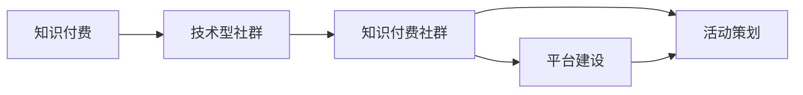

                 

# 打造技术型知识付费社群的活动策划

> 关键词：知识付费, 社群运营, 技术分享, 平台建设, 活动策划

## 1. 背景介绍

随着互联网和信息技术的快速发展，知识付费成为一种新的商业模式，逐渐受到广泛关注和应用。技术型知识付费社群作为其中的重要组成部分，以其专业性、高价值和高效率著称，满足了技术从业者对前沿技术、深度学习和业务技能提升的需求。如何打造一个具有竞争力和影响力的技术型知识付费社群，成为当下众多从业者关注的焦点。本文将从社群运营、平台建设、活动策划等多个角度，全面系统地介绍如何打造一个成功的技术型知识付费社群。

## 2. 核心概念与联系

### 2.1 核心概念概述

为更好地理解技术型知识付费社群的建设，本节将介绍几个关键概念及其相互关系：

- **知识付费**：指消费者为获取专业知识、技能提升或深度学习内容而支付费用的服务模式，包括订阅、单次购买、课程定制等多种形式。
- **技术型社群**：聚焦于技术领域的知识分享与交流，成员之间以专业讨论、经验分享、技术交流为核心活动的社群。
- **知识付费社群**：将知识付费与社群运营相结合，提供基于社群的知识服务和付费模式的平台。
- **平台建设**：指搭建知识付费社群所需的技术平台，包括系统架构设计、功能模块开发、运营维护等。
- **活动策划**：围绕社群目标和运营策略，策划并组织各类技术交流、学习、分享活动，提升社群活跃度和影响力。

这些核心概念通过以下Mermaid流程图展示其相互关系：



从上述关系图可以看出，知识付费社群建设需要围绕平台和活动两方面进行，平台建设为活动策划提供支撑，而活动策划则进一步提升了平台的吸引力和影响力。

## 3. 核心算法原理 & 具体操作步骤
### 3.1 算法原理概述

技术型知识付费社群的核心算法原理主要集中在以下几个方面：

- **推荐算法**：通过分析用户行为数据，推荐适合用户的技术文章、课程和社群活动，提高用户粘性和留存率。
- **内容审核**：确保发布内容的质量和合规性，维护社群的学习氛围和专业性。
- **活动推荐**：根据用户兴趣和行为，推荐合适的活动，提升用户参与度和社群活跃度。
- **互动机制**：设计互动机制，鼓励用户交流和分享，增强社群的社交属性。
- **用户成长体系**：通过积分、勋章等奖励机制，激励用户参与社群活动和分享，形成良性循环。

### 3.2 算法步骤详解

技术型知识付费社群的核心算法步骤包括：

1. **用户画像构建**：收集和分析用户行为数据，包括学习历史、活动参与情况、讨论主题等，构建用户画像。
2. **内容推荐算法设计**：基于用户画像，设计推荐算法，选择合适的技术文章、课程和活动，推送给用户。
3. **内容审核机制**：建立严格的内容审核机制，确保发布内容的质量和合规性，维护社群的专业性。
4. **活动策划与组织**：策划并组织各类技术交流、学习、分享活动，吸引用户参与，提升社群活跃度。
5. **互动与激励机制设计**：设计互动机制，如讨论区、问答等，鼓励用户交流和分享。同时，引入积分、勋章等奖励机制，激励用户参与社群活动。
6. **用户成长体系搭建**：设计用户成长体系，通过积分、勋章等奖励机制，激励用户参与社群活动和分享，形成良性循环。

### 3.3 算法优缺点

技术型知识付费社群的核心算法具有以下优点：

- **提升用户粘性**：通过个性化推荐，提升用户的学习体验和粘性。
- **维护社群专业性**：通过严格的内容审核机制，确保发布内容的质量和专业性。
- **提高用户参与度**：通过策划和组织各类活动，吸引用户参与，提升社群活跃度。
- **激励用户分享**：通过互动与激励机制设计，鼓励用户交流和分享，增强社群的社交属性。

同时，也存在以下局限性：

- **算法偏见**：如果算法模型存在偏见，可能导致内容推荐不准确，影响用户体验。
- **内容审核挑战**：内容审核需要大量人力和时间，同时可能难以全面覆盖所有内容。
- **活动策划难度**：高质量活动的策划和组织需要较强的专业能力和资源投入。
- **用户激励不足**：如果激励机制设计不当，可能导致用户参与度和活跃度不高。

### 3.4 算法应用领域

技术型知识付费社群的算法主要应用于以下领域：

- **在线教育平台**：通过推荐算法，提升课程推荐和用户体验，同时通过内容审核确保课程质量。
- **技术社区和论坛**：通过互动机制和激励体系，提升用户活跃度和社群凝聚力。
- **企业内部学习平台**：通过个性化推荐和活动策划，提升员工的学习效率和满意度。
- **开源项目和开发者社区**：通过内容推荐和互动机制，促进技术交流和项目协作。

## 4. 数学模型和公式 & 详细讲解 & 举例说明

### 4.1 数学模型构建

技术型知识付费社群的核心算法模型包括：

- **推荐模型**：基于协同过滤、内容过滤和混合过滤等方法，构建个性化推荐模型。
- **用户画像模型**：通过聚类和分类等方法，构建用户画像，用于内容推荐和活动策划。
- **活动推荐模型**：基于用户兴趣和行为，设计活动推荐算法，提升用户参与度。

### 4.2 公式推导过程

以协同过滤推荐算法为例，用户-物品评分矩阵 $R \in \mathbb{R}^{n \times m}$，用户画像向量 $u \in \mathbb{R}^d$，物品画像向量 $v \in \mathbb{R}^d$，则用户对物品 $i$ 的预测评分 $\hat{r}_i = u^T V_i v$，其中 $V_i$ 为物品 $i$ 的画像向量。

### 4.3 案例分析与讲解

假设某技术型知识付费社群拥有 10,000 名用户和 1,000 门课程，通过协同过滤推荐算法，对每个用户推荐 10 门课程。根据用户行为数据，构建用户画像向量 $u$ 和课程画像向量 $v$，计算用户对每门课程的预测评分，选择评分最高的 10 门课程推荐给用户。

## 5. 项目实践：代码实例和详细解释说明

### 5.1 开发环境搭建

技术型知识付费社群的开发环境搭建涉及多个步骤：

1. **环境准备**：选择合适的编程语言（如Python），安装必要的开发工具和库。
2. **数据库设计**：设计用户、课程、讨论、活动等数据表，确保数据结构的合理性和可扩展性。
3. **部署架构**：设计系统架构，包括前端、后端、数据库和缓存等组件，确保系统的稳定性和可扩展性。
4. **安全性保障**：确保数据传输和存储的安全性，防止数据泄露和攻击。

### 5.2 源代码详细实现

以下以推荐算法为例，介绍技术型知识付费社群的代码实现：

```python
import pandas as pd
from sklearn.decomposition import TruncatedSVD

# 加载用户-物品评分数据
data = pd.read_csv('ratings.csv')

# 构建用户画像矩阵
user_profiles = data.groupby('user_id')['item_id'].value_counts().unstack().fillna(0).T
user_profiles = user_profiles.to_sparse().tocsc()

# 构建课程画像矩阵
item_profiles = data.groupby('item_id')['user_id'].value_counts().unstack().fillna(0).T
item_profiles = item_profiles.to_sparse().tocsc()

# 计算用户画像向量
user_ua = TruncatedSVD(n_components=10).fit_transform(user_profiles)

# 计算课程画像向量
item_ua = TruncatedSVD(n_components=10).fit_transform(item_profiles)

# 推荐算法实现
def collaborative_filtering(user_id, n_recommendations=10):
    user_profile = user_ua[user_id]
    similarity_matrix = user_profiles.dot(item_profiles.T)
    similarity_matrix = similarity_matrix.tocsr() / (similarity_matrix.A.dot(similarity_matrix.sum(axis=1))**0.5)
    item_ua = TruncatedSVD(n_components=n_recommendations).fit_transform(similarity_matrix)
    recommendations = item_ua.sum(axis=0).sort_values(ascending=False).index[:n_recommendations]
    return recommendations
```

### 5.3 代码解读与分析

上述代码实现了基于协同过滤的推荐算法，主要步骤如下：

1. **数据加载**：从CSV文件中加载用户和课程的评分数据，构建用户画像矩阵和课程画像矩阵。
2. **用户画像向量计算**：使用TruncatedSVD算法，将用户画像矩阵降维为10维向量，用于推荐算法。
3. **课程画像向量计算**：使用TruncatedSVD算法，将课程画像矩阵降维为10维向量，用于推荐算法。
4. **推荐算法实现**：根据用户画像向量，计算用户对每门课程的评分预测，选择评分最高的10门课程进行推荐。

## 6. 实际应用场景

### 6.1 技术社区

在技术社区中，知识付费社群可以提供专业的技术文章、代码库和视频教程，满足技术从业者的学习需求。通过活动策划和互动机制设计，可以吸引更多开发者加入，提升社区的影响力和活跃度。

### 6.2 企业内部学习平台

企业内部学习平台可以提供定制化的技术课程和专业培训，提升员工的技术水平和业务能力。通过活动策划和激励机制设计，可以鼓励员工积极参与学习，提升企业竞争力。

### 6.3 开源项目

开源项目可以通过知识付费社群，提供技术文章、开发工具和文档等资源，促进技术交流和项目协作。通过活动策划和互动机制设计，可以吸引更多的开发者参与项目，提升项目的质量和活跃度。

### 6.4 未来应用展望

未来，技术型知识付费社群将在更多领域得到应用，为技术创新和行业发展提供新的动力。随着人工智能和大数据技术的不断发展，知识付费社群将更加智能化和个性化，更好地满足用户的学习需求，推动技术创新和行业进步。

## 7. 工具和资源推荐

### 7.1 学习资源推荐

为帮助开发者系统掌握技术型知识付费社群的建设，以下是一些优质的学习资源：

1. **《知识付费与社群运营》系列课程**：由知识付费领域专家讲授，涵盖知识付费的商业模式、社群运营策略、用户管理等多个方面。
2. **《Python数据分析与机器学习》系列书籍**：全面介绍Python在数据分析和机器学习中的应用，包括推荐算法、用户画像等技术。
3. **《在线教育平台设计与运营》书籍**：详细介绍了在线教育平台的设计和运营策略，涵盖课程推荐、活动策划等多个方面。
4. **Coursera和Udacity平台**：提供众多技术型知识付费课程，包括推荐算法、内容审核、用户管理等多个模块。
5. **GitHub和Stack Overflow社区**：丰富的开源项目和开发者交流平台，可以获取大量技术资源和学习经验。

### 7.2 开发工具推荐

选择合适的开发工具，可以显著提升技术型知识付费社群的开发效率。以下是几款推荐的工具：

1. **PyTorch和TensorFlow**：深度学习框架，支持大规模推荐算法和用户画像计算。
2. **Scikit-learn和Keras**：机器学习库，提供丰富的算法和工具，支持数据预处理和模型训练。
3. **Flask和Django**：Python Web框架，支持快速搭建前后端系统，支持API开发和数据接口。
4. **Redis和MySQL**：数据库和缓存系统，支持高效的数据存储和访问，提升系统的稳定性和性能。
5. **Git和GitHub**：版本控制和代码托管平台，支持团队协作和版本管理。

### 7.3 相关论文推荐

技术型知识付费社群的建设需要大量的理论支撑，以下是一些重要的相关论文：

1. **《协同过滤推荐算法研究》**：详细介绍了协同过滤推荐算法的原理和应用，涵盖用户画像和物品画像构建等多个方面。
2. **《个性化推荐系统研究》**：系统介绍个性化推荐系统的设计和技术，涵盖推荐算法、用户画像等多个模块。
3. **《知识付费平台用户行为分析与推荐算法》**：基于用户行为数据，设计和实现推荐算法，提升平台的用户粘性和满意度。
4. **《社交媒体社区的建设与管理》**：探讨社交媒体社区的建设与管理策略，涵盖用户管理、内容审核等多个方面。
5. **《在线教育平台的运营策略》**：系统介绍在线教育平台的运营策略，涵盖课程推荐、活动策划等多个模块。

## 8. 总结：未来发展趋势与挑战

### 8.1 总结

本文系统介绍了技术型知识付费社群的建设方法和应用场景，涵盖平台建设、算法设计、活动策划等多个方面。通过详细阐述各个模块的原理和实现方法，可以为开发者提供全面的技术指引。通过探讨社群运营的挑战和未来趋势，为行业从业者提供可行的解决方案和前瞻性的思考。

## 9. 附录：常见问题与解答

**Q1: 如何提升技术型知识付费社群的用户粘性？**

A: 提升用户粘性需要从多方面入手：
1. **个性化推荐**：根据用户行为和兴趣，提供个性化的内容和服务，提高用户满意度。
2. **活动策划**：定期策划和组织各类技术交流、学习、分享活动，增强社群的社交属性。
3. **互动机制设计**：设计互动机制，如讨论区、问答等，鼓励用户交流和分享，提升社群活跃度。

**Q2: 如何确保技术型知识付费社群的内容质量？**

A: 确保内容质量需要建立严格的内容审核机制：
1. **内容审核团队**：组建专业的内容审核团队，负责审核发布内容的质量和合规性。
2. **用户反馈机制**：建立用户反馈机制，鼓励用户举报和反馈低质量内容，及时处理和删除。
3. **内容激励机制**：设计内容激励机制，奖励高质量内容的发布和分享，提升用户参与度。

**Q3: 如何设计高效的技术型知识付费社群平台？**

A: 设计高效平台需要考虑以下几个方面：
1. **技术架构设计**：选择合适的技术架构，如前后端分离、微服务架构等，提升系统的可扩展性和稳定性。
2. **数据存储设计**：设计高效的数据存储方案，如使用Redis缓存、MySQL数据库等，提升数据访问速度和存储效率。
3. **安全性设计**：设计严格的安全性措施，如数据加密、访问鉴权等，确保数据安全。
4. **性能优化设计**：进行性能优化，如使用CDN加速、负载均衡等，提升系统响应速度和并发处理能力。

**Q4: 如何激励用户参与技术型知识付费社群活动？**

A: 激励用户参与需要设计合理的激励机制：
1. **积分和勋章系统**：设计积分和勋章系统，激励用户参与学习、分享和讨论。
2. **活动奖励机制**：设计活动奖励机制，奖励参与度高、贡献大的用户，提升用户参与度。
3. **社区荣誉机制**：设计社区荣誉机制，表彰在社群中做出突出贡献的用户，增强用户荣誉感和归属感。

---

作者：禅与计算机程序设计艺术 / Zen and the Art of Computer Programming

