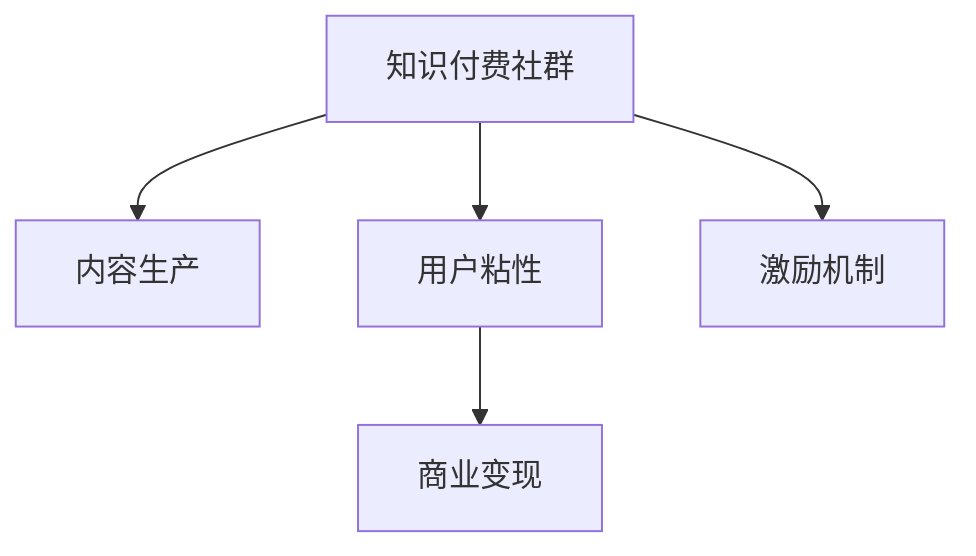

                 

# 打造技术型知识付费社群的运营之道

## 1. 背景介绍

### 1.1 问题由来
随着互联网的发展和技术的普及，知识的获取和传播变得更加便捷。传统教育模式面临巨大挑战，而知识付费作为一种新兴的学习方式，迅速崛起。技术型知识付费社群以技术交流和分享为核心，聚集了大量对技术有深度理解和实践经验的专家和爱好者，成为推动技术创新和人才培养的重要平台。

然而，知识付费社群的运营面临着诸多挑战。如何构建可持续发展的社群结构，如何吸引高质量内容生产者，如何提高用户粘性，如何实现商业变现等，都成为社群运营者必须解决的问题。

### 1.2 问题核心关键点
技术型知识付费社群的核心关键点在于：
- **社群结构**：如何构建一个稳定、高效、多样化的社群，聚集各类技术专家和爱好者。
- **内容生产**：如何吸引高质量的内容生产者，持续产出有价值的知识内容。
- **用户粘性**：如何通过互动和激励机制，提高用户参与度和粘性。
- **商业变现**：如何将社群资源转化为商业价值，实现可持续的盈利模式。

## 2. 核心概念与联系

### 2.1 核心概念概述

为更好地理解技术型知识付费社群的运营之道，本节将介绍几个密切相关的核心概念：

- **知识付费社群**：基于互联网技术的知识分享和交流平台，聚集技术专家和爱好者，通过订阅、付费等方式提供高质量内容。
- **内容生产者**：在社群内发布技术文章、视频、课程等知识内容的专家和技术人员。
- **用户粘性**：用户持续参与社群互动的程度，包括阅读、评论、分享、提问等。
- **商业变现**：通过广告、会员费、课程费、知识商店等渠道，将社群资源转化为商业收入。
- **激励机制**：通过奖励、认证、排名等手段，激发用户和内容生产者的积极性。

这些核心概念之间的逻辑关系可以通过以下Mermaid流程图来展示：



这个流程图展示的知识付费社群的核心概念及其之间的关系：

1. 知识付费社群的构建吸引内容生产者。
2. 内容生产者产出优质内容，提高社群的用户粘性。
3. 用户粘性提升社群的商业变现能力。
4. 激励机制进一步增强用户和内容生产者的参与积极性。

## 3. 核心算法原理 & 具体操作步骤
### 3.1 算法原理概述

技术型知识付费社群的运营，本质上是一个多目标优化问题。其核心思想是：通过构建社群结构、吸引内容生产、提高用户粘性、实现商业变现的循环迭代，不断优化社群生态，提升整体价值。

具体来说，目标函数为：

$$
\maximize_{\theta} \{ content\_quality, user\_engagement, commercial\_value, incentive\_efficiency \}
$$

其中，$\theta$ 代表社群运营的相关策略和手段，如内容推荐算法、社区互动策略、商业合作模式等。通过多目标优化算法，找到最优的 $\theta$，使得社群的整体价值最大化。

### 3.2 算法步骤详解

技术型知识付费社群的运营步骤主要包括以下几个关键环节：

**Step 1: 构建社群结构**
- 设计社群的组织架构，明确角色和职责。
- 设立专家委员会、管理团队、志愿者等岗位，确保社群的有效运营。
- 划分不同的技术领域，组建细分小组，便于深入交流。

**Step 2: 吸引内容生产**
- 提供有吸引力的激励措施，如荣誉证书、资金奖励、曝光机会等。
- 设立内容质量评审机制，确保输出的内容具有高价值。
- 创建内容发布平台，方便内容生产者上传和分享知识。
- 定期举办技术沙龙、讲座、线上线下活动，吸引专家分享经验。

**Step 3: 提高用户粘性**
- 设计有趣的互动环节，如技术问答、代码挑战、小组讨论等。
- 建立社区规则，鼓励用户积极参与和贡献。
- 定期推送优质内容，增强用户的粘性和归属感。
- 引入社交网络机制，促进用户之间的互动和交流。

**Step 4: 实现商业变现**
- 开发付费订阅模式，提供会员专属内容和技术支持。
- 设立知识商店，销售技术书籍、工具、课程等。
- 引入广告和合作营销，获取流量和品牌曝光。
- 建立社区店铺，销售基于社群积累的技术产品和服务。

**Step 5: 激励机制设计**
- 设立认证和奖励机制，激励用户和内容生产者。
- 设计积分和排行榜系统，展示用户和内容的价值和贡献。
- 引入竞争和合作机制，提升社群的活跃度。
- 定期反馈用户和内容生产者的参与情况，优化激励措施。

以上是社群运营的一般流程。在实际应用中，还需要针对具体社群的特点，对各个环节进行优化设计，如改进社区规则、引入机器学习推荐算法、建立用户画像等，以进一步提升社群的用户体验和价值。

### 3.3 算法优缺点

技术型知识付费社群的运营方法具有以下优点：
1. 高效整合资源。通过社群平台聚集专家和爱好者，实现知识的高效共享和传播。
2. 提升用户技能。高质量的内容和互动能够显著提高用户的技术水平。
3. 吸引商业合作。社群的品牌效应和用户粘性为商业合作提供了巨大潜力。
4. 实现商业变现。多样的变现方式能够帮助社群实现盈利，持续运营和发展。

同时，该方法也存在一定的局限性：
1. 对运营者要求高。需要具有丰富社群运营经验和技术背景，才能制定有效的策略。
2. 需要大量人力物力。社群的管理和维护需要投入大量资源，尤其是技术含量高的社群。
3. 用户质量参差不齐。社群内用户的技术水平和参与意愿存在差异，可能导致资源浪费。
4. 内容质量难以保证。过度依赖专家，可能导致内容更新不及时，影响用户体验。

尽管存在这些局限性，但就目前而言，这种社群运营方法仍然是主流且高效的。未来相关研究的重点在于如何进一步优化社群运营的各个环节，提高运营效率和用户体验。

### 3.4 算法应用领域

技术型知识付费社群的应用领域非常广泛，涵盖了从技术交流到商业合作的各种场景。具体而言，以下行业和领域可以充分利用技术型知识付费社群：

- **软件开发**：聚集开发者和架构师，分享编程经验、技术栈和开源项目，提升开发效率和质量。
- **数据分析**：吸引数据科学家和分析师，交流数据分析方法和工具，推动数据驱动的决策制定。
- **人工智能**：汇集AI专家和研究人员，分享AI技术和应用案例，促进AI技术的普及和应用。
- **网络安全**：聚焦网络安全专家，分享漏洞分析、防护策略和安全工具，提高网络安全水平。
- **区块链**：吸引区块链开发者和用户，探讨区块链技术和应用场景，推动区块链技术的发展。

除了上述这些具体领域外，技术型知识付费社群还广泛应用于新兴技术、跨界融合等多个新兴领域，为技术创新和产业升级提供了新的平台和机遇。

## 4. 数学模型和公式 & 详细讲解  
### 4.1 数学模型构建

本节将使用数学语言对技术型知识付费社群的运营进行更加严格的刻画。

记社群运营策略为 $\theta$，内容生产量为 $C$，用户参与度为 $U$，商业变现能力为 $V$。目标函数可以表示为：

$$
\maximize_{\theta} \{ C(\theta), U(\theta), V(\theta) \}
$$

其中，$C(\theta)$ 为内容生产函数，$U(\theta)$ 为用户粘性函数，$V(\theta)$ 为商业变现函数。

假设每个用户对内容的需求服从均匀分布，且内容生产者数量为 $N$，用户数量为 $M$，内容更新的平均时间为 $T$，用户粘性的衰减率为 $\alpha$。则有：

$$
C(\theta) = \sum_{i=1}^{N} p_i (\theta) * \sum_{j=1}^{M} u_j (\theta)
$$

其中 $p_i (\theta)$ 和 $u_j (\theta)$ 分别表示内容生产者 $i$ 和用户 $j$ 的产出和粘性。

用户粘性函数可以表示为：

$$
U(\theta) = \sum_{j=1}^{M} u_j (\theta) * \sum_{k=1}^{K} w_k (\theta)
$$

其中 $w_k (\theta)$ 表示不同互动类型（如问答、评论、分享等）的权重。

商业变现函数可以表示为：

$$
V(\theta) = \sum_{k=1}^{K} v_k (\theta) * \sum_{l=1}^{L} m_l (\theta)
$$

其中 $v_k (\theta)$ 和 $m_l (\theta)$ 分别表示不同变现方式（如订阅、商店、广告等）的收益和转化率。

### 4.2 公式推导过程

以内容生产为例，我们推导 $C(\theta)$ 的计算公式。

假设内容生产者 $i$ 的生产效率为 $p_i$，产出内容的时间分布为 $D_i$，内容的质量为 $q_i$。则每个内容生产者每天产出的内容量为：

$$
c_i (\theta) = p_i (\theta) * \sum_{t=1}^{T} \int_{d_i (t)} q_i (\theta) d_t
$$

由于内容生产者的产出和粘性呈正相关关系，设内容生产者产出内容的时间分布为 $D_i$，则内容生产函数可以表示为：

$$
C(\theta) = \sum_{i=1}^{N} c_i (\theta)
$$

在实际运营中，可以通过机器学习算法，根据内容生产者发布的内容质量、互动情况、活跃度等指标，自动调整产出函数 $c_i (\theta)$ 中的参数，以优化内容生产的效率和质量。

### 4.3 案例分析与讲解

某技术型知识付费社群采用了多元化的内容生产机制，吸引了大批技术专家和爱好者。为了提高内容质量和产出效率，社群管理团队设计了以下激励机制：

1. **专家委员会评审**：由专家委员会对内容进行评审，选出优秀内容进行奖励。
2. **用户投票**：用户对内容进行投票，选出最受欢迎的内容，获得更多曝光和激励。
3. **社交网络**：引入社交网络机制，鼓励用户分享和推荐优质内容，形成正反馈循环。

通过这些措施，社群吸引了大量高质量的内容生产者，同时激励了用户积极参与互动和贡献，显著提升了社群的整体价值和用户粘性。

## 5. 项目实践：代码实例和详细解释说明
### 5.1 开发环境搭建

在进行知识付费社群的运营实践前，我们需要准备好开发环境。以下是使用Python进行社群管理系统的环境配置流程：

1. 安装Anaconda：从官网下载并安装Anaconda，用于创建独立的Python环境。

2. 创建并激活虚拟环境：
```bash
conda create -n knowledge-env python=3.8 
conda activate knowledge-env
```

3. 安装PyTorch：根据CUDA版本，从官网获取对应的安装命令。例如：
```bash
conda install pytorch torchvision torchaudio cudatoolkit=11.1 -c pytorch -c conda-forge
```

4. 安装Flask：
```bash
pip install flask
```

5. 安装SQLAlchemy：
```bash
pip install sqlalchemy
```

6. 安装Flask-SocketIO：
```bash
pip install flask-socketio
```

7. 安装Jinja2：
```bash
pip install jinja2
```

完成上述步骤后，即可在`knowledge-env`环境中开始社群运营实践。

### 5.2 源代码详细实现

下面以一个简单的知识付费社群管理系统为例，给出使用Flask进行社群管理的PyTorch代码实现。

首先，定义社群模型的数据模型：

```python
from flask_sqlalchemy import SQLAlchemy
from flask_login import UserMixin
from werkzeug.security import generate_password_hash, check_password_hash

db = SQLAlchemy()
db.create_all()

class User(UserMixin, db.Model):
    id = db.Column(db.Integer, primary_key=True)
    username = db.Column(db.String(50), unique=True, nullable=False)
    password_hash = db.Column(db.String(100), nullable=False)

    def set_password(self, password):
        self.password_hash = generate_password_hash(password)

    def check_password(self, password):
        return check_password_hash(self.password_hash, password)
```

然后，定义用户登录和注册功能：

```python
from flask_login import LoginManager, login_user, logout_user, login_required

login_manager = LoginManager()
login_manager.init_app(app)

@login_manager.user_loader
def load_user(user_id):
    return User.query.get(int(user_id))

@app.route('/login', methods=['GET', 'POST'])
def login():
    if request.method == 'POST':
        username = request.form['username']
        password = request.form['password']
        user = User.query.filter_by(username=username).first()
        if user and user.check_password(password):
            login_user(user)
            return redirect(url_for('home'))
    return render_template('login.html')
    
@app.route('/logout')
@login_required
def logout():
    logout_user()
    return redirect(url_for('index'))
```

最后，启动Flask应用：

```python
if __name__ == '__main__':
    app.run(debug=True)
```

以上就是使用Flask构建知识付费社群管理系统的基础代码实现。可以看到，通过Flask等Web框架，可以很方便地搭建起社群管理系统的后台功能，包括用户登录、权限控制、内容发布等。

### 5.3 代码解读与分析

让我们再详细解读一下关键代码的实现细节：

**User类**：
- 定义了用户的基本信息，包括ID、用户名、密码哈希等。
- 实现了密码哈希的生成和验证，确保用户密码的安全存储和验证。

**login_manager**：
- 用于管理用户登录状态，通过Flask-Login实现用户登录、登出和权限控制。

**login和logout函数**：
- 实现用户登录和登出的功能，通过Flask-Login的API完成用户状态的维护。
- 登录时，通过检查用户名和密码是否匹配，验证用户身份，并使用`login_user`方法登录用户。

**Flask应用**：
- 通过`app.run`方法启动Flask应用，并设置`debug=True`以开启调试模式。
- 在实际应用中，还需要扩展更多的路由和功能，如内容管理、互动模块、商业变现等。

## 6. 实际应用场景
### 6.1 技术沙龙

技术沙龙是知识付费社群的重要活动形式，通过邀请技术专家分享经验、讨论技术前沿，能够激发社群内外的技术交流和创新。

在技术沙龙中，可以设计多样化的互动环节，如技术问答、代码挑战、小组讨论等。通过这些互动，增强用户对内容的理解和参与感。

### 6.2 编程马拉松

编程马拉松是技术社群中的经典活动，通过竞赛形式，激励用户和内容生产者产出高质量的技术作品。

在编程马拉松中，可以设立技术难题，吸引开发者和研究人员参与解决。通过设置奖励机制，如现金奖金、证书、曝光机会等，激发参与者的热情和积极性。

### 6.3 技术培训课程

技术培训课程是知识付费社群的重要内容形式，通过系统的技术教学，帮助用户掌握新技术、提升技术水平。

在技术培训课程中，可以设计分阶段的课程结构，从入门到进阶，逐步深入。通过邀请技术专家授课，并结合社群内的讨论和练习，提升用户的技术能力。

### 6.4 未来应用展望

随着技术型知识付费社群的发展，未来将在更多领域得到应用，为技术创新和人才培养提供新的平台和机遇。

在智慧医疗领域，通过知识付费社群，可以汇聚医疗专家和技术人员，分享医疗技术和新药研发经验，推动医疗技术的普及和应用。

在智能制造领域，知识付费社群可以聚集制造业专家和技术人员，分享智能制造技术和应用案例，提升制造业的智能化水平。

在教育培训领域，知识付费社群可以为学生和教师提供优质的技术资源和教学支持，促进教育公平和质量提升。

此外，在智慧城市、智慧农业、智慧金融等众多领域，知识付费社群也将在技术交流、经验分享、人才培养等方面发挥重要作用。

## 7. 工具和资源推荐
### 7.1 学习资源推荐

为了帮助开发者系统掌握技术型知识付费社群的运营之道，这里推荐一些优质的学习资源：

1. **《知识付费模式与运营》**：系统介绍了知识付费模式的发展历程、运营策略和实践案例，帮助运营者掌握运营技巧。

2. **《社群运营实战》**：深入讲解社群运营的各个环节，包括社群构建、内容生产、用户互动等，提供实战经验和工具。

3. **《Python Web开发实战》**：详细介绍了使用Python和Flask等工具构建Web应用的方法和技巧，帮助开发者快速上手社群管理系统。

4. **《机器学习与数据挖掘》**：通过学习机器学习算法，帮助社群运营者优化内容推荐、用户粘性等功能模块。

5. **《用户体验设计》**：学习用户交互设计和用户体验优化方法，提升社群的用户体验和满意度。

通过这些资源的学习实践，相信你一定能够快速掌握技术型知识付费社群的运营之道，并用于解决实际的社群运营问题。

### 7.2 开发工具推荐

高效的开发离不开优秀的工具支持。以下是几款用于知识付费社群运营开发的常用工具：

1. **Flask**：基于Python的Web框架，灵活高效，适合快速开发社群管理系统。
2. **SQLAlchemy**：Python ORM库，方便进行数据库操作，支持多表关联和复杂查询。
3. **Flask-SocketIO**：Flask的WebSocket扩展，实现实时互动功能，如聊天室、在线编辑等。
4. **Jinja2**：Python模板引擎，方便生成HTML页面，提升页面生成效率。
5. **Kibana**：开源的数据可视化工具，帮助社群运营者监控和分析关键指标。

合理利用这些工具，可以显著提升知识付费社群的运营效率，加快创新迭代的步伐。

### 7.3 相关论文推荐

技术型知识付费社群的研究源于学界的持续探索。以下是几篇奠基性的相关论文，推荐阅读：

1. **《知识付费平台的用户粘性研究》**：分析了知识付费平台用户粘性的影响因素和提升策略，提供了数据驱动的用户管理方法。

2. **《社区运营的数学模型》**：通过多目标优化模型，研究了社群运营的各项指标，提出了改进社群结构、内容生产、用户粘性的优化方案。

3. **《社区激励机制设计》**：研究了社区激励机制对用户和内容生产者的影响，提出了基于正反馈循环的激励策略。

这些论文代表了大数据和优化理论在社群运营中的应用，为技术型知识付费社群的运营提供了理论支撑和实践指导。

## 8. 总结：未来发展趋势与挑战
### 8.1 总结

本文对技术型知识付费社群的运营之道进行了全面系统的介绍。首先阐述了知识付费社群的发展背景和运营挑战，明确了社群运营的目标和关键点。其次，从原理到实践，详细讲解了社群运营的数学模型和关键步骤，给出了社群运营任务开发的完整代码实例。同时，本文还广泛探讨了社群运营在技术沙龙、编程马拉松、技术培训课程等多个场景中的应用前景，展示了社群运营范式的巨大潜力。此外，本文精选了社群运营的相关资源，力求为读者提供全方位的技术指引。

通过本文的系统梳理，可以看到，技术型知识付费社群的运营方法正在成为技术交流和人才培养的重要手段，极大地提升了技术创新和应用效率。未来，伴随社群运营模式的不断演进，相信知识付费社群必将在更多领域得到应用，为技术人才的成长和技术的传播提供新的平台和机遇。

### 8.2 未来发展趋势

展望未来，技术型知识付费社群的运营将呈现以下几个发展趋势：

1. **社群智能化**：通过引入AI和大数据分析，实现内容的精准推荐和用户行为的智能分析，提升社群运营的效率和效果。
2. **社区平台化**：发展更具互动性和社交性的平台，促进社群内外的交流和合作，形成更强大的知识生态。
3. **内容多样化**：引入多媒体内容，如视频、音频、直播等，丰富社群的交流形式，提升用户体验。
4. **国际化和本地化**：通过国际化运营和本地化服务，扩展社群的覆盖范围，吸引全球技术爱好者。
5. **商业化升级**：加强商业变现能力，开发多元化的商业模型，实现可持续的盈利模式。

以上趋势凸显了技术型知识付费社群的广阔前景。这些方向的探索发展，必将进一步提升社群的用户体验和价值，为技术人才的成长和技术的传播提供新的平台和机遇。

### 8.3 面临的挑战

尽管技术型知识付费社群的运营已经取得了显著成效，但在迈向更加智能化、普适化应用的过程中，它仍面临着诸多挑战：

1. **用户需求多样化**：社群内的用户需求差异较大，难以通过单一策略满足所有用户的需求。
2. **内容质量不稳定**：高质量内容依赖于内容生产者的活跃度，难以持续输出有价值的知识。
3. **商业变现难度大**：社群的商业变现模式需要不断创新，才能应对用户和市场的变化。
4. **运营成本高**：社群的运营需要投入大量的人力、物力，成本较高。
5. **技术复杂性**：社群运营涉及多方面的技术问题，如内容推荐、用户互动、商业变现等，技术难度较大。

尽管存在这些挑战，但通过不断的探索和优化，技术型知识付费社群必将在未来迎来更大的发展机遇。

### 8.4 研究展望

未来的研究需要在以下几个方面寻求新的突破：

1. **用户体验优化**：通过优化社群界面和交互设计，提升用户的体验和满意度。
2. **内容质量提升**：通过智能算法和大数据分析，优化内容推荐和产出机制，提升内容的质量和多样性。
3. **商业变现创新**：探索新的商业变现模式，如知识增值服务、知识付费订阅、知识共享平台等。
4. **社区管理智能化**：引入AI和大数据分析技术，实现社区的智能管理和用户行为的精准分析。

这些研究方向的探索，必将引领技术型知识付费社群迈向更高的台阶，为技术人才的成长和技术的传播提供新的平台和机遇。面向未来，知识付费社群需要从内容、用户、运营等多个维度进行全方位的优化，才能更好地实现其价值和目标。

## 9. 附录：常见问题与解答

**Q1：如何选择合适的社群运营策略？**

A: 社群运营策略的选择应根据社群的目标和用户需求来确定。常见的策略包括专家委员会评审、用户投票、社交网络机制等。可以根据社群的特点和用户反馈，灵活调整和优化策略。

**Q2：如何提高社群用户粘性？**

A: 通过设计有趣的互动环节、定期推送优质内容、引入社交网络机制等方式，可以有效提高用户粘性。同时，建立社区规则和激励机制，鼓励用户积极参与和贡献，也能增强用户粘性。

**Q3：如何实现社群商业变现？**

A: 可以通过开发付费订阅模式、设立知识商店、引入广告和合作营销等方式，实现社群的商业变现。同时，建立社区店铺，销售基于社群积累的技术产品和服务，也能提供新的变现渠道。

**Q4：如何处理社群运营中的技术问题？**

A: 社群运营涉及多方面的技术问题，如内容推荐、用户互动、商业变现等。合理利用Flask、SQLAlchemy、Flask-SocketIO等工具，可以高效搭建和管理社群管理系统。同时，引入机器学习和大数据分析技术，优化运营策略，提升运营效率。

**Q5：如何提升社群内容的产出效率？**

A: 通过设立内容质量评审机制、引入社交网络机制、设计内容激励策略等方式，可以提升社群内容的产出效率。同时，引入AI和大数据分析技术，优化内容推荐和产出机制，也能提升内容的质量和多样性。

**Q6：如何应对社群运营中的挑战？**

A: 社群运营面临诸多挑战，如用户需求多样化、内容质量不稳定等。通过不断的探索和优化，如优化用户体验、提升内容质量、创新商业变现模式等，可以应对这些挑战。同时，引入AI和大数据分析技术，实现社群的智能管理和用户行为的精准分析，也能提升运营效率和效果。

总之，技术型知识付费社群的运营需要从内容、用户、运营等多个维度进行全方位的优化，才能更好地实现其价值和目标。面向未来，知识付费社群需要不断探索和创新，才能在激烈的市场竞争中脱颖而出，为技术人才的成长和技术的传播提供新的平台和机遇。

