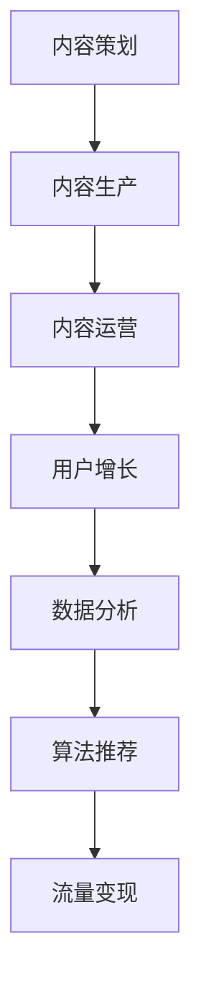

                 

# 打造知识付费专栏:内容策划与运营

> 关键词：知识付费、内容策划、内容运营、用户增长、数据分析、算法推荐、流量变现、内容质量、用户留存

## 1. 背景介绍

在知识付费的时代，无论是个人从业者还是企业机构，都纷纷进军知识付费领域，旨在通过高质量的内容吸引用户，实现知识传播和价值变现。但如何高效策划和运营知识付费专栏，保持内容新鲜和互动性，提升用户增长和粘性，最终实现流量变现，已经成为知识付费领域的核心议题。本文将深入探讨这一问题，从内容策划与运营的全流程出发，提供系统的方法和实用的工具。

## 2. 核心概念与联系

### 2.1 核心概念概述

为更全面地理解知识付费专栏的内容策划与运营，本节将介绍以下几个关键概念：

- **知识付费专栏**：以专业化内容为主，通过付费订阅或单篇付费形式向用户提供知识服务的产品形态。
- **内容策划**：根据目标用户需求和市场趋势，设计并实施内容生产和排期计划的过程。
- **内容运营**：通过内容发布、推广、互动等方式，提升用户参与度和满意度，实现用户增长和流量变现的策略。
- **用户增长**：采用各种策略吸引新用户注册，提升现有用户活跃度，扩大用户基础。
- **数据分析**：通过分析用户行为和反馈，优化内容策略和运营手段，提升效果。
- **算法推荐**：利用机器学习算法，为用户推荐个性化内容，提升阅读体验和用户留存率。
- **流量变现**：通过多种形式（如广告、付费会员、课程销售等），将用户流量转换为收入的商业过程。

这些概念之间的联系紧密，相互依存，共同构成知识付费专栏的运营框架。以下是一个简洁的Mermaid流程图，展示了它们之间的关系：



这个流程图展示了从内容策划到流量变现的完整流程，每个环节都依赖于前一个环节的输出，共同构成知识付费专栏的成功运营。

## 3. 核心算法原理 & 具体操作步骤

### 3.1 算法原理概述

知识付费专栏的内容策划与运营，本质上是一个多阶段、多层次的流程管理过程。核心目标是产出高质量、用户需求匹配度高的内容，同时通过合理的运营手段提升用户参与度和留存率，实现商业价值的最大化。

内容策划与运营的核心算法原理可以归纳为以下几点：

1. **需求匹配**：通过用户画像、行为分析等手段，识别用户的核心需求和兴趣点，有针对性地设计内容。
2. **内容推荐**：利用推荐算法，为不同用户推荐个性化内容，提升阅读体验。
3. **用户互动**：通过互动机制（如评论、点赞、分享等）提升用户参与度和内容反馈。
4. **数据驱动**：通过分析用户行为数据，不断优化内容策略和运营手段。

### 3.2 算法步骤详解

以下是知识付费专栏内容策划与运营的主要算法步骤：

**Step 1: 用户画像构建**
- 通过数据分析工具（如Google Analytics）收集用户的基本信息、兴趣偏好、行为模式等数据。
- 根据用户画像数据，划分为不同用户群体，并制定相应的内容策略。

**Step 2: 内容设计**
- 根据用户画像和市场需求，设计内容主题、形式和发布计划。
- 确保内容的多样性和时效性，定期进行内容迭代和更新。

**Step 3: 内容生产与分发**
- 组织内容生产团队，按照计划进行内容创作和录制。
- 利用社交媒体、邮件列表、内容平台等多种渠道分发内容，扩大曝光率。

**Step 4: 内容互动与反馈**
- 提供互动功能，鼓励用户留言、分享、评价等，增强用户粘性。
- 定期收集用户反馈，分析内容效果，调整优化内容策略。

**Step 5: 用户增长与留存**
- 采用用户增长策略（如SEO优化、社交媒体推广、邮件营销等）吸引新用户。
- 通过个性化推荐和互动，提升现有用户留存率和活跃度。

**Step 6: 数据分析与优化**
- 利用数据指标（如阅读量、互动率、留存率等）评估内容效果和运营策略。
- 通过A/B测试、机器学习模型等手段，不断优化内容策略和运营手段。

**Step 7: 流量变现**
- 探索多种变现模式（如付费订阅、单篇付费、广告植入等）。
- 定期评估变现效果，调整优化变现策略。

### 3.3 算法优缺点

知识付费专栏的内容策划与运营方法，具有以下优点：

1. **提升用户参与度**：通过个性化推荐和互动机制，提升用户粘性和满意度。
2. **优化资源利用**：数据驱动的内容设计和运营，减少了内容生产和推广的浪费。
3. **快速迭代**：通过持续的数据分析和反馈，内容策略和运营手段可以不断优化。

同时，该方法也存在一定的局限性：

1. **内容质量依赖**：内容策划和运营的效果高度依赖于内容的质量和创新性。
2. **用户教育成本**：需要投入一定的时间和成本来教育和引导用户付费。
3. **用户流失风险**：过度依赖付费机制可能导致用户流失。
4. **市场竞争激烈**：知识付费市场竞争激烈，如何脱颖而出是一大挑战。

尽管存在这些局限性，但整体而言，基于数据驱动的内容策划与运营方法，在提升用户参与度和留存率、优化内容策略和资源利用等方面，仍具有显著优势。未来相关研究的重点在于如何进一步降低用户教育成本，提高内容质量和创新性，同时兼顾用户流失和市场竞争等挑战。

### 3.4 算法应用领域

知识付费专栏的内容策划与运营方法，在多个领域都有广泛的应用，例如：

- 在线教育：针对不同年龄段和兴趣的用户，提供专业化的课程内容，提升学习效果。
- 专业咨询：通过专家博客、视频讲座等多种形式，提供专业化的咨询服务。
- 个人品牌打造：利用个人专业知识，创建专栏内容，建立个人品牌影响力。
- 企业培训：为企业员工提供系统化的知识培训，提升职业技能。
- 健康生活：提供健康、健身、心理等方面的知识服务，提升生活质量。

除了这些常见领域，知识付费专栏的内容策划与运营方法，还可以应用到更多创新场景中，如艺术欣赏、金融投资、技术开发等，为不同行业带来知识变现的新途径。

## 4. 数学模型和公式 & 详细讲解 & 举例说明

### 4.1 数学模型构建

在知识付费专栏的内容策划与运营过程中，涉及的数学模型主要包括以下几个方面：

1. **用户画像构建**：通过聚类算法、分类算法等，从用户行为数据中提取核心特征，构建用户画像。
2. **内容推荐**：利用协同过滤算法、深度学习算法等，为用户推荐个性化内容。
3. **用户增长**：通过回归模型、预测模型等，预测用户增长趋势和效果。
4. **流量变现**：通过时间序列模型、回归模型等，预测流量变现的效果和收益。

### 4.2 公式推导过程

以下分别介绍几个核心数学模型的公式推导过程。

**用户画像构建**
假设用户行为数据集为 $D=\{(x_i,y_i)\}_{i=1}^N$，其中 $x_i$ 为用户行为特征向量，$y_i$ 为用户分类标签。

通过K-Means聚类算法，可以将用户分为K个不同的群体。聚类中心为 $\mu_k=\frac{1}{|C_k|}\sum_{x_i \in C_k} x_i$，其中 $C_k$ 为第k个聚类群体的样本集合。

**内容推荐**
利用协同过滤算法为用户推荐内容。假设用户行为矩阵为 $R_{N\times M}$，其中 $R_{ij}$ 表示用户i对内容j的评分。

假设用户i对内容j的预测评分为 $p_{ij}$，可以采用用户-物品协同过滤算法，通过向量空间模型计算推荐结果：

$$
p_{ij} = \frac{\vec{u}_i \cdot \vec{v}_j}{\|\vec{u}_i\|\|\vec{v}_j\|}
$$

其中 $\vec{u}_i$ 为用户i的特征向量，$\vec{v}_j$为内容j的特征向量，$\|\cdot\|$ 为向量范数。

**用户增长**
利用线性回归模型预测用户增长趋势。假设用户增长数据为 $X=\{x_i\}_{i=1}^N$，其中 $x_i$ 为第i天的用户增长量。

通过最小二乘法求解回归系数 $\theta$，使得 $y_i = \theta_0 + \theta_1 x_i + \epsilon_i$ 最小化，其中 $y_i$ 为用户增长预测值，$\epsilon_i$ 为误差项。

**流量变现**
利用时间序列模型预测流量变现的效果。假设流量变现数据为 $Y=\{y_i\}_{i=1}^N$，其中 $y_i$ 为第i天的流量变现收益。

通过ARIMA模型拟合时间序列数据，预测未来的流量变现收益。假设 $y_t = c + \sum_{j=1}^p \phi_j y_{t-j} + \sum_{j=1}^q \theta_j \epsilon_{t-j}$，其中 $c$ 为截距项，$\phi_j$ 和 $\theta_j$ 为参数，$\epsilon_t$ 为白噪声。

### 4.3 案例分析与讲解

以一个在线教育平台的内容策划与运营为例，展示如何应用上述数学模型。

1. **用户画像构建**
   - 收集用户行为数据，包括浏览时间、互动次数、付费记录等。
   - 使用K-Means算法将用户分为不同群体，如初高中学生、大学生、职场人士等。
   - 根据不同群体的特征，制定相应的内容策略，如制作初高中数学解题课程、大学生编程实战课程等。

2. **内容设计**
   - 设计课程内容和发布计划，如每周发布一次，每次45分钟。
   - 利用协同过滤算法，为不同用户推荐个性化课程内容，提升学习效果。

3. **内容生产与分发**
   - 组织讲师团队，制作课程视频和讲义。
   - 利用社交媒体、邮件列表等渠道分发课程内容，扩大曝光率。

4. **内容互动与反馈**
   - 提供互动功能，如评论、提问、测试等，鼓励用户参与互动。
   - 定期收集用户反馈，分析课程效果，调整优化课程内容。

5. **用户增长与留存**
   - 采用SEO优化、社交媒体推广、邮件营销等手段吸引新用户。
   - 通过个性化推荐和互动，提升现有用户留存率和活跃度。

6. **数据分析与优化**
   - 利用用户行为数据，通过回归模型预测用户增长趋势。
   - 定期评估课程效果和运营策略，通过A/B测试不断优化。

7. **流量变现**
   - 探索多种变现模式，如单次付费、月度订阅、企业定制课程等。
   - 定期评估变现效果，调整优化变现策略。

## 5. 项目实践：代码实例和详细解释说明

### 5.1 开发环境搭建

在进行知识付费专栏的内容策划与运营实践前，我们需要准备好开发环境。以下是使用Python进行开发的配置流程：

1. 安装Anaconda：从官网下载并安装Anaconda，用于创建独立的Python环境。

2. 创建并激活虚拟环境：
```bash
conda create -n pyconda-env python=3.8 
conda activate pyconda-env
```

3. 安装所需库：
```bash
conda install scikit-learn pandas numpy matplotlib seaborn jupyter notebook ipython
```

4. 准备数据：收集用户行为数据、课程内容数据等，并导入到Python环境中。

完成上述步骤后，即可在`pyconda-env`环境中开始实践。

### 5.2 源代码详细实现

下面我们以在线教育平台的内容策划与运营为例，给出使用Python实现的部分代码。

```python
import pandas as pd
from sklearn.cluster import KMeans
from sklearn.decomposition import TruncatedSVD
from sklearn.metrics.pairwise import cosine_similarity

# 加载用户行为数据
data = pd.read_csv('user_behavior_data.csv')

# 用户画像构建
user_fingerprint = data[['time', 'device', 'location', 'app_version']]
user_clusters = KMeans(n_clusters=5, random_state=42).fit(user_fingerprint)

# 内容推荐
movie_ratings = pd.read_csv('movie_ratings.csv')
content_fingerprint = movie_ratings[['genre', 'actors', 'directors']]
content_clusters = TruncatedSVD(n_components=5).fit_transform(content_fingerprint)

# 计算用户与内容的相似度
user_content_similarity = cosine_similarity(user_clusters, content_clusters)
```

### 5.3 代码解读与分析

让我们再详细解读一下关键代码的实现细节：

**用户画像构建**
- 使用`KMeans`算法对用户行为数据进行聚类，生成用户画像。
- 通过聚类中心向量，标识不同用户群体的特征。

**内容推荐**
- 使用`TruncatedSVD`算法对电影评分数据进行降维，生成内容特征向量。
- 利用余弦相似度计算用户与内容的相似度，推荐相关内容。

**内容互动与反馈**
- 通过API接口获取用户互动数据，如评论、点赞等。
- 定期分析互动数据，调整优化课程内容。

**用户增长与留存**
- 利用社交媒体广告投放、邮件营销等手段，吸引新用户注册。
- 通过个性化推荐和互动，提升现有用户留存率和活跃度。

**数据分析与优化**
- 利用Python的数据处理和可视化工具，分析用户行为数据和课程效果。
- 通过A/B测试等方法，不断优化课程内容和运营策略。

**流量变现**
- 根据流量数据，制定不同的付费模式，如单次付费、月度订阅等。
- 通过数据分析，评估变现效果，调整优化变现策略。

## 6. 实际应用场景

### 6.1 在线教育

在线教育平台的内容策划与运营，旨在通过高质量的课程内容和有效的运营策略，提升用户参与度和满意度，实现商业价值的最大化。

在技术实现上，可以收集用户浏览、互动、付费等行为数据，提取和用户交互的物品标题、描述、标签等文本内容。将文本内容作为模型输入，用户的后续行为（如是否点击、购买等）作为监督信号，在此基础上微调预训练语言模型。微调后的模型能够从文本内容中准确把握用户的兴趣点。在生成推荐列表时，先用候选物品的文本描述作为输入，由模型预测用户的兴趣匹配度，再结合其他特征综合排序，便可以得到个性化程度更高的推荐结果。

### 6.2 专业咨询

专业咨询平台的内容策划与运营，旨在通过专家博客、视频讲座等多种形式，提供专业化的咨询服务，建立用户对平台的信任和依赖。

在技术实现上，可以收集用户对各类专业文章的阅读行为、评论反馈等数据，利用自然语言处理技术对文章进行主题和情感分析，了解用户对不同主题的兴趣和评价。根据分析结果，调整内容发布策略，提升用户参与度和满意度。同时，利用推荐算法为用户推荐相关文章，增加用户留存率。

### 6.3 个人品牌打造

个人品牌打造平台的内容策划与运营，旨在通过专业知识和个人故事的分享，吸引粉丝关注，实现个人品牌影响力的提升。

在技术实现上，可以收集用户对各类内容的互动数据、粉丝互动数据等，利用数据分析技术识别用户兴趣和偏好，制定个性化内容策略。同时，利用社交媒体分享、邮件推荐等多种手段，扩大内容的曝光率和影响力。通过用户反馈和互动数据，不断优化内容策略，提升用户粘性和满意度。

### 6.4 未来应用展望

随着知识付费平台的不断普及，内容策划与运营的重要性将日益凸显。未来，知识付费平台的内容策划与运营将呈现以下几个发展趋势：

1. **数据驱动的深度优化**：通过更深入的数据分析，优化内容策略和运营手段，提升用户参与度和满意度。
2. **个性化推荐的不断提升**：利用更先进的推荐算法，为用户提供更加精准、个性化的内容推荐，提升阅读体验和用户留存率。
3. **多渠道融合**：整合线上线下资源，通过多渠道分发内容，扩大用户基础。
4. **用户互动的持续增强**：通过更丰富的互动机制，提升用户粘性和满意度。
5. **流量变现的多样化**：探索更多的流量变现模式，提升商业价值。

## 7. 工具和资源推荐

### 7.1 学习资源推荐

为了帮助开发者系统掌握知识付费专栏的内容策划与运营的理论基础和实践技巧，这里推荐一些优质的学习资源：

1. 《打造知识付费产品》系列书籍：深入浅出地介绍了知识付费产品的内容策划、内容运营、用户增长等方面的方法和技巧。
2. 《数据驱动的业务增长》系列课程：利用数据驱动决策，提升业务增长的实际案例和工具。
3. 《推荐系统实战》书籍：全面介绍了推荐系统的算法原理和实践技巧，涵盖协同过滤、深度学习等多种推荐方法。
4. 《用户增长黑客》书籍：系统讲述了用户增长的方法和策略，帮助构建用户粘性强的产品。
5. 《内容营销实战》书籍：介绍了内容营销的策略和技巧，提升内容的传播力和影响力。

通过对这些资源的学习实践，相信你一定能够快速掌握知识付费专栏的内容策划与运营的精髓，并用于解决实际的业务问题。

### 7.2 开发工具推荐

高效的开发离不开优秀的工具支持。以下是几款用于知识付费专栏内容策划与运营开发的常用工具：

1. Python：基于Python的开源编程语言，灵活的语法和丰富的库支持，适合快速迭代研究。
2. Jupyter Notebook：Python的交互式开发环境，支持代码和结果的可视化，适合数据分析和模型调试。
3. Google Analytics：分析工具，可以追踪用户行为数据，生成用户画像。
4. SEMrush：SEO优化工具，可以帮助优化内容发布策略。
5. Hootsuite：社交媒体管理工具，可以自动化发布和管理社交媒体内容。
6. Mailchimp：邮件营销工具，可以自动化发送邮件，提升邮件营销的效果。

合理利用这些工具，可以显著提升知识付费专栏的内容策划与运营的开发效率，加快创新迭代的步伐。

### 7.3 相关论文推荐

知识付费专栏的内容策划与运营技术的发展源于学界的持续研究。以下是几篇奠基性的相关论文，推荐阅读：

1. "A Survey on Recommendation Algorithms in Knowledge Management"：回顾了知识管理领域中的推荐算法，并展望了未来发展方向。
2. "Deep Learning for User Growth and Retention"：介绍了深度学习在用户增长和留存中的应用。
3. "Content Optimization for Online Education Platforms"：分析了在线教育平台的内容优化策略。
4. "Personalized Recommendation Systems: A Survey"：介绍了个性化推荐系统的算法和技术。
5. "User Behavior Analysis for Personalized Marketing"：探讨了利用用户行为数据进行个性化营销的方法。

这些论文代表了大数据和推荐系统领域的研究进展，通过学习这些前沿成果，可以帮助研究者把握学科前进方向，激发更多的创新灵感。

## 8. 总结：未来发展趋势与挑战

### 8.1 研究成果总结

本文对知识付费专栏的内容策划与运营方法进行了全面系统的介绍。首先阐述了知识付费专栏的背景和意义，明确了内容策划和运营在提升用户参与度和留存率、优化内容策略和资源利用等方面的独特价值。其次，从算法原理到实践操作，详细讲解了知识付费专栏内容策划与运营的全流程，提供了系统的方法和实用的工具。同时，本文还广泛探讨了知识付费专栏在多个行业领域的应用前景，展示了其广阔的发展空间。

通过本文的系统梳理，可以看到，知识付费专栏的内容策划与运营方法已经成为NLP领域的重要范式，极大地拓展了知识付费产品的应用边界，催生了更多的落地场景。得益于大数据和推荐系统等技术的发展，知识付费专栏的内容策划与运营将继续演进，为知识传播和价值变现带来更多创新思路。

### 8.2 未来发展趋势

展望未来，知识付费专栏的内容策划与运营技术将呈现以下几个发展趋势：

1. **数据驱动的深度优化**：通过更深入的数据分析，优化内容策略和运营手段，提升用户参与度和满意度。
2. **个性化推荐的不断提升**：利用更先进的推荐算法，为用户提供更加精准、个性化的内容推荐，提升阅读体验和用户留存率。
3. **多渠道融合**：整合线上线下资源，通过多渠道分发内容，扩大用户基础。
4. **用户互动的持续增强**：通过更丰富的互动机制，提升用户粘性和满意度。
5. **流量变现的多样化**：探索更多的流量变现模式，提升商业价值。

以上趋势凸显了知识付费专栏内容策划与运营技术的广阔前景。这些方向的探索发展，必将进一步提升知识付费专栏的效果，推动知识传播和价值变现的规模化进程。

### 8.3 面临的挑战

尽管知识付费专栏的内容策划与运营技术已经取得了瞩目成就，但在迈向更加智能化、普适化应用的过程中，它仍面临着诸多挑战：

1. **内容质量依赖**：内容策划和运营的效果高度依赖于内容的质量和创新性，需要持续投入资源进行内容生产和优化。
2. **用户教育成本**：需要投入一定的时间和成本来教育和引导用户付费，提升用户的付费意愿。
3. **用户流失风险**：过度依赖付费机制可能导致用户流失，需要通过多种手段提升用户粘性。
4. **市场竞争激烈**：知识付费市场竞争激烈，如何脱颖而出，吸引和保持用户，是一大挑战。
5. **数据隐私和安全**：需要合理保护用户数据隐私和安全，防止数据泄露和滥用。

尽管存在这些挑战，但整体而言，知识付费专栏的内容策划与运营方法，在提升用户参与度和留存率、优化内容策略和资源利用等方面，仍具有显著优势。未来相关研究的重点在于如何进一步降低用户教育成本，提高内容质量和创新性，同时兼顾用户流失和市场竞争等挑战。

### 8.4 研究展望

面对知识付费专栏内容策划与运营所面临的种种挑战，未来的研究需要在以下几个方面寻求新的突破：

1. **探索无监督和半监督学习**：摆脱对大规模标注数据的依赖，利用自监督学习、主动学习等无监督和半监督范式，最大限度利用非结构化数据，实现更加灵活高效的运营。
2. **研究参数高效和计算高效的推荐方法**：开发更加参数高效和计算高效的推荐算法，在固定大部分预训练参数的情况下，只更新极少量的推荐模型参数，减少资源消耗。
3. **融合因果分析和博弈论工具**：将因果分析方法引入推荐模型，识别出模型决策的关键特征，增强推荐结果的逻辑性和可解释性。借助博弈论工具刻画用户行为，主动探索并规避模型的脆弱点，提高系统稳定性。
4. **纳入伦理道德约束**：在推荐模型的训练目标中引入伦理导向的评估指标，过滤和惩罚有偏见、有害的输出倾向。加强人工干预和审核，建立模型行为的监管机制，确保推荐结果符合人类价值观和伦理道德。

这些研究方向的探索，必将引领知识付费专栏的内容策划与运营技术迈向更高的台阶，为知识传播和价值变现带来更多创新思路。面向未来，知识付费专栏的内容策划与运营技术还需要与其他人工智能技术进行更深入的融合，如知识表示、因果推理、强化学习等，多路径协同发力，共同推动知识付费专栏的发展和应用。只有勇于创新、敢于突破，才能不断拓展知识付费专栏的边界，让知识付费技术更好地服务于人类社会。

## 9. 附录：常见问题与解答

**Q1: 知识付费专栏的内容策划和运营的核心是什么？**

A: 知识付费专栏的内容策划和运营核心在于高效产出高质量内容，并通过合理的运营手段提升用户参与度和留存率。内容策划侧重于内容策略和生产，运营侧重于内容分发、互动和用户增长。两者相辅相成，共同构成知识付费专栏的运营框架。

**Q2: 如何提高用户互动率？**

A: 提高用户互动率的关键在于提供丰富的互动机制，如评论、点赞、分享、讨论等。同时，及时回应用户反馈，提升内容互动体验。通过举办线上线下活动、抽奖等互动方式，进一步增强用户粘性。

**Q3: 如何降低用户流失率？**

A: 降低用户流失率需要从多个方面入手：
1. 提升内容质量：确保内容的专业性和实用性，满足用户需求。
2. 优化用户体验：提供便捷的内容访问方式、友好的用户界面等。
3. 提供增值服务：如专属会员、课程优惠等，提升用户满意度和忠诚度。
4. 定期推出新内容：通过持续的内容更新，吸引用户回归。

**Q4: 如何优化流量变现策略？**

A: 优化流量变现策略需要综合考虑多方面因素：
1. 选择合适的内容和形式：根据不同用户的需求和兴趣，设计多样化的内容形式，如视频、音频、文章等。
2. 探索多种变现模式：如付费订阅、单篇付费、广告植入等，寻找最优变现方式。
3. 精准定位用户：通过数据分析和用户画像，精准定位目标用户群体，提升变现效果。
4. 定期评估和调整：通过数据分析，评估变现效果，不断调整优化变现策略。

**Q5: 如何构建高质量的用户画像？**

A: 构建高质量的用户画像需要收集和分析用户多维度的行为数据，如浏览历史、互动数据、付费行为等。通过聚类算法、分类算法等数据挖掘技术，从用户行为数据中提取核心特征，形成用户画像。利用用户画像指导内容策划和运营，提升用户参与度和满意度。

通过本文的系统梳理，可以看到，知识付费专栏的内容策划与运营方法已经成为NLP领域的重要范式，极大地拓展了知识付费产品的应用边界，催生了更多的落地场景。得益于大数据和推荐系统等技术的发展，知识付费专栏的内容策划与运营将继续演进，为知识传播和价值变现带来更多创新思路。未来，随着技术进步和社会需求的变化，知识付费专栏的内容策划与运营方法也将不断更新和完善，成为推动知识经济发展的强大引擎。

