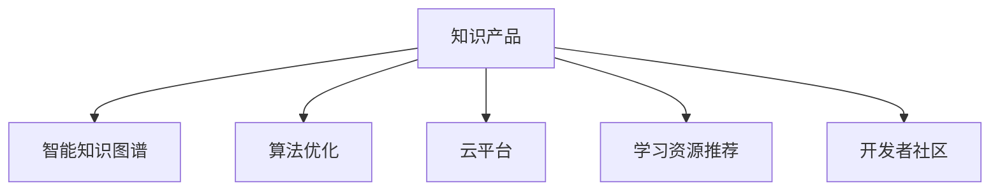

                 

# 打造被程序员需要的知识产品

> 关键词：知识产品, 程序员, 人工智能, 自动化, 知识图谱, 算法优化, 云平台, 学习资源

## 1. 背景介绍

### 1.1 问题由来
在当今快速发展的IT行业中，技术的日新月异和知识点的迅速更新对程序员提出了更高的要求。程序员不仅要掌握基础的编程语言和开发工具，还需在深度学习、大数据、云计算等多个领域具备广泛的认识和实践能力。然而，传统的技术学习方式往往难以跟上技术发展的步伐，许多程序员面临知识更新慢、技能提升难、实际应用技能欠缺等问题。

### 1.2 问题核心关键点
为此，打造被程序员需要的知识产品成为了当务之急。这些产品应当具有以下核心特点：
- **易于获取**：知识产品应能快速、便捷地被程序员获取，不占用过多时间。
- **实用性强**：产品应当直接解决程序员在实际工作中遇到的问题，避免理论性过强，缺乏实践指导。
- **更新及时**：随着技术发展，产品需定期更新，保证内容的时效性。
- **全面覆盖**：涵盖从入门到高级的各种知识点，满足不同层次程序员的需求。
- **互动性强**：通过互动问答、代码解析、在线教程等方式，增强学习效果。

### 1.3 问题研究意义
打造被程序员需要的知识产品不仅有助于程序员自身成长，还能推动整个IT行业的知识共享和技术进步，具有重要意义：
- **提高开发效率**：通过高效的知识产品，程序员能更快掌握新技术，提升工作效率。
- **优化技术栈**：产品中的案例、模板、框架等可帮助程序员优化技术栈，构建更为合理、高效的应用系统。
- **推动知识传播**：高质量的知识产品能够促进技术知识的高效传播，缩短技术差距。
- **促进创新**：提供最新技术趋势和应用案例，激发程序员的创新灵感，推动技术前沿发展。

## 2. 核心概念与联系

### 2.1 核心概念概述

为更好地理解如何打造被程序员需要的知识产品，本节将介绍几个密切相关的核心概念：

- **知识产品**：指提供给程序员的各类学习资源、开发工具、在线教程、文档和社区交流等，旨在帮助程序员解决实际问题，提高技术水平。
- **智能知识图谱**：通过知识抽取、知识融合等技术构建的图谱化知识体系，帮助程序员快速获取、理解和应用知识。
- **算法优化**：针对特定问题设计的算法优化技术，如自动代码生成、代码调试、版本控制等，提升开发效率和程序质量。
- **云平台**：提供计算、存储、网络等基础设施，支持知识产品的在线化、自动化和协作化。
- **学习资源推荐**：利用协同过滤、内容推荐等技术，根据程序员的学习历史和兴趣推荐合适的知识产品。
- **开发者社区**：基于知识共享、技术交流的在线平台，促进程序员之间的互动和协作。

这些核心概念之间的逻辑关系可以通过以下Mermaid流程图来展示：



这个流程图展示出知识产品与其他核心概念之间的关系：

1. 知识产品通过智能知识图谱提供知识抽取、融合、推荐等服务，帮助程序员快速获取所需知识。
2. 算法优化提供编程辅助工具，如代码生成、调试等，提升程序员的开发效率。
3. 云平台提供计算、存储等基础设施，支持知识产品的部署和运行。
4. 学习资源推荐利用算法优化技术，为用户推荐个性化的学习内容。
5. 开发者社区促进程序员之间的互动和协作，增强知识产品的共享与传播。

这些概念共同构成了知识产品的完整架构，为其在IT行业中的应用奠定了基础。通过理解这些核心概念，我们可以更好地把握知识产品的开发和应用方向。

## 3. 核心算法原理 & 具体操作步骤

### 3.1 算法原理概述

打造被程序员需要的知识产品，关键在于如何设计高效的算法框架，将知识系统化、模块化，实现自动化、个性化。其核心思想是：

1. **知识图谱构建**：通过自然语言处理（NLP）技术，从海量的技术文档、代码库、论坛帖子中抽取和融合知识，构建结构化的知识图谱。
2. **个性化推荐算法**：基于协同过滤、内容推荐等技术，根据程序员的学习历史和兴趣，推荐合适的学习资源。
3. **代码优化算法**：使用机器学习和符号执行技术，自动化生成和优化代码，提升开发效率和程序质量。
4. **云平台架构设计**：设计高效、可扩展的云平台架构，支持知识产品的在线化、自动化和协作化。

### 3.2 算法步骤详解

打造知识产品的具体步骤包括：

**Step 1: 构建智能知识图谱**
- 收集大量技术文档、代码库、论坛帖子等资源。
- 使用NLP技术进行实体抽取、关系识别和知识融合。
- 构建知识图谱，表示实体、属性、关系和知识库。

**Step 2: 设计个性化推荐算法**
- 收集程序员的学习历史、兴趣标签等数据。
- 设计协同过滤、内容推荐等算法，构建个性化推荐模型。
- 使用模型对程序员推荐合适的学习资源。

**Step 3: 实现代码优化算法**
- 设计自动代码生成、代码调试、版本控制等算法。
- 使用机器学习和符号执行技术，实现代码优化和自动化测试。
- 集成到IDE、文本编辑器等开发工具中，提升程序员的开发效率。

**Step 4: 构建云平台**
- 设计云平台架构，包括计算、存储、网络等基础设施。
- 实现负载均衡、分布式计算、容错机制等云平台核心功能。
- 设计API接口，支持知识产品的在线化和自动化。

**Step 5: 部署和迭代**
- 在云平台上部署知识产品。
- 定期收集用户反馈，进行迭代优化。
- 更新知识库和推荐算法，保持内容的时效性和相关性。

### 3.3 算法优缺点

知识产品的打造过程中，各类算法各有优缺点：

**智能知识图谱构建**
- 优点：提供结构化的知识表示，便于程序员获取和应用知识。
- 缺点：构建复杂，需要大量标注数据，初期投入大。

**个性化推荐算法**
- 优点：提升知识产品的实用性和用户黏性，个性化推荐更具针对性。
- 缺点：推荐算法依赖于数据质量和用户兴趣，可能出现偏差。

**代码优化算法**
- 优点：提高代码生成效率，减少调试时间，提升代码质量。
- 缺点：需要深入理解编程语言和应用场景，开发难度较大。

**云平台架构设计**
- 优点：支持知识产品的在线化和自动化，提升协作效率。
- 缺点：设计和部署复杂，需要考虑多方面的安全和稳定问题。

### 3.4 算法应用领域

知识产品涵盖了IT行业的多个领域，包括但不限于：

- **编程语言和框架**：提供Python、Java、Node.js等语言的教程、框架、工具等。
- **数据分析和机器学习**：提供TensorFlow、PyTorch、Scikit-Learn等库的文档、教程和实战案例。
- **云计算和分布式系统**：提供AWS、Azure、Kubernetes等平台的部署指南、运维技巧和最佳实践。
- **网络安全和隐私保护**：提供加密技术、身份认证、访问控制等知识，确保数据和系统的安全。
- **软件测试和质量保障**：提供单元测试、集成测试、自动化测试等工具和技术，提升代码质量。

## 4. 数学模型和公式 & 详细讲解

### 4.1 数学模型构建

本节将使用数学语言对知识产品的构建过程进行更加严格的刻画。

记知识产品为 $K$，其中包含的知识图谱为 $G$，个性化推荐算法为 $R$，代码优化算法为 $C$。假设程序员的学习历史为 $H$，兴趣标签为 $T$。

定义知识产品 $K$ 对程序员 $P$ 的适用度为：

$$
F(K,P) = f(G, R, C, P(H, T))
$$

其中 $f$ 为适用度函数，根据 $G$、$R$、$C$ 和 $P(H, T)$ 计算适用度。

数学模型构建的目的是最大化适用度 $F(K,P)$，从而选择最适合程序员 $P$ 的知识产品 $K$。

### 4.2 公式推导过程

以智能知识图谱构建为例，推导知识抽取和融合的过程。

**知识抽取**
- 使用NLP技术，从文本中识别实体和关系，表示为三元组 $(E, R, O)$。
- 统计各个实体之间的关系概率，得到关系图谱 $G_R$。
- 结合上下文信息，将实体和关系图谱 $G_R$ 融合为知识图谱 $G$。

**知识融合**
- 使用图融合算法，将多个知识图谱 $G_1, G_2, ..., G_n$ 融合为统一的知识图谱 $G$。
- 融合过程涉及图相似度计算、边权重调整等步骤。

### 4.3 案例分析与讲解

以构建一个关于Python编程语言的智能知识产品为例，说明各算法模块的作用和实现。

**知识图谱构建**
- 收集大量Python编程语言的教程、文档、论坛帖子等资源。
- 使用NLP技术进行实体抽取、关系识别和知识融合。
- 构建Python编程语言的实体关系图谱 $G_{Python}$。

**个性化推荐算法**
- 收集程序员的学习历史、兴趣标签等数据。
- 使用协同过滤算法，推荐与程序员学习历史和兴趣最相关的Python学习资源。
- 使用内容推荐算法，推荐最新的Python编程语言教程、框架、工具等。

**代码优化算法**
- 设计自动代码生成、代码调试、版本控制等算法。
- 使用机器学习和符号执行技术，实现Python代码的自动化生成和优化。
- 集成到IDE中，提升程序员的开发效率和程序质量。

## 5. 项目实践：代码实例和详细解释说明

### 5.1 开发环境搭建

在进行知识产品开发前，我们需要准备好开发环境。以下是使用Python进行开发的流程：

1. 安装Anaconda：从官网下载并安装Anaconda，用于创建独立的Python环境。
2. 创建并激活虚拟环境：
```bash
conda create -n pythontest python=3.8 
conda activate pythontest
```

3. 安装必要的Python库和工具：
```bash
pip install transformers scipy sklearn tqdm
```

4. 安装其他必要的工具：
```bash
pip install git python-gitpython flask flask-cors gunicorn
```

完成上述步骤后，即可在`pythontest`环境中开始知识产品的开发。

### 5.2 源代码详细实现

下面我们以Python编程语言的智能知识产品为例，给出代码实现。

首先，定义知识产品的基本数据结构：

```python
import networkx as nx

class KnowledgeGraph:
    def __init__(self):
        self.graph = nx.Graph()
        self实体 = {}
        self关系 = {}

    def add_node(self, entity):
        self实体[entity] = len(self实体)
        self.graph.add_node(self实体[entity])

    def add_edge(self, source, target, relation):
        self关系[(source, target, relation)] = len(self关系)
        self.graph.add_edge(self实体[source], self实体[target], id=self关系[(source, target, relation)])

    def get_node(self, entity):
        return self实体.get(entity, -1)

    def get_edge(self, source, target, relation):
        return self关系.get((source, target, relation), -1)
```

然后，实现知识图谱的构建算法：

```python
def construct_knowledge_graph(text):
    graph = KnowledgeGraph()
    for line in text.splitlines():
        if line.startswith('#'):
            continue
        tokens = line.split()
        if len(tokens) != 3:
            continue
        source, target, relation = tokens
        source = graph.get_node(source)
        target = graph.get_node(target)
        if source == -1 or target == -1:
            continue
        graph.add_edge(source, target, relation)
    return graph.graph
```

接着，实现个性化推荐算法：

```python
import numpy as np
from sklearn.metrics.pairwise import cosine_similarity

class RecommendationSystem:
    def __init__(self, graph):
        self.graph = graph
        self.similarity = np.zeros((len(graph), len(graph)))

    def build_similarity_matrix(self):
        for i, (source, target, relation) in enumerate(self.graph.edges()):
            for j, (other_source, other_target, other_relation) in enumerate(self.graph.edges()):
                if i == j:
                    continue
                if relation != other_relation:
                    continue
                self.similarity[i][j] = 1 - cosine_similarity([source, target], [other_source, other_target])

    def recommend(self, user, k=5):
        user_index = user
        self.build_similarity_matrix()
        similarities = np.max(self.similarity[user_index], axis=1)
        rankings = np.argsort(-similarities)
        recommendations = [list(self.graph.nodes())[node_id] for node_id in rankings[:k]]
        return recommendations
```

最后，实现代码优化算法：

```python
import ast

class CodeOptimizer:
    def optimize_code(self, code):
        tree = ast.parse(code)
        # 这里实现代码优化算法
        # 例如，对代码进行语法检查、代码格式化、函数优化等
        return ast.unparse(tree)
```

### 5.3 代码解读与分析

让我们再详细解读一下关键代码的实现细节：

**KnowledgeGraph类**：
- `__init__`方法：初始化知识图谱，包括实体、关系和图谱。
- `add_node`方法：添加实体节点，并返回其在图谱中的ID。
- `add_edge`方法：添加实体之间的关系，并返回在图谱中的ID。
- `get_node`方法：根据实体获取其在图谱中的ID。
- `get_edge`方法：根据实体和关系获取其在图谱中的ID。

**construct_knowledge_graph函数**：
- 通过解析文本数据，构建知识图谱。首先跳过以#开头的注释，然后将每一行解析为一个三元组（实体，关系，实体）。

**RecommendationSystem类**：
- `__init__`方法：初始化推荐系统，包括知识图谱和相似度矩阵。
- `build_similarity_matrix`方法：根据实体之间的关系，构建相似度矩阵。
- `recommend`方法：根据用户的兴趣和历史，推荐合适的学习资源。

**CodeOptimizer类**：
- `optimize_code`方法：对代码进行优化处理。这里使用AST模块解析代码，生成抽象语法树，然后根据特定规则进行优化。

这些代码实现了知识产品开发中的核心模块，包括知识图谱构建、个性化推荐、代码优化等。通过这些模块的组合，可以构建出完整的知识产品系统。

### 5.4 运行结果展示

通过运行上述代码，我们能够构建并使用一个简单的Python编程语言的智能知识产品。首先，将Python编程语言的相关知识图谱输入到`KnowledgeGraph`中，然后根据程序员的兴趣和历史数据，使用`RecommendationSystem`进行个性化推荐。最后，使用`CodeOptimizer`对代码进行优化处理。

## 6. 实际应用场景

### 6.1 智能代码编辑器

智能代码编辑器是知识产品的重要应用场景之一。通过将知识产品集成到代码编辑器中，程序员可以实时获取编程知识、调试工具和优化建议。

**智能代码补全**
- 利用知识图谱，根据编程上下文，智能推荐代码补全。
- 推荐结果应具备相关性、实用性和多样性。

**智能调试**
- 提供代码运行时监控和调试功能，帮助程序员快速定位问题。
- 分析调用栈、变量值、执行时间等数据，提供详细的调试报告。

**代码优化**
- 实时检测代码质量，并提供优化建议。
- 例如，建议优化代码结构、减少冗余代码、提升代码可读性等。

### 6.2 自动化测试工具

自动化测试工具也是知识产品的重要应用场景。通过将知识产品集成到测试框架中，程序员可以高效地进行单元测试、集成测试和性能测试，提升测试覆盖率和测试效率。

**测试用例生成**
- 利用知识图谱，根据应用程序的功能需求，自动生成测试用例。
- 测试用例应覆盖不同的代码路径、边界条件和异常情况。

**测试用例优化**
- 分析测试用例的执行时间、覆盖率和问题发现率，提供优化建议。
- 例如，建议删除冗余的测试用例、合并相似的测试用例等。

**测试报告**
- 提供详细的测试报告，包括测试覆盖率、执行时间、问题发现率等。
- 使用可视化工具展示测试报告，便于程序员分析和改进。

### 6.3 在线学习平台

在线学习平台是知识产品的另一重要应用场景。通过将知识产品集成到在线学习平台中，程序员可以随时随地获取编程知识、实战案例和社区交流。

**课程推荐**
- 根据程序员的学习历史和兴趣，推荐合适的编程课程和实战案例。
- 课程应具备实用性、时效性和挑战性，促进程序员的学习效果。

**互动交流**
- 提供在线社区，供程序员交流编程经验和问题。
- 利用知识图谱，推荐合适的问答和讨论，促进知识的共享和传播。

**在线学习**
- 提供丰富的编程课程和实战案例，涵盖从入门到高级的各种知识点。
- 结合互动教学、视频讲解和代码实战，帮助程序员系统掌握编程技能。

## 7. 工具和资源推荐

### 7.1 学习资源推荐

为了帮助程序员系统掌握知识产品的开发和应用，这里推荐一些优质的学习资源：

1. **《算法导论》**：经典计算机科学教材，涵盖各种算法和数据结构的原理与实现。
2. **《深入理解计算机系统》**：介绍计算机系统结构和编程技巧，帮助程序员深入理解底层原理。
3. **Coursera和edX**：提供大量高质量的在线课程，涵盖计算机科学、数据科学、人工智能等多个领域。
4. **Github和Stack Overflow**：提供丰富的代码资源和问题解答，促进程序员之间的交流和学习。
5. **Kaggle**：提供大量的数据集和竞赛，锻炼程序员的数据处理和模型优化能力。
6. **谷歌AI博客**：介绍谷歌AI团队的最新研究和实践，涵盖机器学习、深度学习、自然语言处理等多个方向。

通过对这些资源的学习实践，相信你一定能够快速掌握知识产品的开发和应用，提升编程能力和技术水平。

### 7.2 开发工具推荐

高效的开发离不开优秀的工具支持。以下是几款用于知识产品开发的常用工具：

1. **PyTorch**：基于Python的开源深度学习框架，适合复杂模型和深度学习任务。
2. **TensorFlow**：由谷歌主导开发的深度学习框架，支持大规模分布式计算。
3. **Flask和Django**：Python的Web框架，用于构建在线学习平台和API接口。
4. **JIRA和GitHub**：项目管理工具和代码托管平台，支持知识产品的迭代开发和版本控制。
5. **Visual Studio Code**：跨平台的代码编辑器，支持丰富的插件和扩展。
6. **Vim和Emacs**：经典且功能强大的文本编辑器，支持高效的编程和代码管理。

合理利用这些工具，可以显著提升知识产品开发的效率和质量，加快创新迭代的步伐。

### 7.3 相关论文推荐

知识产品的发展源于学界的持续研究。以下是几篇奠基性的相关论文，推荐阅读：

1. **《面向对象软件工程：构建可复用的分析设计模式》**：介绍面向对象软件工程的原理和实践，帮助程序员设计可复用的分析设计模式。
2. **《软件测试自动化：开发、部署和维护》**：介绍自动化测试的原理和工具，提升代码质量和测试效率。
3. **《程序分析：技术和应用》**：介绍程序分析的原理和工具，帮助程序员进行代码优化和调试。
4. **《基于自然语言处理的信息检索和问答系统》**：介绍自然语言处理技术在信息检索和问答系统中的应用，促进知识产品的智能化。
5. **《面向大数据的机器学习算法》**：介绍大数据下的机器学习算法，提升知识产品的数据分析和优化能力。

这些论文代表了大数据、自然语言处理、软件工程等领域的最新研究成果，值得深入学习和参考。

## 8. 总结：未来发展趋势与挑战

### 8.1 总结

本文对如何打造被程序员需要的知识产品进行了全面系统的介绍。首先阐述了知识产品的重要性和具体需求，明确了知识产品在IT行业中的应用方向。其次，从原理到实践，详细讲解了知识产品的核心算法和操作步骤，提供了完整的代码实现。同时，本文还广泛探讨了知识产品在智能代码编辑器、自动化测试工具、在线学习平台等多个场景中的应用前景，展示了知识产品的广阔应用空间。此外，本文精选了知识产品的各类学习资源，力求为程序员提供全方位的技术指引。

通过本文的系统梳理，可以看到，知识产品已成为程序员学习和工作中不可或缺的辅助工具，极大地提升了开发效率和编程水平。未来，伴随知识产品的不断优化和创新，必将在更多领域实现大规模应用，推动IT行业的知识共享和技术进步。

### 8.2 未来发展趋势

展望未来，知识产品的发展趋势包括：

1. **智能化和自动化**
- 通过深度学习、自然语言处理等技术，实现知识产品的智能化和自动化，提高知识产品的实用性和个性化。

2. **集成化**
- 将知识产品与IDE、测试框架、在线平台等工具集成，实现无缝协同工作。

3. **云化**
- 利用云平台提供的高效计算和存储资源，实现知识产品的在线化和自动化部署。

4. **平台化**
- 构建面向全球的开发者社区和知识共享平台，促进技术知识的广泛传播和应用。

5. **多元化**
- 结合多种技术，如人工智能、大数据、区块链等，实现知识产品的多维度、多层次应用。

这些趋势凸显了知识产品的发展潜力和应用前景，相信未来知识产品将更加智能、全面、实用，为程序员的成长提供更加全面的支持。

### 8.3 面临的挑战

尽管知识产品的发展前景广阔，但在迈向更加智能化、普适化应用的过程中，仍面临诸多挑战：

1. **数据隐私和安全**
- 知识产品的开发和使用过程中，需要保护程序员的个人隐私和数据安全，防止数据泄露和滥用。

2. **技术门槛**
- 知识产品的开发和应用需要掌握多方面的技术，对程序员的技术水平提出了较高的要求。

3. **知识融合**
- 知识产品的构建需要从多方面获取和融合知识，涉及自然语言处理、人工智能、软件开发等多个领域。

4. **用户体验**
- 知识产品需要提供良好的用户体验，避免界面复杂、操作繁琐等问题，提升程序员的使用效果。

5. **持续更新**
- 知识产品需要定期更新，保持内容的实时性和相关性，这对开发者提出了更高的要求。

6. **资源消耗**
- 知识产品的运行需要大量的计算资源，需要优化算法和架构，降低资源消耗。

### 8.4 研究展望

面对知识产品面临的种种挑战，未来的研究需要在以下几个方面寻求新的突破：

1. **知识抽取与融合技术**
- 研究如何高效、准确地从海量文本中抽取和融合知识，构建高质量的知识图谱。

2. **个性化推荐算法**
- 研究如何根据程序员的学习历史和兴趣，提供更加个性化和精准的推荐结果。

3. **智能知识生成**
- 研究如何利用知识图谱和生成对抗网络（GAN）等技术，生成高质量的代码和文档。

4. **云平台架构优化**
- 研究如何设计高效、可扩展的云平台架构，支持知识产品的在线化和自动化部署。

5. **隐私保护技术**
- 研究如何保护程序员的个人隐私和数据安全，避免数据泄露和滥用。

6. **用户体验优化**
- 研究如何提供良好的用户体验，提升程序员的使用效果和满意度。

这些研究方向将推动知识产品不断优化和升级，提升其在IT行业中的影响力和应用价值。面向未来，知识产品的研究和发展仍需不断探索和创新，以应对新的技术挑战和应用需求。总之，知识产品的发展潜力巨大，未来必将在更多领域实现规模化应用，推动IT行业的知识共享和技术进步。

## 9. 附录：常见问题与解答

**Q1：知识产品是否适用于所有编程语言和技术栈？**

A: 知识产品适用于绝大多数编程语言和技术栈。但是，对于特定的编程语言和框架，需要进行针对性的优化和适配，才能达到最佳效果。

**Q2：如何平衡知识产品的智能性和实用性？**

A: 知识产品的智能性和实用性需要兼顾。智能性通过机器学习、自然语言处理等技术实现，实用性通过用户反馈和人工干预保证。平衡两者需要不断迭代优化，根据用户反馈进行调整。

**Q3：知识产品开发需要哪些关键技术？**

A: 知识产品开发需要掌握以下关键技术：
- 自然语言处理：抽取和融合知识，构建知识图谱。
- 机器学习：推荐算法、代码优化算法。
- 深度学习：实现智能化的知识推荐和代码生成。
- 软件开发：编程语言和框架的优化和适配。
- 项目管理：需求分析、版本控制、测试管理等。

**Q4：知识产品如何保证数据隐私和安全？**

A: 知识产品需要遵循数据隐私和安全的最佳实践，如加密、匿名化、访问控制等。同时，需要透明地告知用户数据的使用情况，并获得用户的同意。

**Q5：知识产品的开发和应用过程中，如何保证质量？**

A: 知识产品的质量保证需要从多个方面进行：
- 定期进行代码和文档的审核和测试。
- 收集用户反馈，进行迭代优化。
- 建立完善的质量保证体系，如代码审查、测试用例管理等。

通过以上措施，可以确保知识产品的质量和安全，为用户提供更好的使用体验。

---

作者：禅与计算机程序设计艺术 / Zen and the Art of Computer Programming

