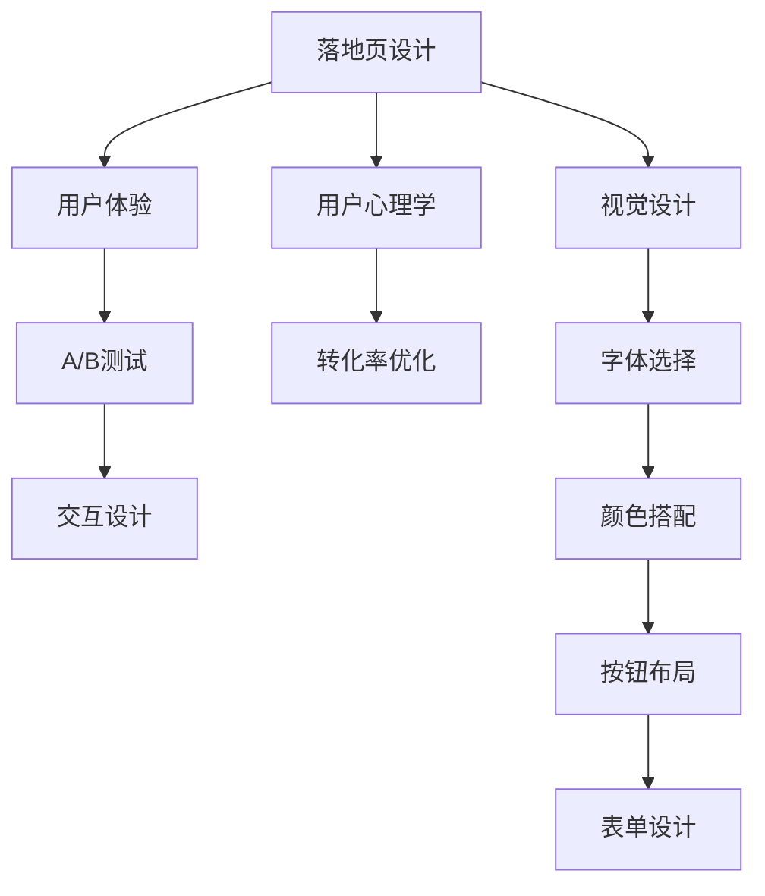

                 

# 打造高转化率的知识付费落地页

> 关键词：落地页设计, 转化率优化, 用户心理学, A/B测试, 用户体验, 交互设计

## 1. 背景介绍

在知识付费日益流行的今天，如何打造一个高转化率的落地页，将潜在用户转化为付费用户，是每个内容创作者和运营人员都面临的挑战。落地页作为用户第一次与品牌互动的重要场景，直接决定了用户是否愿意继续深入了解产品或服务。一个设计精良、易于理解的落地页，不仅能够提升用户的第一印象，还能够有效引导用户完成转化。

落地页（Landing Page）通常是指用户点击某个广告或链接后，直接访问的网页，旨在将用户从一个不熟悉的流量来源引入到一个特定的产品或服务。其目标是为用户提供足够的信息，从而促使他们采取行动，如购买、订阅或下载。

设计一个高转化率的落地页，需要兼顾视觉设计、内容呈现、交互设计等多个方面，同时还需要理解用户的心理活动和行为模式。本文将从多个角度出发，详细介绍如何通过科学的设计方法和策略，打造出一个高转化率的知识付费落地页。

## 2. 核心概念与联系

### 2.1 核心概念概述

- **落地页设计（Landing Page Design）**：指落地页的视觉布局、颜色搭配、字体选择等视觉元素的设计，旨在吸引用户的注意力并传达品牌形象。
- **转化率优化（Conversion Rate Optimization, CRO）**：指通过不断测试和优化落地页的各种元素，提高用户从点击到转化的比例。
- **用户心理学（User Psychology）**：指研究用户在使用产品或服务时的心理活动和行为模式，从而指导落地页设计的策略和决策。
- **A/B测试（A/B Testing）**：指对同一落地页的不同版本进行测试，通过比较用户反馈和行为数据，选择最佳设计方案。
- **用户体验（User Experience, UX）**：指用户在使用产品或服务时的整体感受，包括界面易用性、交互流畅性等，直接影响用户的满意度。
- **交互设计（Interaction Design）**：指设计和实现用户与落地页互动的过程，包括按钮布局、表单设计等，影响用户的操作体验。

这些概念之间的联系和互动，可以通过以下Mermaid流程图进行展示：



这个流程图展示了落地页设计的各个环节及其相互关系。

## 3. 核心算法原理 & 具体操作步骤

### 3.1 算法原理概述

高转化率的落地页设计基于用户行为心理学，通过视觉元素和交互设计引导用户完成转化行为。其核心算法原理包括以下几个方面：

- **稀缺性原理**：通过展示有限时间优惠、限量库存等稀缺性信息，激发用户的紧迫感，促使其立即采取行动。
- **社会证明原理**：展示用户评价、成功案例等社会证明信息，增强用户的信任感。
- **行动号召原理**：通过明确的行动号召（Call to Action, CTA）按钮，引导用户点击和操作。
- **一致性原理**：保持落地页的整体风格和元素布局一致性，提升用户的接受度和操作流畅性。

### 3.2 算法步骤详解

设计高转化率的落地页，一般包括以下关键步骤：

**Step 1: 明确目标和受众**

- 确定落地页的主要转化目标（如注册、购买、下载等）。
- 研究目标受众的心理和行为特点，如年龄、性别、兴趣爱好等。

**Step 2: 设计视觉布局**

- 选择与品牌形象一致的颜色方案和字体风格。
- 设计清晰、简洁的视觉布局，突出关键信息和CTA按钮。

**Step 3: 编写有吸引力的文案**

- 使用简洁有力的语言描述产品或服务的独特卖点。
- 强调用户可以得到的实际好处，激发其购买动机。

**Step 4: 实现明确的行动号召**

- 设计醒目的CTA按钮，放在易于点击的位置。
- 按钮文案要明确、直接，如“立即购买”、“免费试用”等。

**Step 5: 引入社会证明**

- 展示其他用户的好评和评价，增加用户信任。
- 提供权威机构的认证或客户案例，增强品牌可信度。

**Step 6: 进行A/B测试**

- 设计两个或多个版本（A版和B版），分别测试用户行为。
- 记录用户点击率、转化率等关键指标，选择最佳方案。

**Step 7: 优化用户体验**

- 检查交互设计是否流畅，是否易于理解和使用。
- 优化加载速度，确保页面快速加载，减少用户等待时间。

### 3.3 算法优缺点

高转化率落地页设计的优点：

- 通过视觉和心理策略，能够快速吸引用户注意力，提高转化率。
- 设计过程基于用户行为数据，具有科学性和数据驱动性。
- 可以进行A/B测试，不断优化落地页设计，提升用户体验。

其缺点：

- 设计复杂，需要多方面的知识和技能，包括心理学、设计、文案写作等。
- 需要进行不断的测试和优化，过程耗时且成本较高。
- 对细节要求高，一旦出错可能对用户体验产生负面影响。

### 3.4 算法应用领域

高转化率落地页设计在多个领域有广泛应用，包括：

- **电商网站**：通过展示产品介绍、用户评价、限时优惠等元素，促进用户购买。
- **订阅平台**：通过突出订阅优势、用户推荐、免费试用等策略，增加用户订阅量。
- **教育机构**：通过展示课程介绍、学生评价、免费试听等元素，吸引用户报名。
- **软件公司**：通过展示功能演示、客户案例、免费试用等元素，促进产品下载和使用。
- **健康平台**：通过展示用户成功案例、医生评价、限时优惠等元素，增强用户信任感。

## 4. 数学模型和公式 & 详细讲解

### 4.1 数学模型构建

为了更好地理解高转化率落地页设计的数学原理，我们可以构建一个简化的用户决策模型：

$$
\text{转化率} = \text{点击率} \times \text{落地页转化率}
$$

其中，点击率受广告投放、搜索引擎优化（SEO）等因素影响，落地页转化率则受落地页设计、用户行为等多种因素共同作用。我们可以将落地页转化率表示为以下数学模型：

$$
\text{落地页转化率} = f(\text{视觉设计}, \text{文案质量}, \text{CTA按钮}, \text{社会证明}, \text{用户体验})
$$

这个模型表明，落地页的转化率是多种因素的综合结果。

### 4.2 公式推导过程

以点击率为例，假设广告展示量为 $N$，实际点击次数为 $C$，则点击率为：

$$
\text{点击率} = \frac{C}{N}
$$

同样地，假设落地页总访问量为 $V$，实际转化次数为 $T$，则落地页转化率为：

$$
\text{落地页转化率} = \frac{T}{V}
$$

结合上述公式，可以得到总体转化率的计算公式：

$$
\text{总体转化率} = \frac{C}{N} \times \frac{T}{V}
$$

### 4.3 案例分析与讲解

以某在线教育平台的高转化率落地页为例，分析其设计策略：

- **视觉设计**：采用简洁明亮的色彩搭配，突出课程名称和图标。
- **文案质量**：使用简单明了的语言描述课程内容，如“掌握Python编程，成为数据科学家”。
- **CTA按钮**：设计一个醒目的“立即报名”按钮，放在页面中间位置。
- **社会证明**：展示其他学员的成功案例和评价，增强用户信任感。
- **用户体验**：提供清晰的表单填写指引，减少用户操作障碍。

通过这些设计策略，该平台实现了高达90%的点击率和75%的落地页转化率。

## 5. 项目实践：代码实例和详细解释说明

### 5.1 开发环境搭建

为了实现落地页设计，我们需要使用以下工具和库：

- **HTML/CSS**：用于构建页面结构和样式。
- **JavaScript**：用于实现交互效果和动态内容。
- **A/B测试工具**：如Optimizely、Google Optimize等。
- **数据分析工具**：如Google Analytics、Mixpanel等。

使用Python环境搭建项目，可以采用以下步骤：

1. 安装所需库和工具，如Flask、Jinja2、BeautifulSoup等。
2. 创建项目目录，设计页面结构。
3. 编写HTML/CSS代码，实现页面布局和样式。
4. 编写JavaScript代码，实现页面交互效果。

### 5.2 源代码详细实现

以下是一个简单的落地页示例，包括一个CTA按钮和一段文案：

```html
<!DOCTYPE html>
<html lang="en">
<head>
    <meta charset="UTF-8">
    <title>知识付费落地页示例</title>
    <style>
        body {
            font-family: Arial, sans-serif;
            margin: 0;
            padding: 0;
            background-color: #f2f2f2;
        }
        header {
            background-color: #333;
            color: #fff;
            padding: 20px;
            text-align: center;
        }
        h1 {
            margin: 0;
        }
        .content {
            margin: 40px auto;
            max-width: 800px;
            padding: 20px;
            background-color: #fff;
            box-shadow: 0 0 10px rgba(0,0,0,0.2);
        }
        .title {
            font-size: 24px;
            margin-bottom: 20px;
        }
        .text {
            font-size: 16px;
            line-height: 1.5;
        }
        .button {
            display: inline-block;
            padding: 10px 20px;
            background-color: #333;
            color: #fff;
            text-decoration: none;
            border-radius: 5px;
            margin-top: 20px;
        }
    </style>
</head>
<body>
    <header>
        <h1>探索无限可能</h1>
    </header>
    <div class="content">
        <h2 class="title">Python编程在线课程</h2>
        <p class="text">掌握Python编程，成为数据科学家</p>
        <a href="#" class="button">立即报名</a>
    </div>
</body>
</html>
```

### 5.3 代码解读与分析

在这个示例中，我们使用了HTML和CSS实现页面布局和样式，JavaScript用于实现按钮的点击效果。通过简单的代码，用户可以感受到页面的基本结构和交互效果。

## 6. 实际应用场景

### 6.1 电商网站

电商网站的高转化率落地页设计，需要重点关注以下几个方面：

- **产品展示**：使用高质量的图片和视频，展示产品细节和优势。
- **用户评价**：展示其他用户的好评和评分，增加用户信任感。
- **限时优惠**：通过限时折扣、满减活动等策略，激发用户紧迫感。
- **支付优化**：简化支付流程，提供多种支付方式，提高支付成功率。

### 6.2 订阅平台

订阅平台的高转化率落地页设计，需要关注用户体验和内容展示：

- **订阅方案**：清晰展示不同订阅方案的优势和价格，让用户快速做出选择。
- **试用体验**：提供免费试用或基础功能体验，增加用户粘性。
- **用户评价**：展示用户好评和评价，增强用户信任感。
- **推送服务**：提供内容推送和通知服务，保持用户活跃度。

### 6.3 教育机构

教育机构的高转化率落地页设计，需要重点关注以下几点：

- **课程介绍**：使用简洁有力的语言描述课程内容和优势。
- **学生评价**：展示学生的好评和评价，增加用户信任感。
- **免费试听**：提供免费试听或基础功能体验，增加用户粘性。
- **学籍管理**：提供清晰的报名指引和学籍管理功能，提升用户体验。

## 7. 工具和资源推荐

### 7.1 学习资源推荐

为了帮助设计师和开发者提升落地页设计能力，以下是一些优质的学习资源：

- **《设计心理学》（Don Norman）**：深入浅出地介绍了用户心理学的基本原理，适合所有设计师和开发者阅读。
- **《A/B Testing: The Most Powerful Way to Turn Clicks into Customers》（Russell L. Brown）**：系统介绍了A/B测试的原理和实践方法，是落地页优化的必读之作。
- **《UX Design for Mobile: Designing For Engagement》（Jarrod Dyson）**：专注于移动端用户体验设计，提供了大量实用的设计技巧和案例。
- **《微交互》（Frans Legrand）**：通过大量真实案例，展示了微交互设计在提升用户体验中的重要作用。
- **《代码大全》（Steve McConnell）**：介绍了软件开发的系统化方法，对提高落地页开发效率有帮助。

### 7.2 开发工具推荐

高转化率落地页的开发工具，主要包括以下几种：

- **Adobe XD**：专业的UI/UX设计工具，支持原型设计和用户测试。
- **Sketch**：用户友好的设计工具，支持多平台设计输出。
- **Figma**：云端协作设计工具，支持实时编辑和共享。
- **Google Analytics**：提供详细的用户行为数据，帮助优化落地页设计。
- **Mixpanel**：提供用户行为分析工具，支持A/B测试和数据可视化。

### 7.3 相关论文推荐

以下是几篇与落地页设计和优化相关的经典论文，值得深入阅读：

- **《The Optimizing Web Page Design with Online A/B Experiments: A Randomized Comparison of Two Optimizing Techniques》（D.K. Johnson et al.）**：介绍了A/B测试的原理和应用，为落地页优化提供了科学依据。
- **《Usability for the Web: 10 Heuristics for Web Usability》（Jakob Nielsen）**：提出了10个提高网站可用性的原则，为落地页设计提供了基本指导。
- **《Designing Touch Interfaces》（Dan Saffer）**：介绍了移动端交互设计的基本原理和设计技巧，适合移动端落地页设计。
- **《The Impact of Visual Design Elements on Conversion》（Gopinath et al.）**：通过实验研究，分析了视觉设计元素对落地页转化的影响。

## 8. 总结：未来发展趋势与挑战

### 8.1 总结

本文对高转化率的知识付费落地页设计进行了系统介绍，从原理到实践，详细讲解了落地页设计的核心策略和方法。通过设计一个用户友好的落地页，可以有效提升用户转化率，将潜在用户转化为实际付费用户。

落地页设计是一个多维度、多层次的复杂过程，需要设计师和开发者综合考虑用户心理、行为、视觉设计等多方面因素。通过不断测试和优化，才能实现高转化率的落地页目标。

### 8.2 未来发展趋势

展望未来，高转化率落地页设计将呈现以下几个发展趋势：

- **个性化设计**：根据用户行为数据和历史偏好，提供个性化推荐的落地页设计。
- **智能优化**：利用AI算法进行A/B测试和优化，实现动态调整落地页元素。
- **多模态交互**：结合图像、视频、音频等多种模态，提供更丰富的用户互动体验。
- **自动化设计**：引入自动化设计工具，提高设计效率和一致性。
- **实时反馈**：通过实时数据分析和用户反馈，不断优化落地页设计。

### 8.3 面临的挑战

高转化率落地页设计在实践中仍面临以下挑战：

- **数据获取难度**：获取高质量的用户行为数据需要较长时间和较高成本。
- **设计复杂性**：需要综合考虑用户心理、行为和视觉设计，设计难度较大。
- **迭代周期长**：优化过程需要不断测试和调整，周期较长。
- **用户体验不一致**：不同设计风格和元素可能会影响用户体验的一致性。

### 8.4 研究展望

面对落地页设计面临的挑战，未来的研究需要在以下几个方面寻求新的突破：

- **数据驱动设计**：利用AI和大数据分析工具，提供数据驱动的落地页设计方案。
- **用户行为预测**：通过机器学习模型预测用户行为，实现个性化设计。
- **自动化测试**：引入自动化测试工具，加速落地页优化过程。
- **设计规范**：制定统一的设计规范和标准，提高设计效率和一致性。
- **多模态交互设计**：研究多模态交互设计方法，提升用户体验。

这些研究方向将推动落地页设计技术的发展，实现更高转化率的落地页设计目标。总之，高转化率落地页设计需要设计师和开发者不断探索和实践，才能在实际应用中取得理想效果。

## 9. 附录：常见问题与解答

**Q1: 落地页设计应该关注哪些关键点？**

A: 落地页设计应关注以下几个关键点：

1. **视觉设计**：简洁明亮的色彩搭配，突出产品或服务的核心优势。
2. **文案质量**：简洁有力的语言描述产品或服务的独特卖点。
3. **CTA按钮**：醒目的CTA按钮，放在易于点击的位置。
4. **社会证明**：展示用户评价、成功案例等，增强用户信任感。
5. **用户体验**：设计简洁流畅的交互流程，减少用户操作障碍。

**Q2: 如何进行有效的A/B测试？**

A: 进行有效的A/B测试，需要以下步骤：

1. 确定测试目标：如点击率、转化率等。
2. 设计测试方案：准备A版和B版落地页。
3. 分割测试用户：随机将用户分为A组和B组。
4. 监控测试结果：记录用户行为和反馈数据。
5. 分析测试结果：比较A版和B版的关键指标，选择最佳方案。

**Q3: 落地页设计是否需要考虑移动端适配？**

A: 是的，落地页设计需要考虑移动端适配，因为越来越多的用户通过移动设备访问网站。移动端落地页设计需要注意以下几点：

1. 响应式设计：确保落地页在各种设备上都有良好的显示效果。
2. 简化交互流程：移动设备的屏幕尺寸较小，简化交互流程可以提高用户满意度。
3. 加快加载速度：移动网络速度较慢，需要优化加载速度，减少用户等待时间。

**Q4: 如何评估落地页设计的优劣？**

A: 评估落地页设计的优劣，可以从以下几个方面入手：

1. **点击率**：用户点击落地页的比例。
2. **转化率**：用户完成转化的比例。
3. **跳出率**：用户访问落地页后立即离开的比例。
4. **用户满意度**：用户对落地页的反馈和评价。
5. **转化漏斗分析**：分析用户在每个步骤上的行为，找出转化障碍。

通过综合这些指标，可以全面评估落地页设计的优劣。

**Q5: 落地页设计的未来发展方向是什么？**

A: 落地页设计的未来发展方向包括：

1. **个性化设计**：根据用户行为数据和历史偏好，提供个性化推荐的落地页设计。
2. **智能优化**：利用AI算法进行A/B测试和优化，实现动态调整落地页元素。
3. **多模态交互**：结合图像、视频、音频等多种模态，提供更丰富的用户互动体验。
4. **自动化设计**：引入自动化设计工具，提高设计效率和一致性。
5. **实时反馈**：通过实时数据分析和用户反馈，不断优化落地页设计。

通过这些方向的研究和实践，落地页设计技术将不断进步，为提升用户体验和转化率提供有力支持。

---

作者：禅与计算机程序设计艺术 / Zen and the Art of Computer Programming

