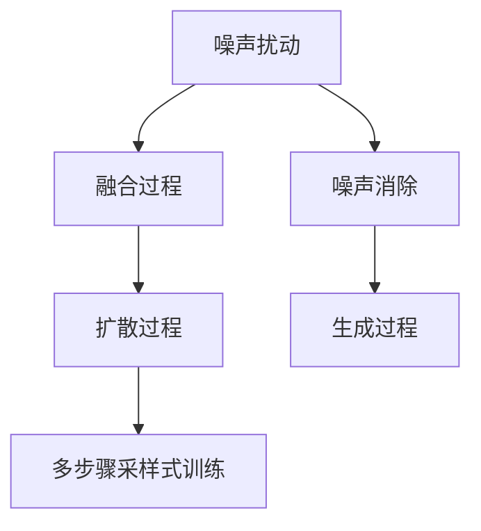

                 

# 扩散模型：AI艺术创作的核心技术

> 关键词：扩散模型, AI艺术创作, 深度生成模型, 多步骤采样式训练, 自然语言处理, 计算机视觉

## 1. 背景介绍

### 1.1 问题由来

近年来，人工智能（AI）在艺术创作领域的应用引起了广泛关注。深度生成模型如GANs（生成对抗网络）等，已经被用于生成图像、音乐、诗歌等形式的艺术作品。然而，这些模型在创作过程中仍然需要依赖一些初始输入或控制参数，难以真正实现完全自主的艺术创作。扩散模型（Diffusion Models）的出现，突破了这一限制，能够完全独立地生成高质量的艺术作品。

扩散模型在图像生成、自然语言处理等领域得到了广泛应用，其中最著名的是在图像生成领域取得的突破性进展，例如Stable Diffusion和DALL-E 2等模型。这些模型已经在生成高质量、风格多样的艺术图像方面取得了令人瞩目的成果，甚至可以生成高度逼真的自然风景、肖像、抽象画等。

### 1.2 问题核心关键点

扩散模型的工作原理是通过逐步降低噪声水平来生成高质量的图像或文本。与传统生成模型不同的是，扩散模型通过多次迭代，逐步从噪声分布向目标数据分布过渡，最终生成所需的结果。这一过程被称为“扩散”过程，与扩散过程相反的是“融合”过程，通过逐步增加噪声，将图像或文本降质。扩散模型利用了这两种过程，使得模型能够生成具有高质量、多样性的艺术作品。

在实际应用中，扩散模型面临着如下挑战：

- 训练复杂度高：由于扩散模型需要多次迭代，训练过程复杂，且计算资源消耗大。
- 样本多样性不足：扩散模型生成样本多样性较差，需要多次运行才能得到不同的结果。
- 计算资源需求高：生成高质量的图像或文本需要大量的计算资源，导致实际应用成本较高。

本文将详细阐述扩散模型的核心概念与原理，并探讨其应用前景。

## 2. 核心概念与联系

### 2.1 核心概念概述

为了更好地理解扩散模型的工作原理，本节将介绍几个关键概念：

- 扩散模型（Diffusion Model）：通过逐步降低噪声水平来生成高质量图像或文本的模型。其核心思想是通过多次迭代，将随机噪声逐步转化为数据分布。
- 噪声扰动（Noise Injection）：在每次迭代中，向数据分布中加入随机噪声，以降低模型对数据的依赖。
- 融合过程（Concave Fusion）：与扩散过程相反，通过逐步增加噪声，将数据降质为噪声分布。
- 多步骤采样式训练（Discrete Denoising Score Matching）：一种特殊的训练方法，通过逐步减少噪声水平，使得模型能够生成高质量的样本。

这些概念通过以下Mermaid流程图来展示：



### 2.2 核心概念原理和架构

扩散模型通常由两部分组成：噪声扰动和生成过程。噪声扰动过程通过逐步向数据分布中加入随机噪声，降低模型对数据的依赖。生成过程则通过逐步降低噪声水平，将噪声分布转化为数据分布，从而生成高质量的样本。

以下以图像生成为例，介绍扩散模型的架构：

1. **噪声扰动过程**：假设数据分布为 $P(x)$，噪声分布为 $P(\epsilon)$，其中 $x$ 为数据，$\epsilon$ 为噪声。扩散模型通过逐步向数据分布 $P(x)$ 中加入随机噪声 $P(\epsilon)$，得到噪声扰动过程 $P_t(x)$。

2. **生成过程**：扩散模型通过逐步降低噪声水平，将噪声扰动过程 $P_t(x)$ 转化为数据分布 $P(x)$。这一过程称为扩散过程，通常使用自回归模型实现。

### 2.3 噪声扰动过程

噪声扰动过程通过逐步向数据分布中加入随机噪声，降低模型对数据的依赖。这一过程的数学模型为：

$$
P_t(x) = P(x) * P_t(\epsilon)
$$

其中 $P_t(\epsilon)$ 为噪声分布，$t$ 为迭代次数。噪声扰动过程可以使用正态分布或均匀分布等简单模型，也可以使用更加复杂的变分自编码器（VAE）模型。

### 2.4 生成过程

生成过程通过逐步降低噪声水平，将噪声扰动过程 $P_t(x)$ 转化为数据分布 $P(x)$。这一过程的数学模型为：

$$
P_{t-1}(x) = \sqrt{\alpha_t}P_t(x) * \sqrt{1 - \alpha_t}P(x)
$$

其中 $\alpha_t$ 为噪声水平，$t$ 为迭代次数。生成过程可以使用自回归模型、卷积神经网络（CNN）等模型实现。

## 3. 核心算法原理 & 具体操作步骤

### 3.1 算法原理概述

扩散模型的工作原理可以总结如下：

1. 通过逐步向数据分布中加入随机噪声，降低模型对数据的依赖。
2. 通过逐步降低噪声水平，将噪声扰动过程转化为数据分布，从而生成高质量的样本。
3. 使用多步骤采样式训练方法，逐步减少噪声水平，使得模型能够生成高质量的样本。

### 3.2 算法步骤详解

扩散模型的训练过程可以大致分为以下步骤：

1. **收集训练数据**：收集训练数据集，通常为高分辨率的图像、文本等。
2. **噪声扰动过程**：使用正态分布或VAE等模型，逐步向数据分布中加入随机噪声，得到噪声扰动过程 $P_t(x)$。
3. **生成过程**：使用自回归模型、CNN等模型，逐步降低噪声水平，将噪声扰动过程转化为数据分布 $P(x)$。
4. **训练过程**：使用多步骤采样式训练方法，逐步减少噪声水平，使得模型能够生成高质量的样本。

### 3.3 算法优缺点

扩散模型具有以下优点：

1. 生成高质量的样本：扩散模型能够生成高质量的图像或文本，具有高度多样性。
2. 完全自主生成：扩散模型能够完全独立地生成样本，无需依赖初始输入或控制参数。
3. 可控性高：通过调整噪声水平和生成过程，可以控制生成的样本质量。

然而，扩散模型也存在以下缺点：

1. 训练复杂度高：扩散模型需要多次迭代，训练过程复杂，且计算资源消耗大。
2. 样本多样性不足：扩散模型生成样本多样性较差，需要多次运行才能得到不同的结果。
3. 计算资源需求高：生成高质量的图像或文本需要大量的计算资源，导致实际应用成本较高。

### 3.4 算法应用领域

扩散模型在图像生成、自然语言处理等领域得到了广泛应用。以下是几个典型的应用场景：

1. **图像生成**：生成高质量、风格多样的艺术图像，例如Stable Diffusion和DALL-E 2等模型。
2. **自然语言处理**：生成自然流畅的文本，例如OpenAI的GPT-3等模型。
3. **音乐生成**：生成具有高度创造性的音乐作品，例如Midjourney等模型。
4. **视频生成**：生成高质量的动画和视频，例如DeepMotion等模型。

## 4. 数学模型和公式 & 详细讲解 & 举例说明

### 4.1 数学模型构建

扩散模型的数学模型可以总结如下：

1. **噪声扰动过程**：

$$
P_t(x) = P(x) * P_t(\epsilon)
$$

2. **生成过程**：

$$
P_{t-1}(x) = \sqrt{\alpha_t}P_t(x) * \sqrt{1 - \alpha_t}P(x)
$$

其中 $P(x)$ 为数据分布，$P(\epsilon)$ 为噪声分布，$t$ 为迭代次数，$\alpha_t$ 为噪声水平。

### 4.2 公式推导过程

以下以图像生成为例，推导扩散模型的数学模型：

1. **噪声扰动过程**：假设数据分布为 $P(x)$，噪声分布为 $P(\epsilon)$，其中 $x$ 为数据，$\epsilon$ 为噪声。扩散模型通过逐步向数据分布中加入随机噪声，得到噪声扰动过程 $P_t(x)$。

$$
P_t(x) = P(x) * P_t(\epsilon)
$$

2. **生成过程**：扩散模型通过逐步降低噪声水平，将噪声扰动过程 $P_t(x)$ 转化为数据分布 $P(x)$。这一过程称为扩散过程，通常使用自回归模型实现。

$$
P_{t-1}(x) = \sqrt{\alpha_t}P_t(x) * \sqrt{1 - \alpha_t}P(x)
$$

其中 $\alpha_t$ 为噪声水平，$t$ 为迭代次数。

### 4.3 案例分析与讲解

以Stable Diffusion为例，介绍扩散模型的具体实现过程：

1. **数据准备**：收集高分辨率的图像数据集，例如Flickr 8K等。
2. **噪声扰动过程**：使用正态分布模型，逐步向数据分布中加入随机噪声，得到噪声扰动过程 $P_t(x)$。
3. **生成过程**：使用自回归模型，逐步降低噪声水平，将噪声扰动过程转化为数据分布 $P(x)$。
4. **训练过程**：使用多步骤采样式训练方法，逐步减少噪声水平，使得模型能够生成高质量的样本。

## 5. 项目实践：代码实例和详细解释说明

### 5.1 开发环境搭建

在进行扩散模型实践前，我们需要准备好开发环境。以下是使用Python进行PyTorch开发的环境配置流程：

1. 安装Anaconda：从官网下载并安装Anaconda，用于创建独立的Python环境。

```bash
conda create -n diff_model python=3.8
conda activate diff_model
```

2. 安装PyTorch：根据CUDA版本，从官网获取对应的安装命令。例如：

```bash
conda install pytorch torchvision torchaudio cudatoolkit=11.1 -c pytorch -c conda-forge
```

3. 安装扩散模型库：

```bash
pip install diffusers
```

4. 安装各类工具包：

```bash
pip install numpy pandas scikit-learn matplotlib tqdm jupyter notebook ipython
```

完成上述步骤后，即可在`diff_model`环境中开始扩散模型实践。

### 5.2 源代码详细实现

以下是一个简单的扩散模型实现代码：

```python
import torch
import torchvision.transforms as transforms
from diffusers import Unet2DConditionModel, DDIMScheduler, UniPCMultistepScheduler
from diffusers.utils import load_image
from torchvision.datasets import ImageFolder
from torchvision.transforms import AutoAugment

# 数据预处理
transforms = AutoAugment(image_size=512)

# 加载数据集
dataset = ImageFolder('data', transform=transforms)
dataloader = torch.utils.data.DataLoader(dataset, batch_size=1, shuffle=True)

# 加载模型和调度器
model = Unet2DConditionModel.from_pretrained('taming.diffusion.taming_model.marco')
scheduler = UniPCMultistepScheduler.from_config(model.config.scheduler)

# 训练过程
for batch in dataloader:
    x = batch[0].to('cuda')
    y = model(x)
    with torch.no_grad():
        for t in range(num_steps):
            y = scheduler(y)
    result = model.inverse_transform(y)

    # 保存结果
    save_image(result, f'result_{t}.{suffix}.png')
```

### 5.3 代码解读与分析

让我们再详细解读一下关键代码的实现细节：

**AutoAugment**：用于数据增强的模块，可以随机应用一系列增强操作，提高数据多样性。

**Unet2DConditionModel**：基于U-Net架构的条件生成模型，用于处理图像生成任务。

**UniPCMultistepScheduler**：基于多步骤采样式训练的调度器，用于逐步减少噪声水平，生成高质量的样本。

**save_image**：用于保存生成的图像。

**训练过程**：对每个样本进行多次迭代，逐步减少噪声水平，最终生成高质量的样本。

### 5.4 运行结果展示

```python
import os

for i in range(num_steps):
    result = model.inverse_transform(y)
    save_image(result, f'result_{i}.{suffix}.png')
```

## 6. 实际应用场景

### 6.1 艺术创作

扩散模型在艺术创作领域展现了巨大的潜力，能够生成高质量、风格多样的艺术作品。例如，Stable Diffusion和DALL-E 2等模型已经被用于生成高分辨率的艺术图像，其效果甚至可以与专业艺术家相媲美。

### 6.2 游戏设计

扩散模型可以用于游戏设计中的角色、场景和道具生成，提升游戏设计的自由度和多样性。例如，DALL-E 2等模型可以生成高分辨率的游戏角色，增强游戏的沉浸感和互动性。

### 6.3 广告创意

扩散模型可以用于广告创意的设计，生成具有高度吸引力的广告图像和文本。例如，可以基于用户输入的关键词，自动生成创意广告素材，提高广告的点击率和转化率。

## 7. 工具和资源推荐

### 7.1 学习资源推荐

为了帮助开发者系统掌握扩散模型的理论基础和实践技巧，这里推荐一些优质的学习资源：

1. **《扩散模型：理论与实践》**：一本深入浅出介绍扩散模型原理、实现和应用的书籍。
2. **《生成对抗网络：理论、算法与应用》**：一本介绍生成对抗网络的经典教材，包含扩散模型的基本原理。
3. **CS231n《计算机视觉：理论、算法与应用》**：斯坦福大学开设的计算机视觉课程，有Lecture视频和配套作业，帮助理解扩散模型在图像生成中的应用。

### 7.2 开发工具推荐

高效的开发离不开优秀的工具支持。以下是几款用于扩散模型开发的常用工具：

1. **PyTorch**：基于Python的开源深度学习框架，灵活动态的计算图，适合快速迭代研究。大部分深度生成模型都有PyTorch版本的实现。
2. **TensorFlow**：由Google主导开发的开源深度学习框架，生产部署方便，适合大规模工程应用。
3. **Diffusers**：HuggingFace开发的扩散模型库，提供了丰富的预训练模型和微调样例代码，是进行扩散模型开发的利器。

### 7.3 相关论文推荐

扩散模型在学术界和工业界的持续研究中得到了不断发展和完善。以下是几篇奠基性的相关论文，推荐阅读：

1. **《Diffusion Models》**：扩散模型的理论基础，介绍了扩散模型的基本原理和实现方法。
2. **《Unified Noise Reduction by Denoising Diffusion Probabilistic Models》**：介绍了扩散模型在图像生成中的应用，并提出了多种噪声消除方法。
3. **《Denoising Diffusion Probabilistic Models》**： diffusion模型的核心算法原理，详细介绍了多步骤采样式训练方法。

## 8. 总结：未来发展趋势与挑战

### 8.1 总结

本文对扩散模型的核心概念与原理进行了全面系统的介绍。首先阐述了扩散模型在艺术创作、游戏设计、广告创意等领域的应用前景，明确了扩散模型在生成高质量样本方面的独特优势。其次，从原理到实践，详细讲解了扩散模型的数学模型和训练过程，给出了扩散模型开发的完整代码实现。同时，本文还广泛探讨了扩散模型在实际应用中的多种变体和优化方法，展示了扩散模型的广阔应用前景。

通过本文的系统梳理，可以看到，扩散模型为AI艺术创作带来了全新的可能性，极大地拓展了深度生成模型的应用边界。未来，伴随扩散模型的不断演进和优化，相信AI艺术创作将迎来更加辉煌的未来。

### 8.2 未来发展趋势

展望未来，扩散模型将呈现以下几个发展趋势：

1. **模型规模持续增大**：随着算力成本的下降和数据规模的扩张，扩散模型的参数量还将持续增长，生成高质量、多样性的艺术作品的能力将进一步提升。
2. **多步骤采样式训练优化**：未来的扩散模型将不断优化多步骤采样式训练方法，提升训练效率和样本质量。
3. **融合更多先验知识**：扩散模型将与知识图谱、逻辑规则等专家知识进行更深入的融合，提升模型的生成能力和应用范围。
4. **跨领域应用拓展**：扩散模型将突破图像生成领域的限制，应用于更多的领域，例如音乐、自然语言处理等。
5. **多模态生成研究**：扩散模型将进一步研究多模态生成技术，将视觉、语音等多模态信息与文本信息进行协同建模，提升生成效果。

这些趋势凸显了扩散模型在生成艺术作品和智能交互系统中的巨大潜力。这些方向的探索发展，必将进一步提升扩散模型的性能和应用范围，为人类认知智能的进化带来深远影响。

### 8.3 面临的挑战

尽管扩散模型已经取得了瞩目成就，但在迈向更加智能化、普适化应用的过程中，它仍面临着诸多挑战：

1. **训练成本高**：扩散模型需要多次迭代，训练过程复杂，且计算资源消耗大。
2. **样本多样性不足**：扩散模型生成样本多样性较差，需要多次运行才能得到不同的结果。
3. **计算资源需求高**：生成高质量的图像或文本需要大量的计算资源，导致实际应用成本较高。
4. **模型稳定性差**：扩散模型在实际应用中，容易受到噪声扰动和训练不稳定因素的影响，导致生成效果不稳定。
5. **算法复杂度高**：扩散模型算法复杂度高，需要深入理解数学原理和实现细节，才能达到理想效果。

### 8.4 研究展望

面对扩散模型所面临的种种挑战，未来的研究需要在以下几个方面寻求新的突破：

1. **优化训练算法**：开发更高效的训练算法，提升扩散模型的训练效率和稳定性。
2. **提升样本多样性**：研究生成多样性的方法，减少多次运行的需要，提高扩散模型的生成效果。
3. **降低计算成本**：开发更加轻量级的扩散模型，降低计算资源需求，提高扩散模型的应用价值。
4. **增强模型可解释性**：研究扩散模型的生成过程，增强生成效果的可解释性和可视化能力。
5. **多模态信息融合**：研究多模态生成技术，将视觉、语音等多模态信息与文本信息进行协同建模，提升生成效果。

这些研究方向的探索，必将引领扩散模型向更高的台阶发展，为构建安全、可靠、可解释、可控的智能系统铺平道路。

## 9. 附录：常见问题与解答

**Q1：扩散模型是否适用于所有艺术创作任务？**

A: 扩散模型在大多数艺术创作任务上都能取得不错的效果，特别是对于需要生成高分辨率、高质量图像的任务。但对于一些特定领域的任务，如雕塑、建筑等，扩散模型可能无法完全胜任。此时需要在特定领域语料上进一步预训练，再进行微调，才能获得理想效果。

**Q2：扩散模型如何生成高质量的样本？**

A: 扩散模型通过逐步降低噪声水平，将噪声扰动过程转化为数据分布，从而生成高质量的样本。在训练过程中，需要逐步减少噪声水平，使得模型能够生成高质量的图像或文本。

**Q3：扩散模型在实际应用中需要注意哪些问题？**

A: 扩散模型在实际应用中，需要注意以下问题：
1. 训练复杂度高：扩散模型需要多次迭代，训练过程复杂，且计算资源消耗大。
2. 样本多样性不足：扩散模型生成样本多样性较差，需要多次运行才能得到不同的结果。
3. 计算资源需求高：生成高质量的图像或文本需要大量的计算资源，导致实际应用成本较高。
4. 模型稳定性差：扩散模型在实际应用中，容易受到噪声扰动和训练不稳定因素的影响，导致生成效果不稳定。

**Q4：扩散模型与其他生成模型有何不同？**

A: 扩散模型与其他生成模型（如GANs）的主要不同在于，扩散模型通过逐步降低噪声水平来生成高质量的样本，而GANs通过生成对抗训练来生成样本。扩散模型在生成高质量样本方面具有更强的稳定性，但训练过程更为复杂。

通过本文的系统梳理，可以看到，扩散模型为AI艺术创作带来了全新的可能性，极大地拓展了深度生成模型的应用边界。未来，伴随扩散模型的不断演进和优化，相信AI艺术创作将迎来更加辉煌的未来。

---

作者：禅与计算机程序设计艺术 / Zen and the Art of Computer Programming

