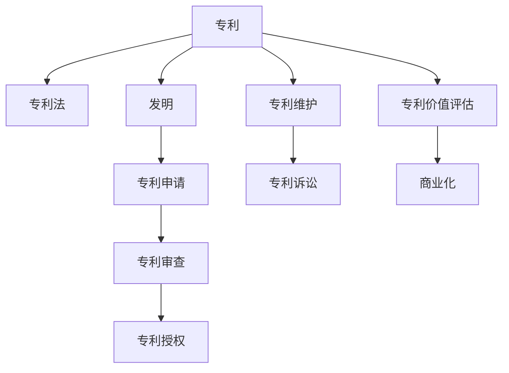
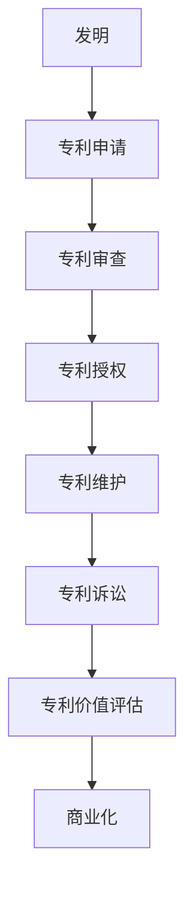

                 

# 技术专利申请：程序员的财富保护

## 1. 背景介绍

### 1.1 问题由来

在当今信息时代，技术的日新月异不仅带来了前所未有的创新与便利，也带来了前所未有的竞争与挑战。特别是在互联网、软件开发等领域，技术的迭代速度极快，优秀人才的流动性也很高。因此，程序员们面临的不仅仅是技术能力的提升，更是如何保护自己的核心竞争力和技术成果，将其转化为实际价值。

专利是知识产权的一种形式，是程序员保护自己技术成果的重要工具。它不仅能够保护程序员的思想创新，防止被他人抄袭或盗用，还能够通过专利授权或出售，实现技术的商业化价值，带来丰厚的经济收益。然而，专利申请是一个复杂且繁琐的过程，涉及到许多专业知识，需要程序员具备一定的法律和技术素养。

### 1.2 问题核心关键点

- **专利申请流程**：了解专利申请的基本流程和要求，包括专利撰写、申请、审查等环节。
- **专利撰写技巧**：掌握专利撰写的基本规范和技巧，确保专利文档的完整性和质量。
- **专利保护范围**：理解专利保护的具体范围，明确技术方案的核心创新点。
- **专利维护与管理**：了解专利的维护、到期更新、专利诉讼等管理方式。
- **专利价值评估**：学会评估专利的技术价值、市场价值和经济价值，为商业化奠定基础。

## 2. 核心概念与联系

### 2.1 核心概念概述

为了更好地理解专利申请的过程，本节将介绍几个关键概念及其之间的联系：

- **专利**：由政府授予发明人或发明单位，在一定时间内对其技术发明的专有使用权。
- **专利法**：规定专利申请、审查、保护和实施等过程的法律体系。
- **发明**：指技术上的新构思或新方法，可以是产品、过程、系统或改进。
- **专利申请**：向国家专利局提交正式的专利申请，提出技术方案并寻求专利保护的过程。
- **专利审查**：专利局对申请的技术方案进行形式审查和实质审查，确保其符合专利法的要求。
- **专利授权**：经过审查和公告，专利局正式授予发明人专利权，使其享有专利保护。

这些概念之间通过以下Mermaid流程图进行了逻辑联系的展示：



这个流程图展示了专利从发明到商业化的整体流程：

1. 通过发明创造出新技术。
2. 将技术通过专利申请提交给专利局。
3. 专利局对申请进行形式和实质审查。
4. 专利获得授权，保护发明人的技术。
5. 持续维护专利，确保其有效性。
6. 进行专利诉讼，保护自己的权益。
7. 评估专利价值，进行商业化。

### 2.2 核心概念原理和架构的 Mermaid 流程图



这个图进一步细化了专利申请的各个环节，展示了发明如何通过专利审查获得授权，并通过商业化转化为实际价值的全过程。

## 3. 核心算法原理 & 具体操作步骤

### 3.1 算法原理概述

专利申请的算法原理主要基于以下几个关键点：

- **需求分析**：了解申请人的技术需求，明确要申请的专利类型（发明专利、实用新型专利或外观设计专利）。
- **技术交底书撰写**：根据技术方案编写详细的技术交底书，描述发明的创新点、实施方式和效果。
- **权利要求撰写**：根据技术交底书撰写权利要求书，明确专利保护的范围。
- **专利申请提交**：将完整的申请文件提交给国家专利局。
- **专利审查**：专利局进行形式审查和实质审查，判断发明是否具备新颖性、创造性和实用性。
- **专利授权**：专利局发布授权公告，申请人获得专利权。

### 3.2 算法步骤详解

基于以上算法原理，专利申请的具体步骤如下：

1. **需求分析**：
   - 识别和评估技术需求，了解技术方案的核心创新点。
   - 确定专利类型，选择发明专利、实用新型专利或外观设计专利。

2. **技术交底书撰写**：
   - 详细描述技术方案，包括背景技术、发明内容、具体实施方式、预期效果等。
   - 确保技术交底书内容清晰、全面、具体，便于理解。

3. **权利要求撰写**：
   - 根据技术交底书，撰写权利要求书，明确专利保护的范围。
   - 权利要求书需满足专利法的要求，确保创新点的描述具体、明确。

4. **专利申请提交**：
   - 准备申请文件，包括技术交底书、权利要求书、说明书、附图等。
   - 在线提交申请，并缴纳申请费和审查费。

5. **专利审查**：
   - 形式审查：检查申请文件是否齐全、格式是否规范。
   - 实质审查：评估发明的新颖性、创造性和实用性，是否具备专利授权的条件。

6. **专利授权**：
   - 专利局发布授权公告，申请人获得专利权。
   - 获得专利权后，专利权人可以享受法律保护，防止他人未经授权使用其专利技术。

### 3.3 算法优缺点

基于以上算法步骤，专利申请的优缺点如下：

**优点**：
- **保护知识产权**：专利权人可以享受法律保护，防止他人未经授权使用其专利技术。
- **转化商业价值**：通过专利授权或出售，将技术转化为实际的商业价值。
- **提升竞争力**：专利申请是企业展示技术实力、提升市场竞争力的重要手段。

**缺点**：
- **流程复杂**：专利申请涉及多个环节，过程较为复杂，需要投入大量时间和精力。
- **费用高昂**：专利申请和维护需要缴纳一定的费用，对于一些中小企业可能存在经济压力。
- **不确定性**：专利审查存在不确定性，部分发明可能因不符合专利法要求而被驳回。

### 3.4 算法应用领域

专利申请的应用领域广泛，主要包括：

- **企业技术保护**：企业通过申请专利保护其技术成果，防止他人抄袭和盗用。
- **个人创新保护**：个人开发者通过申请专利保护其技术发明，防止知识产权被侵犯。
- **技术合作与转让**：企业之间通过专利授权或专利买卖进行技术合作与转让。
- **知识产权投资**：投资者通过购买专利权进行知识产权投资，获得收益。
- **国际贸易**：企业通过专利申请和授权，在国际贸易中获得竞争优势。

## 4. 数学模型和公式 & 详细讲解 & 举例说明

### 4.1 数学模型构建

专利申请的数学模型主要涉及以下几个方面：

- **新颖性分析**：判断发明是否具有新颖性，通过统计分析技术手段进行评估。
- **创造性分析**：判断发明是否具有创造性，通过比较分析技术手段进行评估。
- **实用性分析**：判断发明是否具有实用性，通过实验验证技术手段进行评估。

### 4.2 公式推导过程

以下是一个简单的数学模型推导示例，用于说明专利新颖性的评估：

假设有一项新的发明，其技术特征为$F$，现有技术中已有的相似发明为$F_1$和$F_2$，其技术特征分别为$F_{11}, F_{12}, F_{21}, F_{22}$。

- **新颖性判断公式**：
  $$
  N(F) = \frac{N(F_1 \cap F_2)}{N(F_1 \cup F_2)}
  $$
  其中$N(X)$表示集合$X$的元素个数。

- **解释**：如果$F$与$F_1$和$F_2$的交集不为空，则说明$F$不具有新颖性。如果$F$与$F_1$和$F_2$的并集等于$F_1 \cup F_2$，则说明$F$具有新颖性。

### 4.3 案例分析与讲解

以下是一个专利新颖性评估的案例分析：

假设有一项新的发明，其技术特征为“一种无线充电技术”。经过检索发现，现有技术中已有的无线充电技术为“Qi标准”和“PMA标准”。

- **新颖性分析**：
  - 发明的特征$F$为“无线充电技术”。
  - 现有技术$F_1$为“Qi标准”，特征$F_{11}, F_{12}$分别为“电磁感应充电”和“电磁耦合充电”。
  - 现有技术$F_2$为“PMA标准”，特征$F_{21}, F_{22}$分别为“无线传输充电”和“射频充电”。

- **判断**：
  - 计算$N(F \cap F_1)$和$N(F \cap F_2)$，如果为0，则发明具有新颖性。
  - 计算$N(F \cup F_1 \cup F_2)$，如果等于$N(F_1 \cup F_2)$，则发明具有新颖性。

## 5. 项目实践：代码实例和详细解释说明

### 5.1 开发环境搭建

要进行专利申请的开发，需要以下开发环境：

1. **Python编程环境**：如Anaconda，Python 3.7及以上版本。
2. **相关库**：如requests、BeautifulSoup、pandas等，用于网络爬取和数据处理。
3. **IDE**：如PyCharm、Visual Studio Code等，提供开发环境。

### 5.2 源代码详细实现

以下是一个简单的Python代码示例，用于从专利局网站上爬取专利数据：

```python
import requests
from bs4 import BeautifulSoup
import pandas as pd

# 定义爬虫函数，从专利局网站爬取专利数据
def get_patent_data():
    url = 'https://www.cnipa.gov.cn'
    response = requests.get(url)
    soup = BeautifulSoup(response.content, 'html.parser')
    # 提取专利数据
    patents = []
    for patent in soup.find_all('div', class_='patent'):
        title = patent.find('a', class_='title').text
        abstract = patent.find('p', class_='abstract').text
        publication_date = patent.find('span', class_='publication_date').text
        # 将数据添加到列表中
        patents.append([title, abstract, publication_date])
    # 将数据转换为DataFrame
    df = pd.DataFrame(patents, columns=['Title', 'Abstract', 'Publication Date'])
    return df

# 调用函数获取专利数据，并打印结果
patent_df = get_patent_data()
print(patent_df.head())
```

### 5.3 代码解读与分析

**代码解释**：
- 首先导入所需的库，包括requests用于网络请求，BeautifulSoup用于HTML解析，pandas用于数据处理。
- 定义了一个名为`get_patent_data`的函数，该函数使用requests库获取专利局网站的HTML内容，然后使用BeautifulSoup解析HTML，提取专利的标题、摘要和发布日期。
- 将所有提取的数据存储在一个列表中，并使用pandas库将其转换为DataFrame格式，方便后续分析。

**代码分析**：
- 代码实现较为简洁，但实际应用中，专利数据可能非常庞大，需要考虑数据存储和处理效率问题。
- 专利数据的爬取需要遵守相关法律法规，确保爬取行为的合法性。
- 数据解析和处理可以使用正则表达式、自然语言处理等技术手段，提高解析效率和准确性。

## 6. 实际应用场景

### 6.1 企业技术保护

企业可以通过专利申请保护其核心技术，防止竞争对手抄袭和盗用。例如，某互联网公司开发了一种新的搜索算法，该算法能够显著提升搜索效率。公司可以将该算法申请专利，防止其他公司使用该算法。

### 6.2 个人创新保护

个人开发者也可以通过专利申请保护自己的技术成果。例如，某人工智能专家开发了一种新的图像识别算法，该算法能够识别超过99%的图像类别。专家可以将该算法申请专利，防止他人未经授权使用该算法。

### 6.3 技术合作与转让

企业之间可以通过专利授权或专利买卖进行技术合作与转让。例如，某软件公司开发了一项新的区块链技术，但技术实现复杂，公司可以通过授权其他公司使用该技术，获取收益。

### 6.4 国际贸易

企业可以通过专利申请和授权，在国际贸易中获得竞争优势。例如，某中国企业开发了一项新的化合物材料，该材料具有优异的物理性能。企业可以将该材料申请专利，在国际市场上获得垄断地位。

## 7. 工具和资源推荐

### 7.1 学习资源推荐

- **《专利法》解读**：国家知识产权局发布的《专利法》及其相关法规，是理解专利申请的基础。
- **专利撰写教程**：如《专利申请入门》，详细讲解专利撰写技巧和注意事项。
- **在线课程**：如Coursera上的《知识产权管理》课程，提供专利申请的全面介绍。
- **书籍推荐**：如《专利撰写与申请》，深入讲解专利申请的各个环节。

### 7.2 开发工具推荐

- **IDE**：如PyCharm、Visual Studio Code等，提供开发环境。
- **文档编辑器**：如Notepad++、Sublime Text等，用于撰写和编辑技术交底书和权利要求书。
- **在线查询工具**：如中国专利审查信息平台，提供专利申请和授权状态查询。

### 7.3 相关论文推荐

- **专利新颖性分析**：《专利新颖性评估方法研究》，探讨了新颖性分析的多种方法。
- **专利创造性分析**：《专利创造性评估模型研究》，研究了专利创造性评估的数学模型。
- **专利实用性分析**：《专利实用性评估技术研究》，探讨了实用性评估的技术手段。

## 8. 总结：未来发展趋势与挑战

### 8.1 总结

本文对专利申请的过程进行了系统介绍，帮助读者理解专利申请的基本流程和要求。通过案例分析和数学模型，展示了专利申请的科学依据和实际应用。本文还提供了丰富的学习资源和开发工具，帮助读者快速上手专利申请的实践。

### 8.2 未来发展趋势

专利申请的未来发展趋势主要体现在以下几个方面：

1. **智能化**：随着人工智能技术的进步，专利申请过程将更加智能化，通过自然语言处理和机器学习技术，自动化处理专利撰写和审查。
2. **全球化**：专利申请将突破地域限制，全球化进程加速。企业在全球范围内申请专利，提升国际竞争力。
3. **多元化**：专利申请将更加多元化，不仅包括发明专利、实用新型专利和外观设计专利，还包括软件专利、商业方法专利等新型专利。
4. **实时化**：专利申请将实现实时化，通过区块链技术，确保专利申请和审查过程的透明和不可篡改。
5. **标准化**：专利申请将逐步标准化，通过统一的技术标准和申请规范，提高专利申请的效率和质量。

### 8.3 面临的挑战

尽管专利申请的未来发展前景广阔，但也面临着诸多挑战：

1. **法律环境**：专利法律环境复杂多变，不同国家地区的专利法存在差异，企业需要了解和遵守各国专利法。
2. **技术难度**：专利申请涉及多个环节，需要较强的技术能力和时间投入。
3. **成本压力**：专利申请和维护费用高昂，对中小企业可能存在经济压力。
4. **竞争激烈**：专利申请竞争激烈，需要具备较强的技术优势和市场洞察力。
5. **管理复杂**：专利申请和管理涉及多个环节，需要完善的管理制度和流程。

### 8.4 研究展望

未来，专利申请的研究展望主要包括以下几个方向：

1. **智能化专利申请**：通过人工智能技术，提高专利申请的自动化程度和效率。
2. **全球专利申请**：构建全球化的专利申请平台，方便跨国企业的专利申请和维护。
3. **多元化专利类型**：拓展专利申请的类型，涵盖更多的新型专利，如软件专利、商业方法专利等。
4. **实时化专利管理**：通过区块链技术，实现专利申请和审查过程的实时化和透明化。
5. **标准化专利流程**：制定统一的专利申请规范，提高专利申请的效率和质量。

通过不断探索和创新，专利申请将变得更加智能化、全球化和多元化，为程序员的财富保护提供更加高效、便捷和可靠的手段。

## 9. 附录：常见问题与解答

**Q1：如何评估专利的新颖性、创造性和实用性？**

A: 专利的新颖性、创造性和实用性评估主要通过以下方法：

1. **新颖性**：
   - 检索现有技术，判断发明是否与现有技术完全相同或部分相同。
   - 使用统计分析手段，计算发明与现有技术的相似度。

2. **创造性**：
   - 对比现有技术，判断发明是否具有显著的技术进步。
   - 通过专家评审，评估发明的创造性。

3. **实用性**：
   - 通过实验验证，判断发明是否能够在实际中应用。
   - 分析发明的可行性，判断其实用性。

**Q2：专利申请的流程有哪些步骤？**

A: 专利申请的主要流程包括以下几个步骤：

1. **需求分析**：明确要申请的专利类型和技术方案的核心创新点。
2. **技术交底书撰写**：详细描述技术方案，确保技术交底书内容清晰、全面、具体。
3. **权利要求撰写**：根据技术交底书，撰写权利要求书，明确专利保护的范围。
4. **专利申请提交**：准备申请文件，在线提交申请，并缴纳申请费和审查费。
5. **专利审查**：专利局进行形式审查和实质审查，判断发明是否符合专利法的要求。
6. **专利授权**：专利局发布授权公告，申请人获得专利权。

**Q3：如何提高专利申请的成功率？**

A: 提高专利申请的成功率可以从以下几个方面入手：

1. **专利撰写**：确保专利文档完整、规范、具体，避免漏写或错写。
2. **检索分析**：仔细检索现有技术，确保发明具有新颖性和创造性。
3. **申请策略**：根据技术方案的特点，选择合适的专利类型和申请策略。
4. **沟通互动**：与专利审查员保持沟通，及时提交修改意见，完善申请文件。
5. **法律咨询**：聘请专业的专利代理人，提供专业的法律支持。

**Q4：如何管理已授权的专利？**

A: 已授权的专利管理主要包括以下几个方面：

1. **维护更新**：定期进行专利审查和更新，确保专利的有效性。
2. **侵权监控**：通过法律手段，监控他人是否未经授权使用专利技术。
3. **授权许可**：通过专利授权或专利买卖，实现专利的商业化。
4. **专利诉讼**：通过专利诉讼，维护自身的合法权益。
5. **知识管理**：建立专利知识库，管理专利信息，为技术研发提供支持。

---

作者：禅与计算机程序设计艺术 / Zen and the Art of Computer Programming

